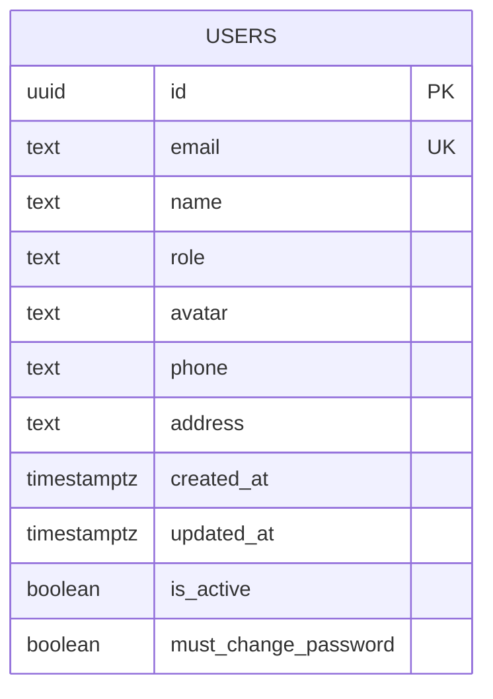
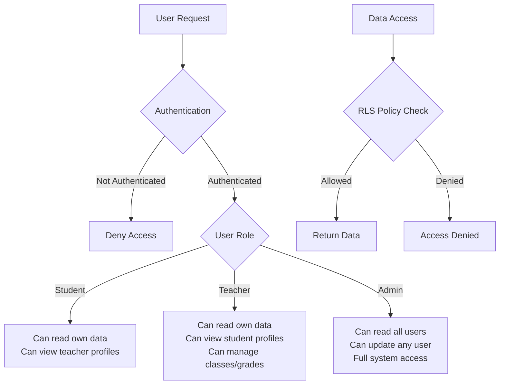
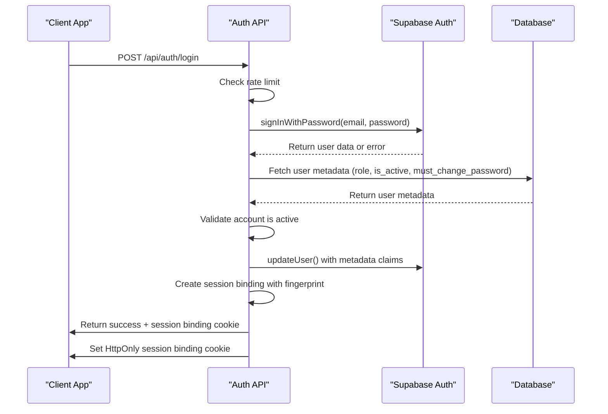
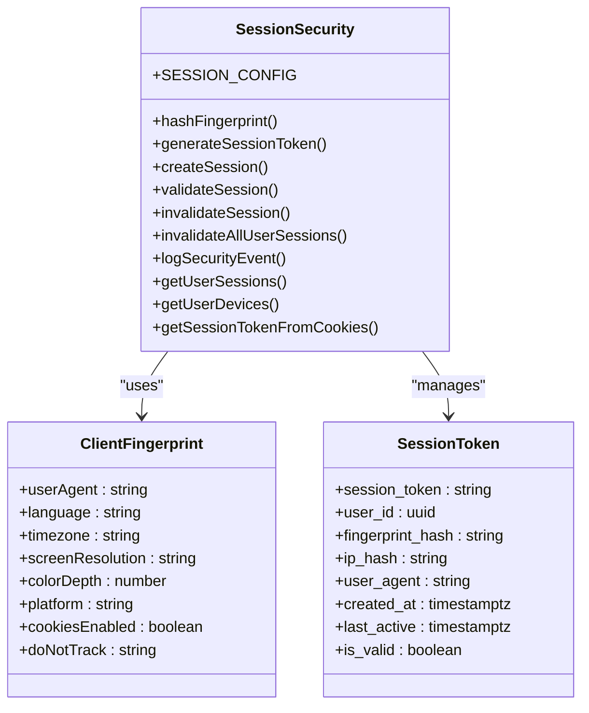
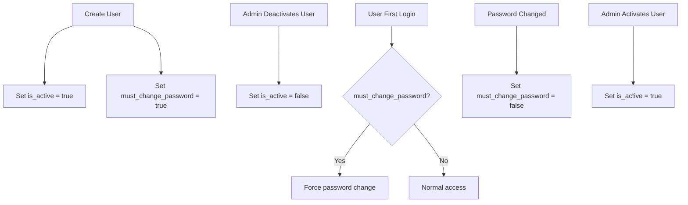
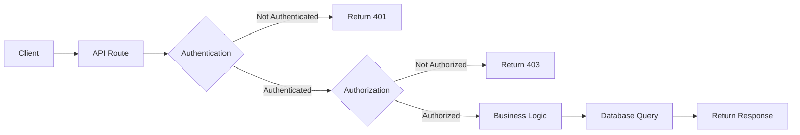

# Users and Authentication

<cite>
**Referenced Files in This Document**   
- [20251219043432_create_users_table.sql](file://supabase/migrations/20251219043432_create_users_table.sql)
- [20251219084313_add_is_active_column.sql](file://supabase/migrations/20251219084313_add_is_active_column.sql)
- [20251219084551_add_must_change_password_column.sql](file://supabase/migrations/20251219084551_add_must_change_password_column.sql)
- [20251219044036_add_rls_policies.sql](file://supabase/migrations/20251219044036_add_rls_policies.sql)
- [20251219082433_add_admin_update_users.sql](file://supabase/migrations/20251219082433_add_admin_update_users.sql)
- [login/route.ts](file://app/api/auth/login/route.ts)
- [me/route.ts](file://app/api/auth/me/route.ts)
- [logout/route.ts](file://app/api/auth/logout/route.ts)
- [toggle-user-status/route.ts](file://app/api/admin/toggle-user-status/route.ts)
- [create-user/route.ts](file://app/api/admin/create-user/route.ts)
- [search-users/route.ts](file://app/api/search-users/route.ts)
- [session-security.ts](file://lib/session-security.ts)
- [server.ts](file://lib/supabase/server.ts)
</cite>

## Table of Contents
1. [Introduction](#introduction)
2. [Users Table Data Model](#users-table-data-model)
3. [Role-Specific Profiles](#role-specific-profiles)
4. [Row Level Security (RLS) Policies](#row-level-security-rls-policies)
5. [Authentication Flow](#authentication-flow)
6. [Session Management and Security](#session-management-and-security)
7. [User Status and Password Management](#user-status-and-password-management)
8. [Access Patterns and API Examples](#access-patterns-and-api-examples)
9. [Conclusion](#conclusion)

## Introduction
This document provides comprehensive documentation for the users table and authentication system in the School Management System. It details the core data model, Row Level Security (RLS) policies, authentication flow, and session management mechanisms. The system is built on Supabase Auth with enhanced security features including session binding, rate limiting, and strict access controls based on user roles (admin, teacher, student).

## Users Table Data Model

The users table serves as the central identity store for the application, containing core user information and metadata that drives access control and application behavior.



**Diagram sources**
- [20251219043432_create_users_table.sql](file://supabase/migrations/20251219043432_create_users_table.sql#L1-L11)
- [20251219084313_add_is_active_column.sql](file://supabase/migrations/20251219084313_add_is_active_column.sql#L2)
- [20251219084551_add_must_change_password_column.sql](file://supabase/migrations/20251219084551_add_must_change_password_column.sql#L2)

**Section sources**
- [20251219043432_create_users_table.sql](file://supabase/migrations/20251219043432_create_users_table.sql#L1-L11)
- [20251219084313_add_is_active_column.sql](file://supabase/migrations/20251219084313_add_is_active_column.sql#L1-L6)
- [20251219084551_add_must_change_password_column.sql](file://supabase/migrations/20251219084551_add_must_change_password_column.sql#L1-L6)

### Core Fields
- **id**: UUID primary key, automatically generated, serves as both Supabase Auth user ID and database record ID
- **email**: Unique text field, used for authentication and identification
- **name**: Full name of the user, displayed throughout the application
- **role**: Text field with constraint to values 'admin', 'teacher', or 'student', determining access privileges
- **is_active**: Boolean flag indicating whether the user account is active (default: true)
- **must_change_password**: Boolean flag indicating whether the user must change their password on first login (default: true)

## Role-Specific Profiles

The system implements role-specific profiles through separate tables that reference the users table via foreign key constraints, enabling specialized data storage for different user types.

```mermaid
erDiagram
USERS {
uuid id PK
text email
text name
text role
boolean is_active
boolean must_change_password
}
STUDENT_PROFILES {
uuid id PK FK
text grade
text section
date enrollment_date
text parent_name
text parent_phone
}
TEACHER_PROFILES {
uuid id PK FK
text subject
text department
date join_date
}
USERS ||--o{ STUDENT_PROFILES : "has"
USERS ||--o{ TEACHER_PROFILES : "has"
```

**Diagram sources**
- [20251219043432_create_users_table.sql](file://supabase/migrations/20251219043432_create_users_table.sql#L13-L31)

**Section sources**
- [20251219043432_create_users_table.sql](file://supabase/migrations/20251219043432_create_users_table.sql#L13-L31)
- [create-user/route.ts](file://app/api/admin/create-user/route.ts#L120-L138)

### Profile Relationships
- **student_profiles**: Contains student-specific information such as grade, section, and parent contact details. The table has a primary key that references the users.id column with ON DELETE CASCADE.
- **teacher_profiles**: Contains teacher-specific information such as subject specialization and department. Similarly, the primary key references users.id with ON DELETE CASCADE.
- When a new user is created with a specific role, the system automatically creates the corresponding profile record in the appropriate table.

## Row Level Security (RLS) Policies

The system implements a comprehensive Row Level Security (RLS) policy framework that enforces strict access controls based on user identity and role, ensuring data isolation and security.



**Diagram sources**
- [20251219044036_add_rls_policies.sql](file://supabase/migrations/20251219044036_add_rls_policies.sql#L1-L18)
- [20251219082433_add_admin_update_users.sql](file://supabase/migrations/20251219082433_add_admin_update_users.sql#L1-L9)

**Section sources**
- [20251219044036_add_rls_policies.sql](file://supabase/migrations/20251219044036_add_rls_policies.sql#L1-L18)
- [20251219082433_add_admin_update_users.sql](file://supabase/migrations/20251219082433_add_admin_update_users.sql#L1-L9)
- [20251219082305_add_write_policies.sql](file://supabase/migrations/20251219082305_add_write_policies.sql#L1-L57)

### Access Control Matrix
| User Role | Self Data Access | Other User Access | Profile Access |
|-----------|------------------|-------------------|----------------|
| Student | Read/Update own record | None | Can view teacher profiles |
| Teacher | Read/Update own record | None | Can view student profiles in their classes |
| Admin | Read/Update own record | Read/Update all users | Full access to all profiles |

### Key RLS Policies
- **Self Access**: All users can read, insert, and update their own records in the users table and their corresponding profile tables (student_profiles or teacher_profiles).
- **Admin Access**: Users with the 'admin' role can update any user record and view all user data.
- **Teacher Access**: Teachers can view student profiles for students enrolled in their classes, implemented through the search-users API which enforces this scoping.
- **Student Access**: Students can only search for and view teacher profiles, not other students.

## Authentication Flow

The authentication system integrates Supabase Auth with custom security enhancements to provide a secure and user-friendly login experience.



**Diagram sources**
- [login/route.ts](file://app/api/auth/login/route.ts#L7-L117)
- [session-security.ts](file://lib/session-security.ts#L68-L147)

**Section sources**
- [login/route.ts](file://app/api/auth/login/route.ts#L7-L117)
- [me/route.ts](file://app/api/auth/me/route.ts#L4-L28)
- [logout/route.ts](file://app/api/auth/logout/route.ts#L6-L36)

### Authentication Process
1. **Rate Limiting**: The system enforces rate limiting (5 attempts per minute) to prevent brute force attacks.
2. **Credential Validation**: Uses Supabase Auth to validate email and password credentials.
3. **Account Status Check**: After successful authentication, the system checks the user's is_active status and blocks access if the account is deactivated.
4. **Metadata Injection**: User role and password change requirements are injected into the JWT token to reduce subsequent database queries.
5. **Session Binding**: Creates a session binding with client fingerprint data to detect session hijacking attempts.

## Session Management and Security

The system implements advanced session management with security features designed to prevent session hijacking and unauthorized access.



**Diagram sources**
- [session-security.ts](file://lib/session-security.ts#L1-L373)
- [server.ts](file://lib/supabase/server.ts#L36-L51)

**Section sources**
- [session-security.ts](file://lib/session-security.ts#L1-L373)
- [server.ts](file://lib/supabase/server.ts#L36-L51)

### Security Features
- **Fingerprint Binding**: Each session is bound to a cryptographic hash of client fingerprint data (user agent, screen resolution, timezone, etc.).
- **IP Change Detection**: The system can detect and respond to IP address changes during a session.
- **Single Session Enforcement**: When a user logs in, all previous sessions are automatically invalidated.
- **HttpOnly Cookies**: Session binding tokens are stored in HttpOnly, Secure, SameSite cookies to prevent XSS attacks.
- **Server-Side Validation**: All API requests validate the session binding token against the stored fingerprint.

## User Status and Password Management

The system provides mechanisms for managing user account status and enforcing password policies to enhance security.



**Diagram sources**
- [20251219084313_add_is_active_column.sql](file://supabase/migrations/20251219084313_add_is_active_column.sql#L1-L6)
- [20251219084551_add_must_change_password_column.sql](file://supabase/migrations/20251219084551_add_must_change_password_column.sql#L1-L6)
- [toggle-user-status/route.ts](file://app/api/admin/toggle-user-status/route.ts#L15-L62)

**Section sources**
- [20251219084313_add_is_active_column.sql](file://supabase/migrations/20251219084313_add_is_active_column.sql#L1-L6)
- [20251219084551_add_must_change_password_column.sql](file://supabase/migrations/20251219084551_add_must_change_password_column.sql#L1-L6)
- [toggle-user-status/route.ts](file://app/api/admin/toggle-user-status/route.ts#L15-L62)
- [create-user/route.ts](file://app/api/admin/create-user/route.ts#L111-L112)

### Key Fields
- **is_active**: Controls whether a user can access the system. When set to false, the user is immediately signed out and cannot log back in. Admins can toggle this status via the admin interface.
- **must_change_password**: Indicates whether a user must change their password upon first login. This is automatically set to true for new accounts and set to false after the user changes their password.

### Management Workflows
- **Account Creation**: When an admin creates a user, must_change_password is set to true, requiring the user to change their password on first login.
- **Account Deactivation**: Admins can deactivate user accounts through the toggle-user-status API, which sets is_active to false and immediately invalidates any active sessions.
- **Password Enforcement**: During login, if must_change_password is true, the client application redirects the user to the change-password page.

## Access Patterns and API Examples

The system implements secure access patterns through API routes that enforce business logic and security policies.



**Diagram sources**
- [search-users/route.ts](file://app/api/search-users/route.ts#L6-L138)
- [create-user/route.ts](file://app/api/admin/create-user/route.ts#L8-L156)

**Section sources**
- [search-users/route.ts](file://app/api/search-users/route.ts#L6-L138)
- [create-user/route.ts](file://app/api/admin/create-user/route.ts#L8-L156)
- [toggle-user-status/route.ts](file://app/api/admin/toggle-user-status/route.ts#L15-L62)

### Secure Query Examples
**Admin: Get all active users**
```sql
SELECT id, name, email, role 
FROM users 
WHERE is_active = true 
AND id != auth.uid()
ORDER BY name;
```

**Teacher: Search students in their classes**
```sql
-- First get class IDs
SELECT id FROM classes WHERE teacher_id = auth.uid();

-- Then get enrolled students
SELECT u.id, u.name, u.avatar, u.role 
FROM users u
JOIN class_students cs ON u.id = cs.student_id
WHERE cs.class_id IN (/* teacher's class IDs */)
AND u.name ILIKE '%search_term%'
AND u.is_active = true;
```

**Student: Search teachers**
```sql
SELECT id, name, avatar, role 
FROM users 
WHERE role = 'teacher' 
AND name ILIKE '%search_term%'
AND is_active = true;
```

### API Access Patterns
- **Role-Based Access Control**: All API routes first verify the user's role before proceeding with business logic.
- **Input Validation**: Uses Zod for schema validation to prevent malformed requests.
- **Rate Limiting**: Implements rate limiting on authentication and search endpoints.
- **CSRF Protection**: Validates request origin headers to prevent cross-site request forgery.
- **Service Role Usage**: Administrative operations use the Supabase service role key to bypass RLS policies when necessary.

## Conclusion
The users and authentication system in the School Management System provides a robust foundation for secure user management with fine-grained access controls. The combination of Supabase Auth with custom RLS policies, session binding, and role-based access ensures that user data is protected while enabling the necessary functionality for different user types. The system's design prioritizes security through features like rate limiting, session hijacking detection, and strict data access controls, while maintaining usability through intuitive workflows for account management and authentication.