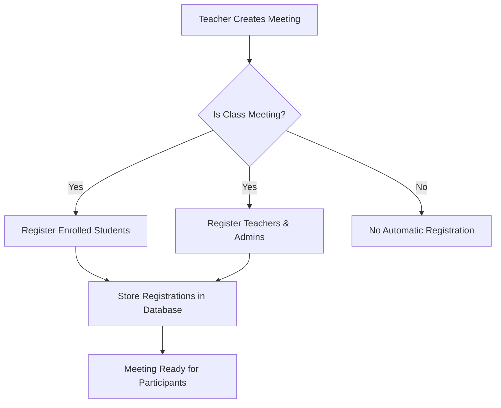
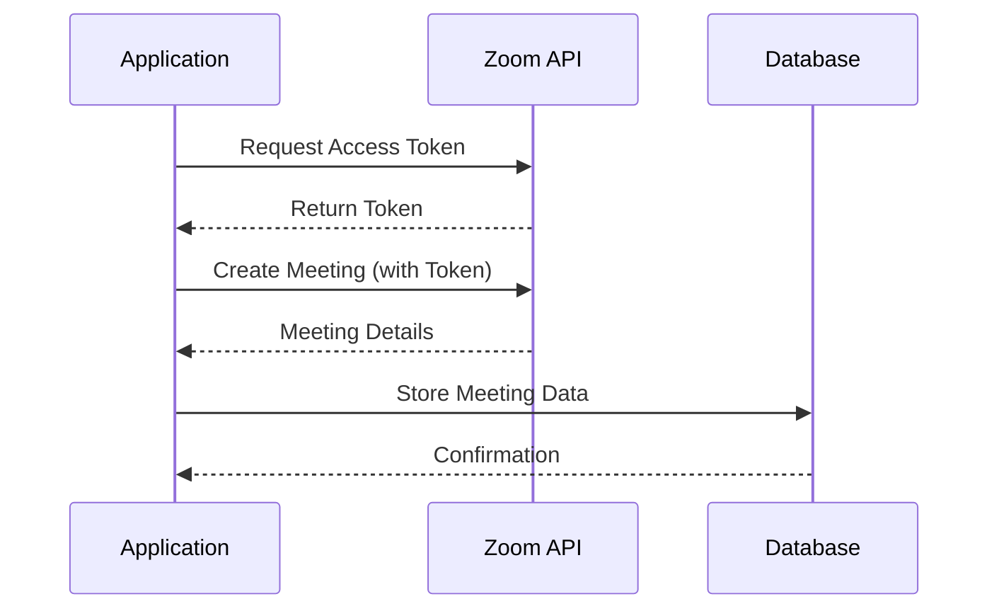
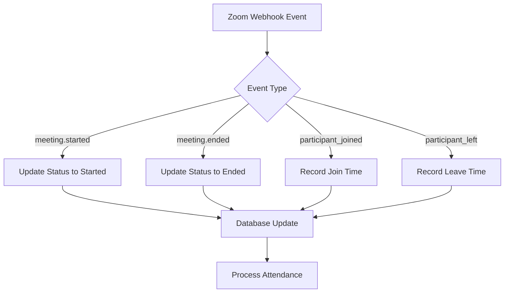
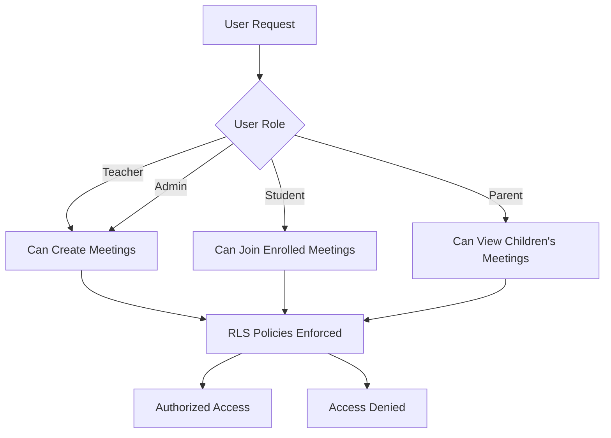
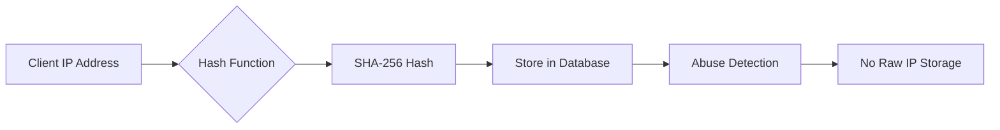

# Zoom Meeting Integration

<cite>
**Referenced Files in This Document**   
- [20260110000001_create_zoom_meetings_table.sql](file://supabase/migrations/20260110000001_create_zoom_meetings_table.sql)
- [20260110000002_create_meeting_registrants_table.sql](file://supabase/migrations/20260110000002_create_meeting_registrants_table.sql)
- [20260110000003_hash_ip_addresses.sql](file://supabase/migrations/20260110000003_hash_ip_addresses.sql)
- [route.ts](file://app/api/zoom/meetings/route.ts)
- [route.ts](file://app/api/zoom/webhook/route.ts)
- [client.ts](file://lib/zoom/client.ts)
- [register-student/route.ts](file://app/api/zoom/meetings/register-student/route.ts)
- [route.ts](file://app/api/zoom/meetings/[id]/route.ts)
- [route.ts](file://app/api/zoom/meetings/[id]/participants/route.ts)
- [types.ts](file://lib/zoom/types.ts)
- [constants.ts](file://lib/zoom/constants.ts)
</cite>

## Table of Contents
1. [Introduction](#introduction)
2. [Database Schema](#database-schema)
3. [Meeting Creation and Enrollment](#meeting-creation-and-enrollment)
4. [Zoom API Integration](#zoom-api-integration)
5. [Webhook Handling and Attendance Synchronization](#webhook-handling-and-attendance-synchronization)
6. [Security and Access Control](#security-and-access-control)
7. [Performance Considerations](#performance-considerations)
8. [Data Privacy](#data-privacy)
9. [Conclusion](#conclusion)

## Introduction
The Zoom Meeting Integration system enables virtual class sessions within the school management platform. This documentation details the implementation of the `zoom_meetings` and `meeting_registrants` tables, their relationship to academic classes, and the integration with Zoom's API for seamless virtual classroom experiences. The system supports automatic enrollment, real-time attendance tracking, and secure access controls while maintaining student privacy through IP address hashing.

## Database Schema

### zoom_meetings Table
The `zoom_meetings` table stores comprehensive information about scheduled Zoom meetings linked to academic classes. Key fields include:

- **id**: Unique identifier for the meeting (UUID)
- **class_id**: Foreign key linking the meeting to a specific class
- **zoom_meeting_id**: Unique identifier from Zoom's API
- **start_url**: URL for the host to start the meeting
- **join_url**: URL for participants to join the meeting
- **status**: Current status of the meeting (scheduled, started, ended, cancelled)
- **start_time**: Scheduled start time of the meeting (TIMESTAMPTZ)
- **duration**: Duration of the meeting in minutes

The table includes RLS (Row Level Security) policies that control access based on user roles and relationships to classes, ensuring that only authorized users can view or modify meetings.

**Section sources**
- [20260110000001_create_zoom_meetings_table.sql](file://supabase/migrations/20260110000001_create_zoom_meetings_table.sql#L2-L21)

### meeting_registrants Table
The `meeting_registrants` table manages registration information for Zoom meetings, particularly for class sessions. Key fields include:

- **meeting_id**: Foreign key referencing the zoom_meetings table
- **user_id**: Foreign key referencing the users table
- **join_time**: Timestamp when the user joined the meeting
- **leave_time**: Timestamp when the user left the meeting
- **status**: Registration status (pending, approved, denied)

This table enables the system to track which students are registered for class meetings and ensures they can bypass Zoom's waiting room through pre-registration.

**Section sources**
- [20260110000002_create_meeting_registrants_table.sql](file://supabase/migrations/20260110000002_create_meeting_registrants_table.sql#L2-L13)

## Meeting Creation and Enrollment

### Automatic Meeting Registration
When a teacher creates a meeting for a class, the system automatically registers all enrolled students and staff members. This process occurs in the POST handler of the meetings API route, where after creating a meeting in Zoom, the system calls helper functions to register class participants.

For class meetings, enrolled students with valid DepEd email addresses (@r1.deped.gov.ph) are automatically registered. This registration grants them approved status and a unique join URL, allowing them to bypass the waiting room when joining the meeting. Similarly, all teachers and administrators are registered for class meetings, enabling them to join without waiting.

**Diagram sources**
- [route.ts](file://app/api/zoom/meetings/route.ts#L134-L141)
- [20260110000002_create_meeting_registrants_table.sql](file://supabase/migrations/20260110000002_create_meeting_registrants_table.sql#L2-L13)

### Student Enrollment in Meetings
When a student is enrolled in a class, they are automatically registered for all upcoming meetings for that class. This functionality is handled by the register-student API endpoint, which is accessible only to administrators.

The registration process verifies that the student has a valid DepEd email address before registering them with Zoom. For each upcoming meeting with registration enabled, the system checks if the student is already registered and, if not, creates a registration record both in Zoom and in the local database.

**Section sources**
- [register-student/route.ts](file://app/api/zoom/meetings/register-student/route.ts#L9-L116)

## Zoom API Integration

### Server-to-Server OAuth Authentication
The system uses Zoom's Server-to-Server OAuth authentication method to interact with the Zoom API. This approach eliminates the need for user-level authorization and enables backend operations without user interaction.

The authentication process involves obtaining an access token using the Zoom account ID, client ID, and client secret. The token is cached for performance, with logic to refresh it when nearing expiration. This authentication method provides secure, programmatic access to Zoom's API endpoints for meeting management.

**Diagram sources**
- [client.ts](file://lib/zoom/client.ts#L20-L54)
- [route.ts](file://app/api/zoom/meetings/route.ts#L91-L121)

### Meeting Lifecycle Management
The system provides comprehensive meeting lifecycle management through API endpoints that handle creation, updating, and deletion of meetings. When creating a meeting, the system first creates it in Zoom via the API and then stores the details in the local database.

The integration includes functionality to update meeting details and settings, with changes synchronized between the local database and Zoom. When a meeting is deleted, the system removes it from both Zoom and the local database, maintaining data consistency across systems.

**Section sources**
- [client.ts](file://lib/zoom/client.ts#L92-L173)
- [route.ts](file://app/api/zoom/meetings/[id]/route.ts#L40-L125)

## Webhook Handling and Attendance Synchronization

### Webhook Event Processing
The system implements a webhook endpoint to receive real-time notifications from Zoom about meeting events. This endpoint handles several key events:

- **meeting.started**: Updates the meeting status to "started" in the database
- **meeting.ended**: Updates the meeting status to "ended" and processes final attendance
- **meeting.participant_joined**: Records when participants join the meeting
- **meeting.participant_left**: Records when participants leave the meeting

The webhook handler verifies the authenticity of incoming requests using Zoom's signature verification mechanism, ensuring that only legitimate events from Zoom are processed.

**Diagram sources**
- [route.ts](file://app/api/zoom/webhook/route.ts#L83-L129)

### Attendance Synchronization
Attendance data is synchronized between Zoom and the school management system through the webhook integration. When participants join or leave meetings, the system captures their join and leave times, calculating their duration of participation.

For class meetings, this duration data is used to automatically update attendance records. Students who participate for at least 15 minutes are marked as "present," those who participate for less time are marked as "partial," and those who do not join are marked as "absent." This automated process eliminates manual attendance taking and ensures accurate records.

The system handles edge cases such as participants who join and leave multiple times by accumulating their total duration across sessions.

**Section sources**
- [route.ts](file://app/api/zoom/webhook/route.ts#L126-L129)
- [route.ts](file://app/api/zoom/webhook/route.ts#L254-L341)

## Security and Access Control

### Row Level Security Policies
The system implements comprehensive Row Level Security (RLS) policies to control access to meeting data based on user roles and relationships. These policies ensure that users can only access meetings they are authorized to view.

For the `zoom_meetings` table, access is granted based on:
- Host ownership of the meeting
- Target audience settings (all, students, teachers, class-specific)
- Class enrollment (students enrolled in a class or teachers of that class)
- Parental relationship (parents can view meetings for their children's classes)
- Administrative privileges

Similarly, the `meeting_registrants` table has RLS policies that allow users to view their own registrations, teachers to view registrations for their meetings, and administrators to view all registrations.

**Diagram sources**
- [20260110000001_create_zoom_meetings_table.sql](file://supabase/migrations/20260110000001_create_zoom_meetings_table.sql#L51-L92)
- [20260110000002_create_meeting_registrants_table.sql](file://supabase/migrations/20260110000002_create_meeting_registrants_table.sql#L23-L47)

### Email Domain Restrictions
To ensure security and compliance, the system restricts class meeting participation to users with valid DepEd email addresses (@r1.deped.gov.ph). This restriction is enforced through the `isAllowedEmail` function, which validates email domains before allowing registration or participation.

This domain restriction prevents unauthorized users from joining class sessions while allowing legitimate participants to join without additional verification steps.

**Section sources**
- [constants.ts](file://lib/zoom/constants.ts#L5-L14)
- [client.ts](file://lib/zoom/client.ts#L237-L243)

## Performance Considerations

### Batch Processing for Large Meetings
When registering participants for large meetings, the system implements batch processing to avoid rate limiting and ensure reliable operation. The `addMeetingRegistrantsBatch` function processes registrants in batches of 10, with small delays between batches to respect Zoom's rate limits.

This approach prevents overwhelming the Zoom API with simultaneous requests and provides graceful error handling when individual registration attempts fail. The system continues processing remaining registrants even if some registrations fail, ensuring that most participants are successfully registered.

### Database Indexing
The database schema includes strategic indexes to optimize query performance for common operations:

- Index on `zoom_meetings.class_id` for quickly retrieving meetings by class
- Index on `zoom_meetings.start_time` for time-based queries
- Index on `zoom_meetings.status` for filtering by meeting status
- Composite indexes on foreign key relationships for join operations

These indexes ensure that meeting retrieval and participant queries perform efficiently even as the dataset grows.

**Section sources**
- [20260110000001_create_zoom_meetings_table.sql](file://supabase/migrations/20260110000001_create_zoom_meetings_table.sql#L39-L45)
- [client.ts](file://lib/zoom/client.ts#L285-L304)

## Data Privacy

### IP Address Hashing
To protect user privacy while still enabling abuse detection, the system implements IP address hashing. Instead of storing raw IP addresses, the system stores SHA-256 hashes of client IP addresses.

This approach allows the system to detect suspicious patterns (such as multiple accounts from the same IP) without storing personally identifiable information. The hashing is implemented at the database level, with a dedicated column for the hashed IP values.

The migration includes a comment explaining the purpose of the hashed IP column, documenting its use for "privacy-preserving abuse detection."

**Diagram sources**
- [20260110000003_hash_ip_addresses.sql](file://supabase/migrations/20260110000003_hash_ip_addresses.sql#L5-L17)

### Data Minimization
The system follows data minimization principles by only storing necessary information about meeting participants. Personal data is limited to what is required for meeting functionality and attendance tracking.

The RLS policies ensure that sensitive meeting data is only accessible to authorized users, preventing unauthorized access to participant information. Additionally, the system does not store unnecessary personal details beyond what is required for identification and communication purposes.

**Section sources**
- [20260110000003_hash_ip_addresses.sql](file://supabase/migrations/20260110000003_hash_ip_addresses.sql#L1-L18)

## Conclusion
The Zoom Meeting Integration system provides a robust solution for virtual class sessions within the school management platform. By leveraging Zoom's API and implementing comprehensive database design, the system enables seamless virtual classroom experiences with automated enrollment, real-time attendance tracking, and secure access controls.

Key features include automatic registration of students and staff for class meetings, real-time attendance synchronization through webhook integration, and strict security controls through Row Level Security policies. The system also prioritizes data privacy through IP address hashing and follows best practices for performance optimization with batch processing and strategic database indexing.

This integration enhances the educational experience by providing reliable virtual classroom capabilities while maintaining the security and privacy standards required for an educational institution.