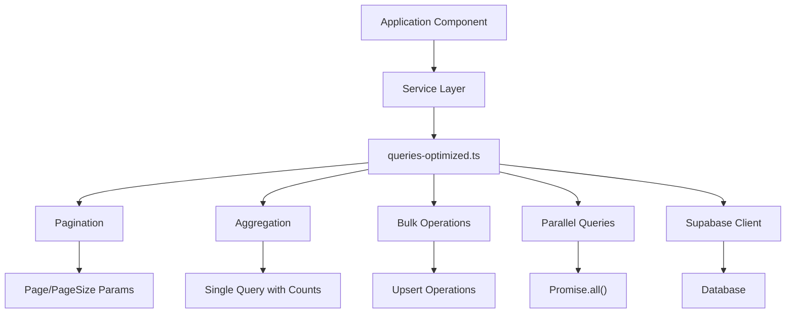
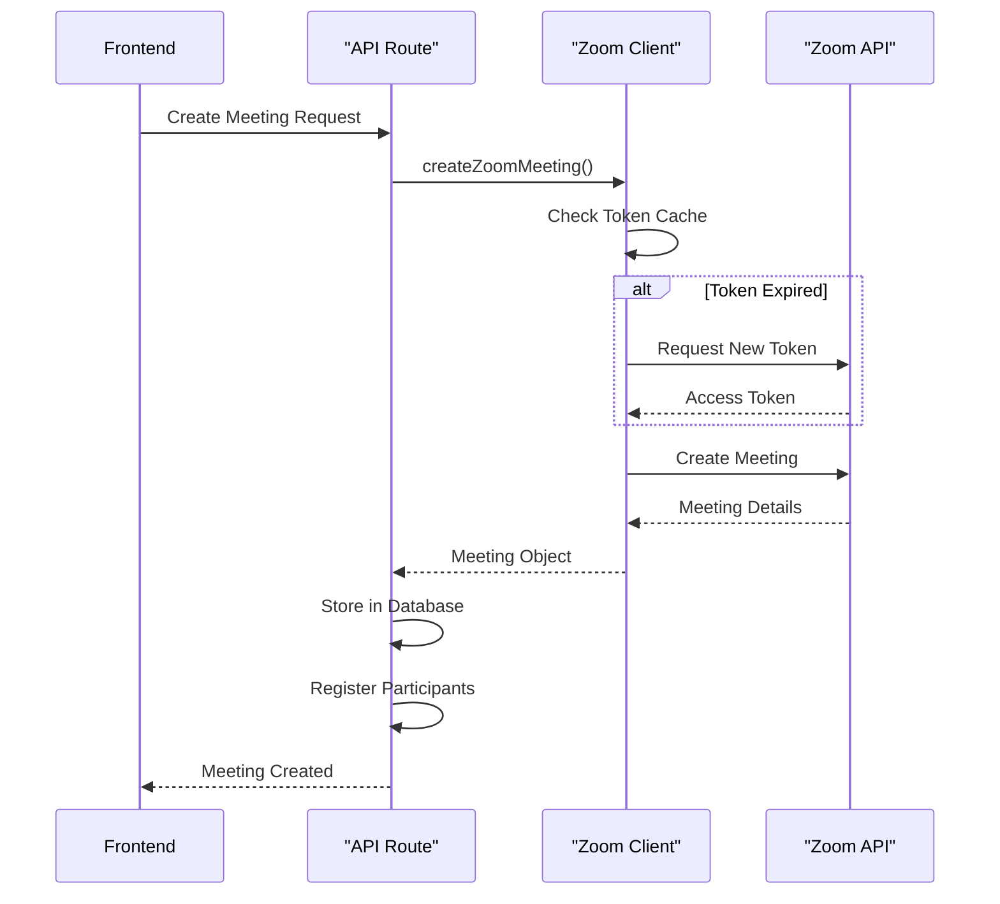
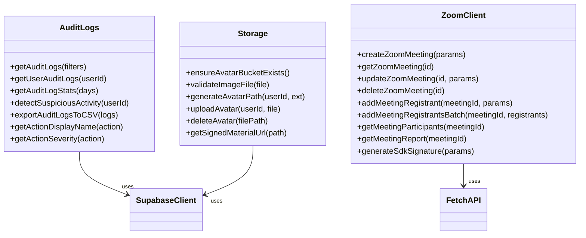

# Service Layer

<cite>
**Referenced Files in This Document**   
- [lib/supabase/client.ts](file://lib/supabase/client.ts)
- [lib/supabase/server.ts](file://lib/supabase/server.ts)
- [lib/supabase/queries.ts](file://lib/supabase/queries.ts)
- [lib/supabase/queries-optimized.ts](file://lib/supabase/queries-optimized.ts)
- [lib/supabase/audit-logs.ts](file://lib/supabase/audit-logs.ts)
- [lib/supabase/storage.ts](file://lib/supabase/storage.ts)
- [lib/zoom/client.ts](file://lib/zoom/client.ts)
- [lib/zoom/constants.ts](file://lib/zoom/constants.ts)
- [lib/zoom/types.ts](file://lib/zoom/types.ts)
- [lib/zoom/index.ts](file://lib/zoom/index.ts)
- [app/api/zoom/meetings/route.ts](file://app/api/zoom/meetings/route.ts)
- [app/api/zoom/webhook/route.ts](file://app/api/zoom/webhook/route.ts)
- [lib/supabase/types.ts](file://lib/supabase/types.ts)
- [lib/supabase/middleware.ts](file://lib/supabase/middleware.ts)
</cite>

## Table of Contents
1. [Introduction](#introduction)
2. [Supabase Client Implementation](#supabase-client-implementation)
3. [Query Abstraction Layer](#query-abstraction-layer)
4. [Zoom API Integration](#zoom-api-integration)
5. [Utility Modules](#utility-modules)
6. [Service Composition and Error Handling](#service-composition-and-error-handling)
7. [Performance Considerations](#performance-considerations)
8. [API Route Usage Examples](#api-route-usage-examples)
9. [Conclusion](#conclusion)

## Introduction
The service layer in the School Management System provides a comprehensive set of utilities and abstractions for interacting with external services and databases. This documentation details the implementation of key components in the lib/ directory, focusing on the Supabase client wrapper, query abstraction layer, Zoom API integration, and utility modules. The architecture is designed to provide type-safe, efficient, and secure access to data and third-party services while maintaining separation of concerns and reusability across the application.

## Supabase Client Implementation

The Supabase client implementation provides a robust wrapper around the Supabase SDK with specialized configurations for different execution contexts. The implementation is split into two main components: the browser client and the server client, each optimized for their respective environments.

The browser client in `client.ts` creates a Supabase client instance configured for client-side operations. It uses environment variables for the Supabase URL and anonymous key, enabling secure access to the database from the frontend while respecting Row Level Security (RLS) policies. This client is designed for read operations and user-initiated actions that should be subject to RLS enforcement.

The server client in `server.ts` provides two distinct client creation functions. The `createClient()` function is tailored for server components in Next.js, integrating with Next.js headers to manage authentication cookies automatically. It implements proper cookie handling for session management, with error handling for cases where cookie operations are called from Server Components. The `createAdminClient()` function creates a privileged client that bypasses RLS policies by using the service role key. This admin client is intended for use in webhooks, background jobs, and other server-side operations that require elevated privileges and don't have a user context.

Both client implementations follow security best practices by validating the presence of required environment variables and providing clear error messages when configuration is missing. The separation of client types ensures that RLS policies are respected in user-facing operations while allowing necessary administrative functions to operate with appropriate privileges.

**Section sources**
- [lib/supabase/client.ts](file://lib/supabase/client.ts#L1-L9)
- [lib/supabase/server.ts](file://lib/supabase/server.ts#L1-L51)

## Query Abstraction Layer

The query abstraction layer provides a comprehensive set of data access functions that encapsulate database operations and provide type-safe interfaces for the application. The implementation is split across two files: `queries.ts` and `queries-optimized.ts`, representing a migration path from basic queries to performance-optimized versions.

The basic queries in `queries.ts` provide straightforward implementations for common data access patterns. These functions follow a consistent pattern of creating a Supabase client, executing a query with appropriate selects and filters, and handling errors by throwing exceptions. The queries include comprehensive joins to fetch related data, such as retrieving users with their student or teacher profiles, classes with their teachers, and attendance records with student information. This reduces the need for multiple round trips to the database in the application code.

The optimized queries in `queries-optimized.ts` introduce several performance improvements. Pagination is implemented through the `PaginationParams` interface and `PaginatedResponse` type, allowing clients to request specific page sizes and receive metadata about total counts and pages. This prevents performance issues with large datasets by limiting result sizes. The optimized queries also implement exact counting with `count: "exact"` to provide accurate pagination information.

Key performance optimizations include:
- **Aggregation queries**: The `getClassesWithCounts()` function retrieves class data with enrollment counts in a single query, eliminating N+1 query problems.
- **Date range filtering**: Attendance and grade queries support date ranges to limit result sets.
- **Bulk operations**: Functions like `bulkInsertGrades()` and `bulkUpdateAttendance()` use upsert operations for efficient batch processing.
- **Parallel execution**: The `getDashboardStats()` function uses `Promise.all()` to execute multiple count queries in parallel, reducing overall response time.

The query layer also includes specialized aggregation functions for dashboard statistics, combining multiple data points into single responses to minimize client-server round trips. This approach significantly improves performance for data-intensive views like administrative dashboards.

**Diagram sources **
- [lib/supabase/queries.ts](file://lib/supabase/queries.ts#L1-L419)
- [lib/supabase/queries-optimized.ts](file://lib/supabase/queries-optimized.ts#L1-L317)

**Section sources**
- [lib/supabase/queries.ts](file://lib/supabase/queries.ts#L1-L419)
- [lib/supabase/queries-optimized.ts](file://lib/supabase/queries-optimized.ts#L1-L317)

## Zoom API Integration

The Zoom API integration provides a comprehensive client for managing Zoom meetings, participants, and registrations within the school management system. The implementation uses Zoom's Server-to-Server OAuth authentication, which is more secure than traditional API key authentication as it doesn't require storing long-lived credentials.

The core of the integration is in `client.ts`, which implements a token management system with caching to minimize authentication requests. The `getAccessToken()` function checks for a valid cached token before requesting a new one, reducing API overhead. The token cache includes expiration tracking with a 5-minute buffer to ensure tokens are refreshed before they expire.

The client provides functions for the full lifecycle of Zoom meetings:
- **Creation**: The `createZoomMeeting()` function creates scheduled meetings with configurable settings, including automatic registration for class meetings.
- **Management**: Functions for updating and deleting meetings provide complete control over meeting properties.
- **Participant management**: The integration supports both individual and batch registration of participants, with error handling and retry logic.
- **Reporting**: Functions to retrieve meeting participants and reports enable post-meeting analysis.

Security features include:
- **Domain restriction**: The `constants.ts` file defines `ALLOWED_EMAIL_DOMAIN` to restrict meeting access to institutional emails.
- **Waiting room configuration**: All meetings have waiting rooms enabled, with registered users automatically bypassing them.
- **SDK signature generation**: The `generateSdkSignature()` function creates secure signatures for client-side meeting joining.

The integration also includes webhook handling in `webhook/route.ts`, which processes events from Zoom such as meeting start/end and participant join/leave. This enables real-time updates to the application's state, including automatic attendance tracking based on meeting participation duration.

**Diagram sources **
- [lib/zoom/client.ts](file://lib/zoom/client.ts#L1-L334)
- [lib/zoom/constants.ts](file://lib/zoom/constants.ts#L1-L22)
- [app/api/zoom/meetings/route.ts](file://app/api/zoom/meetings/route.ts#L1-L345)
- [app/api/zoom/webhook/route.ts](file://app/api/zoom/webhook/route.ts#L1-L342)

**Section sources**
- [lib/zoom/client.ts](file://lib/zoom/client.ts#L1-L334)
- [lib/zoom/constants.ts](file://lib/zoom/constants.ts#L1-L22)
- [lib/zoom/types.ts](file://lib/zoom/types.ts#L1-L168)
- [lib/zoom/index.ts](file://lib/zoom/index.ts#L1-L10)

## Utility Modules

The service layer includes several utility modules that provide specialized functionality for audit logging, file storage, and other cross-cutting concerns.

The audit logging module in `audit-logs.ts` provides comprehensive functions for querying and analyzing authentication and user activity logs. It includes pagination support, filtering by various criteria (user, action, date range, IP address), and statistical analysis functions. The module also includes security features such as CSV export with formula injection protection and severity classification for different audit actions. The `detectSuspiciousActivity()` function implements pattern detection for potential security issues like multiple failed login attempts.

The storage module in `storage.ts` handles file operations for user avatars and lesson materials. It implements several security and validation measures:
- **File type validation**: Only allows specific image MIME types (JPEG, PNG, WebP).
- **Size limits**: Enforces a 5MB limit on avatar uploads.
- **Secure naming**: Uses UUIDs to prevent predictable filenames.
- **Content type enforcement**: Explicitly sets content types to prevent MIME type sniffing attacks.
- **Signed URLs**: Generates time-limited signed URLs for private materials, reducing from 1 hour to 5 minutes for enhanced security.

The module also includes bucket management functions to ensure the avatar bucket exists with appropriate configuration. The `uploadAvatar()` function implements a multi-step validation process, checking file type and size before upload, and using the Supabase storage API with explicit content type headers to prevent security vulnerabilities.

**Diagram sources **
- [lib/supabase/audit-logs.ts](file://lib/supabase/audit-logs.ts#L1-L321)
- [lib/supabase/storage.ts](file://lib/supabase/storage.ts#L1-L110)

**Section sources**
- [lib/supabase/audit-logs.ts](file://lib/supabase/audit-logs.ts#L1-L321)
- [lib/supabase/storage.ts](file://lib/supabase/storage.ts#L1-L110)

## Service Composition and Error Handling

The service layer demonstrates effective patterns for service composition and error handling. Services are designed to be composable, allowing higher-level operations to combine multiple service calls into cohesive workflows.

In the Zoom meeting creation flow, multiple services are composed to create a complete meeting experience:
1. The Zoom API client creates the meeting
2. The Supabase client stores meeting details in the database
3. Participant registration services add authorized users
4. Calendar services create corresponding calendar events
5. Notification services alert relevant users

Error handling follows a consistent pattern across the service layer:
- **Immediate validation**: Input parameters are validated at the start of functions
- **Specific error messages**: Errors provide clear information about what went wrong
- **Graceful degradation**: Secondary operations (like participant registration) fail without preventing primary functionality
- **Comprehensive logging**: Errors are logged with context for debugging

The implementation also includes retry mechanisms, particularly in the `addMeetingRegistrantsBatch()` function, which processes registrations in batches with delays between them to respect rate limits. This prevents overwhelming the Zoom API while ensuring all participants are registered.

The middleware in `middleware.ts` demonstrates another aspect of service composition, integrating Supabase authentication with Next.js request handling. It updates the session state and returns both the user object and response object, enabling authentication state to be used throughout the request lifecycle.

**Section sources**
- [app/api/zoom/meetings/route.ts](file://app/api/zoom/meetings/route.ts#L1-L345)
- [app/api/zoom/webhook/route.ts](file://app/api/zoom/webhook/route.ts#L1-L342)
- [lib/supabase/middleware.ts](file://lib/supabase/middleware.ts#L1-L38)

## Performance Considerations

The service layer incorporates several performance optimization strategies to ensure responsive user experiences and efficient resource utilization.

**Caching strategies** are implemented at multiple levels:
- **Token caching**: The Zoom client caches access tokens to avoid repeated authentication requests
- **Query optimization**: The optimized queries use Supabase's built-in caching and efficient query patterns
- **Client-side caching**: The Supabase client leverages browser caching for repeated queries

**Connection management** follows best practices:
- **Connection pooling**: Supabase manages connection pooling automatically
- **Efficient client reuse**: Client instances are created once per request and reused
- **Proper cleanup**: The admin client doesn't persist sessions, preventing connection leaks

**Database optimization techniques** include:
- **Index utilization**: Queries are designed to leverage database indexes
- **Selective field selection**: Queries only retrieve needed fields
- **Batch operations**: Bulk inserts and upserts reduce round trips
- **Parallel execution**: Independent queries are executed in parallel using Promise.all()

The implementation also considers network efficiency:
- **Payload size optimization**: Responses are limited to necessary data
- **Compression**: Supabase automatically compresses responses
- **Efficient data transfer**: Binary data (like images) is handled through direct URLs rather than in-line in API responses

These performance considerations ensure that the service layer can handle the demands of a school management system with potentially thousands of users and high-concurrency scenarios like class meetings and grade submissions.

**Section sources**
- [lib/supabase/queries-optimized.ts](file://lib/supabase/queries-optimized.ts#L1-L317)
- [lib/zoom/client.ts](file://lib/zoom/client.ts#L1-L334)
- [lib/supabase/server.ts](file://lib/supabase/server.ts#L1-L51)

## API Route Usage Examples

The service layer components are consumed by API routes throughout the application, demonstrating their reusability and integration patterns.

In the Zoom meetings API route, multiple services are composed to handle meeting creation:
- The Supabase server client provides authentication and database access
- The Zoom client handles external API communication
- Validation functions ensure proper authorization
- Utility functions process dates and generate notifications

The route follows a clear pattern:
1. Authentication and authorization checks
2. Input validation
3. External service calls (Zoom API)
4. Database operations (Supabase)
5. Secondary operations (participant registration, notifications)
6. Error handling with appropriate status codes

The webhook route demonstrates another usage pattern, where the admin client is used to bypass RLS policies when processing events from external systems. This allows the webhook to update database records without requiring user authentication, which is appropriate for server-to-server communication.

Other API routes in the admin namespace use the query services extensively, importing functions from `queries-optimized.ts` to retrieve paginated, filtered data for administrative interfaces. This consistent usage pattern ensures that all data access follows the same performance and security guidelines.

**Section sources**
- [app/api/zoom/meetings/route.ts](file://app/api/zoom/meetings/route.ts#L1-L345)
- [app/api/zoom/webhook/route.ts](file://app/api/zoom/webhook/route.ts#L1-L342)
- [app/api/admin/students/route.ts](file://app/api/admin/students/route.ts#L1-L50)

## Conclusion

The service layer in the School Management System provides a robust, secure, and performant foundation for the application. The Supabase client wrapper effectively manages different authentication contexts, while the query abstraction layer offers both basic and optimized data access patterns. The Zoom API integration demonstrates secure third-party service integration with comprehensive error handling and security features.

Key strengths of the implementation include:
- Clear separation of concerns between different service components
- Consistent error handling and validation patterns
- Performance optimizations for common use cases
- Security considerations throughout the implementation
- Reusable, composable service functions

The architecture supports the complex requirements of a school management system while maintaining code quality and developer productivity. By providing well-defined interfaces and abstractions, the service layer enables consistent data access patterns across the application while allowing for performance optimizations and security enhancements to be implemented in a centralized manner.