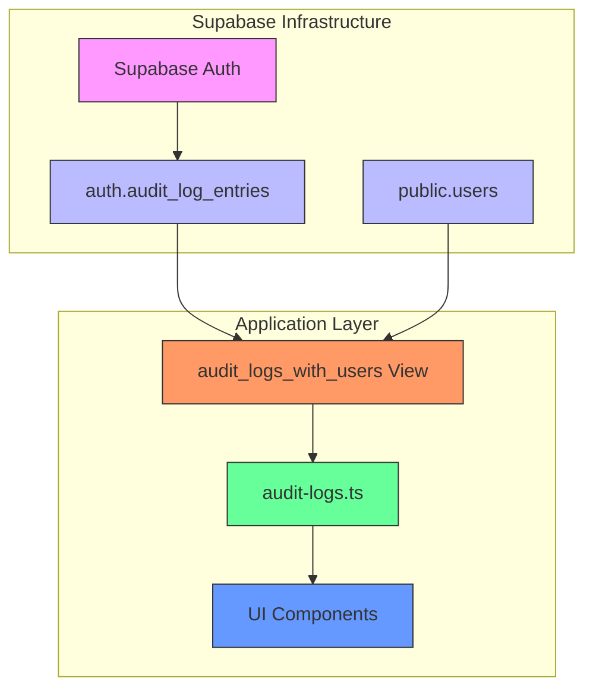
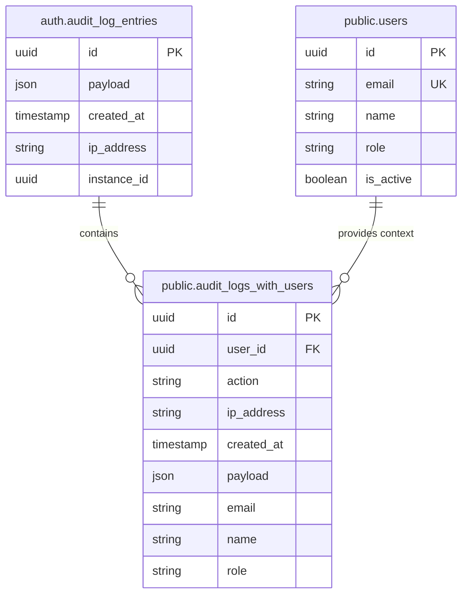
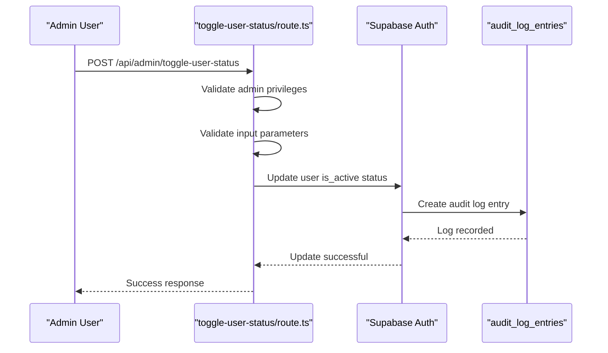
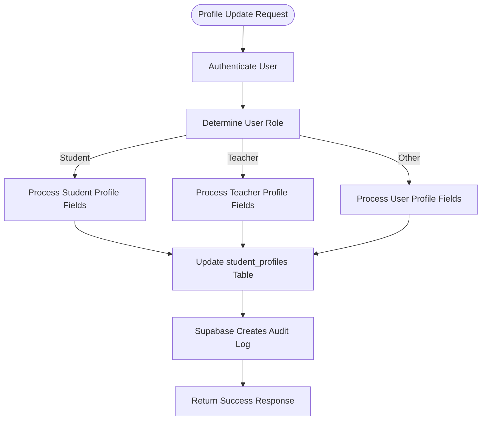
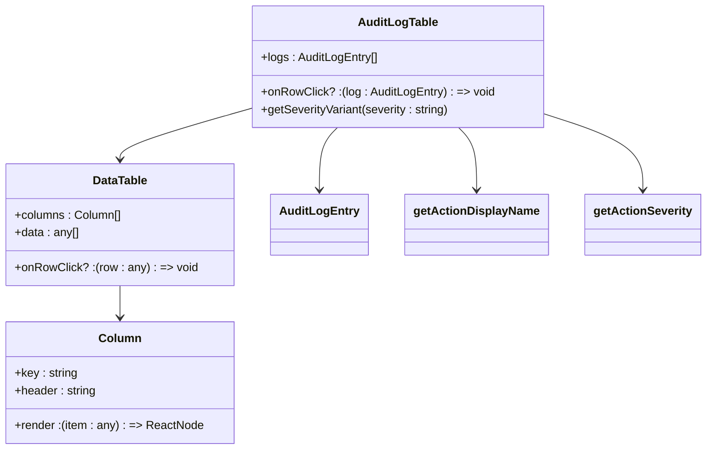
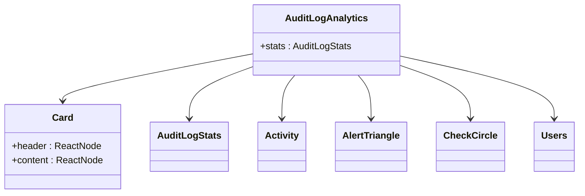

# Audit Logging Service

<cite>
**Referenced Files in This Document**   
- [audit-logs.ts](file://lib/supabase/audit-logs.ts)
- [toggle-user-status/route.ts](file://app/api/admin/toggle-user-status/route.ts)
- [update/route.ts](file://app/api/profile/update/route.ts)
- [audit-log-table.tsx](file://components/audit-log-table.tsx)
- [audit-log-analytics.tsx](file://components/audit-log-analytics.tsx)
- [audit_logs_view_v2.sql](file://supabase/migrations/20260108132041_audit_logs_view_v2.sql)
- [audit_logs_indexes.sql](file://supabase/migrations/20260108_audit_logs_indexes.sql)
- [audit-logs/filters.tsx](file://components/audit-log-filters.tsx)
</cite>

## Table of Contents
1. [Introduction](#introduction)
2. [Core Components](#core-components)
3. [Architecture Overview](#architecture-overview)
4. [Detailed Component Analysis](#detailed-component-analysis)
5. [Integration with API Routes](#integration-with-api-routes)
6. [Querying and Visualization](#querying-and-visualization)
7. [Compliance and Security](#compliance-and-security)
8. [Conclusion](#conclusion)

## Introduction
The Audit Logging Service provides a comprehensive system for tracking and monitoring critical user actions within the School Management System. This service captures authentication events, user modifications, and administrative operations with rich contextual metadata. Built on Supabase Auth's audit log infrastructure, it ensures immutable records of system activities while providing flexible querying capabilities for security monitoring and compliance reporting.

## Core Components

The audit logging system consists of several key components that work together to capture, store, and present audit trail data. The core functionality is implemented in the `audit-logs.ts` module, which provides utilities for querying audit logs, generating statistics, detecting suspicious activity, and exporting data. The system leverages Supabase's built-in authentication audit logging while extending it with additional context through database views and client-side enrichment.

**Section sources**
- [audit-logs.ts](file://lib/supabase/audit-logs.ts#L1-L321)

## Architecture Overview

The audit logging architecture follows a layered approach that integrates Supabase Auth's native audit capabilities with application-specific enhancements:



**Diagram sources**
- [audit_logs_view_v2.sql](file://supabase/migrations/20260108132041_audit_logs_view_v2.sql#L1-L20)
- [audit-logs.ts](file://lib/supabase/audit-logs.ts#L1-L321)

## Detailed Component Analysis

### Audit Logs Module Analysis

The `audit-logs.ts` module serves as the primary interface for interacting with audit log data. It provides several key functions for retrieving and processing audit records:

```mermaid
classDiagram
class AuditLogEntry {
+id : string
+user_id : string | null
+action : string
+ip_address : string | null
+created_at : string
+payload : any
+email? : string
+name? : string
+role? : string
}
class AuditLogFilters {
+userId? : string
+action? : string
+startDate? : string
+endDate? : string
+ipAddress? : string
+page? : number
+pageSize? : number
}
class AuditLogStats {
+totalLogins : number
+failedLogins : number
+successRate : number
+uniqueUsers : number
+recentActions : { action : string; count : number }[]
}
class AuditLogsModule {
+getAuditLogs(filters : AuditLogFilters)
+getUserAuditLogs(userId : string, limit : number)
+getAuditLogStats(days : number)
+detectSuspiciousActivity(userId? : string)
+exportAuditLogsToCSV(logs : AuditLogEntry[])
+getActionDisplayName(action : string)
+getActionSeverity(action : string)
}
AuditLogsModule --> AuditLogEntry
AuditLogsModule --> AuditLogFilters
AuditLogsModule --> AuditLogStats
```

**Diagram sources**
- [audit-logs.ts](file://lib/supabase/audit-logs.ts#L8-L321)

**Section sources**
- [audit-logs.ts](file://lib/supabase/audit-logs.ts#L8-L321)

### Database Schema and RLS Policies

The audit logging system leverages Supabase's built-in `auth.audit_log_entries` table, which automatically captures authentication events. To enhance queryability and provide user context, a database view named `audit_logs_with_users` is created that joins audit log entries with user information from the `users` table.



**Diagram sources**
- [audit_logs_view_v2.sql](file://supabase/migrations/20260108132041_audit_logs_view_v2.sql#L3-L15)
- [audit_logs_indexes.sql](file://supabase/migrations/20260108_audit_logs_indexes.sql#L8-L20)

**Section sources**
- [audit_logs_view_v2.sql](file://supabase/migrations/20260108132041_audit_logs_view_v2.sql#L1-L20)
- [audit_logs_indexes.sql](file://supabase/migrations/20260108_audit_logs_indexes.sql#L1-L25)

## Integration with API Routes

### User Status Toggle Integration

The audit logging system is integrated with administrative functions such as user status management. When an administrator toggles a user's active status, this action is automatically captured in the audit logs through Supabase Auth's built-in mechanisms.



**Diagram sources**
- [toggle-user-status/route.ts](file://app/api/admin/toggle-user-status/route.ts#L1-L62)

**Section sources**
- [toggle-user-status/route.ts](file://app/api/admin/toggle-user-status/route.ts#L1-L62)

### Profile Update Integration

User profile updates trigger audit log entries that capture changes to user information. The system ensures that only authorized fields can be modified based on user role, and all changes are recorded for accountability.



**Diagram sources**
- [update/route.ts](file://app/api/profile/update/route.ts#L1-L105)

**Section sources**
- [update/route.ts](file://app/api/profile/update/route.ts#L1-L105)

## Querying and Visualization

### Audit Log Table Component

The `audit-log-table.tsx` component provides a user interface for displaying audit log entries with enhanced visual indicators for action severity and contextual information.



**Diagram sources**
- [audit-log-table.tsx](file://components/audit-log-table.tsx#L1-L84)

**Section sources**
- [audit-log-table.tsx](file://components/audit-log-table.tsx#L1-L84)

### Audit Log Analytics Component

The `audit-log-analytics.tsx` component presents key metrics and insights derived from audit log data, enabling administrators to quickly assess system security and usage patterns.



**Diagram sources**
- [audit-log-analytics.tsx](file://components/audit-log-analytics.tsx#L1-L78)

**Section sources**
- [audit-log-analytics.tsx](file://components/audit-log-analytics.tsx#L1-L78)

## Compliance and Security

### Data Retention and Privacy

The audit logging system implements several security and compliance measures:

1. **IP Address Hashing**: IP addresses are stored in hashed form to protect user privacy while maintaining the ability to detect suspicious patterns.
2. **Immutable Records**: Audit logs are write-once and cannot be modified or deleted, ensuring the integrity of the audit trail.
3. **Role-Based Access**: Access to audit logs is restricted to authenticated users with appropriate privileges through RLS policies.
4. **Data Export Security**: CSV exports include protection against formula injection attacks by properly escaping cell values.

The system's RLS policies ensure that only authorized users can access audit log data, with the `audit_logs_with_users` view granting SELECT permissions to authenticated users while maintaining the immutability of the underlying audit data.

**Section sources**
- [audit_logs_view_v2.sql](file://supabase/migrations/20260108132041_audit_logs_view_v2.sql#L17-L18)
- [audit-logs.ts](file://lib/supabase/audit-logs.ts#L232-L261)

## Conclusion

The Audit Logging Service provides a robust foundation for tracking and monitoring system activities in the School Management System. By leveraging Supabase Auth's built-in audit capabilities and extending them with application-specific enhancements, the system captures critical user actions with rich contextual metadata. The service enables administrators to monitor system usage, detect suspicious activity, and maintain compliance with security requirements through comprehensive logging, secure data storage, and intuitive visualization components.