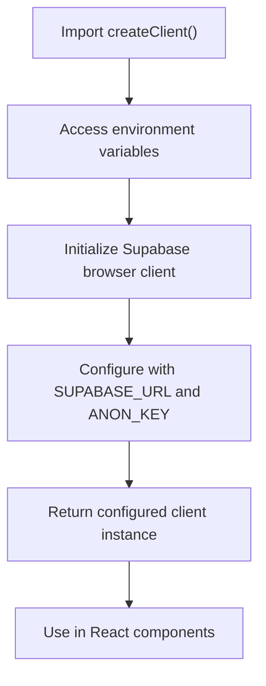
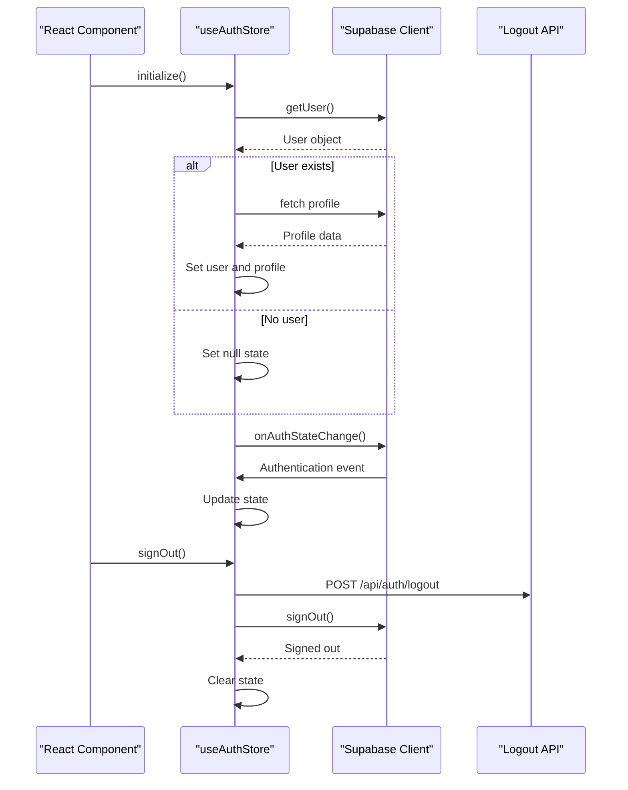
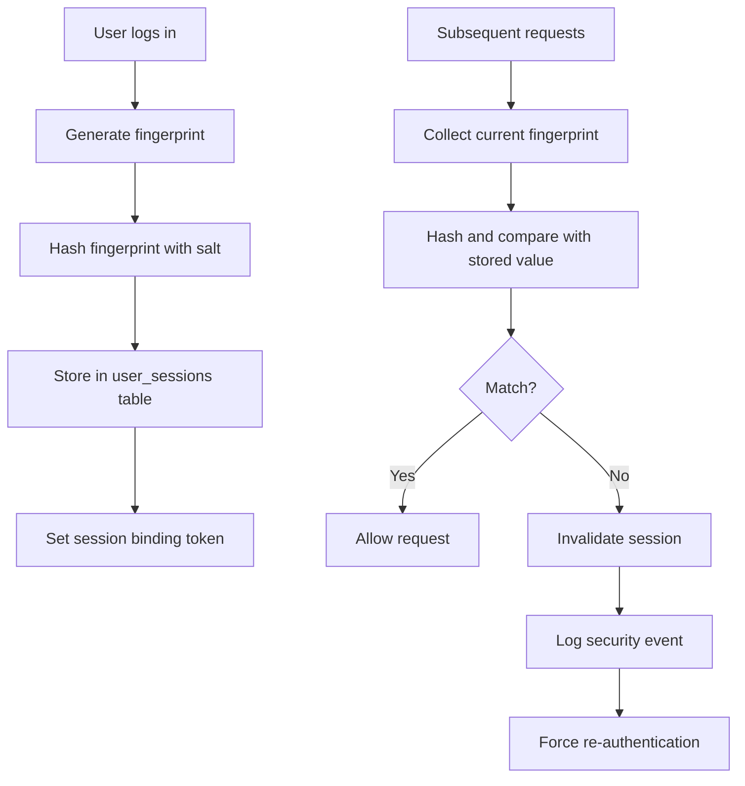
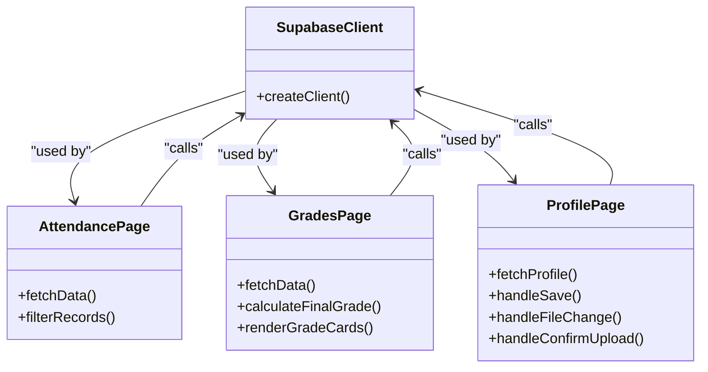

# Client-Side Supabase Client

<cite>
**Referenced Files in This Document**   
- [client.ts](file://lib/supabase/client.ts)
- [types.ts](file://lib/supabase/types.ts)
- [queries.ts](file://lib/supabase/queries.ts)
- [queries-optimized.ts](file://lib/supabase/queries-optimized.ts)
- [auth-store.ts](file://lib/auth-store.ts)
- [use-session-timeout.ts](file://lib/hooks/use-session-timeout.ts)
- [session-security.ts](file://lib/session-security.ts)
- [fingerprint.ts](file://lib/fingerprint.ts)
- [secure-fetch.ts](file://lib/secure-fetch.ts)
- [middleware.ts](file://lib/supabase/middleware.ts)
- [attendance/page.tsx](file://app/admin/attendance/page.tsx)
- [grades/page.tsx](file://app/student/grades/page.tsx)
- [profile-page.tsx](file://components/profile-page.tsx)
</cite>

## Table of Contents
1. [Introduction](#introduction)
2. [Client Initialization and Configuration](#client-initialization-and-configuration)
3. [Authentication State Management](#authentication-state-management)
4. [Session Security and Fingerprinting](#session-security-and-fingerprinting)
5. [Data Fetching and RLS Compliance](#data-fetching-and-rls-compliance)
6. [Usage in Frontend Components](#usage-in-frontend-components)
7. [Error Handling and Retry Mechanisms](#error-handling-and-retry-mechanisms)
8. [Integration with Zustand Stores](#integration-with-zustand-stores)
9. [Rate Limiting and Performance Considerations](#rate-limiting-and-performance-considerations)
10. [Common Issues and Mitigation Strategies](#common-issues-and-mitigation-strategies)

## Introduction

The client-side Supabase client implementation provides a secure and efficient interface for browser-based interactions with the Supabase backend in the School Management System. This documentation details the architecture, configuration, and usage patterns of the Supabase client, focusing on its integration with Next.js App Router, authentication state management, and security features. The implementation ensures secure client-side data fetching while respecting Row Level Security (RLS) policies and provides robust mechanisms for session management, error handling, and performance optimization.

**Section sources**
- [client.ts](file://lib/supabase/client.ts#L1-L9)
- [auth-store.ts](file://lib/auth-store.ts#L1-L110)

## Client Initialization and Configuration

The Supabase client is initialized through a factory function that creates a browser-optimized client instance using environment variables for configuration. The `createClient()` function in `client.ts` utilizes the `@supabase/ssr` package to create a client specifically designed for server-side rendering environments. This client is configured with the public Supabase URL and anonymous key from environment variables, enabling secure communication with the Supabase backend without exposing sensitive credentials.

The client is designed to work seamlessly with Next.js App Router, where it can be imported and instantiated within client components. The initialization process ensures that each client instance inherits the necessary configuration for authentication, real-time subscriptions, and database operations. The client automatically handles session persistence through browser cookies and integrates with Supabase Auth for token management and refresh mechanisms.

**Diagram sources**
- [client.ts](file://lib/supabase/client.ts#L1-L9)

**Section sources**
- [client.ts](file://lib/supabase/client.ts#L1-L9)
- [middleware.ts](file://lib/supabase/middleware.ts#L1-L38)

## Authentication State Management

Authentication state is managed through a combination of Supabase Auth and Zustand for state synchronization across the application. The `useAuthStore` in `auth-store.ts` creates a global store that tracks the current user, profile information, and authentication status. This store initializes by checking the current authentication state and setting up a subscription to listen for authentication events such as sign-in, sign-out, and token refresh.

The store implementation includes optimization features such as proper subscription cleanup to prevent memory leaks and initialization guards to prevent redundant operations. When a user authenticates, the store retrieves both the Supabase user object and the corresponding profile from the database, combining them into a unified state. The sign-out process is comprehensive, clearing session tokens, calling the logout API to invalidate server-side sessions, and signing out from Supabase Auth.

**Diagram sources**
- [auth-store.ts](file://lib/auth-store.ts#L1-L110)
- [use-session-timeout.ts](file://lib/hooks/use-session-timeout.ts#L1-L198)

**Section sources**
- [auth-store.ts](file://lib/auth-store.ts#L1-L110)
- [use-session-timeout.ts](file://lib/hooks/use-session-timeout.ts#L1-L198)

## Session Security and Fingerprinting

The implementation includes robust session security features to prevent session hijacking and unauthorized access. The system uses browser fingerprinting to bind sessions to specific devices, with the `generateFingerprint()` function in `fingerprint.ts` collecting non-PII browser characteristics such as user agent, language, timezone, screen resolution, and platform. This fingerprint is hashed server-side and compared with stored values to detect potential session hijacking attempts.

The `session-security.ts` module implements server-side session validation that checks the client's fingerprint against the stored hash. If a mismatch is detected, the session is immediately invalidated, and a security event is logged. The system also implements absolute and inactivity timeouts, with the `useSessionTimeout` hook monitoring user activity and displaying warnings before automatic logout. Session binding tokens are stored in localStorage and cleared on logout to prevent reuse.

**Diagram sources**
- [session-security.ts](file://lib/session-security.ts#L1-L373)
- [fingerprint.ts](file://lib/fingerprint.ts#L1-L68)
- [secure-fetch.ts](file://lib/secure-fetch.ts#L1-L52)

**Section sources**
- [session-security.ts](file://lib/session-security.ts#L1-L373)
- [fingerprint.ts](file://lib/fingerprint.ts#L1-L68)
- [secure-fetch.ts](file://lib/secure-fetch.ts#L1-L52)

## Data Fetching and RLS Compliance

The client-side implementation ensures compliance with Row Level Security (RLS) policies through careful query construction and API route usage. While direct database queries are available through the `queries.ts` and `queries-optimized.ts` modules, the frontend components typically use API routes as an intermediary layer for enhanced security. This pattern prevents direct exposure of database queries to the client and allows for additional server-side validation.

The optimized queries include pagination, caching, and performance improvements to handle large datasets efficiently. For example, `getClassesWithCounts()` uses aggregation to retrieve class enrollment counts in a single query, avoiding N+1 query problems. The system respects RLS policies by ensuring that users can only access data they are authorized to view based on their role and permissions.

**Diagram sources**
- [queries.ts](file://lib/supabase/queries.ts#L1-L419)
- [queries-optimized.ts](file://lib/supabase/queries-optimized.ts#L1-L317)
- [attendance/page.tsx](file://app/admin/attendance/page.tsx#L1-L209)

**Section sources**
- [queries.ts](file://lib/supabase/queries.ts#L1-L419)
- [queries-optimized.ts](file://lib/supabase/queries-optimized.ts#L1-L317)

## Usage in Frontend Components

The Supabase client is integrated into various frontend components for specific use cases such as attendance tracking, grade retrieval, and profile updates. In the attendance page, the client is used to fetch attendance records and class information, with filtering capabilities based on date, class, and status. The grades page retrieves student grades and calculates final grades using the Philippine grading system, with visualizations of performance trends.

The profile page demonstrates a comprehensive use case, allowing users to view and update their personal information. It uses the client to fetch user and role-specific profile data, with different sections displayed based on the user's role (student, teacher, or admin). The implementation includes secure file upload for profile photos, with client-side validation and server-side processing.

**Diagram sources**
- [attendance/page.tsx](file://app/admin/attendance/page.tsx#L1-L209)
- [grades/page.tsx](file://app/student/grades/page.tsx#L1-L273)
- [profile-page.tsx](file://components/profile-page.tsx#L1-L800)

**Section sources**
- [attendance/page.tsx](file://app/admin/attendance/page.tsx#L1-L209)
- [grades/page.tsx](file://app/student/grades/page.tsx#L1-L273)
- [profile-page.tsx](file://components/profile-page.tsx#L1-L800)

## Error Handling and Retry Mechanisms

The implementation includes comprehensive error handling strategies to manage network errors, stale sessions, and other common issues. Components use try-catch blocks around Supabase operations and provide user-friendly error messages through toast notifications. The system handles stale sessions by redirecting users to the login page when authentication errors occur, with appropriate query parameters to indicate the reason for re-authentication.

Network error mitigation includes retry logic for transient failures, with exponential backoff patterns for repeated attempts. Error boundaries are implemented at the component level to prevent application crashes from unhandled exceptions. The logout process includes error handling to ensure that users can always log out even if the API call fails, providing a fallback to client-side session cleanup.

**Section sources**
- [profile-page.tsx](file://components/profile-page.tsx#L1-L800)
- [use-session-timeout.ts](file://lib/hooks/use-session-timeout.ts#L1-L198)

## Integration with Zustand Stores

The Supabase client is tightly integrated with Zustand stores for global state management and synchronization. The `useAuthStore` provides a centralized location for authentication state that can be accessed from any component without prop drilling. This store maintains reactivity through Zustand's subscription model, ensuring that UI components automatically update when authentication state changes.

The store pattern enables efficient state synchronization across multiple tabs or windows, with proper cleanup mechanisms to prevent memory leaks. The implementation follows best practices for Zustand usage, including proper subscription management, initialization guards, and type safety. This integration allows for complex state logic, such as the session timeout functionality, to be encapsulated within the store while providing a simple API to components.

**Section sources**
- [auth-store.ts](file://lib/auth-store.ts#L1-L110)
- [use-session-timeout.ts](file://lib/hooks/use-session-timeout.ts#L1-L198)

## Rate Limiting and Performance Considerations

The system implements rate limiting at both the client and server levels to prevent abuse and ensure fair resource usage. Client-side optimizations include query batching, caching of frequently accessed data, and pagination for large datasets. The optimized queries in `queries-optimized.ts` include performance enhancements such as exact count retrieval, range-based pagination, and parallel execution of related queries.

For dashboard views, the implementation uses aggregation queries to retrieve multiple statistics in a single request, reducing the number of round trips to the database. The system also implements client-side caching for static data that doesn't change frequently, reducing unnecessary network requests. These performance considerations ensure a responsive user experience even with large datasets and multiple concurrent users.

**Section sources**
- [queries-optimized.ts](file://lib/supabase/queries-optimized.ts#L1-L317)
- [session-security.ts](file://lib/session-security.ts#L1-L373)

## Common Issues and Mitigation Strategies

The implementation addresses several common issues in client-side Supabase applications. Stale sessions are mitigated through the fingerprinting system and session timeout mechanisms, which detect and respond to unauthorized access attempts. Network errors are handled gracefully with retry logic and user feedback, preventing data loss during temporary connectivity issues.

Security vulnerabilities are addressed through multiple layers of protection, including RLS policies, server-side validation, and input sanitization. The system prevents prototype pollution attacks by using Maps instead of plain objects for dynamic data structures. Session fixation attacks are prevented through the use of session binding tokens and fingerprint validation.

For development and debugging, the implementation includes comprehensive logging of security events and error conditions, while ensuring that sensitive information is not exposed in client-side logs. These mitigation strategies create a robust and secure client-side experience that protects both user data and system integrity.

**Section sources**
- [session-security.ts](file://lib/session-security.ts#L1-L373)
- [fingerprint.ts](file://lib/fingerprint.ts#L1-L68)
- [secure-fetch.ts](file://lib/secure-fetch.ts#L1-L52)
- [profile-page.tsx](file://components/profile-page.tsx#L1-L800)