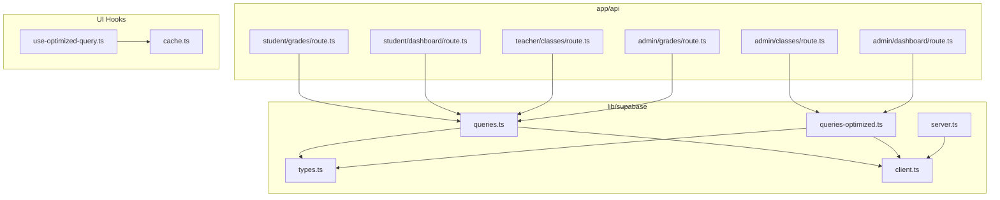
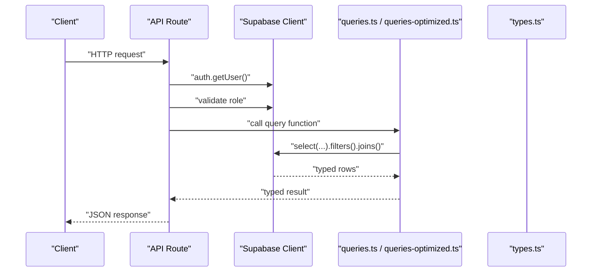
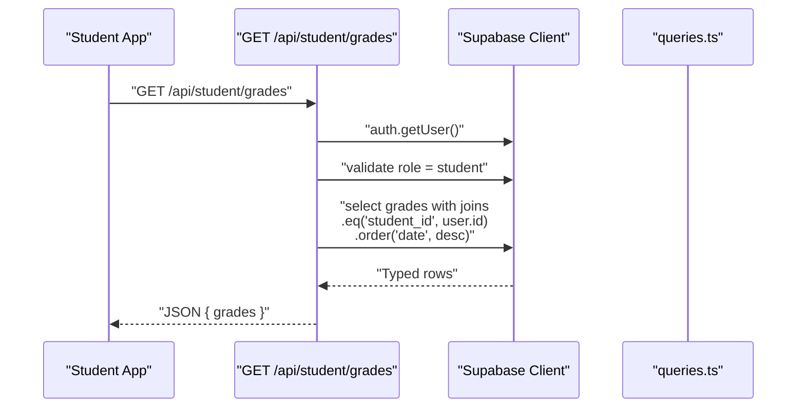
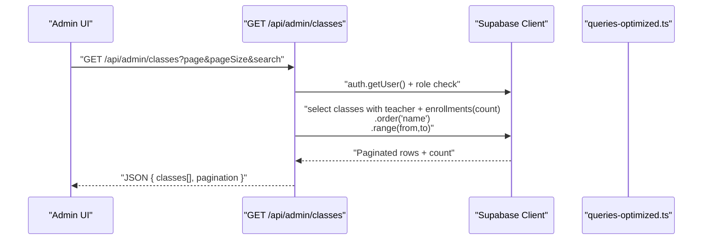
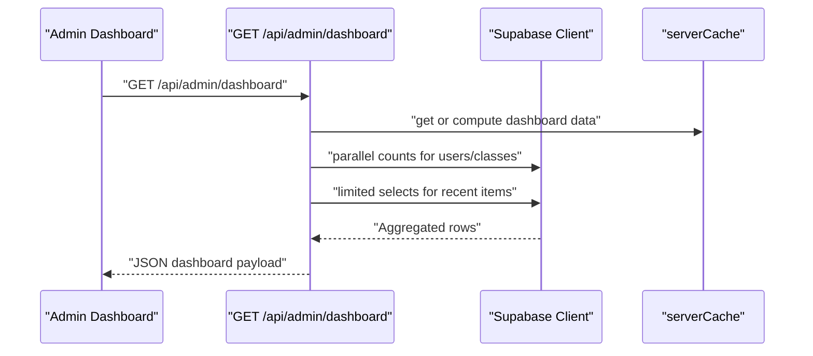
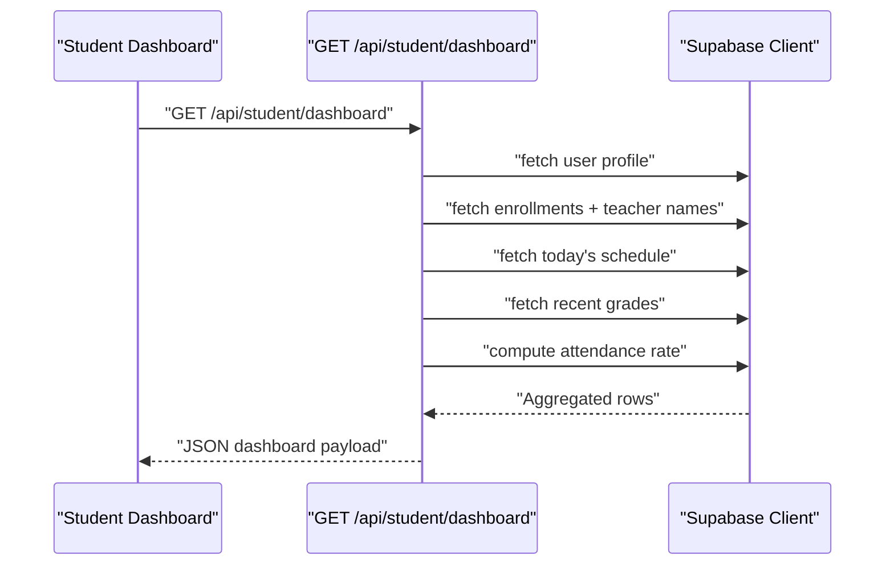
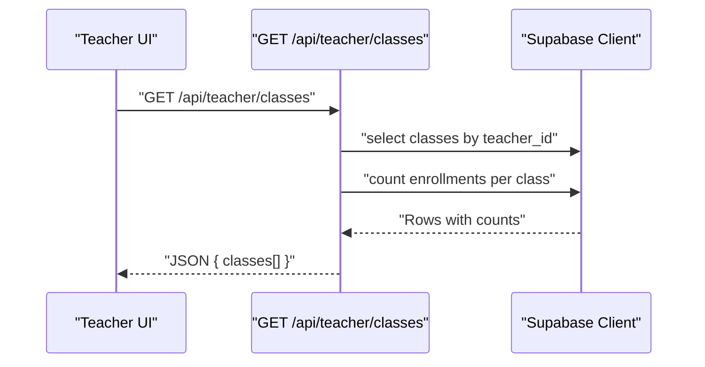
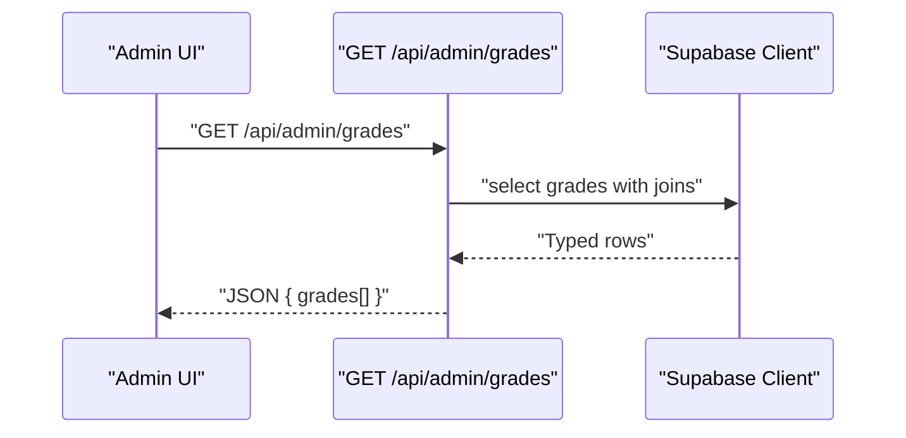
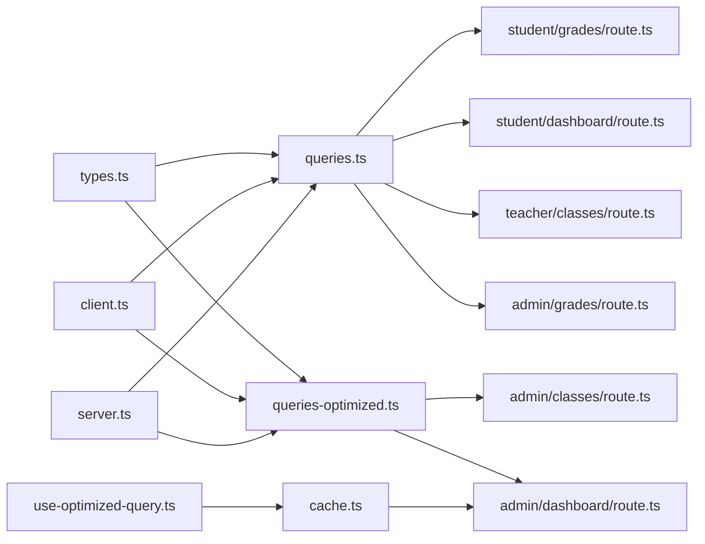

# Query Abstraction Layer

<cite>
**Referenced Files in This Document**
- [queries.ts](file://lib/supabase/queries.ts)
- [queries-optimized.ts](file://lib/supabase/queries-optimized.ts)
- [types.ts](file://lib/supabase/types.ts)
- [client.ts](file://lib/supabase/client.ts)
- [server.ts](file://lib/supabase/server.ts)
- [route.ts](file://app/api/student/grades/route.ts)
- [route.ts](file://app/api/admin/classes/route.ts)
- [route.ts](file://app/api/admin/dashboard/route.ts)
- [route.ts](file://app/api/student/dashboard/route.ts)
- [route.ts](file://app/api/teacher/classes/route.ts)
- [route.ts](file://app/api/admin/grades/route.ts)
- [use-optimized-query.ts](file://lib/hooks/use-optimized-query.ts)
- [cache.ts](file://lib/cache.ts)
</cite>

## Table of Contents
1. [Introduction](#introduction)
2. [Project Structure](#project-structure)
3. [Core Components](#core-components)
4. [Architecture Overview](#architecture-overview)
5. [Detailed Component Analysis](#detailed-component-analysis)
6. [Dependency Analysis](#dependency-analysis)
7. [Performance Considerations](#performance-considerations)
8. [Troubleshooting Guide](#troubleshooting-guide)
9. [Conclusion](#conclusion)
10. [Appendices](#appendices)

## Introduction
This document explains the query abstraction layer implemented in the Supabase-backed application. It focuses on how queries.ts and queries-optimized.ts encapsulate common database operations such as fetching user profiles, class enrollments, attendance records, and grade calculations. It highlights parameterized queries, reusable filtering logic, and optimized variants that reduce payload size through selective field selection and aggregation/indexing hints. It compares standard queries with optimized versions, showing performance trade-offs and use cases (e.g., dashboard analytics vs. detailed views). Real-world examples from API routes demonstrate practical usage patterns, and guidance is provided for extending query functions while maintaining type safety and compatibility with Supabase’s PostgreSQL backend.

## Project Structure
The query abstraction layer resides under lib/supabase and is consumed by API routes under app/api. The server-side Supabase client is created via lib/supabase/server.ts, while lib/supabase/client.ts provides a browser-compatible client. Types are defined centrally in lib/supabase/types.ts to ensure type safety across queries and routes.

**Diagram sources**
- [queries.ts](file://lib/supabase/queries.ts#L1-L419)
- [queries-optimized.ts](file://lib/supabase/queries-optimized.ts#L1-L317)
- [types.ts](file://lib/supabase/types.ts#L1-L253)
- [client.ts](file://lib/supabase/client.ts#L1-L9)
- [server.ts](file://lib/supabase/server.ts#L1-L51)
- [route.ts](file://app/api/student/grades/route.ts#L1-L40)
- [route.ts](file://app/api/admin/classes/route.ts#L1-L89)
- [route.ts](file://app/api/admin/dashboard/route.ts#L1-L125)
- [route.ts](file://app/api/student/dashboard/route.ts#L1-L117)
- [route.ts](file://app/api/teacher/classes/route.ts#L1-L59)
- [route.ts](file://app/api/admin/grades/route.ts#L1-L57)
- [use-optimized-query.ts](file://lib/hooks/use-optimized-query.ts#L1-L56)
- [cache.ts](file://lib/cache.ts#L1-L59)

**Section sources**
- [queries.ts](file://lib/supabase/queries.ts#L1-L419)
- [queries-optimized.ts](file://lib/supabase/queries-optimized.ts#L1-L317)
- [types.ts](file://lib/supabase/types.ts#L1-L253)
- [client.ts](file://lib/supabase/client.ts#L1-L9)
- [server.ts](file://lib/supabase/server.ts#L1-L51)
- [route.ts](file://app/api/student/grades/route.ts#L1-L40)
- [route.ts](file://app/api/admin/classes/route.ts#L1-L89)
- [route.ts](file://app/api/admin/dashboard/route.ts#L1-L125)
- [route.ts](file://app/api/student/dashboard/route.ts#L1-L117)
- [route.ts](file://app/api/teacher/classes/route.ts#L1-L59)
- [route.ts](file://app/api/admin/grades/route.ts#L1-L57)
- [use-optimized-query.ts](file://lib/hooks/use-optimized-query.ts#L1-L56)
- [cache.ts](file://lib/cache.ts#L1-L59)

## Core Components
- Standard query module (queries.ts): Provides straightforward, readable queries for users, students, teachers, classes, schedules, attendance, grades, quizzes, lessons, announcements, notifications, school settings, quiz attempts, QR attendance sessions, and more. Filters are parameterized using equality checks and logical OR combinations. Joins and nested selects are used to fetch related entities.
- Optimized query module (queries-optimized.ts): Adds pagination, selective field selection, aggregation-based counts, parallel fetches for dashboards, bulk insert/upsert operations, and explicit limits to reduce payload sizes. It returns paginated responses and transforms aggregated counts into normalized shapes.
- Types (types.ts): Defines strongly typed interfaces for database entities (users, student profiles, teacher profiles, classes, attendance records, grades, schedules, quizzes, lessons, announcements, notifications, QR attendance sessions, school settings, audit logs). These types guide query typing and route DTO transformations.
- Clients (client.ts, server.ts): Provide Supabase clients for browser and server contexts. server.ts creates a server-side client with cookie handling and exposes a service role client for admin tasks.

Key capabilities:
- Parameterized filters: Uses .eq(), .in(), .or(), .gte(), .lte(), .range() to safely pass runtime values.
- Reusable filtering logic: Centralizes common filters (e.g., classId, studentId, teacherId, role) to avoid duplication.
- Selective field selection: Optimized queries explicitly enumerate fields to minimize payload size.
- Aggregation/indexing hints: Uses .select with aggregates and joins to avoid N+1 queries and leverage database indexes.
- Type safety: All queries return typed results aligned with types.ts.

**Section sources**
- [queries.ts](file://lib/supabase/queries.ts#L1-L419)
- [queries-optimized.ts](file://lib/supabase/queries-optimized.ts#L1-L317)
- [types.ts](file://lib/supabase/types.ts#L1-L253)
- [client.ts](file://lib/supabase/client.ts#L1-L9)
- [server.ts](file://lib/supabase/server.ts#L1-L51)

## Architecture Overview
The query abstraction layer sits between API routes and the Supabase client. Routes authenticate users, enforce roles, and call either standard or optimized queries depending on the use case. Optimized queries often combine multiple concerns (pagination, aggregation, limits) to improve performance for analytics and lists.

**Diagram sources**
- [queries.ts](file://lib/supabase/queries.ts#L1-L419)
- [queries-optimized.ts](file://lib/supabase/queries-optimized.ts#L1-L317)
- [types.ts](file://lib/supabase/types.ts#L1-L253)
- [route.ts](file://app/api/student/grades/route.ts#L1-L40)
- [route.ts](file://app/api/admin/classes/route.ts#L1-L89)

## Detailed Component Analysis

### Standard Queries Module (queries.ts)
Purpose:
- Encapsulate common read operations with parameterized filters and joins.
- Provide reusable building blocks for routes.

Capabilities:
- Users: getUsers(), getUserById(id), getUsersByRole(role).
- Students: getStudents(), getStudentProfile(id).
- Teachers: getTeachers(), getTeacherProfile(id).
- Classes: getClasses(), getClassById(id), getClassesByTeacher(teacherId), getClassStudents(classId), getStudentClasses(studentId).
- Schedules: getSchedules(), getSchedulesByClass(classId).
- Attendance: getAttendanceRecords(classId?, date?), getStudentAttendance(studentId).
- Grades: getGrades(classId?), getStudentGrades(studentId).
- Quizzes: getQuizzes(classId?), getQuizById(id), getQuizAttempts(quizId?), getQuizzesByTeacher(teacherId).
- Lessons: getLessons(classId?).
- Announcements: getAnnouncements(targetAudience?).
- Notifications: getNotifications(userId).
- School settings: getSchoolSettings().
- QR Attendance: getQrSessions(teacherId?).

Security and filtering:
- Parameterized filters via .eq(), .in(), .or(), .order(), .single().
- Example: getStudentGrades uses .eq("student_id", studentId) to restrict results to the authenticated user.

Joins and nested selects:
- Uses foreign key aliases and nested selects to fetch related entities (e.g., teacher, student, class, materials).

Extensibility:
- New functions follow the same pattern: createClient(), build query with .from(table).select(...), apply filters, order, and return typed data.

**Section sources**
- [queries.ts](file://lib/supabase/queries.ts#L1-L419)

### Optimized Queries Module (queries-optimized.ts)
Purpose:
- Improve performance for high-volume reads and analytics.
- Reduce payload size and database load via selective fields, pagination, and aggregation.

Capabilities:
- Pagination: getUsers(params), getUsersByRole(role, params), getStudents(params).
- Aggregations: getClassesWithCounts() computes student_count via aggregate.
- Optimized joins: getClassStudentsOptimized(classId) selects only necessary fields.
- Date-range filtering: getAttendanceRecordsOptimized(classId?, startDate?, endDate?, limit).
- Limits: getGradesOptimized(classId?, studentId?, limit).
- Dashboard stats: getDashboardStats(role, userId) performs parallel counts and computes rates.
- Bulk operations: bulkInsertGrades(grades), bulkUpdateAttendance(updates).

Performance trade-offs:
- Standard queries (queries.ts) favor readability and flexibility.
- Optimized queries (queries-optimized.ts) favor speed and bandwidth by:
  - Selecting only required fields.
  - Using .range() and .limit().
  - Performing aggregations in SQL.
  - Parallelizing multiple counts/statistics.

Use cases:
- Dashboard analytics: getDashboardStats for admin/teacher dashboards.
- Lists with pagination: getUsers/getUsersByRole/getStudents.
- Class enrollment lists: getClassStudentsOptimized.
- Attendance summaries: getAttendanceRecordsOptimized with date ranges.
- Grade history: getGradesOptimized with limits.

**Section sources**
- [queries-optimized.ts](file://lib/supabase/queries-optimized.ts#L1-L317)

### Types Module (types.ts)
Purpose:
- Define strict TypeScript interfaces for database entities.
- Ensure type-safe queries and route DTO transformations.

Coverage:
- User roles, student/teacher profiles, classes, schedules, attendance records, grades, quizzes, quiz questions, lessons, lesson materials, announcements, notifications, QR attendance sessions, school settings, audit logs.

Benefits:
- Consistent typing across queries and routes.
- Easier refactoring when schema evolves.
- Better developer experience with autocompletion and compile-time checks.

**Section sources**
- [types.ts](file://lib/supabase/types.ts#L1-L253)

### Client Factories (client.ts, server.ts)
Purpose:
- Provide consistent Supabase client creation for browser and server environments.
- server.ts adds cookie handling and exposes a service role client for admin tasks.

Usage:
- queries.ts and queries-optimized.ts import createClient() to connect to Supabase.
- API routes import createClient() from lib/supabase/server.ts for SSR.

**Section sources**
- [client.ts](file://lib/supabase/client.ts#L1-L9)
- [server.ts](file://lib/supabase/server.ts#L1-L51)

### Real-World API Route Examples

#### Student Grades Route
- Purpose: Return the authenticated student’s grades with minimal fields.
- Security: Verifies user role and filters by student_id.
- Query: Uses a parameterized select with .eq("student_id", user.id) and orders by date descending.

**Diagram sources**
- [route.ts](file://app/api/student/grades/route.ts#L1-L40)
- [queries.ts](file://lib/supabase/queries.ts#L243-L255)

**Section sources**
- [route.ts](file://app/api/student/grades/route.ts#L1-L40)

#### Admin Classes Route
- Purpose: List classes with pagination and student counts.
- Optimization: Uses aggregation (enrollments:class_students(count)) and range-based pagination.
- Security: Enforces admin role and applies rate limiting.

**Diagram sources**
- [route.ts](file://app/api/admin/classes/route.ts#L1-L89)
- [queries-optimized.ts](file://lib/supabase/queries-optimized.ts#L119-L167)

**Section sources**
- [route.ts](file://app/api/admin/classes/route.ts#L1-L89)
- [queries-optimized.ts](file://lib/supabase/queries-optimized.ts#L119-L167)

#### Admin Dashboard Route
- Purpose: Serve dashboard metrics and recent items.
- Optimization: Parallel counts and limited selects; computes attendance rate client-side.
- Security: Enforces admin role and caches results.

**Diagram sources**
- [route.ts](file://app/api/admin/dashboard/route.ts#L1-L125)
- [cache.ts](file://lib/cache.ts#L1-L59)

**Section sources**
- [route.ts](file://app/api/admin/dashboard/route.ts#L1-L125)
- [cache.ts](file://lib/cache.ts#L1-L59)

#### Student Dashboard Route
- Purpose: Personalized dashboard for students.
- Features: Enrolled classes, today’s schedule, recent grades, and attendance rate calculation.

**Diagram sources**
- [route.ts](file://app/api/student/dashboard/route.ts#L1-L117)

**Section sources**
- [route.ts](file://app/api/student/dashboard/route.ts#L1-L117)

#### Teacher Classes Route
- Purpose: List teacher-owned classes with student counts.

**Diagram sources**
- [route.ts](file://app/api/teacher/classes/route.ts#L1-L59)

**Section sources**
- [route.ts](file://app/api/teacher/classes/route.ts#L1-L59)

#### Admin Grades Route
- Purpose: Admin view of all grades with DTO transformation.

**Diagram sources**
- [route.ts](file://app/api/admin/grades/route.ts#L1-L57)

**Section sources**
- [route.ts](file://app/api/admin/grades/route.ts#L1-L57)

### Extending Query Functions and Maintaining Type Safety
Guidance:
- Follow the existing patterns in queries.ts and queries-optimized.ts:
  - Create a new function that constructs a query using .from(table).select(...).
  - Apply parameterized filters (.eq, .in, .or, .gte, .lte).
  - Use joins and nested selects for related entities.
  - Return typed data aligned with types.ts.
- For optimized variants:
  - Prefer selective field selection.
  - Add pagination or limits where appropriate.
  - Use aggregation to avoid N+1 queries.
  - Consider parallel fetches for dashboard-like endpoints.
- Maintain type safety:
  - Import types from types.ts and ensure return types match the interfaces.
  - Use .single() when expecting a single row to narrow types.
  - Transform raw rows into DTOs in routes when exposing to clients.

Compatibility with Supabase:
- Use createClient() from lib/supabase/client.ts or lib/supabase/server.ts depending on context.
- Leverage Supabase’s RLS policies; enforce role checks in routes.
- Use .range() and .limit() to control payload sizes.
- Use .order() consistently for deterministic results.

**Section sources**
- [queries.ts](file://lib/supabase/queries.ts#L1-L419)
- [queries-optimized.ts](file://lib/supabase/queries-optimized.ts#L1-L317)
- [types.ts](file://lib/supabase/types.ts#L1-L253)
- [client.ts](file://lib/supabase/client.ts#L1-L9)
- [server.ts](file://lib/supabase/server.ts#L1-L51)

## Dependency Analysis
The query modules depend on:
- Supabase client factories (client.ts, server.ts).
- Strongly typed interfaces (types.ts).
Routes depend on:
- Supabase server client (server.ts).
- Query modules (queries.ts or queries-optimized.ts).
- Optional caching utilities (cache.ts) and UI hooks (use-optimized-query.ts).

**Diagram sources**
- [types.ts](file://lib/supabase/types.ts#L1-L253)
- [queries.ts](file://lib/supabase/queries.ts#L1-L419)
- [queries-optimized.ts](file://lib/supabase/queries-optimized.ts#L1-L317)
- [client.ts](file://lib/supabase/client.ts#L1-L9)
- [server.ts](file://lib/supabase/server.ts#L1-L51)
- [route.ts](file://app/api/student/grades/route.ts#L1-L40)
- [route.ts](file://app/api/admin/classes/route.ts#L1-L89)
- [route.ts](file://app/api/admin/dashboard/route.ts#L1-L125)
- [route.ts](file://app/api/student/dashboard/route.ts#L1-L117)
- [route.ts](file://app/api/teacher/classes/route.ts#L1-L59)
- [route.ts](file://app/api/admin/grades/route.ts#L1-L57)
- [cache.ts](file://lib/cache.ts#L1-L59)
- [use-optimized-query.ts](file://lib/hooks/use-optimized-query.ts#L1-L56)

**Section sources**
- [queries.ts](file://lib/supabase/queries.ts#L1-L419)
- [queries-optimized.ts](file://lib/supabase/queries-optimized.ts#L1-L317)
- [types.ts](file://lib/supabase/types.ts#L1-L253)
- [client.ts](file://lib/supabase/client.ts#L1-L9)
- [server.ts](file://lib/supabase/server.ts#L1-L51)
- [route.ts](file://app/api/student/grades/route.ts#L1-L40)
- [route.ts](file://app/api/admin/classes/route.ts#L1-L89)
- [route.ts](file://app/api/admin/dashboard/route.ts#L1-L125)
- [route.ts](file://app/api/student/dashboard/route.ts#L1-L117)
- [route.ts](file://app/api/teacher/classes/route.ts#L1-L59)
- [route.ts](file://app/api/admin/grades/route.ts#L1-L57)
- [cache.ts](file://lib/cache.ts#L1-L59)
- [use-optimized-query.ts](file://lib/hooks/use-optimized-query.ts#L1-L56)

## Performance Considerations
- Payload reduction:
  - Prefer optimized queries that select only necessary fields.
  - Use .limit() and .range() to constrain results.
- Aggregation:
  - Compute counts in SQL (e.g., enrollments:class_students(count)) to avoid N+1 queries.
- Parallelization:
  - Use Promise.all for independent counts/statistics in dashboard endpoints.
- Indexing:
  - Ensure database indexes exist on frequently filtered columns (e.g., student_id, class_id, teacher_id, role).
- Caching:
  - Use serverCache or client-side cachedQuery to avoid repeated computations.
- Rate limiting:
  - Apply rate limits on heavy endpoints (e.g., admin class listing).

[No sources needed since this section provides general guidance]

## Troubleshooting Guide
Common issues and resolutions:
- Unauthorized or forbidden errors:
  - Ensure routes validate user and role before calling queries.
  - Example: student/grades/route.ts verifies role and filters by student_id.
- Missing data:
  - Check that joins and nested selects are correct and that the related records exist.
  - Example: admin/classes/route.ts uses teacher joins and enrollment counts.
- Excessive payload:
  - Switch to optimized queries with selective fields and limits.
  - Example: queries-optimized.ts uses limited selects and pagination.
- Slow dashboard:
  - Use parallel counts and aggregation-based queries.
  - Example: admin/dashboard/route.ts performs parallel counts and computes rates.
- Type mismatches:
  - Align return types with types.ts interfaces.
  - Use .single() for single-row queries to narrow types.

**Section sources**
- [route.ts](file://app/api/student/grades/route.ts#L1-L40)
- [route.ts](file://app/api/admin/classes/route.ts#L1-L89)
- [route.ts](file://app/api/admin/dashboard/route.ts#L1-L125)
- [queries-optimized.ts](file://lib/supabase/queries-optimized.ts#L1-L317)
- [types.ts](file://lib/supabase/types.ts#L1-L253)

## Conclusion
The query abstraction layer provides a robust, type-safe foundation for database operations. Standard queries (queries.ts) offer simplicity and flexibility, while optimized queries (queries-optimized.ts) deliver performance improvements for analytics and large datasets. Together with strong typing, parameterized filters, and careful use of joins/aggregations, the layer enables scalable, secure, and maintainable data access across the application.

[No sources needed since this section summarizes without analyzing specific files]

## Appendices

### Comparison: Standard vs Optimized Queries
- Standard queries (queries.ts):
  - Simpler, more flexible.
  - Selects broader fields; fewer limits.
  - Suitable for detailed views and internal tools.
- Optimized queries (queries-optimized.ts):
  - Selective fields, pagination, limits, aggregations.
  - Designed for dashboards, lists, and high-throughput scenarios.
  - Trade flexibility for performance.

**Section sources**
- [queries.ts](file://lib/supabase/queries.ts#L1-L419)
- [queries-optimized.ts](file://lib/supabase/queries-optimized.ts#L1-L317)