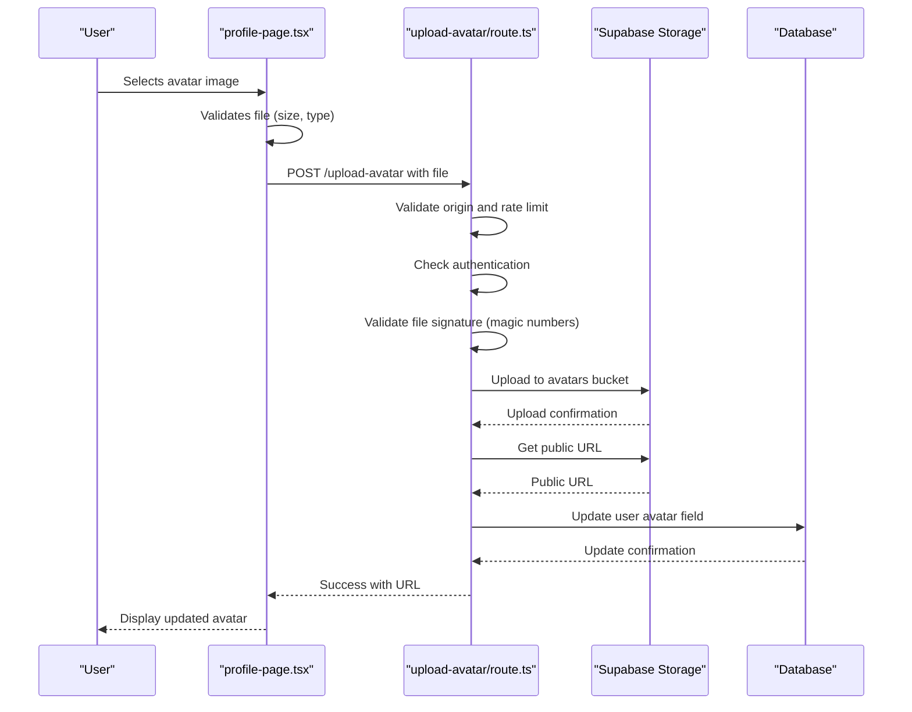

# Secure File Storage Operations

<cite>
**Referenced Files in This Document**   
- [storage.ts](file://lib/supabase/storage.ts)
- [upload-avatar/route.ts](file://app/api/profile/upload-avatar/route.ts)
- [profile-page.tsx](file://components/profile-page.tsx)
- [update/route.ts](file://app/api/profile/update/route.ts)
- [security.ts](file://lib/security.ts)
- [rate-limit.ts](file://lib/rate-limit.ts)
- [20251219070605_create_avatars_bucket.sql](file://supabase/migrations/20251219070605_create_avatars_bucket.sql)
- [20260107000001_fix_avatar_storage_policies.sql](file://supabase/migrations/20260107000001_fix_avatar_storage_policies.sql)
- [20260107115502_fix_avatar_storage_policies.sql](file://supabase/migrations/20260107115502_fix_avatar_storage_policies.sql)
</cite>

## Table of Contents
1. [Introduction](#introduction)
2. [Storage Module Architecture](#storage-module-architecture)
3. [Avatar Upload Process](#avatar-upload-process)
4. [Security Measures](#security-measures)
5. [Integration with Profile Workflows](#integration-with-profile-workflows)
6. [Error Handling and Troubleshooting](#error-handling-and-troubleshooting)
7. [Performance Considerations](#performance-considerations)
8. [Conclusion](#conclusion)

## Introduction

The storage.ts module provides secure file operations for the School Management System, focusing on avatar management through Supabase Storage. This documentation details the implementation of secure avatar uploads, signed URL generation, and bucket policy enforcement for the 'avatars' bucket. The system integrates with profile update workflows and avatar display components while maintaining strict security controls through MIME type validation, file size limits, and Row Level Security (RLS) policies on storage objects.

The module ensures that user avatars are handled securely from upload to display, with multiple layers of validation and protection against common security threats such as file type spoofing, unauthorized access, and denial-of-service attacks through rate limiting.

**Section sources**
- [storage.ts](file://lib/supabase/storage.ts#L1-L110)

## Storage Module Architecture

The storage.ts module implements a comprehensive file storage solution with specific focus on avatar management. The architecture consists of several key components:

- **Configuration Constants**: Defines storage parameters including the avatar bucket name, maximum file size (5MB), allowed image MIME types, and avatar dimensions.
- **Validation Functions**: Implements client-side and server-side validation for image files.
- **Upload and Management Functions**: Provides methods for uploading avatars, generating secure file paths, and managing storage objects.
- **Signed URL Generation**: Creates time-limited signed URLs for accessing private materials.

The module follows a layered security approach, with validation occurring at multiple points in the upload process to ensure only legitimate image files are stored.


**Diagram sources**
- [storage.ts](file://lib/supabase/storage.ts#L33-L69)
- [upload-avatar/route.ts](file://app/api/profile/upload-avatar/route.ts#L45-L71)

**Section sources**
- [storage.ts](file://lib/supabase/storage.ts#L1-L110)

## Avatar Upload Process

The avatar upload process involves a coordinated workflow between client-side components and server-side API routes. When a user uploads an avatar, the following sequence occurs:

1. **Client Selection**: The user selects an image file through the profile-page.tsx component.
2. **Client Validation**: The file undergoes client-side validation for type and size using the validateImageFile function.
3. **Server Upload**: The file is sent to the /api/profile/upload-avatar API route.
4. **Server Validation**: The server performs additional validation, including file signature (magic number) checking.
5. **Secure Storage**: The validated file is uploaded to the avatars bucket with a user-specific path.
6. **Profile Update**: The user's profile is updated with the new avatar URL.

The process ensures that only valid image files are accepted and that each user can only access their own avatar files.



**Diagram sources**
- [profile-page.tsx](file://components/profile-page.tsx#L273-L363)
- [upload-avatar/route.ts](file://app/api/profile/upload-avatar/route.ts#L15-L110)

**Section sources**
- [upload-avatar/route.ts](file://app/api/profile/upload-avatar/route.ts#L15-L110)
- [profile-page.tsx](file://components/profile-page.tsx#L273-L363)

## Security Measures

The storage system implements multiple layers of security to protect against various threats:

### File Validation
The system employs both client-side and server-side validation to prevent malicious file uploads:

- **Client-Side Validation**: The validateImageFile function checks file type and size before upload.
- **Server-Side Validation**: The upload-avatar route validates file signatures (magic numbers) to ensure the file is actually an image, preventing MIME type spoofing.

### Rate Limiting
To prevent abuse, the system implements rate limiting on avatar uploads:

- **5 uploads per 10 minutes** per IP address
- Uses the checkRateLimit function with client IP detection
- Helps prevent denial-of-service attacks and brute force attempts

### Storage Policies
The system uses strict RLS policies to control access to avatar files:

```sql
-- Users can only upload files to their own folder (userId/filename)
CREATE POLICY "Users can upload own avatars"
ON storage.objects FOR INSERT
WITH CHECK (
  bucket_id = 'avatars'
  AND auth.role() = 'authenticated'
  AND (storage.foldername(name))[1] = auth.uid()::text
);
```

These policies ensure that users can only upload, update, and delete files in their own user-specific directory, preventing cross-user file access.

### Additional Security Features
- **Origin Validation**: The profile update API validates the request origin to prevent CSRF attacks.
- **Input Sanitization**: All profile updates are validated against a strict schema to prevent XSS and other injection attacks.
- **Short-Lived Signed URLs**: Private materials use signed URLs with a 5-minute expiration.


**Diagram sources**
- [storage.ts](file://lib/supabase/storage.ts#L33-L41)
- [upload-avatar/route.ts](file://app/api/profile/upload-avatar/route.ts#L18-L24)
- [20260107115502_fix_avatar_storage_policies.sql](file://supabase/migrations/20260107115502_fix_avatar_storage_policies.sql#L14-L43)

**Section sources**
- [storage.ts](file://lib/supabase/storage.ts#L33-L41)
- [upload-avatar/route.ts](file://app/api/profile/upload-avatar/route.ts#L18-L24)
- [security.ts](file://lib/security.ts#L20-L67)
- [rate-limit.ts](file://lib/rate-limit.ts#L25-L56)
- [20260107115502_fix_avatar_storage_policies.sql](file://supabase/migrations/20260107115502_fix_avatar_storage_policies.sql#L14-L43)

## Integration with Profile Workflows

The avatar storage system is tightly integrated with the user profile management workflow. When a user uploads a new avatar, the system updates both the storage object and the user's profile record in the database.

### Profile Update Flow
The profile update process follows these steps:

1. User uploads avatar through the profile interface
2. Avatar is stored in Supabase with a public URL
3. The public URL is saved to the user's avatar field in the database
4. The updated profile is reflected in all application components

### Component Integration
The profile-page.tsx component handles avatar display and upload:

- Displays the current avatar using the Avatar component
- Provides an upload interface with file selection
- Handles preview of the selected image before upload
- Manages upload state (loading, success, error)

The system uses a dedicated API endpoint (/api/profile/upload-avatar) for avatar uploads, separate from the general profile update endpoint, to properly handle multipart form data.


**Diagram sources**
- [profile-page.tsx](file://components/profile-page.tsx#L269-L363)
- [storage.ts](file://lib/supabase/storage.ts#L49-L88)
- [update/route.ts](file://app/api/profile/update/route.ts#L5-L105)

**Section sources**
- [profile-page.tsx](file://components/profile-page.tsx#L269-L363)
- [update/route.ts](file://app/api/profile/update/route.ts#L5-L105)

## Error Handling and Troubleshooting

The system implements comprehensive error handling for avatar operations, with specific error messages for different failure scenarios.

### Common Error Scenarios

| Error Type | Cause | Solution |
|-----------|------|---------|
| Invalid image file format | Uploaded file is not a valid image or has incorrect extension | Ensure the file is a valid JPEG, PNG, or WebP image |
| File size too large | File exceeds 5MB limit | Compress the image or use a smaller file |
| Too many upload attempts | Rate limit exceeded (5 per 10 minutes) | Wait and try again later |
| Unauthorized access | User not authenticated | Log in and try again |
| Invalid signature | Request origin not allowed | Ensure requests come from the correct domain |

### Error Handling Implementation

The system handles errors at multiple levels:

- **Client-Side**: Immediate feedback when file validation fails
- **Server-Side**: Detailed error messages returned as JSON responses
- **Logging**: Server-side errors are logged for debugging

The profile-page.tsx component displays user-friendly error messages using the toast notification system, while the server logs detailed error information for administrators.

### Troubleshooting Tips

**Invalid Signatures**
- Ensure the request Origin header matches the application domain
- Check that the NEXT_PUBLIC_SITE_URL environment variable is correctly set
- Verify that the request is not being proxied through an unauthorized service

**Permission Denials**
- Confirm the user is authenticated
- Check that the RLS policies are correctly configured
- Verify the file path follows the userId/filename pattern

**Upload Failures**
- Test with a small, valid image file
- Check network connectivity
- Verify Supabase storage service is available

**Section sources**
- [upload-avatar/route.ts](file://app/api/profile/upload-avatar/route.ts#L106-L109)
- [profile-page.tsx](file://components/profile-page.tsx#L357-L360)

## Performance Considerations

The avatar storage system is designed with performance and scalability in mind, implementing several optimization strategies.

### Image Delivery
- **Public URLs**: Avatars are stored in a public bucket, allowing direct CDN delivery without server processing
- **Caching**: Browsers and CDNs can cache avatar images, reducing load times for repeat visits
- **Optimal Size**: The 5MB limit ensures images are not unnecessarily large, balancing quality and performance

### Caching Strategies
The system implements multiple caching layers:

- **Client-Side Caching**: The cache.ts module provides in-memory caching for API responses with a 30-second TTL
- **Server-Side Caching**: Next.js unstable_cache is used for dashboard and list data
- **CDN Caching**: Public avatar URLs are served through Supabase's CDN

### Performance Monitoring
The system includes performance monitoring through:
- Client-side error tracking
- Server-side logging of upload operations
- Rate limiting to prevent resource exhaustion

The architecture ensures that avatar operations do not impact the performance of other application features, with dedicated endpoints and storage resources.

**Section sources**
- [cache.ts](file://lib/cache.ts#L1-L128)
- [storage.ts](file://lib/supabase/storage.ts#L4-L5)

## Conclusion

The storage.ts module provides a secure and efficient solution for avatar management in the School Management System. By implementing multiple layers of validation, strict access controls, and proper integration with profile workflows, the system ensures that user avatars are handled securely while maintaining good performance.

Key strengths of the implementation include:
- Comprehensive validation at both client and server levels
- Strict RLS policies preventing cross-user access
- Rate limiting to prevent abuse
- Clean separation of concerns between storage operations and profile management
- User-friendly error handling and troubleshooting

The system follows security best practices by validating file signatures rather than trusting MIME types, using user-specific storage paths, and implementing origin validation for API requests. This multi-layered approach provides robust protection against common security threats while delivering a smooth user experience for avatar management.