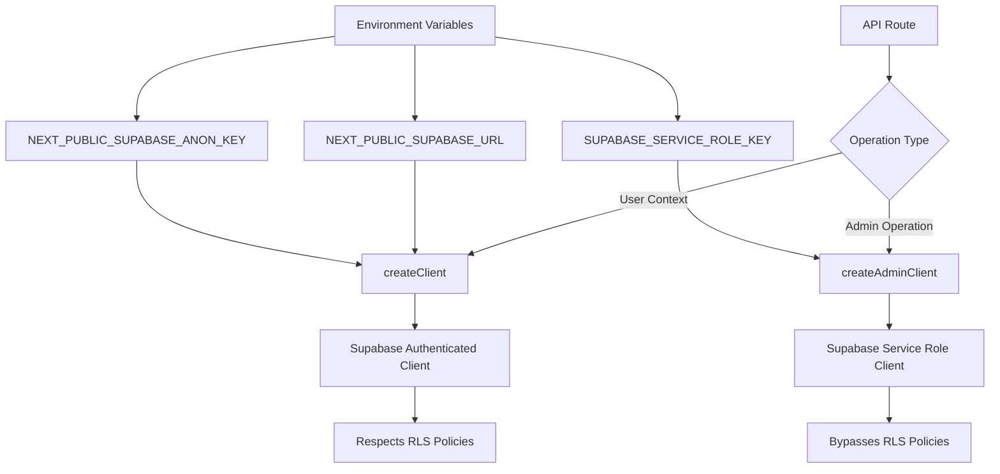
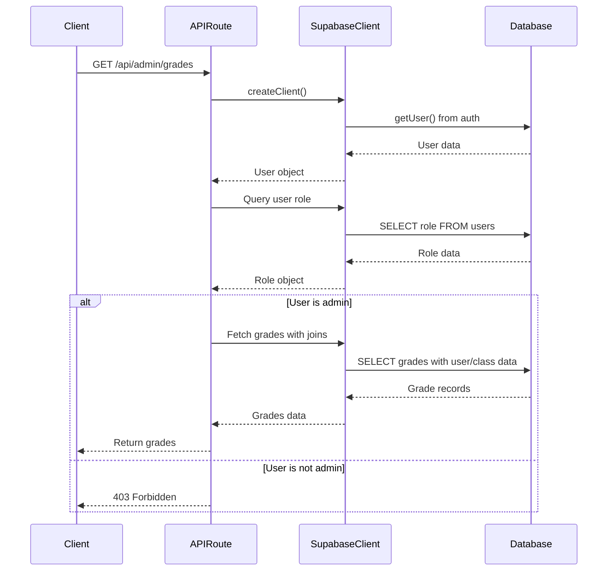
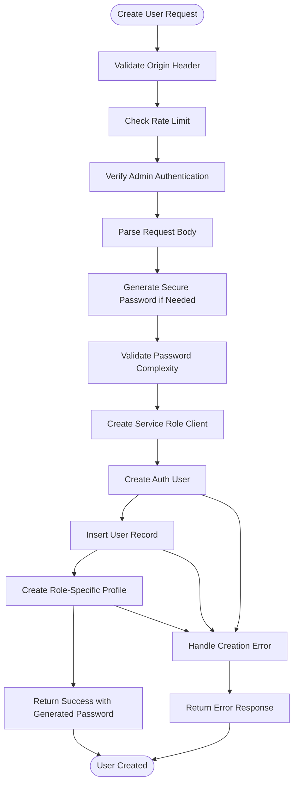
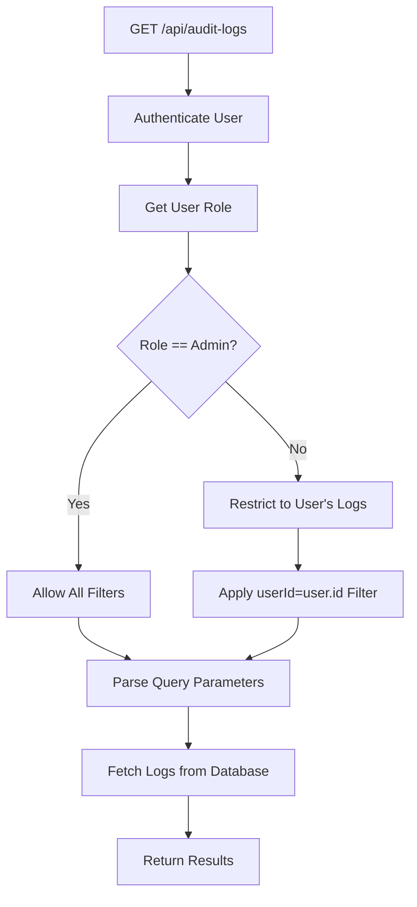
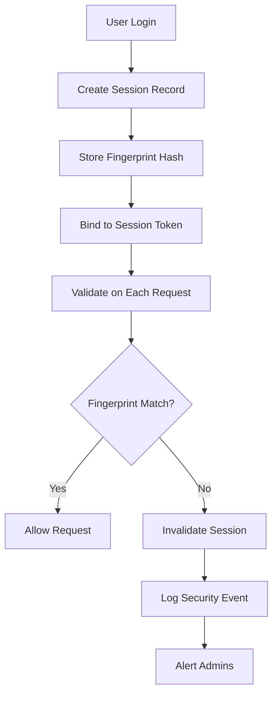

# Server-Side Supabase Client

<cite>
**Referenced Files in This Document**   
- [server.ts](file://lib/supabase/server.ts)
- [create-user/route.ts](file://app/api/admin/create-user/route.ts)
- [grades/route.ts](file://app/api/admin/grades/route.ts)
- [audit-logs.ts](file://lib/supabase/audit-logs.ts)
- [middleware.ts](file://lib/supabase/middleware.ts)
- [session-security.ts](file://lib/session-security.ts)
- [security.ts](file://lib/security.ts)
- [20251219044036_add_rls_policies.sql](file://supabase/migrations/20251219044036_add_rls_policies.sql)
- [20251219081226_allow_admin_read_all_users.sql](file://supabase/migrations/20251219081226_allow_admin_read_all_users.sql)
</cite>

## Table of Contents
1. [Introduction](#introduction)
2. [Core Architecture](#core-architecture)
3. [Security Model and RLS Bypass](#security-model-and-rls-bypass)
4. [Integration with Next.js Server Components](#integration-with-nextjs-server-components)
5. [Admin Workflow Usage Patterns](#admin-workflow-usage-patterns)
6. [Security Implications and Safeguards](#security-implications-and-safeguards)
7. [Performance Optimization](#performance-optimization)
8. [Conclusion](#conclusion)

## Introduction

The server-side Supabase client wrapper in `server.ts` provides a secure and efficient mechanism for administrative operations in the school management system. It enables elevated database access through Supabase service role keys while maintaining strict security boundaries. This documentation details how the wrapper integrates with Next.js server components and API routes, supports administrative workflows such as user creation and audit log access, and implements safeguards against misuse. The design emphasizes security, performance, and maintainability in a serverless environment.

## Core Architecture

The Supabase client architecture is structured to separate authenticated user access from administrative operations. The `server.ts` file exports two primary functions: `createClient()` for standard authenticated access and `createAdminClient()` for elevated privileges.



**Diagram sources**  
- [server.ts](file://lib/supabase/server.ts#L5-L50)

**Section sources**  
- [server.ts](file://lib/supabase/server.ts#L1-L50)

## Security Model and RLS Bypass

The system implements Row Level Security (RLS) to restrict data access based on user identity and role. Regular clients respect these policies, but administrative operations require bypassing RLS for bulk operations and cross-user data access.

The `createAdminClient()` function uses the Supabase service role key to create a client with elevated privileges. This allows operations that would otherwise be restricted by RLS, such as creating users, reading all user records, or modifying data across multiple user boundaries.

```sql
-- Allow admins to read all users
CREATE POLICY "Admins can read all users"
ON public.users
FOR SELECT
TO authenticated
USING (
  EXISTS (
    SELECT 1 FROM public.users
    WHERE id = auth.uid() AND role = 'admin'
  )
);
```

This policy ensures that only authenticated users with the "admin" role can read all user records, even when using the service role client.

**Diagram sources**  
- [20251219081226_allow_admin_read_all_users.sql](file://supabase/migrations/20251219081226_allow_admin_read_all_users.sql#L1-L12)
- [20251219044036_add_rls_policies.sql](file://supabase/migrations/20251219044036_add_rls_policies.sql#L1-L22)

**Section sources**  
- [server.ts](file://lib/supabase/server.ts#L36-L50)
- [20251219081226_allow_admin_read_all_users.sql](file://supabase/migrations/20251219081226_allow_admin_read_all_users.sql#L1-L12)

## Integration with Next.js Server Components

The Supabase client integrates seamlessly with Next.js server components and API routes through cookie-based authentication context extraction. The `createClient()` function reads authentication cookies to establish the user context, while administrative endpoints validate user roles before proceeding with elevated operations.

In API routes like `app/api/admin/grades/route.ts`, the process follows a strict authorization flow:
1. Extract user authentication state from cookies
2. Verify the user is authenticated
3. Query the user's role from the database
4. Enforce role-based access control
5. Proceed with data operations



**Diagram sources**  
- [grades/route.ts](file://app/api/admin/grades/route.ts#L4-L57)

**Section sources**  
- [server.ts](file://lib/supabase/server.ts#L5-L30)
- [grades/route.ts](file://app/api/admin/grades/route.ts#L4-L57)
- [middleware.ts](file://lib/supabase/middleware.ts#L4-L38)

## Admin Workflow Usage Patterns

Administrative workflows leverage the service role client for operations that require elevated privileges. Two key examples demonstrate this pattern: user creation and grade management.

### User Creation Workflow

The `app/api/admin/create-user/route.ts` endpoint demonstrates a comprehensive administrative operation that combines security checks, user validation, and multi-step database operations:



Key security features in this workflow:
- CSRF protection via origin validation
- Rate limiting based on client IP
- Admin role verification before proceeding
- Server-side password generation with complexity enforcement
- Transactional-like behavior with cleanup on failure

**Diagram sources**  
- [create-user/route.ts](file://app/api/admin/create-user/route.ts#L8-L156)

**Section sources**  
- [create-user/route.ts](file://app/api/admin/create-user/route.ts#L8-L156)
- [security.ts](file://lib/security.ts#L20-L67)
- [session-security.ts](file://lib/session-security.ts#L7-L12)

### Audit Log Access

Administrative endpoints also provide access to sensitive system data like audit logs. The system implements fine-grained access control where admins can view all logs, while regular users can only view their own activity.



This pattern ensures that elevated privileges are only used when necessary and that access is always validated.

**Section sources**  
- [audit-logs.ts](file://lib/supabase/audit-logs.ts#L41-L82)
- [route.ts](file://app/api/audit-logs/route.ts#L5-L65)

## Security Implications and Safeguards

The use of service role keys introduces significant security implications that are mitigated through multiple safeguards.

### Service Role Key Protection

The service role key grants full database access, bypassing all RLS policies. To prevent accidental exposure:
- The key is stored in environment variables and never committed to version control
- The `.env.example` file serves as a template without actual secrets
- Code reviews enforce the principle of least privilege

```typescript
export function createAdminClient() {
  const supabaseUrl = process.env.NEXT_PUBLIC_SUPABASE_URL!
  const serviceRoleKey = process.env.SUPABASE_SERVICE_ROLE_KEY!
  
  if (!serviceRoleKey) {
    throw new Error("SUPABASE_SERVICE_ROLE_KEY is not set")
  }
  
  return createSupabaseClient(supabaseUrl, serviceRoleKey, {
    auth: {
      autoRefreshToken: false,
      persistSession: false,
    },
  })
}
```

### Connection Pooling and Reuse

In serverless environments, connection pooling is managed by Supabase. The client instances are created per request, but Supabase handles connection reuse at the infrastructure level. The configuration `autoRefreshToken: false` and `persistSession: false` optimizes for short-lived serverless functions.

### Security Monitoring

The system implements comprehensive security monitoring through:
- Session fingerprinting to detect hijacking attempts
- IP address hashing for privacy-preserving abuse detection
- Security event logging for suspicious activity
- Regular cleanup of old sessions



**Diagram sources**  
- [session-security.ts](file://lib/session-security.ts#L68-L147)

**Section sources**  
- [session-security.ts](file://lib/session-security.ts#L1-L373)
- [security.ts](file://lib/security.ts#L1-L136)
- [20260111_session_security.sql](file://supabase/migrations/20260111_session_security.sql#L66-L114)

## Performance Optimization

The server-side Supabase client is optimized for serverless environments with considerations for cold starts and efficient client reuse.

### Cold Start Minimization

To minimize cold start impact:
- Client creation is deferred until needed
- Environment variables are accessed only when required
- Error handling avoids unnecessary computations

### Efficient Client Reuse

While each request creates a new client instance, Supabase manages connection pooling at the service level. The configuration options ensure optimal behavior:

```typescript
// Admin client configuration
{
  auth: {
    autoRefreshToken: false,  // Disable for short-lived serverless functions
    persistSession: false,    // Session persistence not needed in server context
  },
}
```

### Query Optimization

Administrative operations use optimized queries with proper indexing and selective field retrieval. The system leverages Supabase's query builder to construct efficient database operations that minimize data transfer and processing overhead.

**Section sources**  
- [server.ts](file://lib/supabase/server.ts#L36-L50)
- [queries.ts](file://lib/supabase/queries.ts#L1-L419)
- [audit-logs.ts](file://lib/supabase/audit-logs.ts#L55-L70)

## Conclusion

The server-side Supabase client wrapper provides a secure and efficient mechanism for administrative operations in the school management system. By leveraging service role keys judiciously and implementing comprehensive safeguards, the system enables powerful administrative functionality while maintaining strict security boundaries. The integration with Next.js server components ensures seamless authentication context extraction, and the design considerations for serverless environments optimize performance and reliability. This architecture serves as a model for secure, scalable, and maintainable server-side database access in modern web applications.