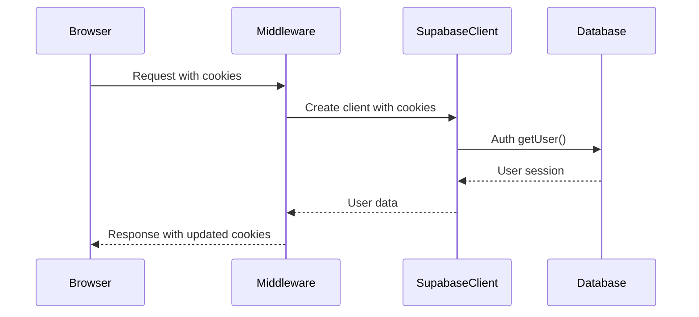
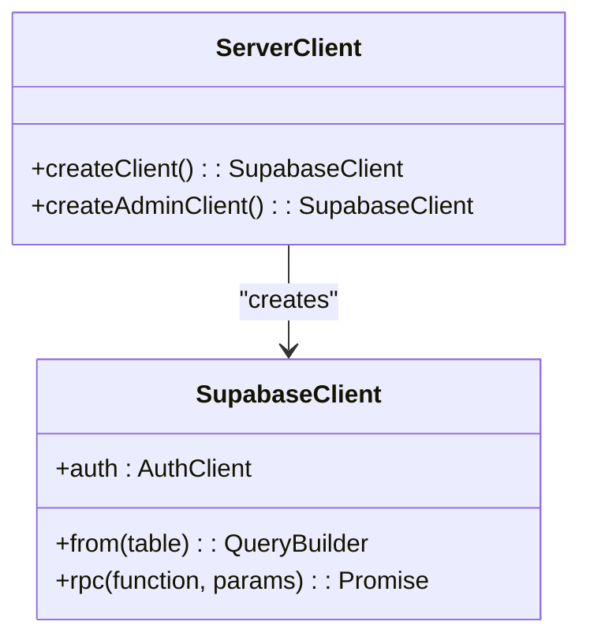
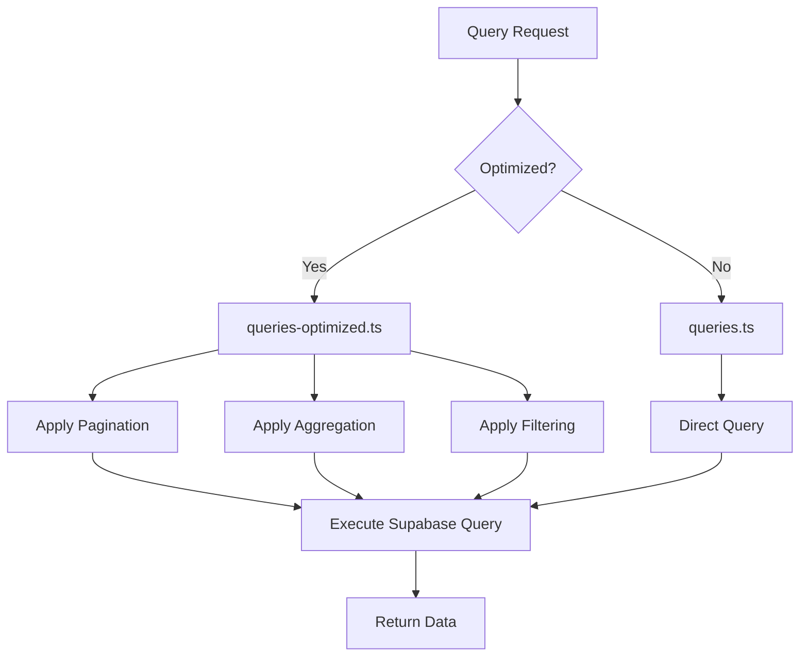
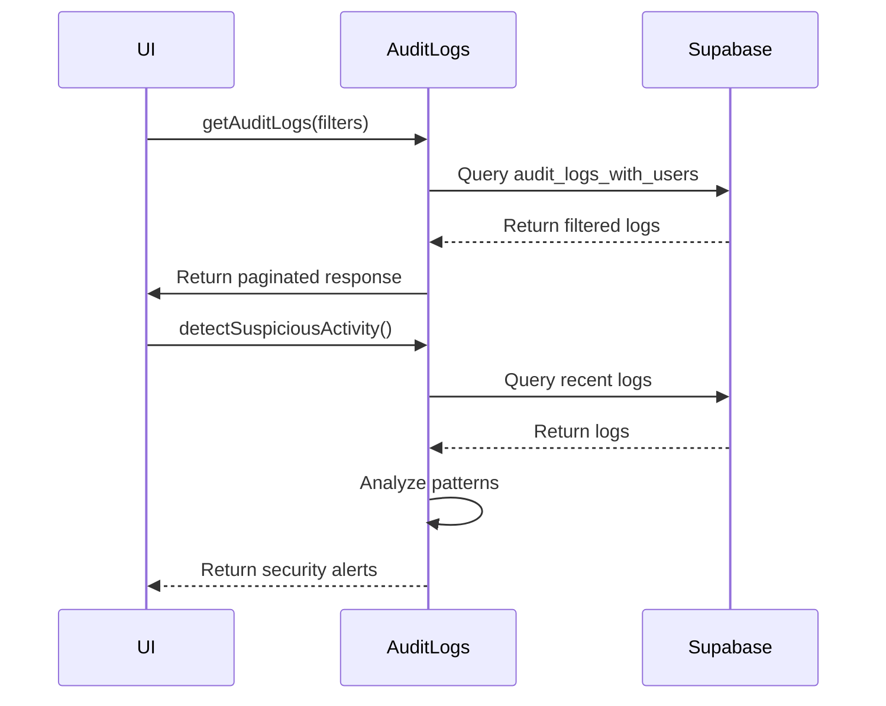
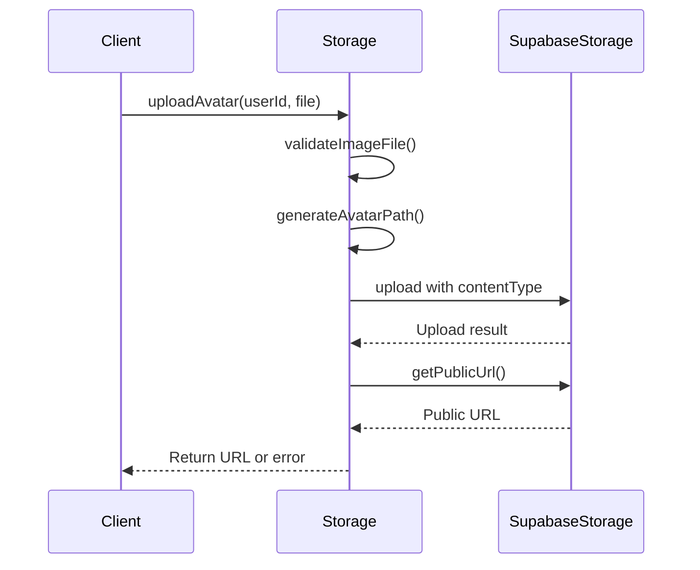
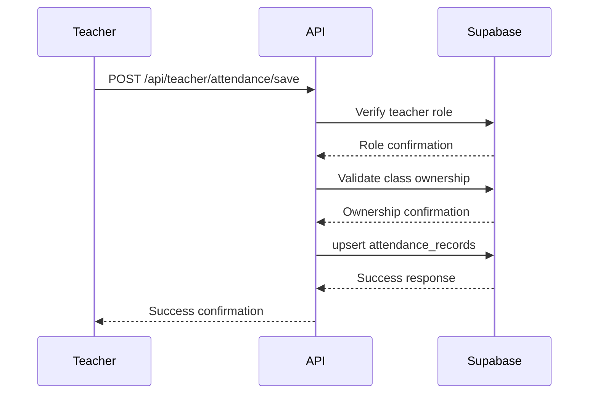
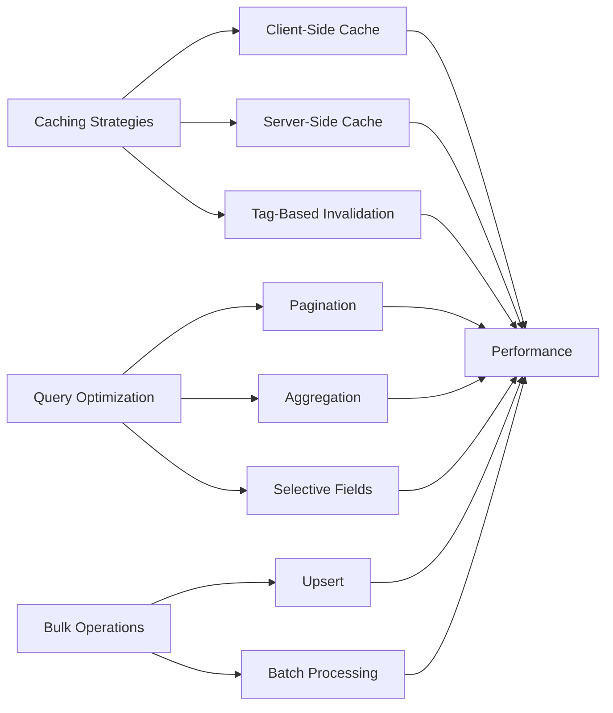

# Supabase Service Client

<cite>
**Referenced Files in This Document**   
- [client.ts](file://lib/supabase/client.ts)
- [server.ts](file://lib/supabase/server.ts)
- [queries.ts](file://lib/supabase/queries.ts)
- [queries-optimized.ts](file://lib/supabase/queries-optimized.ts)
- [audit-logs.ts](file://lib/supabase/audit-logs.ts)
- [storage.ts](file://lib/supabase/storage.ts)
- [types.ts](file://lib/supabase/types.ts)
- [middleware.ts](file://lib/supabase/middleware.ts)
- [use-optimized-query.ts](file://lib/hooks/use-optimized-query.ts)
- [cache.ts](file://lib/cache.ts)
- [route.ts](file://app/api/admin/students/route.ts)
- [route.ts](file://app/api/student/grades/route.ts)
- [route.ts](file://app/api/teacher/attendance/save/route.ts)
- [route.ts](file://app/api/admin/grades/route.ts)
- [route.ts](file://app/api/admin/attendance/route.ts)
</cite>

## Table of Contents
1. [Introduction](#introduction)
2. [Client-Side Supabase Client](#client-side-supabase-client)
3. [Server-Side Supabase Client](#server-side-supabase-client)
4. [Query Abstraction Layer](#query-abstraction-layer)
5. [Audit Logs Management](#audit-logs-management)
6. [Secure Storage Operations](#secure-storage-operations)
7. [Usage Examples in API Routes](#usage-examples-in-api-routes)
8. [Error Handling and Retry Logic](#error-handling-and-retry-logic)
9. [Performance Considerations](#performance-considerations)
10. [Conclusion](#conclusion)

## Introduction
The Supabase service client implementation provides a comprehensive data access layer for the school management system, enabling secure and efficient interactions with the Supabase backend. This documentation details the architecture and functionality of the client implementation, focusing on the separation between client-side and server-side operations, query optimization strategies, audit logging, secure storage, and integration patterns used throughout the application.

**Section sources**
- [client.ts](file://lib/supabase/client.ts)
- [server.ts](file://lib/supabase/server.ts)

## Client-Side Supabase Client

The client.ts module implements the client-side Supabase client using the createBrowserClient function from @supabase/ssr. This client is designed for browser environments and manages authentication state through browser cookies. The implementation provides a simple createClient function that initializes the Supabase client with environment variables for the public URL and anonymous key.

This client enforces Row Level Security (RLS) policies defined in the database, ensuring that client-side operations respect the security constraints. It is used in React components and client-side hooks to fetch data that should be visible to the authenticated user based on their role and permissions.

The client is integrated with Next.js App Router through the middleware.ts file, which handles session updates and authentication state management during server-side rendering. This ensures that the authentication context is properly maintained across page transitions.

**Diagram sources**
- [client.ts](file://lib/supabase/client.ts#L1-L9)
- [middleware.ts](file://lib/supabase/middleware.ts#L1-L38)

**Section sources**
- [client.ts](file://lib/supabase/client.ts#L1-L9)
- [middleware.ts](file://lib/supabase/middleware.ts#L1-L38)

## Server-Side Supabase Client

The server.ts module provides the server-side Supabase client wrapper with enhanced security features and role-based access patterns. It exports two primary functions: createClient for regular server-side operations with RLS enforcement, and createAdminClient for administrative operations that bypass RLS.

The createClient function uses createServerClient from @supabase/ssr and integrates with Next.js headers to manage cookies during server-side rendering. It properly handles cookie operations, including error handling for cases where setAll is called from Server Components.

The createAdminClient function is particularly important as it allows webhooks and background jobs to access data without user context by using the service role key. This client disables automatic token refresh and session persistence, as these are not needed for server-to-server communication. The implementation includes validation to ensure the service role key is configured, throwing an error if it's missing.

**Diagram sources**
- [server.ts](file://lib/supabase/server.ts#L1-L51)

**Section sources**
- [server.ts](file://lib/supabase/server.ts#L1-L51)

## Query Abstraction Layer

The query abstraction layer consists of two complementary modules: queries.ts and queries-optimized.ts. These files provide reusable query functions that encapsulate common database operations across the application.

The queries.ts module contains basic query functions for retrieving data from various entities including users, students, teachers, classes, schedules, attendance records, grades, quizzes, and lessons. Each function uses the client-side Supabase client and implements proper error handling, throwing errors when database operations fail.

The queries-optimized.ts module provides performance-enhanced versions of these queries with several optimization techniques:
- Pagination support with exact count retrieval
- Optimized joins with aggregation (e.g., getClassesWithCounts includes student enrollment counts)
- Date range filtering for attendance and grade queries
- Limit constraints to prevent excessive data retrieval
- Bulk operations using upsert for improved performance

The optimized queries return structured responses with pagination metadata, making them suitable for use in paginated UI components. They also implement more efficient data retrieval patterns, such as using head queries for count operations without fetching data.

**Diagram sources**
- [queries.ts](file://lib/supabase/queries.ts#L1-L419)
- [queries-optimized.ts](file://lib/supabase/queries-optimized.ts#L1-L317)

**Section sources**
- [queries.ts](file://lib/supabase/queries.ts#L1-L419)
- [queries-optimized.ts](file://lib/supabase/queries-optimized.ts#L1-L317)

## Audit Logs Management

The audit-logs.ts module provides comprehensive functionality for structured logging of critical system events with user context and action tracking. It defines interfaces for audit log entries, filters, and statistics, enabling rich querying and analysis of security-related events.

Key features include:
- getAuditLogs: Retrieves audit logs with filtering by user, action, date range, and IP address, with pagination support
- getUserAuditLogs: Fetches audit logs for a specific user, used in profile pages
- getAuditLogStats: Calculates statistics such as login success rates and unique users over a specified period
- detectSuspiciousActivity: Identifies potential security threats like multiple failed login attempts
- exportAuditLogsToCSV: Exports audit logs to CSV format with formula injection protection

The module also includes utility functions for enhancing audit log data, such as getActionDisplayName which maps technical action names to user-friendly display names, and getActionSeverity which categorizes actions by security impact.

**Diagram sources**
- [audit-logs.ts](file://lib/supabase/audit-logs.ts#L1-L321)

**Section sources**
- [audit-logs.ts](file://lib/supabase/audit-logs.ts#L1-L321)

## Secure Storage Operations

The storage.ts module handles secure file operations with signed URLs and bucket policies. It provides functionality for avatar management and secure access to lesson materials.

Key components include:
- Constants for the avatars and materials buckets with appropriate access policies
- ensureAvatarBucketExists: Ensures the avatars bucket exists with proper configuration
- validateImageFile: Client-side validation for image uploads
- generateAvatarPath: Creates unique file paths to prevent predictable filenames
- uploadAvatar: Handles avatar uploads with MIME type enforcement and explicit content type setting
- deleteAvatar: Removes avatars from storage
- getSignedMaterialUrl: Generates time-limited signed URLs for accessing private materials

The implementation includes multiple security measures:
- Strict client-side validation of file types and sizes
- MIME type-based file extension enforcement
- Explicit content type setting during upload to prevent content sniffing attacks
- Short-lived signed URLs (5 minutes) for private materials
- Randomized file paths using UUIDs to prevent enumeration

**Diagram sources**
- [storage.ts](file://lib/supabase/storage.ts#L1-L110)

**Section sources**
- [storage.ts](file://lib/supabase/storage.ts#L1-L110)

## Usage Examples in API Routes

The Supabase client modules are consumed in various API routes throughout the application, demonstrating different patterns for user management, grade retrieval, and attendance records.

In admin/students/route.ts, the server client is used with rate limiting and pagination. The implementation verifies admin role, applies rate limiting based on client IP, validates pagination parameters, and constructs queries with optional search filtering. It also implements a DTO pattern to ensure data integrity in the response.

For student grade retrieval in student/grades/route.ts, the implementation strictly enforces that students can only access their own grades by filtering on the authenticated user's ID. This server-side enforcement complements the RLS policies in the database.

The teacher attendance save route demonstrates bulk operation security by verifying that the teacher owns all classes in the batch update. It uses the upsert method with a composite conflict key to efficiently update multiple attendance records while preventing unauthorized access to classes the teacher doesn't own.

**Diagram sources**
- [route.ts](file://app/api/admin/students/route.ts#L1-L116)
- [route.ts](file://app/api/student/grades/route.ts#L1-L40)
- [route.ts](file://app/api/teacher/attendance/save/route.ts#L1-L58)

**Section sources**
- [route.ts](file://app/api/admin/students/route.ts#L1-L116)
- [route.ts](file://app/api/student/grades/route.ts#L1-L40)
- [route.ts](file://app/api/teacher/attendance/save/route.ts#L1-L58)

## Error Handling and Retry Logic

The implementation includes comprehensive error handling strategies across both client and server components. On the server side, API routes use try-catch blocks to handle unexpected errors, with specific error responses for unauthorized, forbidden, and validation scenarios.

The use-optimized-query.ts hook implements sophisticated client-side error handling with retry logic for transient failures. It distinguishes between network errors and other types of errors, applying exponential backoff for retries with a maximum of three attempts. The hook also provides error callbacks and proper cleanup of resources.

The cache.ts module contributes to error resilience by providing a caching layer that can serve stale data when the primary data source is unavailable. The cachedQuery function returns cached data when available and within the TTL window, reducing the impact of temporary database connectivity issues.

Security-related errors are handled with appropriate logging while avoiding information leakage to clients. For example, authentication errors are logged with details in development mode but return generic messages in production.

**Section sources**
- [use-optimized-query.ts](file://lib/hooks/use-optimized-query.ts#L1-L275)
- [cache.ts](file://lib/cache.ts#L1-L128)
- [route.ts](file://app/api/admin/students/route.ts#L1-L116)

## Performance Considerations

The Supabase client implementation incorporates several performance optimization strategies:

Query optimization includes the use of indexing hints, reduced payload queries with specific column selection, and efficient joins that minimize round trips. The optimized queries leverage Supabase features like exact count retrieval and range-based pagination to improve performance.

Caching patterns are implemented at multiple levels:
- Client-side caching with TTL using the use-optimized-query hook
- Server-side caching with Next.js unstable_cache for automatic revalidation
- Tag-based cache invalidation to ensure data consistency

The use-optimized-query hook implements several performance-enhancing features:
- Automatic caching and deduplication of identical queries
- Background refetching at configurable intervals
- Debounced search queries to reduce unnecessary API calls
- Infinite scroll and paginated query patterns to manage large datasets

Connection lifecycle management is handled through the proper initialization and cleanup of Supabase clients. The server client properly manages cookie state during SSR, while the admin client disables session persistence for server-to-server operations.

Bulk operations are optimized using upsert rather than individual inserts/updates, significantly reducing the number of database round trips for batch operations.

**Diagram sources**
- [use-optimized-query.ts](file://lib/hooks/use-optimized-query.ts#L1-L275)
- [cache.ts](file://lib/cache.ts#L1-L128)
- [queries-optimized.ts](file://lib/supabase/queries-optimized.ts#L1-L317)

**Section sources**
- [use-optimized-query.ts](file://lib/hooks/use-optimized-query.ts#L1-L275)
- [cache.ts](file://lib/cache.ts#L1-L128)
- [queries-optimized.ts](file://lib/supabase/queries-optimized.ts#L1-L317)

## Conclusion

The Supabase service client implementation provides a robust, secure, and performant data access layer for the school management system. By separating client-side and server-side concerns, implementing comprehensive query abstractions, and incorporating advanced features like audit logging and secure storage, the architecture enables efficient development while maintaining strong security guarantees.

The design patterns demonstrated in this implementation—particularly the use of optimized queries, proper authentication state management, and comprehensive error handling—serve as a model for building scalable applications with Supabase. The integration of caching, pagination, and bulk operations ensures that the system can handle growing amounts of data and users without compromising performance.

Future enhancements could include more sophisticated caching strategies, enhanced monitoring of query performance, and additional security features such as query parameter validation and more granular access controls.