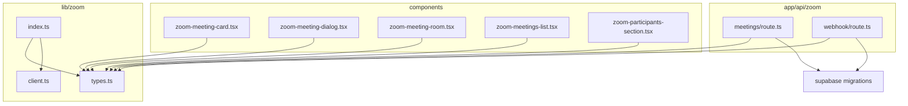
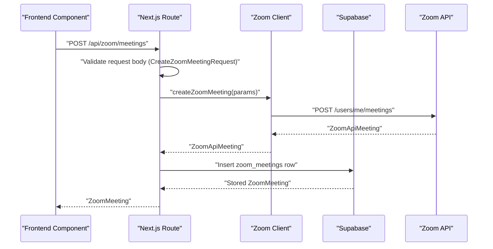
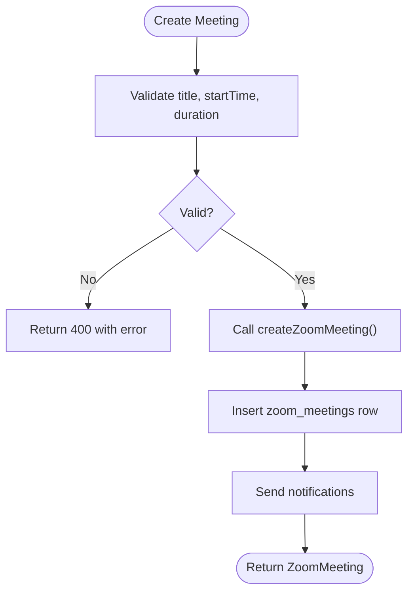
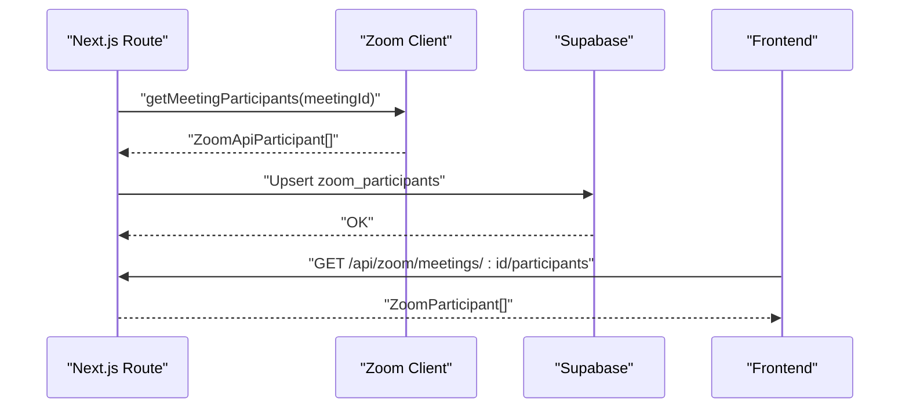
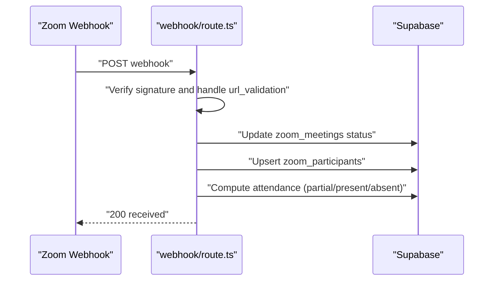
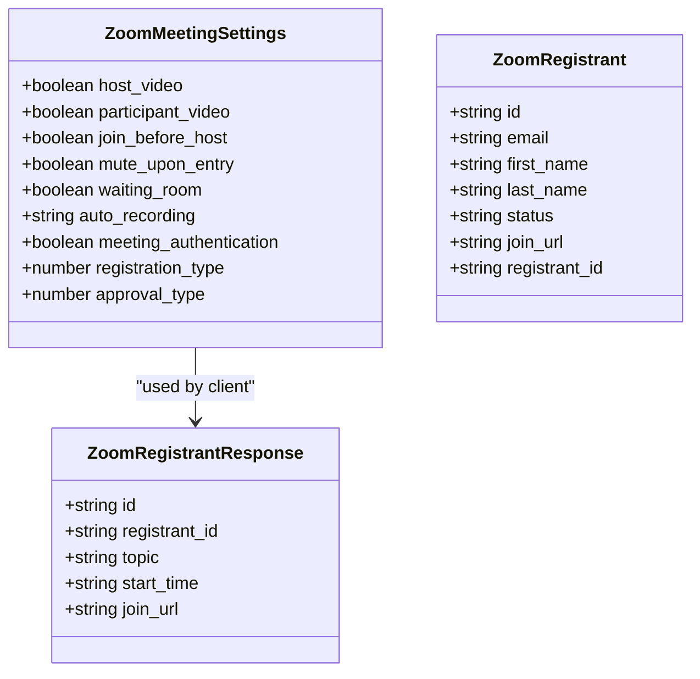
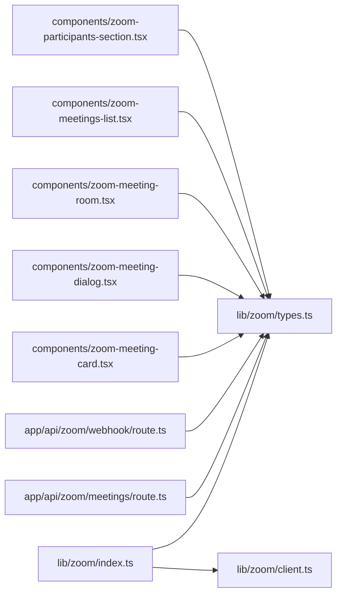

# Zoom API Types and Interfaces

<cite>
**Referenced Files in This Document**
- [types.ts](file://lib/zoom/types.ts)
- [client.ts](file://lib/zoom/client.ts)
- [index.ts](file://lib/zoom/index.ts)
- [route.ts](file://app/api/zoom/meetings/route.ts)
- [route.ts](file://app/api/zoom/webhook/route.ts)
- [zoom-meeting-card.tsx](file://components/zoom-meeting-card.tsx)
- [zoom-meeting-dialog.tsx](file://components/zoom-meeting-dialog.tsx)
- [zoom-meeting-room.tsx](file://components/zoom-meeting-room.tsx)
- [zoom-meetings-list.tsx](file://components/zoom-meetings-list.tsx)
- [zoom-participants-section.tsx](file://components/zoom-participants-section.tsx)
- [20260110000001_create_zoom_meetings_table.sql](file://supabase/migrations/20260110000001_create_zoom_meetings_table.sql)
- [20260110102108_add_partial_attendance_status.sql](file://supabase/migrations/20260110102108_add_partial_attendance_status.sql)
- [constants.ts](file://lib/zoom/constants.ts)
</cite>

## Table of Contents
1. [Introduction](#introduction)
2. [Project Structure](#project-structure)
3. [Core Components](#core-components)
4. [Architecture Overview](#architecture-overview)
5. [Detailed Component Analysis](#detailed-component-analysis)
6. [Dependency Analysis](#dependency-analysis)
7. [Performance Considerations](#performance-considerations)
8. [Troubleshooting Guide](#troubleshooting-guide)
9. [Conclusion](#conclusion)
10. [Appendices](#appendices)

## Introduction
This document explains the TypeScript interfaces and types used to model Zoom API interactions in the application. It focuses on:
- How the types ensure type safety when interacting with Zoom APIs
- How these types are used across backend routes and frontend components
- Optional vs required fields, enums, and validation expectations
- Strategies for reflecting Zoom API schema changes and versioning

The types are defined in a dedicated module and re-exported for convenient imports across the app.

## Project Structure
The Zoom-related types live under a dedicated module and are consumed by both server routes and client components.

**Diagram sources**
- [types.ts](file://lib/zoom/types.ts#L1-L168)
- [client.ts](file://lib/zoom/client.ts#L1-L334)
- [index.ts](file://lib/zoom/index.ts#L1-L10)
- [route.ts](file://app/api/zoom/meetings/route.ts#L1-L345)
- [route.ts](file://app/api/zoom/webhook/route.ts#L1-L342)
- [zoom-meeting-card.tsx](file://components/zoom-meeting-card.tsx#L1-L274)
- [zoom-meeting-dialog.tsx](file://components/zoom-meeting-dialog.tsx#L1-L326)
- [zoom-meeting-room.tsx](file://components/zoom-meeting-room.tsx#L1-L254)
- [zoom-meetings-list.tsx](file://components/zoom-meetings-list.tsx#L1-L246)
- [zoom-participants-section.tsx](file://components/zoom-participants-section.tsx#L1-L265)
- [20260110000001_create_zoom_meetings_table.sql](file://supabase/migrations/20260110000001_create_zoom_meetings_table.sql#L1-L113)
- [20260110102108_add_partial_attendance_status.sql](file://supabase/migrations/20260110102108_add_partial_attendance_status.sql#L1-L4)

**Section sources**
- [types.ts](file://lib/zoom/types.ts#L1-L168)
- [index.ts](file://lib/zoom/index.ts#L1-L10)

## Core Components
This section documents the primary types and their roles.

- MeetingCreateParams (alias: CreateZoomMeetingRequest)
  - Purpose: Describes the shape of requests to create a Zoom meeting via the backend.
  - Fields:
    - title: required string
    - description: optional string
    - startTime: required ISO string
    - duration: required number (minutes)
    - timezone: optional string
    - classId: optional string
    - targetAudience: optional union of allowed audience values
    - settings: optional partial of ZoomMeetingSettings
  - Validation expectations:
    - title, startTime, duration are required for creation.
    - timezone defaults to UTC if omitted.
    - targetAudience defaults to "class" if omitted.
    - settings defaults to sensible defaults when creating Zoom meetings.

- MeetingResponse (alias: ZoomMeeting)
  - Purpose: Represents a stored meeting entity in the application’s database with joined data.
  - Fields:
    - id: required string (UUID)
    - zoom_meeting_id: required string (Zoom meeting identifier)
    - host_id: required string (UUID)
    - title: required string
    - description: optional string
    - meeting_type: union of allowed meeting types
    - start_time: required ISO string
    - duration: required number (minutes)
    - timezone: required string
    - join_url: required string
    - start_url: optional string
    - password: optional string
    - status: union of allowed statuses
    - class_id: optional string
    - target_audience: union of allowed audience values
    - settings: ZoomMeetingSettings
    - created_at: required ISO string
    - updated_at: required ISO string
    - host: optional object with id, name, email, avatar
    - class: optional object with id, name

- Participant (alias: ZoomParticipant)
  - Purpose: Represents a participant tracked in the application’s database.
  - Fields:
    - id: required string (UUID)
    - meeting_id: required string (UUID)
    - user_id: optional string (UUID)
    - zoom_participant_id: optional string
    - name: optional string
    - email: optional string
    - join_time: optional ISO string
    - leave_time: optional ISO string
    - duration: optional number (seconds)
    - status: union of allowed participant statuses
    - created_at: required ISO string
    - user: optional object with id, name, email, avatar

- ReportResponse (alias: ZoomApiParticipant)
  - Purpose: Represents a participant entry returned by Zoom’s past meetings participants API.
  - Fields:
    - id: required string
    - user_id: required string
    - name: required string
    - user_email: required string
    - join_time: required ISO string
    - leave_time: required ISO string
    - duration: required number (seconds)

- WebhookPayload (alias: ZoomWebhookEvent)
  - Purpose: Represents the incoming Zoom webhook payload envelope.
  - Fields:
    - event: required string (e.g., endpoint.url_validation, meeting.started, meeting.ended, meeting.participant_joined, meeting.participant_left)
    - event_ts: required number (Unix timestamp)
    - payload: required object containing:
      - account_id: required string
      - object: required ZoomWebhookMeetingObject

- WebhookMeetingObject (alias: ZoomWebhookMeetingObject)
  - Purpose: Represents the Zoom meeting object inside a webhook payload.
  - Fields:
    - id: required string
    - uuid: required string
    - host_id: required string
    - topic: required string
    - type: required number
    - start_time: required ISO string
    - duration: required number
    - timezone: required string
    - participant: optional object with user_id, user_name, email, join_time, leave_time

- Enums and unions
  - ZoomMeetingType: instant | scheduled | recurring
  - ZoomMeetingStatus: scheduled | started | ended | cancelled
  - ZoomParticipantStatus: invited | joined | left
  - Target audience: all | students | teachers | class | personal
  - Auto recording: none | local | cloud
  - Approval type: 0 | 1 | 2
  - Registration type: 1 | 2 | 3

- Utility types and helpers
  - Partial<ZoomMeetingSettings>: Allows optional settings during creation.
  - isAllowedEmail: Validates allowed email domain for class meetings.

**Section sources**
- [types.ts](file://lib/zoom/types.ts#L1-L168)
- [constants.ts](file://lib/zoom/constants.ts#L1-L22)

## Architecture Overview
The Zoom types are consumed by:
- Backend routes to validate and transform request bodies and responses
- Frontend components to render meeting lists, dialogs, rooms, and participant summaries
- Database migrations to enforce constraints and store typed data

**Diagram sources**
- [route.ts](file://app/api/zoom/meetings/route.ts#L55-L168)
- [client.ts](file://lib/zoom/client.ts#L92-L131)
- [types.ts](file://lib/zoom/types.ts#L82-L117)
- [20260110000001_create_zoom_meetings_table.sql](file://supabase/migrations/20260110000001_create_zoom_meetings_table.sql#L1-L50)

## Detailed Component Analysis

### MeetingCreateParams and MeetingResponse
- Usage in backend:
  - Route handler validates required fields and constructs Zoom API parameters.
  - On success, inserts a row into zoom_meetings with settings serialized as JSONB.
- Usage in frontend:
  - Components consume ZoomMeeting to display cards, lists, and participant summaries.
  - Dialog composes CreateZoomMeetingRequest to submit to the backend.

**Diagram sources**
- [route.ts](file://app/api/zoom/meetings/route.ts#L78-L168)
- [client.ts](file://lib/zoom/client.ts#L92-L131)
- [types.ts](file://lib/zoom/types.ts#L119-L128)
- [20260110000001_create_zoom_meetings_table.sql](file://supabase/migrations/20260110000001_create_zoom_meetings_table.sql#L1-L50)

**Section sources**
- [route.ts](file://app/api/zoom/meetings/route.ts#L78-L168)
- [zoom-meeting-card.tsx](file://components/zoom-meeting-card.tsx#L1-L274)
- [zoom-meeting-dialog.tsx](file://components/zoom-meeting-dialog.tsx#L1-L326)
- [zoom-meetings-list.tsx](file://components/zoom-meetings-list.tsx#L1-L246)

### Participant and ReportResponse
- Participant (stored):
  - Used to track joins/leaves and durations for attendance computation.
- ReportResponse (fetched from Zoom):
  - Used to compute attendance metrics for past meetings.

**Diagram sources**
- [client.ts](file://lib/zoom/client.ts#L187-L192)
- [route.ts](file://app/api/zoom/meetings/route.ts#L1-L345)
- [types.ts](file://lib/zoom/types.ts#L108-L117)
- [20260110000001_create_zoom_meetings_table.sql](file://supabase/migrations/20260110000001_create_zoom_meetings_table.sql#L23-L37)

**Section sources**
- [client.ts](file://lib/zoom/client.ts#L187-L192)
- [route.ts](file://app/api/zoom/meetings/route.ts#L1-L345)
- [zoom-participants-section.tsx](file://components/zoom-participants-section.tsx#L1-L265)

### WebhookPayload and WebhookMeetingObject
- The webhook route validates signatures and parses Zoom’s event payloads.
- It updates meeting status and participant records, and computes attendance.

**Diagram sources**
- [route.ts](file://app/api/zoom/webhook/route.ts#L1-L342)
- [types.ts](file://lib/zoom/types.ts#L131-L157)
- [20260110000001_create_zoom_meetings_table.sql](file://supabase/migrations/20260110000001_create_zoom_meetings_table.sql#L23-L37)
- [20260110102108_add_partial_attendance_status.sql](file://supabase/migrations/20260110102108_add_partial_attendance_status.sql#L1-L4)

**Section sources**
- [route.ts](file://app/api/zoom/webhook/route.ts#L1-L342)
- [types.ts](file://lib/zoom/types.ts#L131-L157)

### ZoomMeetingSettings and Registration Types
- ZoomMeetingSettings:
  - Controls meeting behavior (video, waiting room, mute upon entry, auto-recording).
  - Registration and approval types are supported for class-linked meetings.
- ZoomRegistrant and ZoomRegistrantResponse:
  - Used to register users for meetings and receive join URLs.

**Diagram sources**
- [types.ts](file://lib/zoom/types.ts#L49-L71)
- [types.ts](file://lib/zoom/types.ts#L73-L80)
- [client.ts](file://lib/zoom/client.ts#L259-L308)

**Section sources**
- [types.ts](file://lib/zoom/types.ts#L49-L80)
- [client.ts](file://lib/zoom/client.ts#L259-L308)

### ZoomSdkSignature
- Used to generate client-side SDK signatures for embedded meetings.
- Ensures secure joining via Zoom’s SDK.

**Section sources**
- [types.ts](file://lib/zoom/types.ts#L159-L168)
- [client.ts](file://lib/zoom/client.ts#L213-L232)

## Dependency Analysis
- Re-exports:
  - The module re-exports types and client functions for easy consumption across the app.
- Frontend imports:
  - Components import ZoomMeeting and ZoomMeetingSettings directly from the module.
- Backend imports:
  - Routes import CreateZoomMeetingRequest and other types to validate and transform data.
- Database constraints:
  - Migrations define allowed values for meeting_type, status, target_audience, and participant status.

**Diagram sources**
- [index.ts](file://lib/zoom/index.ts#L1-L10)
- [types.ts](file://lib/zoom/types.ts#L1-L168)
- [route.ts](file://app/api/zoom/meetings/route.ts#L1-L345)
- [route.ts](file://app/api/zoom/webhook/route.ts#L1-L342)
- [zoom-meeting-card.tsx](file://components/zoom-meeting-card.tsx#L1-L274)
- [zoom-meeting-dialog.tsx](file://components/zoom-meeting-dialog.tsx#L1-L326)
- [zoom-meeting-room.tsx](file://components/zoom-meeting-room.tsx#L1-L254)
- [zoom-meetings-list.tsx](file://components/zoom-meetings-list.tsx#L1-L246)
- [zoom-participants-section.tsx](file://components/zoom-participants-section.tsx#L1-L265)

**Section sources**
- [index.ts](file://lib/zoom/index.ts#L1-L10)
- [20260110000001_create_zoom_meetings_table.sql](file://supabase/migrations/20260110000001_create_zoom_meetings_table.sql#L1-L113)

## Performance Considerations
- Token caching:
  - The Zoom client caches access tokens and refreshes them before expiry to reduce network overhead.
- Batch registration:
  - Registrants are added in batches with rate limiting to avoid hitting Zoom API limits.
- Frontend rendering:
  - Components lazy-load participant data and use collapsible sections to minimize DOM work.

**Section sources**
- [client.ts](file://lib/zoom/client.ts#L1-L86)
- [client.ts](file://lib/zoom/client.ts#L276-L308)
- [zoom-participants-section.tsx](file://components/zoom-participants-section.tsx#L1-L265)

## Troubleshooting Guide
- Missing required fields:
  - Creation requires title, startTime, and duration. Ensure these are present in the request body.
- Unauthorized access:
  - Only teachers/admins can create meetings. Verify user role and authentication.
- Zoom not configured:
  - Ensure environment variables for Zoom OAuth and SDK are set.
- Webhook signature errors:
  - Verify x-zm-signature header and timestamp; ensure secret is configured.
- Attendance thresholds:
  - Attendance is considered present only if duration meets the minimum threshold; otherwise marked partial or absent.

**Section sources**
- [route.ts](file://app/api/zoom/meetings/route.ts#L55-L168)
- [client.ts](file://lib/zoom/client.ts#L237-L253)
- [route.ts](file://app/api/zoom/webhook/route.ts#L47-L63)
- [20260110102108_add_partial_attendance_status.sql](file://supabase/migrations/20260110102108_add_partial_attendance_status.sql#L1-L4)

## Conclusion
The Zoom types provide strong type safety across the application, ensuring that:
- Requests and responses are validated at compile time
- Frontend components render consistent data shapes
- Backend routes and database constraints remain aligned
- Webhooks are securely processed and transformed into attendance records

## Appendices

### Optional vs Required Fields
- Required:
  - title, startTime, duration (creation)
  - id, zoom_meeting_id, host_id, title, meeting_type, start_time, duration, timezone, join_url, status, created_at, updated_at (stored meeting)
  - id, meeting_id, user_id/name/email, join_time, leave_time, duration, status, created_at (participant)
- Optional:
  - description, start_url, password, class_id, target_audience, settings, host, class (stored meeting)
  - email, name, join_time, leave_time, duration, user (participant)
  - participant (webhook object)

**Section sources**
- [types.ts](file://lib/zoom/types.ts#L9-L31)
- [types.ts](file://lib/zoom/types.ts#L33-L47)
- [types.ts](file://lib/zoom/types.ts#L131-L157)

### Enum Values and Validation Expectations
- Allowed values enforced by database constraints:
  - meeting_type: instant | scheduled | recurring
  - status: scheduled | started | ended | cancelled
  - target_audience: all | students | teachers | class | personal
  - participant status: invited | joined | left
- Additional enums:
  - auto_recording: none | local | cloud
  - registration_type: 1 | 2 | 3
  - approval_type: 0 | 1 | 2

**Section sources**
- [20260110000001_create_zoom_meetings_table.sql](file://supabase/migrations/20260110000001_create_zoom_meetings_table.sql#L1-L21)
- [20260110000001_create_zoom_meetings_table.sql](file://supabase/migrations/20260110000001_create_zoom_meetings_table.sql#L23-L37)
- [types.ts](file://lib/zoom/types.ts#L49-L60)

### Import and Usage Examples
- Backend route imports:
  - CreateZoomMeetingRequest is imported and used to type the request body.
- Frontend components import:
  - ZoomMeeting and ZoomMeetingSettings are imported to type props and forms.

**Section sources**
- [route.ts](file://app/api/zoom/meetings/route.ts#L1-L10)
- [zoom-meeting-dialog.tsx](file://components/zoom-meeting-dialog.tsx#L1-L20)
- [zoom-meeting-card.tsx](file://components/zoom-meeting-card.tsx#L1-L30)

### Versioning and Schema Evolution
- Align types with Zoom API documentation:
  - Keep ZoomApiMeeting and ZoomApiParticipant aligned with Zoom’s documented response shapes.
- Backward compatibility:
  - Use optional fields and Partial for settings to avoid breaking changes when Zoom adds new fields.
- Migration-first approach:
  - Update database constraints and indexes before changing types to ensure runtime correctness.
- Environment-driven defaults:
  - Use environment variables for SDK keys and OAuth credentials; guard with explicit checks.

**Section sources**
- [client.ts](file://lib/zoom/client.ts#L1-L86)
- [client.ts](file://lib/zoom/client.ts#L237-L253)
- [20260110000001_create_zoom_meetings_table.sql](file://supabase/migrations/20260110000001_create_zoom_meetings_table.sql#L1-L113)