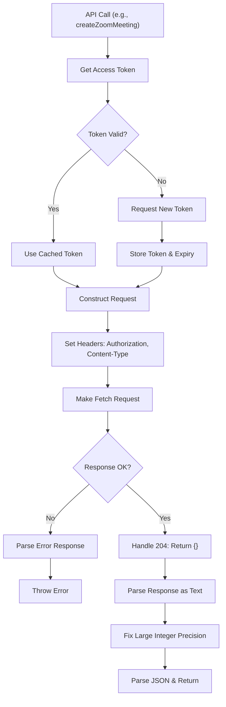
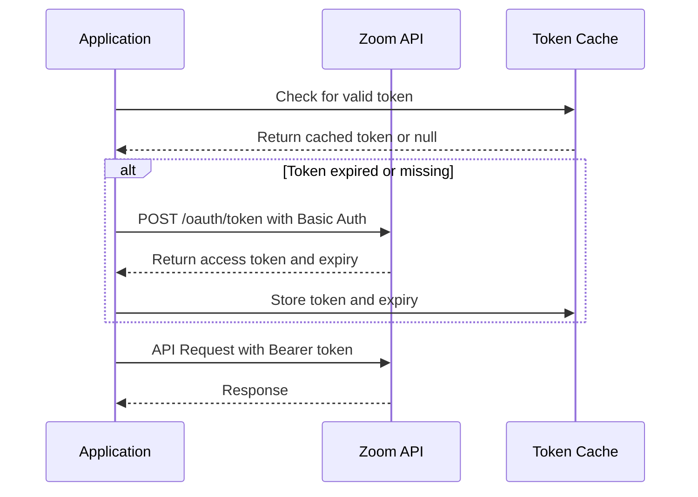
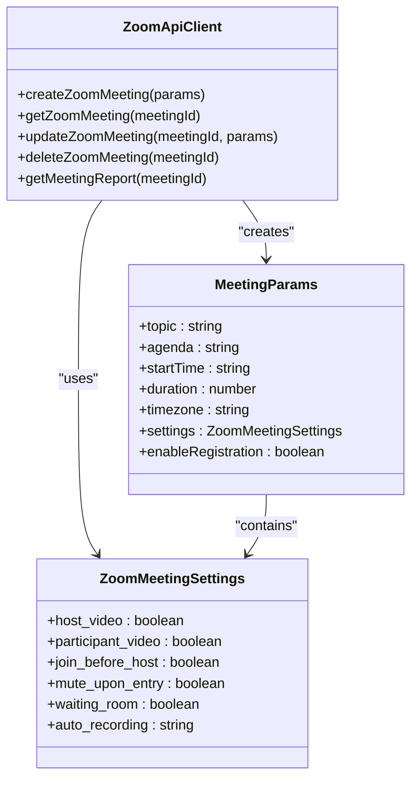
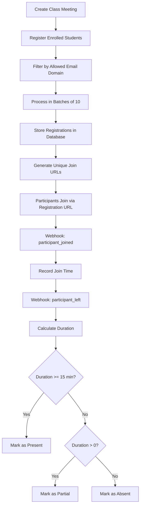
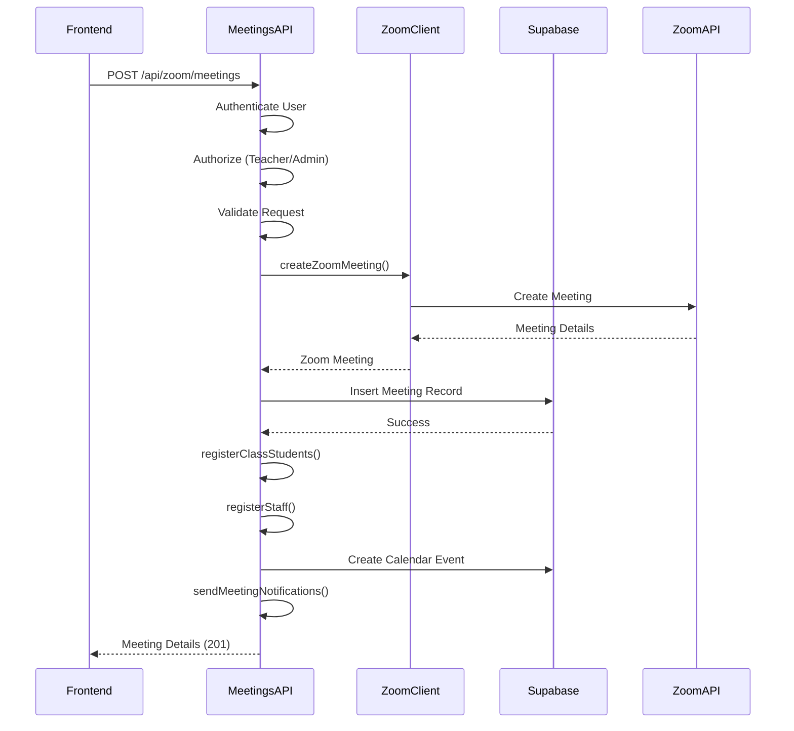
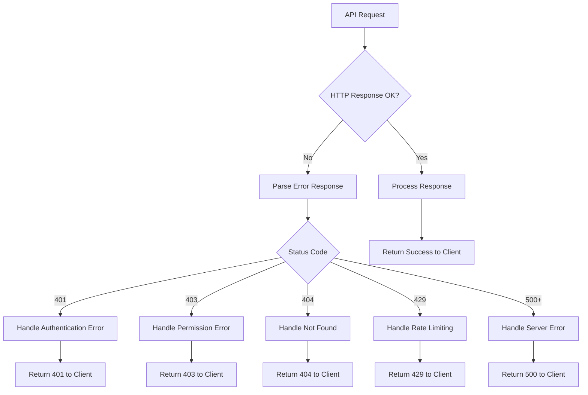
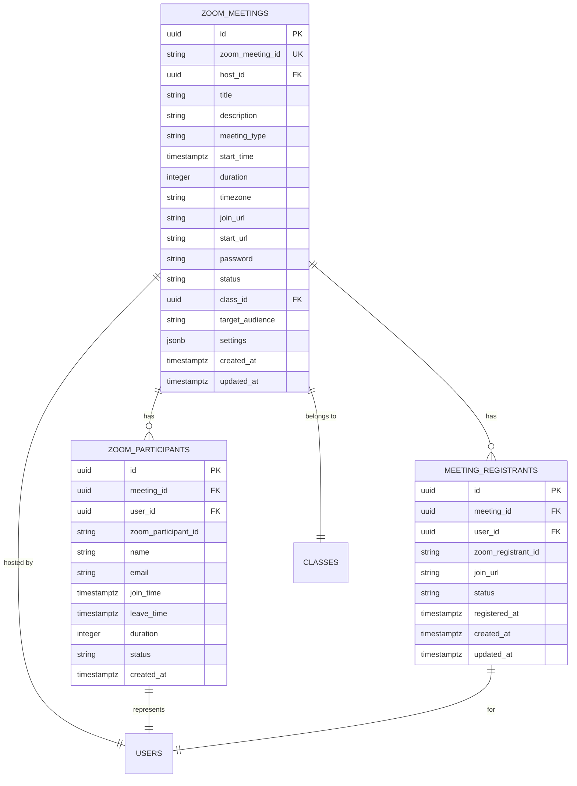

# Zoom Client Implementation

<cite>
**Referenced Files in This Document**   
- [client.ts](file://lib/zoom/client.ts)
- [meetings/route.ts](file://app/api/zoom/meetings/route.ts)
- [reports/route.ts](file://app/api/zoom/reports/route.ts)
- [types.ts](file://lib/zoom/types.ts)
- [constants.ts](file://lib/zoom/constants.ts)
- [index.ts](file://lib/zoom/index.ts)
- [server.ts](file://lib/supabase/server.ts)
- [webhook/route.ts](file://app/api/zoom/webhook/route.ts)
- [.env.example](file://.env.example)
- [create_zoom_meetings_table.sql](file://supabase/migrations/20260110000001_create_zoom_meetings_table.sql)
- [create_meeting_registrants_table.sql](file://supabase/migrations/20260110000002_create_meeting_registrants_table.sql)
- [api-errors.ts](file://lib/api-errors.ts)
- [rate-limit.ts](file://lib/rate-limit.ts)
- [database.types.ts](file://lib/database.types.ts)
</cite>

## Table of Contents
1. [Introduction](#introduction)
2. [HTTP Client Configuration](#http-client-configuration)
3. [Authentication Mechanisms](#authentication-mechanisms)
4. [Meeting Management](#meeting-management)
5. [Participant and Registration Management](#participant-and-registration-management)
6. [API Integration and Usage](#api-integration-and-usage)
7. [Error Handling and Retry Mechanisms](#error-handling-and-retry-mechanisms)
8. [Security Practices](#security-practices)
9. [Data Persistence with Supabase](#data-persistence-with-supabase)
10. [Webhook Integration](#webhook-integration)
11. [Conclusion](#conclusion)

## Introduction

The Zoom client implementation in the School Management System provides a comprehensive integration with Zoom's REST APIs for managing virtual meetings within an educational context. This documentation details the architecture, configuration, and usage patterns of the Zoom integration, focusing on the client.ts implementation and its interaction with various API endpoints. The system enables teachers and administrators to create, manage, and analyze Zoom meetings while ensuring proper authentication, security, and data persistence.

The implementation leverages Zoom's Server-to-Server OAuth for backend operations, allowing the application to create and manage meetings without requiring individual user authentication. Meetings are tightly integrated with the school's class structure, enabling automated registration of enrolled students and staff. The system also implements comprehensive webhook handling to track attendance and update meeting status in real-time.

**Section sources**
- [client.ts](file://lib/zoom/client.ts#L1-L334)
- [meetings/route.ts](file://app/api/zoom/meetings/route.ts#L1-L345)

## HTTP Client Configuration

The Zoom client uses the native Fetch API for HTTP communication with Zoom's REST endpoints, rather than Axios. The configuration is implemented in the `zoomFetch` function within client.ts, which handles all authenticated requests to the Zoom API. The base URL for the Zoom API is set to `https://api.zoom.us/v2`, with OAuth token requests directed to `https://zoom.us/oauth/token`.

The HTTP client configuration includes several important features:
- Automatic setting of required headers including Authorization (Bearer token) and Content-Type (application/json)
- Response handling that preserves large integer precision by converting meeting IDs to strings
- Support for various HTTP methods (GET, POST, PATCH, DELETE) through the RequestInit interface
- Proper handling of 204 No Content responses by returning an empty object

The client implements a text-first response parsing strategy to prevent precision loss with large Zoom meeting IDs. After retrieving the response as text, it performs a regex replacement to convert large numeric IDs to strings before JSON parsing, ensuring data integrity.

**Diagram sources**
- [client.ts](file://lib/zoom/client.ts#L59-L85)

**Section sources**
- [client.ts](file://lib/zoom/client.ts#L59-L85)

## Authentication Mechanisms

The Zoom integration implements Server-to-Server OAuth authentication, which is suitable for backend operations where the application needs to act on behalf of itself rather than individual users. This approach eliminates the need for user-specific OAuth flows and allows the system to manage meetings programmatically.

### OAuth2 Implementation

The authentication process is handled by the `getAccessToken` function in client.ts, which follows these steps:
1. Check for a valid cached token (with a 5-minute buffer before expiry)
2. If no valid token exists, request a new one from Zoom's OAuth endpoint
3. Use Basic authentication with client credentials (client ID and secret)
4. Exchange credentials for an access token with account-level permissions

The implementation uses environment variables for sensitive credentials:
- `ZOOM_ACCOUNT_ID`: The Zoom account identifier
- `ZOOM_CLIENT_ID`: OAuth client identifier
- `ZOOM_CLIENT_SECRET`: OAuth client secret

These credentials are validated at runtime, and an error is thrown if any are missing, preventing accidental deployment with incomplete configuration.

### Token Management

The client implements an in-memory token cache using module-level variables (`accessToken` and `tokenExpiry`). This simple caching mechanism reduces the number of authentication requests to Zoom's servers and improves performance. The token is automatically refreshed when it approaches expiry (within 5 minutes).

For embedded meeting functionality, the system also supports Zoom SDK authentication through the `generateSdkSignature` function. This generates a cryptographic signature required for client-side meeting joining, using:
- `ZOOM_SDK_KEY`: SDK application key
- `ZOOM_SDK_SECRET`: SDK application secret

The SDK signature is generated using HMAC-SHA256 and includes the meeting number, role (0 for participant, 1 for host), timestamp, and other parameters.

**Diagram sources**
- [client.ts](file://lib/zoom/client.ts#L20-L53)
- [client.ts](file://lib/zoom/client.ts#L213-L231)

**Section sources**
- [client.ts](file://lib/zoom/client.ts#L20-L53)
- [client.ts](file://lib/zoom/client.ts#L213-L231)
- [.env.example](file://.env.example#L31-L40)

## Meeting Management

The Zoom client provides comprehensive meeting management capabilities, allowing the system to create, retrieve, update, and delete meetings through the Zoom API. These operations are exposed through dedicated functions in the client.ts file.

### Meeting Creation

The `createZoomMeeting` function creates scheduled meetings with configurable settings. Key parameters include:
- `topic`: Meeting title
- `agenda`: Meeting description
- `startTime`: ISO 8601 formatted start time
- `duration`: Meeting duration in minutes
- `timezone`: Timezone for the meeting
- `settings`: Custom meeting settings
- `enableRegistration`: Flag to enable registration

The implementation configures meetings with educational best practices:
- Waiting room enabled by default
- Participants' video off upon entry
- Host video on by default
- Registration auto-approved for class meetings

When a meeting is created, it is stored in the Supabase database with additional metadata including class association, target audience, and host information.

### Meeting Retrieval and Reporting

The system provides two levels of meeting reporting:
1. **Individual meeting reports**: Detailed information about a specific meeting including participants and duration
2. **Aggregate analytics**: Summary statistics across multiple meetings

The `getMeetingReport` function retrieves data from Zoom's reporting API, while the reports/route.ts endpoint enhances this with database-stored participant information and calculates attendance rates, average durations, and other educational metrics.

**Diagram sources**
- [client.ts](file://lib/zoom/client.ts#L92-L131)
- [types.ts](file://lib/zoom/types.ts#L49-L60)

**Section sources**
- [client.ts](file://lib/zoom/client.ts#L92-L131)
- [reports/route.ts](file://app/api/zoom/reports/route.ts#L1-L133)

## Participant and Registration Management

The system implements sophisticated participant management to support the educational use case, particularly for class meetings. This includes automated registration of students and staff, attendance tracking, and integration with the school's user management system.

### Automated Registration

When a class meeting is created, the system automatically registers:
- All enrolled students with valid @r1.deped.gov.ph email addresses
- All teachers and administrators (allowing them to bypass the waiting room)

The registration process uses the `addMeetingRegistrantsBatch` function, which processes registrants in batches of 10 to respect Zoom's rate limits. Each registrant receives a unique join URL that bypasses the waiting room, ensuring smooth access for authorized participants.

The `isAllowedEmail` function enforces domain restrictions, only allowing registration for users with the approved school domain. This security measure prevents unauthorized access to class meetings.

### Attendance Tracking

The system implements real-time attendance tracking through Zoom webhooks. When participants join or leave meetings, the webhook handler updates the database with:
- Join and leave timestamps
- Duration of participation
- Attendance status (joined, left)

For educational purposes, the system defines a minimum attendance duration (15 minutes) to count as "present." Shorter durations are marked as "partial" attendance, while non-attendance is recorded as "absent."

**Diagram sources**
- [meetings/route.ts](file://app/api/zoom/meetings/route.ts#L228-L288)
- [webhook/route.ts](file://app/api/zoom/webhook/route.ts#L250-L283)
- [constants.ts](file://lib/zoom/constants.ts#L11-L14)

**Section sources**
- [meetings/route.ts](file://app/api/zoom/meetings/route.ts#L228-L288)
- [webhook/route.ts](file://app/api/zoom/webhook/route.ts#L250-L283)
- [constants.ts](file://lib/zoom/constants.ts#L11-L14)

## API Integration and Usage

The Zoom client is integrated into the application through API routes that handle specific use cases. These routes provide a secure interface between the frontend application and the Zoom API, with proper authentication and authorization checks.

### Meetings API Endpoint

The `/api/zoom/meetings` endpoint supports both GET and POST operations:
- **GET**: Retrieves a list of meetings with optional filtering by status, class, and upcoming status
- **POST**: Creates a new meeting with validation and authorization checks

The POST handler includes several important steps:
1. Authentication: Verify user is logged in
2. Authorization: Confirm user is a teacher or admin
3. Validation: Check required fields (title, start time, duration)
4. Zoom API: Create meeting via `createZoomMeeting`
5. Database: Store meeting details in Supabase
6. Registration: Automatically register students and staff
7. Calendar: Create corresponding calendar event
8. Notifications: Send meeting notifications to participants

### Reports API Endpoint

The `/api/zoom/reports` endpoint provides analytics on meeting participation and attendance. It supports:
- Individual meeting reports with detailed participant statistics
- Aggregate reports across multiple meetings
- Filtering by date range
- Role-based access (teachers see their meetings, admins see all)

The implementation joins data from multiple sources:
- Zoom API meeting reports
- Database-stored participant records
- User and class information from Supabase

**Diagram sources**
- [meetings/route.ts](file://app/api/zoom/meetings/route.ts#L54-L168)
- [reports/route.ts](file://app/api/zoom/reports/route.ts#L5-L132)

**Section sources**
- [meetings/route.ts](file://app/api/zoom/meetings/route.ts#L54-L168)
- [reports/route.ts](file://app/api/zoom/reports/route.ts#L5-L132)

## Error Handling and Retry Mechanisms

The Zoom integration implements comprehensive error handling to ensure reliability and provide meaningful feedback to users. Errors are handled at multiple levels, from the HTTP client to the API routes.

### HTTP Error Handling

The `zoomFetch` function in client.ts handles HTTP errors by:
- Checking response.ok status
- Parsing error responses from Zoom API
- Throwing descriptive error messages
- Handling 204 No Content responses appropriately

Common HTTP errors are translated into user-friendly messages:
- 401 Unauthorized: Authentication issues
- 403 Forbidden: Permission denied
- 404 Not Found: Resource not found
- 429 Too Many Requests: Rate limiting
- 500+ Server errors: System issues

### Rate Limiting and Retries

The system implements several strategies to handle rate limiting:
- Batch processing of registrants (10 at a time) with 100ms delays between batches
- In-memory token caching to reduce authentication requests
- Webhook signature validation to prevent unauthorized requests

For critical operations, the system uses Supabase's rate limiting RPC function to prevent abuse. The `checkRateLimit` utility provides rate limiting based on identifiers (user ID or IP) with configurable limits and time windows.

### Error Recovery

The implementation includes graceful error recovery for non-critical operations:
- Meeting creation failures return appropriate HTTP status codes
- Registration failures are logged but don't prevent meeting creation
- Webhook processing uses try-catch blocks to prevent failures from disrupting the entire flow

**Diagram sources**
- [client.ts](file://lib/zoom/client.ts#L71-L74)
- [api-errors.ts](file://lib/api-errors.ts#L59-L68)
- [rate-limit.ts](file://lib/rate-limit.ts#L25-L55)

**Section sources**
- [client.ts](file://lib/zoom/client.ts#L71-L74)
- [api-errors.ts](file://lib/api-errors.ts#L59-L68)
- [rate-limit.ts](file://lib/rate-limit.ts#L25-L55)

## Security Practices

The Zoom integration implements multiple security measures to protect sensitive data and prevent unauthorized access to meetings and system resources.

### Credential Management

All sensitive credentials are stored in environment variables and never committed to version control:
- Zoom API credentials (account ID, client ID, client secret)
- Zoom SDK credentials (SDK key, SDK secret)
- Webhook secret for signature validation
- Supabase service role key

The .env.example file provides a template without actual values, preventing accidental exposure of secrets.

### Data Protection

The system implements several data protection measures:
- Token caching in memory (not persisted)
- Avoidance of logging sensitive data (tokens, credentials)
- Environment variable validation at runtime
- Input sanitization for database queries

The `handleApiError` function ensures that detailed error messages are only logged server-side and not exposed to clients, preventing information disclosure.

### Access Control

The implementation enforces strict access control through:
- Role-based authorization (only teachers and admins can create meetings)
- Row Level Security (RLS) policies in Supabase
- Webhook signature validation
- Email domain restrictions for class meetings

The RLS policies ensure that users can only access meetings they are authorized to view based on their role, class enrollment, or parental relationship.

**Section sources**
- [.env.example](file://.env.example#L31-L43)
- [client.ts](file://lib/zoom/client.ts#L30-L32)
- [api-errors.ts](file://lib/api-errors.ts#L30-L35)
- [create_zoom_meetings_table.sql](file://supabase/migrations/20260110000001_create_zoom_meetings_table.sql#L52-L75)

## Data Persistence with Supabase

The Zoom integration persists meeting data in Supabase, creating a comprehensive record of all meetings and participant activity. This enables reporting, analytics, and integration with other system features.

### Database Schema

Two main tables store Zoom-related data:
- **zoom_meetings**: Stores meeting metadata including title, time, settings, and host
- **zoom_participants**: Tracks individual participant attendance with join/leave times and duration

Additional tables support the functionality:
- **meeting_registrants**: Stores registration information and join URLs
- **attendance_records**: Records final attendance status for students

### Data Synchronization

The system maintains synchronization between Zoom and Supabase through:
- Initial meeting creation in both systems
- Real-time updates via webhooks
- Periodic reconciliation if needed

When a meeting is created, the system first creates it in Zoom, then stores the details in Supabase with a reference to the Zoom meeting ID. Participant data is updated in real-time through webhooks, ensuring the database reflects actual attendance.

**Diagram sources**
- [create_zoom_meetings_table.sql](file://supabase/migrations/20260110000001_create_zoom_meetings_table.sql#L2-L37)
- [create_meeting_registrants_table.sql](file://supabase/migrations/20260110000002_create_meeting_registrants_table.sql#L2-L13)
- [database.types.ts](file://lib/database.types.ts#L17-L367)

**Section sources**
- [create_zoom_meetings_table.sql](file://supabase/migrations/20260110000001_create_zoom_meetings_table.sql#L2-L37)
- [create_meeting_registrants_table.sql](file://supabase/migrations/20260110000002_create_meeting_registrants_table.sql#L2-L13)

## Webhook Integration

The system implements a comprehensive webhook handler to receive real-time events from Zoom, enabling automatic updates to meeting status and attendance records.

### Webhook Events

The handler processes the following Zoom webhook events:
- `meeting.started`: Updates meeting status to "started"
- `meeting.ended`: Updates meeting status to "ended" and processes final attendance
- `meeting.participant_joined`: Records participant join time
- `meeting.participant_left`: Records participant leave time and duration

### Security Validation

The webhook handler implements strict security measures:
- URL validation for initial setup
- Signature validation using the webhook secret
- Timestamp verification to prevent replay attacks

The signature is verified using HMAC-SHA256 with the webhook secret, ensuring that requests originate from Zoom.

### Attendance Processing

When a meeting ends, the system processes final attendance by:
1. Marking all still-joined participants as "left"
2. Calculating total duration for each participant
3. Updating attendance records based on duration
4. Marking non-attendees as "absent"

This ensures accurate attendance records for educational reporting and compliance.

**Section sources**
- [webhook/route.ts](file://app/api/zoom/webhook/route.ts#L1-L342)

## Conclusion

The Zoom client implementation provides a robust, secure, and education-focused integration with Zoom's API. By leveraging Server-to-Server OAuth, the system enables teachers and administrators to create and manage meetings without individual user authentication, while maintaining strict access controls and data privacy.

Key strengths of the implementation include:
- Automated registration of students and staff with domain-based security
- Real-time attendance tracking through webhooks
- Comprehensive error handling and rate limiting
- Integration with Supabase for persistent data storage and reporting
- Role-based access control and Row Level Security

The system effectively addresses the specific needs of an educational environment, ensuring that virtual meetings are accessible to authorized participants while maintaining security and providing valuable attendance analytics for teachers and administrators.