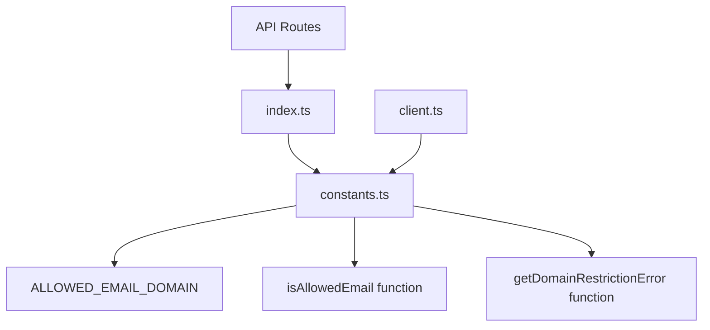
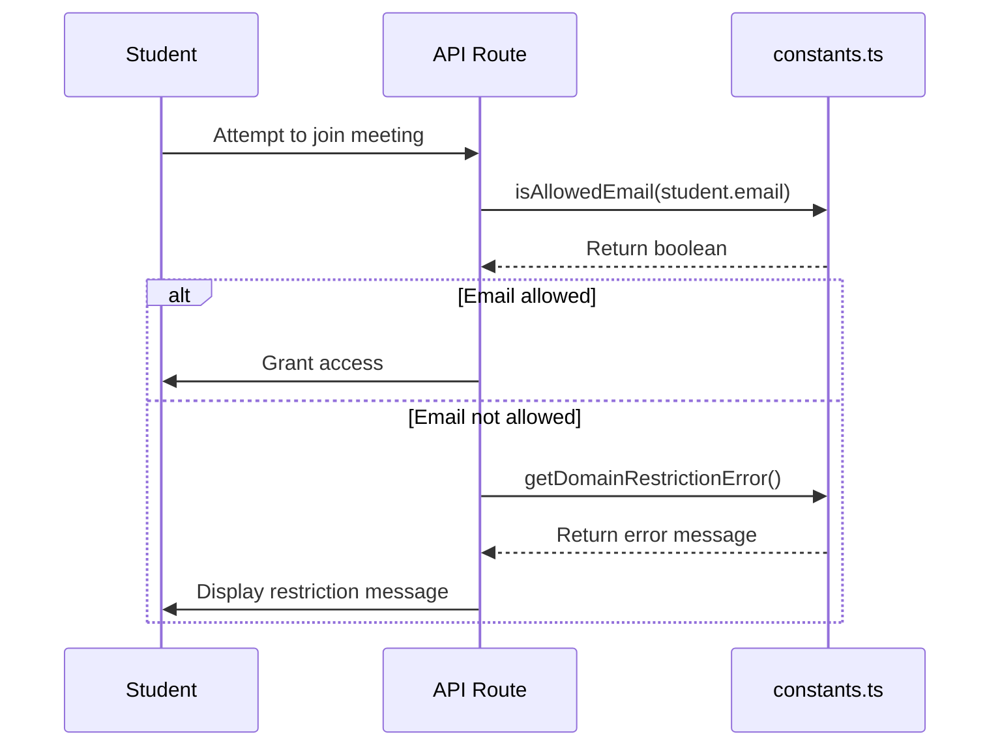
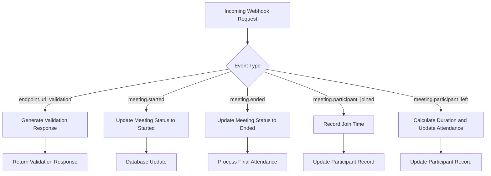
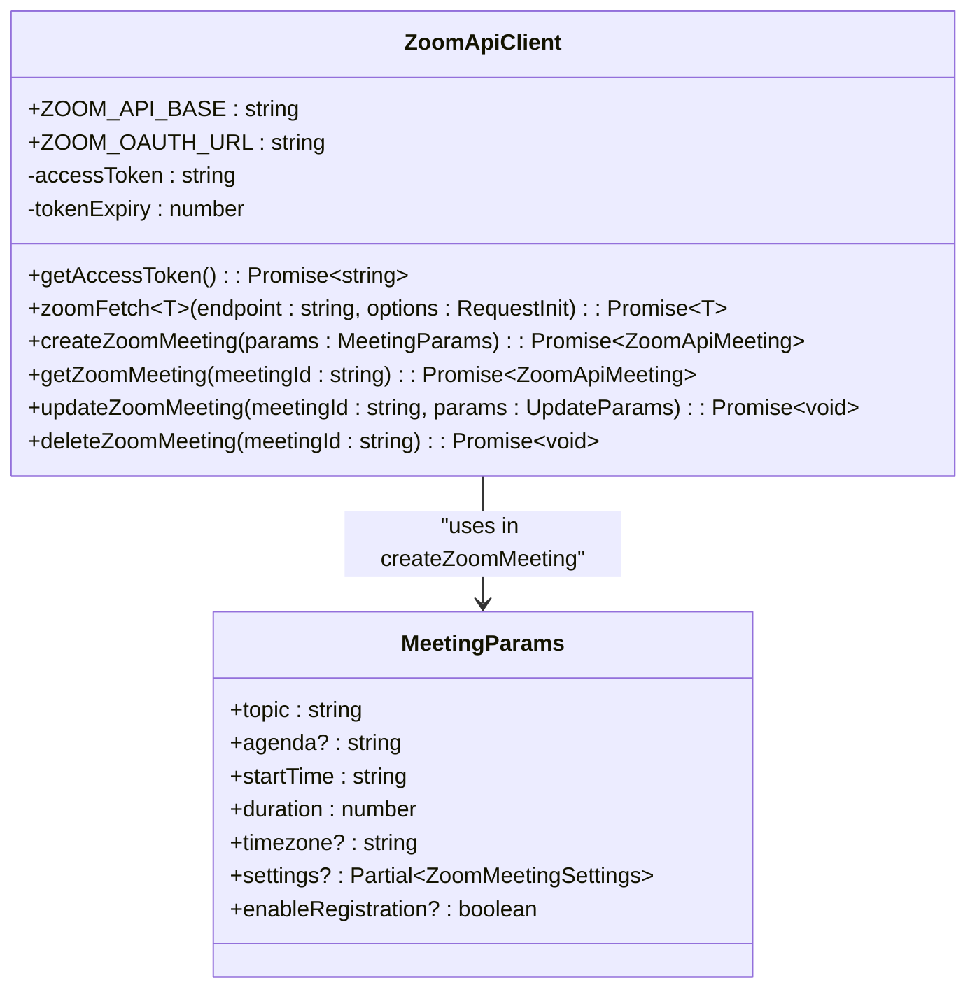
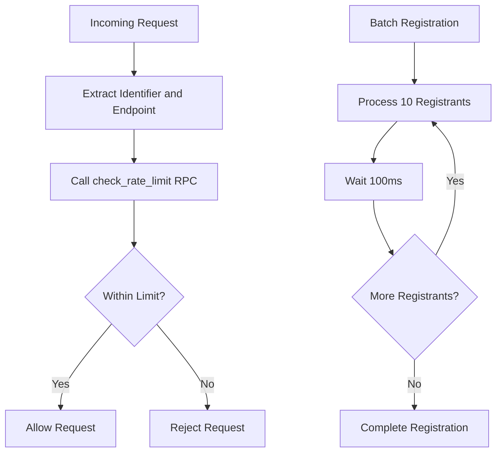
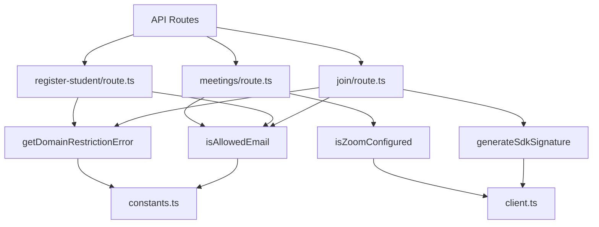
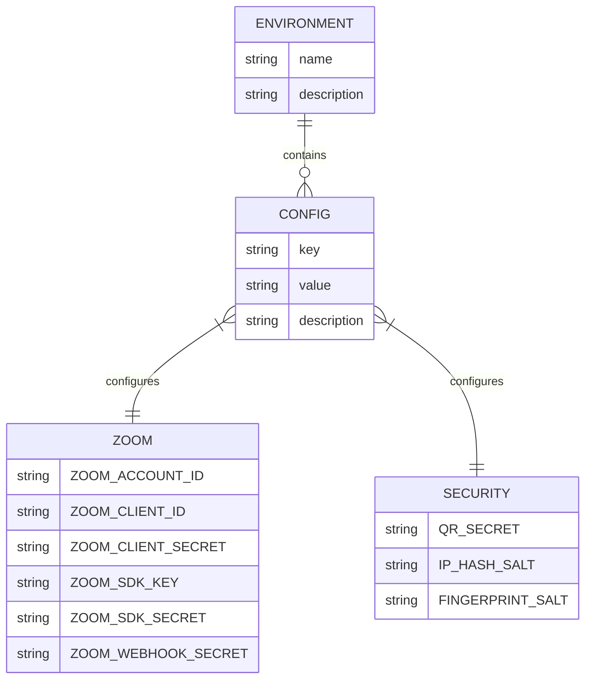
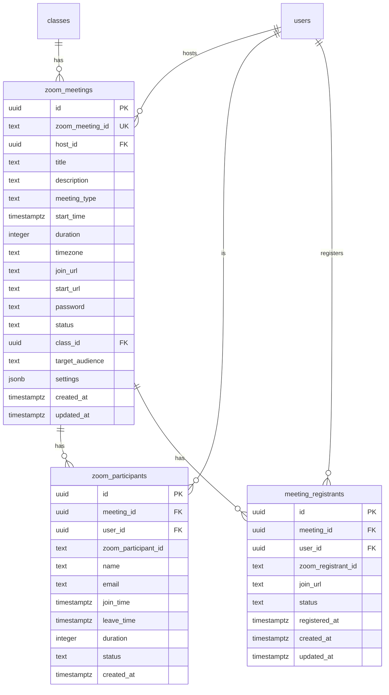

# Zoom Constants and Configuration

<cite>
**Referenced Files in This Document**   
- [constants.ts](file://lib/zoom/constants.ts)
- [client.ts](file://lib/zoom/client.ts)
- [types.ts](file://lib/zoom/types.ts)
- [index.ts](file://lib/zoom/index.ts)
- [route.ts](file://app/api/zoom/webhook/route.ts)
- [join/route.ts](file://app/api/zoom/meetings/[id]/join/route.ts)
- [register-student/route.ts](file://app/api/zoom/meetings/register-student/route.ts)
- [meetings/route.ts](file://app/api/zoom/meetings/route.ts)
- [rate-limit.ts](file://lib/rate-limit.ts)
- [.env.example](file://.env.example)
- [create_zoom_meetings_table.sql](file://supabase/migrations/20260110000001_create_zoom_meetings_table.sql)
- [create_meeting_registrants_table.sql](file://supabase/migrations/20260110000002_create_meeting_registrants_table.sql)
</cite>

## Table of Contents
1. [Introduction](#introduction)
2. [Core Constants and Configuration](#core-constants-and-configuration)
3. [Email Domain Restriction](#email-domain-restriction)
4. [Webhook Event Handling](#webhook-event-handling)
5. [API Client Configuration](#api-client-configuration)
6. [Rate Limiting and Retry Logic](#rate-limiting-and-retry-logic)
7. [Usage in API Routes](#usage-in-api-routes)
8. [Environment Configuration](#environment-configuration)
9. [Extensibility and Maintenance](#extensibility-and-maintenance)
10. [Database Schema Integration](#database-schema-integration)
11. [Best Practices for Updates](#best-practices-for-updates)

## Introduction

The Zoom integration in this school management system relies on a centralized configuration system using constants to manage API endpoints, domain restrictions, and webhook events. This documentation details how constants are defined and used throughout the codebase to ensure maintainability, prevent hardcoded strings, and support the system's Zoom meeting functionality. The constants provide a single source of truth for Zoom-related configuration, enabling consistent behavior across the application while allowing for easy updates when integrating new Zoom API features.

**Section sources**
- [constants.ts](file://lib/zoom/constants.ts)
- [client.ts](file://lib/zoom/client.ts)

## Core Constants and Configuration

The core Zoom constants are defined in the `constants.ts` file within the zoom module. These constants centralize configuration for the Zoom integration, preventing hardcoded strings and ensuring consistency across the application. The primary constant defined is `ALLOWED_EMAIL_DOMAIN`, which specifies the email domain that students must have to participate in class meetings. This domain restriction ensures that only authorized users from the Department of Education can join educational sessions.

The constants are exported and re-exported through the `index.ts` file, making them easily accessible throughout the application. This centralized approach allows for easy updates when the domain policy changes or when integrating with different Zoom environments. The constants are used in multiple parts of the system, including meeting creation, participant registration, and access control for meeting participation.

**Diagram sources**
- [constants.ts](file://lib/zoom/constants.ts)
- [index.ts](file://lib/zoom/index.ts)

**Section sources**
- [constants.ts](file://lib/zoom/constants.ts)
- [index.ts](file://lib/zoom/index.ts)

## Email Domain Restriction

The email domain restriction is a critical security feature that ensures only students with official Department of Education email addresses can participate in class meetings. The `ALLOWED_EMAIL_DOMAIN` constant is set to 'r1.deped.gov.ph', and this value is used by the `isAllowedEmail` function to validate user emails. This function performs a case-insensitive check to determine if an email address ends with the allowed domain.

When a student attempts to join a meeting, the system checks their email domain using this function. If the email does not match the allowed domain, the `getDomainRestrictionError` function returns a user-friendly error message explaining that only @r1.deped.gov.ph email addresses can join class meetings. This restriction is enforced in multiple locations, including when registering students for meetings and when students attempt to join meetings directly.

The domain restriction is particularly important for maintaining the integrity of the educational environment and ensuring that only authorized participants can access class sessions. This approach also simplifies administration, as it automatically validates student identities based on their institutional email addresses.

**Diagram sources**
- [constants.ts](file://lib/zoom/constants.ts)
- [join/route.ts](file://app/api/zoom/meetings/[id]/join/route.ts)
- [register-student/route.ts](file://app/api/zoom/meetings/register-student/route.ts)

**Section sources**
- [constants.ts](file://lib/zoom/constants.ts)
- [join/route.ts](file://app/api/zoom/meetings/[id]/join/route.ts)
- [register-student/route.ts](file://app/api/zoom/meetings/register-student/route.ts)

## Webhook Event Handling

The Zoom webhook handler in `app/api/zoom/webhook/route.ts` processes various Zoom events to keep the system synchronized with meeting states. The handler listens for key events including 'meeting.started', 'meeting.ended', 'meeting.participant_joined', and 'meeting.participant_left'. These events are matched against string constants in the code, ensuring consistent event handling across the application.

When a meeting starts, the system updates the meeting status in the database to 'started'. When a meeting ends, the status is updated to 'ended', and final attendance processing is triggered. Participant join and leave events are used to track attendance duration, with the system calculating whether students were present for a sufficient duration (defined by the `MIN_ATTENDANCE_DURATION` constant of 15 minutes) to be marked as present.

The webhook handler also includes special handling for the 'endpoint.url_validation' event, which is used by Zoom to validate the webhook URL during setup. This event is processed before signature verification to ensure successful configuration. The handler verifies the authenticity of all other events using the `ZOOM_WEBHOOK_SECRET` from environment variables, preventing unauthorized access.

**Diagram sources**
- [route.ts](file://app/api/zoom/webhook/route.ts)

**Section sources**
- [route.ts](file://app/api/zoom/webhook/route.ts)

## API Client Configuration

The Zoom API client in `client.ts` contains configuration for connecting to the Zoom API using Server-to-Server OAuth. The client defines the base API URL as 'https://api.zoom.us/v2' and the OAuth token endpoint. It manages authentication credentials from environment variables, including `ZOOM_ACCOUNT_ID`, `ZOOM_CLIENT_ID`, and `ZOOM_CLIENT_SECRET`.

The client implements token caching to improve performance, storing the access token and its expiry time in memory. Before making API requests, it checks if a valid cached token exists, reducing the number of authentication requests to Zoom. The `zoomFetch` function handles authenticated requests to the Zoom API, automatically including the Bearer token in the authorization header.

The client also includes helper functions for common operations such as creating, retrieving, updating, and deleting meetings. These functions abstract the Zoom API endpoints and request/response formats, providing a clean interface for the rest of the application. The client handles large integer precision issues by converting meeting IDs to strings, preventing data loss during JSON parsing.

**Diagram sources**
- [client.ts](file://lib/zoom/client.ts)

**Section sources**
- [client.ts](file://lib/zoom/client.ts)

## Rate Limiting and Retry Logic

The system implements rate limiting to prevent abuse and ensure fair usage of the Zoom API. The rate limiting configuration is defined in `lib/rate-limit.ts`, which uses a Supabase RPC function to track request counts. The rate limiter uses identifiers such as user ID or IP address, combined with the endpoint being accessed, to track request frequency.

The rate limiting system is configured with different thresholds for various endpoints, with more restrictive limits for security-critical operations like login. The system includes a fail-open mode that allows requests to proceed during database errors, ensuring availability while maintaining security. For critical endpoints, fail-closed mode is used to prevent brute force attacks during outages.

In the Zoom integration, rate limiting is particularly important when registering multiple participants for a meeting. The `addMeetingRegistrantsBatch` function in the Zoom client processes registrants in batches of 10 with a 100ms delay between batches, respecting Zoom's rate limits. This approach prevents overwhelming the Zoom API while ensuring that all participants are registered efficiently.

**Diagram sources**
- [rate-limit.ts](file://lib/rate-limit.ts)
- [client.ts](file://lib/zoom/client.ts)

**Section sources**
- [rate-limit.ts](file://lib/rate-limit.ts)
- [client.ts](file://lib/zoom/client.ts)

## Usage in API Routes

The Zoom constants and client functions are extensively used in various API routes throughout the application. The `app/api/zoom/meetings/[id]/join/route.ts` file uses the `isAllowedEmail` and `getDomainRestrictionError` functions to enforce domain restrictions when students attempt to join meetings. It also uses the `generateSdkSignature` function from the Zoom client to enable embedded meeting experiences.

The `app/api/zoom/meetings/register-student/route.ts` file uses the same domain restriction functions when registering students for upcoming class meetings. This ensures that only students with valid DepEd email addresses are registered, maintaining the integrity of the class meeting participant list.

The main meetings route (`app/api/zoom/meetings/route.ts`) uses the `isZoomConfigured` function to check if Zoom integration is properly configured before allowing meeting creation. It also uses the `isAllowedEmail` function when registering class students for meetings, filtering out students without valid institutional email addresses.

These API routes demonstrate how the centralized constants and functions are reused across different parts of the system, ensuring consistent behavior and reducing code duplication. The modular design allows for easy updates to the Zoom integration logic without requiring changes to multiple files.

**Diagram sources**
- [join/route.ts](file://app/api/zoom/meetings/[id]/join/route.ts)
- [register-student/route.ts](file://app/api/zoom/meetings/register-student/route.ts)
- [meetings/route.ts](file://app/api/zoom/meetings/route.ts)
- [constants.ts](file://lib/zoom/constants.ts)
- [client.ts](file://lib/zoom/client.ts)

**Section sources**
- [join/route.ts](file://app/api/zoom/meetings/[id]/join/route.ts)
- [register-student/route.ts](file://app/api/zoom/meetings/register-student/route.ts)
- [meetings/route.ts](file://app/api/zoom/meetings/route.ts)

## Environment Configuration

The Zoom integration relies on several environment variables for configuration, as defined in the `.env.example` file. These include `ZOOM_ACCOUNT_ID`, `ZOOM_CLIENT_ID`, and `ZOOM_CLIENT_SECRET` for Server-to-Server OAuth authentication, `ZOOM_SDK_KEY` and `ZOOM_SDK_SECRET` for embedded meeting experiences, and `ZOOM_WEBHOOK_SECRET` for securing webhook endpoints.

The environment configuration follows a secure pattern where sensitive credentials are not committed to version control. The `.env.example` file provides a template with placeholder values, and developers are instructed to create a `.env.local` file with their actual credentials. This approach ensures that sensitive information remains private while providing clear documentation of the required configuration.

The system checks for the presence of these environment variables at runtime, providing meaningful error messages if they are missing. This helps with troubleshooting configuration issues and ensures that the Zoom integration fails gracefully when not properly configured. The modular design allows for different environment configurations in development, staging, and production environments.

**Diagram sources**
- [.env.example](file://.env.example)

**Section sources**
- [.env.example](file://.env.example)

## Extensibility and Maintenance

The Zoom constants and configuration system is designed to be extensible and maintainable. New Zoom API endpoints can be added to the client by creating additional wrapper functions that follow the existing pattern. Similarly, new webhook events can be handled by extending the switch statement in the webhook route.

When integrating new Zoom API features, developers should first update the types in `types.ts` to reflect the new API response formats. Then, they can add new functions to `client.ts` that use the existing `zoomFetch` utility to make authenticated requests. Constants for new features should be added to `constants.ts` if they represent configuration values that might change or need to be referenced in multiple places.

The modular design of the Zoom integration, with separate files for constants, client functions, and types, makes it easy to understand and modify the codebase. The re-exporting pattern in `index.ts` provides a clean import interface for other parts of the application, reducing the need to know the internal file structure.

To maintain consistency, any new constants should follow the naming convention used in the existing codebase, with descriptive names in uppercase with underscores. Functions that use constants should be designed to be easily testable, with dependencies that can be mocked during testing.

**Section sources**
- [constants.ts](file://lib/zoom/constants.ts)
- [client.ts](file://lib/zoom/client.ts)
- [types.ts](file://lib/zoom/types.ts)
- [index.ts](file://lib/zoom/index.ts)

## Database Schema Integration

The Zoom integration is closely tied to the database schema, with several tables designed to store Zoom-related data. The `zoom_meetings` table stores information about Zoom meetings, including the Zoom meeting ID, host, title, start time, and status. The `zoom_participants` table tracks meeting attendance, recording when participants join and leave, and calculating their duration.

The `meeting_registrants` table stores information about users who have registered for meetings, including their unique join URL. This table enables the system to bypass Zoom's waiting room for registered participants, providing a seamless experience for authorized users.

The database schema includes appropriate indexes for performance, with indexes on foreign keys and frequently queried columns. Row Level Security (RLS) policies ensure that users can only access meetings and participants they are authorized to view, based on their role and relationship to the meeting.

The integration between the Zoom API and the database is handled through the API routes, which update the database in response to Zoom events and user actions. This ensures that the application's state remains synchronized with the actual Zoom meeting state.

**Diagram sources**
- [create_zoom_meetings_table.sql](file://supabase/migrations/20260110000001_create_zoom_meetings_table.sql)
- [create_meeting_registrants_table.sql](file://supabase/migrations/20260110000002_create_meeting_registrants_table.sql)

**Section sources**
- [create_zoom_meetings_table.sql](file://supabase/migrations/20260110000001_create_zoom_meetings_table.sql)
- [create_meeting_registrants_table.sql](file://supabase/migrations/20260110000002_create_meeting_registrants_table.sql)

## Best Practices for Updates

When updating the Zoom integration to support new features or changes in the Zoom API, several best practices should be followed. First, any new API endpoints should be wrapped in the client with functions that follow the existing pattern, using the `zoomFetch` utility for authenticated requests. This ensures consistency and reduces the risk of errors.

Second, new constants should be added to the `constants.ts` file if they represent configuration values that might change or need to be referenced in multiple places. This centralizes configuration and makes it easier to update values across the application.

Third, type definitions in `types.ts` should be updated to reflect any changes in the Zoom API response formats. This provides type safety and helps catch errors during development.

Fourth, when adding support for new webhook events, the webhook handler should be extended with additional case statements in the switch block. The event types should be documented in the code comments to maintain clarity.

Finally, any changes should be tested thoroughly, including edge cases and error conditions. The modular design of the Zoom integration makes it possible to test individual components in isolation, improving test coverage and reliability.

**Section sources**
- [constants.ts](file://lib/zoom/constants.ts)
- [client.ts](file://lib/zoom/client.ts)
- [types.ts](file://lib/zoom/types.ts)
- [route.ts](file://app/api/zoom/webhook/route.ts)