# Zoom Integration Service

<cite>
**Referenced Files in This Document**   
- [client.ts](file://lib/zoom/client.ts)
- [index.ts](file://lib/zoom/index.ts)
- [types.ts](file://lib/zoom/types.ts)
- [constants.ts](file://lib/zoom/constants.ts)
- [route.ts](file://app/api/zoom/meetings/route.ts)
- [route.ts](file://app/api/zoom/meetings/[id]/route.ts)
- [route.ts](file://app/api/zoom/webhook/route.ts)
- [route.ts](file://app/api/zoom/reports/route.ts)
- [create_zoom_meetings_table.sql](file://supabase/migrations/20260110000001_create_zoom_meetings_table.sql)
- [create_meeting_registrants_table.sql](file://supabase/migrations/20260110000002_create_meeting_registrants_table.sql)
</cite>

## Table of Contents
1. [Introduction](#introduction)
2. [Core Components](#core-components)
3. [Architecture Overview](#architecture-overview)
4. [Detailed Component Analysis](#detailed-component-analysis)
5. [Usage Examples](#usage-examples)
6. [Real-time Event Handling](#real-time-event-handling)
7. [Error Handling](#error-handling)
8. [Security Considerations](#security-considerations)
9. [Performance Aspects](#performance-aspects)
10. [Database Schema](#database-schema)

## Introduction
The Zoom Integration Service provides a comprehensive interface between the school management system and Zoom's REST APIs. This service enables teachers and administrators to create, manage, and track virtual meetings while ensuring secure access and proper authentication. The integration handles OAuth2 authentication, JWT token management, request signing, and real-time event processing through webhooks. It also manages meeting registration, participant tracking, and attendance recording with appropriate security measures for protecting personally identifiable information (PII).

## Core Components
The Zoom integration consists of several core components that work together to provide a seamless experience for managing virtual meetings within the school system. These components include the client implementation for interacting with Zoom APIs, type definitions for request/response structures, constants for configuration values, and utility functions for common operations.

**Section sources**
- [client.ts](file://lib/zoom/client.ts)
- [types.ts](file://lib/zoom/types.ts)
- [constants.ts](file://lib/zoom/constants.ts)
- [index.ts](file://lib/zoom/index.ts)

## Architecture Overview
The Zoom integration follows a modular architecture with clear separation of concerns. The service is organized into four main modules: client, types, constants, and index. The client module handles all interactions with the Zoom API, including authentication and request execution. The types module defines interfaces for all Zoom API request and response structures. The constants module stores configuration values and domain restrictions. The index module serves as the entry point, re-exporting all functionality from the other modules.

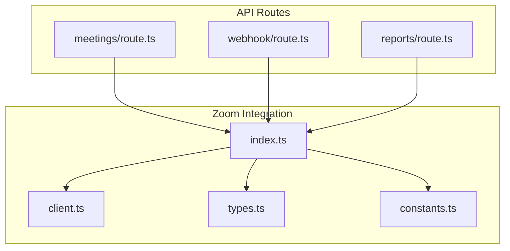

**Diagram sources**
- [index.ts](file://lib/zoom/index.ts#L1-L10)
- [client.ts](file://lib/zoom/client.ts#L1-L334)
- [types.ts](file://lib/zoom/types.ts#L1-L168)
- [constants.ts](file://lib/zoom/constants.ts#L1-L22)

## Detailed Component Analysis

### Client Implementation
The client.ts module implements the core functionality for interacting with Zoom's REST APIs using Server-to-Server OAuth authentication. It manages token caching and automatic refresh, ensuring efficient API usage while maintaining security.

#### Authentication and Token Management
The client uses Zoom's Server-to-Server OAuth flow to obtain access tokens. It caches the token and its expiration time to avoid unnecessary requests. When a token is about to expire (within 5 minutes), it automatically requests a new one.

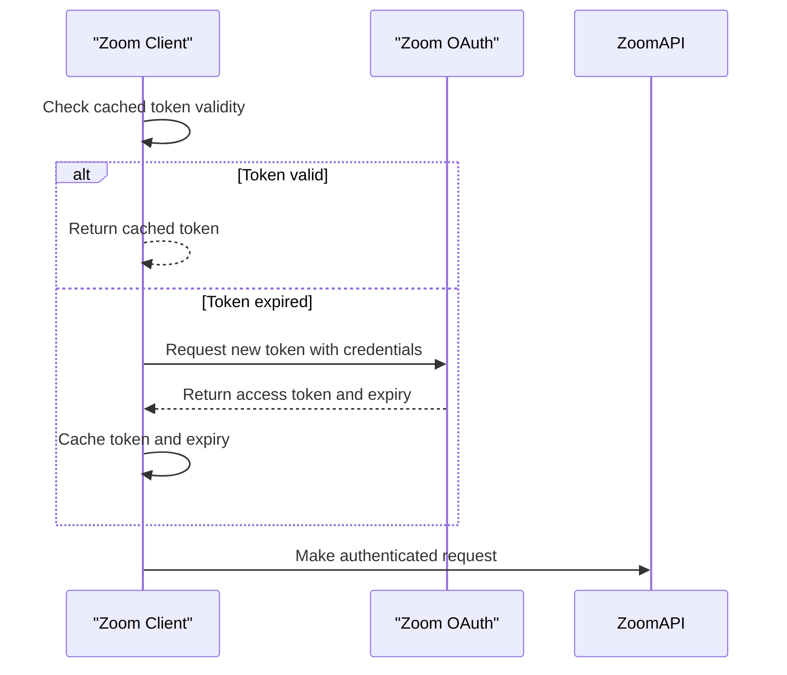

**Diagram sources**
- [client.ts](file://lib/zoom/client.ts#L17-L54)

#### Request Execution
The zoomFetch function handles all authenticated requests to the Zoom API. It automatically adds the Bearer token to requests and processes responses, handling errors and special cases like 204 No Content responses.

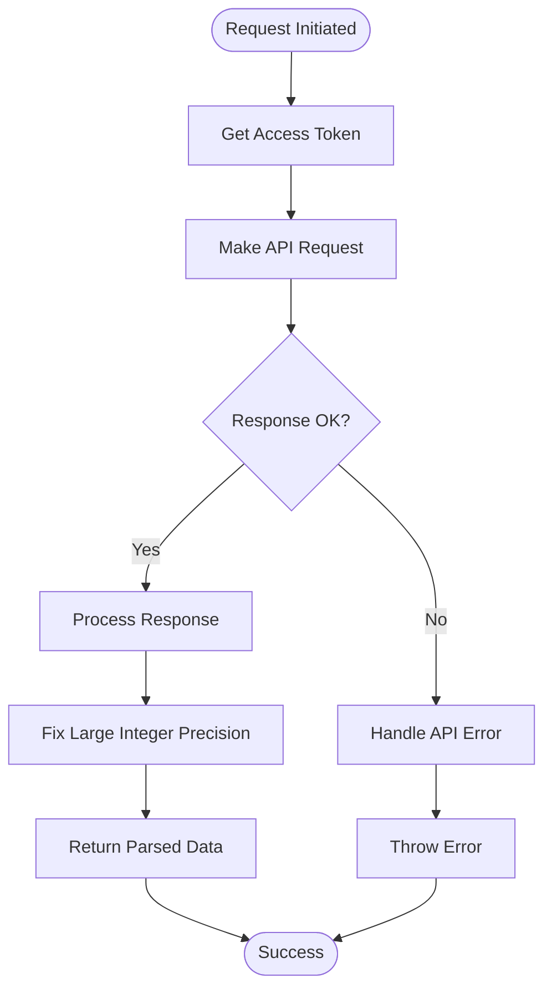

**Diagram sources**
- [client.ts](file://lib/zoom/client.ts#L56-L86)

### Type Definitions
The types.ts module defines TypeScript interfaces for all Zoom API request and response structures. These types ensure type safety throughout the application and provide clear documentation of the data structures used.

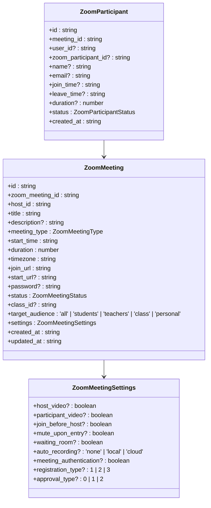

**Diagram sources**
- [types.ts](file://lib/zoom/types.ts#L9-L60)

### Constants and Configuration
The constants.ts module defines configuration values used throughout the Zoom integration, including domain restrictions for meeting participants.

```mermaid
erDiagram
CONFIG ||--o{ CONSTANTS : contains
CONFIG {
string name
}
CONSTANTS {
string key
string value
}
CONSTANTS {
"ALLOWED_EMAIL_DOMAIN" "r1.deped.gov.ph"
}
```

**Diagram sources**
- [constants.ts](file://lib/zoom/constants.ts#L5-L22)

**Section sources**
- [client.ts](file://lib/zoom/client.ts#L1-L334)
- [types.ts](file://lib/zoom/types.ts#L1-L168)
- [constants.ts](file://lib/zoom/constants.ts#L1-L22)

## Usage Examples
The Zoom integration is used throughout the application's API routes to handle various meeting-related operations.

### Meeting Creation
The meetings/route.ts file demonstrates how to create a Zoom meeting through the API. Teachers and administrators can create meetings that are automatically registered in the database and linked to classes.

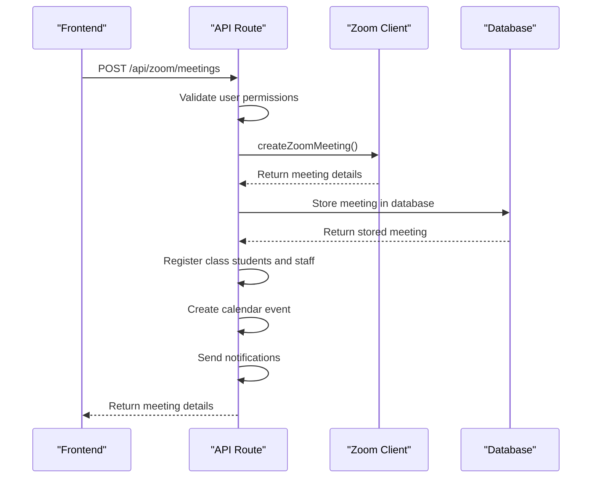

**Diagram sources**
- [route.ts](file://app/api/zoom/meetings/route.ts#L54-L168)

### Meeting Management
The meetings/[id]/route.ts file handles updating and deleting existing meetings. It includes proper permission checks to ensure only meeting hosts or administrators can modify meetings.

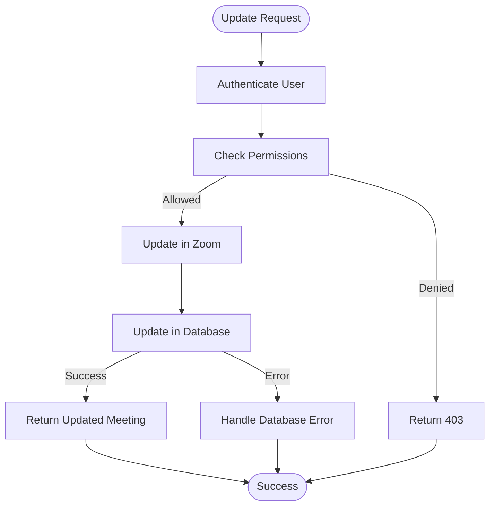

**Diagram sources**
- [route.ts](file://app/api/zoom/meetings/[id]/route.ts#L40-L125)

**Section sources**
- [route.ts](file://app/api/zoom/meetings/route.ts#L1-L345)
- [route.ts](file://app/api/zoom/meetings/[id]/route.ts#L1-L187)

## Real-time Event Handling
The webhook/route.ts file implements real-time event handling for Zoom meetings. It processes events such as meeting start, end, participant join, and participant leave, updating the database accordingly.

### Webhook Verification
The service verifies the authenticity of webhook requests using Zoom's signature validation mechanism.

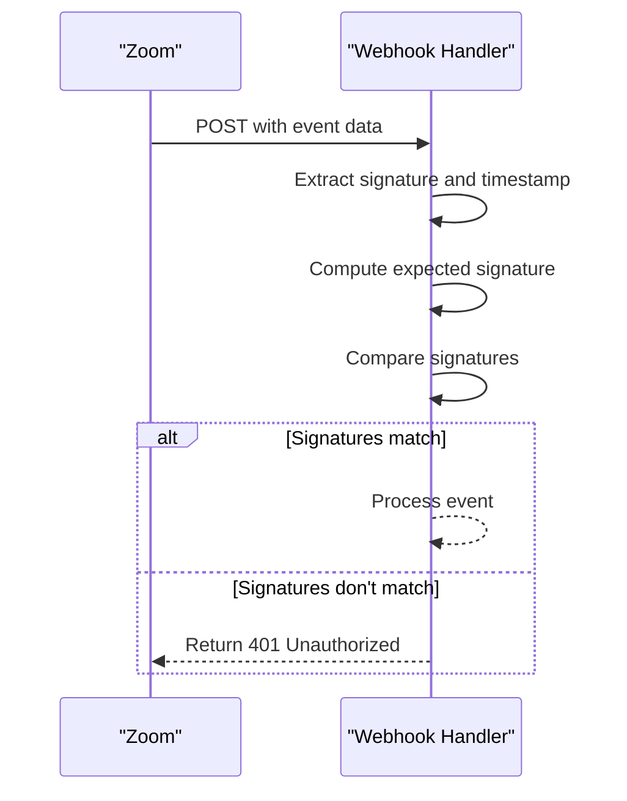

**Diagram sources**
- [route.ts](file://app/api/zoom/webhook/route.ts#L47-L62)

### Attendance Tracking
When meetings end, the system processes final attendance, marking students as present, partially present, or absent based on their participation duration.

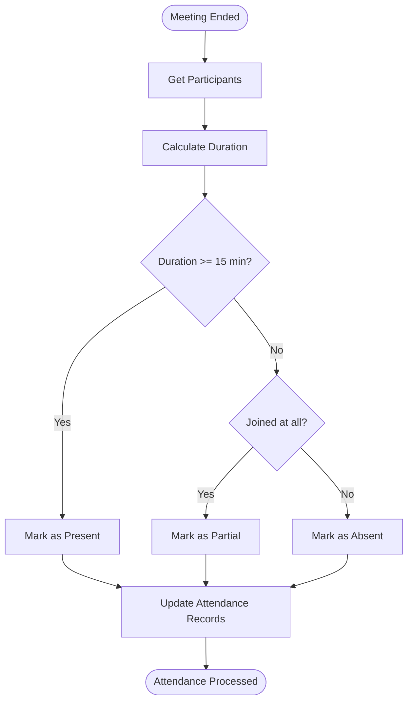

**Diagram sources**
- [route.ts](file://app/api/zoom/webhook/route.ts#L285-L341)

**Section sources**
- [route.ts](file://app/api/zoom/webhook/route.ts#L1-L342)

## Error Handling
The Zoom integration includes comprehensive error handling for various scenarios including API rate limits, expired tokens, and network failures.

### API Error Handling
The client module handles Zoom API errors by parsing the response and throwing descriptive error messages.

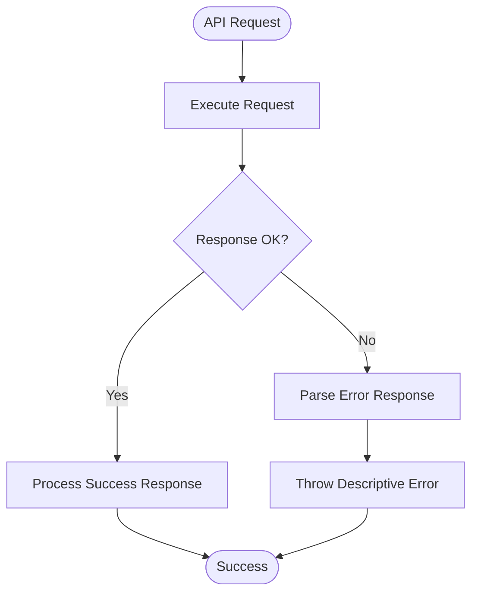

**Diagram sources**
- [client.ts](file://lib/zoom/client.ts#L71-L75)

### Token Expiration Handling
The token management system automatically handles token expiration by requesting new tokens when needed.

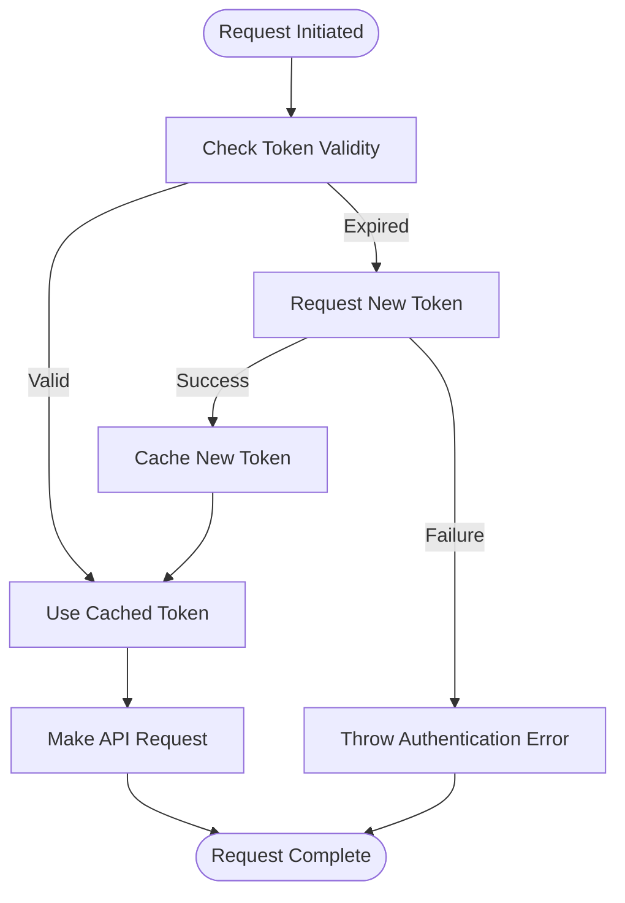

**Diagram sources**
- [client.ts](file://lib/zoom/client.ts#L20-L54)

**Section sources**
- [client.ts](file://lib/zoom/client.ts#L56-L86)

## Security Considerations
The Zoom integration implements several security measures to protect sensitive data and ensure authorized access.

### Webhook Signature Validation
All webhook requests are validated using Zoom's signature verification to prevent unauthorized access.

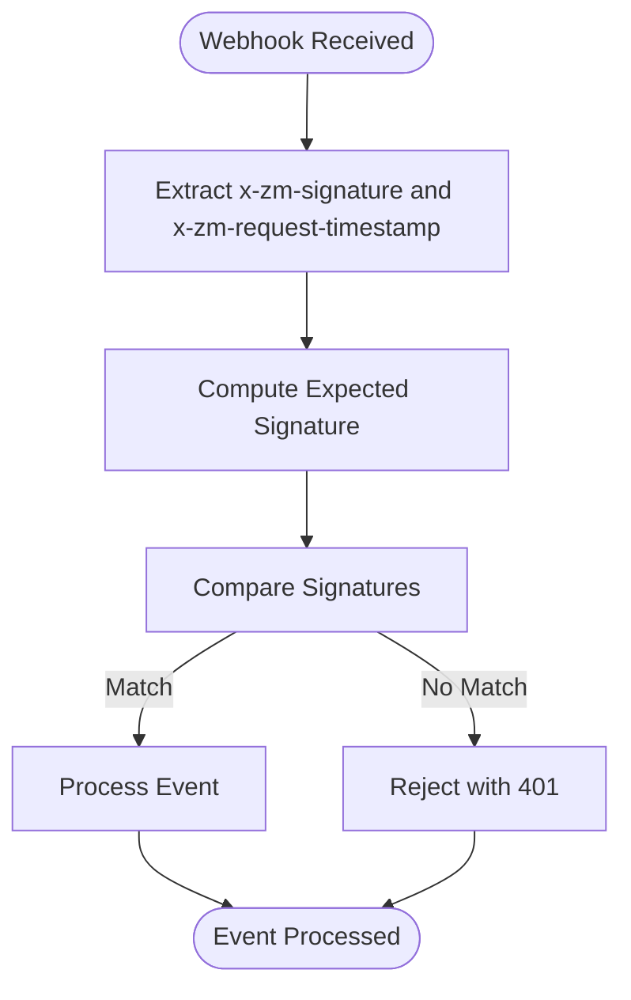

**Diagram sources**
- [route.ts](file://app/api/zoom/webhook/route.ts#L47-L62)

### PII Handling
The system handles personally identifiable information (PII) securely, including hashing IP addresses in the database.

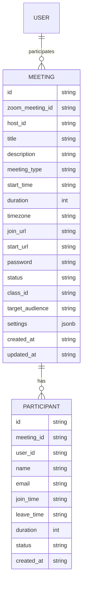

**Diagram sources**
- [create_zoom_meetings_table.sql](file://supabase/migrations/20260110000001_create_zoom_meetings_table.sql#L2-L21)
- [create_meeting_registrants_table.sql](file://supabase/migrations/20260110000002_create_meeting_registrants_table.sql#L2-L13)

**Section sources**
- [route.ts](file://app/api/zoom/webhook/route.ts#L47-L62)

## Performance Aspects
The Zoom integration includes several performance optimizations to ensure efficient operation.

### Request Batching
When registering multiple participants for a meeting, the system processes them in batches to respect rate limits.

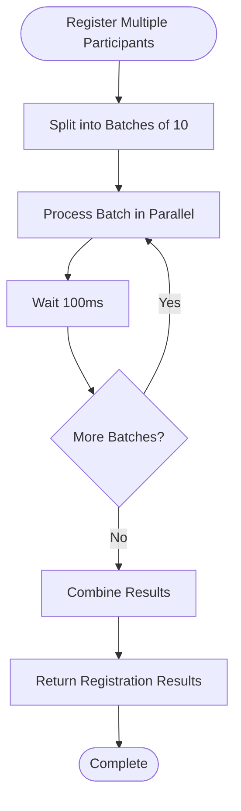

**Diagram sources**
- [client.ts](file://lib/zoom/client.ts#L280-L308)

### Caching
The client implements token caching to minimize authentication requests to the Zoom API.

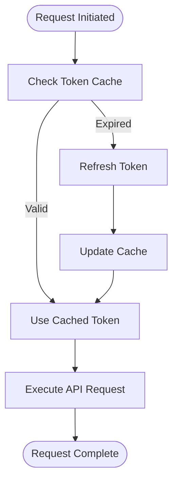

**Diagram sources**
- [client.ts](file://lib/zoom/client.ts#L21-L24)

**Section sources**
- [client.ts](file://lib/zoom/client.ts#L280-L308)

## Database Schema
The Zoom integration uses several database tables to store meeting and participant information.

### Zoom Meetings Table
The zoom_meetings table stores information about created Zoom meetings, including metadata, settings, and status.

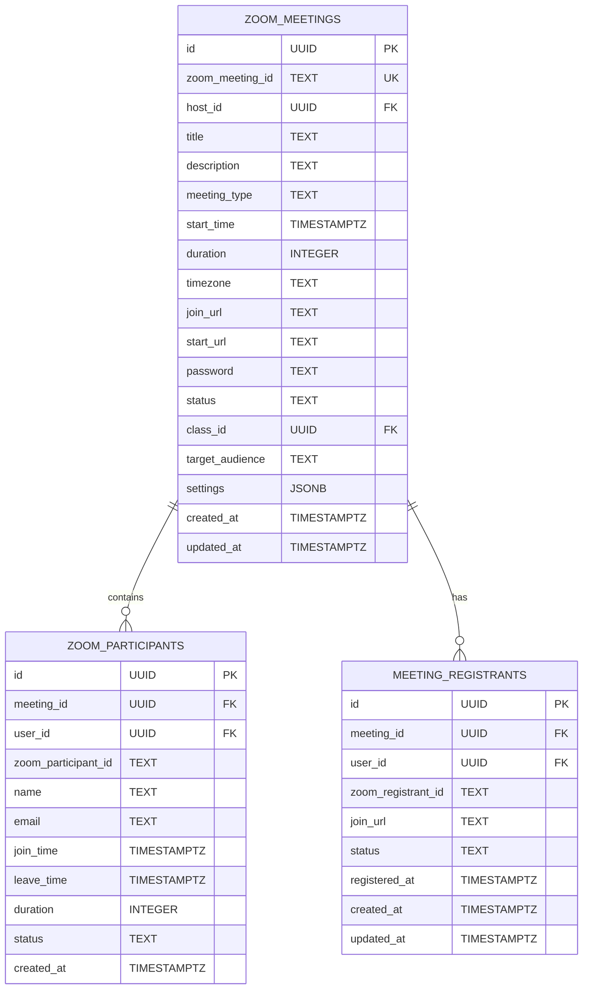

**Diagram sources**
- [create_zoom_meetings_table.sql](file://supabase/migrations/20260110000001_create_zoom_meetings_table.sql#L2-L21)
- [create_meeting_registrants_table.sql](file://supabase/migrations/20260110000002_create_meeting_registrants_table.sql#L2-L13)

**Section sources**
- [create_zoom_meetings_table.sql](file://supabase/migrations/20260110000001_create_zoom_meetings_table.sql#L1-L113)
- [create_meeting_registrants_table.sql](file://supabase/migrations/20260110000002_create_meeting_registrants_table.sql#L1-L53)