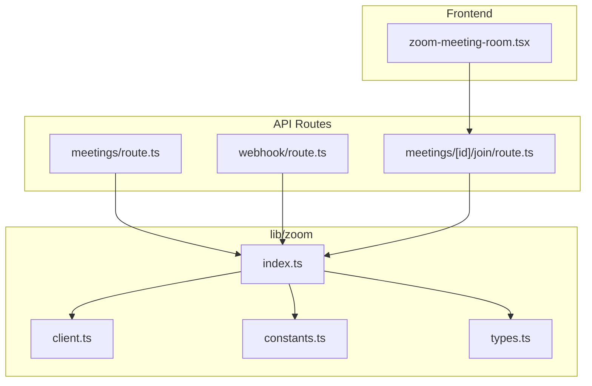
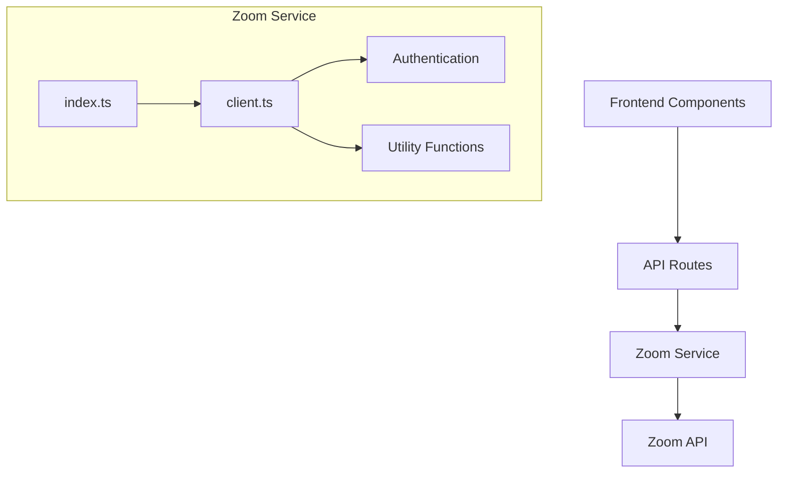
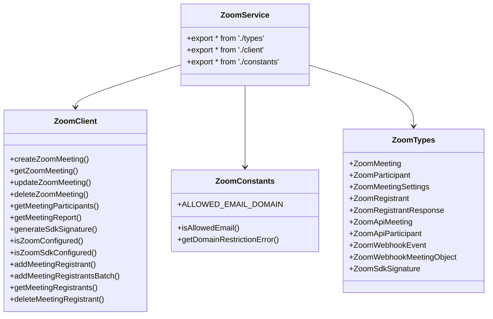
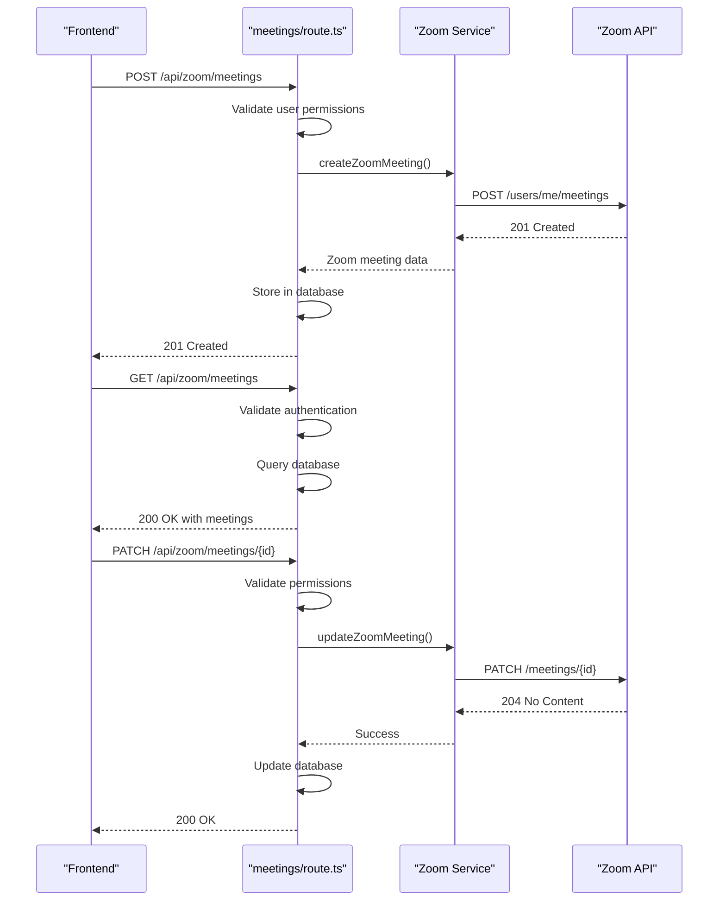
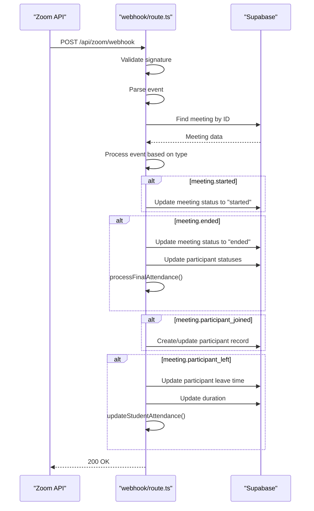
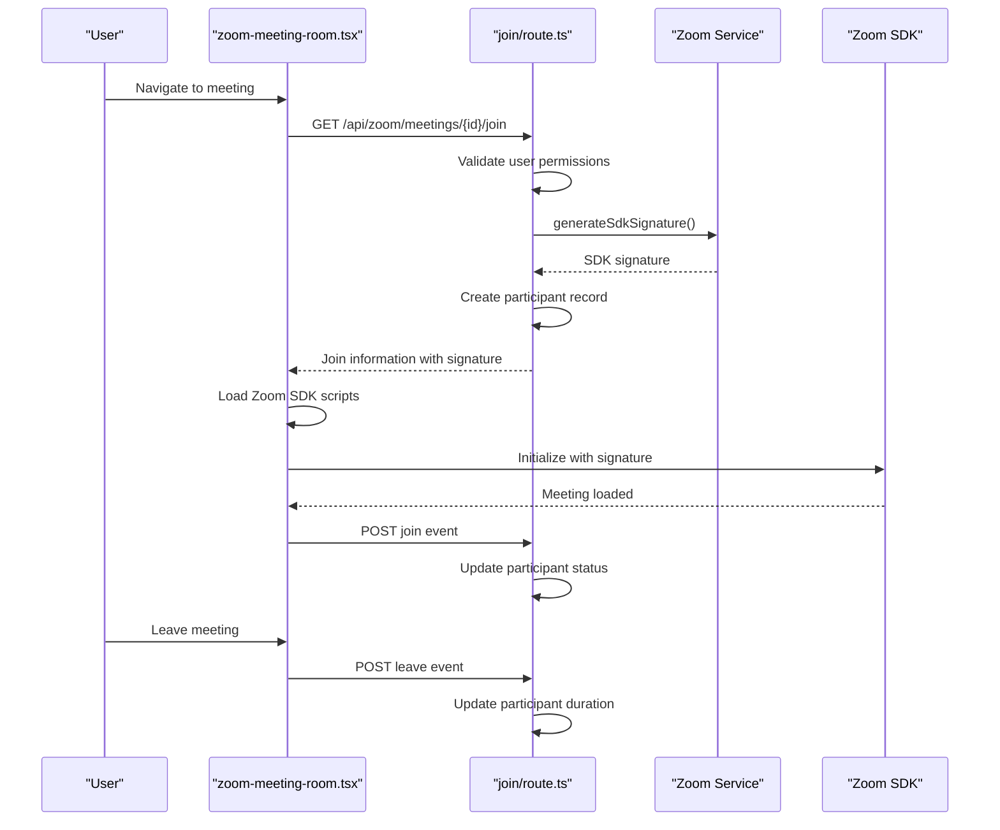
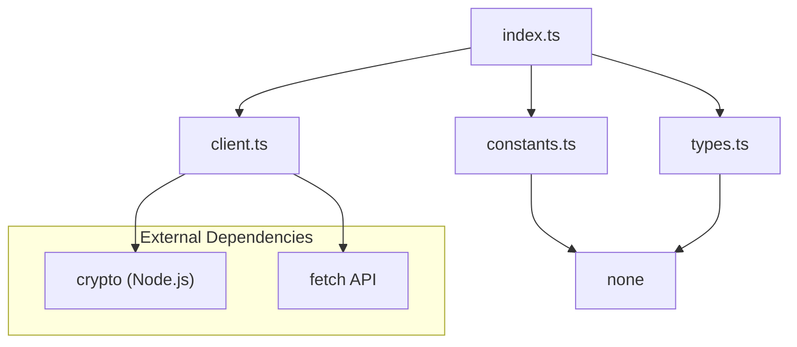

# Zoom Service Entry Point

<cite>
**Referenced Files in This Document**   
- [index.ts](file://lib/zoom/index.ts)
- [client.ts](file://lib/zoom/client.ts)
- [constants.ts](file://lib/zoom/constants.ts)
- [types.ts](file://lib/zoom/types.ts)
- [route.ts](file://app/api/zoom/meetings/route.ts)
- [route.ts](file://app/api/zoom/webhook/route.ts)
- [join/route.ts](file://app/api/zoom/meetings/[id]/join/route.ts)
- [zoom-meeting-room.tsx](file://components/zoom-meeting-room.tsx)
- [.env.example](file://.env.example)
</cite>

## Table of Contents
1. [Introduction](#introduction)
2. [Project Structure](#project-structure)
3. [Core Components](#core-components)
4. [Architecture Overview](#architecture-overview)
5. [Detailed Component Analysis](#detailed-component-analysis)
6. [Dependency Analysis](#dependency-analysis)
7. [Performance Considerations](#performance-considerations)
8. [Troubleshooting Guide](#troubleshooting-guide)
9. [Conclusion](#conclusion)

## Introduction
The Zoom integration service in the School Management System provides a centralized entry point for managing Zoom meetings, participants, and webhooks. The `index.ts` file in the `lib/zoom` directory serves as the primary entry point, re-exporting all Zoom-related functionality for easy access across the application. This documentation explains how the service is structured, initialized, and used throughout the system.

## Project Structure
The Zoom integration is organized in the `lib/zoom` directory with a clean separation of concerns:
- `index.ts`: Entry point that re-exports all Zoom functionality
- `client.ts`: Core API client with authentication and request handling
- `constants.ts`: Configuration constants and domain restrictions
- `types.ts`: Type definitions for Zoom API interactions

The API routes in `app/api/zoom` handle HTTP requests and use the Zoom service to interact with the Zoom API, while frontend components use the service to display and manage meetings.

**Diagram sources**
- [index.ts](file://lib/zoom/index.ts)
- [client.ts](file://lib/zoom/client.ts)
- [constants.ts](file://lib/zoom/constants.ts)
- [types.ts](file://lib/zoom/types.ts)
- [route.ts](file://app/api/zoom/meetings/route.ts)
- [route.ts](file://app/api/zoom/webhook/route.ts)
- [join/route.ts](file://app/api/zoom/meetings/[id]/join/route.ts)
- [zoom-meeting-room.tsx](file://components/zoom-meeting-room.tsx)

**Section sources**
- [index.ts](file://lib/zoom/index.ts)
- [client.ts](file://lib/zoom/client.ts)
- [constants.ts](file://lib/zoom/constants.ts)
- [types.ts](file://lib/zoom/types.ts)

## Core Components
The Zoom service entry point (`index.ts`) exports all functionality from the Zoom module, providing a clean interface for the rest of the application. It re-exports types, client functions, and constants, enabling tree-shakable imports where consumers can import only the specific functions they need.

The service handles Zoom API authentication using Server-to-Server OAuth, manages token caching, and provides utility functions for common operations like meeting creation, participant management, and SDK signature generation. It also includes domain restriction logic to ensure only authorized users can join meetings.

**Section sources**
- [index.ts](file://lib/zoom/index.ts)
- [client.ts](file://lib/zoom/client.ts)
- [constants.ts](file://lib/zoom/constants.ts)
- [types.ts](file://lib/zoom/types.ts)

## Architecture Overview
The Zoom integration follows a layered architecture with clear separation between the API client, business logic, and presentation layers. The entry point (`index.ts`) provides a unified interface to the Zoom service, which is consumed by API routes that handle HTTP requests and validate user permissions.

**Diagram sources**
- [index.ts](file://lib/zoom/index.ts)
- [client.ts](file://lib/zoom/client.ts)
- [route.ts](file://app/api/zoom/meetings/route.ts)
- [route.ts](file://app/api/zoom/webhook/route.ts)
- [zoom-meeting-room.tsx](file://components/zoom-meeting-room.tsx)

## Detailed Component Analysis

### Zoom Service Entry Point Analysis
The `index.ts` file serves as the primary entry point for the Zoom integration service, providing a clean and organized interface to all Zoom-related functionality. It uses re-exports to make all Zoom types, functions, and constants available through a single import.

**Diagram sources**
- [index.ts](file://lib/zoom/index.ts)
- [client.ts](file://lib/zoom/client.ts)
- [constants.ts](file://lib/zoom/constants.ts)
- [types.ts](file://lib/zoom/types.ts)

**Section sources**
- [index.ts](file://lib/zoom/index.ts)
- [client.ts](file://lib/zoom/client.ts)
- [constants.ts](file://lib/zoom/constants.ts)
- [types.ts](file://lib/zoom/types.ts)

### API Integration Analysis
The Zoom service is consumed by API routes that handle specific use cases like meeting management and webhook processing. These routes validate user permissions, handle business logic, and use the Zoom service to interact with the Zoom API.

**Diagram sources**
- [route.ts](file://app/api/zoom/meetings/route.ts)
- [client.ts](file://lib/zoom/client.ts)
- [index.ts](file://lib/zoom/index.ts)

**Section sources**
- [route.ts](file://app/api/zoom/meetings/route.ts)
- [client.ts](file://lib/zoom/client.ts)

### Webhook Processing Analysis
The webhook route handles events from Zoom, processing meeting lifecycle events and updating the application state accordingly. It validates the webhook signature and processes events like meeting start, end, participant join, and participant leave.

**Diagram sources**
- [route.ts](file://app/api/zoom/webhook/route.ts)
- [client.ts](file://lib/zoom/client.ts)

**Section sources**
- [route.ts](file://app/api/zoom/webhook/route.ts)
- [client.ts](file://lib/zoom/client.ts)

### Frontend Integration Analysis
Frontend components use the Zoom service indirectly through API routes to display and manage meetings. The `zoom-meeting-room.tsx` component loads the Zoom SDK and joins meetings using signatures generated by the backend.

**Diagram sources**
- [zoom-meeting-room.tsx](file://components/zoom-meeting-room.tsx)
- [join/route.ts](file://app/api/zoom/meetings/[id]/join/route.ts)
- [client.ts](file://lib/zoom/client.ts)

**Section sources**
- [zoom-meeting-room.tsx](file://components/zoom-meeting-room.tsx)
- [join/route.ts](file://app/api/zoom/meetings/[id]/join/route.ts)
- [client.ts](file://lib/zoom/client.ts)

## Dependency Analysis
The Zoom service has a clean dependency structure with minimal external dependencies. It relies on Node.js built-in modules for cryptographic operations and uses the standard fetch API for HTTP requests.

**Diagram sources**
- [index.ts](file://lib/zoom/index.ts)
- [client.ts](file://lib/zoom/client.ts)
- [constants.ts](file://lib/zoom/constants.ts)
- [types.ts](file://lib/zoom/types.ts)

**Section sources**
- [index.ts](file://lib/zoom/index.ts)
- [client.ts](file://lib/zoom/client.ts)

## Performance Considerations
The Zoom service includes several performance optimizations:
- Token caching to avoid repeated authentication requests
- Batch processing for registrant operations to minimize API calls
- Error handling that allows partial success in batch operations
- Efficient data parsing to handle large meeting IDs without precision loss

The service also implements rate limiting considerations by processing registrants in batches with small delays between them to respect Zoom's rate limits.

**Section sources**
- [client.ts](file://lib/zoom/client.ts)

## Troubleshooting Guide
Common issues with the Zoom integration include:
- Missing environment variables: Ensure all required Zoom credentials are set in `.env.local`
- Domain restrictions: Students must have valid @r1.deped.gov.ph email addresses to join class meetings
- Webhook signature validation: Ensure the ZOOM_WEBHOOK_SECRET matches the value configured in the Zoom app
- SDK loading issues: The Zoom SDK scripts must be loaded in the correct order

The service includes comprehensive error handling and logging to help diagnose issues. API routes return descriptive error messages, and the service logs errors to the console for debugging.

**Section sources**
- [client.ts](file://lib/zoom/client.ts)
- [route.ts](file://app/api/zoom/webhook/route.ts)
- [.env.example](file://.env.example)

## Conclusion
The Zoom service entry point provides a well-structured and maintainable interface to the Zoom API, with clear separation of concerns and tree-shakable exports. The service handles authentication, request management, and utility functions while providing type safety through comprehensive TypeScript definitions. It integrates seamlessly with the rest of the application through API routes and supports both server-side operations and client-side meeting joining through the Zoom SDK.