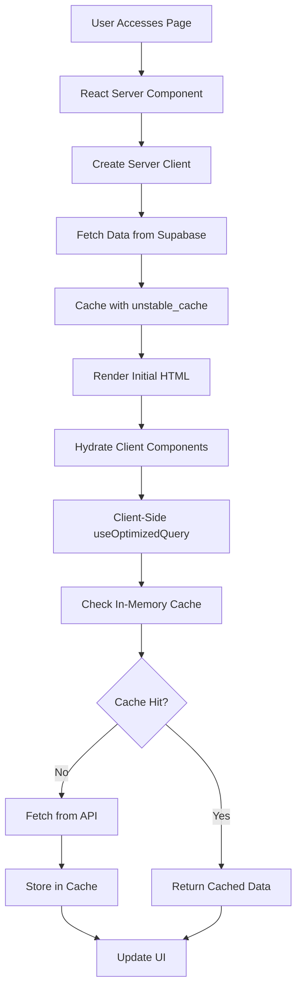
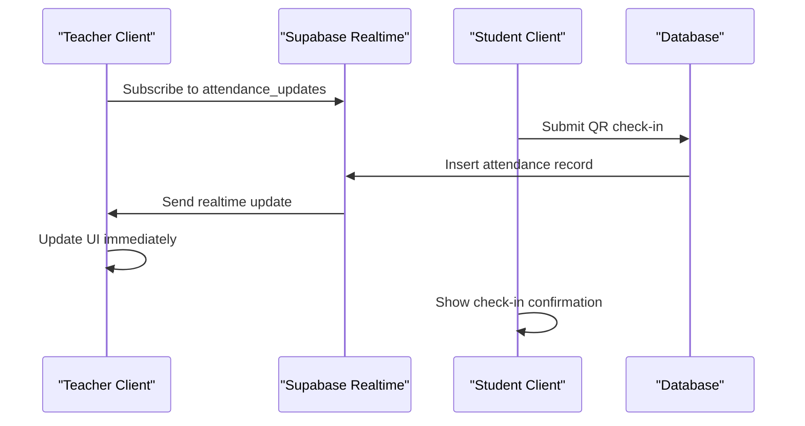
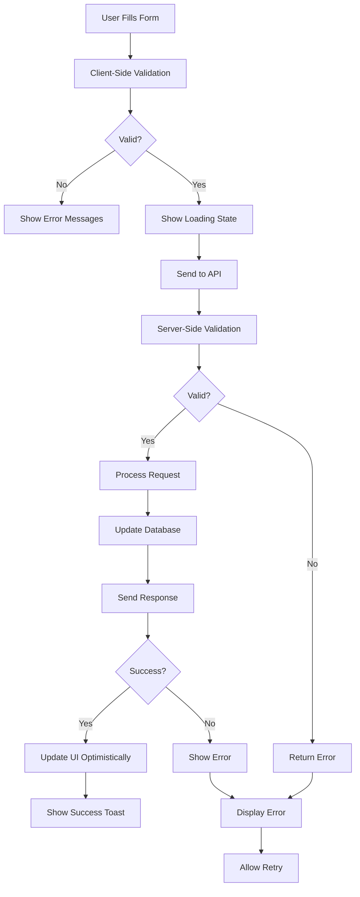
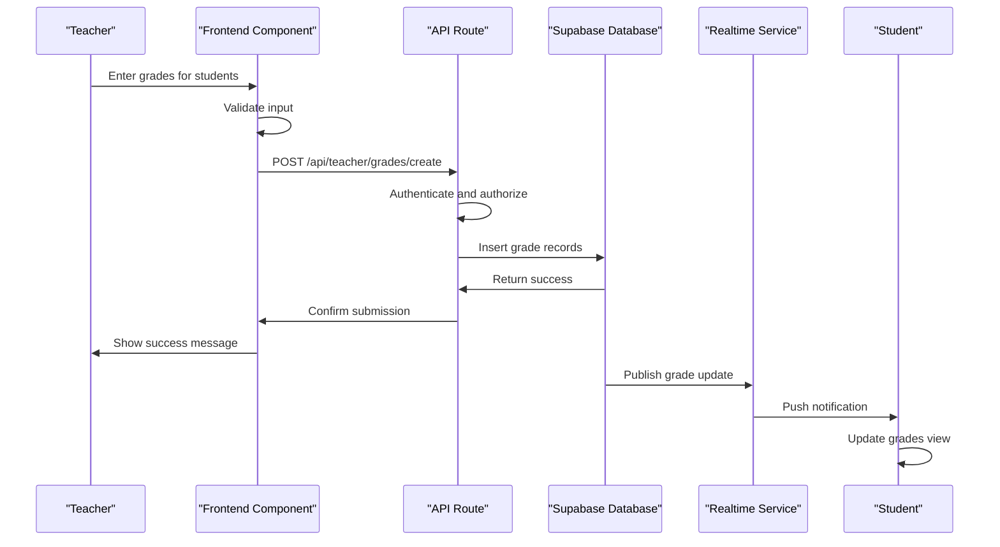
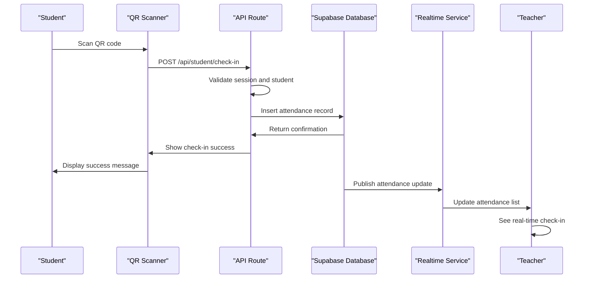
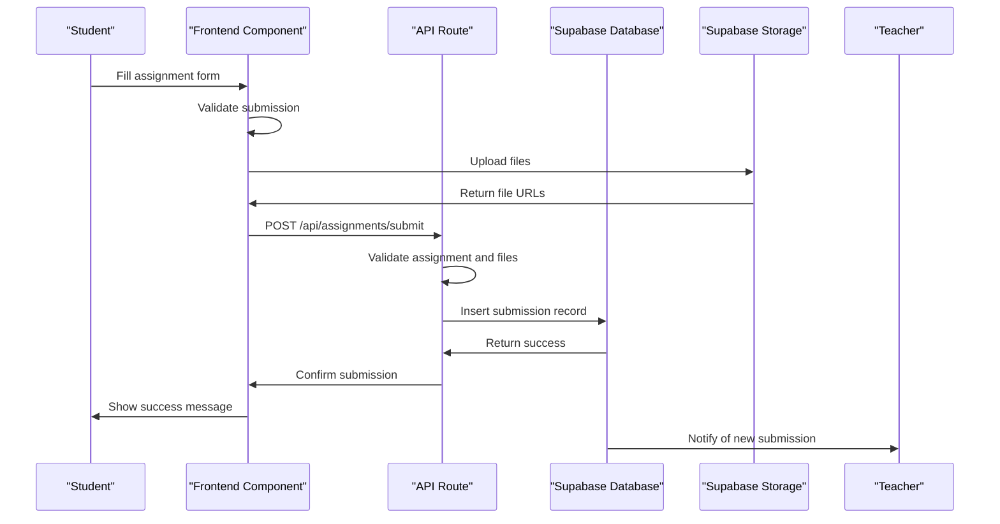

# Data Flow Between Layers

<cite>
**Referenced Files in This Document**   
- [app/api/assignments/submit/route.ts](file://app/api/assignments/submit/route.ts)
- [app/api/announcements/create/route.ts](file://app/api/announcements/create/route.ts)
- [app/api/teacher/attendance/save/route.ts](file://app/api/teacher/attendance/save/route.ts)
- [app/api/student/attendance/route.ts](file://app/api/student/attendance/route.ts)
- [app/teacher/attendance/page.tsx](file://app/teacher/attendance/page.tsx)
- [lib/supabase/client.ts](file://lib/supabase/client.ts)
- [lib/supabase/server.ts](file://lib/supabase/server.ts)
- [lib/supabase/queries.ts](file://lib/supabase/queries.ts)
- [lib/hooks/use-optimized-query.ts](file://lib/hooks/use-optimized-query.ts)
- [lib/cache.ts](file://lib/cache.ts)
- [lib/supabase/types.ts](file://lib/supabase/types.ts)
</cite>

## Table of Contents
1. [Request/Response Cycle Overview](#requestresponse-cycle-overview)
2. [Data Fetching Patterns](#data-fetching-patterns)
3. [Real-Time Data Synchronization](#real-time-data-synchronization)
4. [Form Submission Flow](#form-submission-flow)
5. [API Integration Patterns](#api-integration-patterns)
6. [Key Workflow Sequence Diagrams](#key-workflow-sequence-diagrams)
7. [Performance Considerations](#performance-considerations)

## Request/Response Cycle Overview

The School-Management-System implements a comprehensive request/response cycle that begins with user interaction in frontend components and flows through API routes to database persistence and back. The system uses Next.js App Router with React Server Components for initial data loading and client-side components for dynamic interactions. Authentication is handled through Supabase Auth, with role-based access control enforced at both the API and database levels.

When a user accesses a page, React Server Components fetch initial data on the server side using Supabase server clients, which ensures that sensitive database credentials are never exposed to the client. The server components then render the initial HTML with pre-hydrated data, providing fast time-to-content and improved SEO. After hydration, client components take over for interactive features, using client-side Supabase instances for real-time updates and form submissions.

API routes serve as the intermediary layer between frontend components and the Supabase database, implementing business logic, input validation, and security checks. Each API route validates user authentication and authorization before processing requests, ensuring that users can only access data appropriate to their role (admin, teacher, or student). The response cycle completes when data is returned to the frontend, where it's displayed to the user or used to update the application state.

**Section sources**
- [app/api/assignments/submit/route.ts](file://app/api/assignments/submit/route.ts#L1-L143)
- [app/api/announcements/create/route.ts](file://app/api/announcements/create/route.ts#L1-L81)
- [app/api/teacher/attendance/save/route.ts](file://app/api/teacher/attendance/save/route.ts#L1-L58)

## Data Fetching Patterns

The system employs a dual strategy for data fetching, combining React Server Components for initial data loading with client-side queries for dynamic updates. Server Components leverage the `unstable_cache` function from Next.js to cache database queries with automatic revalidation, reducing redundant database calls and improving performance. The caching strategy includes time-based revalidation (typically 60-180 seconds) and tag-based invalidation when data is updated.

For client-side data fetching, the system implements a custom `useOptimizedQuery` hook that provides automatic caching, deduplication, and retry logic for transient failures. This hook wraps around Supabase client queries and maintains an in-memory cache with a 30-second TTL, preventing duplicate API calls within that window. The hook also includes exponential backoff retry logic for network errors, enhancing reliability in unstable network conditions.

Pagination is implemented through specialized hooks like `usePaginatedQuery` and `useInfiniteQuery`, which handle chunked data loading and automatic merging of results. These hooks include deduplication logic to prevent duplicate entries when combining data from multiple pages. For search functionality, a `useDebouncedQuery` hook implements debounced search queries with a 300ms delay, reducing the number of API calls during typing.

The system also implements query optimization through selective field selection in database queries, only retrieving the fields needed for the current view. This reduces bandwidth usage and improves response times, particularly for tables with many columns or large text fields.

**Diagram sources**
- [lib/cache.ts](file://lib/cache.ts#L65-L128)
- [lib/hooks/use-optimized-query.ts](file://lib/hooks/use-optimized-query.ts#L28-L275)

**Section sources**
- [lib/cache.ts](file://lib/cache.ts#L1-L128)
- [lib/hooks/use-optimized-query.ts](file://lib/hooks/use-optimized-query.ts#L28-L275)

## Real-Time Data Synchronization

Real-time data synchronization is implemented using Supabase's Realtime functionality for features like attendance updates and announcements. The system establishes WebSocket connections to listen for database changes, enabling immediate UI updates without requiring manual refreshes. This is particularly important for collaborative features where multiple users might be interacting with the same data simultaneously.

For attendance tracking, teachers can see immediate updates when students check in via QR code, with the attendance list automatically refreshing to show new check-ins. Similarly, when administrators or teachers create announcements, all relevant users receive the update in real-time through the notification system. The real-time subscriptions are scoped to specific tables and filtered by user role and permissions to ensure data security.

The system implements connection management to handle network interruptions gracefully, automatically reconnecting when the connection is lost and resynchronizing any missed updates. Subscription lifecycle is tied to component mounting and unmounting, preventing memory leaks and unnecessary network traffic when components are not in use.

**Diagram sources**
- [lib/supabase/client.ts](file://lib/supabase/client.ts#L1-L9)
- [app/api/teacher/attendance/save/route.ts](file://app/api/teacher/attendance/save/route.ts#L1-L58)

**Section sources**
- [lib/supabase/client.ts](file://lib/supabase/client.ts#L1-L9)
- [app/api/teacher/attendance/save/route.ts](file://app/api/teacher/attendance/save/route.ts#L1-L58)

## Form Submission Flow

The form submission flow follows a structured pattern with validation, API communication, and optimistic UI updates. When a user submits a form, the data is first validated using Zod schemas on the client side to provide immediate feedback. The validation includes type checking, length constraints, and custom business rules specific to each form.

After client-side validation, the data is sent to the corresponding API route, where it undergoes server-side validation with the same Zod schema to prevent tampering. The API routes implement role-based access control, ensuring that users can only perform actions appropriate to their role. For example, only teachers can submit attendance records, and only students can submit assignments.

The system implements optimistic UI updates for improved user experience, immediately updating the interface based on the expected outcome before receiving confirmation from the server. If the server rejects the submission, the UI is rolled back and an error message is displayed. This approach provides a responsive experience while maintaining data integrity.

Error handling is comprehensive, with specific error messages for different failure scenarios such as network issues, validation errors, or permission denials. Loading states are clearly indicated with spinners or progress indicators, and success states are confirmed with toast notifications.

**Diagram sources**
- [app/api/assignments/submit/route.ts](file://app/api/assignments/submit/route.ts#L1-L143)
- [app/teacher/attendance/page.tsx](file://app/teacher/attendance/page.tsx#L1-L253)

**Section sources**
- [app/api/assignments/submit/route.ts](file://app/api/assignments/submit/route.ts#L1-L143)
- [app/teacher/attendance/page.tsx](file://app/teacher/attendance/page.tsx#L1-L253)

## API Integration Patterns

API integration between frontend components and backend endpoints follows consistent patterns across the application. All API communication uses the Fetch API with JSON payloads, with endpoints organized by role (admin, teacher, student) and function. The system implements a centralized error handling strategy through the `handleApiError` utility, which standardizes error responses and provides appropriate user feedback.

Loading states are managed through component state, with dedicated loading indicators during API calls. The system uses React's useState and useEffect hooks to manage the loading, success, and error states of API requests. For complex forms, the loading state is granular, showing progress for specific actions like file uploads or data processing.

Authentication headers are automatically included in API requests through Supabase's built-in session management, eliminating the need for manual token handling. The system also implements CSRF protection and rate limiting on API routes to prevent abuse, with rate limits configured based on the sensitivity of the endpoint.

The API routes follow RESTful conventions where appropriate, using HTTP methods (GET, POST, PUT, DELETE) to indicate the type of operation. Query parameters are used for filtering and pagination, while request bodies contain data for mutations. Response payloads include success indicators and relevant data, with error responses providing descriptive messages to aid debugging.

**Section sources**
- [app/api/announcements/create/route.ts](file://app/api/announcements/create/route.ts#L1-L81)
- [lib/supabase/server.ts](file://lib/supabase/server.ts#L1-L51)
- [app/teacher/attendance/page.tsx](file://app/teacher/attendance/page.tsx#L1-L253)

## Key Workflow Sequence Diagrams

### Grade Submission Workflow

**Diagram sources**
- [app/api/teacher/grades/create/route.ts](file://app/api/teacher/grades/create/route.ts#L1-L50)
- [app/teacher/grades/page.tsx](file://app/teacher/grades/page.tsx#L1-L200)

### Attendance Check-In Workflow

**Diagram sources**
- [app/api/student/check-in/route.ts](file://app/api/student/check-in/route.ts#L1-L40)
- [app/student/qr-checkin/page.tsx](file://app/student/qr-checkin/page.tsx#L1-L150)

### Assignment Submission Workflow

**Diagram sources**
- [app/api/assignments/submit/route.ts](file://app/api/assignments/submit/route.ts#L1-L143)
- [app/student/assignments/page.tsx](file://app/student/assignments/page.tsx#L1-L200)

## Performance Considerations

The system implements several performance optimizations to ensure responsive user experiences. Query optimization is achieved through selective field selection, avoiding SELECT * queries and only retrieving necessary data. Database indexes are strategically created on frequently queried columns like foreign keys and date fields to improve query performance.

Caching strategies combine server-side caching with Next.js' `unstable_cache` and client-side in-memory caching with TTL-based invalidation. The server-side cache uses tags for granular invalidation when data changes, while the client-side cache prevents duplicate API calls during short time windows. Cache size is limited to 100 entries with LRU (Least Recently Used) eviction to prevent memory bloat.

Pagination is implemented for all list views, with default page sizes of 50 items and infinite scrolling for large datasets. This prevents performance degradation when dealing with large numbers of records. The system also implements query deduplication, ensuring that identical queries in flight are not executed multiple times.

Network performance is optimized through payload minimization, sending only necessary data in API requests and responses. File uploads are handled directly to Supabase Storage rather than through the application server, reducing server load and improving upload speeds. The system also implements code splitting and lazy loading for non-critical components to reduce initial bundle size.

**Section sources**
- [lib/cache.ts](file://lib/cache.ts#L1-L128)
- [lib/hooks/use-optimized-query.ts](file://lib/hooks/use-optimized-query.ts#L28-L275)
- [lib/supabase/queries.ts](file://lib/supabase/queries.ts#L1-L419)