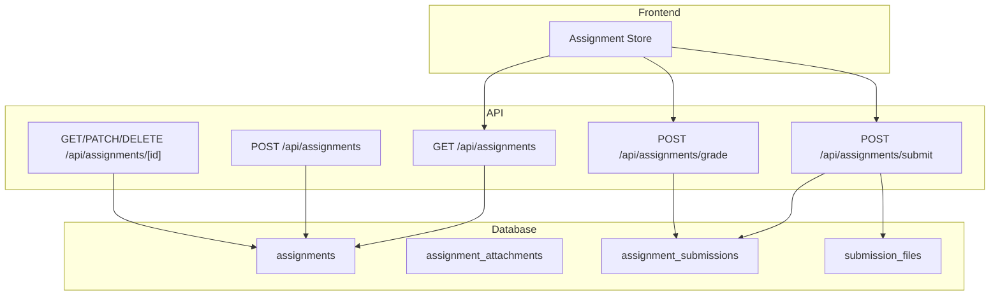
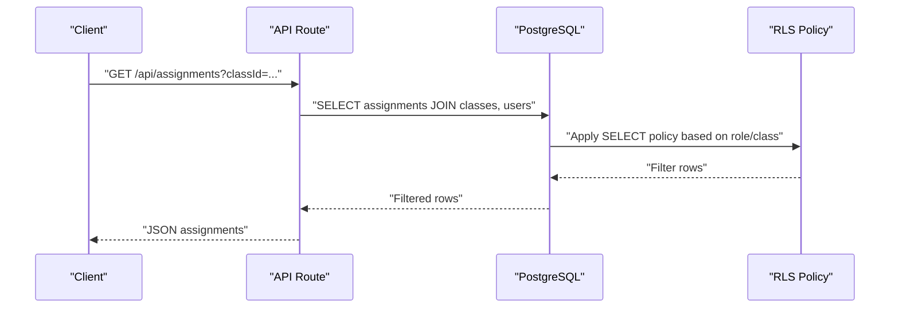
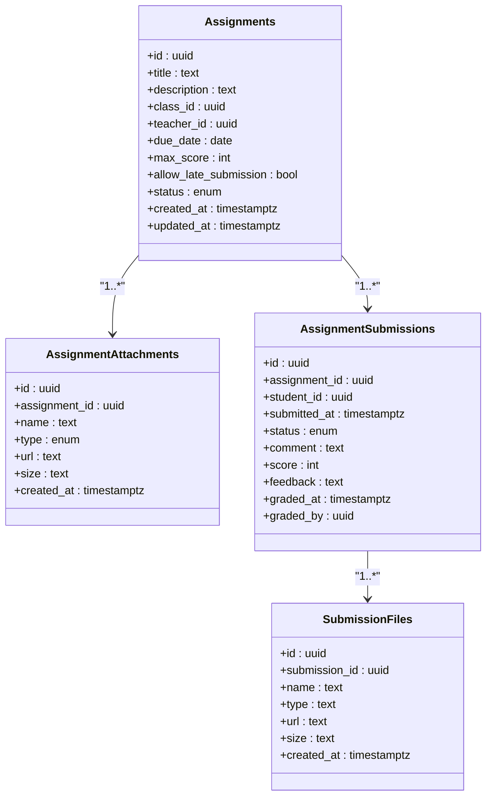

# Assignment Model

<cite>
**Referenced Files in This Document**
- [lib/database.types.ts](file://lib/database.types.ts)
- [lib/database-helpers.ts](file://lib/database-helpers.ts)
- [lib/assignment-store.ts](file://lib/assignment-store.ts)
- [supabase/migrations/20260105000001_create_assignments_table.sql](file://supabase/migrations/20260105000001_create_assignments_table.sql)
- [supabase/migrations/20260105082224_create_assignments_table.sql](file://supabase/migrations/20260105082224_create_assignments_table.sql)
- [app/api/assignments/route.ts](file://app/api/assignments/route.ts)
- [app/api/assignments/[id]/route.ts](file://app/api/assignments/[id]/route.ts)
- [app/api/assignments/submit/route.ts](file://app/api/assignments/submit/route.ts)
- [app/api/assignments/grade/route.ts](file://app/api/assignments/grade/route.ts)
</cite>

## Table of Contents
1. [Introduction](#introduction)
2. [Project Structure](#project-structure)
3. [Core Components](#core-components)
4. [Architecture Overview](#architecture-overview)
5. [Detailed Component Analysis](#detailed-component-analysis)
6. [Dependency Analysis](#dependency-analysis)
7. [Performance Considerations](#performance-considerations)
8. [Troubleshooting Guide](#troubleshooting-guide)
9. [Conclusion](#conclusion)
10. [Appendices](#appendices)

## Introduction
This document provides comprehensive data model documentation for the Assignment model in the School-Management-System. It covers the assignments table structure, foreign key relationships, Row Level Security (RLS) policies, and the relationships with submissions and attachments. It also documents business rules around deadlines, late submissions, and status transitions, along with practical query examples and validation constraints.

## Project Structure
The Assignment model spans database schema, API routes, and frontend stores:

- Database schema and RLS policies are defined in migration files.
- API routes implement CRUD operations and enforce role-based access and validation.
- Frontend stores encapsulate local state and derived business logic for UI rendering.

**Diagram sources**
- [supabase/migrations/20260105000001_create_assignments_table.sql](file://supabase/migrations/20260105000001_create_assignments_table.sql#L1-L123)
- [app/api/assignments/route.ts](file://app/api/assignments/route.ts#L1-L134)
- [app/api/assignments/[id]/route.ts](file://app/api/assignments/[id]/route.ts#L1-L108)
- [app/api/assignments/submit/route.ts](file://app/api/assignments/submit/route.ts#L1-L143)
- [app/api/assignments/grade/route.ts](file://app/api/assignments/grade/route.ts#L1-L75)
- [lib/assignment-store.ts](file://lib/assignment-store.ts#L1-L174)

**Section sources**
- [supabase/migrations/20260105000001_create_assignments_table.sql](file://supabase/migrations/20260105000001_create_assignments_table.sql#L1-L123)
- [app/api/assignments/route.ts](file://app/api/assignments/route.ts#L1-L134)
- [lib/assignment-store.ts](file://lib/assignment-store.ts#L1-L174)

## Core Components
- Assignments table: core entity storing assignment metadata and lifecycle.
- Assignment attachments: optional resources linked to assignments.
- Assignment submissions: per-student submission records with status and grading.
- Submission files: per-submission file uploads with validation and RLS.

Key relationships:
- assignments -> classes (foreign key)
- assignments -> users (teacher_id)
- assignment_attachments -> assignments (foreign key)
- assignment_submissions -> assignments (foreign key)
- assignment_submissions -> users (student_id)
- assignment_submissions -> users (graded_by)
- submission_files -> assignment_submissions (foreign key)

**Section sources**
- [lib/database.types.ts](file://lib/database.types.ts#L157-L213)
- [lib/database.types.ts](file://lib/database.types.ts#L58-L95)
- [lib/database.types.ts](file://lib/database.types.ts#L96-L156)
- [supabase/migrations/20260105000001_create_assignments_table.sql](file://supabase/migrations/20260105000001_create_assignments_table.sql#L1-L123)

## Architecture Overview
The Assignment model enforces role-based access and data integrity through:
- Database constraints and check constraints for enums and defaults.
- RLS policies restricting visibility and modifications by role and ownership.
- API routes validating inputs and enforcing business rules (e.g., late submission policy).
- Frontend store managing UI state and derived statuses.

**Diagram sources**
- [app/api/assignments/route.ts](file://app/api/assignments/route.ts#L18-L65)
- [supabase/migrations/20260105000001_create_assignments_table.sql](file://supabase/migrations/20260105000001_create_assignments_table.sql#L59-L118)

## Detailed Component Analysis

### Assignments Table Schema
- Fields and types:
  - id: UUID (primary key)
  - title: text (not null)
  - description: text
  - class_id: UUID (references classes.id, cascade delete)
  - teacher_id: UUID (references users.id, set null on delete)
  - due_date: date (not null)
  - max_score: integer (default 100)
  - allow_late_submission: boolean (default true)
  - status: text (default draft, check constraint: draft | published | closed)
  - created_at: timestamptz (default now)
  - updated_at: timestamptz (default now)

Constraints and defaults:
- Foreign keys: assignments.class_id -> classes.id (ON DELETE CASCADE)
- Foreign keys: assignments.teacher_id -> users.id (ON DELETE SET NULL)
- Check constraints: status in ('draft','published','closed')
- Default values: max_score=100, allow_late_submission=true, status='draft'

Indexes:
- idx_assignments_class_id
- idx_assignments_teacher_id

**Section sources**
- [supabase/migrations/20260105000001_create_assignments_table.sql](file://supabase/migrations/20260105000001_create_assignments_table.sql#L1-L14)
- [supabase/migrations/20260105000001_create_assignments_table.sql](file://supabase/migrations/20260105000001_create_assignments_table.sql#L119-L123)
- [lib/database.types.ts](file://lib/database.types.ts#L157-L196)

### Assignment Attachments Schema
- Fields and types:
  - id: UUID (primary key)
  - assignment_id: UUID (references assignments.id, cascade delete)
  - name: text (not null)
  - type: text (check constraint: pdf | document | image | link)
  - url: text (not null)
  - size: text
  - created_at: timestamptz (default now)

Constraints and defaults:
- Foreign key: assignment_attachments.assignment_id -> assignments.id (ON DELETE CASCADE)
- Check constraints: type in ('pdf','document','image','link')

Indexes:
- None explicitly defined in the referenced migration.

**Section sources**
- [supabase/migrations/20260105000001_create_assignments_table.sql](file://supabase/migrations/20260105000001_create_assignments_table.sql#L16-L25)
- [lib/database.types.ts](file://lib/database.types.ts#L58-L95)

### Assignment Submissions Schema
- Fields and types:
  - id: UUID (primary key)
  - assignment_id: UUID (references assignments.id, cascade delete)
  - student_id: UUID (references users.id, cascade delete)
  - submitted_at: timestamptz (default now)
  - status: text (default submitted, check constraint: pending | submitted | graded | late)
  - comment: text
  - score: integer
  - feedback: text
  - graded_at: timestamptz
  - graded_by: UUID (references users.id, set null on delete)
  - unique constraint: (assignment_id, student_id)

Constraints and defaults:
- Foreign keys: assignment_submissions.assignment_id -> assignments.id (ON DELETE CASCADE)
- Foreign keys: assignment_submissions.student_id -> users.id (ON DELETE CASCADE)
- Foreign keys: assignment_submissions.graded_by -> users.id (ON DELETE SET NULL)
- Check constraints: status in ('pending','submitted','graded','late')
- Unique constraint: (assignment_id, student_id)

Indexes:
- idx_assignment_submissions_assignment_id
- idx_assignment_submissions_student_id

**Section sources**
- [supabase/migrations/20260105000001_create_assignments_table.sql](file://supabase/migrations/20260105000001_create_assignments_table.sql#L27-L41)
- [supabase/migrations/20260105000001_create_assignments_table.sql](file://supabase/migrations/20260105000001_create_assignments_table.sql#L121-L123)
- [lib/database.types.ts](file://lib/database.types.ts#L96-L156)

### Submission Files Schema
- Fields and types:
  - id: UUID (primary key)
  - submission_id: UUID (references assignment_submissions.id, cascade delete)
  - name: text (not null)
  - type: text
  - url: text (not null)
  - size: text
  - created_at: timestamptz (default now)

Constraints and defaults:
- Foreign key: submission_files.submission_id -> assignment_submissions.id (ON DELETE CASCADE)

Indexes:
- None explicitly defined in the referenced migration.

**Section sources**
- [supabase/migrations/20260105000001_create_assignments_table.sql](file://supabase/migrations/20260105000001_create_assignments_table.sql#L43-L51)
- [lib/database.types.ts](file://lib/database.types.ts#L96-L156)

### Database Types and Helpers
- Type definitions for assignments, submissions, and attachments are generated from the schema.
- Helpers define joined types and enum extraction for safer usage in TypeScript.

**Section sources**
- [lib/database.types.ts](file://lib/database.types.ts#L157-L213)
- [lib/database.types.ts](file://lib/database.types.ts#L58-L95)
- [lib/database.types.ts](file://lib/database.types.ts#L96-L156)
- [lib/database-helpers.ts](file://lib/database-helpers.ts#L1-L47)

### API Routes and Business Rules

#### Retrieving Assignments
- Endpoint: GET /api/assignments
- Behavior:
  - Requires authenticated user.
  - Filters by classId if provided.
  - Teachers see their own assignments.
  - Students see only published assignments for enrolled classes.
  - Joins with classes and users for teacher display.

**Section sources**
- [app/api/assignments/route.ts](file://app/api/assignments/route.ts#L18-L65)

#### Creating Assignments
- Endpoint: POST /api/assignments
- Validation:
  - Title required, max length enforced.
  - Description max length enforced.
  - classId must be a UUID.
  - dueDate must parse to a valid date.
  - maxScore min/max enforced; defaults to 100 if not provided.
  - allowLateSubmission defaults to true if not provided.
  - status defaults to draft if not provided.
- Role requirement: teacher or admin.
- Ownership: teacher_id set to current user.

**Section sources**
- [app/api/assignments/route.ts](file://app/api/assignments/route.ts#L67-L133)

#### Updating and Deleting Assignments
- Endpoint: PATCH /api/assignments/[id], DELETE /api/assignments/[id]
- Allowed fields for update: title, description, due_date, max_score, allow_late_submission, status.
- Ownership requirement: teacher_id must match current user.

**Section sources**
- [app/api/assignments/[id]/route.ts](file://app/api/assignments/[id]/route.ts#L44-L81)
- [app/api/assignments/[id]/route.ts](file://app/api/assignments/[id]/route.ts#L83-L108)

#### Submitting Assignments
- Endpoint: POST /api/assignments/submit
- Validation:
  - assignmentId must be a UUID.
  - comment max length enforced.
  - files array max 10 entries; each file validates name/type/url/size.
  - File URL must originate from the configured Supabase storage host.
- Business rules:
  - Assignment must exist and be published.
  - Student must be enrolled in the assignment’s class.
  - Prevents duplicate submissions for the same assignment and student.
  - Late submission handling:
    - If due_date passed and allow_late_submission is false, reject submission.
    - Otherwise, mark status as late if overdue, otherwise submitted.
- Creates submission record and optional file records.

**Section sources**
- [app/api/assignments/submit/route.ts](file://app/api/assignments/submit/route.ts#L1-L143)

#### Grading Assignments
- Endpoint: POST /api/assignments/grade
- Validation:
  - Requires teacher or admin role.
  - Requires submissionId and score.
  - Validates score range against assignment.max_score.
- Ownership verification:
  - Ensures the teacher owns the assignment associated with the submission.
- Updates submission with score, feedback, status=graded, graded_at, and graded_by.

**Section sources**
- [app/api/assignments/grade/route.ts](file://app/api/assignments/grade/route.ts#L1-L75)

### Frontend Store Logic
- Local state management for assignments and submissions.
- Derived business logic:
  - Determines late vs submitted status based on due_date.
  - Provides queries for class, teacher, and student views.
  - Maintains counts for pending grading.

**Section sources**
- [lib/assignment-store.ts](file://lib/assignment-store.ts#L1-L174)

## Dependency Analysis
- Database-level dependencies:
  - assignments depends on classes and users.
  - assignment_attachments depends on assignments.
  - assignment_submissions depends on assignments and users.
  - submission_files depends on assignment_submissions.
- API-level dependencies:
  - GET /api/assignments depends on users’ role and class enrollment.
  - POST /api/assignments/submit depends on assignment existence, enrollment, and late submission policy.
  - POST /api/assignments/grade depends on teacher ownership and score bounds.
- Frontend store depends on API responses and local state.

**Diagram sources**
- [supabase/migrations/20260105000001_create_assignments_table.sql](file://supabase/migrations/20260105000001_create_assignments_table.sql#L1-L51)
- [lib/database.types.ts](file://lib/database.types.ts#L58-L156)

**Section sources**
- [supabase/migrations/20260105000001_create_assignments_table.sql](file://supabase/migrations/20260105000001_create_assignments_table.sql#L1-L51)
- [lib/database.types.ts](file://lib/database.types.ts#L58-L156)

## Performance Considerations
- Indexes:
  - assignments: class_id, teacher_id
  - assignment_submissions: assignment_id, student_id
- Recommendations:
  - Add indexes on assignment_attachments.assignment_id if frequently queried.
  - Consider adding indexes on submission_files.submission_id for file-heavy workflows.
  - Use selective filters (classId, teacher_id, student_id) to limit result sets.

[No sources needed since this section provides general guidance]

## Troubleshooting Guide
Common issues and resolutions:
- Unauthorized access:
  - Ensure user is authenticated and has the correct role (teacher/admin for creation/update/delete; student for submissions).
- Forbidden errors:
  - Creation requires teacher or admin role.
  - Update/Delete requires ownership (teacher_id equals current user).
  - Submissions require enrollment in the assignment’s class and published status.
- Validation failures:
  - Ensure due_date parses correctly and classId is a valid UUID.
  - Respect maxScore bounds when grading.
- Late submission rejections:
  - If allow_late_submission is false and due_date has passed, submission is rejected.
- Duplicate submissions:
  - Attempting to submit twice for the same assignment/student is prevented.

**Section sources**
- [app/api/assignments/route.ts](file://app/api/assignments/route.ts#L67-L133)
- [app/api/assignments/[id]/route.ts](file://app/api/assignments/[id]/route.ts#L44-L108)
- [app/api/assignments/submit/route.ts](file://app/api/assignments/submit/route.ts#L60-L143)
- [app/api/assignments/grade/route.ts](file://app/api/assignments/grade/route.ts#L1-L75)

## Conclusion
The Assignment model integrates robust database constraints, RLS policies, and API validations to ensure secure, consistent, and predictable behavior. Business rules for deadlines and late submissions are enforced both at the database level (via policies and constraints) and at the application level (via API routes and frontend store logic). The relationships between assignments, submissions, and attachments are clearly defined, enabling efficient queries and scalable growth.

## Appendices

### Database Schema from lib/database.types.ts
- assignments: Row, Insert, Update with foreign keys to classes and users.
- assignment_attachments: Row, Insert, Update with foreign key to assignments.
- assignment_submissions: Row, Insert, Update with foreign keys to assignments and users.

**Section sources**
- [lib/database.types.ts](file://lib/database.types.ts#L157-L213)
- [lib/database.types.ts](file://lib/database.types.ts#L58-L95)
- [lib/database.types.ts](file://lib/database.types.ts#L96-L156)

### RLS Policies Summary
- assignments:
  - Teachers can manage their own assignments (ownership) or admins can manage all.
  - Students can view published assignments for enrolled classes.
- assignment_attachments:
  - Anyone can view attachments.
  - Teachers can manage attachments for their assignments.
- assignment_submissions:
  - Students can view and submit their own submissions.
  - Teachers can view and grade submissions for their assignments.
- submission_files:
  - Users can view their own submission files.
  - Students can upload submission files for their own submissions.

**Section sources**
- [supabase/migrations/20260105000001_create_assignments_table.sql](file://supabase/migrations/20260105000001_create_assignments_table.sql#L59-L118)

### Business Rules and Status Transitions
- Status values:
  - assignments.status: draft | published | closed
  - assignment_submissions.status: pending | submitted | graded | late
- Deadline enforcement:
  - Late submissions are allowed by default; if disabled, submissions after due_date are rejected.
- Grading:
  - Score must be within [0, max_score].
  - Status transitions to graded upon successful grading.

**Section sources**
- [supabase/migrations/20260105000001_create_assignments_table.sql](file://supabase/migrations/20260105000001_create_assignments_table.sql#L1-L14)
- [app/api/assignments/submit/route.ts](file://app/api/assignments/submit/route.ts#L105-L119)
- [app/api/assignments/grade/route.ts](file://app/api/assignments/grade/route.ts#L52-L54)

### Example Queries

#### Retrieve Class Assignments
- Filter by classId and order by due_date ascending.
- Join with classes and users for teacher display.

**Section sources**
- [app/api/assignments/route.ts](file://app/api/assignments/route.ts#L36-L57)

#### Retrieve Teacher's Assignments
- Filter by teacher_id equal to current user.

**Section sources**
- [app/api/assignments/route.ts](file://app/api/assignments/route.ts#L52-L54)

#### Retrieve Upcoming Deadlines for a Student
- Published assignments for enrolled classes ordered by due_date ascending.

**Section sources**
- [app/api/assignments/route.ts](file://app/api/assignments/route.ts#L54-L56)

### Data Validation Rules and File Attachment Constraints
- Assignments:
  - Title required, max length enforced.
  - Description max length enforced.
  - classId must be a UUID.
  - dueDate must parse to a valid date.
  - maxScore min/max enforced; defaults to 100.
  - allowLateSubmission defaults to true.
  - status defaults to draft.
- Submissions:
  - assignmentId must be a UUID.
  - comment max length enforced.
  - files array max 10 entries.
  - Each file:
    - name max length enforced.
    - type max length enforced.
    - url must be a valid URL and hosted on the configured Supabase storage host.
    - size format enforced.

**Section sources**
- [app/api/assignments/route.ts](file://app/api/assignments/route.ts#L6-L16)
- [app/api/assignments/submit/route.ts](file://app/api/assignments/submit/route.ts#L10-L31)
- [app/api/assignments/submit/route.ts](file://app/api/assignments/submit/route.ts#L33-L37)

### Relationship Between Assignments and Submissions
- One assignment can have many submissions (one-to-many).
- Each submission links to a single student and assignment.
- Unique constraint prevents duplicate submissions per student per assignment.

**Section sources**
- [supabase/migrations/20260105000001_create_assignments_table.sql](file://supabase/migrations/20260105000001_create_assignments_table.sql#L27-L41)
- [lib/database.types.ts](file://lib/database.types.ts#L96-L156)

### Relationship Between Assignments and Attachments
- One assignment can have many attachments (one-to-many).
- Attachments are public-readable but editable only by teachers for their assignments.

**Section sources**
- [supabase/migrations/20260105000001_create_assignments_table.sql](file://supabase/migrations/20260105000001_create_assignments_table.sql#L16-L25)
- [supabase/migrations/20260105000001_create_assignments_table.sql](file://supabase/migrations/20260105000001_create_assignments_table.sql#L72-L84)
- [lib/database.types.ts](file://lib/database.types.ts#L58-L95)