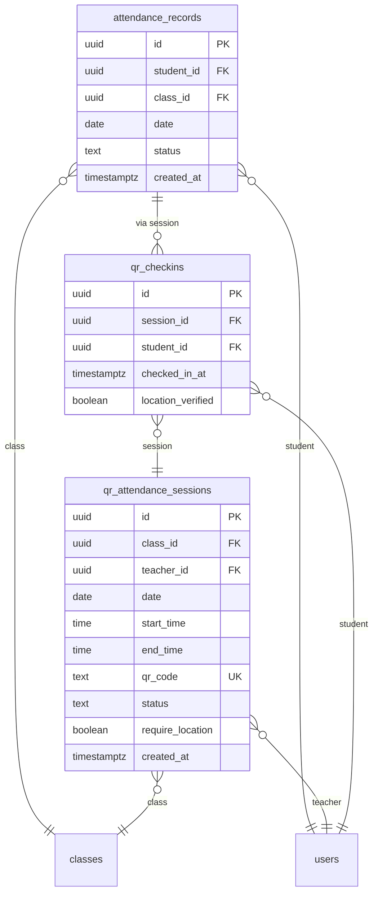
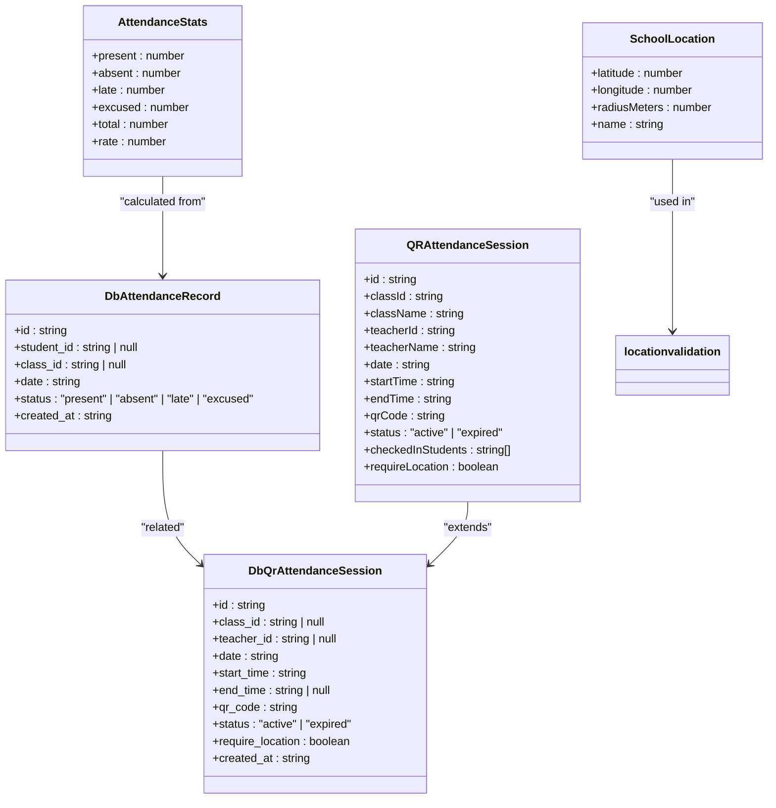
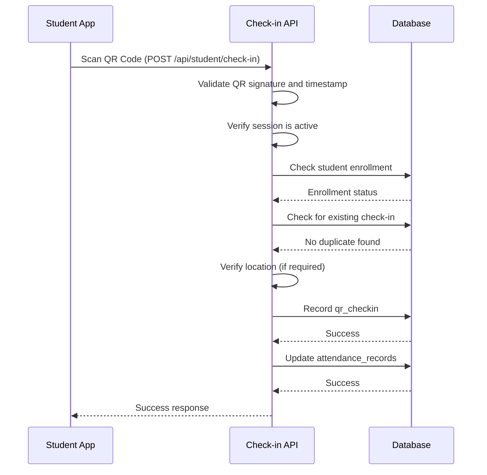
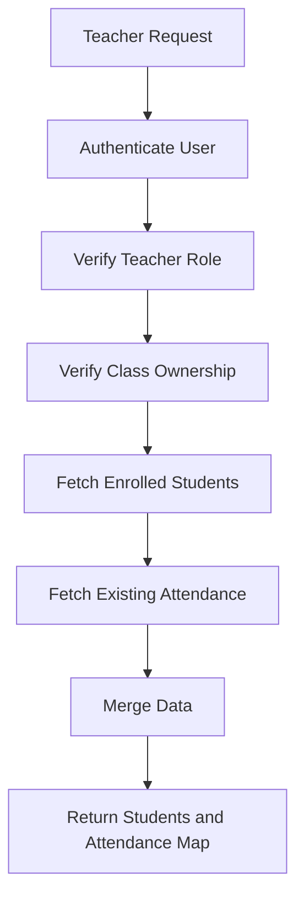

# Attendance Model

<cite>
**Referenced Files in This Document**   
- [20251219043454_create_attendance_tables.sql](file://supabase/migrations/20251219043454_create_attendance_tables.sql)
- [20251219121408_add_attendance_unique_constraint.sql](file://supabase/migrations/20251219121408_add_attendance_unique_constraint.sql)
- [20251219044036_add_rls_policies.sql](file://supabase/migrations/20251219044036_add_rls_policies.sql)
- [types.ts](file://lib/types.ts)
- [supabase/types.ts](file://lib/supabase/types.ts)
- [database.types.ts](file://lib/database.types.ts)
- [attendance-utils.ts](file://lib/attendance-utils.ts)
- [qr-attendance-store.ts](file://lib/qr-attendance-store.ts)
- [school-location-store.ts](file://lib/school-location-store.ts)
- [student/attendance/route.ts](file://app/api/student/attendance/route.ts)
- [teacher/attendance/save/route.ts](file://app/api/teacher/attendance/save/route.ts)
- [teacher/attendance/class-data/route.ts](file://app/api/teacher/attendance/class-data/route.ts)
- [student/check-in/route.ts](file://app/api/student/check-in/route.ts)
- [teacher/generate-qr/route.ts](file://app/api/teacher/generate-qr/route.ts)
- [student/attendance/page.tsx](file://app/student/attendance/page.tsx)
- [teacher/attendance/page.tsx](file://app/teacher/attendance/page.tsx)
- [student/qr-checkin/page.tsx](file://app/student/qr-checkin/page.tsx)
- [teacher/qr-attendance/page.tsx](file://app/teacher/qr-attendance/page.tsx)
</cite>

## Table of Contents
1. [Introduction](#introduction)
2. [Database Schema](#database-schema)
3. [Type Definitions](#type-definitions)
4. [Relationships and Constraints](#relationships-and-constraints)
5. [Row Level Security Policies](#row-level-security-policies)
6. [QR-Based Check-In System](#qr-based-check-in-system)
7. [Location Validation Logic](#location-validation-logic)
8. [Data Access Patterns](#data-access-patterns)
9. [Utility Functions](#utility-functions)
10. [Frontend Implementation](#frontend-implementation)
11. [Query Examples](#query-examples)
12. [Data Validation and Edge Cases](#data-validation-and-edge-cases)

## Introduction

The Attendance model in the School-Management-System provides a comprehensive solution for tracking student attendance across classes. The system supports both manual attendance recording by teachers and automated QR-based check-in by students. It includes robust security measures, location validation, and role-based access control to ensure data integrity and prevent fraudulent attendance marking. This documentation details the data model, relationships, security policies, and implementation details of the attendance system.

## Database Schema

The attendance system consists of three main tables that work together to record attendance data:



**Diagram sources**
- [20251219043454_create_attendance_tables.sql](file://supabase/migrations/20251219043454_create_attendance_tables.sql)

**Section sources**
- [20251219043454_create_attendance_tables.sql](file://supabase/migrations/20251219043454_create_attendance_tables.sql)

### attendance_records Table

The `attendance_records` table stores the official attendance records for students in classes. Each record represents a student's attendance status for a specific class on a specific date.

| Field | Type | Constraints | Description |
|-------|------|-------------|-------------|
| id | UUID | PRIMARY KEY, DEFAULT gen_random_uuid() | Unique identifier for the attendance record |
| student_id | UUID | REFERENCES users(id) ON DELETE CASCADE | Foreign key to the users table identifying the student |
| class_id | UUID | REFERENCES classes(id) ON DELETE CASCADE | Foreign key to the classes table identifying the class |
| date | DATE | NOT NULL | The date when the class occurred |
| status | TEXT | NOT NULL, CHECK (status IN ('present', 'absent', 'late', 'excused')) | The attendance status of the student |
| created_at | TIMESTAMPTZ | DEFAULT NOW() | Timestamp when the record was created |

### qr_attendance_sessions Table

The `qr_attendance_sessions` table manages QR code-based attendance sessions initiated by teachers. Each session represents a specific check-in period for a class.

| Field | Type | Constraints | Description |
|-------|------|-------------|-------------|
| id | UUID | PRIMARY KEY, DEFAULT gen_random_uuid() | Unique identifier for the QR attendance session |
| class_id | UUID | REFERENCES classes(id) ON DELETE CASCADE | Foreign key to the classes table identifying the class |
| teacher_id | UUID | REFERENCES users(id) ON DELETE CASCADE | Foreign key to the users table identifying the teacher |
| date | DATE | NOT NULL | The date of the attendance session |
| start_time | TIME | NOT NULL | The start time of the session |
| end_time | TIME | NULL | The end time of the session (optional) |
| qr_code | TEXT | UNIQUE, NOT NULL | The unique QR code for the session |
| status | TEXT | NOT NULL, DEFAULT 'active', CHECK (status IN ('active', 'expired')) | The current status of the session |
| require_location | BOOLEAN | DEFAULT true | Whether location verification is required for check-in |
| created_at | TIMESTAMPTZ | DEFAULT NOW() | Timestamp when the session was created |

### qr_checkins Table

The `qr_checkins` table records individual QR code check-in events by students. These records are used to automatically update the official attendance records.

| Field | Type | Constraints | Description |
|-------|------|-------------|-------------|
| id | UUID | PRIMARY KEY, DEFAULT gen_random_uuid() | Unique identifier for the check-in record |
| session_id | UUID | REFERENCES qr_attendance_sessions(id) ON DELETE CASCADE | Foreign key to the qr_attendance_sessions table |
| student_id | UUID | REFERENCES users(id) ON DELETE CASCADE | Foreign key to the users table identifying the student |
| checked_in_at | TIMESTAMPTZ | DEFAULT NOW() | Timestamp when the student checked in |
| location_verified | BOOLEAN | DEFAULT false | Whether the student's location was verified during check-in |
| (session_id, student_id) | | UNIQUE | Composite unique constraint to prevent duplicate check-ins |

## Type Definitions

The system defines TypeScript interfaces that correspond to the database schema, providing type safety throughout the application.



**Diagram sources**
- [supabase/types.ts](file://lib/supabase/types.ts)
- [qr-attendance-store.ts](file://lib/qr-attendance-store.ts)
- [school-location-store.ts](file://lib/school-location-store.ts)

**Section sources**
- [supabase/types.ts](file://lib/supabase/types.ts)
- [database.types.ts](file://lib/database.types.ts)
- [types.ts](file://lib/types.ts)

### DbAttendanceRecord Interface

The `DbAttendanceRecord` interface in `lib/supabase/types.ts` defines the structure of attendance records as they are retrieved from the database:

```typescript
export interface DbAttendanceRecord {
  id: string
  student_id: string | null
  class_id: string | null
  date: string
  status: "present" | "absent" | "late" | "excused"
  created_at: string
}
```

### AttendanceStatus Type

The `AttendanceStatus` type in `lib/types.ts` defines the possible values for attendance status, ensuring consistency across the application:

```typescript
export type AttendanceStatus = "present" | "absent" | "late" | "excused"
```

## Relationships and Constraints

The attendance system implements several constraints to maintain data integrity and prevent duplicate or invalid records.

### Composite Unique Constraint

A composite unique constraint ensures that each student can have only one attendance record per class per date. This prevents duplicate entries and maintains data consistency.

```sql
CREATE UNIQUE INDEX IF NOT EXISTS attendance_records_student_class_date_idx ON attendance_records (student_id, class_id, date);
```

This constraint is implemented in the migration file `20251219121408_add_attendance_unique_constraint.sql` and ensures that the combination of `student_id`, `class_id`, and `date` is unique across all attendance records.

### Foreign Key Relationships

The attendance system establishes relationships with other core entities through foreign key constraints:

- `attendance_records.student_id` references `users.id` - Links each attendance record to a specific student user
- `attendance_records.class_id` references `classes.id` - Links each attendance record to a specific class
- `qr_attendance_sessions.class_id` references `classes.id` - Links each QR session to a specific class
- `qr_attendance_sessions.teacher_id` references `users.id` - Links each QR session to the teacher who created it
- `qr_checkins.session_id` references `qr_attendance_sessions.id` - Links each check-in to a specific QR session
- `qr_checkins.student_id` references `users.id` - Links each check-in to a specific student

These relationships ensure referential integrity and enable efficient joins when querying attendance data.

**Section sources**
- [20251219043454_create_attendance_tables.sql](file://supabase/migrations/20251219043454_create_attendance_tables.sql)
- [20251219121408_add_attendance_unique_constraint.sql](file://supabase/migrations/20251219121408_add_attendance_unique_constraint.sql)

## Row Level Security Policies

The attendance system implements Row Level Security (RLS) policies to control access to attendance data based on user roles. These policies ensure that users can only access data they are authorized to view or modify.

### Student Access Policy

Students can view their own attendance records through the API endpoint, but cannot directly access the database. The API enforces this restriction:

```typescript
export async function GET(request: Request) {
  // ... authentication
  const { data: records, error } = await supabase
    .from("attendance_records")
    .select(`
      id, date, status,
      class:classes (name)
    `)
    .eq("student_id", user.id)
    .order("date", { ascending: false })
}
```

The policy ensures students can only retrieve records where they are the student, preventing access to other students' attendance data.

### Teacher Access Policy

Teachers have more extensive access to manage attendance for classes they teach. When saving attendance records, the system verifies that the teacher owns all classes in the batch:

```typescript
// SECURITY FIX: Verify ownership of ALL classes in the batch
const uniqueClassIds = [...new Set(records.map((r: any) => r.class_id))]
    
const { count, error: countError } = await supabase
  .from("classes")
  .select("id", { count: "exact", head: true })
  .in("id", uniqueClassIds)
  .eq("teacher_id", user.id)

// If the number of owned classes found doesn't match the number of unique classes in the request,
// it means the teacher is trying to submit attendance for a class they don't own.
if (count !== uniqueClassIds.length) {
  return NextResponse.json({ error: "Forbidden: You do not own one or more classes in this batch" }, { status: 403 })
}
```

This policy prevents teachers from modifying attendance for classes they do not teach.

### Admin Access

Admins have full access to all attendance records. The RLS policies allow admins to read, create, update, and delete attendance records across all classes and students. This access is necessary for administrative oversight and data management.

The base RLS policies are defined in `20251219044036_add_rls_policies.sql`, with additional policies added in subsequent migrations to refine access control.

**Section sources**
- [20251219044036_add_rls_policies.sql](file://supabase/migrations/20251219044036_add_rls_policies.sql)
- [student/attendance/route.ts](file://app/api/student/attendance/route.ts)
- [teacher/attendance/save/route.ts](file://app/api/teacher/attendance/save/route.ts)

## QR-Based Check-In System

The QR-based check-in system allows students to mark their attendance by scanning a dynamically generated QR code displayed by the teacher. This system enhances security by preventing QR code sharing and ensuring real-time check-in.

### QR Code Generation

Teachers generate QR codes through the `/api/teacher/generate-qr` endpoint. The system creates a time-limited, cryptographically signed token that includes:

- Session ID
- Timestamp
- HMAC signature

```typescript
// Create HMAC signature
const payload = `${sessionId}:${timestamp}`
const signature = crypto.createHmac("sha256", secret).update(payload).digest("hex")
    
// Create token
const tokenData = JSON.stringify({ sessionId, timestamp, signature })
const token = btoa(tokenData)
```

The QR code rotates every 3 seconds to prevent sharing and ensure that only students present in the classroom can check in.

### Check-In Process

When a student scans the QR code, the system validates multiple factors before recording attendance:

1. **QR Code Validity**: The system verifies the HMAC signature and checks that the QR code is not expired (valid for 5 seconds)
2. **Session Status**: The attendance session must be active
3. **Student Enrollment**: The student must be enrolled in the class
4. **Duplicate Check**: The student must not have already checked in for this session
5. **Location Verification**: If required, the student's GPS location must be within the school area

The check-in process is implemented in the `/api/student/check-in` API route, which handles all validation and records the check-in in the database.



**Diagram sources**
- [student/check-in/route.ts](file://app/api/student/check-in/route.ts)
- [teacher/generate-qr/route.ts](file://app/api/teacher/generate-qr/route.ts)

**Section sources**
- [student/check-in/route.ts](file://app/api/student/check-in/route.ts)
- [teacher/generate-qr/route.ts](file://app/api/teacher/generate-qr/route.ts)
- [student/qr-checkin/page.tsx](file://app/student/qr-checkin/page.tsx)
- [teacher/qr-attendance/page.tsx](file://app/teacher/qr-attendance/page.tsx)

## Location Validation Logic

The system implements robust location validation to ensure students are physically present at school when checking in. This prevents remote check-ins and maintains the integrity of attendance records.

### Geofencing Implementation

The location validation uses a geofencing approach based on the Haversine formula to calculate the distance between the student's GPS coordinates and the school's location:

```typescript
function calculateDistance(lat1: number, lon1: number, lat2: number, lon2: number): number {
  const R = 6371e3 // Earth's radius in meters
  const φ1 = (lat1 * Math.PI) / 180
  const φ2 = (lat2 * Math.PI) / 180
  const Δφ = ((lat2 - lat1) * Math.PI) / 180
  const Δλ = ((lon2 - lon1) * Math.PI) / 180

  const a =
    Math.sin(Δφ / 2) * Math.sin(Δφ / 2) +
    Math.cos(φ1) * Math.cos(φ2) * Math.sin(Δλ / 2) * Math.sin(Δλ / 2)
  const c = 2 * Math.atan2(Math.sqrt(a), Math.sqrt(1 - a))

  return R * c // Distance in meters
}
```

### Anti-Spoofing Measures

The system includes several anti-spoofing measures to detect and prevent GPS manipulation:

1. **Perfect Match Detection**: If the calculated distance is less than 1 meter, the system rejects the location as potentially spoofed:
   ```typescript
   // Block suspiciously perfect matches (GPS spoofing indicator)
   if (distance < 1) {
      return NextResponse.json({ 
        error: "Location signal rejected. Please ensure you are using a real device." 
      }, { status: 403 })
   }
   ```

2. **Network Fencing**: The system can enforce school network connectivity by checking the client's IP address against a configured school IP range.

3. **Rate Limiting**: The system implements rate limiting on check-in attempts to prevent automated scripts from bypassing location requirements.

### School Location Configuration

The school's location and geofence radius are stored in the `school_settings` table and can be configured by administrators:

```typescript
export interface SchoolLocation {
  latitude: number
  longitude: number
  radiusMeters: number
  name: string
}
```

The default configuration sets the school location to Manila, Philippines with a 500-meter radius, but this can be customized to match the actual school campus.

**Section sources**
- [school-location-store.ts](file://lib/school-location-store.ts)
- [student/check-in/route.ts](file://app/api/student/check-in/route.ts)

## Data Access Patterns

The system implements specific data access patterns through API routes that enforce security and business logic.

### Retrieving Class Attendance Data

Teachers retrieve class attendance data through the `/api/teacher/attendance/class-data` endpoint, which follows a secure access pattern:



The process ensures that teachers can only access data for classes they own, preventing unauthorized access to other classes' attendance information.

### Saving Attendance Records

When saving attendance records, the system uses an upsert operation with a specific conflict resolution strategy:

```typescript
const { error } = await supabase.from("attendance_records").upsert(records, {
  onConflict: "student_id,class_id,date",
})
```

The `onConflict` parameter specifies the composite key (`student_id,class_id,date`) that determines when a record should be updated rather than inserted. This ensures that multiple submissions for the same student-class-date combination update the existing record rather than creating duplicates.

**Section sources**
- [teacher/attendance/class-data/route.ts](file://app/api/teacher/attendance/class-data/route.ts)
- [teacher/attendance/save/route.ts](file://app/api/teacher/attendance/save/route.ts)

## Utility Functions

The system includes several utility functions that support attendance functionality.

### Attendance Statistics Calculation

The `calculateAttendanceStats` function in `lib/attendance-utils.ts` calculates attendance statistics from a list of records:

```typescript
export function calculateAttendanceStats(
  records: Array<{ status: AttendanceStatus }>
): AttendanceStats {
  const stats = records.reduce(
    (acc, record) => {
      if (record.status in acc) {
        acc[record.status]++
      }
      acc.total++
      return acc
    },
    { present: 0, absent: 0, late: 0, excused: 0, total: 0 }
  )

  // Calculate attendance rate (present + late counts as attended)
  const attendanceRate = stats.total > 0 
    ? Math.round(((stats.present + stats.late) / stats.total) * 100) 
    : 0

  return {
    ...stats,
    rate: attendanceRate
  }
}
```

This function counts the occurrences of each status and calculates an attendance rate percentage, where "present" and "late" statuses are considered attended.

### QR Attendance Store

The `useQRAttendanceStore` in `lib/qr-attendance-store.ts` manages QR attendance session state on the client side:

```typescript
export const useQRAttendanceStore = create<QRAttendanceStore>((set, get) => ({
  sessions: [],
  
  createSession: (session) => {
    const qrCode = `ATT-${session.classId.toUpperCase()}-${session.date.replace(/-/g, "")}-${session.startTime.replace(":", "")}`
    const newSession: QRAttendanceSession = {
      ...session,
      id: crypto.randomUUID(),
      qrCode,
      status: "active",
      checkedInStudents: [],
    }
    set((state) => ({
      sessions: [newSession, ...state.sessions],
    }))
    return newSession
  },
  
  checkIn: (sessionId, studentId, locationVerified = true) => {
    // Validation logic
    // Update state
  },
  
  // Other methods...
}))
```

This store manages session creation, check-ins, and state synchronization, providing a reactive interface for the QR attendance UI components.

**Section sources**
- [attendance-utils.ts](file://lib/attendance-utils.ts)
- [qr-attendance-store.ts](file://lib/qr-attendance-store.ts)

## Frontend Implementation

The attendance system is implemented through several frontend components that provide user interfaces for different roles.

### Student Attendance Interface

The student attendance page (`app/student/attendance/page.tsx`) displays a student's attendance history with visual statistics:

- Attendance rate progress bar
- Count of present, absent, late, and excused records
- List of recent attendance records with status badges

The interface fetches data from the secure API endpoint and presents it in an accessible format.

### Teacher Attendance Interface

The teacher attendance page (`app/teacher/attendance/page.tsx`) provides a comprehensive interface for taking attendance:

- Class selection dropdown
- Date picker for selecting the attendance date
- List of students with attendance status buttons (Present, Absent, Late)
- Real-time attendance statistics
- Save functionality with loading state

The interface uses the class-data and save API endpoints to retrieve and submit attendance data securely.

### QR Check-In Interfaces

Two specialized interfaces support the QR-based check-in system:

1. **Student QR Check-in** (`app/student/qr-checkin/page.tsx`): Allows students to scan QR codes and check in, with location status display and check-in history.

2. **Teacher QR Attendance** (`app/teacher/qr-attendance/page.tsx`): Enables teachers to create QR attendance sessions, view a rotating QR code, and monitor check-ins in real-time.

These interfaces work together to create a seamless check-in experience while maintaining security through time-limited QR codes and location validation.

**Section sources**
- [student/attendance/page.tsx](file://app/student/attendance/page.tsx)
- [teacher/attendance/page.tsx](file://app/teacher/attendance/page.tsx)
- [student/qr-checkin/page.tsx](file://app/student/qr-checkin/page.tsx)
- [teacher/qr-attendance/page.tsx](file://app/teacher/qr-attendance/page.tsx)

## Query Examples

The following examples demonstrate common queries for retrieving attendance data.

### Daily Attendance Roll

Retrieve all attendance records for a specific class on a specific date:

```sql
SELECT 
  ar.id,
  ar.date,
  ar.status,
  u.name as student_name,
  u.email as student_email,
  c.name as class_name
FROM attendance_records ar
JOIN users u ON ar.student_id = u.id
JOIN classes c ON ar.class_id = c.id
WHERE ar.class_id = 'class-id-here' 
  AND ar.date = '2025-01-15'
ORDER BY u.name;
```

### Student Attendance History

Retrieve a student's attendance history across all classes:

```sql
SELECT 
  ar.id,
  ar.date,
  ar.status,
  ar.created_at,
  c.name as class_name,
  c.grade,
  c.section
FROM attendance_records ar
JOIN classes c ON ar.class_id = c.id
WHERE ar.student_id = 'student-id-here'
ORDER BY ar.date DESC, c.name;
```

### Class Attendance Summary

Generate a summary of attendance for a class over a date range:

```sql
SELECT 
  c.name as class_name,
  COUNT(*) as total_sessions,
  SUM(CASE WHEN ar.status = 'present' THEN 1 ELSE 0 END) as present_count,
  SUM(CASE WHEN ar.status = 'absent' THEN 1 ELSE 0 END) as absent_count,
  SUM(CASE WHEN ar.status = 'late' THEN 1 ELSE 0 END) as late_count,
  SUM(CASE WHEN ar.status = 'excused' THEN 1 ELSE 0 END) as excused_count,
  ROUND(
    (SUM(CASE WHEN ar.status IN ('present', 'late') THEN 1 ELSE 0 END) * 100.0) / COUNT(*), 
    2
  ) as attendance_rate
FROM attendance_records ar
JOIN classes c ON ar.class_id = c.id
WHERE ar.class_id = 'class-id-here'
  AND ar.date BETWEEN '2025-01-01' AND '2025-01-31'
GROUP BY c.name;
```

### Recent Check-Ins

Retrieve recent QR check-ins for monitoring purposes:

```sql
SELECT 
  qc.checked_in_at,
  u.name as student_name,
  u.email as student_email,
  c.name as class_name,
  qas.date as session_date,
  qas.start_time,
  qc.location_verified
FROM qr_checkins qc
JOIN users u ON qc.student_id = u.id
JOIN qr_attendance_sessions qas ON qc.session_id = qas.id
JOIN classes c ON qas.class_id = c.id
WHERE qc.checked_in_at >= NOW() - INTERVAL '24 hours'
ORDER BY qc.checked_in_at DESC;
```

**Section sources**
- [student/attendance/route.ts](file://app/api/student/attendance/route.ts)
- [teacher/attendance/class-data/route.ts](file://app/api/teacher/attendance/class-data/route.ts)

## Data Validation and Edge Cases

The attendance system handles several edge cases and implements comprehensive data validation.

### Partial Attendance

The system supports partial attendance recording, allowing teachers to save attendance data incrementally. When saving records, the system uses upsert operations that only affect the records included in the request, leaving other students' attendance unchanged.

### Excused Absences

Excused absences are treated as a distinct status from unexcused absences. This allows schools to differentiate between absences for valid reasons (e.g., illness, family emergency) and unexcused absences. The system does not automatically convert excused absences to present status, preserving the distinction in reporting.

### Data Integrity Checks

The system implements multiple layers of data integrity checks:

1. **Database Constraints**: Foreign key constraints, check constraints on status values, and unique constraints prevent invalid data at the database level.

2. **API Validation**: API endpoints validate input data, check user roles, and verify ownership before processing requests.

3. **Rate Limiting**: The system implements rate limiting on check-in attempts to prevent abuse and automated scripts.

4. **Audit Logging**: All attendance changes are logged for audit purposes, allowing administrators to track modifications.

### Error Handling

The system includes comprehensive error handling for various scenarios:

- Network connectivity issues
- Invalid QR codes
- Location service failures
- Duplicate check-in attempts
- Session expiration
- Permission denied errors

Error messages are designed to be informative without revealing sensitive system information, and appropriate HTTP status codes are returned for different error types.

**Section sources**
- [student/check-in/route.ts](file://app/api/student/check-in/route.ts)
- [teacher/attendance/save/route.ts](file://app/api/teacher/attendance/save/route.ts)
- [attendance-utils.ts](file://lib/attendance-utils.ts)