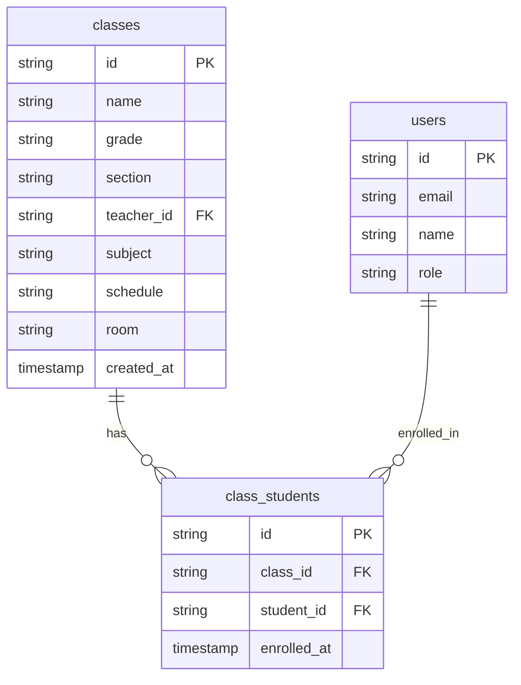
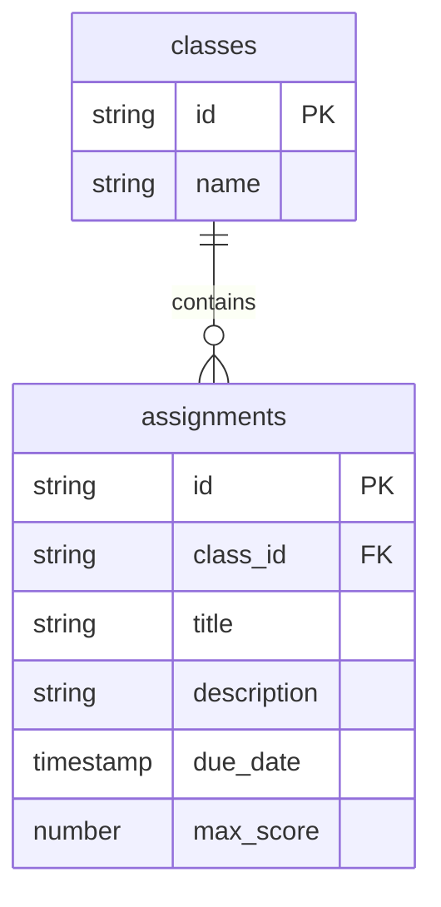
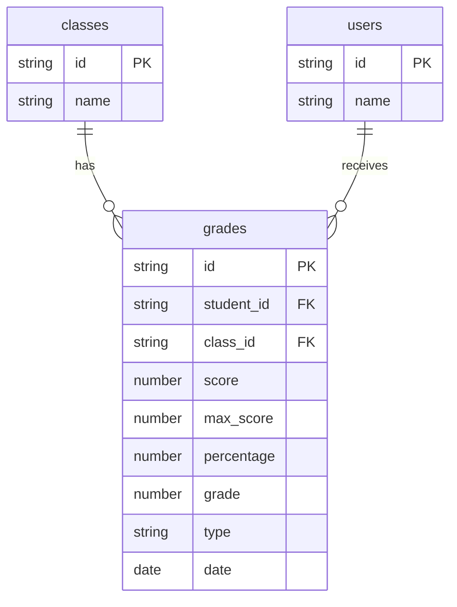
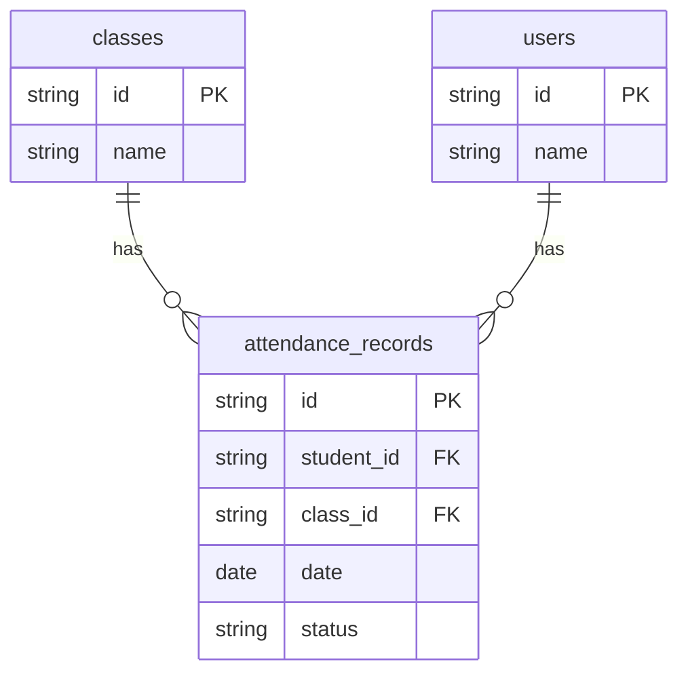
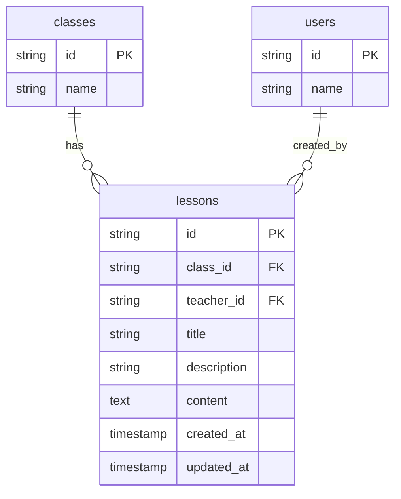
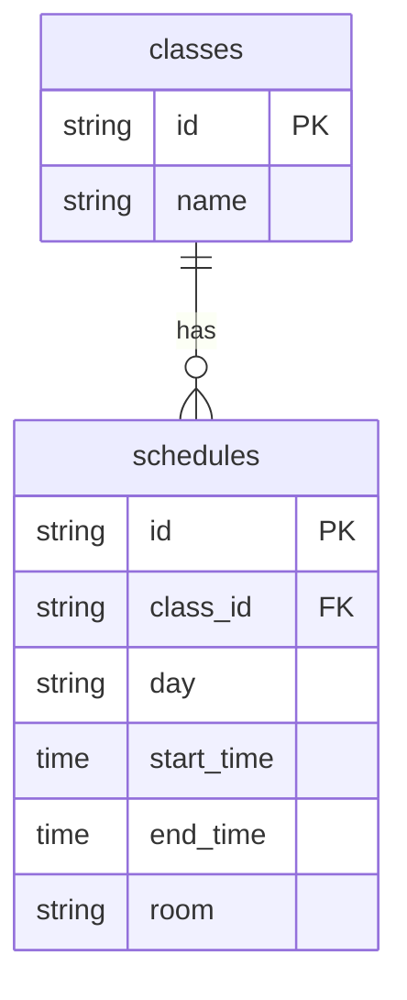

# Class Model

<cite>
**Referenced Files in This Document**   
- [types.ts](file://lib/supabase/types.ts#L114-L124)
- [database.types.ts](file://lib/database.types.ts#L17-L27)
- [20251219043440_create_classes_table.sql](file://supabase/migrations/20251219043440_create_classes_table.sql#L1-L11)
- [20251219043556_create_schedule_table.sql](file://supabase/migrations/20251219043556_create_schedule_table.sql#L1-L8)
- [validation-schemas.ts](file://lib/validation-schemas.ts#L70-L79)
- [teacher/my-classes/route.ts](file://app/api/teacher/my-classes/route.ts#L24-L28)
- [student/classes/route.ts](file://app/api/student/classes/route.ts#L13-L21)
- [admin/enroll-student/route.ts](file://app/api/admin/enroll-student/route.ts#L30-L33)
- [admin/unenroll-student/route.ts](file://app/api/admin/unenroll-student/route.ts#L30-L31)
- [teacher/grades/create/route.ts](file://app/api/teacher/grades/create/route.ts#L53-L63)
</cite>

## Table of Contents
1. [Introduction](#introduction)
2. [Field Definitions](#field-definitions)
3. [Primary and Foreign Key Constraints](#primary-and-foreign-key-constraints)
4. [Row Level Security (RLS) Policies](#row-level-security-rls-policies)
5. [Entity Relationships](#entity-relationships)
6. [Business Rules](#business-rules)
7. [Query Examples](#query-examples)
8. [Data Validation and Referential Integrity](#data-validation-and-referential-integrity)
9. [Conclusion](#conclusion)

## Introduction
The Class model in the School-Management-System serves as the central entity for organizing academic instruction, defining the structure of educational delivery within the institution. This model establishes the framework for teacher assignments, student enrollments, and academic scheduling. The Class model is designed to support the Philippine educational system's requirements, including DepEd compliance, while providing robust functionality for managing academic operations. This documentation provides a comprehensive overview of the Class model's structure, constraints, relationships, and business logic.

**Section sources**
- [types.ts](file://lib/supabase/types.ts#L114-L124)
- [20251219043440_create_classes_table.sql](file://supabase/migrations/20251219043440_create_classes_table.sql#L1-L11)

## Field Definitions
The Class model contains the following fields with their respective data types, constraints, and descriptions:

| Field | Data Type | Constraints | Description |
|-------|-----------|-----------|-------------|
| id | UUID | PRIMARY KEY, DEFAULT gen_random_uuid() | Unique identifier for the class |
| name | TEXT | NOT NULL | Human-readable name of the class (e.g., "Algebra II", "English Literature") |
| grade | TEXT | NOT NULL | Grade level of the class (e.g., "10", "11", "12") |
| section | TEXT | NOT NULL | Section designation within the grade level (e.g., "A", "B", "STEM") |
| teacher_id | UUID | REFERENCES users(id) ON DELETE SET NULL | Foreign key linking to the teacher assigned to this class |
| subject | TEXT | NOT NULL | Academic subject taught in this class |
| schedule | TEXT | NULLABLE | Text representation of the class schedule (deprecated in favor of schedules table) |
| room | TEXT | NULLABLE | Physical location where the class is held |
| created_at | TIMESTAMPTZ | DEFAULT NOW() | Timestamp when the class record was created |

The TypeScript interface `DbClass` from `lib/supabase/types.ts` defines the client-side representation of the Class model:

```typescript
export interface DbClass {
  id: string
  name: string
  grade: string
  section: string
  teacher_id: string | null
  subject: string
  schedule: string | null
  room: string | null
  created_at: string
}
```

**Section sources**
- [types.ts](file://lib/supabase/types.ts#L114-L124)
- [database.types.ts](file://lib/database.types.ts#L17-L27)
- [20251219043440_create_classes_table.sql](file://supabase/migrations/20251219043440_create_classes_table.sql#L1-L11)

## Primary and Foreign Key Constraints
The Class model implements the following key constraints to ensure data integrity:

### Primary Key
- **id**: The primary key constraint ensures each class has a unique identifier. The UUID data type with `gen_random_uuid()` default provides globally unique identifiers that prevent collisions and enhance security by avoiding predictable sequential IDs.

### Foreign Key
- **teacher_id**: This foreign key establishes a relationship with the `users` table, specifically linking to teacher accounts. The constraint `REFERENCES users(id) ON DELETE SET NULL` means that if a teacher account is deleted, the `teacher_id` field in the class record will be set to NULL rather than deleting the entire class. This preserves historical class data while indicating that no teacher is currently assigned.

The foreign key relationship ensures that only valid user IDs from the `users` table can be assigned as teachers, maintaining referential integrity across the system.

**Section sources**
- [20251219043440_create_classes_table.sql](file://supabase/migrations/20251219043440_create_classes_table.sql#L6)
- [database.types.ts](file://lib/database.types.ts#L17-L27)

## Row Level Security (RLS) Policies
The Class model implements Row Level Security (RLS) policies to control data access based on user roles and relationships. While the classes table itself doesn't have explicit RLS policies defined in the migration files, access is controlled through related tables and application logic:

- **Administrators**: Have full access to create, read, update, and delete class records through administrative interfaces.
- **Teachers**: Can only access classes where they are assigned as the teacher, as enforced by API endpoints like `/api/teacher/my-classes`.
- **Students**: Can only access classes in which they are enrolled, as determined by their records in the `class_students` junction table.
- **Parents**: Can access classes of their linked children through parent-specific API endpoints.

The RLS policies are implemented at the application level through API route protections and database queries that filter results based on the authenticated user's ID and role.

**Section sources**
- [20251219044036_add_rls_policies.sql](file://supabase/migrations/20251219044036_add_rls_policies.sql#L1-L22)
- [teacher/my-classes/route.ts](file://app/api/teacher/my-classes/route.ts#L24-L28)
- [student/classes/route.ts](file://app/api/student/classes/route.ts#L13-L21)

## Entity Relationships
The Class model serves as a central hub in the academic data model, connecting various educational entities through defined relationships.

### Class-Student Relationship
The relationship between classes and students is managed through the `class_students` junction table, which implements a many-to-many relationship:



**Diagram sources**
- [20251219043440_create_classes_table.sql](file://supabase/migrations/20251219043440_create_classes_table.sql#L13-L19)
- [types.ts](file://lib/supabase/types.ts#L114-L124)

### Class-Assignment Relationship
Classes are associated with assignments through the `assignments` table, where each assignment belongs to a specific class:



**Diagram sources**
- [database.types.ts](file://lib/database.types.ts#L157-L197)
- [types.ts](file://lib/supabase/types.ts#L114-L124)

### Class-Grade Relationship
The grading system connects classes with student performance through the `grades` table:



**Diagram sources**
- [20251219043509_create_grades_tables.sql](file://supabase/migrations/20251219043509_create_grades_tables.sql#L1-L12)
- [types.ts](file://lib/supabase/types.ts#L135-L146)

### Class-Attendance Relationship
Attendance records are linked to specific classes through the `attendance_records` table:



**Diagram sources**
- [database.types.ts](file://lib/database.types.ts#L214-L239)
- [types.ts](file://lib/supabase/types.ts#L126-L133)

### Class-Lesson Relationship
Educational content is organized through lessons associated with specific classes:



**Diagram sources**
- [types.ts](file://lib/supabase/types.ts#L181-L189)
- [database.types.ts](file://lib/database.types.ts#L214-L239)

### Class-Schedule Relationship
The schedule for classes is managed through a dedicated `schedules` table that provides detailed time and location information:



**Diagram sources**
- [20251219043556_create_schedule_table.sql](file://supabase/migrations/20251219043556_create_schedule_table.sql#L1-L8)
- [types.ts](file://lib/supabase/types.ts#L148-L155)

## Business Rules
The Class model enforces several business rules to maintain data consistency and support educational workflows:

### Teacher Assignment Rules
- Teachers can only be assigned to classes if they have the "teacher" role in the system
- A teacher can be assigned to multiple classes across different grades and subjects
- When a teacher is unassigned (teacher_id set to NULL), the class remains active but indicates no current instructor
- Teachers can only manage grades, attendance, and lessons for classes they are assigned to

### Class Naming Conventions
- Class names follow the format "[Subject] [Level]" (e.g., "Mathematics 10", "English 11")
- The combination of grade and section creates a unique identifier within a school year
- Subject names follow standardized academic terminology to ensure consistency across the system

### Section Management
- Sections are used to divide students within the same grade level
- Common section designations include alphabetical (A, B, C) or program-based (STEM, HUMSS, ABM)
- Each grade-section combination can have multiple classes for different subjects
- The system prevents duplicate class creation for the same grade, section, and subject combination

### Enrollment Business Rules
- Students can be enrolled in multiple classes across different subjects
- Enrollment is managed by administrators through the `/api/admin/enroll-student` endpoint
- Students can only be unenrolled by administrators through the `/api/admin/unenroll-student` endpoint
- The system verifies that a student is enrolled in a class before allowing grade or attendance records to be created

**Section sources**
- [validation-schemas.ts](file://lib/validation-schemas.ts#L70-L79)
- [admin/enroll-student/route.ts](file://app/api/admin/enroll-student/route.ts#L30-L33)
- [admin/unenroll-student/route.ts](file://app/api/admin/unenroll-student/route.ts#L30-L31)
- [teacher/grades/create/route.ts](file://app/api/teacher/grades/create/route.ts#L53-L63)

## Query Examples
The following are examples of common queries for retrieving class-related data:

### Retrieve Teacher's Classes
```sql
SELECT id, name, grade, section, subject, room, created_at 
FROM classes 
WHERE teacher_id = 'user-uuid-here' 
ORDER BY name;
```

This query is implemented in the `/api/teacher/my-classes` endpoint to display a teacher's assigned classes.

**Section sources**
- [teacher/my-classes/route.ts](file://app/api/teacher/my-classes/route.ts#L24-L28)

### Retrieve Student Enrollments
```sql
SELECT 
  c.id,
  c.name,
  c.subject,
  c.schedule,
  c.room,
  u.name as teacher_name,
  u.avatar as teacher_avatar,
  COUNT(cs.student_id) as student_count
FROM class_students cs
JOIN classes c ON cs.class_id = c.id
LEFT JOIN users u ON c.teacher_id = u.id
WHERE cs.student_id = 'student-uuid-here'
GROUP BY c.id, u.id;
```

This query is implemented in the `/api/student/classes` endpoint to show a student's enrolled classes with teacher information and class size.

**Section sources**
- [student/classes/route.ts](file://app/api/student/classes/route.ts#L13-L21)

### Retrieve Class Schedule
```sql
SELECT 
  s.day,
  s.start_time,
  s.end_time,
  s.room,
  c.name as class_name,
  c.subject,
  u.name as teacher_name
FROM schedules s
JOIN classes c ON s.class_id = c.id
JOIN users u ON c.teacher_id = u.id
WHERE c.id = 'class-uuid-here'
ORDER BY 
  CASE s.day 
    WHEN 'Monday' THEN 1 
    WHEN 'Tuesday' THEN 2 
    WHEN 'Wednesday' THEN 3 
    WHEN 'Thursday' THEN 4 
    WHEN 'Friday' THEN 5 
    WHEN 'Saturday' THEN 6 
    WHEN 'Sunday' THEN 7 
  END,
  s.start_time;
```

This query retrieves the detailed weekly schedule for a specific class, ordered by day of the week and start time.

### Find Available Classes for Enrollment
```sql
SELECT 
  c.id,
  c.name,
  c.grade,
  c.section,
  c.subject,
  c.room,
  u.name as teacher_name,
  COUNT(cs.student_id) as current_enrollment
FROM classes c
LEFT JOIN users u ON c.teacher_id = u.id
LEFT JOIN class_students cs ON c.id = cs.class_id
WHERE c.id NOT IN (
  SELECT class_id 
  FROM class_students 
  WHERE student_id = 'student-uuid-here'
)
GROUP BY c.id, u.id
ORDER BY c.grade, c.section, c.subject;
```

This query identifies classes a student is not already enrolled in, used in the student enrollment interface.

## Data Validation and Referential Integrity
The Class model implements multiple layers of data validation and referential integrity constraints:

### Database-Level Constraints
- **NOT NULL constraints**: The name, grade, section, and subject fields are required, ensuring every class has essential identifying information
- **Foreign key constraints**: The teacher_id field references the users table, preventing orphaned records and ensuring only valid teachers can be assigned
- **ON DELETE SET NULL**: When a teacher account is deleted, the class record is preserved with a NULL teacher_id, maintaining historical data integrity
- **UUID primary keys**: Using UUIDs prevents ID prediction and ensures global uniqueness across distributed systems

### Application-Level Validation
The system implements additional validation through Zod schemas in `lib/validation-schemas.ts`:

```typescript
export const createClassSchema = z.object({
  name: z.string().min(1).max(100),
  grade: z.string().max(20),
  section: z.string().max(20),
  subject: z.string().max(100),
  teacher_id: z.string().uuid(),
  room: z.string().max(50).optional(),
  scheduleDays: z.array(z.string()).optional(),
  scheduleTime: z.string().optional(),
})
```

This schema enforces:
- Name, grade, section, and subject are required strings
- Maximum length constraints to prevent excessively long values
- UUID format validation for teacher_id
- Optional room field with length limitation
- Additional schedule fields for multi-day scheduling

### Referential Integrity Enforcement
The system maintains referential integrity through:
- Transactional operations when creating classes and assigning teachers
- Validation in API endpoints that verify teacher role before assignment
- Cascading deletes for related records (e.g., when a class is deleted, associated grades, attendance, and schedule records are also removed)
- Count queries to display accurate enrollment numbers while preventing race conditions

**Section sources**
- [validation-schemas.ts](file://lib/validation-schemas.ts#L70-L79)
- [20251219043440_create_classes_table.sql](file://supabase/migrations/20251219043440_create_classes_table.sql#L1-L11)
- [database.types.ts](file://lib/database.types.ts#L17-L27)

## Conclusion
The Class model in the School-Management-System provides a robust foundation for organizing academic instruction, with comprehensive field definitions, strict data integrity constraints, and well-defined relationships with other educational entities. The model supports the complete lifecycle of class management, from creation and teacher assignment to student enrollment and academic record keeping. Through a combination of database-level constraints, application-level validation, and role-based access control, the system ensures data accuracy and security while providing the flexibility needed for diverse educational workflows. The separation of schedule information into a dedicated table allows for complex timetabling scenarios while maintaining clean data organization. This comprehensive approach enables the system to effectively support the operational needs of educational institutions while ensuring compliance with data governance requirements.