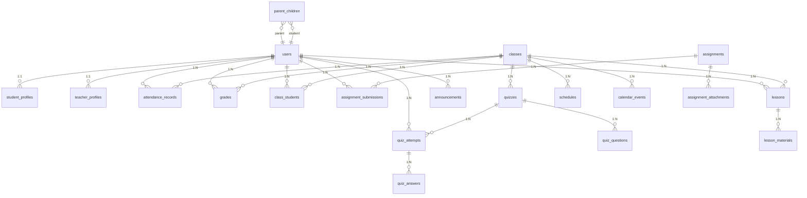

# Data Models

<cite>
**Referenced Files in This Document**   
- [20251219043432_create_users_table.sql](file://supabase/migrations/20251219043432_create_users_table.sql)
- [20251219043440_create_classes_table.sql](file://supabase/migrations/20251219043440_create_classes_table.sql)
- [20251219043454_create_attendance_tables.sql](file://supabase/migrations/20251219043454_create_attendance_tables.sql)
- [20251219043509_create_grades_tables.sql](file://supabase/migrations/20251219043509_create_grades_tables.sql)
- [20251219043525_create_quizzes_tables.sql](file://supabase/migrations/20251219043525_create_quizzes_tables.sql)
- [20251219043541_create_lessons_tables.sql](file://supabase/migrations/20251219043541_create_lessons_tables.sql)
- [20251219043556_create_schedule_table.sql](file://supabase/migrations/20251219043556_create_schedule_table.sql)
- [20260105082250_create_parent_tables.sql](file://supabase/migrations/20260105082250_create_parent_tables.sql)
- [20260105000001_create_assignments_table.sql](file://supabase/migrations/20260105000001_create_assignments_table.sql)
- [20260105000002_create_calendar_events_table.sql](file://supabase/migrations/20260105000002_create_calendar_events_table.sql)
- [20251219060333_add_deped_student_profile_fields.sql](file://supabase/migrations/20251219060333_add_deped_student_profile_fields.sql)
- [20251219044036_add_rls_policies.sql](file://supabase/migrations/20251219044036_add_rls_policies.sql)
- [20251219082305_add_write_policies.sql](file://supabase/migrations/20251219082305_add_write_policies.sql)
- [20251219103038_add_class_students_rls_policies.sql](file://supabase/migrations/20251219103038_add_class_students_rls_policies.sql)
- [20251219121643_add_student_attendance_insert_policy.sql](file://supabase/migrations/20251219121643_add_student_attendance_insert_policy.sql)
- [20251219113726_add_quiz_attempts_update_policy.sql](file://supabase/migrations/20251219113726_add_quiz_attempts_update_policy.sql)
- [20251219105807_add_student_quiz_grade_insert_policy.sql](file://supabase/migrations/20251219105807_add_student_quiz_grade_insert_policy.sql)
- [20260105082250_create_parent_tables.sql](file://supabase/migrations/20260105082250_create_parent_tables.sql)
- [types.ts](file://lib/supabase/types.ts)
- [database.types.ts](file://lib/database.types.ts)
</cite>

## Table of Contents
1. [Introduction](#introduction)
2. [Entity Relationship Diagram](#entity-relationship-diagram)
3. [Users](#users)
4. [Classes](#classes)
5. [Attendance](#attendance)
6. [Grades](#grades)
7. [Assignments](#assignments)
8. [Lessons](#lessons)
9. [Schedule](#schedule)
10. [Parent-Child Relationships](#parent-child-relationships)
11. [Calendar Events](#calendar-events)
12. [Data Lifecycle and Retention](#data-lifecycle-and-retention)
13. [Type Definitions](#type-definitions)
14. [Data Migration and Version Management](#data-migration-and-version-management)

## Introduction
This document provides comprehensive documentation of the database schema for the School-Management-System. The system is designed to manage educational data for students, teachers, and administrators, with a focus on compliance with DepEd (Department of Education) requirements in the Philippines. The database schema includes entities for users, classes, attendance, grades, assignments, lessons, schedules, and parent-child relationships, with robust Row Level Security (RLS) policies to ensure data privacy and security.

The system is built on Supabase, leveraging PostgreSQL as the underlying database with Row Level Security for fine-grained access control. All data access is governed by RLS policies that enforce business rules at the database level, ensuring that users can only access data they are authorized to view or modify.

**Section sources**
- [20251219043432_create_users_table.sql](file://supabase/migrations/20251219043432_create_users_table.sql)
- [20251219043440_create_classes_table.sql](file://supabase/migrations/20251219043440_create_classes_table.sql)
- [20251219043454_create_attendance_tables.sql](file://supabase/migrations/20251219043454_create_attendance_tables.sql)

## Entity Relationship Diagram

**Diagram sources**
- [20251219043432_create_users_table.sql](file://supabase/migrations/20251219043432_create_users_table.sql)
- [20251219043440_create_classes_table.sql](file://supabase/migrations/20251219043440_create_classes_table.sql)
- [20251219043454_create_attendance_tables.sql](file://supabase/migrations/20251219043454_create_attendance_tables.sql)
- [20251219043509_create_grades_tables.sql](file://supabase/migrations/20251219043509_create_grades_tables.sql)
- [20251219043525_create_quizzes_tables.sql](file://supabase/migrations/20251219043525_create_quizzes_tables.sql)
- [20251219043541_create_lessons_tables.sql](file://supabase/migrations/20251219043541_create_lessons_tables.sql)
- [20251219043556_create_schedule_table.sql](file://supabase/migrations/20251219043556_create_schedule_table.sql)
- [20260105000001_create_assignments_table.sql](file://supabase/migrations/20260105000001_create_assignments_table.sql)
- [20260105082250_create_parent_tables.sql](file://supabase/migrations/20260105082250_create_parent_tables.sql)

## Users

The Users entity represents all individuals in the school system, including administrators, teachers, students, and parents. The system uses a role-based access control model with distinct profile tables for different user types.

### Field Definitions
- **id**: UUID - Primary key, default generated UUID
- **email**: TEXT - Unique identifier, not null
- **name**: TEXT - Full name of the user, not null
- **role**: TEXT - User role with constraint: 'admin', 'teacher', 'student', 'parent'
- **avatar**: TEXT - URL to avatar image
- **phone**: TEXT - Contact phone number
- **address**: TEXT - Physical address
- **is_active**: BOOLEAN - Account status (added in later migration)
- **must_change_password**: BOOLEAN - Password reset requirement flag
- **created_at**: TIMESTAMPTZ - Record creation timestamp
- **updated_at**: TIMESTAMPTZ - Record update timestamp

### User Profiles
The system implements a polymorphic user profile pattern with separate tables for different user types:

**Student Profiles** (`student_profiles`):
- Extends user with academic and demographic information
- Includes DepEd-compliant fields for Learner Information System
- Contains LRN (Learner Reference Number) with unique constraint when present

**Teacher Profiles** (`teacher_profiles`):
- Extends user with teaching-specific information
- Includes subject specialization and department

### Business Rules and Validation
- Email uniqueness enforced at database level
- Role constrained to predefined values
- Users can only read, update, and delete their own records
- Admin users have elevated privileges for user management
- Student profiles require LRN validation and uniqueness when provided

### Row Level Security Policies
- **Read Policy**: Users can read their own data
- **Insert Policy**: Authenticated users can insert their own record; anonymous users can insert for signup flow
- **Update Policy**: Users can update their own data
- **Admin Override**: Admin users can manage all user records

**Section sources**
- [20251219043432_create_users_table.sql](file://supabase/migrations/20251219043432_create_users_table.sql)
- [20251219060333_add_deped_student_profile_fields.sql](file://supabase/migrations/20251219060333_add_deped_student_profile_fields.sql)
- [20251219044036_add_rls_policies.sql](file://supabase/migrations/20251219044036_add_rls_policies.sql)
- [20251219052436_fix_users_insert_policy.sql](file://supabase/migrations/20251219052436_fix_users_insert_policy.sql)

## Classes

The Classes entity represents academic classes or subjects taught in the school. Each class is associated with a teacher and multiple students.

### Field Definitions
- **id**: UUID - Primary key, default generated UUID
- **name**: TEXT - Class name, not null
- **grade**: TEXT - Grade level, not null
- **section**: TEXT - Section identifier, not null
- **teacher_id**: UUID - Foreign key to users table, references teacher
- **subject**: TEXT - Subject name, not null
- **schedule**: TEXT - Human-readable schedule description
- **room**: TEXT - Classroom location
- **created_at**: TIMESTAMPTZ - Record creation timestamp

### Relationships
- **One-to-Many**: One teacher can teach multiple classes
- **Many-to-Many**: Classes and students connected through `class_students` junction table
- **One-to-Many**: One class has multiple attendance records, grades, quizzes, lessons, and schedules

### Business Rules and Validation
- Teacher-student referential integrity maintained with ON DELETE SET NULL for teacher, ON DELETE CASCADE for students
- Class name, grade, section, and subject are required fields
- Composite index on grade and section for efficient querying

### Row Level Security Policies
- **Read Policy**: Students can read classes they are enrolled in; teachers can read classes they teach; admins can read all classes
- **Insert Policy**: Admins and authorized staff can create classes
- **Update Policy**: Teachers and admins can update class information
- **Delete Policy**: Admins can delete classes

**Section sources**
- [20251219043440_create_classes_table.sql](file://supabase/migrations/20251219043440_create_classes_table.sql)
- [20251219103038_add_class_students_rls_policies.sql](file://supabase/migrations/20251219103038_add_class_students_rls_policies.sql)

## Attendance

The Attendance system tracks student attendance through multiple mechanisms, including manual entry and QR code-based check-in.

### Core Tables
**attendance_records**:
- **id**: UUID - Primary key
- **student_id**: UUID - Foreign key to users table
- **class_id**: UUID - Foreign key to classes table
- **date**: DATE - Attendance date
- **status**: TEXT - Enum: 'present', 'absent', 'late', 'excused'
- **created_at**: TIMESTAMPTZ - Record creation timestamp

**qr_attendance_sessions**:
- **id**: UUID - Primary key
- **class_id**: UUID - Foreign key to classes table
- **teacher_id**: UUID - Foreign key to users table
- **date**: DATE - Session date
- **start_time**: TIME - Session start time
- **end_time**: TIME - Session end time
- **qr_code**: TEXT - Unique QR code for the session
- **status**: TEXT - 'active' or 'expired'
- **require_location**: BOOLEAN - Whether location verification is required

**qr_checkins**:
- **id**: UUID - Primary key
- **session_id**: UUID - Foreign key to qr_attendance_sessions
- **student_id**: UUID - Foreign key to users table
- **checked_in_at**: TIMESTAMPTZ - Timestamp of check-in
- **location_verified**: BOOLEAN - Whether location was verified

### Business Rules and Validation
- Unique constraint on (class_id, student_id, date) prevents duplicate attendance records
- Status constrained to predefined values
- QR code must be unique across all sessions
- Location verification required when specified in session settings
- Check-in timestamp automatically recorded

### Row Level Security Policies
- **Students**: Can view their own attendance records and check-in to active sessions
- **Teachers**: Can view attendance for their classes and manage QR sessions
- **Parents**: Can view attendance records for their children
- **Admins**: Can view and manage all attendance data

**Section sources**
- [20251219043454_create_attendance_tables.sql](file://supabase/migrations/20251219043454_create_attendance_tables.sql)
- [20251219121643_add_student_attendance_insert_policy.sql](file://supabase/migrations/20251219121643_add_student_attendance_insert_policy.sql)
- [20251219121408_add_attendance_unique_constraint.sql](file://supabase/migrations/20251219121408_add_attendance_unique_constraint.sql)

## Grades

The Grades system manages student academic performance across various assessment types.

### Core Tables
**grades**:
- **id**: UUID - Primary key
- **student_id**: UUID - Foreign key to users table
- **class_id**: UUID - Foreign key to classes table
- **score**: NUMERIC - Student's score
- **max_score**: NUMERIC - Maximum possible score (default: 100)
- **percentage**: NUMERIC - Calculated percentage
- **grade**: NUMERIC - Final grade value
- **type**: TEXT - Assessment type: 'exam', 'quiz', 'assignment', 'project'
- **date**: DATE - Assessment date
- **created_at**: TIMESTAMPTZ - Record creation timestamp

**grade_weights**:
- **id**: UUID - Primary key
- **class_id**: UUID - Foreign key to classes table
- **quiz_weight**: NUMERIC - Weight for quizzes (default: 30)
- **exam_weight**: NUMERIC - Weight for exams (default: 35)
- **assignment_weight**: NUMERIC - Weight for assignments (default: 20)
- **project_weight**: NUMERIC - Weight for projects (default: 15)

**grade_history**:
- **id**: UUID - Primary key
- **student_id**: UUID - Foreign key to users table
- **school_year**: TEXT - Academic year
- **grade_level**: TEXT - Grade level
- **general_average**: NUMERIC - Overall average
- **remarks**: TEXT - Academic remarks
- **promoted_date**: DATE - Date of promotion
- **created_at**: TIMESTAMPTZ - Record creation timestamp

**grade_history_subjects**:
- **id**: UUID - Primary key
- **grade_history_id**: UUID - Foreign key to grade_history
- **subject**: TEXT - Subject name
- **final_grade**: NUMERIC - Final grade for subject
- **remarks**: TEXT - Subject-specific remarks

### Business Rules and Validation
- Grade calculation follows weighted average based on class-specific weights
- Percentage calculated as (score / max_score) * 100
- Final grade derived from percentage using standard grading scale
- Unique constraint on class_id in grade_weights ensures one weight configuration per class
- Grade history maintained for academic record keeping

### Row Level Security Policies
- **Students**: Can view their own grades and grade history
- **Parents**: Can view grades for their children
- **Teachers**: Can view and enter grades for their classes
- **Admins**: Can view and manage all grade data

**Section sources**
- [20251219043509_create_grades_tables.sql](file://supabase/migrations/20251219043509_create_grades_tables.sql)
- [20251219105807_add_student_quiz_grade_insert_policy.sql](file://supabase/migrations/20251219105807_add_student_quiz_grade_insert_policy.sql)

## Assignments

The Assignments system manages academic tasks assigned to students, including submission and grading workflows.

### Core Tables
**assignments**:
- **id**: UUID - Primary key
- **title**: TEXT - Assignment title, not null
- **description**: TEXT - Assignment details
- **class_id**: UUID - Foreign key to classes table
- **teacher_id**: UUID - Foreign key to users table
- **due_date**: DATE - Deadline, not null
- **max_score**: INTEGER - Maximum possible score (default: 100)
- **allow_late_submission**: BOOLEAN - Whether late submissions are accepted (default: true)
- **status**: TEXT - 'draft', 'published', 'closed'
- **created_at**: TIMESTAMPTZ - Creation timestamp
- **updated_at**: TIMESTAMPTZ - Update timestamp

**assignment_attachments**:
- **id**: UUID - Primary key
- **assignment_id**: UUID - Foreign key to assignments
- **name**: TEXT - Attachment name, not null
- **type**: TEXT - 'pdf', 'document', 'image', 'link'
- **url**: TEXT - File URL, not null
- **size**: TEXT - File size
- **created_at**: TIMESTAMPTZ - Creation timestamp

**assignment_submissions**:
- **id**: UUID - Primary key
- **assignment_id**: UUID - Foreign key to assignments
- **student_id**: UUID - Foreign key to users table
- **submitted_at**: TIMESTAMPTZ - Submission timestamp
- **status**: TEXT - 'pending', 'submitted', 'graded', 'late'
- **comment**: TEXT - Student comment
- **score**: INTEGER - Graded score
- **feedback**: TEXT - Teacher feedback
- **graded_at**: TIMESTAMPTZ - Grading timestamp
- **graded_by**: UUID - Foreign key to users table (teacher)
- **Unique constraint**: (assignment_id, student_id)

**submission_files**:
- **id**: UUID - Primary key
- **submission_id**: UUID - Foreign key to assignment_submissions
- **name**: TEXT - File name, not null
- **type**: TEXT - File type
- **url**: TEXT - File URL, not null
- **size**: TEXT - File size
- **created_at**: TIMESTAMPTZ - Creation timestamp

### Business Rules and Validation
- Students can only submit assignments for classes they are enrolled in
- Late submission status automatically applied if submitted after due date
- Only one submission allowed per student per assignment
- Teachers can only grade assignments for classes they teach
- File attachments have size limits and MIME type restrictions

### Row Level Security Policies
- **Students**: Can view published assignments for their classes and submit their work
- **Teachers**: Can manage assignments for their classes and grade submissions
- **Admins**: Can view and manage all assignment data

**Section sources**
- [20260105000001_create_assignments_table.sql](file://supabase/migrations/20260105000001_create_assignments_table.sql)

## Lessons

The Lessons system manages instructional content and materials for classes.

### Core Tables
**lessons**:
- **id**: UUID - Primary key
- **title**: TEXT - Lesson title, not null
- **class_id**: UUID - Foreign key to classes table
- **teacher_id**: UUID - Foreign key to users table
- **description**: TEXT - Lesson description
- **content**: TEXT - Main lesson content
- **created_at**: TIMESTAMPTZ - Creation timestamp
- **updated_at**: TIMESTAMPTZ - Update timestamp

**lesson_materials**:
- **id**: UUID - Primary key
- **lesson_id**: UUID - Foreign key to lessons table
- **name**: TEXT - Material name, not null
- **type**: TEXT - 'pdf', 'video', 'link', 'document'
- **url**: TEXT - Material URL, not null
- **size**: TEXT - File size

### Business Rules and Validation
- Lessons are created by teachers for specific classes
- Multiple materials can be associated with a single lesson
- Material types restricted to approved categories
- URLs validated for accessibility

### Row Level Security Policies
- **Students**: Can view lessons for classes they are enrolled in
- **Teachers**: Can manage lessons for classes they teach
- **Admins**: Can view all lesson content

**Section sources**
- [20251219043541_create_lessons_tables.sql](file://supabase/migrations/20251219043541_create_lessons_tables.sql)

## Schedule

The Schedule system manages class timetables and recurring class sessions.

### Field Definitions
- **id**: UUID - Primary key
- **class_id**: UUID - Foreign key to classes table
- **day**: TEXT - Day of week: 'Monday' through 'Sunday'
- **start_time**: TIME - Class start time, not null
- **end_time**: TIME - Class end time, not null
- **room**: TEXT - Classroom location

### Business Rules and Validation
- Day constrained to valid weekdays
- Time constraints ensure end_time is after start_time
- Composite index on class_id and day for efficient scheduling queries
- Multiple sessions allowed per class on different days

### Row Level Security Policies
- **Students**: Can view schedules for classes they are enrolled in
- **Teachers**: Can view schedules for classes they teach
- **Admins**: Can manage all schedule data

**Section sources**
- [20251219043556_create_schedule_table.sql](file://supabase/migrations/20251219043556_create_schedule_table.sql)

## Parent-Child Relationships

The Parent-Child Relationships system manages family connections between parent users and student users.

### Field Definitions
- **id**: UUID - Primary key
- **parent_id**: UUID - Foreign key to users table (parent role)
- **student_id**: UUID - Foreign key to users table (student role)
- **relationship**: TEXT - 'mother', 'father', 'guardian', 'other'
- **created_at**: TIMESTAMPTZ - Record creation timestamp
- **Unique constraint**: (parent_id, student_id)

### Business Rules and Validation
- Users table role constraint updated to include 'parent' role
- Each parent-student relationship is unique
- Multiple parents can be linked to a single student
- A parent can have multiple children in the system

### Row Level Security Policies
- **Parents**: Can view their own children and their children's academic data
- **Students**: Cannot view parent relationships
- **Admins**: Can manage all parent-child relationships

**Section sources**
- [20260105082250_create_parent_tables.sql](file://supabase/migrations/20260105082250_create_parent_tables.sql)

## Calendar Events

The Calendar Events system manages academic and administrative events across the school.

### Field Definitions
- **id**: UUID - Primary key
- **title**: TEXT - Event title, not null
- **description**: TEXT - Event details
- **type**: TEXT - 'class', 'quiz', 'assignment', 'exam', 'holiday', 'meeting', 'other'
- **start_date**: DATE - Event start date, not null
- **end_date**: DATE - Event end date
- **start_time**: TIME - Event start time
- **end_time**: TIME - Event end time
- **all_day**: BOOLEAN - Whether event spans entire day
- **location**: TEXT - Event location
- **class_id**: UUID - Foreign key to classes table
- **created_by**: UUID - Foreign key to users table
- **target_audience**: TEXT - 'all', 'students', 'teachers', 'class', 'personal'
- **color**: TEXT - Visual color for calendar display
- **created_at**: TIMESTAMPTZ - Creation timestamp
- **updated_at**: TIMESTAMPTZ - Update timestamp

### Business Rules and Validation
- Events can be targeted to specific audiences
- Class events are visible to all students and teachers in the class
- Personal events are only visible to the creator
- Recurring events handled at application level

### Row Level Security Policies
- **Users**: Can view events targeted to their role or class
- **Users**: Can create, update, and delete their own events
- **Admins**: Can manage all events

**Section sources**
- [20260105000002_create_calendar_events_table.sql](file://supabase/migrations/20260105000002_create_calendar_events_table.sql)

## Data Lifecycle and Retention

The system implements data lifecycle management policies to ensure data integrity and compliance.

### Data Retention Policies
- **Active Data**: All current academic year data is maintained with full functionality
- **Historical Data**: Previous academic years are archived but accessible for reporting
- **Deleted Data**: Soft deletion pattern used where appropriate, with hard deletion following privacy regulations

### Archival Rules
- End-of-year processing moves completed academic records to historical storage
- Student records are maintained for statutory retention periods
- Audit logs are retained for compliance and security monitoring

### Data Integrity
- Foreign key constraints ensure referential integrity
- Check constraints enforce domain validity
- Unique constraints prevent duplicate records
- NOT NULL constraints ensure required data is present

**Section sources**
- [20251219043432_create_users_table.sql](file://supabase/migrations/20251219043432_create_users_table.sql)
- [20251219043440_create_classes_table.sql](file://supabase/migrations/20251219043440_create_classes_table.sql)
- [20251219043454_create_attendance_tables.sql](file://supabase/migrations/20251219043454_create_attendance_tables.sql)

## Type Definitions

The system provides TypeScript interfaces that mirror the database schema for type-safe development.

### Supabase Types
The `lib/supabase/types.ts` file contains interfaces that correspond to database tables:

- **DbUser**: Interface for users table with role type safety
- **DbStudentProfile**: Comprehensive interface for student profiles with DepEd fields
- **DbTeacherProfile**: Interface for teacher profiles
- **DbClass**: Interface for classes table
- **DbAttendanceRecord**: Interface for attendance records
- **DbGrade**: Interface for grades table with assessment type safety
- **DbSchedule**: Interface for schedule table
- **DbQuiz**: Interface for quizzes table
- **DbLesson**: Interface for lessons table
- **DbAnnouncement**: Interface for announcements
- **DbNotification**: Interface for notifications
- **DbQrAttendanceSession**: Interface for QR attendance sessions
- **DbSchoolSettings**: Interface for school settings

### Database Types
The `lib/database.types.ts` file provides comprehensive type definitions for the entire database schema, including:

- **Tables**: Row, Insert, and Update types for all tables
- **Relationships**: Foreign key relationships with referenced tables and columns
- **Functions**: Type signatures for database functions
- **Enums**: Type definitions for database enum-like constraints

These type definitions enable compile-time type checking and autocompletion in the application code, reducing errors and improving developer productivity.

**Section sources**
- [types.ts](file://lib/supabase/types.ts)
- [database.types.ts](file://lib/database.types.ts)

## Data Migration and Version Management

The system uses a structured migration approach to manage database schema evolution.

### Migration Strategy
- **Sequential Numbering**: Migrations named with timestamps for chronological ordering
- **Atomic Changes**: Each migration represents a single logical change
- **Reversible Operations**: Migrations designed to be reversible where possible
- **Data Preservation**: Migrations include data transformation logic when schema changes affect existing data

### Version Management
- **Migration Files**: Stored in `supabase/migrations` directory
- **Migration Tracking**: Supabase tracks applied migrations in the database
- **Rollback Capability**: System supports migration rollback for error recovery
- **Environment Synchronization**: Development, staging, and production environments kept in sync

### Migration Examples
- **User Table Evolution**: Initial creation followed by incremental additions (is_active, must_change_password)
- **Student Profile Expansion**: Base profile extended with DepEd-compliant fields in separate migration
- **Role Expansion**: User roles expanded to include 'parent' role with schema modification
- **Policy Refinement**: RLS policies iteratively improved for security and functionality

This approach ensures database schema changes are tracked, versioned, and can be reliably deployed across environments.

**Section sources**
- [20251219043432_create_users_table.sql](file://supabase/migrations/20251219043432_create_users_table.sql)
- [20251219060333_add_deped_student_profile_fields.sql](file://supabase/migrations/20251219060333_add_deped_student_profile_fields.sql)
- [20260105082250_create_parent_tables.sql](file://supabase/migrations/20260105082250_create_parent_tables.sql)