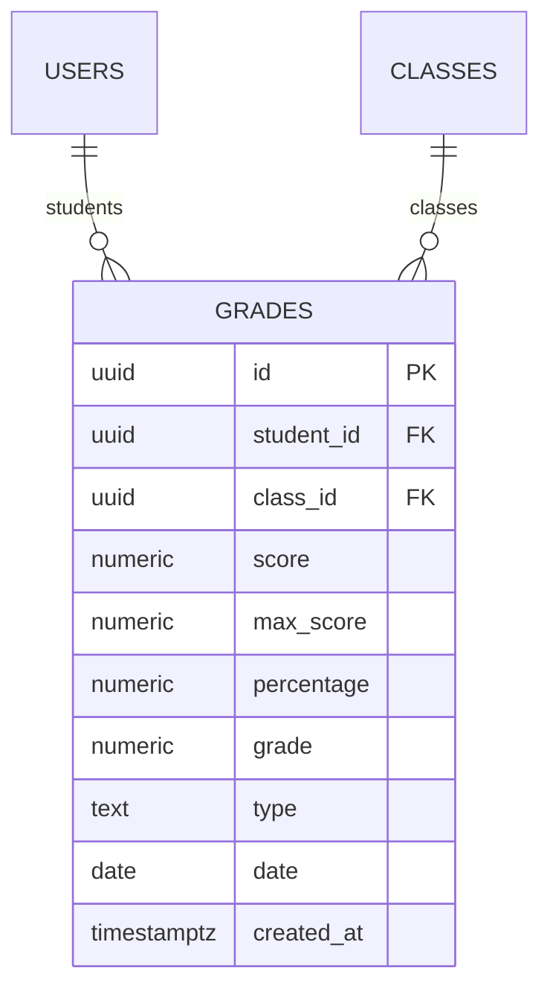
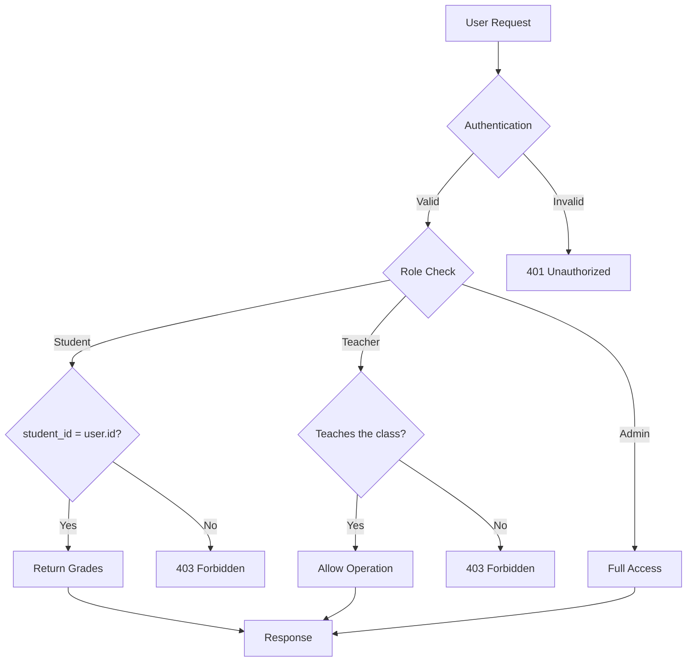
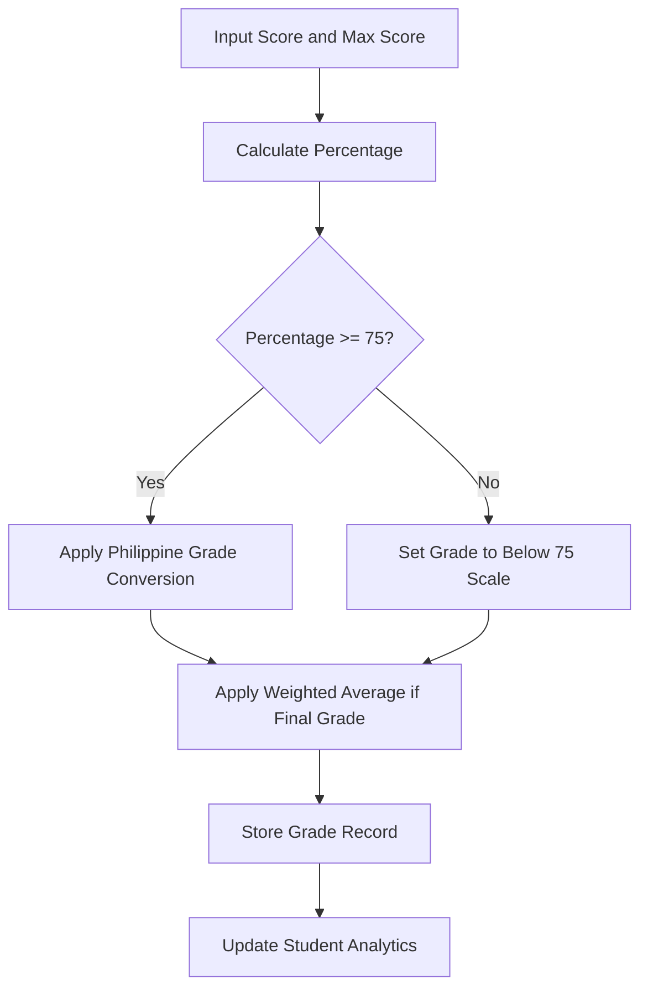

# Grade Model

<cite>
**Referenced Files in This Document**   
- [20251219043509_create_grades_tables.sql](file://supabase/migrations/20251219043509_create_grades_tables.sql)
- [types.ts](file://lib/supabase/types.ts)
- [database.types.ts](file://lib/database.types.ts)
- [grade-utils.ts](file://lib/grade-utils.ts)
- [grade-weights-store.ts](file://lib/grade-weights-store.ts)
- [grade-history-store.ts](file://lib/grade-history-store.ts)
- [20251219044036_add_rls_policies.sql](file://supabase/migrations/20251219044036_add_rls_policies.sql)
- [20251219082251_fix_all_rls_policies_v2.sql](file://supabase/migrations/20251219082251_fix_all_rls_policies_v2.sql)
- [create/route.ts](file://app/api/teacher/grades/create/route.ts)
- [route.ts](file://app/api/student/grades/route.ts)
</cite>

## Table of Contents
1. [Introduction](#introduction)
2. [Field Definitions](#field-definitions)
3. [Primary and Foreign Key Relationships](#primary-and-foreign-key-relationships)
4. [Row Level Security (RLS) Policies](#row-level-security-rls-policies)
5. [Relationships with Other Entities](#relationships-with-other-entities)
6. [Business Rules for Grade Calculation](#business-rules-for-grade-calculation)
7. [TypeScript Interface and Database Schema](#typescript-interface-and-database-schema)
8. [Query Examples](#query-examples)
9. [Data Validation and Audit Requirements](#data-validation-and-audit-requirements)
10. [Conclusion](#conclusion)

## Introduction
The Grade model in the School-Management-System is a central component for tracking student academic performance across various assessment types. This document provides comprehensive documentation of the Grade model, detailing its structure, relationships, security policies, and business logic. The model supports key educational workflows including grade entry, calculation, reporting, and historical tracking, with specific implementation for the Philippine grading system.

**Section sources**
- [20251219043509_create_grades_tables.sql](file://supabase/migrations/20251219043509_create_grades_tables.sql)
- [types.ts](file://lib/supabase/types.ts)

## Field Definitions
The Grade model contains the following fields with their respective data types and constraints:

- **id**: UUID - Primary key with default generation using gen_random_uuid()
- **student_id**: UUID - Foreign key referencing users(id) with ON DELETE CASCADE constraint
- **class_id**: UUID - Foreign key referencing classes(id) with ON DELETE CASCADE constraint
- **score**: NUMERIC - The raw score achieved by the student, required field
- **max_score**: NUMERIC - The maximum possible score, required with default value of 100
- **percentage**: NUMERIC - The percentage score calculated as (score/max_score) * 100, required field
- **grade**: NUMERIC - The converted Philippine grade (75-100 scale), required field
- **type**: TEXT - The assessment type with constraint CHECK (type IN ('exam', 'quiz', 'assignment', 'project')), required field
- **date**: DATE - The date when the assessment was conducted, required field
- **created_at**: TIMESTAMPTZ - Timestamp of record creation with default value of NOW()

The model enforces data integrity through NOT NULL constraints on all critical fields and uses appropriate data types to ensure precision in grade calculations.



**Diagram sources**
- [20251219043509_create_grades_tables.sql](file://supabase/migrations/20251219043509_create_grades_tables.sql)

**Section sources**
- [20251219043509_create_grades_tables.sql](file://supabase/migrations/20251219043509_create_grades_tables.sql)

## Primary and Foreign Key Relationships
The Grade model implements the following key relationships:

- **Primary Key**: The `id` field serves as the primary key, uniquely identifying each grade record with a UUID.
- **Foreign Key to Users**: The `student_id` field references the `id` column in the users table, establishing the relationship between grades and students. This relationship enforces referential integrity with ON DELETE CASCADE, ensuring that when a student account is deleted, all associated grade records are automatically removed.
- **Foreign Key to Classes**: The `class_id` field references the `id` column in the classes table, linking grades to specific classes. This relationship also uses ON DELETE CASCADE to maintain data consistency.

These relationships enable efficient querying of grade data by student and by class, supporting various reporting and analytics use cases. The foreign key constraints ensure data integrity by preventing orphaned records and maintaining referential consistency across the database.

**Section sources**
- [20251219043509_create_grades_tables.sql](file://supabase/migrations/20251219043509_create_grades_tables.sql)
- [database.types.ts](file://lib/database.types.ts)

## Row Level Security (RLS) Policies
The Grade model implements Row Level Security (RLS) policies to control data access based on user roles, ensuring appropriate visibility and protection of sensitive academic information:

- **Students**: Can only view their own grades through a policy that restricts SELECT operations to records where student_id matches the authenticated user's ID. This is enforced both at the database level and in API routes.
- **Teachers**: Can view and manage grades for students in classes they teach. The system verifies that the teacher is assigned to the class before allowing grade operations, providing an additional layer of security beyond basic role checks.
- **Administrators**: Have full access to all grade records across the system, enabling oversight and administrative functions.

The RLS policies are implemented in multiple layers:
1. Database-level policies in the Supabase schema
2. Application-level verification in API routes
3. Rate limiting to prevent abuse (20 grades per minute per teacher)

These security measures ensure that grade data is protected while providing appropriate access to authorized users based on their roles and responsibilities.



**Diagram sources**
- [20251219044036_add_rls_policies.sql](file://supabase/migrations/20251219044036_add_rls_policies.sql)
- [20251219082251_fix_all_rls_policies_v2.sql](file://supabase/migrations/20251219082251_fix_all_rls_policies_v2.sql)
- [create/route.ts](file://app/api/teacher/grades/create/route.ts)
- [route.ts](file://app/api/student/grades/route.ts)

**Section sources**
- [20251219044036_add_rls_policies.sql](file://supabase/migrations/20251219044036_add_rls_policies.sql)
- [20251219082251_fix_all_rls_policies_v2.sql](file://supabase/migrations/20251219082251_fix_all_rls_policies_v2.sql)
- [create/route.ts](file://app/api/teacher/grades/create/route.ts)
- [route.ts](file://app/api/student/grades/route.ts)

## Relationships with Other Entities
The Grade model is integrated with several other entities in the system, forming a comprehensive academic tracking ecosystem:

- **Assignments**: Grades are often associated with specific assignments, with the grade type field indicating when a grade is for an assignment submission.
- **Quizzes**: Similar to assignments, quiz grades are tracked with the type field set to 'quiz', allowing for differentiated assessment analysis.
- **Grade Weights**: The grade-weights-store manages assessment weighting configurations by class, which are used in final grade calculations.
- **Grade History**: Completed term grades are archived in the grade_history and grade_history_subjects tables for longitudinal tracking.
- **Classes**: The class_id foreign key establishes the primary relationship, enabling class-level grade analytics and reporting.
- **Students**: The student_id foreign key links grades to individual student records for personalized academic tracking.

These relationships support complex educational workflows, including weighted grade calculations, performance analytics, and historical academic record keeping. The system also maintains audit trails for grade changes through associated logging mechanisms.

**Section sources**
- [20251219043509_create_grades_tables.sql](file://supabase/migrations/20251219043509_create_grades_tables.sql)
- [grade-weights-store.ts](file://lib/grade-weights-store.ts)
- [grade-history-store.ts](file://lib/grade-history-store.ts)

## Business Rules for Grade Calculation
The system implements specific business rules for grade calculation following the Philippine grading system:

- **Percentage to Grade Conversion**: The percentageToPhGrade function converts raw percentages to the Philippine grade scale (75-100), where 75 is the minimum passing grade.
- **Assessment Weighting**: Final grades are calculated using weighted averages of different assessment types (quizzes, exams, assignments, projects) with configurable weights.
- **Default Weights**: The system uses default weights of 30% for quizzes, 35% for exams, 20% for assignments, and 15% for projects, but these can be customized per class.
- **Grade Classification**: Numeric grades are categorized with specific remarks:
  - 96-100: Excellent
  - 90-95: Outstanding
  - 85-89: Very Satisfactory
  - 80-84: Satisfactory
  - 75-79: Fairly Satisfactory
  - Below 75: Did Not Meet Expectations

The calculation process occurs server-side to ensure consistency and prevent client-side manipulation. When creating a grade record, the system automatically calculates the percentage and converted grade based on the provided score and max_score values.



**Diagram sources**
- [grade-utils.ts](file://lib/grade-utils.ts)
- [create/route.ts](file://app/api/teacher/grades/create/route.ts)

**Section sources**
- [grade-utils.ts](file://lib/grade-utils.ts)
- [create/route.ts](file://app/api/teacher/grades/create/route.ts)

## TypeScript Interface and Database Schema
The Grade model is defined consistently across TypeScript interfaces and the database schema:

**TypeScript Interface (DbGrade):**
```typescript
export interface DbGrade {
  id: string
  student_id: string | null
  class_id: string | null
  score: number
  max_score: number
  percentage: number
  grade: number
  type: "exam" | "quiz" | "assignment" | "project"
  date: string
  created_at: string
}
```

**Database Schema:**
```sql
CREATE TABLE grades (
  id UUID PRIMARY KEY DEFAULT gen_random_uuid(),
  student_id UUID REFERENCES users(id) ON DELETE CASCADE,
  class_id UUID REFERENCES classes(id) ON DELETE CASCADE,
  score NUMERIC NOT NULL,
  max_score NUMERIC NOT NULL DEFAULT 100,
  percentage NUMERIC NOT NULL,
  grade NUMERIC NOT NULL,
  type TEXT NOT NULL CHECK (type IN ('exam', 'quiz', 'assignment', 'project')),
  date DATE NOT NULL,
  created_at TIMESTAMPTZ DEFAULT NOW()
);
```

The interface and schema are kept in sync to ensure type safety throughout the application. The system uses Supabase's type generation to maintain consistency between the database and TypeScript definitions. The interface uses string types for UUIDs and string for date fields to align with JSON serialization, while the database uses native UUID and DATE types for optimal storage and querying.

**Section sources**
- [types.ts](file://lib/supabase/types.ts)
- [database.types.ts](file://lib/database.types.ts)
- [20251219043509_create_grades_tables.sql](file://supabase/migrations/20251219043509_create_grades_tables.sql)

## Query Examples
The following are examples of common queries for accessing grade data:

**Student Grade Report:**
```sql
SELECT g.*, c.name as class_name 
FROM grades g 
JOIN classes c ON g.class_id = c.id 
WHERE g.student_id = 'student-uuid' 
ORDER BY g.date DESC;
```

**Class Performance Analytics:**
```sql
SELECT 
  type,
  AVG(percentage) as avg_percentage,
  AVG(grade) as avg_grade,
  COUNT(*) as assessment_count
FROM grades 
WHERE class_id = 'class-uuid'
GROUP BY type
ORDER BY avg_percentage DESC;
```

**Grade History Tracking:**
```sql
SELECT 
  g.date,
  g.type,
  g.score,
  g.max_score,
  g.percentage,
  g.grade,
  u.name as student_name,
  c.name as class_name
FROM grades g
JOIN users u ON g.student_id = u.id
JOIN classes c ON g.class_id = c.id
WHERE g.class_id = 'class-uuid' 
  AND g.student_id = 'student-uuid'
  AND g.date >= '2025-01-01'
ORDER BY g.date DESC;
```

These queries demonstrate the model's capability to support various reporting and analytics needs, from individual student progress tracking to comprehensive class performance analysis.

**Section sources**
- [20251219043509_create_grades_tables.sql](file://supabase/migrations/20251219043509_create_grades_tables.sql)
- [database.types.ts](file://lib/database.types.ts)

## Data Validation and Audit Requirements
The Grade model implements comprehensive data validation and audit requirements:

**Data Validation:**
- Required fields validation for all critical attributes
- Score validation to ensure score does not exceed max_score
- Type validation to restrict values to approved assessment types
- Date validation to ensure logical temporal consistency
- Role-based access validation to prevent unauthorized grade modifications

**Audit Requirements:**
- Created_at timestamp for all grade records
- Rate limiting (20 grades per minute per teacher) to prevent abuse
- Server-side calculation of percentage and grade to ensure consistency
- Role verification in API routes to complement database RLS policies
- Foreign key constraints to maintain referential integrity

The system also integrates with broader audit logging mechanisms through the audit-logs module, ensuring that all grade-related operations are properly recorded for compliance and accountability purposes. These validation and audit measures ensure data accuracy, integrity, and security throughout the grade management lifecycle.

**Section sources**
- [create/route.ts](file://app/api/teacher/grades/create/route.ts)
- [grade-utils.ts](file://lib/grade-utils.ts)
- [20251219043509_create_grades_tables.sql](file://supabase/migrations/20251219043509_create_grades_tables.sql)

## Conclusion
The Grade model in the School-Management-System provides a robust foundation for academic assessment and tracking. By combining a well-structured database schema with comprehensive security policies, business rules, and integration points, the model supports the complete lifecycle of grade management. The implementation adheres to the Philippine grading system requirements while providing flexibility for different assessment types and weighting schemes. With proper validation, audit trails, and role-based access control, the model ensures data integrity and security while enabling powerful reporting and analytics capabilities for students, teachers, and administrators.