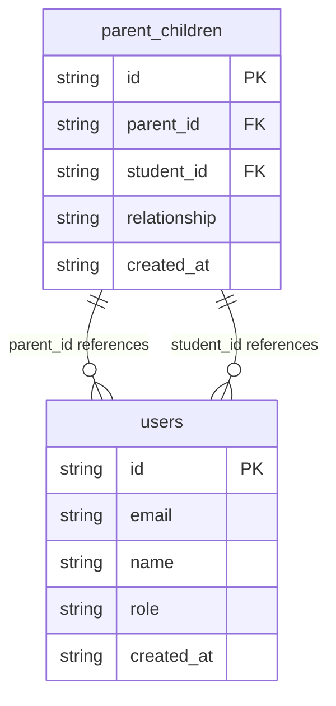
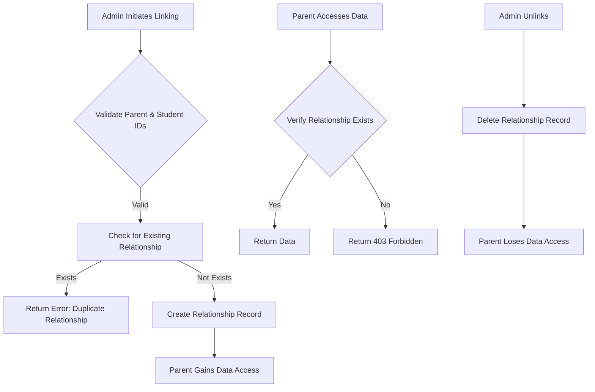

# Parent-Child Relationship Model

<cite>
**Referenced Files in This Document**   
- [database.types.ts](file://lib/database.types.ts)
- [20260105000003_create_parent_tables.sql](file://supabase/migrations/20260105000003_create_parent_tables.sql)
- [link-parent-child/route.ts](file://app/api/admin/link-parent-child/route.ts)
- [unlink-parent-child/route.ts](file://app/api/admin/unlink-parent-child/route.ts)
- [children/route.ts](file://app/api/parent/children/route.ts)
- [child/[id]/grades/route.ts](file://app/api/parent/child/[id]/grades/route.ts)
- [child/[id]/attendance/route.ts](file://app/api/parent/child/[id]/attendance/route.ts)
- [parent-store.ts](file://lib/parent-store.ts)
</cite>

## Table of Contents
1. [Introduction](#introduction)
2. [Database Schema](#database-schema)
3. [Composite Unique Constraint](#composite-unique-constraint)
4. [Foreign Key Relationships](#foreign-key-relationships)
5. [Row Level Security Policies](#row-level-security-policies)
6. [Business Rules and Procedures](#business-rules-and-procedures)
7. [Query Examples](#query-examples)
8. [Data Validation and Security](#data-validation-and-security)
9. [Conclusion](#conclusion)

## Introduction
The Parent-Child Relationship model in the School-Management-System establishes the connection between parents and students, enabling parents to access their children's educational data while maintaining strict privacy boundaries. This model is implemented through the `parent_children` table which serves as a junction table linking users with the parent role to users with the student role. The system supports relationship verification, access delegation, and secure data retrieval through well-defined APIs and database policies.

**Section sources**
- [database.types.ts](file://lib/database.types.ts#L328-L366)

## Database Schema
The `parent_children` table structure is designed to store the relationship between parents and students with appropriate constraints and indexing for performance. The table contains the following fields:

- **id**: UUID primary key with default generation
- **parent_id**: UUID foreign key referencing the users table
- **student_id**: UUID foreign key referencing the users table
- **relationship**: Text field with default value 'guardian' and constrained to specific values
- **created_at**: Timestamptz with default value of current timestamp

The relationship field is constrained to accept only the following values: 'mother', 'father', 'guardian', or 'other'. This ensures data consistency and provides meaningful relationship types for user interface display.



**Diagram sources**
- [20260105000003_create_parent_tables.sql](file://supabase/migrations/20260105000003_create_parent_tables.sql#L7-L13)

**Section sources**
- [database.types.ts](file://lib/database.types.ts#L328-L366)
- [20260105000003_create_parent_tables.sql](file://supabase/migrations/20260105000003_create_parent_tables.sql#L6-L13)

## Composite Unique Constraint
The `parent_children` table implements a composite unique constraint on the combination of `parent_id` and `student_id` fields. This constraint prevents duplicate relationships from being created between the same parent and student pair, ensuring data integrity within the system.

When an attempt is made to create a duplicate relationship, the database returns a PostgreSQL error code "23505" (unique_violation), which is handled by the application layer to provide a user-friendly error message: "This parent-child relationship already exists". This constraint is critical for maintaining clean data and preventing confusion in the parent portal where a parent should only see each child once.

The unique constraint is implemented at the database level to ensure enforcement regardless of the application layer, providing a reliable safeguard against data duplication even in cases of concurrent requests or application bugs.

**Section sources**
- [20260105000003_create_parent_tables.sql](file://supabase/migrations/20260105000003_create_parent_tables.sql#L12)
- [link-parent-child/route.ts](file://app/api/admin/link-parent-child/route.ts#L43-L48)

## Foreign Key Relationships
The `parent_children` table establishes foreign key relationships with the `users` table for both the `parent_id` and `student_id` fields. These relationships ensure referential integrity by preventing the creation of relationships with non-existent users and automatically handling cleanup when users are removed.

Both foreign keys are configured with `ON DELETE CASCADE` behavior, meaning that if a user account is deleted, all associated parent-child relationships are automatically removed. This prevents orphaned records in the system and maintains data consistency. The foreign key constraints also ensure that only valid user IDs from the `users` table can be used in the `parent_children` table.

The relationship to the `users` table is further reinforced by the Row Level Security (RLS) policies that verify user roles, ensuring that only users with the 'parent' role can be assigned as parents and only users with the 'student' role can be assigned as children.

```mermaid
erDiagram
parent_children {
string id PK
string parent_id FK
string student_id FK
string relationship
string created_at
}
users {
string id PK
string role
}
parent_children }o--|| users : "parent_id"
parent_children }o--|| users : "student_id"
class users {
role: string
constraint: "role IN ('admin', 'teacher', 'student', 'parent')"
}
```

**Diagram sources**
- [20260105000003_create_parent_tables.sql](file://supabase/migrations/20260105000003_create_parent_tables.sql#L8-L9)

**Section sources**
- [database.types.ts](file://lib/database.types.ts#L351-L364)
- [20260105000003_create_parent_tables.sql](file://supabase/migrations/20260105000003_create_parent_tables.sql#L8-L9)

## Row Level Security Policies
The system implements comprehensive Row Level Security (RLS) policies to control access to parent-child relationship data and related educational records. These policies ensure that parents can only access data for their linked children while maintaining privacy boundaries for all other students.

The primary RLS policies include:

1. **Parents can view their own children**: Allows parents to SELECT from the `parent_children` table only when the `parent_id` matches their authenticated user ID.
2. **Admin can manage all parent-child relationships**: Grants administrators full access to manage all parent-child relationships.
3. **Parents can view their children's grades**: Allows parents to access grades for students they are linked to.
4. **Parents can view their children's attendance**: Allows parents to access attendance records for linked students.
5. **Parents can view their children's class enrollments**: Allows parents to access class enrollment data for linked students.

These policies work together to create a secure access model where parents are automatically granted appropriate access to their children's educational data without requiring manual permission configuration. The policies use EXISTS subqueries to verify the parent-child relationship before granting access to sensitive data.

```mermaid
graph TD
A[Parent User] --> B{Authenticates}
B --> C[Supabase auth.uid()]
C --> D{RLS Policy Check}
D --> E["parent_id = auth.uid()"]
E --> F[Access Granted]
D --> G["EXISTS (SELECT 1 FROM parent_children WHERE parent_id = auth.uid() AND student_id = target_table.student_id)"]
G --> H[Access to Child's Data]
I[Admin User] --> J{Authenticates}
J --> K[Supabase auth.uid()]
K --> L{RLS Policy Check}
L --> M["EXISTS (SELECT 1 FROM users WHERE id = auth.uid() AND role = 'admin')"]
M --> N[Full Access]
```

**Diagram sources**
- [20260105000003_create_parent_tables.sql](file://supabase/migrations/20260105000003_create_parent_tables.sql#L19-L48)

**Section sources**
- [20260105000003_create_parent_tables.sql](file://supabase/migrations/20260105000003_create_parent_tables.sql#L19-L48)
- [child/[id]/grades/route.ts](file://app/api/parent/child/[id]/grades/route.ts#L27-L37)
- [child/[id]/attendance/route.ts](file://app/api/parent/child/[id]/attendance/route.ts#L28-L37)

## Business Rules and Procedures
The Parent-Child Relationship model implements several business rules and procedures to ensure proper management of family connections within the school system.

### Relationship Verification
Before a parent can access any student data, the system verifies the parent-child relationship by checking the `parent_children` table. This verification occurs in API endpoints that serve child-specific data, such as grades and attendance records. If no valid relationship exists, the system returns a 403 Forbidden error.

### Linking Procedure
The linking procedure is restricted to administrators and follows these steps:
1. Administrator provides parent ID, student ID, and optional relationship type
2. System validates that both IDs exist and have appropriate roles
3. System attempts to insert the relationship into the `parent_children` table
4. If a duplicate relationship exists, the system returns a 400 Bad Request error
5. On success, the relationship is created and the parent gains access to the student's data

### Unlinking Procedure
The unlinking procedure allows administrators to remove parent-child relationships:
1. Administrator provides parent ID and student ID
2. System validates the existence of the relationship
3. System deletes the relationship from the `parent_children` table
4. The parent immediately loses access to the student's data due to RLS policies

### Access Delegation
Access delegation is automatic based on the parent-child relationship. When a relationship is established, the parent immediately gains read access to the student's grades, attendance, class schedules, and other educational data through the RLS policies. No additional configuration is required.



**Diagram sources**
- [link-parent-child/route.ts](file://app/api/admin/link-parent-child/route.ts#L4-L60)
- [unlink-parent-child/route.ts](file://app/api/admin/unlink-parent-child/route.ts#L4-L50)
- [children/route.ts](file://app/api/parent/children/route.ts#L24-L38)

**Section sources**
- [link-parent-child/route.ts](file://app/api/admin/link-parent-child/route.ts#L4-L60)
- [unlink-parent-child/route.ts](file://app/api/admin/unlink-parent-child/route.ts#L4-L50)
- [children/route.ts](file://app/api/parent/children/route.ts#L4-L74)
- [parent-store.ts](file://lib/parent-store.ts#L50-L65)

## Query Examples
The following examples demonstrate common queries for managing and retrieving parent-child relationship data.

### Retrieve a Parent's Children
```sql
SELECT 
    pc.student_id,
    pc.relationship,
    u.name,
    u.email,
    u.avatar,
    sp.grade_level,
    sp.section
FROM parent_children pc
JOIN users u ON pc.student_id = u.id
LEFT JOIN student_profiles sp ON pc.student_id = sp.user_id
WHERE pc.parent_id = 'parent-user-id'
ORDER BY u.name;
```

### Check Linkage Status
```sql
SELECT id 
FROM parent_children 
WHERE parent_id = 'parent-id' 
AND student_id = 'student-id';
```

### Manage Family Connections (Link)
```sql
INSERT INTO parent_children (parent_id, student_id, relationship)
VALUES ('parent-id', 'student-id', 'mother')
ON CONFLICT (parent_id, student_id) 
DO NOTHING;
```

### Manage Family Connections (Unlink)
```sql
DELETE FROM parent_children 
WHERE parent_id = 'parent-id' 
AND student_id = 'student-id';
```

### Retrieve Child's Grades
```sql
SELECT 
    g.*,
    c.name as class_name,
    c.subject,
    ut.name as teacher_name
FROM grades g
JOIN classes c ON g.class_id = c.id
JOIN users ut ON g.teacher_id = ut.id
WHERE g.student_id = 'student-id'
AND EXISTS (
    SELECT 1 FROM parent_children pc 
    WHERE pc.parent_id = 'parent-id' 
    AND pc.student_id = g.student_id
)
ORDER BY g.date DESC;
```

These queries are implemented in the application through Supabase client calls, with the RLS policies automatically enforcing access controls at the database level.

**Section sources**
- [children/route.ts](file://app/api/parent/children/route.ts#L25-L38)
- [child/[id]/grades/route.ts](file://app/api/parent/child/[id]/grades/route.ts#L41-L49)
- [child/[id]/attendance/route.ts](file://app/api/parent/child/[id]/attendance/route.ts#L45-L52)

## Data Validation and Security
The Parent-Child Relationship model implements multiple layers of data validation and security to protect sensitive family information and ensure data integrity.

### Data Validation Rules
- **Required Fields**: Both parent_id and student_id are required for relationship creation
- **Role Validation**: Only users with 'parent' role can be parents; only users with 'student' role can be students
- **Relationship Type Validation**: Relationship field restricted to predefined values
- **Duplicate Prevention**: Composite unique constraint prevents duplicate relationships
- **Referential Integrity**: Foreign key constraints ensure valid user references

### Security Considerations
- **Row Level Security**: All access to parent-child data is controlled by RLS policies
- **Authentication**: All operations require authenticated sessions
- **Authorization**: Role-based access control restricts linking/unlinking to administrators
- **Data Minimization**: Parents only access data for their linked children
- **Auditability**: All relationship changes can be tracked through database audit logs

The system follows the principle of least privilege, where users are granted only the minimum access necessary to perform their roles. Parents automatically gain access to their children's educational data through the relationship linkage, while administrators have broader management capabilities. The security model is reinforced by both database-level RLS policies and application-level authorization checks.

**Section sources**
- [link-parent-child/route.ts](file://app/api/admin/link-parent-child/route.ts#L26-L31)
- [unlink-parent-child/route.ts](file://app/api/admin/unlink-parent-child/route.ts#L26-L31)
- [20260105000003_create_parent_tables.sql](file://supabase/migrations/20260105000003_create_parent_tables.sql#L10)
- [child/[id]/grades/route.ts](file://app/api/parent/child/[id]/grades/route.ts#L27-L37)

## Conclusion
The Parent-Child Relationship model in the School-Management-System provides a secure and efficient mechanism for connecting parents with their children's educational data. Through the `parent_children` junction table, composite unique constraints, foreign key relationships, and comprehensive RLS policies, the system ensures data integrity while maintaining strict privacy boundaries.

The model supports essential business operations including relationship verification, linking/unlinking procedures, and automatic access delegation. By leveraging Supabase's RLS capabilities, the system automatically grants parents appropriate access to their children's grades, attendance, and other educational records without requiring complex permission management.

The implementation balances usability for parents with security requirements, ensuring that sensitive student data is protected while providing parents with the information they need to support their children's education. The well-defined API endpoints and database schema make the system maintainable and extensible for future enhancements.