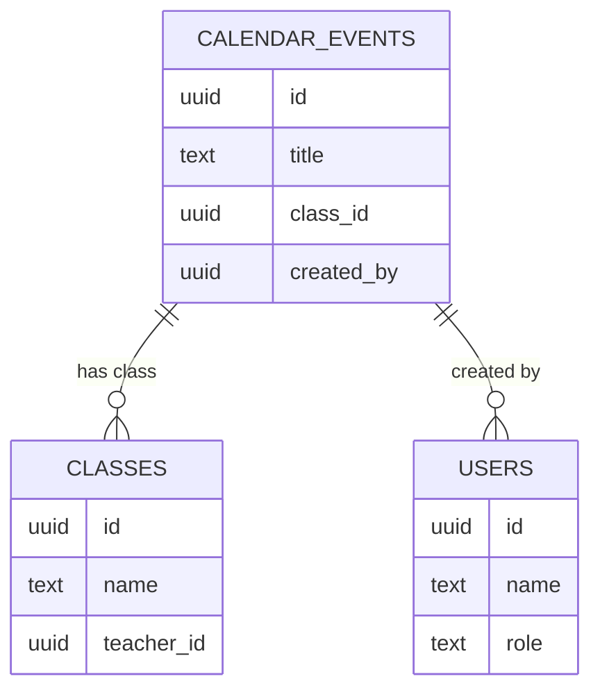
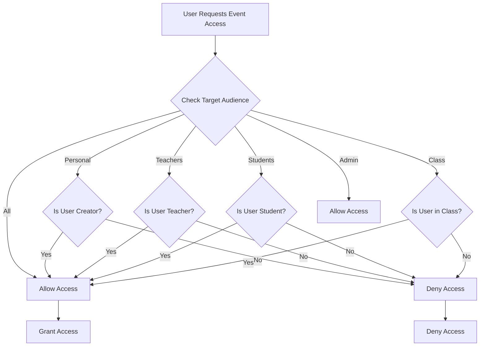

# Schedule Model

<cite>
**Referenced Files in This Document**   
- [database.types.ts](file://lib/database.types.ts)
- [20260105000002_create_calendar_events_table.sql](file://supabase/migrations/20260105000002_create_calendar_events_table.sql)
- [calendar-store.ts](file://lib/calendar-store.ts)
- [app/api/calendar/route.ts](file://app/api/calendar/route.ts)
- [app/teacher/schedule/page.tsx](file://app/teacher/schedule/page.tsx)
- [app/student/schedule/page.tsx](file://app/student/schedule/page.tsx)
- [app/api/student/schedule/route.ts](file://app/api/student/schedule/route.ts)
- [validation-schemas.ts](file://lib/validation-schemas.ts)
- [20251219043556_create_schedule_table.sql](file://supabase/migrations/20251219043556_create_schedule_table.sql)
- [20260108112143_performance_indexes.sql](file://supabase/migrations/20260108112143_performance_indexes.sql)
</cite>

## Table of Contents
1. [Introduction](#introduction)
2. [Calendar Events Table Structure](#calendar-events-table-structure)
3. [Field Definitions](#field-definitions)
4. [Foreign Key Relationships](#foreign-key-relationships)
5. [Row Level Security (RLS) Policies](#row-level-security-rls-policies)
6. [Schedule Table Structure](#schedule-table-structure)
7. [Business Rules and Validation](#business-rules-and-validation)
8. [Query Examples](#query-examples)
9. [Data Model Diagram](#data-model-diagram)

## Introduction
The Schedule model in the School-Management-System provides a comprehensive calendar system for managing school events, class schedules, and academic activities. This documentation details the calendar_events table structure, RLS policies, relationships with other entities, and business rules governing event creation and visibility. The system supports various event types including classes, quizzes, assignments, exams, holidays, and meetings, with flexible audience targeting and access control based on user roles.

**Section sources**
- [database.types.ts](file://lib/database.types.ts)
- [20260105000002_create_calendar_events_table.sql](file://supabase/migrations/20260105000002_create_calendar_events_table.sql)

## Calendar Events Table Structure
The calendar_events table serves as the central data structure for storing all calendar-related information in the school management system. It supports both one-time and recurring events with flexible scheduling options.

```mermaid
erDiagram
CALENDAR_EVENTS {
uuid id PK
text title NN
text description
text type "other" "CHECK(type IN ('class', 'quiz', 'assignment', 'exam', 'holiday', 'meeting', 'other'))"
date start_date NN
date end_date
time start_time
time end_time
boolean all_day false
text location
uuid class_id FK
uuid created_by FK
text target_audience "personal" "CHECK(target_audience IN ('all', 'students', 'teachers', 'class', 'personal'))"
text color
timestamptz created_at NOW()
timestamptz updated_at NOW()
}
CLASSES {
uuid id PK
text name
text subject
uuid teacher_id FK
text grade
text section
}
USERS {
uuid id PK
text name
text email
text role
boolean is_active
}
CALENDAR_EVENTS ||--o{ CLASSES : "class_id → classes.id"
CALENDAR_EVENTS ||--o{ USERS : "created_by → users.id"
```

**Diagram sources**
- [20260105000002_create_calendar_events_table.sql](file://supabase/migrations/20260105000002_create_calendar_events_table.sql)
- [database.types.ts](file://lib/database.types.ts)

**Section sources**
- [20260105000002_create_calendar_events_table.sql](file://supabase/migrations/20260105000002_create_calendar_events_table.sql)
- [database.types.ts](file://lib/database.types.ts)

## Field Definitions
The calendar_events table contains the following fields with their respective data types, constraints, and descriptions:

| Field | Data Type | Constraints | Description |
|-------|-----------|-------------|-------------|
| id | UUID | PRIMARY KEY, DEFAULT gen_random_uuid() | Unique identifier for the calendar event |
| title | TEXT | NOT NULL | Title or name of the event |
| description | TEXT | | Detailed description of the event |
| type | TEXT | DEFAULT 'other', CHECK constraint | Type of event: class, quiz, assignment, exam, holiday, meeting, or other |
| start_date | DATE | NOT NULL | Start date of the event |
| end_date | DATE | | End date of the event (for multi-day events) |
| start_time | TIME | | Start time of the event |
| end_time | TIME | | End time of the event |
| all_day | BOOLEAN | DEFAULT false | Indicates if the event spans the entire day |
| location | TEXT | | Physical or virtual location of the event |
| class_id | UUID | REFERENCES classes(id) ON DELETE CASCADE | Foreign key linking to the classes table |
| created_by | UUID | REFERENCES users(id) ON DELETE SET NULL | Foreign key linking to the users table indicating who created the event |
| target_audience | TEXT | DEFAULT 'personal', CHECK constraint | Audience for the event: all, students, teachers, class, or personal |
| color | TEXT | | Color code for visual representation in calendar views |
| created_at | TIMESTAMPTZ | DEFAULT NOW() | Timestamp when the event was created |
| updated_at | TIMESTAMPTZ | DEFAULT NOW() | Timestamp when the event was last updated |

**Section sources**
- [20260105000002_create_calendar_events_table.sql](file://supabase/migrations/20260105000002_create_calendar_events_table.sql)
- [database.types.ts](file://lib/database.types.ts)

## Foreign Key Relationships
The calendar_events table maintains relationships with other core entities in the system through foreign key constraints:

### Classes Relationship
The `class_id` field establishes a relationship with the classes table, allowing events to be associated with specific classes. When a class is deleted, all associated calendar events are automatically removed due to the ON DELETE CASCADE constraint.

### Users Relationship
The `created_by` field links to the users table, identifying the user who created the event. If the creating user is deleted, the reference is set to NULL (ON DELETE SET NULL) to preserve the event while maintaining referential integrity.



**Diagram sources**
- [20260105000002_create_calendar_events_table.sql](file://supabase/migrations/20260105000002_create_calendar_events_table.sql)
- [database.types.ts](file://lib/database.types.ts)

**Section sources**
- [20260105000002_create_calendar_events_table.sql](file://supabase/migrations/20260105000002_create_calendar_events_table.sql)
- [database.types.ts](file://lib/database.types.ts)

## Row Level Security (RLS) Policies
The calendar_events table implements comprehensive Row Level Security (RLS) policies to control access based on user roles and event targeting:

### SELECT Policy: "Users can view events targeted to them"
Users can view events based on the following criteria:
- Personal events they created
- Events targeted to all users
- Role-specific events (teachers can see teacher-targeted events, students can see student-targeted events)
- Class-specific events for classes they are enrolled in or teaching
- Administrators can see all events

### INSERT Policy: "Users can create their own events"
Users can create events only when they are designated as the creator (created_by = auth.uid()). This ensures users can only create events in their own name.

### UPDATE Policy: "Users can update their own events"
Users can update events they created, and administrators have update privileges on all events.

### DELETE Policy: "Users can delete their own events"
Users can delete events they created, and administrators can delete any event.



**Diagram sources**
- [20260105000002_create_calendar_events_table.sql](file://supabase/migrations/20260105000002_create_calendar_events_table.sql)
- [app/api/calendar/route.ts](file://app/api/calendar/route.ts)

**Section sources**
- [20260105000002_create_calendar_events_table.sql](file://supabase/migrations/20260105000002_create_calendar_events_table.sql)
- [app/api/calendar/route.ts](file://app/api/calendar/route.ts)

## Schedule Table Structure
The schedules table stores the regular class schedule information, defining the recurring time slots for classes throughout the week.

```sql
CREATE TABLE schedules (
  id UUID PRIMARY KEY DEFAULT gen_random_uuid(),
  class_id UUID REFERENCES classes(id) ON DELETE CASCADE,
  day TEXT NOT NULL CHECK (day IN ('Monday', 'Tuesday', 'Wednesday', 'Thursday', 'Friday', 'Saturday', 'Sunday')),
  start_time TIME NOT NULL,
  end_time TIME NOT NULL,
  room TEXT
);
```

This table establishes a relationship between classes and their scheduled time slots, with constraints ensuring data integrity for day values and time ranges. The ON DELETE CASCADE constraint ensures that when a class is deleted, all associated schedule entries are automatically removed.

**Section sources**
- [20251219043556_create_schedule_table.sql](file://supabase/migrations/20251219043556_create_schedule_table.sql)

## Business Rules and Validation
The Schedule model enforces several business rules and validation requirements to maintain data integrity and ensure proper system operation.

### Event Creation Rules
- Title and start_date are required fields for all events
- Users can only create events with themselves as the creator
- The type field must be one of the predefined values: class, quiz, assignment, exam, holiday, meeting, or other
- The target_audience must be one of: all, students, teachers, class, or personal

### Time Conflict Validation
The system should validate that new events do not create time conflicts, particularly for class-related events. While the database schema doesn't enforce this at the constraint level, the application logic should check for overlapping time slots when creating or updating events.

### Date/Time Range Validation
- start_date must be present and cannot be in the past for certain event types
- If end_date is provided, it must be equal to or after start_date
- If start_time and end_time are provided, end_time must be after start_time
- For all_day events, time fields are typically ignored

### Audience Targeting Rules
The target_audience field determines who can view the event:
- "all": Visible to all users in the system
- "students": Visible only to users with student role
- "teachers": Visible only to users with teacher role
- "class": Visible to students enrolled in the associated class and the teacher of that class
- "personal": Visible only to the creator of the event

**Section sources**
- [validation-schemas.ts](file://lib/validation-schemas.ts)
- [app/api/calendar/route.ts](file://app/api/calendar/route.ts)
- [calendar-store.ts](file://lib/calendar-store.ts)

## Query Examples
The following examples demonstrate common queries for retrieving schedule and calendar event data:

### Daily Schedule for a Student
```sql
SELECT 
  s.day,
  s.start_time,
  s.end_time,
  c.name as class_name,
  c.subject,
  u.name as teacher_name,
  s.room
FROM schedules s
JOIN classes c ON s.class_id = c.id
JOIN users u ON c.teacher_id = u.id
JOIN class_students cs ON c.id = cs.class_id
WHERE cs.student_id = 'user-id-here'
  AND s.day = 'Monday'
ORDER BY s.start_time;
```

### Teacher's Calendar Events
```sql
SELECT 
  ce.id,
  ce.title,
  ce.description,
  ce.start_date,
  ce.end_date,
  ce.start_time,
  ce.end_time,
  ce.all_day,
  ce.location,
  ce.color,
  c.name as class_name
FROM calendar_events ce
LEFT JOIN classes c ON ce.class_id = c.id
WHERE ce.created_by = 'teacher-id-here'
  OR (ce.target_audience = 'class' AND ce.class_id IN (
    SELECT id FROM classes WHERE teacher_id = 'teacher-id-here'
  ))
  OR ce.target_audience IN ('all', 'teachers')
ORDER BY ce.start_date, ce.start_time;
```

### Student Timetable with Class Schedule
```sql
SELECT 
  s.day,
  s.start_time,
  s.end_time,
  c.name as class_name,
  c.subject,
  u.name as teacher_name,
  s.room,
  COUNT(*) as weekly_classes
FROM schedules s
JOIN classes c ON s.class_id = c.id
JOIN users u ON c.teacher_id = u.id
JOIN class_students cs ON c.id = cs.class_id
WHERE cs.student_id = 'student-id-here'
GROUP BY s.day, s.start_time, s.end_time, c.name, c.subject, u.name, s.room
ORDER BY 
  CASE s.day 
    WHEN 'Monday' THEN 1
    WHEN 'Tuesday' THEN 2
    WHEN 'Wednesday' THEN 3
    WHEN 'Thursday' THEN 4
    WHEN 'Friday' THEN 5
    WHEN 'Saturday' THEN 6
    WHEN 'Sunday' THEN 7
  END,
  s.start_time;
```

**Section sources**
- [app/teacher/schedule/page.tsx](file://app/teacher/schedule/page.tsx)
- [app/student/schedule/page.tsx](file://app/student/schedule/page.tsx)
- [app/api/student/schedule/route.ts](file://app/api/student/schedule/route.ts)

## Data Model Diagram
The following diagram illustrates the complete data model for the Schedule system, showing the relationships between calendar events, schedules, classes, and users.

```mermaid
erDiagram
CALENDAR_EVENTS {
uuid id PK
text title NN
text description
text type
date start_date NN
date end_date
time start_time
time end_time
boolean all_day
text location
uuid class_id FK
uuid created_by FK
text target_audience
text color
timestamptz created_at
timestamptz updated_at
}
SCHEDULES {
uuid id PK
uuid class_id FK
text day NN "CHECK(day IN ('Monday', 'Tuesday', 'Wednesday', 'Thursday', 'Friday', 'Saturday', 'Sunday'))"
time start_time NN
time end_time NN
text room
}
CLASSES {
uuid id PK
text name
text subject
uuid teacher_id FK
text grade
text section
}
USERS {
uuid id PK
text name
text email
text role
boolean is_active
}
CLASS_STUDENTS {
uuid id PK
uuid class_id FK
uuid student_id FK
timestamptz enrolled_at
}
CALENDAR_EVENTS ||--o{ CLASSES : "class_id → classes.id"
CALENDAR_EVENTS ||--o{ USERS : "created_by → users.id"
SCHEDULES ||--o{ CLASSES : "class_id → classes.id"
CLASSES ||--o{ USERS : "teacher_id → users.id"
CLASSES ||--o{ CLASS_STUDENTS : "id → class_id"
CLASS_STUDENTS ||--o{ USERS : "student_id → users.id"
```

**Diagram sources**
- [20260105000002_create_calendar_events_table.sql](file://supabase/migrations/20260105000002_create_calendar_events_table.sql)
- [20251219043556_create_schedule_table.sql](file://supabase/migrations/20251219043556_create_schedule_table.sql)
- [database.types.ts](file://lib/database.types.ts)

**Section sources**
- [20260105000002_create_calendar_events_table.sql](file://supabase/migrations/20260105000002_create_calendar_events_table.sql)
- [20251219043556_create_schedule_table.sql](file://supabase/migrations/20251219043556_create_schedule_table.sql)
- [database.types.ts](file://lib/database.types.ts)