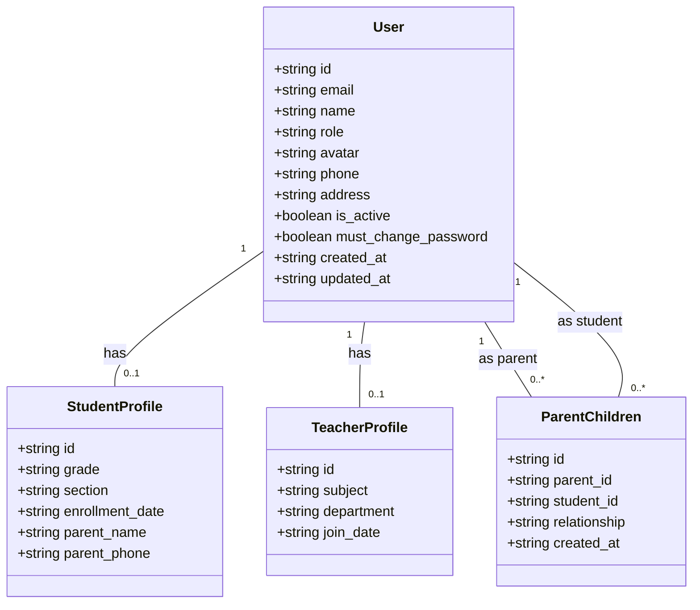
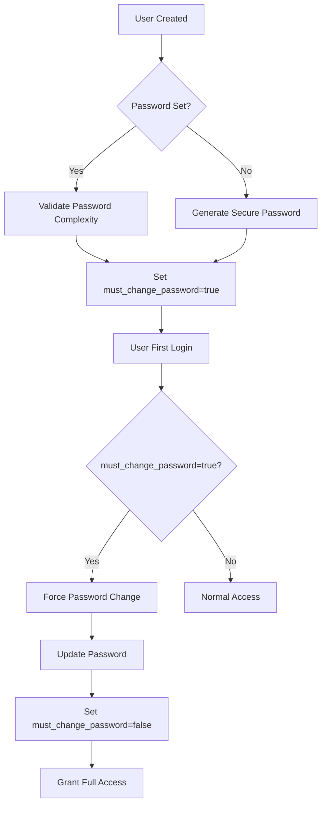

# User Model

<cite>
**Referenced Files in This Document**   
- [types.ts](file://lib/supabase/types.ts)
- [database.types.ts](file://lib/database.types.ts)
- [20251219043432_create_users_table.sql](file://supabase/migrations/20251219043432_create_users_table.sql)
- [20251219084313_add_is_active_column.sql](file://supabase/migrations/20251219084313_add_is_active_column.sql)
- [20251219084551_add_must_change_password_column.sql](file://supabase/migrations/20251219084551_add_must_change_password_column.sql)
- [20251219081806_fix_user_read_policy.sql](file://supabase/migrations/20251219081806_fix_user_read_policy.sql)
- [20260105082250_create_parent_tables.sql](file://supabase/migrations/20260105082250_create_parent_tables.sql)
- [validation-schemas.ts](file://lib/validation-schemas.ts)
- [security.ts](file://lib/security.ts)
- [create-user/route.ts](file://app/api/admin/create-user/route.ts)
- [profile/update/route.ts](file://app/api/profile/update/route.ts)
</cite>

## Table of Contents
1. [Introduction](#introduction)
2. [Core Data Model](#core-data-model)
3. [Field Definitions](#field-definitions)
4. [Constraints and Indexes](#constraints-and-indexes)
5. [Row Level Security Policies](#row-level-security-policies)
6. [Role-Specific Profiles](#role-specific-profiles)
7. [TypeScript Interfaces](#typescript-interfaces)
8. [Business Rules](#business-rules)
9. [Data Validation](#data-validation)
10. [Common Queries](#common-queries)

## Introduction
The User model serves as the central identity and access management entity in the School-Management-System. It defines the core attributes for all system users (admin, teacher, student, parent) and establishes the foundation for role-based access control, authentication, and authorization. This document provides comprehensive documentation of the user model's structure, constraints, security policies, and business rules.

## Core Data Model

```mermaid
erDiagram
USER {
uuid id PK
string email UK
string name
string role
string avatar
string phone
string address
boolean is_active
boolean must_change_password
timestamp created_at
timestamp updated_at
}
STUDENT_PROFILE {
uuid id PK FK
string grade
string section
date enrollment_date
string parent_name
string parent_phone
}
TEACHER_PROFILE {
uuid id PK FK
string subject
string department
date join_date
}
PARENT_CHILDREN {
uuid id PK
uuid parent_id FK
uuid student_id FK
string relationship
timestamp created_at
}
USER ||--o{ STUDENT_PROFILE : "has"
USER ||--o{ TEACHER_PROFILE : "has"
USER }o--|| PARENT_CHILDREN : "as parent"
USER }o--|| PARENT_CHILDREN : "as student"
```

**Diagram sources**
- [20251219043432_create_users_table.sql](file://supabase/migrations/20251219043432_create_users_table.sql)
- [20260105082250_create_parent_tables.sql](file://supabase/migrations/20260105082250_create_parent_tables.sql)

**Section sources**
- [20251219043432_create_users_table.sql](file://supabase/migrations/20251219043432_create_users_table.sql)
- [20260105082250_create_parent_tables.sql](file://supabase/migrations/20260105082250_create_parent_tables.sql)

## Field Definitions

The users table contains the following fields:

| Field | Data Type | Nullable | Description |
|-------|---------|---------|-------------|
| id | UUID | No | Primary key, automatically generated using gen_random_uuid() |
| email | TEXT | No | User's email address, must be unique across the system |
| name | TEXT | No | Full name of the user |
| role | TEXT | No | User's role in the system: admin, teacher, student, or parent |
| avatar | TEXT | Yes | URL to the user's profile picture |
| phone | TEXT | Yes | Contact phone number |
| address | TEXT | Yes | Physical address of the user |
| is_active | BOOLEAN | Yes | Indicates whether the user account is active (default: true) |
| must_change_password | BOOLEAN | Yes | Indicates whether the user must change their password on next login (default: true) |
| created_at | TIMESTAMPTZ | Yes | Timestamp when the record was created (default: NOW()) |
| updated_at | TIMESTAMPTZ | Yes | Timestamp when the record was last updated (default: NOW()) |

**Section sources**
- [database.types.ts](file://lib/database.types.ts#L369-L381)
- [types.ts](file://lib/supabase/types.ts#L4-L13)

## Constraints and Indexes

The users table implements several constraints to ensure data integrity:

- **Primary Key**: The `id` column serves as the primary key, uniquely identifying each user.
- **Unique Constraint**: The `email` column has a UNIQUE constraint to prevent duplicate email addresses.
- **Role Check Constraint**: The `role` column is constrained to specific values: 'admin', 'teacher', 'student', or 'parent'.
- **Default Values**: 
  - `is_active` defaults to true
  - `must_change_password` defaults to true
  - `created_at` and `updated_at` default to the current timestamp

```sql
-- Primary key and unique constraints
ALTER TABLE users ADD CONSTRAINT users_pkey PRIMARY KEY (id);
ALTER TABLE users ADD CONSTRAINT users_email_key UNIQUE (email);

-- Role constraint
ALTER TABLE users ADD CONSTRAINT users_role_check CHECK (role IN ('admin', 'teacher', 'student', 'parent'));
```

**Section sources**
- [20251219043432_create_users_table.sql](file://supabase/migrations/20251219043432_create_users_table.sql#L2-L5)
- [20251219084313_add_is_active_column.sql](file://supabase/migrations/20251219084313_add_is_active_column.sql#L2)
- [20251219084551_add_must_change_password_column.sql](file://supabase/migrations/20251219084551_add_must_change_password_column.sql#L2)
- [20260105082250_create_parent_tables.sql](file://supabase/migrations/20260105082250_create_parent_tables.sql#L2-L3)

## Row Level Security Policies

The system implements Row Level Security (RLS) policies to control data access based on user roles:

### User Table Policies
- **SELECT**: Authenticated users can read their own data OR admins can read all user data
- **INSERT**: Users can insert their own data during registration (id must match auth.uid())
- **UPDATE**: Users can update their own data OR admins can update any user

```sql
-- Allow users to read their own data OR admins to read all
CREATE POLICY "Users can read own data"
ON public.users
FOR SELECT
TO authenticated
USING (
  auth.uid() = id
  OR
  EXISTS (
    SELECT 1 FROM public.users u
    WHERE u.id = auth.uid() AND u.role = 'admin'
  )
);
```

### Role-Based Access Patterns
- **Admin**: Full access to all user data and can manage all accounts
- **Teacher**: Can view their own profile and read student/teacher profiles
- **Student**: Can view their own profile and related data
- **Parent**: Can view their own profile and their children's data through relationship tables

**Section sources**
- [20251219081806_fix_user_read_policy.sql](file://supabase/migrations/20251219081806_fix_user_read_policy.sql#L5-L16)
- [20251219044036_add_rls_policies.sql](file://supabase/migrations/20251219044036_add_rls_policies.sql#L2)
- [20260105082250_create_parent_tables.sql](file://supabase/migrations/20260105082250_create_parent_tables.sql#L19-L23)

## Role-Specific Profiles

The system extends the base user model with role-specific profiles that are linked via foreign key relationships:

### Student Profiles
- Linked by user id (one-to-one)
- Contains academic information: grade, section, enrollment_date
- Additional parent contact information

### Teacher Profiles
- Linked by user id (one-to-one)
- Contains professional information: subject, department, join_date

### Parent Relationships
- Managed through the parent_children junction table
- Establishes many-to-many relationships between parents and students
- Includes relationship type (mother, father, guardian, other)



**Diagram sources**
- [20251219043432_create_users_table.sql](file://supabase/migrations/20251219043432_create_users_table.sql#L13-L27)
- [20260105082250_create_parent_tables.sql](file://supabase/migrations/20260105082250_create_parent_tables.sql#L6-L13)

**Section sources**
- [20251219043432_create_users_table.sql](file://supabase/migrations/20251219043432_create_users_table.sql#L13-L27)
- [20260105082250_create_parent_tables.sql](file://supabase/migrations/20260105082250_create_parent_tables.sql#L6-L13)

## TypeScript Interfaces

The system defines TypeScript interfaces to ensure type safety between the frontend and database:

```typescript
export interface DbUser {
  id: string
  email: string
  name: string
  role: UserRole
  avatar: string | null
  phone: string | null
  address: string | null
  created_at: string
  updated_at: string
}
```

The UserRole type is defined as a union type to ensure only valid roles are used:

```typescript
export type UserRole = "admin" | "teacher" | "student" | "parent"
```

These interfaces are used throughout the application to provide compile-time type checking and IntelliSense support.

**Section sources**
- [types.ts](file://lib/supabase/types.ts#L4-L13)
- [database.types.ts](file://lib/database.types.ts#L369-L381)

## Business Rules

### Role-Based Permissions
- **Admin**: Full system access, can create/manage all users, view all data
- **Teacher**: Can manage their classes, enter grades, take attendance
- **Student**: Can view their grades, attendance, schedule
- **Parent**: Can view their children's grades and attendance

### Account Activation
- New accounts are created with `is_active = true` by default
- Admins can deactivate accounts by setting `is_active = false`
- Inactive accounts cannot authenticate or access the system

### Password Reset Requirements
- New users and password resets set `must_change_password = true`
- Users must change their password on first login
- After password change, `must_change_password` is set to false
- Passwords must be at least 12 characters with uppercase, lowercase, number, and special character



**Diagram sources**
- [create-user/route.ts](file://app/api/admin/create-user/route.ts#L57-L77)
- [20251219084551_add_must_change_password_column.sql](file://supabase/migrations/20251219084551_add_must_change_password_column.sql)

**Section sources**
- [create-user/route.ts](file://app/api/admin/create-user/route.ts#L57-L77)
- [20251219084551_add_must_change_password_column.sql](file://supabase/migrations/20251219084551_add_must_change_password_column.sql)

## Data Validation

The system implements validation at both database and application levels:

### Database-Level Validation
- NOT NULL constraints on critical fields (id, email, name, role)
- UNIQUE constraint on email
- CHECK constraint on role values
- Default values for is_active and must_change_password

### Application-Level Validation
- **Profile Updates**: Name validation with regex to prevent special characters
- **Avatar URLs**: Must start with http:// or https:// to prevent XSS
- **Password Complexity**: 12+ characters with uppercase, lowercase, number, special character
- **Image Uploads**: File type and size validation (max 5MB)

```typescript
export const profileUpdateSchema = z.object({
  name: z.string().min(2).max(100).regex(/^[a-zA-Z0-9\s\.\-]+$/, "Name contains invalid characters").refine(val => !val.toLowerCase().includes("admin"), "Invalid name").optional(),
  phone: z.string().max(20).optional().nullable(),
  address: z.string().max(200).optional().nullable(),
  avatar: z.string().url().max(500).refine((val) => val.startsWith("http://") || val.startsWith("https://"), {
    message: "Avatar URL must start with http:// or https://"
  }).optional().nullable(),
})
```

**Section sources**
- [security.ts](file://lib/security.ts#L101-L109)
- [validation-schemas.ts](file://lib/validation-schemas.ts)
- [create-user/route.ts](file://app/api/admin/create-user/route.ts#L70-L77)

## Common Queries

### User Lookup by Email
```sql
SELECT * FROM users WHERE email = 'user@example.com';
```

### Role Verification
```sql
SELECT role FROM users WHERE id = auth.uid();
```

### Active User Status Check
```sql
SELECT is_active, must_change_password FROM users WHERE id = auth.uid();
```

### Admin User Check
```sql
SELECT EXISTS (
  SELECT 1 FROM users 
  WHERE id = auth.uid() AND role = 'admin'
) AS is_admin;
```

### Parent's Children Query
```sql
SELECT u.* FROM users u
JOIN parent_children pc ON u.id = pc.student_id
WHERE pc.parent_id = auth.uid();
```

### User Profile with Role-Specific Data
```sql
-- For students
SELECT u.*, sp.grade, sp.section 
FROM users u 
LEFT JOIN student_profiles sp ON u.id = sp.id 
WHERE u.id = auth.uid();

-- For teachers  
SELECT u.*, tp.subject, tp.department
FROM users u
LEFT JOIN teacher_profiles tp ON u.id = tp.id
WHERE u.id = auth.uid();
```

**Section sources**
- [check-auth/route.ts](file://app/api/check-auth/route.ts#L41-L45)
- [profile/update/route.ts](file://app/api/profile/update/route.ts#L44-L48)
- [database.types.ts](file://lib/database.types.ts#L369-L381)