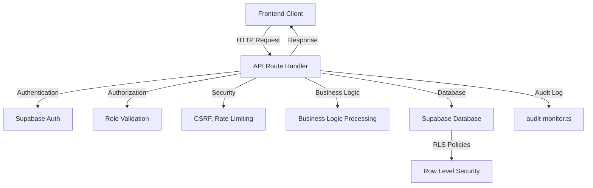
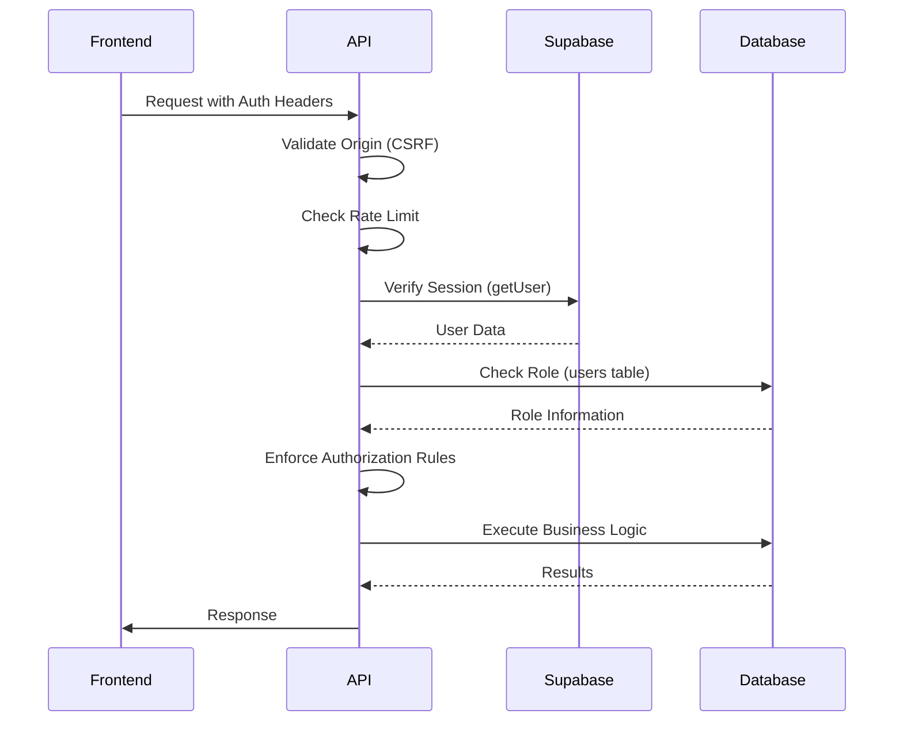
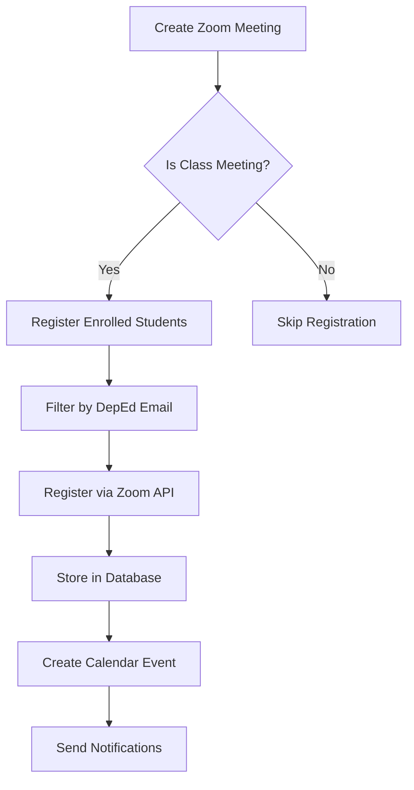
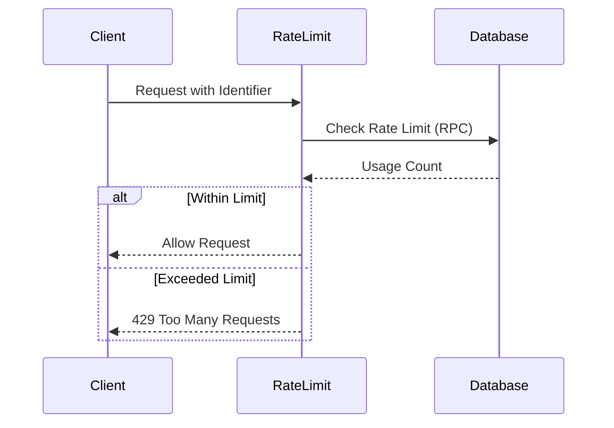
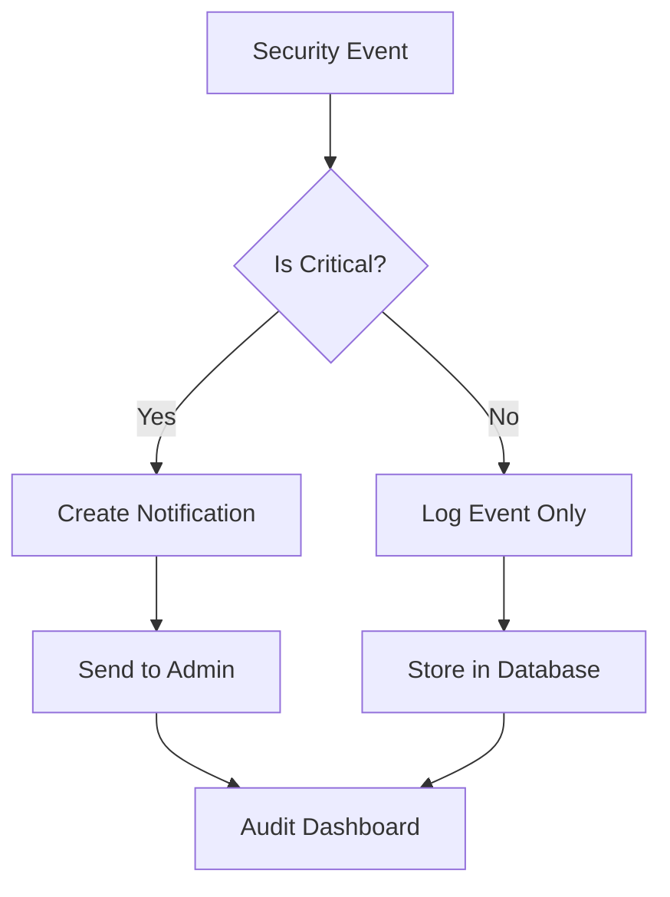
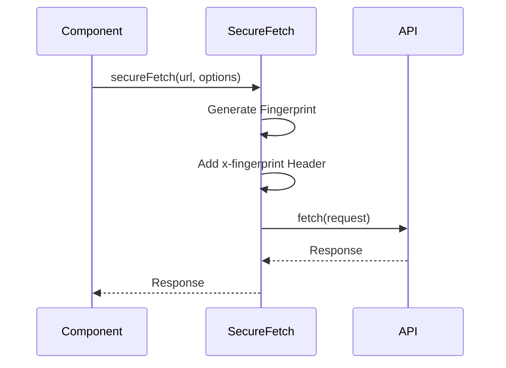

# API Routes

<cite>
**Referenced Files in This Document**   
- [app/api/admin/create-user/route.ts](file://app/api/admin/create-user/route.ts)
- [app/api/teacher/grades/create/route.ts](file://app/api/teacher/grades/create/route.ts)
- [app/api/zoom/meetings/route.ts](file://app/api/zoom/meetings/route.ts)
- [app/api/auth/login/route.ts](file://app/api/auth/login/route.ts)
- [lib/supabase/middleware.ts](file://lib/supabase/middleware.ts)
- [lib/audit-monitor.ts](file://lib/audit-monitor.ts)
- [lib/rate-limit.ts](file://lib/rate-limit.ts)
- [lib/secure-fetch.ts](file://lib/secure-fetch.ts)
- [lib/security.ts](file://lib/security.ts)
- [lib/session-security.ts](file://lib/session-security.ts)
- [lib/supabase/server.ts](file://lib/supabase/server.ts)
- [lib/supabase/client.ts](file://lib/supabase/client.ts)
- [supabase/migrations/20251219044036_add_rls_policies.sql](file://supabase/migrations/20251219044036_add_rls_policies.sql)
- [app/api/student/dashboard/route.ts](file://app/api/student/dashboard/route.ts)
</cite>

## Table of Contents
1. [Introduction](#introduction)
2. [API Architecture Overview](#api-architecture-overview)
3. [Authentication and Authorization](#authentication-and-authorization)
4. [Route Groups and Endpoints](#route-groups-and-endpoints)
5. [Security Implementation](#security-implementation)
6. [Error Handling and Monitoring](#error-handling-and-monitoring)
7. [Frontend Integration](#frontend-integration)
8. [Database Access Control](#database-access-control)
9. [Conclusion](#conclusion)

## Introduction
This document provides comprehensive documentation for all API routes under app/api/ in the School Management System. The Next.js API routes serve as server-side endpoints that handle business logic, data validation, and database interactions via Supabase. Each route is designed with security, scalability, and maintainability in mind, implementing robust authentication, authorization, rate limiting, and audit logging mechanisms.

The API routes are organized by role-based access patterns (admin, teacher, student, parent, auth, zoom, etc.) and follow consistent patterns for request/response handling, error management, and security validation. This documentation covers HTTP methods, URL patterns, request/response schemas, authentication requirements, authorization rules, and specific implementation details for key endpoints.

**Section sources**
- [app/api/admin/create-user/route.ts](file://app/api/admin/create-user/route.ts)
- [app/api/teacher/grades/create/route.ts](file://app/api/teacher/grades/create/route.ts)
- [app/api/zoom/meetings/route.ts](file://app/api/zoom/meetings/route.ts)

## API Architecture Overview
The API architecture follows a server-side route handler pattern in Next.js, where each route.ts file exports HTTP method handlers (GET, POST, PUT, DELETE, etc.) that process incoming requests. These handlers implement a consistent pattern of security checks, authentication validation, authorization verification, input validation, business logic execution, and response generation.

The architecture leverages Supabase for database operations, authentication, and real-time capabilities, with a layered approach to security that includes client-side validation, server-side validation, role-based access control, and Row Level Security (RLS) policies at the database level.



**Diagram sources **
- [app/api/admin/create-user/route.ts](file://app/api/admin/create-user/route.ts)
- [app/api/teacher/grades/create/route.ts](file://app/api/teacher/grades/create/route.ts)
- [lib/audit-monitor.ts](file://lib/audit-monitor.ts)

**Section sources**
- [app/api/admin/create-user/route.ts](file://app/api/admin/create-user/route.ts)
- [app/api/teacher/grades/create/route.ts](file://app/api/teacher/grades/create/route.ts)
- [app/api/zoom/meetings/route.ts](file://app/api/zoom/meetings/route.ts)

## Authentication and Authorization
The API implements a comprehensive authentication and authorization system using Supabase Auth with additional security layers. Authentication is handled through JWT-based session validation, while authorization is enforced through role-based access control and middleware validation.

The system uses a multi-layered approach to authentication, including session tokens, fingerprint binding, and IP validation to prevent session hijacking. Authorization is enforced at both the application level (through role checks in API routes) and the database level (through RLS policies).



**Diagram sources **
- [app/api/auth/login/route.ts](file://app/api/auth/login/route.ts)
- [lib/supabase/middleware.ts](file://lib/supabase/middleware.ts)
- [lib/session-security.ts](file://lib/session-security.ts)

**Section sources**
- [app/api/auth/login/route.ts](file://app/api/auth/login/route.ts)
- [lib/supabase/middleware.ts](file://lib/supabase/middleware.ts)
- [lib/session-security.ts](file://lib/session-security.ts)

## Route Groups and Endpoints
The API routes are organized into logical groups based on functionality and user roles. Each route group follows consistent patterns for HTTP methods, request/response schemas, and security requirements.

### Admin Routes
Admin routes provide functionality for administrative users to manage users, classes, and system settings. These routes require admin role authentication and implement strict authorization checks.

**Section sources**
- [app/api/admin/create-user/route.ts](file://app/api/admin/create-user/route.ts)

### Teacher Routes
Teacher routes enable teachers to manage grades, attendance, lessons, and quizzes for their classes. These routes verify that the teacher has ownership of the class being modified.

**Section sources**
- [app/api/teacher/grades/create/route.ts](file://app/api/teacher/grades/create/route.ts)

### Student Routes
Student routes provide access to student-specific data such as dashboard information, grades, and attendance records. These routes ensure students can only access their own data.

**Section sources**
- [app/api/student/dashboard/route.ts](file://app/api/student/dashboard/route.ts)

### Zoom Integration Routes
Zoom integration routes manage Zoom meeting creation, registration, and attendance tracking. These routes integrate with the Zoom API and implement special logic for class meetings and participant registration.



**Diagram sources **
- [app/api/zoom/meetings/route.ts](file://app/api/zoom/meetings/route.ts)

**Section sources**
- [app/api/zoom/meetings/route.ts](file://app/api/zoom/meetings/route.ts)

## Security Implementation
The API implements multiple layers of security to protect against common web vulnerabilities and ensure data integrity. These security measures include input validation, CSRF protection, rate limiting, session security, and audit logging.

### Input Validation and Sanitization
All API routes implement strict input validation using server-side checks to prevent injection attacks and data corruption. The system enforces strong password complexity requirements and validates all user inputs against defined schemas.

**Section sources**
- [app/api/admin/create-user/route.ts](file://app/api/admin/create-user/route.ts)
- [lib/security.ts](file://lib/security.ts)

### CSRF Protection
The API implements CSRF protection by validating the request origin against the configured site URL. This prevents cross-site request forgery attacks by ensuring requests originate from the same domain.

**Section sources**
- [lib/security.ts](file://lib/security.ts)

### Rate Limiting
Rate limiting is implemented to prevent abuse and brute force attacks. The system uses a flexible rate limiting mechanism that can be configured per endpoint and identifier (IP or User ID), with different fail-open behaviors for security-critical endpoints.



**Diagram sources **
- [lib/rate-limit.ts](file://lib/rate-limit.ts)

**Section sources**
- [lib/rate-limit.ts](file://lib/rate-limit.ts)

### Session Security
The system implements advanced session security features including fingerprint binding, session invalidation on new login, and detection of session hijacking attempts. Each session is bound to a unique fingerprint of the client's browser and device characteristics.

**Section sources**
- [lib/session-security.ts](file://lib/session-security.ts)

## Error Handling and Monitoring
The API implements comprehensive error handling and monitoring to ensure reliability and security. Error responses are standardized to prevent information leakage while providing meaningful feedback to legitimate users.

### Error Handling Patterns
Error handling follows a consistent pattern of catching exceptions, logging errors, and returning appropriate HTTP status codes with generic error messages to prevent information disclosure.

**Section sources**
- [app/api/admin/create-user/route.ts](file://app/api/admin/create-user/route.ts)
- [app/api/teacher/grades/create/route.ts](file://app/api/teacher/grades/create/route.ts)

### Audit Logging
The system implements audit logging through the audit-monitor.ts service, which tracks security events, suspicious activities, and critical user actions. Admin users receive notifications for potential security incidents.



**Diagram sources **
- [lib/audit-monitor.ts](file://lib/audit-monitor.ts)

**Section sources**
- [lib/audit-monitor.ts](file://lib/audit-monitor.ts)

## Frontend Integration
Frontend components interact with the API routes through secure-fetch.ts, which automatically includes security headers and handles authentication. This wrapper ensures all requests include the necessary fingerprint data for session validation.

### Secure Fetch Implementation
The secure-fetch.ts utility wraps the native fetch API to automatically include fingerprint headers for session validation on protected routes. It can be used directly or set up as a global interceptor.



**Diagram sources **
- [lib/secure-fetch.ts](file://lib/secure-fetch.ts)

**Section sources**
- [lib/secure-fetch.ts](file://lib/secure-fetch.ts)

## Database Access Control
The system implements fine-grained data access control through Supabase RLS (Row Level Security) policies. These policies ensure that users can only access data they are authorized to view, even if they bypass application-level checks.

### RLS Policy Implementation
RLS policies are defined at the database level to enforce data access rules. The policies work in conjunction with application-level authorization to provide defense in depth.

```sql
-- Example RLS Policy
CREATE POLICY "Users can read own data" ON users FOR SELECT USING (auth.uid() = id);
CREATE POLICY "Users can update own data" ON users FOR UPDATE USING (auth.uid() = id);
```

**Diagram sources **
- [supabase/migrations/20251219044036_add_rls_policies.sql](file://supabase/migrations/20251219044036_add_rls_policies.sql)

**Section sources**
- [supabase/migrations/20251219044036_add_rls_policies.sql](file://supabase/migrations/20251219044036_add_rls_policies.sql)

## Conclusion
The API routes in the School Management System provide a secure, scalable, and well-structured interface for all application functionality. By leveraging Next.js API routes, Supabase, and a comprehensive security architecture, the system ensures reliable and protected access to educational data and services.

The implementation follows best practices for web API design, including consistent error handling, thorough input validation, role-based access control, and comprehensive audit logging. The integration with Supabase RLS policies provides an additional layer of security, ensuring data integrity even if application-level checks are bypassed.

This documentation covers the key aspects of the API implementation, providing guidance for developers working with the system and ensuring maintainability and security across all endpoints.