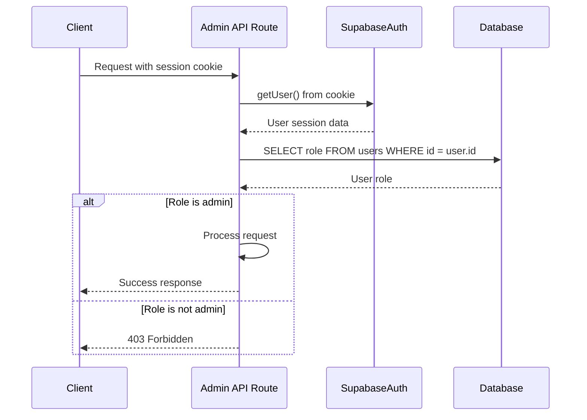
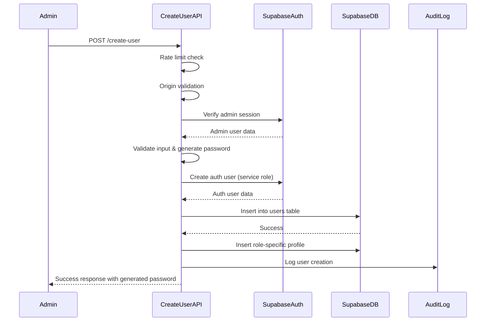

# Admin API Routes

<cite>
**Referenced Files in This Document**   
- [create-user/route.ts](file://app/api/admin/create-user/route.ts)
- [get-users/route.ts](file://app/api/admin/get-users/route.ts)
- [toggle-user-status/route.ts](file://app/api/admin/toggle-user-status/route.ts)
- [create-class/route.ts](file://app/api/admin/create-class/route.ts)
- [classes/route.ts](file://app/api/admin/classes/route.ts)
- [enroll-student/route.ts](file://app/api/admin/enroll-student/route.ts)
- [unenroll-student/route.ts](file://app/api/admin/unenroll-student/route.ts)
- [grades/route.ts](file://app/api/admin/grades/route.ts)
- [quizzes/route.ts](file://app/api/admin/quizzes/route.ts)
- [lessons/route.ts](file://app/api/admin/lessons/route.ts)
- [schedule/route.ts](file://app/api/admin/schedule/route.ts)
- [settings/update/route.ts](file://app/api/admin/settings/update/route.ts)
- [admin-session-guard.tsx](file://components/admin-session-guard.tsx)
- [layout.tsx](file://app/admin/layout.tsx)
- [user-audit-history.tsx](file://components/user-audit-history.tsx)
- [student-form.tsx](file://components/student-form.tsx)
- [audit-monitor.ts](file://lib/audit-monitor.ts)
- [rate-limit.ts](file://lib/rate-limit.ts)
- [validation-schemas.ts](file://lib/validation-schemas.ts)
- [auth-store.ts](file://lib/auth-store.ts)
</cite>

## Table of Contents
1. [Introduction](#introduction)
2. [Authentication and Authorization](#authentication-and-authorization)
3. [User Management](#user-management)
4. [Class Operations](#class-operations)
5. [Academic Data Access](#academic-data-access)
6. [System Settings](#system-settings)
7. [Security and Error Handling](#security-and-error-handling)
8. [Frontend Integration](#frontend-integration)
9. [Conclusion](#conclusion)

## Introduction
This document provides comprehensive documentation for all admin-specific API routes in the school management system. The admin API routes are located under `app/api/admin/` and provide privileged functionality for system administrators to manage users, classes, academic data, and system settings. All endpoints enforce role-based access control through the AdminSessionGuard component and interact with Supabase via server-side queries with Row Level Security (RLS) policies.

**Section sources**
- [layout.tsx](file://app/admin/layout.tsx#L1-L62)
- [admin-session-guard.tsx](file://components/admin-session-guard.tsx#L1-L34)

## Authentication and Authorization
All admin API routes require authentication and authorization verification. The system uses Supabase authentication with role-based access control. The AdminSessionGuard component ensures that only authenticated admin users can access admin routes.

The authorization flow follows these steps:
1. Extract session from cookies using Supabase SSR client
2. Verify the user is authenticated
3. Query the users table to confirm the user's role is "admin"
4. Proceed with the requested operation if authorized



**Diagram sources**
- [layout.tsx](file://app/admin/layout.tsx#L15-L38)
- [get-users/route.ts](file://app/api/admin/get-users/route.ts#L7-L22)

**Section sources**
- [layout.tsx](file://app/admin/layout.tsx#L1-L62)
- [admin-session-guard.tsx](file://components/admin-session-guard.tsx#L1-L34)
- [get-users/route.ts](file://app/api/admin/get-users/route.ts#L7-L22)

## User Management
The admin API provides several endpoints for user management, including creating users, retrieving user lists, and toggling user status.

### Create User
Creates a new user account with specified role and profile information.

**Endpoint**: `POST /api/admin/create-user`

**Request Body**:
```json
{
  "email": "string",
  "password": "string (optional)",
  "name": "string",
  "role": "student|teacher|admin",
  "lrn": "string (student only)",
  "subject": "string (teacher only)",
  "department": "string (teacher only)",
  "phone": "string",
  "address": "string"
}
```

**Response**:
```json
{
  "success": true,
  "user": {
    "id": "string",
    "email": "string",
    "name": "string",
    "role": "string",
    "created_at": "string"
  },
  "password": "string (only if generated)"
}
```

**Security Features**:
- Rate limiting (10 requests per minute)
- CSRF protection via origin validation
- Server-side password generation if not provided
- Strong password complexity enforcement
- Service Role client for user creation



**Diagram sources**
- [create-user/route.ts](file://app/api/admin/create-user/route.ts#L8-L156)

**Section sources**
- [create-user/route.ts](file://app/api/admin/create-user/route.ts#L8-L156)

### Get Users
Retrieves a paginated list of all users in the system.

**Endpoint**: `GET /api/admin/get-users?page=1&limit=50`

**Query Parameters**:
- `page`: Page number (default: 1)
- `limit`: Items per page (default: 50)

**Response**:
```json
{
  "users": [
    {
      "id": "string",
      "email": "string",
      "name": "string",
      "role": "string",
      "created_at": "string",
      "is_active": "boolean"
    }
  ],
  "total": "number",
  "page": "number",
  "limit": "number"
}
```

**Section sources**
- [get-users/route.ts](file://app/api/admin/get-users/route.ts#L4-L59)

### Toggle User Status
Activates or deactivates a user account.

**Endpoint**: `POST /api/admin/toggle-user-status`

**Request Body**:
```json
{
  "userId": "string",
  "status": "boolean"
}
```

**Response**:
```json
{
  "success": "boolean"
}
```

**Security Features**:
- Input validation with Zod schema
- Prevention of self-account modification
- Proper error handling with standardized API errors

**Section sources**
- [toggle-user-status/route.ts](file://app/api/admin/toggle-user-status/route.ts#L15-L62)

## Class Operations
The admin API provides endpoints for managing classes, including creating classes, enrolling and unenrolling students.

### Create Class
Creates a new class with schedule information.

**Endpoint**: `POST /api/admin/create-class`

**Request Body**:
```json
{
  "name": "string",
  "grade": "string",
  "section": "string",
  "subject": "string",
  "teacher_id": "string (optional)",
  "room": "string (optional)",
  "scheduleDays": "MWF|TTh|Daily|MF|MW|WF",
  "scheduleTime": "HH:MM AM/PM"
}
```

**Response**:
```json
{
  "success": true,
  "class": "object"
}
```

**Features**:
- Rate limiting (10 requests per minute)
- Automatic schedule entry creation
- Transactional behavior (rollback on failure)
- Schedule parsing and time conversion

**Section sources**
- [create-class/route.ts](file://app/api/admin/create-class/route.ts#L28-L113)

### List Classes
Retrieves a list of all classes with enrollment counts.

**Endpoint**: `GET /api/admin/classes?page=1&pageSize=50&search=`

**Query Parameters**:
- `page`: Page number
- `pageSize`: Items per page
- `search`: Search term for name or subject

**Response**:
```json
{
  "classes": [
    {
      "id": "string",
      "name": "string",
      "grade": "string",
      "section": "string",
      "subject": "string",
      "room": "string",
      "schedule": "string",
      "teacher_id": "string",
      "teacher_name": "string",
      "student_count": "number"
    }
  ],
  "pagination": {
    "page": "number",
    "pageSize": "number",
    "total": "number",
    "totalPages": "number"
  }
}
```

**Features**:
- Rate limiting to prevent scraping
- Search functionality
- Aggregation for student counts
- DTO pattern for secure data transformation

**Section sources**
- [classes/route.ts](file://app/api/admin/classes/route.ts#L7-L89)

### Enroll Student
Enrolls a student in a class.

**Endpoint**: `POST /api/admin/enroll-student`

**Request Body**:
```json
{
  "studentId": "string",
  "classId": "string"
}
```

**Response**:
```json
{
  "success": true
}
```

**Section sources**
- [enroll-student/route.ts](file://app/api/admin/enroll-student/route.ts#L4-L43)

### Unenroll Student
Removes a student from a class.

**Endpoint**: `POST /api/admin/unenroll-student`

**Request Body**:
```json
{
  "enrollmentId": "string"
}
```

**Response**:
```json
{
  "success": true
}
```

**Section sources**
- [unenroll-student/route.ts](file://app/api/admin/unenroll-student/route.ts#L4-L39)

## Academic Data Access
The admin API provides read access to academic data including grades, quizzes, lessons, and schedules.

### Grades
Retrieves all grades with student and class information.

**Endpoint**: `GET /api/admin/grades`

**Response**:
```json
{
  "grades": [
    {
      "id": "string",
      "student_id": "string",
      "student_name": "string",
      "class_id": "string",
      "class_name": "string",
      "subject": "string",
      "score": "number",
      "max_score": "number",
      "percentage": "number",
      "grade": "string",
      "type": "string",
      "date": "string"
    }
  ]
}
```

**Section sources**
- [grades/route.ts](file://app/api/admin/grades/route.ts#L4-L57)

### Quizzes
Retrieves all quizzes with related information.

**Endpoint**: `GET /api/admin/quizzes`

**Response**:
```json
{
  "quizzes": [
    {
      "id": "string",
      "title": "string",
      "description": "string",
      "duration": "number",
      "due_date": "string",
      "status": "string",
      "class_id": "string",
      "class": "object",
      "teacher": "object",
      "questions": "array"
    }
  ]
}
```

**Section sources**
- [quizzes/route.ts](file://app/api/admin/quizzes/route.ts#L4-L39)

### Lessons
Retrieves all lessons with materials.

**Endpoint**: `GET /api/admin/lessons`

**Response**:
```json
{
  "lessons": [
    {
      "id": "string",
      "title": "string",
      "description": "string",
      "class_id": "string",
      "class": "object",
      "teacher": "object",
      "materials": "array"
    }
  ]
}
```

**Section sources**
- [lessons/route.ts](file://app/api/admin/lessons/route.ts#L4-L39)

### Schedule
Retrieves the complete school schedule.

**Endpoint**: `GET /api/admin/schedule`

**Response**:
```json
{
  "schedules": [
    {
      "id": "string",
      "day": "string",
      "start_time": "string",
      "end_time": "string",
      "room": "string",
      "class": "object"
    }
  ]
}
```

**Section sources**
- [schedule/route.ts](file://app/api/admin/schedule/route.ts#L4-L40)

## System Settings
Provides functionality to update school-wide settings.

### Update Settings
Updates school settings such as name, location, and geofencing radius.

**Endpoint**: `POST /api/admin/settings/update`

**Request Body**:
```json
{
  "name": "string",
  "latitude": "number",
  "longitude": "number",
  "radiusMeters": "number"
}
```

**Response**:
```json
{
  "success": true
}
```

**Features**:
- Input validation with Zod schema
- Bounds checking for geographic values
- Fixed ID for singleton settings record
- UPSERT operation to ensure single record

**Section sources**
- [settings/update/route.ts](file://app/api/admin/settings/update/route.ts#L13-L61)

## Security and Error Handling
The admin API implements multiple security layers and robust error handling.

### Security Measures
- **Rate Limiting**: Implemented via `rate-limit.ts` to prevent abuse
- **Input Validation**: Using Zod schemas to validate all inputs
- **Row Level Security**: Supabase RLS policies enforced at database level
- **CSRF Protection**: Origin validation for state-changing operations
- **Session Validation**: Server-side verification of admin role
- **DTO Pattern**: Secure data transformation to prevent information leakage

### Error Handling
- Standardized error responses with appropriate HTTP status codes
- Detailed error logging for debugging
- Graceful degradation for failed operations
- Transactional integrity with rollback capabilities

**Section sources**
- [rate-limit.ts](file://lib/rate-limit.ts)
- [validation-schemas.ts](file://lib/validation-schemas.ts)
- [audit-monitor.ts](file://lib/audit-monitor.ts)
- [auth-store.ts](file://lib/auth-store.ts)

## Frontend Integration
Admin API routes are consumed by various frontend components in the admin dashboard.

### User Audit History
The `user-audit-history.tsx` component uses the admin API to display user management activities, including user creation and status changes.

**Section sources**
- [user-audit-history.tsx](file://components/user-audit-history.tsx)

### Student Form
The `student-form.tsx` component integrates with multiple admin API endpoints:
- Creates new student accounts via `create-user`
- Manages class enrollment via `enroll-student` and `unenroll-student`
- Updates student status via `toggle-user-status`

**Section sources**
- [student-form.tsx](file://components/student-form.tsx)

## Conclusion
The admin API routes provide comprehensive functionality for school administrators to manage users, classes, academic data, and system settings. All endpoints enforce strict security measures including authentication, authorization, rate limiting, input validation, and Row Level Security. The API follows RESTful principles with clear endpoints for each operation and returns consistent response formats. Frontend components consume these APIs to provide a complete administrative interface for the school management system.