# Authentication API Routes

<cite>
**Referenced Files in This Document**   
- [login/route.ts](file://app/api/auth/login/route.ts)
- [logout/route.ts](file://app/api/auth/logout/route.ts)
- [me/route.ts](file://app/api/auth/me/route.ts)
- [sessions/route.ts](file://app/api/auth/sessions/route.ts)
- [check-auth/route.ts](file://app/api/check-auth/route.ts)
- [profile/update/route.ts](file://app/api/profile/update/route.ts)
- [profile/upload-avatar/route.ts](file://app/api/profile/upload-avatar/route.ts)
- [auth-store.ts](file://lib/auth-store.ts)
- [session-security.ts](file://lib/session-security.ts)
- [audit-monitor.ts](file://lib/audit-monitor.ts)
- [security.ts](file://lib/security.ts)
- [rate-limit.ts](file://lib/rate-limit.ts)
- [storage.ts](file://lib/supabase/storage.ts)
- [page.tsx](file://app/login/page.tsx)
- [profile-page.tsx](file://components/profile-page.tsx)
</cite>

## Table of Contents
1. [Introduction](#introduction)
2. [Authentication Endpoints](#authentication-endpoints)
3. [User Profile Endpoints](#user-profile-endpoints)
4. [Security Architecture](#security-architecture)
5. [Session Management](#session-management)
6. [Audit Logging and Monitoring](#audit-logging-and-monitoring)
7. [Frontend Integration](#frontend-integration)
8. [Troubleshooting Guide](#troubleshooting-guide)

## Introduction

The Authentication API provides secure access control and user identity management for the School Management System. It implements a robust security model using Supabase Auth as the identity provider, enhanced with custom session binding, rate limiting, and audit logging. The API supports core authentication flows including login with multi-factor authentication (MFA) support, logout, session validation, and user identity retrieval.

The system follows a defense-in-depth security approach with multiple layers of protection:
- Rate limiting to prevent brute force attacks
- Session binding using client fingerprinting
- Secure token handling with HttpOnly cookies
- Comprehensive audit logging for security monitoring
- Input validation and origin verification

This documentation details the API endpoints under `app/api/auth/` and related profile management routes, covering HTTP methods, request/response structures, security protocols, and integration patterns.

## Authentication Endpoints

### Login Endpoint

The login endpoint handles user authentication and establishes secure sessions.

**Endpoint**: `POST /api/auth/login`  
**Authentication**: None (public)  
**Rate Limit**: 5 attempts per minute per IP  
**Security Features**: Rate limiting, generic error messages, account status validation

#### Request Structure
```json
{
  "email": "string",
  "password": "string",
  "fingerprint": {
    "userAgent": "string",
    "language": "string",
    "timezone": "string",
    "screenResolution": "string",
    "colorDepth": "number",
    "platform": "string",
    "cookiesEnabled": "boolean",
    "doNotTrack": "string"
  }
}
```

#### Response Structure (Success)
```json
{
  "user": "object",
  "role": "string",
  "isNewDevice": "boolean"
}
```

#### Response Structure (Error)
```json
{
  "error": "string"
}
```

#### Security Implementation
- **Rate Limiting**: Uses `checkRateLimit()` with fail-closed policy during database outages
- **Generic Error Messages**: Returns "Invalid login credentials" for all authentication failures to prevent user enumeration
- **Account Status Validation**: Checks `is_active` flag in users table and signs out disabled accounts
- **Session Binding**: Creates session record with fingerprint hash and IP hash
- **JWT Claims**: Stores user metadata (role, must_change_password) in JWT for reduced database queries

The login flow enforces single-session policy by invalidating all previous sessions upon successful authentication.

**Section sources**
- [login/route.ts](file://app/api/auth/login/route.ts#L7-L117)

### Logout Endpoint

The logout endpoint terminates user sessions and clears authentication state.

**Endpoint**: `POST /api/auth/logout`  
**Authentication**: Session required  
**Security Features**: Session invalidation, cookie clearing

#### Request Structure
No request body required.

#### Response Structure
```json
{
  "success": "boolean"
}
```

#### Implementation Details
- Invalidates server-side session in `user_sessions` table
- Signs out from Supabase Auth
- Clears session binding cookie (`sb-session-bind`)
- Graceful error handling: continues with client-side cleanup even if API fails

The endpoint ensures complete session termination by removing both server-side session records and client-side authentication tokens.

**Section sources**
- [logout/route.ts](file://app/api/auth/logout/route.ts#L6-L36)

### User Identity Endpoint

The `me` endpoint retrieves authenticated user information.

**Endpoint**: `GET /api/auth/me`  
**Authentication**: Session required  
**Security Features**: Server-side user data fetching

#### Response Structure (Success)
```json
{
  "user": {
    "id": "string",
    "name": "string",
    "email": "string",
    "avatar": "string",
    "role": "string"
  }
}
```

#### Response Structure (Error)
```json
{
  "error": "string"
}
```

#### Security Implementation
- Verifies authentication via Supabase `getUser()`
- Fetches user data from `users` table with row-level security
- Returns only essential user information
- Prevents direct access to sensitive user data

This endpoint enables client applications to retrieve user profile information securely without exposing the underlying database structure.

**Section sources**
- [me/route.ts](file://app/api/auth/me/route.ts#L4-L28)

### Session Management Endpoint

The sessions endpoint provides active session management capabilities.

**Endpoint**: `GET /api/auth/sessions`  
**Authentication**: Session required  
**Purpose**: Retrieve active sessions and devices

**Endpoint**: `DELETE /api/auth/sessions`  
**Authentication**: Session required  
**Purpose**: Logout from all devices

#### GET Response Structure
```json
{
  "sessions": "array",
  "devices": "array",
  "sessionCount": "number",
  "deviceCount": "number"
}
```

#### DELETE Response Structure
```json
{
  "success": "boolean",
  "invalidatedSessions": "number"
}
```

#### Implementation Details
- **GET**: Fetches user's active sessions and device information from database
- **DELETE**: Invalidates all user sessions via `invalidateAllUserSessions()` and signs out current session
- Both operations require valid authentication

The endpoint supports security-conscious users who want to monitor and manage their active sessions across devices.

**Section sources**
- [sessions/route.ts](file://app/api/auth/sessions/route.ts#L7-L72)

### Check Auth Endpoint

The check-auth endpoint verifies authentication status for other users (admin-only).

**Endpoint**: `POST /api/check-auth`  
**Authentication**: Admin session required  
**Purpose**: Verify if another user is authenticated

#### Request Structure
```json
{
  "userId": "string"
}
```

#### Response Structure
```json
{
  "hasAuth": "boolean"
}
```

#### Security Implementation
- Requires admin authentication and role verification
- Uses service role client to check user authentication status
- Implements strict access control to prevent privilege escalation
- Isolated function scope for service role client usage

This endpoint enables administrative features that require knowledge of user online status.

**Section sources**
- [check-auth/route.ts](file://app/api/check-auth/route.ts#L19-L64)

## User Profile Endpoints

### Profile Update Endpoint

The profile update endpoint allows users to modify their personal information.

**Endpoint**: `POST /api/profile/update`  
**Authentication**: Session required  
**Security Features**: Origin validation, input validation, role-based field access

#### Request Structure
```json
{
  "name": "string",
  "phone": "string",
  "address": "string",
  "avatar": "string",
  // Student-specific fields
  "contact_number": "string",
  "current_house_street": "string",
  // ... other student fields
  // Teacher-specific fields
  "subject": "string",
  "department": "string"
}
```

#### Response Structure
```json
{
  "success": "boolean"
}
```

#### Security Implementation
- **Origin Validation**: Uses `validateOrigin()` to prevent CSRF attacks
- **Input Validation**: Zod schema validation with field-specific rules
- **Role-Based Access**: Updates different tables based on user role (users, student_profiles, teacher_profiles)
- **Field Whitelisting**: Only allows modification of permitted fields
- **Data Sanitization**: Prevents XSS through URL protocol validation

The endpoint implements granular access control, allowing different sets of fields to be updated based on the user's role.

**Section sources**
- [profile/update/route.ts](file://app/api/profile/update/route.ts#L5-L105)
- [security.ts](file://lib/security.ts#L98-L136)

### Avatar Upload Endpoint

The avatar upload endpoint handles profile picture uploads with comprehensive security checks.

**Endpoint**: `POST /api/profile/upload-avatar`  
**Authentication**: Session required  
**Rate Limit**: 5 uploads per 10 minutes per IP

#### Request Structure
Form data with `avatar` file field.

#### Response Structure (Success)
```json
{
  "success": "boolean",
  "url": "string"
}
```

#### Response Structure (Error)
```json
{
  "error": "string"
}
```

#### Security Implementation
- **Rate Limiting**: Prevents abuse of storage resources
- **File Size Validation**: Maximum 5MB limit
- **File Type Validation**: Magic number checking for JPEG, PNG, GIF, WebP
- **Secure Storage**: Uploads to Supabase Storage with explicit content type
- **Public URL Generation**: Returns signed public URL for the uploaded avatar
- **Database Update**: Updates user record with new avatar URL

The endpoint performs multiple layers of file validation to prevent malicious uploads while providing a smooth user experience.

```mermaid
flowchart TD
A[Client Uploads Avatar] --> B{Validate Origin}
B --> |Valid| C{Check Rate Limit}
C --> |Allowed| D{Extract File from Form Data}
D --> E{Validate File Size ≤ 5MB}
E --> |Valid| F{Read First 4 Bytes}
F --> G{Check Magic Numbers}
G --> |Valid| H{Generate Secure File Path}
H --> I{Upload to Supabase Storage}
I --> J{Get Public URL}
J --> K{Update User Profile}
K --> L[Return Success Response]
B --> |Invalid| M[Return 403]
C --> |Exceeded| N[Return 429]
D --> |No File| O[Return 400]
E --> |Too Large| P[Return 400]
G --> |Invalid| Q[Return 400]
I --> |Error| R[Return 500]
```



**Diagram sources**
- [profile/upload-avatar/route.ts](file://app/api/profile/upload-avatar/route.ts#L15-L110)
- [storage.ts](file://lib/supabase/storage.ts#L33-L41)

**Section sources**
- [profile/upload-avatar/route.ts](file://app/api/profile/upload-avatar/route.ts#L15-L110)

## Security Architecture

### Session Security Model

The system implements a comprehensive session security model to prevent session hijacking and unauthorized access.


**Diagram sources**
- [session-security.ts](file://lib/session-security.ts#L68-L147)
- [login/route.ts](file://app/api/auth/login/route.ts#L84-L90)

**Section sources**
- [session-security.ts](file://lib/session-security.ts#L1-L373)

### Key Security Components

#### Session Binding
- Uses `sb-session-bind` HttpOnly, Secure, SameSite=strict cookie
- Binds sessions to client fingerprint (user agent, screen resolution, etc.)
- Hashes fingerprint data with salt for privacy
- Validates session on each request in middleware

#### Fingerprint Validation
- Collects client-side fingerprint via `generateFingerprint()`
- Hashes fingerprint data server-side with `hashFingerprint()`
- Compares hash on each request against stored value
- Invalidates session on significant fingerprint changes
- Configurable strictness level (0.8 default)

#### IP Address Handling
- Uses `getClientIp()` with platform IP preference
- Hashes IP addresses for privacy with `hashIpAddress()`
- Optional IP change detection (allowed for mobile users)
- Vercel-specific header support for accurate IP detection

#### Rate Limiting
- Implemented via `checkRateLimit()` utility
- Uses Supabase RPC for atomic operations
- Different policies for different endpoints:
  - Login: 5 attempts/minute, fail-closed
  - Avatar upload: 5 uploads/10 minutes, fail-open
- Service role client for reliable database access

## Session Management

### Session Lifecycle

The session management system follows a strict lifecycle to ensure security and reliability.


**Diagram sources**
- [session-security.ts](file://lib/session-security.ts#L154-L227)
- [logout/route.ts](file://app/api/auth/logout/route.ts#L17-L21)

**Section sources**
- [session-security.ts](file://lib/session-security.ts#L154-L227)

### Session Operations

#### Create Session
- Generates cryptographically secure session token
- Stores fingerprint hash and IP hash
- Invalidates all previous sessions for the user
- Updates device record or creates new one
- Returns session token for cookie storage

#### Validate Session
- Verifies session token against database record
- Compares current fingerprint hash with stored value
- Optionally checks IP address consistency
- Updates last active timestamp
- Returns validation result and user ID

#### Invalidate Session
- Marks session as invalid in database
- Logs security event with reason
- Can invalidate single session or all sessions for a user
- Supports multiple invalidation reasons (logout, timeout, hijack)

## Audit Logging and Monitoring

### Audit Event Types

The system logs security-relevant events for monitoring and incident response.

| Event Type | Description | Trigger |
|------------|-------------|---------|
| new_device | New device login detected | First login from device |
| session_hijack_attempt | Fingerprint mismatch detected | Invalid session attempt |
| ip_change_detected | IP address change detected | IP change with strict policy |
| user_updated_password | User password changed | Password update |
| user_deleted | User account deleted | Account deletion |
| token_revoked | Authentication token revoked | Token revocation |
| factor_deleted | MFA factor removed | MFA factor deletion |
| identity_unlinked | Identity provider unlinked | Identity unlinking |

**Section sources**
- [audit-monitor.ts](file://lib/audit-monitor.ts#L59-L88)
- [session-security.ts](file://lib/session-security.ts#L278-L298)

### Monitoring System

The audit monitoring system provides real-time security alerts for administrators.

```mermaid
flowchart TD
A[Start Audit Monitoring] --> B{User is Admin?}
B --> |Yes| C[Set 5-minute Interval]
C --> D[Call detectSuspiciousActivity()]
D --> E{Alerts Found?}
E --> |Yes| F[For Each Alert]
F --> G[Insert Notification]
G --> H[Send to Admin]
E --> |No| I[Wait for Next Interval]
B --> |No| J[No Monitoring]
```

**Diagram sources**
- [audit-monitor.ts](file://lib/audit-monitor.ts#L14-L47)

**Section sources**
- [audit-monitor.ts](file://lib/audit-monitor.ts#L1-L89)

## Frontend Integration

### Authentication Store

The `useAuthStore` provides a centralized state management solution for authentication.


**Diagram sources**
- [auth-store.ts](file://lib/auth-store.ts#L31-L110)

**Section sources**
- [auth-store.ts](file://lib/auth-store.ts#L1-L110)

### Login Component

The login page implements a secure authentication interface with user experience considerations.


**Diagram sources**
- [page.tsx](file://app/login/page.tsx#L23-L112)
- [auth-store.ts](file://lib/auth-store.ts#L41-L83)

**Section sources**
- [page.tsx](file://app/login/page.tsx#L1-L209)

### Profile Management

The profile page component integrates with the profile API endpoints to provide a seamless user experience.


**Diagram sources**
- [profile-page.tsx](file://components/profile-page.tsx#L242-L267)
- [profile-page.tsx](file://components/profile-page.tsx#L325-L363)

**Section sources**
- [profile-page.tsx](file://components/profile-page.tsx#L1-L800)

## Troubleshooting Guide

### Common Authentication Issues

#### Session Expiration
**Symptoms**: User is redirected to login page unexpectedly.
**Causes**:
- 8-hour session timeout
- Session invalidation due to fingerprint mismatch
- Manual logout from another device
- Browser clearing cookies

**Solutions**:
- Implement session timeout warnings (5 minutes before expiration)
- Ensure consistent browser fingerprint
- Use "Remember me" functionality if available
- Check browser cookie settings

#### Avatar Upload Failures
**Symptoms**: "Invalid image file format" or "File size too large" errors.
**Causes**:
- Unsupported file type (not JPEG, PNG, GIF, WebP)
- File size exceeding 5MB limit
- Corrupted image file
- Network issues during upload

**Solutions**:
- Convert image to supported format
- Compress image to reduce file size
- Verify file integrity
- Check network connection
- Try different browser

#### Login Failures
**Symptoms**: "Invalid login credentials" error.
**Causes**:
- Incorrect email/password combination
- Disabled account (`is_active = false`)
- Rate limiting (too many attempts)
- Network connectivity issues

**Solutions**:
- Verify email and password
- Contact administrator if account is disabled
- Wait for rate limit to reset (1 minute)
- Check internet connection
- Ensure correct email format (LRN users: 12-digit LRN@r1.deped.gov.ph)

### Security Event Handling

#### New Device Detection
When a user logs in from a new device, the system:
1. Creates a new device record
2. Sends a notification to the user
3. Logs the event for audit purposes
4. Continues normal authentication flow

Users should verify the notification details and contact support if the login was unauthorized.

#### Session Hijack Prevention
If a session hijack attempt is detected:
1. The suspicious session is immediately invalidated
2. A security alert is logged with details
3. The legitimate user may receive a notification
4. The user should change their password and review active sessions

Administrators should investigate the source IP and user agent for potential threats.