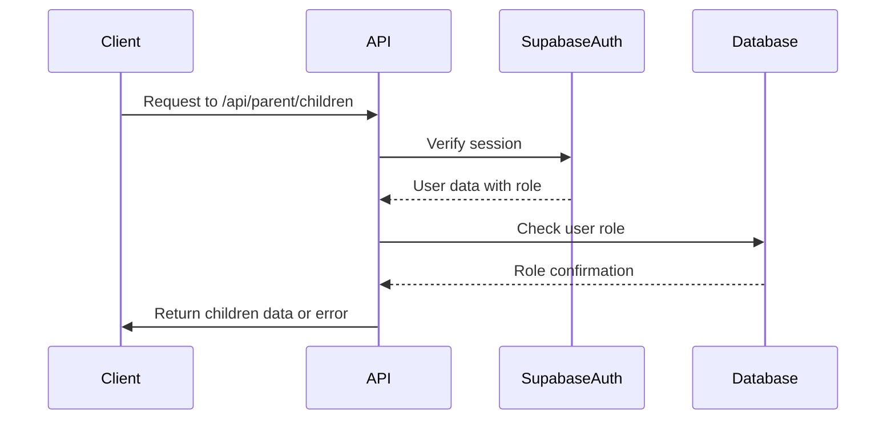
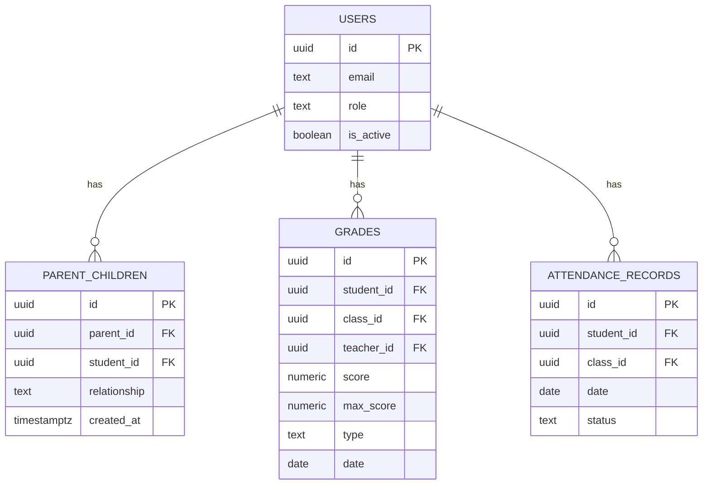
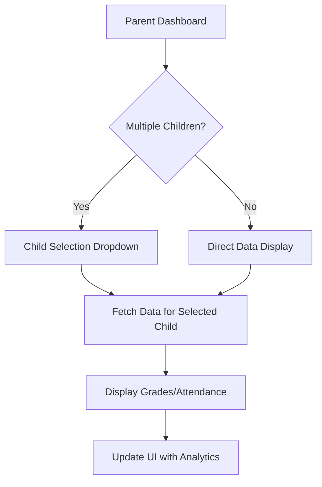
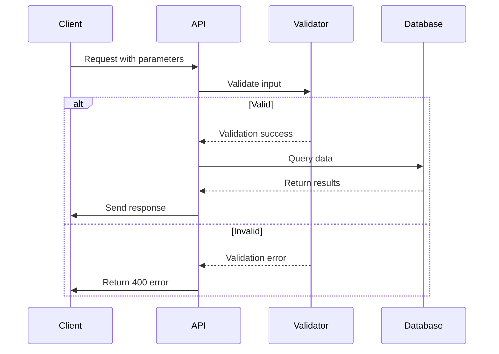

# Parent API Routes

<cite>
**Referenced Files in This Document**   
- [children/route.ts](file://app/api/parent/children/route.ts)
- [child/[id]/grades/route.ts](file://app/api/parent/child/[id]/grades/route.ts)
- [child/[id]/attendance/route.ts](file://app/api/parent/child/[id]/attendance/route.ts)
- [parent-store.ts](file://lib/parent-store.ts)
- [validation-schemas.ts](file://lib/validation-schemas.ts)
- [20260105082250_create_parent_tables.sql](file://supabase/migrations/20260105082250_create_parent_tables.sql)
- [grades/page.tsx](file://app/parent/grades/page.tsx)
- [attendance/page.tsx](file://app/parent/attendance/page.tsx)
- [session-security.ts](file://lib/session-security.ts)
- [security.ts](file://lib/security.ts)
- [analytics-store.ts](file://lib/analytics-store.ts)
- [attendance-utils.ts](file://lib/attendance-utils.ts)
</cite>

## Table of Contents
1. [Introduction](#introduction)
2. [Core API Endpoints](#core-api-endpoints)
3. [Authentication and Authorization](#authentication-and-authorization)
4. [Data Access Control via RLS](#data-access-control-via-rls)
5. [Frontend Integration](#frontend-integration)
6. [Security Considerations](#security-considerations)
7. [Error Handling](#error-handling)
8. [Performance Optimization](#performance-optimization)
9. [Conclusion](#conclusion)

## Introduction
The Parent API routes provide secure access to student data for authorized parents within the school management system. These endpoints enable parents to retrieve information about their linked children, access academic performance data such as grades, and monitor attendance records. The system implements robust security measures including role-based access control, Supabase Row Level Security (RLS) policies, and session validation to ensure data privacy and prevent unauthorized access.

**Section sources**
- [children/route.ts](file://app/api/parent/children/route.ts#L1-L74)
- [child/[id]/grades/route.ts](file://app/api/parent/child/[id]/grades/route.ts#L1-L61)
- [child/[id]/attendance/route.ts](file://app/api/parent/child/[id]/attendance/route.ts#L1-L79)

## Core API Endpoints

### Retrieve Linked Children
The `/api/parent/children` endpoint allows parents to fetch a list of their linked children with associated profile information.

**HTTP Method**: GET  
**Authentication**: Required (Parent role)  
**Response Schema**: 
```json
{
  "children": [
    {
      "id": "string",
      "name": "string",
      "email": "string",
      "avatar": "string",
      "grade": "string",
      "section": "string",
      "relationship": "string"
    }
  ]
}
```

This endpoint performs the following operations:
1. Validates user authentication and parent role
2. Queries the `parent_children` relationship table
3. Joins with user and student profile data
4. Returns comprehensive child information

**Section sources**
- [children/route.ts](file://app/api/parent/children/route.ts#L1-L74)

### Access Child Academic Data
The `/api/parent/child/[id]/grades` endpoint enables parents to retrieve academic performance data for a specific child.

**HTTP Method**: GET  
**Authentication**: Required (Parent role)  
**Path Parameter**: `id` (Student UUID)  
**Response Schema**: 
```json
{
  "grades": [
    {
      "student_id": "string",
      "class": {
        "id": "string",
        "name": "string",
        "subject": "string"
      },
      "teacher": {
        "id": "string",
        "name": "string"
      },
      "score": "number",
      "maxScore": "number",
      "type": "string",
      "date": "string"
    }
  ]
}
```

The endpoint verifies the parent-child relationship before returning grade records, ensuring data access is restricted to authorized parents only.

**Section sources**
- [child/[id]/grades/route.ts](file://app/api/parent/child/[id]/grades/route.ts#L1-L61)

### Monitor Attendance Records
The `/api/parent/child/[id]/attendance` endpoint provides access to a child's attendance history with optional date filtering.

**HTTP Method**: GET  
**Authentication**: Required (Parent role)  
**Path Parameter**: `id` (Student UUID)  
**Query Parameters**: 
- `startDate`: Filter records from this date
- `endDate`: Filter records to this date

**Response Schema**: 
```json
{
  "attendance": [
    {
      "student_id": "string",
      "class": {
        "id": "string",
        "name": "string",
        "subject": "string"
      },
      "date": "string",
      "status": "present|absent|late|excused"
    }
  ],
  "stats": {
    "present": "number",
    "absent": "number",
    "late": "number",
    "excused": "number",
    "total": "number",
    "rate": "number"
  }
}
```

The response includes calculated attendance statistics such as attendance rate percentage.

**Section sources**
- [child/[id]/attendance/route.ts](file://app/api/parent/child/[id]/attendance/route.ts#L1-L79)

## Authentication and Authorization

### Role-Based Access Control
All parent API routes implement strict role-based access control. The authentication flow includes:

1. User authentication via Supabase Auth
2. Role verification (must be "parent")
3. Session validation

The system uses Next.js middleware and Supabase's built-in authentication to validate user sessions before processing API requests.



**Diagram sources**
- [children/route.ts](file://app/api/parent/children/route.ts#L5-L21)
- [proxy.ts](file://proxy.ts#L251-L258)

**Section sources**
- [children/route.ts](file://app/api/parent/children/route.ts#L5-L21)
- [child/[id]/grades/route.ts](file://app/api/parent/child/[id]/grades/route.ts#L13-L25)
- [child/[id]/attendance/route.ts](file://app/api/parent/child/[id]/attendance/route.ts#L13-L26)

## Data Access Control via RLS

### Supabase RLS Policies
The system implements Row Level Security (RLS) policies in Supabase to enforce data access restrictions at the database level. The parent-child relationship is managed through the `parent_children` table with the following RLS policies:

```sql
-- Parents can view their own children
CREATE POLICY "Parents can view their own children" ON parent_children
  FOR SELECT USING (parent_id = auth.uid());

-- Parents can view their children's grades
CREATE POLICY "Parents can view their children's grades" ON grades
  FOR SELECT USING (
    EXISTS (
      SELECT 1 FROM parent_children pc 
      WHERE pc.parent_id = auth.uid() AND pc.student_id = grades.student_id
    )
  );

-- Parents can view their children's attendance
CREATE POLICY "Parents can view their children's attendance" ON attendance_records
  FOR SELECT USING (
    EXISTS (
      SELECT 1 FROM parent_children pc 
      WHERE pc.parent_id = auth.uid() AND pc.student_id = attendance_records.student_id
    )
  );
```

These policies ensure that parents can only access data for students they are explicitly linked to, preventing unauthorized data access even if API-level checks were bypassed.



**Diagram sources**
- [20260105082250_create_parent_tables.sql](file://supabase/migrations/20260105082250_create_parent_tables.sql#L19-L48)
- [parent-store.ts](file://lib/parent-store.ts#L6-L14)

**Section sources**
- [20260105082250_create_parent_tables.sql](file://supabase/migrations/20260105082250_create_parent_tables.sql#L19-L48)

## Frontend Integration

### Parent Dashboard Components
The parent API routes are consumed by dashboard components that provide a user-friendly interface for viewing child data.

#### Grades Dashboard
The `grades/page.tsx` component uses the parent store to manage child selection and display academic performance:

- Implements child selection for parents with multiple children
- Displays overall average with improvement trend
- Shows subject-specific performance with progress indicators
- Visualizes grade trends using line charts
- Presents recent grades in a list format

#### Attendance Dashboard
The `attendance/page.tsx` component provides comprehensive attendance monitoring:

- Displays attendance rate with progress bar
- Shows breakdown by status (present, absent, late, excused)
- Visualizes recent attendance records
- Uses color-coded indicators for different attendance statuses
- Provides statistical summary of attendance patterns

Both components use client-side state management through Zustand stores to optimize performance and reduce API calls.



**Section sources**
- [grades/page.tsx](file://app/parent/grades/page.tsx#L1-L214)
- [attendance/page.tsx](file://app/parent/attendance/page.tsx#L1-L175)
- [parent-store.ts](file://lib/parent-store.ts#L24-L65)
- [analytics-store.ts](file://lib/analytics-store.ts#L39-L83)

## Security Considerations

### Session Security
The system implements comprehensive session security measures:

- **Session Binding**: Each session is bound to device fingerprint
- **Absolute Timeout**: 8-hour maximum session duration
- **Single Session Enforcement**: Only one active session per user
- **Fingerprint Validation**: Client environment validation on each request

The session security system uses cryptographic hashing of device characteristics to detect potential session hijacking attempts.

### Protection Against ID Enumeration
The API endpoints protect against ID enumeration attacks by:

1. Validating parent-child relationships before processing requests
2. Returning generic "Forbidden" errors for unauthorized access attempts
3. Implementing rate limiting to prevent brute force attacks
4. Using UUIDs instead of sequential IDs

### Input Validation
All API endpoints use Zod validation schemas to prevent injection attacks and ensure data integrity:

```typescript
// Validation schema for parent-child linking
export const linkParentChildSchema = z.object({
  parentId: z.string().uuid(),
  studentId: z.string().uuid(),
  relationship: z.enum(['father', 'mother', 'guardian', 'other']).optional(),
})
```

The validation system ensures that all inputs conform to expected formats and types.



**Diagram sources**
- [validation-schemas.ts](file://lib/validation-schemas.ts#L95-L105)
- [session-security.ts](file://lib/session-security.ts#L154-L227)
- [security.ts](file://lib/security.ts#L6-L67)

**Section sources**
- [validation-schemas.ts](file://lib/validation-schemas.ts#L95-L105)
- [session-security.ts](file://lib/session-security.ts#L154-L227)
- [security.ts](file://lib/security.ts#L6-L67)

## Error Handling

### Unauthorized Access
The API returns standardized error responses for unauthorized access attempts:

- **401 Unauthorized**: No valid authentication session
- **403 Forbidden**: User authenticated but lacks required role or permissions
- **500 Internal Server Error**: Unexpected server-side errors

When a parent attempts to access data for a child they are not linked to, the system returns a 403 Forbidden response with a generic error message to prevent information disclosure.

### Error Response Structure
All error responses follow a consistent format:

```json
{
  "error": "Descriptive error message"
}
```

The system avoids exposing sensitive information in error messages and logs detailed error information server-side for debugging purposes.

**Section sources**
- [children/route.ts](file://app/api/parent/children/route.ts#L9-L11)
- [child/[id]/grades/route.ts](file://app/api/parent/child/[id]/grades/route.ts#L13-L15)
- [child/[id]/attendance/route.ts](file://app/api/parent/child/[id]/attendance/route.ts#L13-L15)
- [api-errors.ts](file://lib/api-errors.ts#L38-L41)

## Performance Optimization

### Data Fetching Strategy
The system implements several performance optimizations:

- **Batched Queries**: Related data is fetched in single database queries using table joins
- **Client-Side Caching**: Parent store maintains cached data to reduce API calls
- **Selective Field Selection**: Only required fields are retrieved from database
- **Indexing**: Database indexes on frequently queried columns

### Analytics Processing
The attendance and grade data is processed efficiently:

- **Server-Side Calculation**: Attendance statistics are calculated server-side
- **Client-Side Aggregation**: Analytics store provides pre-calculated metrics
- **Lazy Loading**: Data is fetched only when needed

The `calculateAttendanceStats` utility function efficiently processes attendance records to generate comprehensive statistics:

```typescript
export function calculateAttendanceStats(
  records: Array<{ status: AttendanceStatus }>
): AttendanceStats {
  const stats = records.reduce(
    (acc, record) => {
      if (record.status in acc) {
        acc[record.status]++
      }
      acc.total++
      return acc
    },
    { present: 0, absent: 0, late: 0, excused: 0, total: 0 }
  )
  
  const attendanceRate = stats.total > 0 
    ? Math.round(((stats.present + stats.late) / stats.total) * 100) 
    : 0
  
  return { ...stats, rate: attendanceRate }
}
```

**Section sources**
- [attendance-utils.ts](file://lib/attendance-utils.ts#L17-L42)
- [analytics-store.ts](file://lib/analytics-store.ts#L61-L66)
- [children/route.ts](file://app/api/parent/children/route.ts#L25-L38)

## Conclusion
The Parent API routes provide a secure and efficient interface for parents to access their children's academic and attendance information. The system combines multiple layers of security including role-based access control, Supabase RLS policies, session validation, and input validation to protect sensitive student data. The frontend components leverage client-side state management to optimize performance and provide a responsive user experience. The architecture ensures that parents can only access data for their linked children while providing comprehensive monitoring capabilities for academic performance and attendance patterns.