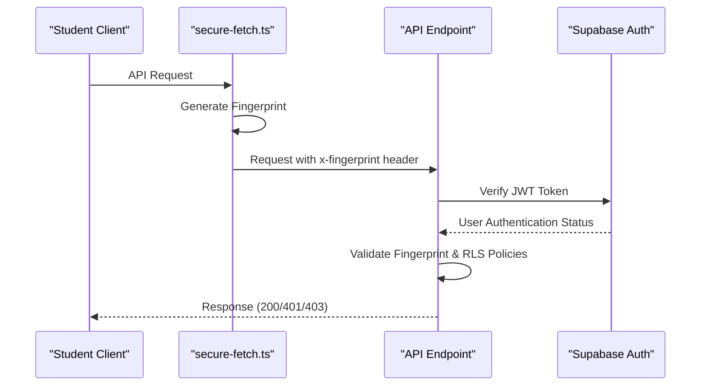
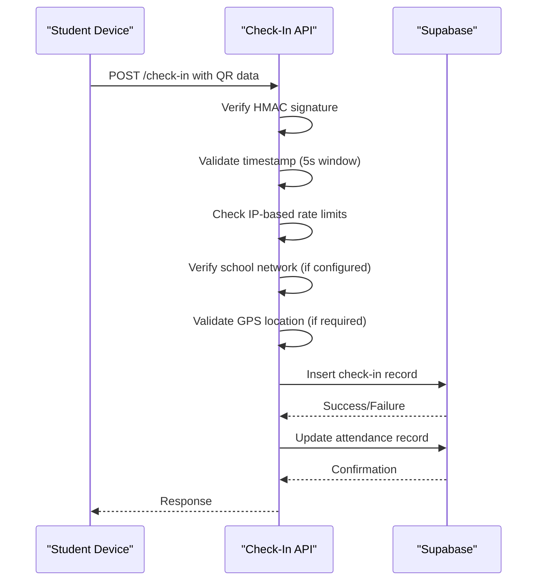
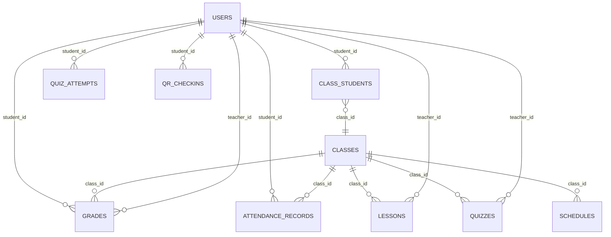
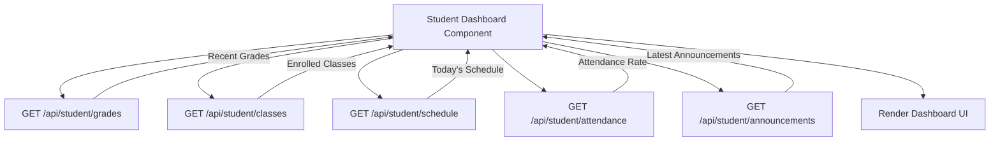
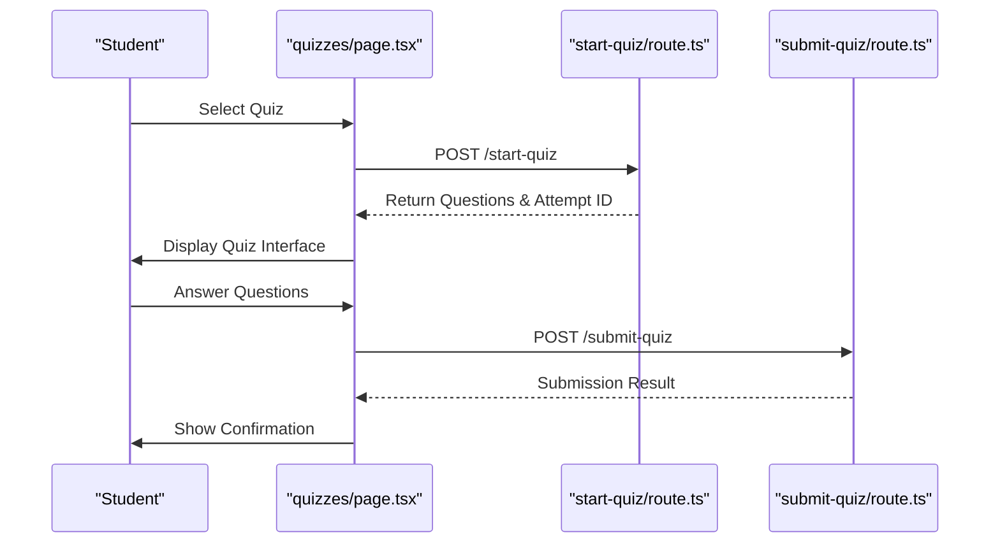
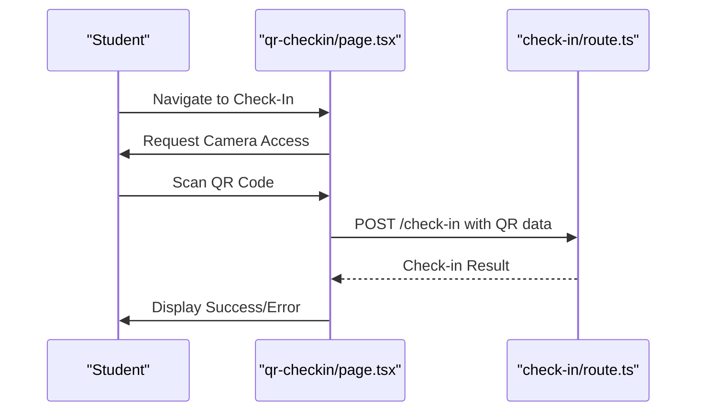
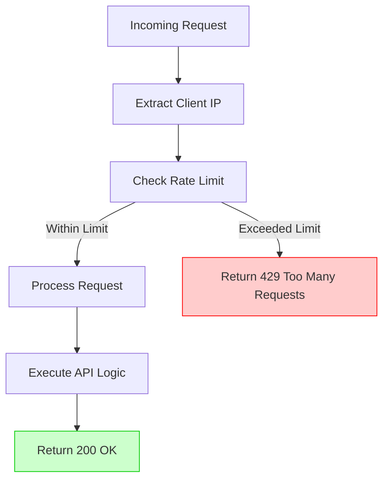
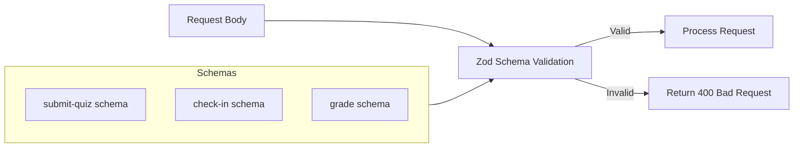
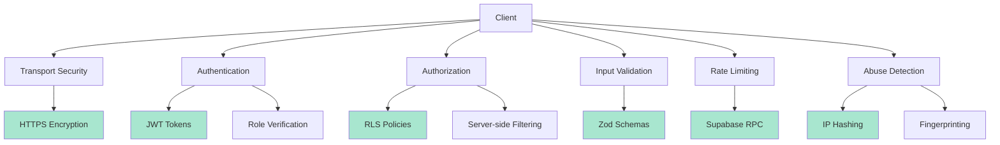

# Student API Routes

<cite>
**Referenced Files in This Document**   
- [check-in/route.ts](file://app/api/student/check-in/route.ts)
- [grades/route.ts](file://app/api/student/grades/route.ts)
- [classes/route.ts](file://app/api/student/classes/route.ts)
- [lessons/route.ts](file://app/api/student/lessons/route.ts)
- [schedule/route.ts](file://app/api/student/schedule/route.ts)
- [announcements/route.ts](file://app/api/student/announcements/route.ts)
- [quizzes/route.ts](file://app/api/student/quizzes/route.ts)
- [dashboard/route.ts](file://app/api/student/dashboard/route.ts)
- [attendance/route.ts](file://app/api/student/attendance/route.ts)
- [secure-fetch.ts](file://lib/secure-fetch.ts)
- [validation-schemas.ts](file://lib/validation-schemas.ts)
- [rate-limit.ts](file://lib/rate-limit.ts)
- [student-validation.ts](file://lib/student-validation.ts)
- [start-quiz/route.ts](file://app/api/student/start-quiz/route.ts)
- [submit-quiz/route.ts](file://app/api/student/submit-quiz/route.ts)
- [qr-checkin/page.tsx](file://app/student/qr-checkin/page.tsx)
- [quizzes/page.tsx](file://app/student/quizzes/page.tsx)
</cite>

## Table of Contents
1. [Introduction](#introduction)
2. [Authentication and Security](#authentication-and-security)
3. [Core Student Endpoints](#core-student-endpoints)
   - [Grades Access](#grades-access)
   - [Classes Enrollment](#classes-enrollment)
   - [Lessons Access](#lessons-access)
   - [Schedule Retrieval](#schedule-retrieval)
   - [Announcements](#announcements)
   - [Attendance Records](#attendance-records)
4. [Quiz Interaction Endpoints](#quiz-interaction-endpoints)
   - [Quiz Listing](#quiz-listing)
   - [Start Quiz](#start-quiz)
   - [Submit Quiz](#submit-quiz)
5. [Attendance Check-In System](#attendance-check-in-system)
   - [QR Check-In](#qr-check-in)
6. [Data Isolation and RLS Policies](#data-isolation-and-rls-policies)
7. [Integration Examples](#integration-examples)
   - [Student Dashboard](#student-dashboard)
   - [Quiz Interface](#quiz-interface)
   - [QR Check-In Component](#qr-check-in-component)
8. [Error Handling](#error-handling)
9. [Rate Limiting](#rate-limiting)
10. [Validation Rules](#validation-rules)
11. [Security Considerations](#security-considerations)

## Introduction
This document provides comprehensive documentation for student-facing API endpoints in the School Management System. The API routes under `app/api/student/` enable students to interact with core academic functionalities including quiz participation, attendance check-in, academic data access, and communication. All endpoints enforce strict data isolation through Supabase Row Level Security (RLS) policies, ensuring students can only access their own data based on their authenticated user ID.

The API is designed with security as a primary concern, implementing JWT-based authentication, rate limiting, request validation, and additional security measures such as fingerprinting and IP-based restrictions for sensitive operations like attendance check-in.

**Section sources**
- [check-in/route.ts](file://app/api/student/check-in/route.ts)
- [grades/route.ts](file://app/api/student/grades/route.ts)
- [classes/route.ts](file://app/api/student/classes/route.ts)

## Authentication and Security
All student API endpoints require authentication via JWT tokens managed by Supabase Auth. The system uses a secure-fetch mechanism that automatically includes client fingerprinting for session validation on protected routes.



**Diagram sources**
- [secure-fetch.ts](file://lib/secure-fetch.ts)
- [check-in/route.ts](file://app/api/student/check-in/route.ts)

### Authentication Flow
1. User logs in through the authentication system
2. Supabase issues a JWT token stored in a secure HTTP-only cookie
3. All subsequent API requests automatically include authentication context
4. Each API endpoint verifies the user's identity and role
5. The `secureFetch` utility adds a client fingerprint to all requests for additional session validation

**Section sources**
- [secure-fetch.ts](file://lib/secure-fetch.ts)
- [check-in/route.ts](file://app/api/student/check-in/route.ts)

## Core Student Endpoints

### Grades Access
The grades endpoint allows students to retrieve their academic performance data across all enrolled classes.

**Endpoint**: `GET /api/student/grades`

**Authentication**: Required (JWT)
**Authorization**: Students only
**Response Format**:
```json
{
  "grades": [
    {
      "id": "string",
      "class_id": "string",
      "type": "quiz|exam|assignment|project|participation",
      "score": "number",
      "max_score": "number",
      "percentage": "number",
      "grade": "string",
      "date": "string",
      "class": {
        "name": "string"
      }
    }
  ]
}
```

The endpoint enforces data isolation by only returning grades where the `student_id` matches the authenticated user's ID through Supabase RLS policies.

**Section sources**
- [grades/route.ts](file://app/api/student/grades/route.ts)

### Classes Enrollment
Students can retrieve information about all classes they are enrolled in, including class details and teacher information.

**Endpoint**: `GET /api/student/classes`

**Authentication**: Required (JWT)
**Authorization**: Students only
**Response Format**:
```json
{
  "classes": [
    {
      "id": "string",
      "name": "string",
      "subject": "string",
      "schedule": "string",
      "room": "string",
      "teacher_name": "string",
      "teacher_avatar": "string",
      "student_count": "number"
    }
  ]
}
```

The endpoint first retrieves the student's class enrollments, then fetches class details and calculates student counts for each class.

**Section sources**
- [classes/route.ts](file://app/api/student/classes/route.ts)

### Lessons Access
Students can access lesson materials and content for all their enrolled classes.

**Endpoint**: `GET /api/student/lessons`

**Authentication**: Required (JWT)
**Authorization**: Students only
**Response Format**:
```json
{
  "lessons": [
    {
      "id": "string",
      "title": "string",
      "description": "string",
      "content": "string",
      "class_name": "string",
      "teacher_name": "string",
      "materials": [
        {
          "id": "string",
          "name": "string",
          "type": "string",
          "url": "string",
          "size": "string"
        }
      ]
    }
  ]
}
```

The endpoint ensures data isolation by only fetching lessons for classes in which the student is enrolled.

**Section sources**
- [lessons/route.ts](file://app/api/student/lessons/route.ts)

### Schedule Retrieval
Students can retrieve their class schedule across all enrolled classes.

**Endpoint**: `GET /api/student/schedule`

**Authentication**: Required (JWT)
**Authorization**: Students only
**Response Format**:
```json
{
  "schedule": [
    {
      "id": "string",
      "day": "string",
      "start_time": "string",
      "end_time": "string",
      "room": "string",
      "class_name": "string",
      "subject": "string",
      "teacher_name": "string"
    }
  ]
}
```

The schedule is organized by day of the week and time, providing a comprehensive view of the student's academic timetable.

**Section sources**
- [schedule/route.ts](file://app/api/student/schedule/route.ts)

### Announcements
Students receive personalized announcements based on their grade level and enrollment status.

**Endpoint**: `GET /api/student/announcements`

**Authentication**: Required (JWT)
**Authorization**: Students only
**Response Format**:
```json
{
  "announcements": [
    {
      "id": "string",
      "title": "string",
      "content": "string",
      "target_audience": "all|students|grade-{grade}",
      "priority": "low|normal|high|urgent",
      "created_at": "string",
      "author": {
        "name": "string"
      }
    }
  ]
}
```

The endpoint implements intelligent filtering, showing announcements targeted at:
- All users (`target_audience=all`)
- All students (`target_audience=students`)
- Specific grade levels (`target_audience=grade-{grade}`)

**Section sources**
- [announcements/route.ts](file://app/api/student/announcements/route.ts)

### Attendance Records
Students can view their personal attendance history across all classes.

**Endpoint**: `GET /api/student/attendance`

**Authentication**: Required (JWT)
**Authorization**: Students only
**Response Format**:
```json
{
  "records": [
    {
      "id": "string",
      "date": "string",
      "status": "present|absent|late|excused",
      "class": {
        "name": "string"
      }
    }
  ]
}
```

Data isolation is enforced by only returning attendance records where the `student_id` matches the authenticated user.

**Section sources**
- [attendance/route.ts](file://app/api/student/attendance/route.ts)

## Quiz Interaction Endpoints

### Quiz Listing
Students can retrieve a list of available quizzes for their enrolled classes.

**Endpoint**: `GET /api/student/quizzes`

**Authentication**: Required (JWT)
**Authorization**: Students only
**Response Format**:
```json
{
  "quizzes": [
    {
      "id": "string",
      "title": "string",
      "description": "string",
      "duration": "number",
      "due_date": "string",
      "teacher_id": "string",
      "class_id": "string",
      "class": {
        "name": "string"
      }
    }
  ]
}
```

Security Note: Quiz questions are not included in this response. They are only accessible when starting a quiz to prevent premature exposure.

**Section sources**
- [quizzes/route.ts](file://app/api/student/quizzes/route.ts)

### Start Quiz
Initiates a quiz session and returns the quiz questions and configuration.

**Endpoint**: `POST /api/student/start-quiz`

**Authentication**: Required (JWT)
**Authorization**: Students only
**Request Body**:
```json
{
  "quizId": "string"
}
```

**Response Format**:
```json
{
  "quiz": {
    "id": "string",
    "title": "string",
    "duration": "number",
    "questions": [
      {
        "id": "string",
        "question": "string",
        "type": "multiple-choice|true-false|short-answer",
        "options": ["string"]
      }
    ]
  },
  "attemptId": "string"
}
```

The endpoint creates a quiz attempt record and returns the questions for the specified quiz, enforcing that the student is enrolled in the associated class.

**Section sources**
- [start-quiz/route.ts](file://app/api/student/start-quiz/route.ts)

### Submit Quiz
Submits quiz answers for grading.

**Endpoint**: `POST /api/student/submit-quiz`

**Authentication**: Required (JWT)
**Authorization**: Students only
**Rate Limit**: 5 submissions per 10 minutes per student
**Request Body**:
```json
{
  "attemptId": "string",
  "answers": [
    {
      "questionId": "string",
      "answer": "string|number|array"
    }
  ]
}
```

**Response Format**:
```json
{
  "success": "boolean",
  "message": "string"
}
```

The endpoint validates the submission against the quiz attempt, checks for timeouts, and processes the answers for grading. Submissions after the quiz duration results in a timeout error.

**Section sources**
- [submit-quiz/route.ts](file://app/api/student/submit-quiz/route.ts)

## Attendance Check-In System

### QR Check-In
Enables students to check in to classes using QR codes generated by teachers.

**Endpoint**: `POST /api/student/check-in`

**Authentication**: Required (JWT)
**Authorization**: Students only
**Rate Limit**: 20 attempts per 10 minutes per IP
**Request Body**:
```json
{
  "qrData": "string",
  "latitude": "number",
  "longitude": "number"
}
```

**Response Format**:
```json
{
  "success": "boolean",
  "error": "string"
}
```

#### Security Features
1. **QR Code Security**: QR data contains a timestamp and HMAC signature to prevent replay attacks
2. **Network Fencing**: Optional enforcement of school Wi-Fi network for check-in
3. **Rate Limiting**: Prevents brute force attempts
4. **Location Verification**: GPS coordinates verified against school geofence
5. **IP Hashing**: Raw IP addresses are hashed for privacy-preserving abuse detection



**Diagram sources**
- [check-in/route.ts](file://app/api/student/check-in/route.ts)

**Section sources**
- [check-in/route.ts](file://app/api/student/check-in/route.ts)

## Data Isolation and RLS Policies
The system enforces strict data isolation through Supabase Row Level Security (RLS) policies, ensuring students can only access their own data.



**Diagram sources**
- [grades/route.ts](file://app/api/student/grades/route.ts)
- [attendance/route.ts](file://app/api/student/attendance/route.ts)
- [classes/route.ts](file://app/api/student/classes/route.ts)

All student API endpoints implement server-side enforcement by explicitly filtering queries with `.eq("student_id", user.id)`, providing defense in depth even if RLS policies were misconfigured.

**Section sources**
- [grades/route.ts](file://app/api/student/grades/route.ts)
- [attendance/route.ts](file://app/api/student/attendance/route.ts)
- [classes/route.ts](file://app/api/student/classes/route.ts)

## Integration Examples

### Student Dashboard
The student dashboard component integrates multiple API endpoints to provide a comprehensive overview.



**Diagram sources**
- [dashboard/route.ts](file://app/api/student/dashboard/route.ts)
- [quizzes/page.tsx](file://app/student/quizzes/page.tsx)

**Section sources**
- [dashboard/route.ts](file://app/api/student/dashboard/route.ts)

### Quiz Interface
The quiz interface orchestrates the quiz interaction flow.



**Diagram sources**
- [start-quiz/route.ts](file://app/api/student/start-quiz/route.ts)
- [submit-quiz/route.ts](file://app/api/student/submit-quiz/route.ts)
- [quizzes/page.tsx](file://app/student/quizzes/page.tsx)

**Section sources**
- [quizzes/page.tsx](file://app/student/quizzes/page.tsx)

### QR Check-In Component
The QR check-in component handles the attendance check-in process.



**Diagram sources**
- [check-in/route.ts](file://app/api/student/check-in/route.ts)
- [qr-checkin/page.tsx](file://app/student/qr-checkin/page.tsx)

**Section sources**
- [qr-checkin/page.tsx](file://app/student/qr-checkin/page.tsx)

## Error Handling
The API implements comprehensive error handling for various scenarios:

| Error Type | HTTP Status | Response Body | Source |
|------------|-----------|---------------|--------|
| Unauthorized Access | 401 | `{ error: "Unauthorized" }` | All endpoints |
| Forbidden Access | 403 | `{ error: "Forbidden" }` | Role validation |
| Invalid Request | 400 | `{ error: "Invalid QR code format" }` | Validation failures |
| Rate Limited | 429 | `{ error: "Too many attempts" }` | Rate limiting |
| Not Found | 404 | `{ error: "Invalid session" }` | Resource not found |
| Server Error | 500 | `{ error: "Internal Server Error" }` | Unexpected errors |

Quiz-specific errors include timeout detection and validation of answer formats against the validation schemas.

**Section sources**
- [check-in/route.ts](file://app/api/student/check-in/route.ts)
- [submit-quiz/route.ts](file://app/api/student/submit-quiz/route.ts)

## Rate Limiting
The system implements rate limiting to prevent abuse of sensitive endpoints:



**Diagram sources**
- [rate-limit.ts](file://lib/rate-limit.ts)
- [check-in/route.ts](file://app/api/student/check-in/route.ts)

Specific rate limits:
- **Check-in**: 20 attempts per 10 minutes per IP
- **Quiz Submission**: 5 submissions per 10 minutes per student
- **Login**: 5 attempts per 15 minutes per IP (fail-closed)

Implemented using Supabase RPC functions with atomic operations to prevent race conditions.

**Section sources**
- [rate-limit.ts](file://lib/rate-limit.ts)

## Validation Rules
Request data is validated using Zod schemas to ensure data integrity and prevent injection attacks.



**Diagram sources**
- [validation-schemas.ts](file://lib/validation-schemas.ts)

Key validation schemas:
- `submitQuizSchema`: Validates quiz answer format and structure
- `checkInSchema`: Validates QR data, coordinates, and timestamps
- `gradeSchema`: Ensures grade values are within acceptable ranges

**Section sources**
- [validation-schemas.ts](file://lib/validation-schemas.ts)

## Security Considerations
The student API implements multiple layers of security:



**Diagram sources**
- [secure-fetch.ts](file://lib/secure-fetch.ts)
- [rate-limit.ts](file://lib/rate-limit.ts)
- [check-in/route.ts](file://app/api/student/check-in/route.ts)

Key security features:
- **Data Isolation**: RLS policies and server-side filtering prevent unauthorized data access
- **Replay Attack Prevention**: QR codes include timestamps and HMAC signatures with 5-second validity
- **GPS Spoofing Detection**: Rejects perfect GPS matches (distance < 1m) as suspicious
- **Network Enforcement**: Optional school Wi-Fi requirement for attendance check-in
- **Privacy Protection**: IP addresses are hashed before storage
- **Client Fingerprinting**: Prevents session hijacking through device/browser characteristics

**Section sources**
- [check-in/route.ts](file://app/api/student/check-in/route.ts)
- [secure-fetch.ts](file://lib/secure-fetch.ts)
- [rate-limit.ts](file://lib/rate-limit.ts)