# Teacher API Routes

<cite>
**Referenced Files in This Document**   
- [dashboard/route.ts](file://app/api/teacher/dashboard/route.ts)
- [my-classes/route.ts](file://app/api/teacher/my-classes/route.ts)
- [classes/route.ts](file://app/api/teacher/classes/route.ts)
- [grades/class/[id]/route.ts](file://app/api/teacher/grades/class/[id]/route.ts)
- [grades/create/route.ts](file://app/api/teacher/grades/create/route.ts)
- [attendance/class-data/route.ts](file://app/api/teacher/attendance/class-data/route.ts)
- [attendance/save/route.ts](file://app/api/teacher/attendance/save/route.ts)
- [create-quiz/route.ts](file://app/api/teacher/create-quiz/route.ts)
- [generate-qr/route.ts](file://app/api/teacher/generate-qr/route.ts)
- [end-session/route.ts](file://app/api/teacher/end-session/route.ts)
- [validation-schemas.ts](file://lib/validation-schemas.ts)
- [teacher-assignment-manager.tsx](file://components/teacher-assignment-manager.tsx)
- [qr-code-generator.tsx](file://components/qr-code-generator.tsx)
</cite>

## Table of Contents
1. [Introduction](#introduction)
2. [Authentication and Authorization](#authentication-and-authorization)
3. [Class Management](#class-management)
4. [Grade Management](#grade-management)
5. [Attendance Tracking](#attendance-tracking)
6. [Quiz Management](#quiz-management)
7. [Dashboard and Real-Time Data](#dashboard-and-real-time-data)
8. [Validation and Security](#validation-and-security)
9. [Error Handling](#error-handling)
10. [Performance Considerations](#performance-considerations)

## Introduction
This document provides comprehensive documentation for the teacher-specific API endpoints in the School Management System. The APIs enable teachers to manage classes, grades, attendance, quizzes, and access dashboard data through secure, role-restricted endpoints. All endpoints require Supabase JWT authentication and enforce Row Level Security (RLS) policies to ensure data isolation between teachers. The system integrates with client components like `teacher-assignment-manager.tsx` and `qr-code-generator.tsx` to provide a complete teaching workflow.

## Authentication and Authorization
All teacher API endpoints require valid Supabase JWT authentication and explicit role verification. The authorization flow follows a three-step process:

1. **JWT Token Validation**: Extract and validate the user session from the Supabase authentication system
2. **Role Verification**: Query the users table to confirm the authenticated user has the "teacher" role
3. **Ownership Enforcement**: For class-specific operations, verify the teacher owns the class through teacher_id matching

The authentication is implemented consistently across all endpoints using the Supabase server client, ensuring that only authenticated teachers can access teacher-specific functionality.

**Section sources**
- [dashboard/route.ts](file://app/api/teacher/dashboard/route.ts#L8-L21)
- [my-classes/route.ts](file://app/api/teacher/my-classes/route.ts#L7-L22)

## Class Management

### My Classes Endpoint
The `/api/teacher/my-classes` endpoint retrieves a list of classes owned by the authenticated teacher. This endpoint returns basic class information including ID, name, grade level, and section.

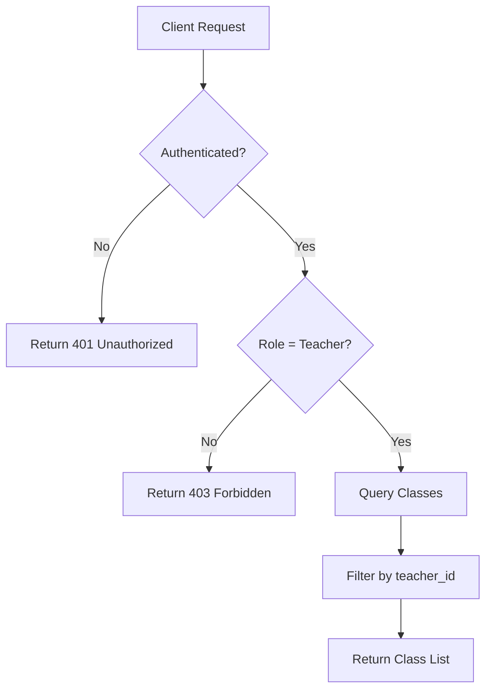

**Diagram sources**
- [my-classes/route.ts](file://app/api/teacher/my-classes/route.ts#L4-L30)

### Classes with Student Count
The `/api/teacher/classes` endpoint extends the class listing by including student enrollment counts. This provides teachers with immediate insight into class sizes.

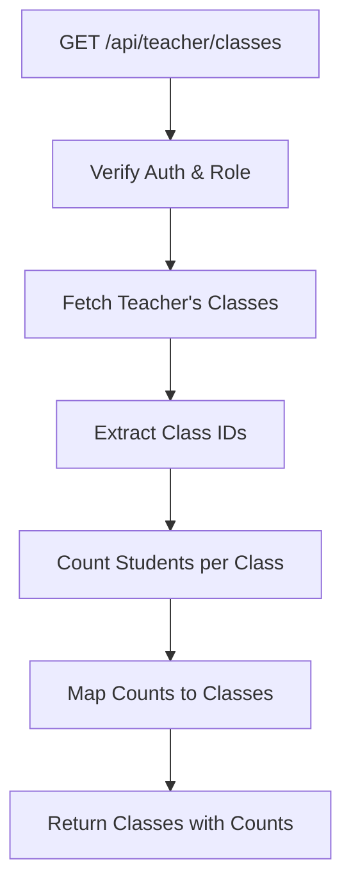

**Diagram sources**
- [classes/route.ts](file://app/api/teacher/classes/route.ts#L4-L54)

**Section sources**
- [classes/route.ts](file://app/api/teacher/classes/route.ts#L4-L59)
- [my-classes/route.ts](file://app/api/teacher/my-classes/route.ts#L4-L35)

## Grade Management

### Retrieve Class Grades
The `/api/teacher/grades/class/[id]` endpoint retrieves all grades for a specific class, including both manually entered grades and quiz attempt scores. The endpoint enforces strict ownership verification to prevent unauthorized access to grade data.

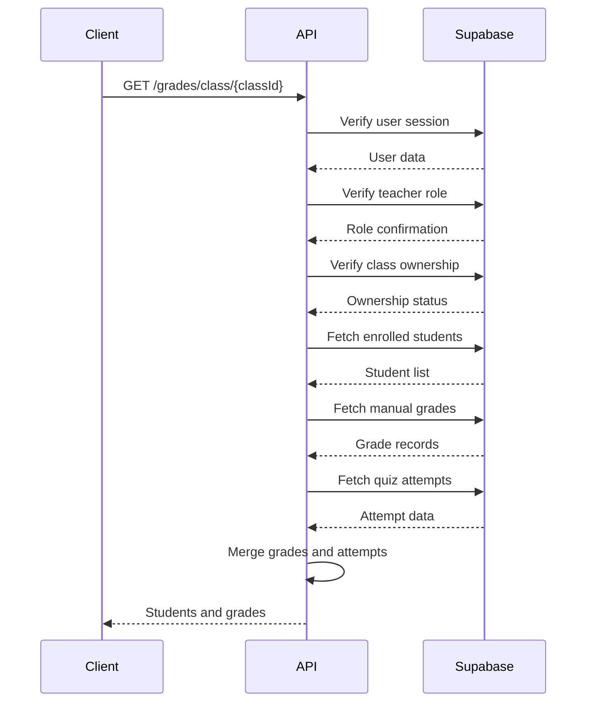

**Diagram sources**
- [grades/class/[id]/route.ts](file://app/api/teacher/grades/class/[id]/route.ts#L5-L101)

### Create Grade Record
The `/api/teacher/grades/create` endpoint allows teachers to create new grade records with comprehensive validation and rate limiting. The endpoint calculates percentage scores and Philippine grading system equivalents server-side to ensure consistency.

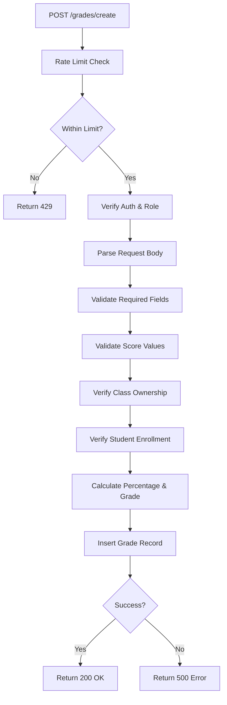

**Diagram sources**
- [grades/create/route.ts](file://app/api/teacher/grades/create/route.ts#L6-L105)

**Section sources**
- [grades/class/[id]/route.ts](file://app/api/teacher/grades/class/[id]/route.ts#L5-L101)
- [grades/create/route.ts](file://app/api/teacher/grades/create/route.ts#L6-L105)
- [validation-schemas.ts](file://lib/validation-schemas.ts#L50-L57)

## Attendance Tracking

### Retrieve Class Attendance Data
The `/api/teacher/attendance/class-data` endpoint provides the data needed to render an attendance-taking interface for a specific class on a given date. It returns the list of enrolled students and any existing attendance records.

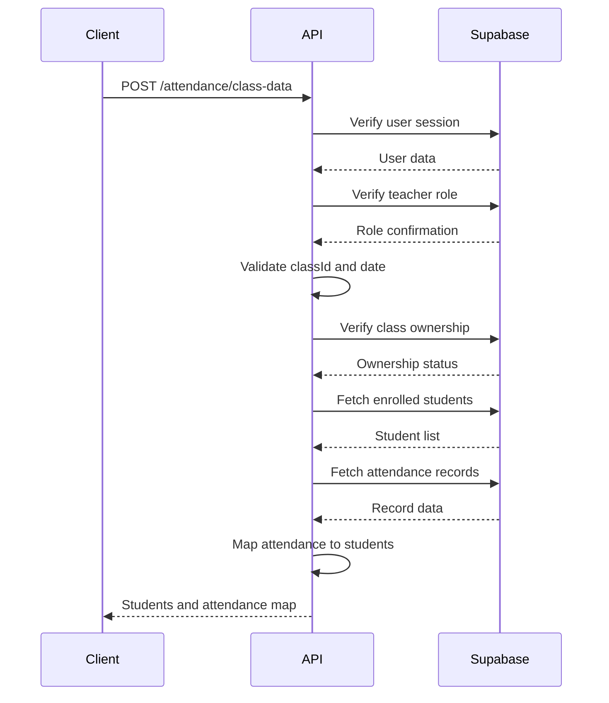

**Diagram sources**
- [attendance/class-data/route.ts](file://app/api/teacher/attendance/class-data/route.ts#L4-L67)

### Save Attendance Records
The `/api/teacher/attendance/save` endpoint securely saves multiple attendance records with batch validation. It includes a critical security feature that verifies the teacher owns all classes in the batch request.

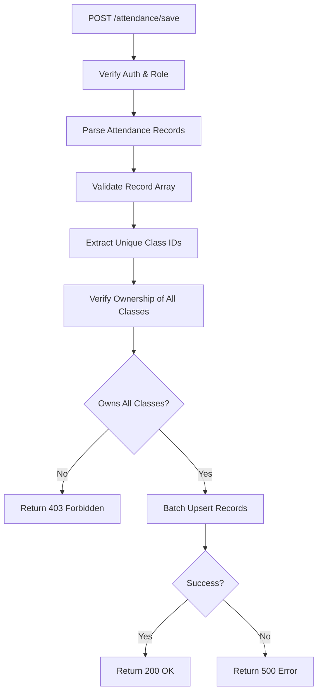

**Diagram sources**
- [attendance/save/route.ts](file://app/api/teacher/attendance/save/route.ts#L4-L58)

**Section sources**
- [attendance/class-data/route.ts](file://app/api/teacher/attendance/class-data/route.ts#L4-L67)
- [attendance/save/route.ts](file://app/api/teacher/attendance/save/route.ts#L4-L58)
- [validation-schemas.ts](file://lib/validation-schemas.ts#L60-L67)

## Quiz Management

### Create Quiz
The `/api/teacher/create-quiz` endpoint enables teachers to create quizzes with multiple question types. It uses Zod validation for comprehensive input sanitization and implements rate limiting to prevent abuse.

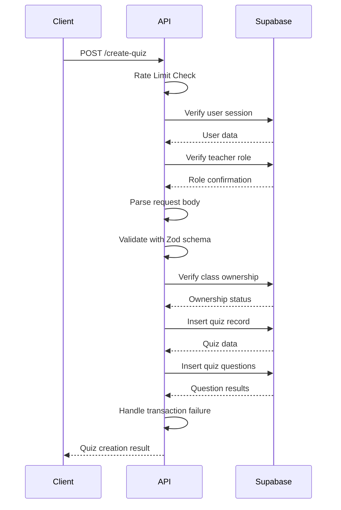

**Diagram sources**
- [create-quiz/route.ts](file://app/api/teacher/create-quiz/route.ts#L26-L124)

**Section sources**
- [create-quiz/route.ts](file://app/api/teacher/create-quiz/route.ts#L26-L124)
- [validation-schemas.ts](file://lib/validation-schemas.ts#L8-L24)

## Dashboard and Real-Time Data

### Teacher Dashboard
The `/api/teacher/dashboard` endpoint aggregates key metrics for the teacher dashboard, including class list, student count, attendance rate, and today's schedule. The data is strictly filtered to the teacher's classes.

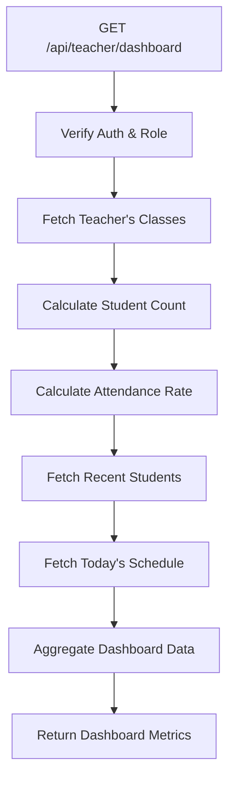

**Diagram sources**
- [dashboard/route.ts](file://app/api/teacher/dashboard/route.ts#L4-L128)

### QR-Based Attendance Sessions
The QR attendance system consists of three coordinated endpoints that enable secure, location-aware attendance taking:

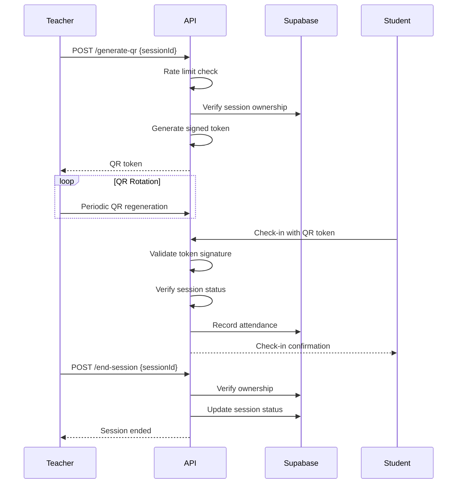

**Diagram sources**
- [generate-qr/route.ts](file://app/api/teacher/generate-qr/route.ts#L7-L79)
- [end-session/route.ts](file://app/api/teacher/end-session/route.ts#L4-L56)

**Section sources**
- [dashboard/route.ts](file://app/api/teacher/dashboard/route.ts#L4-L128)
- [generate-qr/route.ts](file://app/api/teacher/generate-qr/route.ts#L7-L79)
- [end-session/route.ts](file://app/api/teacher/end-session/route.ts#L4-L56)
- [qr-code-generator.tsx](file://components/qr-code-generator.tsx)

## Validation and Security

### Input Validation
All endpoints use strict validation to prevent injection attacks and ensure data integrity. The system employs Zod schemas for complex validation and simple conditional checks for basic validation.

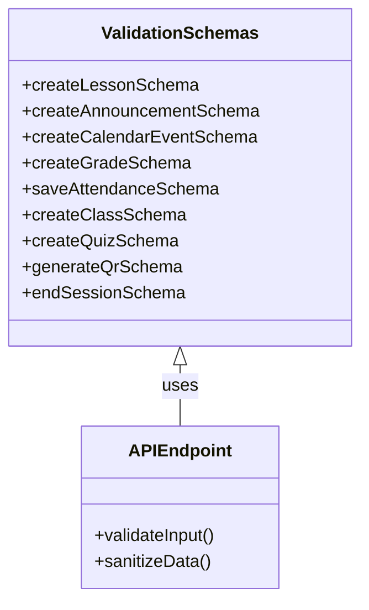

**Diagram sources**
- [validation-schemas.ts](file://lib/validation-schemas.ts#L8-L126)

### Security Measures
The teacher API implements multiple security layers including JWT authentication, role-based access control, RLS policies, rate limiting, and ownership verification.

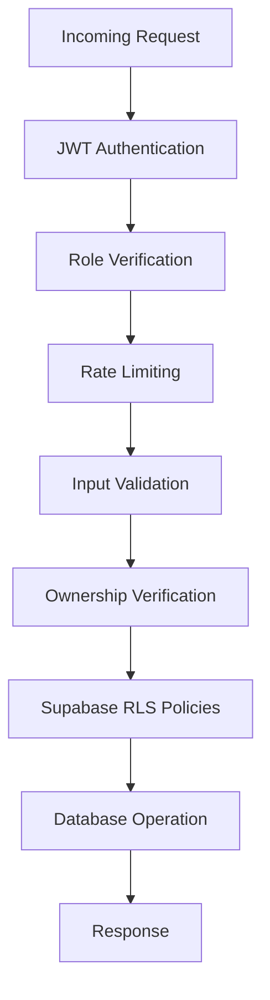

**Diagram sources**
- [dashboard/route.ts](file://app/api/teacher/dashboard/route.ts#L8-L21)
- [create-quiz/route.ts](file://app/api/teacher/create-quiz/route.ts#L28-L34)
- [generate-qr/route.ts](file://app/api/teacher/generate-qr/route.ts#L9-L17)

**Section sources**
- [validation-schemas.ts](file://lib/validation-schemas.ts#L8-L126)
- [create-quiz/route.ts](file://app/api/teacher/create-quiz/route.ts#L7-L25)
- [generate-qr/route.ts](file://app/api/teacher/generate-qr/route.ts#L7-L24)

## Error Handling
The API endpoints implement consistent error handling patterns with appropriate HTTP status codes:

| Status Code | Error Type | Description |
|-----------|-----------|-------------|
| 400 | Bad Request | Invalid or missing parameters |
| 401 | Unauthorized | Missing or invalid authentication |
| 403 | Forbidden | Insufficient permissions or ownership |
| 429 | Too Many Requests | Rate limit exceeded |
| 500 | Internal Server Error | Unexpected server error |

Error responses include descriptive messages to aid debugging while avoiding information leakage. The system logs detailed error information server-side for monitoring and troubleshooting.

**Section sources**
- [dashboard/route.ts](file://app/api/teacher/dashboard/route.ts#L124-L127)
- [my-classes/route.ts](file://app/api/teacher/my-classes/route.ts#L32-L34)
- [grades/create/route.ts](file://app/api/teacher/grades/create/route.ts#L102-L104)

## Performance Considerations
The teacher API endpoints are optimized for performance with several key strategies:

1. **Efficient Database Queries**: Use of Supabase's select() method with specific field selection to minimize data transfer
2. **Batch Operations**: Attendance records are processed in batches to reduce database round trips
3. **Caching Strategy**: Dashboard data aggregation reduces the need for client-side calculations
4. **Rate Limiting**: Prevents abuse and ensures fair resource usage across teachers
5. **Connection Pooling**: Supabase client reuses connections for improved efficiency

For large class datasets, the system implements pagination and limits on returned records to maintain responsiveness. The dashboard endpoint carefully balances comprehensive data retrieval with performance considerations by limiting student lists to 8 records and using count queries for statistics.

**Section sources**
- [dashboard/route.ts](file://app/api/teacher/dashboard/route.ts#L68-L69)
- [create-quiz/route.ts](file://app/api/teacher/create-quiz/route.ts#L28-L34)
- [attendance/save/route.ts](file://app/api/teacher/attendance/save/route.ts#L33-L45)