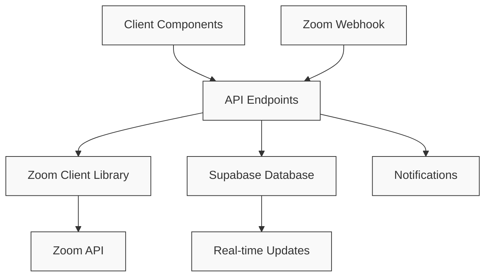
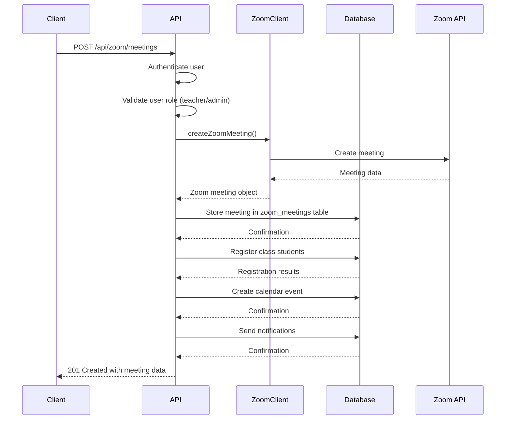
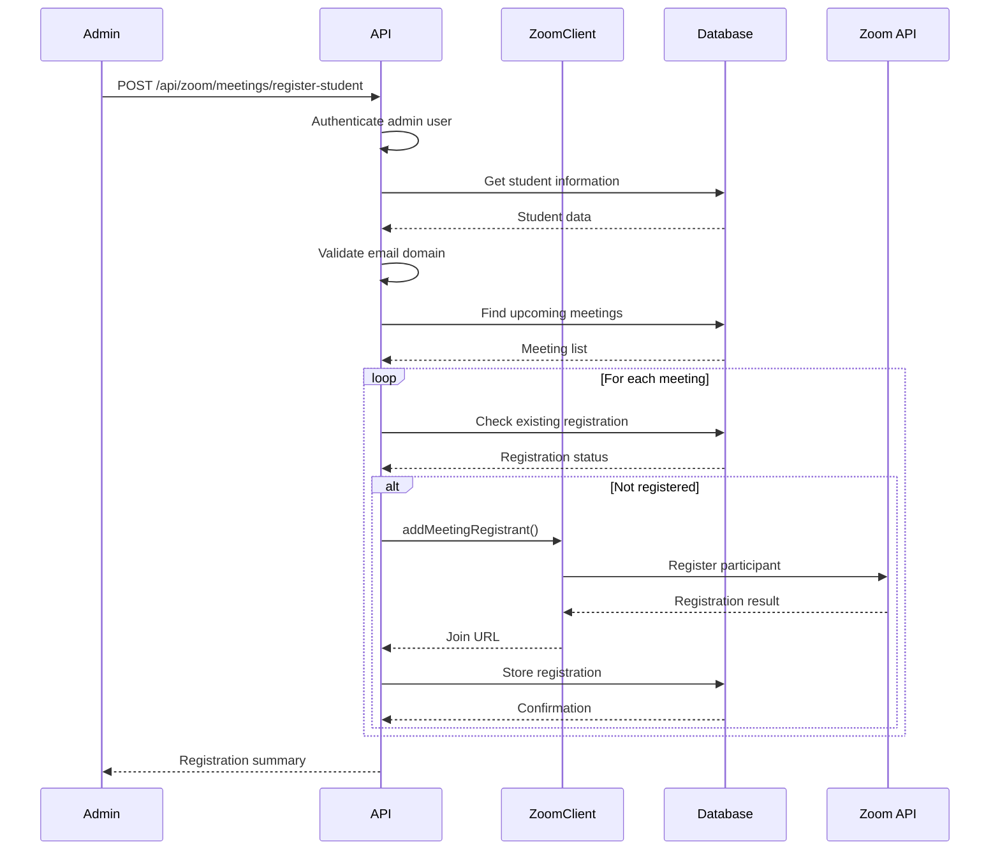
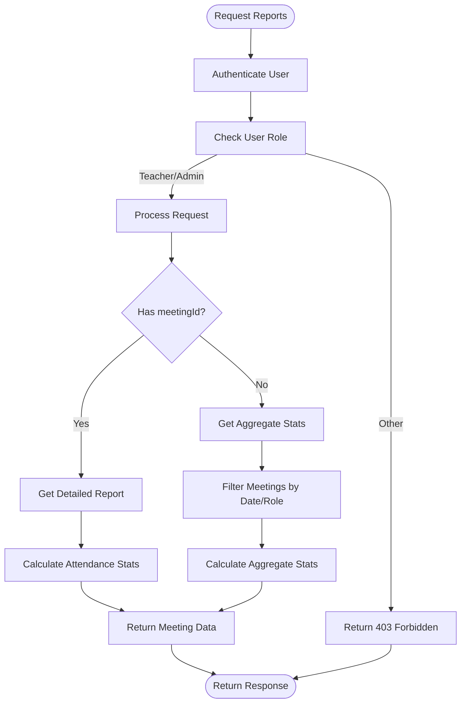
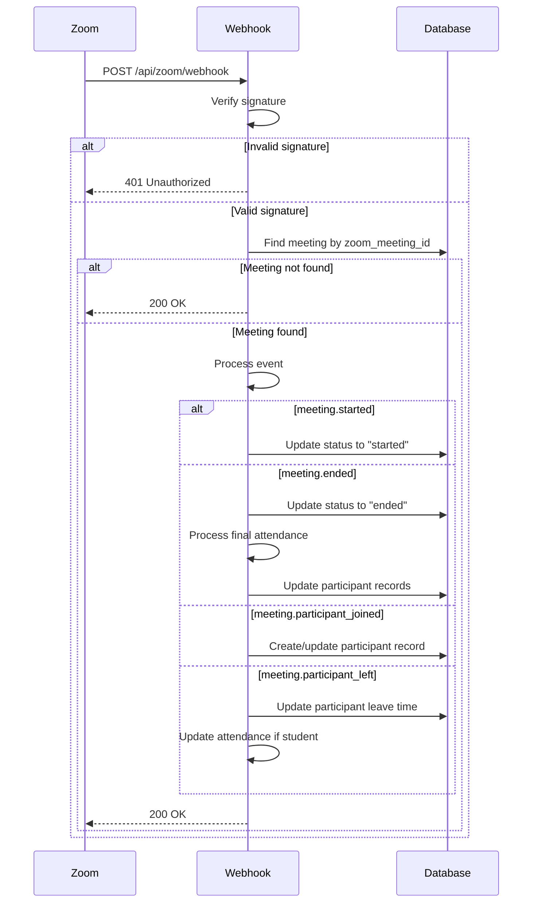
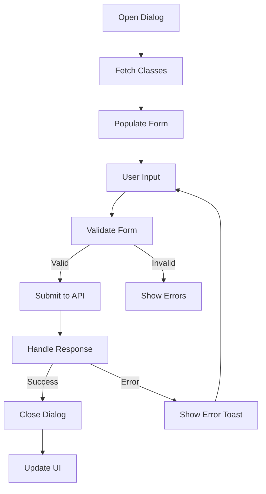
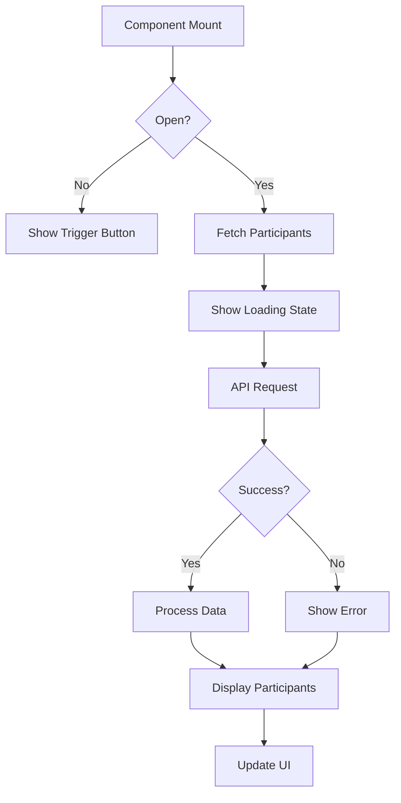
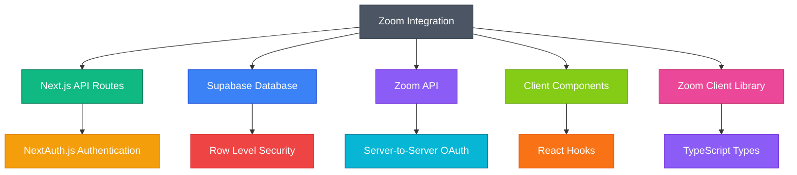

# Zoom Integration API Routes

<cite>
**Referenced Files in This Document**   
- [client.ts](file://lib/zoom/client.ts)
- [types.ts](file://lib/zoom/types.ts)
- [constants.ts](file://lib/zoom/constants.ts)
- [index.ts](file://lib/zoom/index.ts)
- [route.ts](file://app/api/zoom/meetings/route.ts)
- [route.ts](file://app/api/zoom/meetings/register-student/route.ts)
- [route.ts](file://app/api/zoom/meetings/[id]/route.ts)
- [route.ts](file://app/api/zoom/meetings/[id]/participants/route.ts)
- [route.ts](file://app/api/zoom/reports/route.ts)
- [route.ts](file://app/api/zoom/webhook/route.ts)
- [zoom-meeting-dialog.tsx](file://components/zoom-meeting-dialog.tsx)
- [zoom-participants-section.tsx](file://components/zoom-participants-section.tsx)
- [create_zoom_meetings_table.sql](file://supabase/migrations/20260110000001_create_zoom_meetings_table.sql)
- [create_meeting_registrants_table.sql](file://supabase/migrations/20260110000002_create_meeting_registrants_table.sql)
</cite>

## Table of Contents
1. [Introduction](#introduction)
2. [Project Structure](#project-structure)
3. [Core Components](#core-components)
4. [Architecture Overview](#architecture-overview)
5. [Detailed Component Analysis](#detailed-component-analysis)
6. [Dependency Analysis](#dependency-analysis)
7. [Performance Considerations](#performance-considerations)
8. [Troubleshooting Guide](#troubleshooting-guide)
9. [Conclusion](#conclusion)

## Introduction
This document provides comprehensive documentation for the Zoom integration endpoints in the school management system. The integration enables seamless video conferencing capabilities for educational purposes, supporting meeting lifecycle management, student registration, attendance reporting, and real-time event processing through webhooks. The system is designed to facilitate virtual classroom experiences while maintaining security and compliance with educational standards.

## Project Structure
The Zoom integration is organized within the `app/api/zoom/` directory, following a modular structure that separates concerns and enables maintainable code. The integration consists of several key components including meeting management, student registration, reporting, and webhook handling.

```mermaid
graph TB
subgraph "API Endpoints"
A[meetings/]
B[reports/]
C[webhook/]
end
subgraph "Meeting Management"
A --> D[GET /meetings]
A --> E[POST /meetings]
A --> F[GET /meetings/{id}]
A --> G[PATCH /meetings/{id}]
A --> H[DELETE /meetings/{id}]
A --> I[POST /meetings/register-student]
end
subgraph "Participants & Attendance"
A --> J[GET /meetings/{id}/participants]
A --> K[GET /meetings/{id}/attendance]
A --> L[POST /meetings/{id}/join]
end
subgraph "Reporting & Webhooks"
B --> M[GET /reports]
C --> N[POST /webhook]
end
subgraph "Client Components"
O[zoom-meeting-dialog.tsx]
P[zoom-participants-section.tsx]
end
subgraph "Zoom Library"
Q[lib/zoom/client.ts]
R[lib/zoom/types.ts]
S[lib/zoom/constants.ts]
end
O --> A
P --> J
Q --> A
Q --> C
```

**Diagram sources**
- [route.ts](file://app/api/zoom/meetings/route.ts)
- [route.ts](file://app/api/zoom/meetings/[id]/route.ts)
- [route.ts](file://app/api/zoom/reports/route.ts)
- [route.ts](file://app/api/zoom/webhook/route.ts)
- [zoom-meeting-dialog.tsx](file://components/zoom-meeting-dialog.tsx)
- [zoom-participants-section.tsx](file://components/zoom-participants-section.tsx)
- [client.ts](file://lib/zoom/client.ts)

**Section sources**
- [route.ts](file://app/api/zoom/meetings/route.ts)
- [route.ts](file://app/api/zoom/reports/route.ts)
- [route.ts](file://app/api/zoom/webhook/route.ts)

## Core Components
The Zoom integration consists of several core components that work together to provide a comprehensive video conferencing solution for educational purposes. These components include the Zoom API client, meeting management endpoints, student registration system, attendance reporting, and webhook event handling.

The integration uses Server-to-Server OAuth for authentication with the Zoom API, ensuring secure access to Zoom services without requiring individual user tokens. The system is designed to handle meeting lifecycle management, from creation to deletion, while maintaining synchronization between Zoom and the local database.

**Section sources**
- [client.ts](file://lib/zoom/client.ts)
- [types.ts](file://lib/zoom/types.ts)
- [route.ts](file://app/api/zoom/meetings/route.ts)
- [route.ts](file://app/api/zoom/webhook/route.ts)

## Architecture Overview
The Zoom integration architecture follows a layered approach with clear separation of concerns. The system consists of API endpoints, a Zoom client library, database models, and client-side components that work together to provide a seamless video conferencing experience.



**Diagram sources**
- [client.ts](file://lib/zoom/client.ts)
- [route.ts](file://app/api/zoom/meetings/route.ts)
- [route.ts](file://app/api/zoom/webhook/route.ts)

## Detailed Component Analysis

### Meeting Management API
The meeting management API provides comprehensive functionality for creating, retrieving, updating, and deleting Zoom meetings. The API endpoints follow REST conventions and are secured with appropriate authentication and authorization mechanisms.

#### HTTP Methods and Request/Response Formats
The meeting management endpoints support the following HTTP methods:

- **GET /api/zoom/meetings**: Retrieve a list of meetings with filtering options
- **POST /api/zoom/meetings**: Create a new meeting
- **GET /api/zoom/meetings/{id}**: Retrieve a specific meeting by ID
- **PATCH /api/zoom/meetings/{id}**: Update an existing meeting
- **DELETE /api/zoom/meetings/{id}**: Delete a meeting

The request and response formats are standardized across endpoints, with consistent error handling and data structures.



**Diagram sources**
- [route.ts](file://app/api/zoom/meetings/route.ts)
- [client.ts](file://lib/zoom/client.ts)

**Section sources**
- [route.ts](file://app/api/zoom/meetings/route.ts)
- [client.ts](file://lib/zoom/client.ts)

### Student Registration System
The student registration system enables automated registration of students for class meetings, ensuring they can bypass the waiting room and join meetings seamlessly. This functionality is critical for maintaining smooth classroom experiences.

#### Authentication and Authorization
The registration system uses JWT-based authentication through NextAuth.js, with role-based access control. Only administrators can register students for meetings, ensuring that registration is performed by authorized personnel.

#### Data Flow
When a student is enrolled in a class, the system automatically registers them for all upcoming meetings associated with that class. The registration process involves:

1. Validating the student's email domain (restricted to @r1.deped.gov.ph)
2. Checking for existing registrations to avoid duplicates
3. Registering the student with Zoom using the Server-to-Server OAuth credentials
4. Storing the registration details in the local database



**Diagram sources**
- [route.ts](file://app/api/zoom/meetings/register-student/route.ts)
- [client.ts](file://lib/zoom/client.ts)

**Section sources**
- [route.ts](file://app/api/zoom/meetings/register-student/route.ts)
- [constants.ts](file://lib/zoom/constants.ts)

### Attendance Reporting
The attendance reporting system provides detailed analytics on meeting participation, including attendance rates, duration statistics, and participant tracking. This functionality is essential for monitoring student engagement and generating reports.

#### Report Endpoints
The reporting endpoint supports both detailed meeting reports and aggregate statistics:

- **GET /api/zoom/reports?meetingId={id}**: Retrieve detailed report for a specific meeting
- **GET /api/zoom/reports**: Retrieve aggregate statistics for multiple meetings

The reports include comprehensive data on participant attendance, including join/leave times, duration, and attendance status (present, partial, absent).



**Diagram sources**
- [route.ts](file://app/api/zoom/reports/route.ts)

**Section sources**
- [route.ts](file://app/api/zoom/reports/route.ts)

### Webhook Event Handling
The webhook system enables real-time processing of Zoom events, allowing the application to respond immediately to meeting lifecycle changes and participant activity. This is critical for maintaining accurate attendance records and providing timely updates.

#### Webhook Authentication
The webhook endpoint implements Zoom's signature verification mechanism to ensure that events are genuinely sent from Zoom. The verification process involves:

1. Extracting the signature and timestamp from request headers
2. Creating a message string with the timestamp and request body
3. Computing an HMAC-SHA256 hash using the webhook secret
4. Comparing the computed signature with the one provided by Zoom

#### Event Types
The system handles the following Zoom webhook events:

- **meeting.started**: Update meeting status to "started"
- **meeting.ended**: Update meeting status to "ended" and process final attendance
- **meeting.participant_joined**: Record participant join time
- **meeting.participant_left**: Record participant leave time and update attendance



**Diagram sources**
- [route.ts](file://app/api/zoom/webhook/route.ts)

**Section sources**
- [route.ts](file://app/api/zoom/webhook/route.ts)

### Client-Side Components
The client-side components provide user interfaces for interacting with the Zoom integration, including meeting creation and participant management.

#### Zoom Meeting Dialog
The `zoom-meeting-dialog.tsx` component provides a form interface for creating and editing Zoom meetings. It integrates with the meeting management API to handle form submission and validation.



**Diagram sources**
- [zoom-meeting-dialog.tsx](file://components/zoom-meeting-dialog.tsx)

**Section sources**
- [zoom-meeting-dialog.tsx](file://components/zoom-meeting-dialog.tsx)

#### Zoom Participants Section
The `zoom-participants-section.tsx` component displays meeting participants and attendance information. It supports both compact and expanded views, with lazy loading of participant data.



**Diagram sources**
- [zoom-participants-section.tsx](file://components/zoom-participants-section.tsx)

**Section sources**
- [zoom-participants-section.tsx](file://components/zoom-participants-section.tsx)

## Dependency Analysis
The Zoom integration has several key dependencies that enable its functionality. These dependencies are organized into logical layers that separate concerns and promote maintainability.



**Diagram sources**
- [route.ts](file://app/api/zoom/meetings/route.ts)
- [client.ts](file://lib/zoom/client.ts)
- [create_zoom_meetings_table.sql](file://supabase/migrations/20260110000001_create_zoom_meetings_table.sql)

**Section sources**
- [client.ts](file://lib/zoom/client.ts)
- [route.ts](file://app/api/zoom/meetings/route.ts)
- [create_zoom_meetings_table.sql](file://supabase/migrations/20260110000001_create_zoom_meetings_table.sql)

## Performance Considerations
The Zoom integration has been designed with performance in mind, implementing several optimization strategies to ensure responsive user experiences and efficient resource utilization.

### Rate Limiting
The system implements rate limiting for Zoom API calls to prevent exceeding Zoom's rate limits. The `addMeetingRegistrantsBatch` function in the Zoom client processes registrants in batches of 10 with a 100ms delay between batches, ensuring compliance with Zoom's API rate limits.

### Caching
The Zoom API client implements token caching to minimize authentication requests. Access tokens are cached in memory and reused until they expire (with a 5-minute buffer before expiration), reducing the number of OAuth token requests.

### Database Optimization
The database schema includes several indexes to optimize query performance:

- Indexes on `zoom_meetings.host_id`, `zoom_meetings.class_id`, and `zoom_meetings.start_time` for efficient meeting retrieval
- Indexes on `zoom_participants.meeting_id` and `zoom_participants.user_id` for fast participant lookups
- Composite indexes on frequently queried columns

### Lazy Loading
Client components implement lazy loading for participant data, only fetching participant information when the user expands the participants section. This reduces initial page load times and bandwidth usage.

## Troubleshooting Guide
This section provides guidance for troubleshooting common issues with the Zoom integration.

### Common Errors
- **401 Unauthorized**: User is not authenticated or session has expired
- **403 Forbidden**: User lacks required permissions for the requested operation
- **404 Not Found**: Requested meeting or resource does not exist
- **500 Internal Server Error**: Server-side error occurred during processing
- **503 Service Unavailable**: Zoom service is not configured or unavailable

### Webhook Signature Validation Issues
If webhook signature validation is failing:
1. Verify that the `ZOOM_WEBHOOK_SECRET` environment variable is correctly set
2. Check that the webhook URL in the Zoom developer console matches the deployed endpoint
3. Ensure that the server time is synchronized (signature validation is time-sensitive)

### Meeting Creation Failures
If meeting creation is failing:
1. Verify that Zoom API credentials (`ZOOM_ACCOUNT_ID`, `ZOOM_CLIENT_ID`, `ZOOM_CLIENT_SECRET`) are correctly configured
2. Check that the user has the appropriate role (teacher or admin) to create meetings
3. Validate that all required fields (title, start time, duration) are provided

### Student Registration Issues
If students are not being registered for meetings:
1. Verify that the student's email has the allowed domain (@r1.deped.gov.ph)
2. Check that the class has upcoming meetings with registration enabled
3. Ensure that the admin user has the required permissions

## Conclusion
The Zoom integration provides a comprehensive solution for managing virtual classrooms within the school management system. By leveraging Zoom's API and implementing robust security measures, the system enables seamless video conferencing experiences while maintaining data privacy and compliance.

The integration's modular architecture, with clear separation of concerns between API endpoints, client components, and the Zoom client library, ensures maintainability and extensibility. The implementation of webhook event handling enables real-time updates and accurate attendance tracking, while the reporting system provides valuable insights into meeting participation and engagement.

Key strengths of the implementation include:
- Secure authentication using Server-to-Server OAuth
- Robust error handling and validation
- Efficient database design with appropriate indexing
- Real-time event processing through webhooks
- Comprehensive reporting and analytics

The system is well-positioned to support the educational needs of the institution, providing a reliable and user-friendly platform for virtual learning experiences.