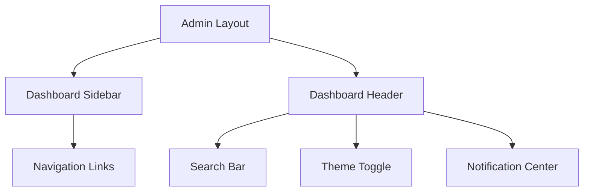
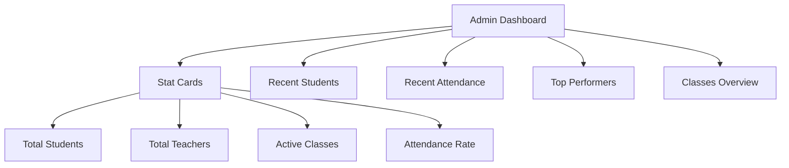
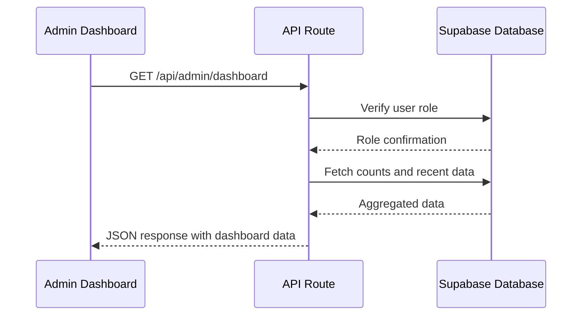
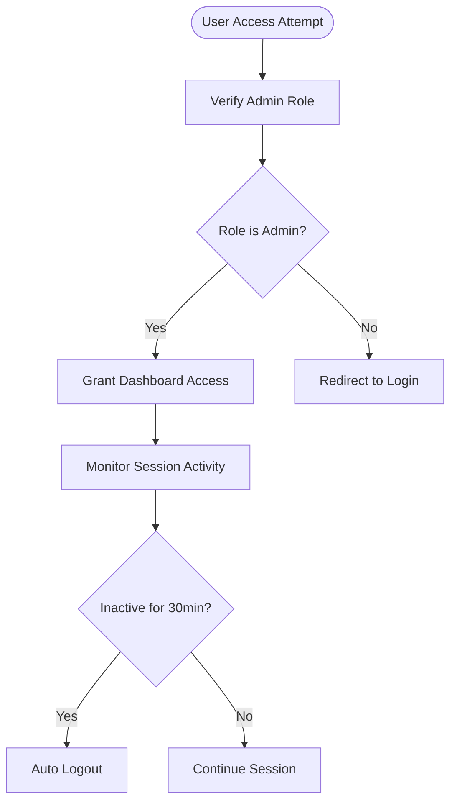

# Admin Dashboard

<cite>
**Referenced Files in This Document**   
- [layout.tsx](file://app/admin/layout.tsx)
- [page.tsx](file://app/admin/page.tsx)
- [dashboard/route.ts](file://app/api/admin/dashboard/route.ts)
- [get-users/route.ts](file://app/api/admin/get-users/route.ts)
- [create-class/route.ts](file://app/api/admin/create-class/route.ts)
- [classes/page.tsx](file://app/admin/classes/page.tsx)
- [students/page.tsx](file://app/admin/students/page.tsx)
- [data-table.tsx](file://components/data-table.tsx)
- [stat-card.tsx](file://components/stat-card.tsx)
- [admin-session-guard.tsx](file://components/admin-session-guard.tsx)
- [dashboard-sidebar.tsx](file://components/dashboard-sidebar.tsx)
- [dashboard-header.tsx](file://components/dashboard-header.tsx)
- [loading.tsx](file://app/admin/classes/loading.tsx)
- [loading.tsx](file://app/admin/students/loading.tsx)
</cite>

## Table of Contents
1. [Introduction](#introduction)
2. [Layout Structure](#layout-structure)
3. [Dashboard Overview](#dashboard-overview)
4. [Core Functionalities](#core-functionalities)
5. [Data Retrieval and API Integration](#data-retrieval-and-api-integration)
6. [Component Usage and UI Patterns](#component-usage-and-ui-patterns)
7. [Loading States and User Experience](#loading-states-and-user-experience)
8. [Security and Access Control](#security-and-access-control)
9. [Extending the Dashboard](#extending-the-dashboard)

## Introduction

The Admin Dashboard serves as the central hub for system administration within the School-Management-System. It provides comprehensive oversight and control over user management, academic operations, attendance tracking, grading, lesson planning, scheduling, and communication. Designed with role-based access in mind, the dashboard ensures that administrators have the necessary tools to manage students, teachers, parents, classes, and institutional settings efficiently. This documentation details the architecture, functionality, and implementation patterns of the Admin Dashboard, focusing on its layout, data flow, component usage, and security mechanisms.

## Layout Structure

The Admin Dashboard utilizes a consistent layout structure defined in `layout.tsx`, which ensures uniform navigation and branding across all admin pages. The layout incorporates a responsive sidebar that adapts to mobile and desktop views, providing quick access to key sections such as Students, Teachers, Classes, Attendance, Grades, and Settings. The sidebar is dynamically rendered based on the user's role, ensuring that only relevant navigation options are displayed.

The layout also includes a header component that displays the application logo, user profile information, and global actions such as search, theme toggle, and notifications. This consistent structure enhances usability by maintaining a predictable interface across different administrative tasks.



**Diagram sources**
- [layout.tsx](file://app/admin/layout.tsx#L1-L62)
- [dashboard-sidebar.tsx](file://components/dashboard-sidebar.tsx#L1-L225)
- [dashboard-header.tsx](file://components/dashboard-header.tsx#L1-L35)

**Section sources**
- [layout.tsx](file://app/admin/layout.tsx#L1-L62)

## Dashboard Overview

The main dashboard (`page.tsx`) provides a high-level summary of key metrics and recent activities within the school system. It displays real-time statistics such as total students, teachers, active classes, and attendance rate using `StatCard` components. These metrics are fetched from a secure API endpoint at `/api/admin/dashboard`, which aggregates data from multiple database tables while enforcing role-based access.

The dashboard also features interactive widgets that display recent student enrollments, latest attendance records, top-performing students, and an overview of class assignments. Each widget is designed to provide actionable insights, allowing administrators to quickly identify trends or issues that require attention.



**Diagram sources**
- [page.tsx](file://app/admin/page.tsx#L1-L200)
- [dashboard/route.ts](file://app/api/admin/dashboard/route.ts#L1-L125)

**Section sources**
- [page.tsx](file://app/admin/page.tsx#L1-L200)

## Core Functionalities

The Admin Dashboard supports a wide range of administrative functions, each accessible through dedicated pages under the `/admin` route. These include:

- **User Management**: Administrators can view, create, and manage user accounts for students, teachers, and parents. The `Users` page retrieves data via the `/api/admin/get-users` API route, which implements server-side role verification and pagination.
- **Class Management**: The `Classes` page allows administrators to create, edit, and delete classes. Each class can be assigned to a teacher, scheduled with specific days and times, and linked to a physical room. The creation process involves both class registration and schedule entry in the database.
- **Student Management**: The `Students` page provides a comprehensive view of all enrolled students, including their personal information, grade level, section, and parent/guardian details. Administrators can filter students by grade and search by name, email, or LRN (Learner Reference Number).
- **Attendance and Grades**: Administrators can monitor attendance records and grade distributions across classes. These pages integrate with teacher-submitted data while providing oversight capabilities.
- **Lessons, Quizzes, and Schedule**: The dashboard enables curriculum oversight by allowing administrators to review lesson plans, quizzes, and class schedules.

Each functionality is implemented with a consistent UI pattern, using reusable components such as data tables, forms, and modals to ensure a cohesive user experience.

**Section sources**
- [classes/page.tsx](file://app/admin/classes/page.tsx#L1-L615)
- [students/page.tsx](file://app/admin/students/page.tsx#L1-L325)
- [users/page.tsx](file://app/admin/users/page.tsx)

## Data Retrieval and API Integration

Data for the Admin Dashboard is retrieved through secure API routes located under `app/api/admin/`. These endpoints enforce authentication and role-based access control before returning any data. For example, the `/api/admin/dashboard` route verifies that the requesting user has the "admin" role before aggregating and returning dashboard statistics.

API routes use Supabase for database interactions, leveraging RLS (Row Level Security) policies to ensure data integrity. Additionally, server-side caching is implemented for frequently accessed data to improve performance. The `/api/admin/get-users` route, for instance, supports pagination to handle large datasets efficiently.

Key API endpoints include:
- `GET /api/admin/dashboard`: Retrieves summary statistics for the dashboard
- `GET /api/admin/get-users`: Fetches paginated user data with role filtering
- `POST /api/admin/create-class`: Creates a new class with associated schedule entries
- `PUT /api/admin/classes/[id]`: Updates class information
- `DELETE /api/admin/classes/[id]`: Removes a class and its enrollments

These APIs follow RESTful conventions and return structured JSON responses, making them easy to consume by the frontend components.



**Diagram sources**
- [dashboard/route.ts](file://app/api/admin/dashboard/route.ts#L1-L125)
- [get-users/route.ts](file://app/api/admin/get-users/route.ts#L1-L59)
- [create-class/route.ts](file://app/api/admin/create-class/route.ts#L1-L113)

**Section sources**
- [dashboard/route.ts](file://app/api/admin/dashboard/route.ts#L1-L125)
- [get-users/route.ts](file://app/api/admin/get-users/route.ts#L1-L59)
- [create-class/route.ts](file://app/api/admin/create-class/route.ts#L1-L113)

## Component Usage and UI Patterns

The Admin Dashboard leverages several reusable components to maintain consistency and reduce code duplication. Key components include:

- **`DataTable`**: Used extensively across pages like Students and Users to display tabular data with sorting, filtering, and row actions. It accepts configurable columns and supports click handlers for row interactions.
- **`StatCard`**: Displays key metrics with icons and optional trend indicators. Used on the main dashboard to present high-level statistics.
- **`DashboardHeader`**: Provides a consistent header with title, subtitle, search functionality, and user controls.
- **`DashboardSidebar`**: Implements responsive navigation with role-specific menu items.
- **`StudentForm`**: A reusable form component used for creating and editing student records, supporting validation and submission states.

These components are built using modern React patterns, including hooks for state management and side effects. They are designed to be composable and extensible, allowing new features to be added without duplicating UI logic.

```mermaid
classDiagram
class DataTable {
+columns : Column[]
+data : T[]
+onRowClick : (item : T) => void
+renderHeader(header : any)
}
class StatCard {
+title : string
+value : string | number
+icon : LucideIcon
+trend? : { value : number, label : string }
}
class DashboardHeader {
+title : string
+subtitle? : string
+userId? : string
}
class DashboardSidebar {
+role : UserRole
+userName : string
+userAvatar? : string
}
DataTable --> DashboardHeader : "used in"
StatCard --> DashboardHeader : "used in"
DashboardSidebar --> layout : "used in"
```

**Diagram sources**
- [data-table.tsx](file://components/data-table.tsx#L1-L60)
- [stat-card.tsx](file://components/stat-card.tsx#L1-L39)
- [dashboard-header.tsx](file://components/dashboard-header.tsx#L1-L35)
- [dashboard-sidebar.tsx](file://components/dashboard-sidebar.tsx#L1-L225)

**Section sources**
- [data-table.tsx](file://components/data-table.tsx#L1-L60)
- [stat-card.tsx](file://components/stat-card.tsx#L1-L39)

## Loading States and User Experience

To enhance user experience during data fetching, the Admin Dashboard implements loading states using `loading.tsx` files in specific routes. When navigating to pages like `/admin/classes` or `/admin/students`, the application displays a skeleton screen or loading indicator while retrieving data from the API.

The loading components are minimal, typically returning `null` or a simple spinner, allowing the layout to remain stable while content loads. This approach prevents layout shifts and provides visual feedback to users, indicating that the system is actively processing their request.

For example, both `classes/loading.tsx` and `students/loading.tsx` return `null`, relying on the parent layout to display a global loading state. This pattern ensures consistency across the application while minimizing redundant code.

**Section sources**
- [loading.tsx](file://app/admin/classes/loading.tsx#L1-L4)
- [loading.tsx](file://app/admin/students/loading.tsx#L1-L4)

## Security and Access Control

Security is a critical aspect of the Admin Dashboard, enforced through multiple layers of protection:

- **Role-Based Access**: The `AdminSessionGuard` component wraps the entire dashboard, verifying that only users with the "admin" role can access administrative features. This is implemented using Supabase authentication and server-side role checks.
- **API Route Protection**: All API endpoints under `/api/admin` validate the user's role before processing requests, preventing unauthorized access even if the frontend is bypassed.
- **Session Management**: The dashboard includes session timeout functionality, automatically logging out inactive administrators after 30 minutes of inactivity, with an 8-hour absolute timeout.
- **Rate Limiting**: Sensitive operations like class creation are protected by rate limiting to prevent abuse.
- **Input Validation**: Form submissions and API requests include validation to prevent malformed data from being processed.

These security measures work together to protect sensitive administrative functions while maintaining a smooth user experience for legitimate administrators.



**Diagram sources**
- [admin-session-guard.tsx](file://components/admin-session-guard.tsx#L1-L34)
- [layout.tsx](file://app/admin/layout.tsx#L1-L62)
- [dashboard/route.ts](file://app/api/admin/dashboard/route.ts#L1-L125)

**Section sources**
- [admin-session-guard.tsx](file://components/admin-session-guard.tsx#L1-L34)

## Extending the Dashboard

New administrative features can be added to the dashboard by following established patterns:

1. **Create a New Page**: Add a new directory under `/app/admin` with a `page.tsx` file implementing the desired functionality.
2. **Implement API Routes**: Create corresponding API endpoints under `/app/api/admin` with proper authentication and authorization checks.
3. **Update Navigation**: Add the new page to the `adminLinks` array in `dashboard-sidebar.tsx`.
4. **Use Reusable Components**: Leverage existing components like `DataTable`, `StatCard`, and form elements to maintain consistency.
5. **Ensure Security**: Wrap sensitive operations with role verification and implement appropriate RLS policies in Supabase.

When extending the dashboard, developers should prioritize security, performance, and user experience, ensuring that new features integrate seamlessly with the existing system architecture.

**Section sources**
- [dashboard-sidebar.tsx](file://components/dashboard-sidebar.tsx#L39-L57)
- [layout.tsx](file://app/admin/layout.tsx#L1-L62)