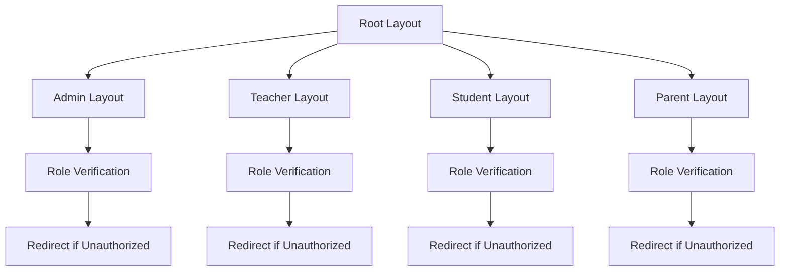
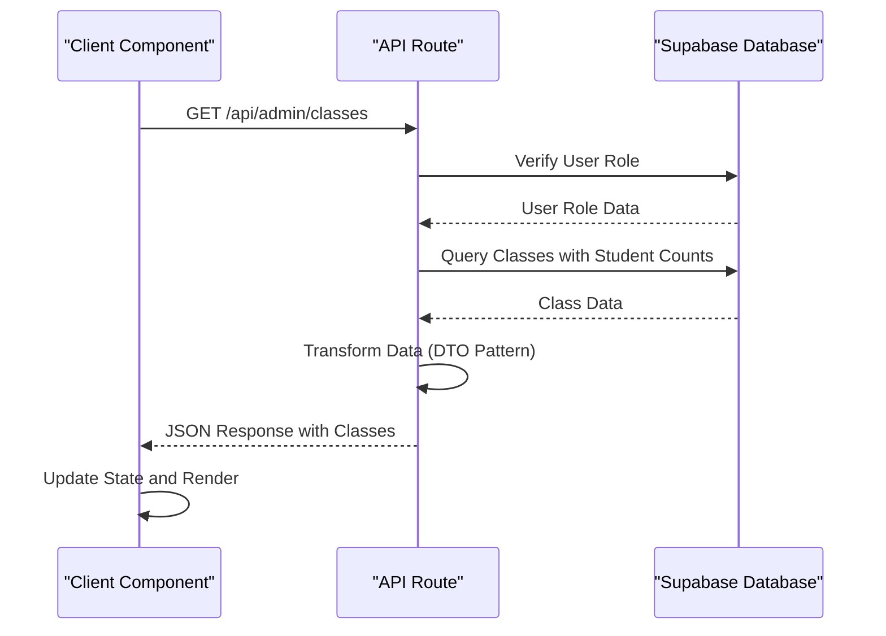

# App Directory Structure

<cite>
**Referenced Files in This Document**   
- [app/layout.tsx](file://app/layout.tsx)
- [app/admin/layout.tsx](file://app/admin/layout.tsx)
- [app/teacher/layout.tsx](file://app/teacher/layout.tsx)
- [app/student/layout.tsx](file://app/student/layout.tsx)
- [app/parent/layout.tsx](file://app/parent/layout.tsx)
- [app/admin/classes/page.tsx](file://app/admin/classes/page.tsx)
- [app/admin/students/loading.tsx](file://app/admin/students/loading.tsx)
- [app/api/admin/classes/route.ts](file://app/api/admin/classes/route.ts)
- [app/api/admin/create-class/route.ts](file://app/api/admin/create-class/route.ts)
- [app/api/teacher/grades/create/route.ts](file://app/api/teacher/grades/create/route.ts)
- [app/api/student/classes/route.ts](file://app/api/student/classes/route.ts)
- [lib/supabase/queries.ts](file://lib/supabase/queries.ts)
- [components/data-table.tsx](file://components/data-table.tsx)
- [lib/supabase/middleware.ts](file://lib/supabase/middleware.ts)
</cite>

## Table of Contents
1. [Role-Based Dashboard Organization](#role-based-dashboard-organization)
2. [Layout Structure and Authentication](#layout-structure-and-authentication)
3. [Server Components and Client Interactions](#server-components-and-client-interactions)
4. [API Routes and Backend Entry Points](#api-routes-and-backend-entry-points)
5. [Routing Logic and Middleware](#routing-logic-and-middleware)
6. [Data Fetching Patterns](#data-fetching-patterns)
7. [Loading States and UX Optimization](#loading-states-and-ux-optimization)
8. [Adding New Pages and API Endpoints](#adding-new-pages-and-api-endpoints)

## Role-Based Dashboard Organization

The Next.js App Router in the School-Management-System implements a role-based dashboard architecture through dedicated route segments for admin, teacher, student, and parent roles. Each role has its own directory under the app/ directory, containing role-specific pages and layout files that define the user interface and access controls. The directory structure follows a clear pattern where each role's dashboard is isolated in its own namespace, preventing cross-role access and ensuring proper separation of concerns. This organization allows for tailored user experiences based on role-specific needs, with each dashboard providing relevant functionality such as class management for teachers, grade viewing for students, and comprehensive system oversight for administrators.

**Section sources**
- [app/admin/layout.tsx](file://app/admin/layout.tsx)
- [app/teacher/layout.tsx](file://app/teacher/layout.tsx)
- [app/student/layout.tsx](file://app/student/layout.tsx)
- [app/parent/layout.tsx](file://app/parent/layout.tsx)

## Layout Structure and Authentication

The application implements role-specific layouts that handle authentication and authorization at the layout level, ensuring that only authorized users can access each dashboard. The root layout in app/layout.tsx provides global theming and analytics, while role-specific layouts in directories like app/admin/layout.tsx, app/teacher/layout.tsx, and app/student/layout.tsx implement role-based access control. Each layout performs authentication checks using Supabase auth, redirecting unauthorized users to the login page. The admin layout uses a secure API route (/api/auth/me) to verify user identity and role, while teacher and student layouts use direct Supabase client queries to validate authentication status and role membership. This approach ensures that sensitive administrative functionality is protected while maintaining efficient authentication flows for other roles.



**Diagram sources **
- [app/layout.tsx](file://app/layout.tsx)
- [app/admin/layout.tsx](file://app/admin/layout.tsx)
- [app/teacher/layout.tsx](file://app/teacher/layout.tsx)
- [app/student/layout.tsx](file://app/student/layout.tsx)
- [app/parent/layout.tsx](file://app/parent/layout.tsx)

**Section sources**
- [app/layout.tsx](file://app/layout.tsx#L1-L43)
- [app/admin/layout.tsx](file://app/admin/layout.tsx#L1-L62)
- [app/teacher/layout.tsx](file://app/teacher/layout.tsx#L1-L60)
- [app/student/layout.tsx](file://app/student/layout.tsx#L1-L60)
- [app/parent/layout.tsx](file://app/parent/layout.tsx#L1-L44)

## Server Components and Client Interactions

The application follows a hybrid rendering approach with server components handling data fetching and client components managing interactive elements. Server components are used for initial data loading and authentication checks, while client components handle user interactions, form submissions, and dynamic UI updates. The admin/classes/page.tsx demonstrates this pattern by using client-side state management for form inputs and dialog states while fetching data through API routes. The component uses React hooks like useState, useEffect, and useDebounce to manage state and optimize performance. Interactive elements such as buttons, dialogs, and dropdown menus are implemented as client components, enabling responsive user experiences while maintaining security through server-side data validation and access control.

**Section sources**
- [app/admin/classes/page.tsx](file://app/admin/classes/page.tsx)

## API Routes and Backend Entry Points

The app/api/ directory contains backend entry points that handle authentication, user management, academic operations, and Zoom integration. These API routes serve as the primary interface between the frontend application and the Supabase database, implementing role-based access control and security measures. The routes follow a consistent pattern of authentication verification, rate limiting, and input validation before processing requests. For example, the app/api/admin/classes/route.ts handles class listing with pagination and search capabilities, while app/api/admin/create-class/route.ts manages class creation with transactional integrity between class and schedule records. The API routes also support specialized functionality like grade creation in app/api/teacher/grades/create/route.ts, which includes server-side grade calculation and validation of teacher-class ownership.

```mermaid
graph TD
A[Frontend] --> B[API Routes]
B --> C[Authentication]
B --> D[User Management]
B --> E[Academic Operations]
B --> F[Zoom Integration]
C --> G[/api/auth/login]
C --> H[/api/auth/me]
D --> I[/api/admin/create-user]
D --> J[/api/admin/toggle-user-status]
E --> K[/api/admin/classes]
E --> L[/api/teacher/grades/create]
F --> M[/api/zoom/meetings]
F --> N[/api/zoom/webhook]
```

**Diagram sources **
- [app/api/admin/classes/route.ts](file://app/api/admin/classes/route.ts)
- [app/api/admin/create-class/route.ts](file://app/api/admin/create-class/route.ts)
- [app/api/teacher/grades/create/route.ts](file://app/api/teacher/grades/create/route.ts)
- [app/api/student/classes/route.ts](file://app/api/student/classes/route.ts)

**Section sources**
- [app/api/admin/classes/route.ts](file://app/api/admin/classes/route.ts#L1-L89)
- [app/api/admin/create-class/route.ts](file://app/api/admin/create-class/route.ts#L1-L113)
- [app/api/teacher/grades/create/route.ts](file://app/api/teacher/grades/create/route.ts#L1-L105)
- [app/api/student/classes/route.ts](file://app/api/student/classes/route.ts#L1-L66)

## Routing Logic and Middleware

The application implements routing logic and middleware through Supabase authentication to enforce role-based access control across all routes. The lib/supabase/middleware.ts file contains the updateSession function that integrates with Next.js middleware to manage authentication state and session validation. This middleware extracts user information from Supabase auth and attaches it to the request context, enabling role-based access decisions throughout the application. The routing system uses a combination of client-side and server-side checks to ensure that users can only access routes appropriate to their role. API routes implement additional security measures including rate limiting, IP tracking, and request validation to prevent abuse and ensure system stability.

**Section sources**
- [lib/supabase/middleware.ts](file://lib/supabase/middleware.ts#L1-L38)

## Data Fetching Patterns

The application employs server-side data fetching patterns using Supabase client functions and API routes to retrieve data securely and efficiently. The admin/classes/page.tsx component demonstrates this approach by fetching class data through the /api/admin/classes endpoint rather than direct database queries, adding an additional security layer. The data fetching process includes error handling, loading states, and data transformation to ensure a smooth user experience. The lib/supabase/queries.ts file contains reusable query functions for common data access patterns, promoting code reuse and consistency across the application. These queries follow the DTO (Data Transfer Object) pattern to transform database results into safe, structured responses that can be consumed by the frontend components.



**Diagram sources **
- [app/admin/classes/page.tsx](file://app/admin/classes/page.tsx#L104-L131)
- [app/api/admin/classes/route.ts](file://app/api/admin/classes/route.ts#L7-L89)
- [lib/supabase/queries.ts](file://lib/supabase/queries.ts#L90-L101)

**Section sources**
- [app/admin/classes/page.tsx](file://app/admin/classes/page.tsx#L104-L131)
- [app/api/admin/classes/route.ts](file://app/api/admin/classes/route.ts#L7-L89)
- [lib/supabase/queries.ts](file://lib/supabase/queries.ts#L90-L101)

## Loading States and UX Optimization

The application implements loading states and UX optimization techniques to enhance user experience during data fetching and processing. The loading.tsx files in various directories, such as app/admin/students/loading.tsx, provide immediate feedback during navigation and data loading. These loading components display skeleton screens or loading indicators to maintain user engagement while content loads. The admin/classes/page.tsx component implements a comprehensive loading state with a full-screen loader during initial data fetch, followed by interactive elements that remain responsive during subsequent operations. The component also uses debounced search functionality to reduce unnecessary re-renders during typing, improving performance and responsiveness. Form submissions include saving states with loading indicators to provide feedback during API calls.

**Section sources**
- [app/admin/students/loading.tsx](file://app/admin/students/loading.tsx#L1-L4)
- [app/admin/classes/page.tsx](file://app/admin/classes/page.tsx#L310-L319)

## Adding New Pages and API Endpoints

To add new pages and API endpoints following existing patterns, developers should maintain alignment with the role-based access control system and established architectural patterns. New pages should be created within the appropriate role directory (admin, teacher, student, or parent) and follow the layout structure of existing pages. API endpoints should be added to the app/api/ directory with proper authentication and authorization checks, rate limiting, and error handling. When creating new functionality, developers should reuse existing query functions from lib/supabase/queries.ts where possible and follow the DTO pattern for data transformation. New components should be added to the components/ directory with proper type definitions and accessibility considerations, ensuring consistency with the existing UI component library.

**Section sources**
- [app/admin/classes/page.tsx](file://app/admin/classes/page.tsx)
- [app/api/admin/classes/route.ts](file://app/api/admin/classes/route.ts)
- [lib/supabase/queries.ts](file://lib/supabase/queries.ts)
- [components/data-table.tsx](file://components/data-table.tsx)