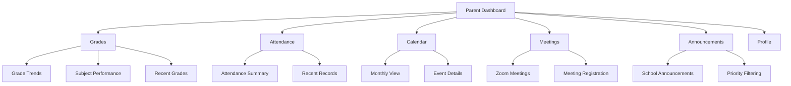
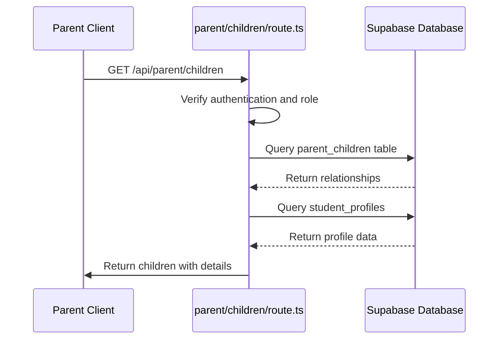
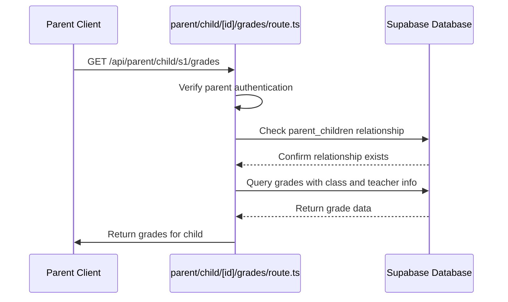

# Parent Dashboard

<cite>
**Referenced Files in This Document**   
- [layout.tsx](file://app/parent/layout.tsx)
- [page.tsx](file://app/parent/page.tsx)
- [grades/page.tsx](file://app/parent/grades/page.tsx)
- [attendance/page.tsx](file://app/parent/attendance/page.tsx)
- [calendar/page.tsx](file://app/parent/calendar/page.tsx)
- [meetings/page.tsx](file://app/parent/meetings/page.tsx)
- [announcements/page.tsx](file://app/parent/announcements/page.tsx)
- [route.ts](file://app/api/parent/children/route.ts)
- [route.ts](file://app/api/parent/child/[id]/grades/route.ts)
- [route.ts](file://app/api/admin/link-parent-child/route.ts)
- [route.ts](file://app/api/admin/unlink-parent-child/route.ts)
- [stat-card.tsx](file://components/stat-card.tsx)
- [calendar-view.tsx](file://components/calendar-view.tsx)
- [parent-store.ts](file://lib/parent-store.ts)
- [analytics-store.ts](file://lib/analytics-store.ts)
</cite>

## Table of Contents
1. [Introduction](#introduction)
2. [Layout Structure and Navigation](#layout-structure-and-navigation)
3. [Key Features](#key-features)
4. [Data Fetching and API Endpoints](#data-fetching-and-api-endpoints)
5. [Parent-Student Relationship Management](#parent-student-relationship-management)
6. [Core Components](#core-components)
7. [User Interactions](#user-interactions)
8. [Privacy and Data Access Controls](#privacy-and-data-access-controls)

## Introduction

The Parent Dashboard is a dedicated interface within the School Management System that enables guardians to monitor their children's academic progress, attendance records, school communications, and upcoming events. Designed with usability and comprehensive oversight in mind, the dashboard provides parents with real-time insights into their children's educational journey. The system supports monitoring multiple children through a unified interface, allowing seamless switching between students linked to the parent's account.

The dashboard integrates with various backend services and APIs to deliver up-to-date information while maintaining strict data privacy through Supabase Row Level Security (RLS) policies. Parents can access grade summaries, attendance statistics, school announcements, academic calendars, and schedule parent-teacher meetings—all from a single, intuitive interface.

**Section sources**
- [page.tsx](file://app/parent/page.tsx#L1-L245)

## Layout Structure and Navigation

The Parent Dashboard utilizes a consistent layout structure defined in `layout.tsx`, which provides a sidebar navigation menu and main content area. The layout is wrapped with `"use client"` directive, indicating it's a client-side component that manages user state and authentication status.

The dashboard sidebar is implemented through the `DashboardSidebar` component, which displays the parent's name and avatar, and provides navigation links to key sections including Grades, Attendance, Calendar, Meetings, and Announcements. The main content area is dynamically updated based on the selected navigation item, with the sidebar remaining fixed during navigation.

Navigation follows a hierarchical structure with the parent dashboard serving as the root path `/parent`, and specific features accessible through sub-routes like `/parent/grades`, `/parent/attendance`, and `/parent/calendar`. The layout handles loading states with a spinner animation during initialization, ensuring a smooth user experience while data is being fetched.



**Diagram sources**
- [layout.tsx](file://app/parent/layout.tsx#L1-L44)
- [page.tsx](file://app/parent/page.tsx#L1-L245)

**Section sources**
- [layout.tsx](file://app/parent/layout.tsx#L1-L44)

## Key Features

### Viewing Child Grades

The Grades section (`/parent/grades`) provides comprehensive insights into a child's academic performance. Parents can view overall averages, subject-specific performance, grade trends over time, and recent assessment results. The interface includes a line chart visualization that displays grade progression across different subjects and assessment types.

When multiple children are linked to the parent account, a child selector dropdown allows switching between students. The grade data is organized into categories including exams, quizzes, assignments, and projects, with each entry showing the date, subject, and performance level. Grades are color-coded based on performance, with badges indicating excellent (green), satisfactory (yellow), or needs improvement (red) levels.

**Section sources**
- [grades/page.tsx](file://app/parent/grades/page.tsx#L1-L214)

### Tracking Attendance Records

The Attendance section (`/parent/attendance`) offers detailed tracking of a child's attendance history. It displays a summary card showing the overall attendance rate along with counts of present, late, absent, and excused days. The interface uses color-coded indicators (green for present, amber for late, red for absent, and blue for excused) to quickly convey attendance patterns.

Parents can view recent attendance records in a list format, with each entry showing the date and status. The system calculates attendance statistics including the percentage rate and trends over time. For each child, parents can see both the quantitative data and qualitative patterns in attendance behavior, helping identify potential issues early.

**Section sources**
- [attendance/page.tsx](file://app/parent/attendance/page.tsx#L1-L175)

### Reading School Announcements

The Announcements section (`/parent/announcements`) serves as a communication channel between the school administration and parents. Announcements are categorized by priority levels: Urgent (red), Important (blue), and Normal (gray). Each announcement displays the title, content, author name, creation date, and priority indicator.

The system filters announcements to show only those relevant to parents and students, excluding teacher-specific communications. The interface presents announcements in a card-based layout, with the most recent messages appearing first. Urgent announcements are visually emphasized to ensure they capture attention, while normal updates are presented in a more subdued manner.

**Section sources**
- [announcements/page.tsx](file://app/parent/announcements/page.tsx#L1-L95)

### Scheduling Parent-Teacher Meetings

The Meetings section (`/parent/meetings`) integrates with Zoom to facilitate virtual parent-teacher conferences. Parents can view scheduled meetings, join active sessions, and see meeting details including participants, date, and time. The interface leverages the `ZoomMeetingsList` component to display upcoming and past meetings in a structured format.

Parents can see which teachers they have meetings with, the meeting status (upcoming, in progress, or completed), and join links when appropriate. The system handles authentication and user role verification to ensure parents only see meetings relevant to their children. Meeting registration and participation are managed through the integrated Zoom API.

**Section sources**
- [meetings/page.tsx](file://app/parent/meetings/page.tsx#L1-L53)

### Accessing the Academic Calendar

The Calendar section (`/parent/calendar`) provides a visual representation of the academic schedule, including classes, quizzes, assignments, exams, holidays, and other events. The calendar supports month, week, and day views, with color-coded event types for easy identification.

Parents can select a specific date to view detailed event information, including start and end times, location, description, and target audience. The interface includes functionality to export events to external calendar applications via iCal format. When multiple children are linked, the calendar displays events relevant to the selected child's classes and schedule.

**Section sources**
- [calendar/page.tsx](file://app/parent/calendar/page.tsx#L1-L80)

## Data Fetching and API Endpoints

The Parent Dashboard fetches data through dedicated API routes that provide parent-specific information while enforcing data access restrictions. These endpoints are designed to return only the data that a parent is authorized to view based on their relationship with students.

### Parent Children Endpoint

The `parent/children/route.ts` API endpoint returns a list of all children linked to the authenticated parent account. The endpoint first verifies the user's authentication status and role (must be "parent"), then queries the `parent_children` table to find all student relationships. It joins with the `users` and `student_profiles` tables to include comprehensive student information such as name, email, grade level, and section.



**Diagram sources**
- [route.ts](file://app/api/parent/children/route.ts#L1-L74)

**Section sources**
- [route.ts](file://app/api/parent/children/route.ts#L1-L74)

### Child Grades Endpoint

The `parent/child/[id]/grades/route.ts` API endpoint retrieves grade information for a specific child. The endpoint accepts a student ID parameter and first verifies that the requesting parent has a valid relationship with the specified student by checking the `parent_children` table. This ensures that parents can only access grades for their own children.

Once authorization is confirmed, the endpoint queries the `grades` table and joins with `classes` and `users` (teachers) tables to provide comprehensive grade information including the class name, subject, teacher name, and assessment details. Results are ordered by date in descending order to show the most recent grades first.



**Diagram sources**
- [route.ts](file://app/api/parent/child/[id]/grades/route.ts#L1-L61)

**Section sources**
- [route.ts](file://app/api/parent/child/[id]/grades/route.ts#L1-L61)

## Parent-Student Relationship Management

The system provides administrative endpoints for managing parent-student relationships, primarily used by school administrators to link or unlink accounts.

### Linking Parent and Child

The `admin/link-parent-child/route.ts` endpoint allows administrators to establish a relationship between a parent and student account. The POST request requires the parent ID, student ID, and optional relationship type (e.g., "guardian", "father", "mother"). The endpoint first verifies that the requesting user has admin privileges before creating the relationship in the `parent_children` table.

The system prevents duplicate relationships through a unique constraint on the parent_id and student_id combination. If a relationship already exists, the endpoint returns a 400 error with an appropriate message. This ensures data integrity and prevents accidental duplication of parent-child links.

**Section sources**
- [route.ts](file://app/api/admin/link-parent-child/route.ts#L1-L61)

### Unlinking Parent and Child

The `admin/unlink-parent-child/route.ts` endpoint allows administrators to remove a parent-student relationship. Similar to the linking endpoint, it requires admin authentication and accepts parent ID and student ID parameters. The endpoint deletes the corresponding record from the `parent_children` table, effectively removing the parent's access to the student's data.

This functionality is useful when a parent no longer needs access to a child's records, such as when a student graduates or transfers to another school. The unlinking process immediately revokes the parent's access to the student's grades, attendance, and other sensitive information.

**Section sources**
- [route.ts](file://app/api/admin/unlink-parent-child/route.ts#L1-L51)

## Core Components

### Stat Card Component

The `stat-card.tsx` component is used throughout the Parent Dashboard to display key performance indicators in a consistent, visually appealing format. Each stat card includes a title, value, and icon, with optional trend information showing improvement or decline.

The component uses a clean design with a primary-colored icon in a circular background on the right side, and text content on the left. The value is prominently displayed in large font, while the title appears as a smaller, muted text above it. When trend information is provided, it appears below the value with color-coded indicators (green for positive, red for negative).

```mermaid
classDiagram
class StatCard {
+title : string
+value : string | number
+icon : LucideIcon
+trend? : { value : number, label : string }
+className? : string
+render() : JSX.Element
}
StatCard --> Card : "uses"
StatCard --> CardContent : "uses"
```

**Diagram sources**
- [stat-card.tsx](file://components/stat-card.tsx#L1-L39)

**Section sources**
- [stat-card.tsx](file://components/stat-card.tsx#L1-L39)

### Calendar View Component

The `calendar-view.tsx` component provides a comprehensive calendar interface for viewing academic events. It displays a monthly grid with days of the week, highlighting the current day and selected date. Events are shown as colored blocks within each day cell, with truncated titles and a "+X more" indicator when multiple events occur on the same day.

The component supports interactive features including:
- Month navigation (previous/next)
- "Today" button to return to current month
- Date selection to view detailed events
- Event creation (for users with appropriate permissions)
- Event export to iCal format

Events are color-coded by type (class, quiz, assignment, exam, holiday, meeting, other) using a predefined color scheme. The right panel displays detailed information for the selected date, including event titles, types, times, locations, and descriptions.

**Section sources**
- [calendar-view.tsx](file://components/calendar-view.tsx#L1-L497)

## User Interactions

### Monitoring Multiple Children

Parents with multiple children enrolled in the school can seamlessly switch between students using the child selector dropdown present on all relevant pages. The selector appears when a parent has more than one child linked to their account, allowing them to view each child's data independently.

The system maintains the selected child context across navigation, ensuring that when a parent moves between sections (e.g., from Grades to Attendance), they continue viewing data for the same child. This provides a consistent experience and prevents accidental viewing of the wrong child's information.

### Real-Time Updates

The Parent Dashboard implements real-time updates through periodic data fetching and state management. When new grades are entered by teachers or attendance is recorded, parents can see these updates reflected in the dashboard after refreshing the page or when the automatic data refresh occurs.

The system uses React's useEffect hook to trigger data loading when the component mounts or when dependencies change (such as the selected child). Loading states are indicated with spinner animations to provide feedback during data retrieval, ensuring parents understand that information is being updated.

**Section sources**
- [page.tsx](file://app/parent/page.tsx#L1-L245)
- [grades/page.tsx](file://app/parent/grades/page.tsx#L1-L214)
- [attendance/page.tsx](file://app/parent/attendance/page.tsx#L1-L175)

## Privacy and Data Access Controls

The Parent Dashboard enforces strict privacy controls through Supabase Row Level Security (RLS) policies, ensuring that parents can only access data for their own children. These security measures are implemented at both the API and database levels.

### Supabase RLS Policies

The system implements RLS policies that restrict data access based on user roles and relationships. For parent accounts, policies verify that:
1. The user is authenticated and has the "parent" role
2. The requested student data belongs to a child linked to the parent's account
3. The parent has appropriate permissions for the requested operation

These policies are defined in the Supabase migration files, particularly in the parent-related tables creation scripts. The policies automatically apply to all database queries, providing a robust security layer that cannot be bypassed by client-side code.

### Data Access Restrictions

The API endpoints implement additional authorization checks beyond the database-level RLS policies. Before returning any data, endpoints verify the parent-child relationship by querying the `parent_children` table. This dual-layer security approach ensures that even if RLS policies were somehow circumvented, the application logic would still prevent unauthorized data access.

Sensitive operations like linking or unlinking parent-child relationships are restricted to administrative users only, preventing parents from modifying relationships for students they are not authorized to manage.

**Section sources**
- [route.ts](file://app/api/parent/children/route.ts#L1-L74)
- [route.ts](file://app/api/parent/child/[id]/grades/route.ts#L1-L61)
- [route.ts](file://app/api/admin/link-parent-child/route.ts#L1-L61)
- [route.ts](file://app/api/admin/unlink-parent-child/route.ts#L1-L51)
- [parent-store.ts](file://lib/parent-store.ts#L1-L66)
- [analytics-store.ts](file://lib/analytics-store.ts#L1-L83)