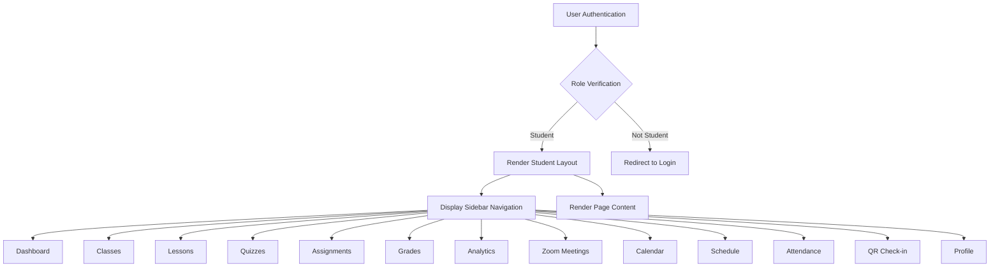
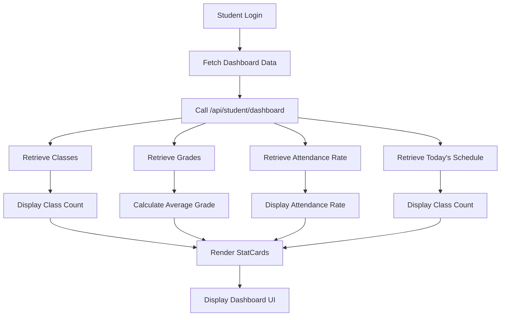
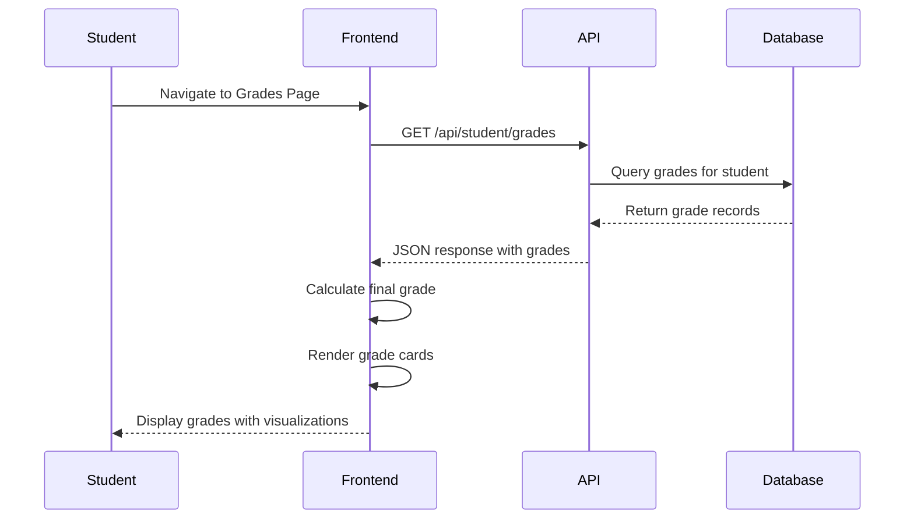
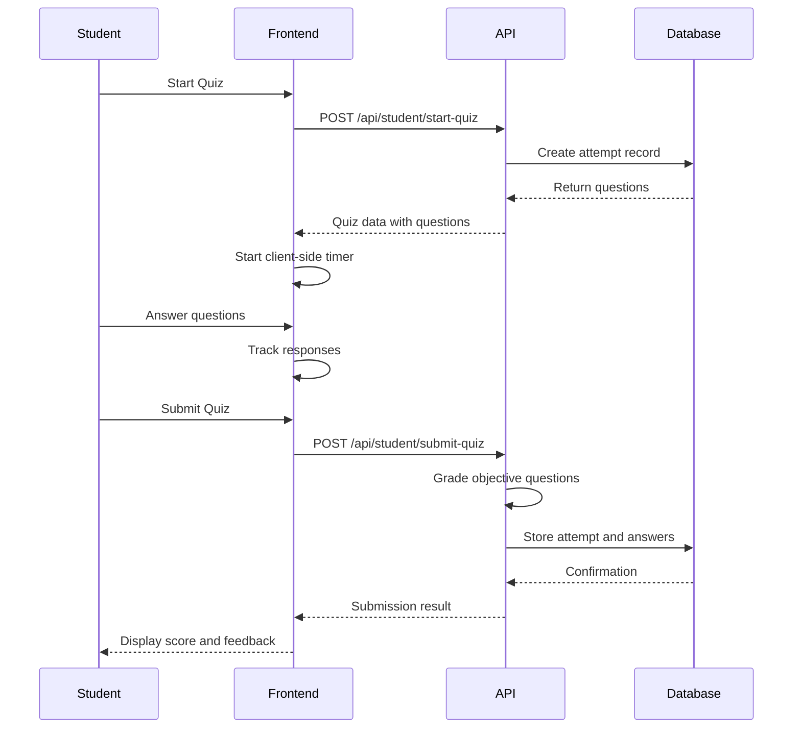
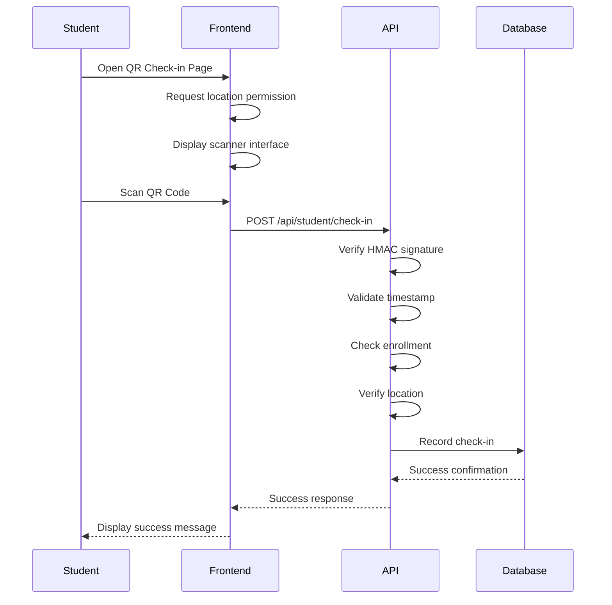

# Student Dashboard

<cite>
**Referenced Files in This Document**   
- [app/student/page.tsx](file://app/student/page.tsx)
- [app/student/layout.tsx](file://app/student/layout.tsx)
- [components/dashboard-sidebar.tsx](file://components/dashboard-sidebar.tsx)
- [components/dashboard-header.tsx](file://components/dashboard-header.tsx)
- [app/student/assignments/page.tsx](file://app/student/assignments/page.tsx)
- [app/student/qr-checkin/page.tsx](file://app/student/qr-checkin/page.tsx)
- [app/api/student/check-in/route.ts](file://app/api/student/check-in/route.ts)
- [app/api/student/grades/route.ts](file://app/api/student/grades/route.ts)
- [app/api/student/attendance/route.ts](file://app/api/student/attendance/route.ts)
- [components/progress-analytics.tsx](file://components/progress-analytics.tsx)
- [components/meeting-attendance-summary.tsx](file://components/meeting-attendance-summary.tsx)
- [app/student/classes/page.tsx](file://app/student/classes/page.tsx)
- [app/student/grades/page.tsx](file://app/student/grades/page.tsx)
- [app/student/lessons/page.tsx](file://app/student/lessons/page.tsx)
- [app/student/quizzes/page.tsx](file://app/student/quizzes/page.tsx)
- [app/api/student/submit-quiz/route.ts](file://app/api/student/submit-quiz/route.ts)
</cite>

## Table of Contents
1. [Introduction](#introduction)
2. [Layout Structure and Navigation](#layout-structure-and-navigation)
3. [Dashboard Overview](#dashboard-overview)
4. [Core Functionalities](#core-functionalities)
   - [Viewing Enrolled Classes](#viewing-enrolled-classes)
   - [Checking Grades with Real-Time Updates](#checking-grades-with-real-time-updates)
   - [Accessing Lesson Materials](#accessing-lesson-materials)
   - [Submitting Assignments](#submitting-assignments)
   - [Participating in Quizzes](#participating-in-quizzes)
   - [Attending Virtual Meetings](#attending-virtual-meetings)
5. [QR Check-In System](#qr-check-in-system)
6. [Data Fetching and API Integration](#data-fetching-and-api-integration)
7. [Key Components](#key-components)
8. [Student Workflows](#student-workflows)
9. [Accessibility and Mobile Responsiveness](#accessibility-and-mobile-responsiveness)
10. [Conclusion](#conclusion)

## Introduction

The Student Dashboard serves as the central interface for learners within the school management system, providing comprehensive access to academic resources, attendance tracking, grade monitoring, assignment submission, and virtual classroom participation. Designed with an intuitive layout and responsive design, the dashboard enables students to efficiently manage their educational activities from any device. This documentation details the architecture, functionality, and user experience of the Student Dashboard, focusing on its role in facilitating seamless academic engagement through integrated features such as real-time grade updates, secure QR-based attendance, and interactive quiz participation.

## Layout Structure and Navigation

The Student Dashboard employs a consistent layout structure defined in `layout.tsx`, which ensures uniform navigation across all student-facing pages. The layout includes a persistent sidebar that provides quick access to key sections such as Announcements, Classes, Lessons, Quizzes, Assignments, Grades, Analytics, Zoom Meetings, Calendar, Schedule, Attendance, QR Check-in, and Profile. The sidebar dynamically adjusts for mobile devices using a collapsible sheet menu, ensuring usability on smaller screens.

Navigation is role-based, with the dashboard automatically verifying the user's authentication status and redirecting unauthorized users to the login page. Upon successful authentication, the system confirms the user's role as a student before rendering the appropriate interface. The header component displays contextual information, including the current page title and user-specific details, while integrating essential tools such as search, theme toggling, and notification center access.

**Diagram sources**
- [app/student/layout.tsx](file://app/student/layout.tsx#L1-L60)
- [components/dashboard-sidebar.tsx](file://components/dashboard-sidebar.tsx#L76-L91)

**Section sources**
- [app/student/layout.tsx](file://app/student/layout.tsx#L1-L60)
- [components/dashboard-sidebar.tsx](file://components/dashboard-sidebar.tsx#L76-L91)

## Dashboard Overview

The main dashboard page (`page.tsx`) presents a summary of key academic metrics through a series of visual components. Upon login, students are greeted with a personalized welcome message and an overview of their academic performance, including the number of enrolled classes, average grade, attendance rate, and today's scheduled classes. These metrics are displayed using StatCard components that provide at-a-glance insights into the student's progress.

The dashboard fetches data securely through the `/api/student/dashboard` endpoint, which aggregates information from multiple sources, including class enrollment, grade records, attendance logs, and daily schedules. This approach ensures that sensitive data remains protected while delivering real-time updates to the user interface. In cases where no data is available, the dashboard gracefully handles empty states by displaying informative messages to guide the user.

**Section sources**
- [app/student/page.tsx](file://app/student/page.tsx#L40-L202)

## Core Functionalities

### Viewing Enrolled Classes

Students can view their enrolled classes through the "My Classes" page, which retrieves class information via the `/api/student/classes` endpoint. Each class card displays essential details such as the class name, subject, instructor, schedule, room assignment, and student count. The interface allows students to quickly identify their courses and access relevant information at a glance.

The data is fetched client-side using Supabase, with proper error handling and loading states to ensure a smooth user experience. When no classes are enrolled, the system displays a clear message indicating that the student is not currently registered in any courses.

**Section sources**
- [app/student/classes/page.tsx](file://app/student/classes/page.tsx#L23-L124)

### Checking Grades with Real-Time Updates

The Grades page provides students with detailed insights into their academic performance, including individual assessment scores, final grades, and overall progress. Data is securely retrieved from the `/api/student/grades` endpoint, which returns grade records associated with the authenticated student. The system calculates final grades using weighted averages based on assessment types (exam, quiz, assignment, project) and applies the Philippine grading scale for evaluation.

The interface includes visualizations such as progress bars, statistical summaries, and breakdowns by assessment type. Students can view both overall performance and class-specific results, with color-coded badges indicating performance levels according to institutional standards.

**Diagram sources**
- [app/student/grades/page.tsx](file://app/student/grades/page.tsx#L30-L273)
- [app/api/student/grades/route.ts](file://app/api/student/grades/route.ts#L4-L40)

### Accessing Lesson Materials

The Lessons page enables students to access instructional content and learning materials for their enrolled classes. Through the `/api/student/lessons` endpoint, the system retrieves lesson data including titles, descriptions, content, and associated files. Materials may include PDF documents, video lectures, external links, or downloadable resources.

To ensure security, external links are validated before access, and Supabase storage URLs are signed to prevent unauthorized access. When a student clicks on a material, the system either opens a signed URL directly or prompts a warning for external sites, protecting users from potential phishing attempts.

**Section sources**
- [app/student/lessons/page.tsx](file://app/student/lessons/page.tsx#L50-L304)

### Submitting Assignments

Students can submit assignments through the Assignments page, which lists all available tasks with submission status indicators. The interface integrates with the assignment management system to display deadlines, instructions, and submission history. While the specific submission logic is not detailed in the provided code, the system likely uses secure API endpoints to handle file uploads and record submissions in the database.

The component structure suggests integration with a reusable `StudentAssignmentList` component that manages the display and interaction logic for assignment entries.

**Section sources**
- [app/student/assignments/page.tsx](file://app/student/assignments/page.tsx#L9-L68)

### Participating in Quizzes

The Quizzes page allows students to take online assessments with time limits and various question types, including multiple-choice, true/false, identification, and essay questions. When a student starts a quiz, the system initiates a timer and tracks activity such as tab switches and copy-paste attempts as potential indicators of academic integrity concerns.

Quiz submissions are processed through the `/api/student/submit-quiz` endpoint, which performs server-side grading for objective questions and flags essay responses for manual review. The system enforces rate limiting to prevent abuse and validates submission timing against the quiz duration to ensure fairness.

**Diagram sources**
- [app/student/quizzes/page.tsx](file://app/student/quizzes/page.tsx#L54-L616)
- [app/api/student/submit-quiz/route.ts](file://app/api/student/submit-quiz/route.ts#L5-L170)

### Attending Virtual Meetings

Students can participate in virtual classes through Zoom integration, accessible via the Meetings page. The system displays upcoming and active meetings, allowing students to join sessions directly from the dashboard. Meeting details are retrieved from the `/api/zoom/meetings` endpoint, and participation is tracked for attendance purposes.

The interface includes components for displaying meeting information, joining links, and attendance summaries, ensuring that students can easily navigate between scheduled sessions and recorded attendance data.

**Section sources**
- [app/student/meetings/page.tsx](file://app/student/meetings/page.tsx)
- [components/zoom-meetings-list.tsx](file://components/zoom-meetings-list.tsx)
- [components/zoom-meeting-room.tsx](file://components/zoom-meeting-room.tsx)

## QR Check-In System

The QR Check-In system provides a secure method for students to mark their attendance in physical or hybrid classes. Students access the check-in interface through the QR Check-in page, where they can scan QR codes displayed by instructors using their device's camera. The system requires GPS location services to be enabled, ensuring that check-ins occur within the school's geographical boundaries.

When a QR code is scanned, the system validates the payload, which includes a session ID, timestamp, and cryptographic signature to prevent tampering. The check-in request is sent to the `/api/student/check-in` endpoint along with the student's location coordinates. The backend verifies that the student is enrolled in the corresponding class, checks for duplicate submissions, and confirms that the device is within the allowed radius of the school campus.

The implementation includes multiple security measures:
- HMAC signature verification for QR codes
- Strict time window validation (5-second expiry)
- Geolocation-based proximity checks
- IP address hashing for privacy-preserving abuse detection
- Rate limiting to prevent automated submissions

**Diagram sources**
- [app/student/qr-checkin/page.tsx](file://app/student/qr-checkin/page.tsx#L38-L309)
- [app/api/student/check-in/route.ts](file://app/api/student/check-in/route.ts#L23-L237)

**Section sources**
- [app/student/qr-checkin/page.tsx](file://app/student/qr-checkin/page.tsx#L38-L309)
- [app/api/student/check-in/route.ts](file://app/api/student/check-in/route.ts#L23-L237)

## Data Fetching and API Integration

The Student Dashboard relies on a series of secure API routes to fetch student-specific data while enforcing role-based access controls. Each API endpoint begins with authentication verification, ensuring that only authorized users can access sensitive information. The system uses Supabase for database operations, with server-side functions handling data retrieval and manipulation.

Key API endpoints include:
- `/api/student/grades`: Retrieves grade records for the authenticated student
- `/api/student/attendance`: Fetches attendance records with class names
- `/api/student/classes`: Returns enrolled class information
- `/api/student/lessons`: Provides access to lesson content and materials
- `/api/student/quizzes`: Lists available quizzes with metadata
- `/api/student/check-in`: Processes QR-based attendance submissions
- `/api/student/submit-quiz`: Handles quiz submissions and grading

All API routes implement proper error handling and status code responses, with client-side components using fetch requests to retrieve data asynchronously. The system employs rate limiting on critical endpoints to prevent abuse and ensure service availability.

**Section sources**
- [app/api/student/grades/route.ts](file://app/api/student/grades/route.ts#L4-L40)
- [app/api/student/attendance/route.ts](file://app/api/student/attendance/route.ts#L4-L40)
- [app/api/student/check-in/route.ts](file://app/api/student/check-in/route.ts#L23-L237)
- [app/api/student/submit-quiz/route.ts](file://app/api/student/submit-quiz/route.ts#L5-L170)

## Key Components

The Student Dashboard utilizes several reusable components to maintain consistency and enhance functionality:

- **ProgressAnalytics**: Displays comprehensive performance metrics including grade trends, subject performance, and attendance breakdowns using Recharts visualizations. The component fetches data from `/api/analytics/student/[id]` and renders interactive charts for longitudinal analysis.

- **MeetingAttendanceSummary**: Provides a summary of meeting participation, showing attendance rates and patterns over time. This component integrates with Zoom API data to track virtual class attendance.

- **DashboardHeader**: Standardizes the top navigation area with title, subtitle, search functionality, theme toggle, and notification center. It accepts dynamic props to customize content based on the current page.

- **DashboardSidebar**: Implements the navigation menu with role-specific links, responsive design for mobile devices, and user profile information. The component uses Next.js navigation hooks to manage route changes.

- **StatCard**: Presents key metrics in a visually appealing format with icons, values, and contextual information. Used extensively on the dashboard home page for quick data visualization.

**Section sources**
- [components/progress-analytics.tsx](file://components/progress-analytics.tsx#L18-L189)
- [components/meeting-attendance-summary.tsx](file://components/meeting-attendance-summary.tsx)
- [components/dashboard-header.tsx](file://components/dashboard-header.tsx#L16-L35)
- [components/dashboard-sidebar.tsx](file://components/dashboard-sidebar.tsx#L186-L225)
- [components/stat-card.tsx](file://components/stat-card.tsx)

## Student Workflows

Typical student workflows within the dashboard include:

1. **Daily Check-In**: Students open the app, authenticate, and use the QR Check-in feature to mark attendance for their first class. The system verifies their location and records the check-in in real-time.

2. **Grade Review**: Students navigate to the Grades page to review recent assessments, understand their performance trends, and identify areas for improvement. The system updates grades automatically when new scores are entered by instructors.

3. **Assignment Submission**: Students access the Assignments page to view pending tasks, download instructions, and submit completed work before deadlines. The interface tracks submission status and provides confirmation.

4. **Lesson Preparation**: Before class, students review upcoming lessons through the Lessons page, accessing reading materials, videos, and supplementary resources to prepare for instruction.

5. **Quiz Participation**: When taking a quiz, students start the assessment, answer questions within the time limit, and submit their responses. The system provides immediate feedback for automatically graded questions.

6. **Virtual Class Attendance**: For online sessions, students join Zoom meetings directly from the dashboard, with attendance automatically recorded upon entry to the virtual classroom.

These workflows are designed to be intuitive and efficient, minimizing friction in academic tasks while maintaining robust security and data integrity.

**Section sources**
- [app/student/page.tsx](file://app/student/page.tsx#L40-L202)
- [app/student/grades/page.tsx](file://app/student/grades/page.tsx#L30-L273)
- [app/student/assignments/page.tsx](file://app/student/assignments/page.tsx#L9-L68)
- [app/student/lessons/page.tsx](file://app/student/lessons/page.tsx#L50-L304)
- [app/student/quizzes/page.tsx](file://app/student/quizzes/page.tsx#L54-L616)
- [app/student/meetings/page.tsx](file://app/student/meetings/page.tsx)

## Accessibility and Mobile Responsiveness

The Student Dashboard is designed with accessibility and mobile responsiveness as core principles. The layout adapts seamlessly to different screen sizes, with the desktop version featuring a fixed sidebar and the mobile version utilizing a collapsible sheet menu. All interactive elements are properly labeled and support keyboard navigation, ensuring compliance with accessibility standards.

The interface uses semantic HTML, ARIA attributes, and sufficient color contrast to accommodate users with visual impairments. Loading states are clearly indicated with animated spinners, and error messages provide actionable feedback. Form controls include proper labeling and validation, while touch targets are sized appropriately for mobile interaction.

The system also implements responsive grid layouts that reflow content based on screen width, ensuring optimal readability on both large monitors and small smartphone screens. Media queries and CSS flexbox/grid systems enable fluid adaptation to various viewport dimensions.

**Section sources**
- [app/student/layout.tsx](file://app/student/layout.tsx#L52-L58)
- [components/dashboard-sidebar.tsx](file://components/dashboard-sidebar.tsx#L190-L224)
- [app/student/page.tsx](file://app/student/page.tsx#L100-L202)

## Conclusion

The Student Dashboard provides a comprehensive, secure, and user-friendly interface for learners to engage with their academic activities. By integrating essential features such as grade tracking, attendance management, assignment submission, and virtual classroom participation, the system streamlines the educational experience while maintaining robust security measures. The architecture emphasizes data protection through role-based access controls, secure API endpoints, and client-server validation mechanisms. With its responsive design and intuitive navigation, the dashboard supports effective learning across various devices and contexts, serving as a central hub for student success.