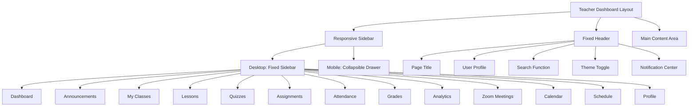
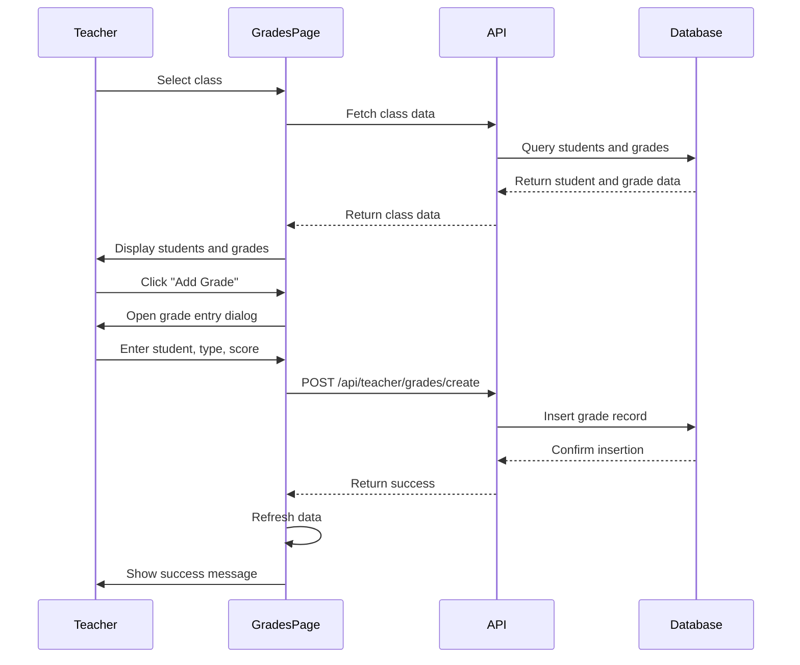
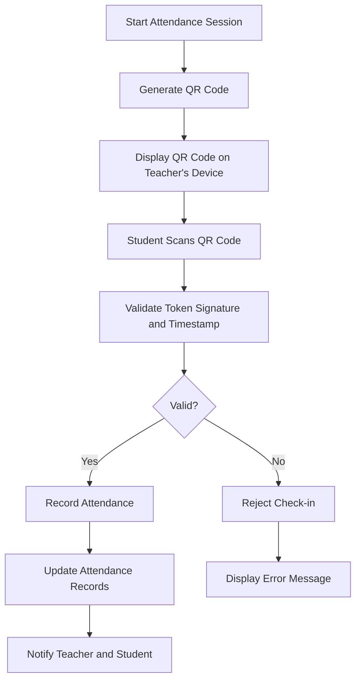

# Teacher Dashboard

<cite>
**Referenced Files in This Document**   
- [layout.tsx](file://app/teacher/layout.tsx)
- [page.tsx](file://app/teacher/page.tsx)
- [classes/page.tsx](file://app/teacher/classes/page.tsx)
- [grades/page.tsx](file://app/teacher/grades/page.tsx)
- [attendance/page.tsx](file://app/teacher/attendance/page.tsx)
- [analytics/page.tsx](file://app/teacher/analytics/page.tsx)
- [assignment-list.tsx](file://components/assignment-list.tsx)
- [zoom-meetings-list.tsx](file://components/zoom-meetings-list.tsx)
- [dashboard-sidebar.tsx](file://components/dashboard-sidebar.tsx)
- [dashboard-header.tsx](file://components/dashboard-header.tsx)
- [create-quiz/route.ts](file://app/api/teacher/create-quiz/route.ts)
- [generate-qr/route.ts](file://app/api/teacher/generate-qr/route.ts)
- [grades/create/route.ts](file://app/api/teacher/grades/create/route.ts)
- [attendance/save/route.ts](file://app/api/teacher/attendance/save/route.ts)
- [qr-code-generator.tsx](file://components/qr-code-generator.tsx)
- [qr-scanner.tsx](file://components/qr-scanner.tsx)
</cite>

## Table of Contents
1. [Introduction](#introduction)
2. [Layout Structure and Navigation](#layout-structure-and-navigation)
3. [Dashboard Overview](#dashboard-overview)
4. [Class Management](#class-management)
5. [Grading System](#grading-system)
6. [Attendance Tracking](#attendance-tracking)
7. [Analytics and Performance Monitoring](#analytics-and-performance-monitoring)
8. [Quiz Creation and Management](#quiz-creation-and-management)
9. [Zoom Meeting Integration](#zoom-meeting-integration)
10. [Data Fetching and API Integration](#data-fetching-and-api-integration)
11. [Component Architecture](#component-architecture)
12. [Workflow Examples](#workflow-examples)

## Introduction

The Teacher Dashboard serves as the primary interface for instructors within the School Management System, providing comprehensive tools for managing classes, recording attendance, grading students, creating quizzes, and communicating with students. This centralized platform enables teachers to efficiently handle their academic responsibilities through an intuitive and responsive interface. The dashboard is specifically designed to support the complete teaching workflow, from lesson planning to performance analysis, with seamless integration of various educational tools and real-time data synchronization. Teachers can access all their assigned classes, monitor student progress, and perform administrative tasks through a consistent navigation structure that enhances usability and reduces cognitive load.

**Section sources**
- [page.tsx](file://app/teacher/page.tsx)
- [layout.tsx](file://app/teacher/layout.tsx)

## Layout Structure and Navigation

The Teacher Dashboard features a consistent layout structure implemented through the `layout.tsx` file, which provides a responsive sidebar navigation system that adapts to different screen sizes. The layout includes a fixed sidebar on desktop devices and a collapsible drawer menu on mobile devices, ensuring optimal usability across all platforms. The navigation menu contains dedicated sections for Dashboard, Announcements, My Classes, Lessons, Quizzes, Assignments, Attendance, Grades, Analytics, Zoom Meetings, Calendar, Schedule, and Profile. Each navigation item is represented by an appropriate icon and text label, following a clean and intuitive design pattern. The layout also incorporates a header component that displays the current page title, user information, and utility functions such as search, theme toggle, and notification center. Authentication is handled at the layout level, redirecting unauthorized users to the login page and ensuring that only authenticated teachers can access the dashboard content.

**Diagram sources**
- [layout.tsx](file://app/teacher/layout.tsx)
- [dashboard-sidebar.tsx](file://components/dashboard-sidebar.tsx)
- [dashboard-header.tsx](file://components/dashboard-header.tsx)

**Section sources**
- [layout.tsx](file://app/teacher/layout.tsx)
- [dashboard-sidebar.tsx](file://components/dashboard-sidebar.tsx)
- [dashboard-header.tsx](file://components/dashboard-header.tsx)

## Dashboard Overview

The main dashboard page provides teachers with a comprehensive overview of their teaching responsibilities and student performance metrics. Upon login, teachers are presented with key statistics including the number of classes they teach, total number of students, today's scheduled classes, and overall attendance rate. The dashboard features a welcoming message that personalizes the experience by displaying the teacher's first name. Key information is organized into visually distinct cards that highlight important metrics and provide quick access to essential functions. The interface includes a section for upcoming Zoom meetings, allowing teachers to quickly join or manage their virtual classes. The today's schedule component displays all classes scheduled for the current day with relevant details such as start and end times, class names, and room assignments. The students section shows a roster of all students enrolled in the teacher's classes, with profile pictures and basic information, enabling quick identification and interaction.

**Section sources**
- [page.tsx](file://app/teacher/page.tsx)

## Class Management

The class management system allows teachers to view and manage all classes they are assigned to teach. The "My Classes" page displays a grid of cards, each representing a specific class with details such as class name, grade level, section, subject, number of enrolled students, schedule, and classroom location. Each class card includes quick action buttons for accessing attendance and grading functions, providing efficient navigation to related tasks. Teachers can easily identify their classes through visual badges that display the subject name. The interface supports responsive design, adapting the card layout based on screen size to ensure optimal viewing on both desktop and mobile devices. When no classes are assigned, the system displays a helpful message with an appropriate icon to guide the teacher. The class management system integrates with the backend API to ensure that class information is always up-to-date and synchronized across all devices.

**Section sources**
- [classes/page.tsx](file://app/teacher/classes/page.tsx)

## Grading System

The grading system provides teachers with a comprehensive interface for entering and managing student grades according to the Philippine grading system. The grades page features a dual-panel layout with grade scale reference and current grade weights displayed at the top, followed by class selection and grade entry controls. Teachers can select from their assigned classes using a dropdown menu, and the interface dynamically updates to show the selected class's students and existing grades. The system supports customizable grade weights for different assessment types (quizzes, exams, assignments, participation), allowing teachers to configure how each component contributes to the final grade. A dedicated dialog enables teachers to adjust these weights, with visual feedback showing the total percentage to ensure it equals 100%. The grade entry process includes validation to prevent errors, with real-time calculation of Philippine grades (Excellent, Outstanding, Very Satisfactory, etc.) based on percentage scores. Student performance is visualized through progress bars and color-coded badges that indicate achievement levels.

**Diagram sources**
- [grades/page.tsx](file://app/teacher/grades/page.tsx)
- [grades/create/route.ts](file://app/api/teacher/grades/create/route.ts)

**Section sources**
- [grades/page.tsx](file://app/teacher/grades/page.tsx)
- [grades/create/route.ts](file://app/api/teacher/grades/create/route.ts)

## Attendance Tracking

The attendance tracking system offers both manual and QR-based check-in methods for recording student attendance. The manual attendance page allows teachers to select a class and date, then mark each student's attendance status as present, absent, late, or excused. The interface provides real-time statistics showing the total number of students, those present, absent, and late, helping teachers quickly assess class attendance patterns. A calendar component enables teachers to view and edit attendance records for different dates. For more efficient check-in, the system includes a QR code-based attendance feature that generates a time-limited QR code which rotates every 3 seconds for security. Students can scan this code using their mobile devices to automatically record their attendance. The QR code contains a cryptographically signed token with session ID and timestamp, preventing tampering and replay attacks. The system validates each check-in against the current session and updates attendance records in real-time.

**Diagram sources**
- [attendance/page.tsx](file://app/teacher/attendance/page.tsx)
- [generate-qr/route.ts](file://app/api/teacher/generate-qr/route.ts)
- [qr-code-generator.tsx](file://components/qr-code-generator.tsx)
- [qr-scanner.tsx](file://components/qr-scanner.tsx)

**Section sources**
- [attendance/page.tsx](file://app/teacher/attendance/page.tsx)
- [generate-qr/route.ts](file://app/api/teacher/generate-qr/route.ts)
- [qr-code-generator.tsx](file://components/qr-code-generator.tsx)
- [qr-scanner.tsx](file://components/qr-scanner.tsx)

## Analytics and Performance Monitoring

The analytics section provides teachers with detailed insights into student performance and class progress. Teachers can select a specific class to view comprehensive analytics, including overall class statistics, grade distribution, and individual student performance. The interface displays key metrics such as total students, class average, number of top performers, and students needing attention. A bar chart visualization shows the grade distribution across different performance levels (Excellent, Good, Satisfactory, Needs Improvement), helping teachers quickly identify class-wide trends. Teachers can drill down into individual student analytics to view detailed performance history, assignment submissions, and progress over time. The system supports filtering by specific students or viewing aggregate class data, allowing for both macro and micro analysis of academic performance. These analytics help teachers identify struggling students early and adjust their teaching strategies accordingly.

**Section sources**
- [analytics/page.tsx](file://app/teacher/analytics/page.tsx)

## Quiz Creation and Management

The quiz creation system enables teachers to create and manage assessments for their classes. Teachers can create quizzes with various question types including multiple-choice, true-false, identification, and essay questions. The quiz creation process is handled through a dedicated API endpoint that validates input data and ensures data integrity. Each quiz includes fields for title, description, duration, due date, and questions with associated points. The system implements rate limiting to prevent abuse, allowing a maximum of 5 quiz creations per minute per IP address. Before creating a quiz, the system verifies that the teacher has ownership of the target class, preventing unauthorized quiz creation. Question data is stored separately from the quiz metadata, allowing for flexible question management and reuse. Once created, quizzes are immediately available to students in the associated class, with automatic timing and submission handling. The system also tracks quiz attempts and provides grading tools for essay questions.

**Section sources**
- [create-quiz/route.ts](file://app/api/teacher/create-quiz/route.ts)

## Zoom Meeting Integration

The Teacher Dashboard integrates with Zoom to facilitate virtual classroom sessions and online meetings. The Zoom meetings list component displays both upcoming and past meetings in a tabbed interface, with options to schedule new meetings, edit existing ones, or view meeting details. Teachers can create Zoom meetings directly from the dashboard, with integration that automatically associates meetings with specific classes when applicable. The interface shows key meeting information including topic, date, time, duration, and join status. For upcoming meetings, teachers can quickly join the session with a single click, while past meetings display recording availability and attendance statistics. The system uses secure API routes to communicate with the Zoom service, handling authentication and data synchronization. Meeting participants can be managed through the interface, with options to register students and track attendance for virtual sessions.

**Section sources**
- [zoom-meetings-list.tsx](file://components/zoom-meetings-list.tsx)

## Data Fetching and API Integration

The Teacher Dashboard employs a robust data fetching strategy that combines server-side rendering with client-side interactivity. Initial page loads retrieve essential data through API routes rather than direct database queries, enhancing security and allowing for data processing on the server. The dashboard uses secure API endpoints such as `/api/teacher/dashboard`, `/api/teacher/classes`, and `/api/teacher/grades/class/[id]` to fetch data, with proper authentication and authorization checks implemented on the server side. Client components use the Fetch API to make requests to these endpoints, handling loading states and error conditions appropriately. The system implements rate limiting on API routes to prevent abuse, with different limits for various operations (e.g., 20 grades per minute, 5 quizzes per minute). Data is cached and updated efficiently, minimizing unnecessary network requests while ensuring information remains current. Error handling is comprehensive, with user-friendly messages displayed for different error types while sensitive information is kept from being exposed.

**Section sources**
- [page.tsx](file://app/teacher/page.tsx)
- [classes/page.tsx](file://app/teacher/classes/page.tsx)
- [grades/page.tsx](file://app/teacher/grades/page.tsx)
- [attendance/page.tsx](file://app/teacher/attendance/page.tsx)
- [analytics/page.tsx](file://app/teacher/analytics/page.tsx)

## Component Architecture

The Teacher Dashboard is built using a component-based architecture that promotes reusability and maintainability. Core components such as `DashboardSidebar`, `DashboardHeader`, `StatCard`, and `UpcomingMeetingsWidget` are designed to be reusable across different pages and roles. The `assignment-list.tsx` component provides a consistent interface for managing assignments, with support for submission, grading, and feedback. The `zoom-meetings-list.tsx` component offers both compact and full views, adapting to different contexts such as dashboard widgets and dedicated meeting pages. UI components from the `ui` directory (buttons, cards, dialogs, selects, etc.) follow a consistent design system with proper accessibility features. State management is handled through React hooks and context, with specialized stores for grade weights, assignments, and other domain-specific data. The architecture separates concerns effectively, with presentation components focused on rendering and container components handling data fetching and business logic.

**Section sources**
- [assignment-list.tsx](file://components/assignment-list.tsx)
- [zoom-meetings-list.tsx](file://components/zoom-meetings-list.tsx)
- [dashboard-sidebar.tsx](file://components/dashboard-sidebar.tsx)
- [dashboard-header.tsx](file://components/dashboard-header.tsx)

## Workflow Examples

### Grade Submission Workflow
1. Teacher navigates to the Grades page
2. Selects a class from the dropdown menu
3. Clicks "Add Grade Entry" button
4. In the dialog, selects a student, assessment type, and enters a score
5. The system automatically calculates the Philippine grade
6. Teacher clicks "Save Grade"
7. The frontend sends a POST request to `/api/teacher/grades/create`
8. The API validates the request, checks teacher authorization, and verifies student enrollment
9. The grade is inserted into the database with calculated percentage and Philippine grade
10. The frontend refreshes the data and displays a success message

### QR Attendance Workflow
1. Teacher starts a QR attendance session
2. The system generates a new session ID and displays a rotating QR code
3. The QR code is generated by calling `/api/teacher/generate-qr` with the session ID
4. The API creates a cryptographically signed token with session ID and timestamp
5. Students scan the QR code using their devices
6. The student app sends the token to the attendance API
7. The API verifies the signature and timestamp (must be within 3 seconds)
8. If valid, the attendance record is created
9. Both teacher and student receive confirmation of successful check-in

**Section sources**
- [grades/page.tsx](file://app/teacher/grades/page.tsx)
- [grades/create/route.ts](file://app/api/teacher/grades/create/route.ts)
- [attendance/page.tsx](file://app/teacher/attendance/page.tsx)
- [generate-qr/route.ts](file://app/api/teacher/generate-qr/route.ts)
- [attendance/save/route.ts](file://app/api/teacher/attendance/save/route.ts)