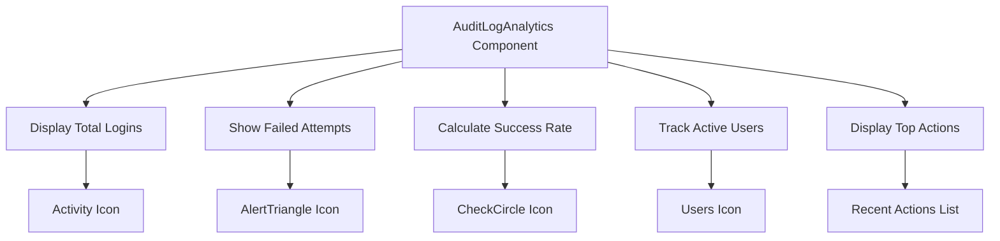
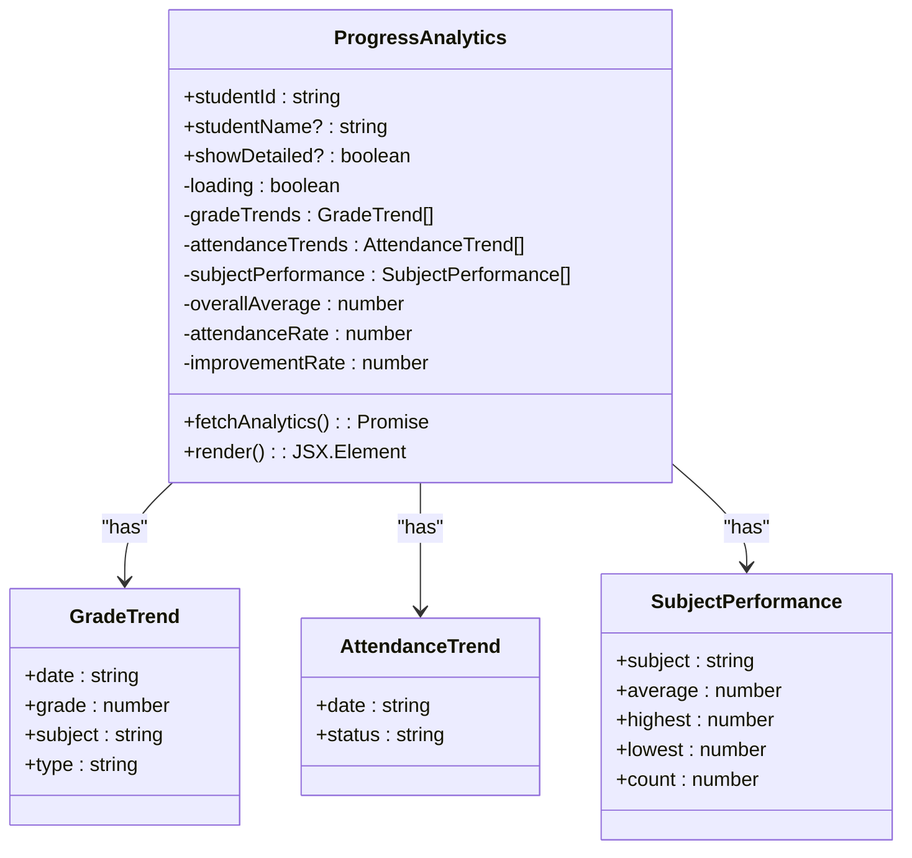
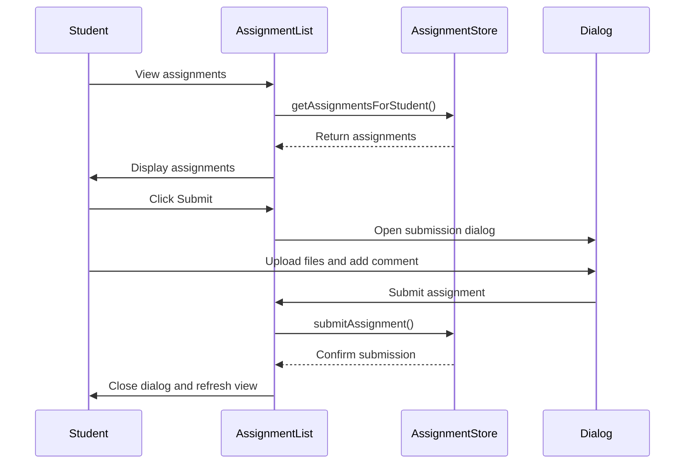
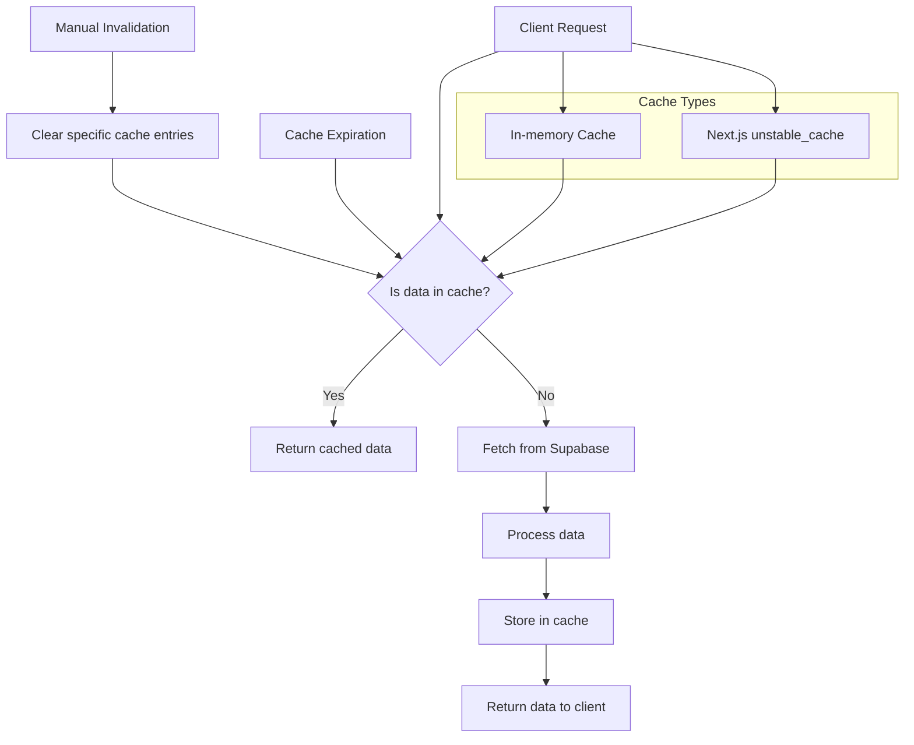
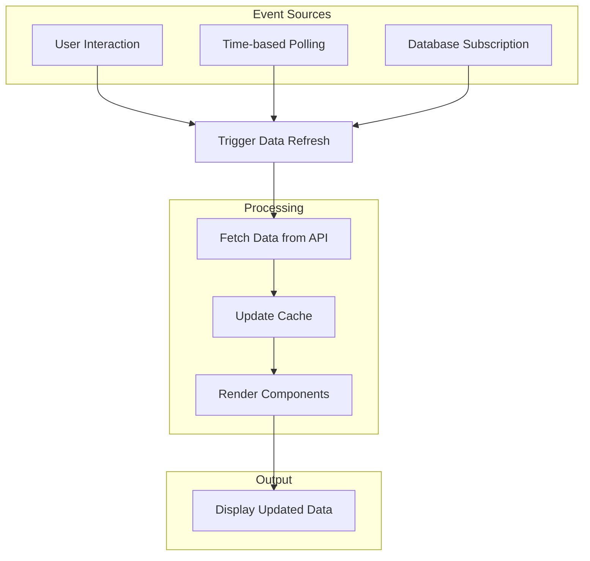
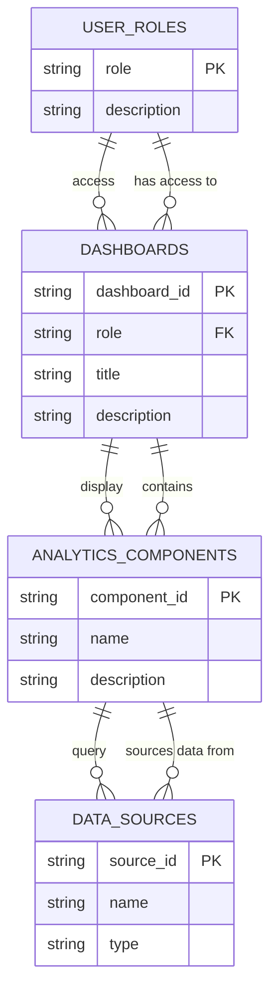
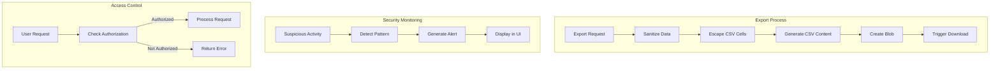

# Analytics Components

<cite>
**Referenced Files in This Document**   
- [audit-log-analytics.tsx](file://components/audit-log-analytics.tsx)
- [progress-analytics.tsx](file://components/progress-analytics.tsx)
- [assignment-list.tsx](file://components/assignment-list.tsx)
- [cache.ts](file://lib/cache.ts)
- [audit-logs.ts](file://lib/supabase/audit-logs.ts)
- [route.ts](file://app/api/analytics/student/[id]/route.ts)
- [page.tsx](file://app/admin/audit-logs/page.tsx)
- [page.tsx](file://app/teacher/analytics/page.tsx)
- [page.tsx](file://app/student/analytics/page.tsx)
- [assignment-store.ts](file://lib/assignment-store.ts)
- [audit-log-filters.tsx](file://components/audit-log-filters.tsx)
- [audit-log-table.tsx](file://components/audit-log-table.tsx)
- [20260108_audit_logs_indexes.sql](file://supabase/migrations/20260108_audit_logs_indexes.sql)
- [queries.ts](file://lib/supabase/queries.ts)
</cite>

## Table of Contents
1. [Introduction](#introduction)
2. [AuditLogAnalytics Implementation](#auditloganalytics-implementation)
3. [ProgressAnalytics for Student Performance](#progressanalytics-for-student-performance)
4. [AssignmentList for Submission Tracking](#assignmentlist-for-submission-tracking)
5. [Data Sourcing and Caching Strategy](#data-sourcing-and-caching-strategy)
6. [Real-Time Updates and Database Subscriptions](#real-time-updates-and-database-subscriptions)
7. [Dashboard Integration and User Portals](#dashboard-integration-and-user-portals)
8. [Security and Export Capabilities](#security-and-export-capabilities)

## Introduction
The analytics components in the School Management System provide comprehensive insights into user activity, student performance, and assignment management. These components leverage Recharts for data visualization and integrate with Supabase for data persistence and retrieval. The system supports multiple user roles including administrators, teachers, parents, and students, each with tailored analytics views. The components are designed to transform raw data into actionable insights through visual representations of trends, patterns, and metrics.

## AuditLogAnalytics Implementation

The AuditLogAnalytics component provides a comprehensive view of authentication events and security activities within the system. It displays key metrics such as total logins, failed attempts, success rate, and active users through a card-based interface. The component also shows top actions performed by users, offering insights into user behavior patterns and security event distribution.

**Diagram sources**
- [audit-log-analytics.tsx](file://components/audit-log-analytics.tsx#L1-L78)

**Section sources**
- [audit-log-analytics.tsx](file://components/audit-log-analytics.tsx#L1-L78)
- [audit-logs.ts](file://lib/supabase/audit-logs.ts#L104-L145)

## ProgressAnalytics for Student Performance

The ProgressAnalytics component visualizes student performance metrics over time with comparative benchmarks. It fetches data from the analytics API endpoint and displays various metrics including overall average, attendance rate, improvement rate, and number of subjects. The component includes multiple Recharts visualizations such as line charts for grade trends, bar charts for subject performance, and pie charts for attendance breakdown.

**Diagram sources**
- [progress-analytics.tsx](file://components/progress-analytics.tsx#L8-L189)

**Section sources**
- [progress-analytics.tsx](file://components/progress-analytics.tsx#L8-L189)
- [route.ts](file://app/api/analytics/student/[id]/route.ts#L4-L163)

## AssignmentList for Submission Tracking

The AssignmentList component enables tracking of assignment submission status, grading progress, and deadline adherence. It provides a comprehensive view of assignments for a specific student across multiple classes. The component displays assignment details including title, description, due date, and maximum score, along with submission status indicators. It supports assignment submission with file uploads and comments, and allows viewing of submission details including teacher feedback and scores.

**Diagram sources**
- [assignment-list.tsx](file://components/assignment-list.tsx#L34-L271)
- [assignment-store.ts](file://lib/assignment-store.ts#L58-L174)

**Section sources**
- [assignment-list.tsx](file://components/assignment-list.tsx#L34-L271)
- [assignment-store.ts](file://lib/assignment-store.ts#L58-L174)

## Data Sourcing and Caching Strategy

The analytics components source data from Supabase queries through API routes, implementing a sophisticated caching strategy to optimize performance. The system uses both in-memory caching for client-side queries and Next.js server-side caching with revalidation. The cache.ts file provides utilities for caching API responses with configurable TTL (time-to-live) values and supports cache invalidation by tags.

**Diagram sources**
- [cache.ts](file://lib/cache.ts#L6-L128)
- [route.ts](file://app/api/analytics/student/[id]/route.ts#L4-L163)

**Section sources**
- [cache.ts](file://lib/cache.ts#L6-L128)
- [route.ts](file://app/api/analytics/student/[id]/route.ts#L4-L163)
- [queries.ts](file://lib/supabase/queries.ts#L1-L419)

## Real-Time Updates and Database Subscriptions

The analytics system implements real-time updates through database subscriptions and periodic polling mechanisms. The audit logs page automatically refreshes data when filters change or when the user manually triggers a refresh. The system uses Supabase's real-time capabilities to detect suspicious activity patterns and display security alerts. The caching layer works in conjunction with database subscriptions to ensure data freshness while maintaining performance.

**Diagram sources**
- [page.tsx](file://app/admin/audit-logs/page.tsx#L39-L151)
- [cache.ts](file://lib/cache.ts#L65-L78)

**Section sources**
- [page.tsx](file://app/admin/audit-logs/page.tsx#L39-L151)
- [cache.ts](file://lib/cache.ts#L65-L78)
- [audit-logs.ts](file://lib/supabase/audit-logs.ts#L147-L226)

## Dashboard Integration and User Portals

The analytics components are integrated into various user portals including admin, teacher, and parent dashboards. Each portal provides tailored views of analytics data relevant to the user's role. The admin portal focuses on system-wide audit logs and security events, while the teacher portal emphasizes student performance and class analytics. The parent portal provides insights into their child's academic progress and attendance.

**Diagram sources**
- [page.tsx](file://app/admin/audit-logs/page.tsx#L24-L336)
- [page.tsx](file://app/teacher/analytics/page.tsx#L30-L266)
- [page.tsx](file://app/student/analytics/page.tsx#L9-L66)

**Section sources**
- [page.tsx](file://app/admin/audit-logs/page.tsx#L24-L336)
- [page.tsx](file://app/teacher/analytics/page.tsx#L30-L266)
- [page.tsx](file://app/student/analytics/page.tsx#L9-L66)

## Security and Export Capabilities

The analytics system includes robust security features and export capabilities. The audit logs component provides CSV export functionality with protection against formula injection attacks. The system implements role-based access control to ensure users can only access data they are authorized to view. Security alerts are automatically generated when suspicious activity patterns are detected, such as multiple failed login attempts within a short time period.

**Diagram sources**
- [audit-logs.ts](file://lib/supabase/audit-logs.ts#L232-L261)
- [page.tsx](file://app/admin/audit-logs/page.tsx#L116-L138)
- [audit-logs.ts](file://lib/supabase/audit-logs.ts#L147-L226)

**Section sources**
- [audit-logs.ts](file://lib/supabase/audit-logs.ts#L232-L261)
- [page.tsx](file://app/admin/audit-logs/page.tsx#L116-L138)
- [audit-logs.ts](file://lib/supabase/audit-logs.ts#L147-L226)
- [20260108_audit_logs_indexes.sql](file://supabase/migrations/20260108_audit_logs_indexes.sql#L8-L26)