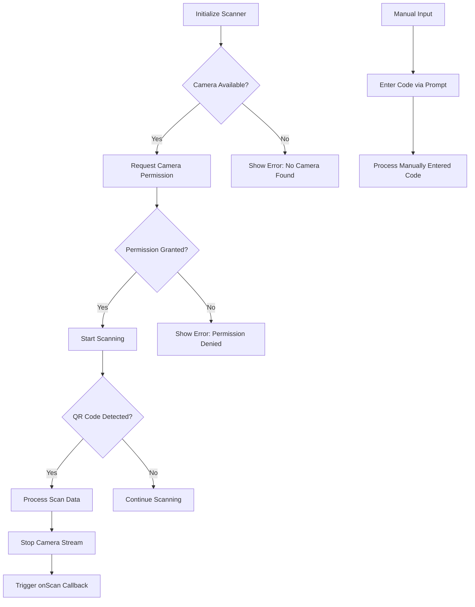
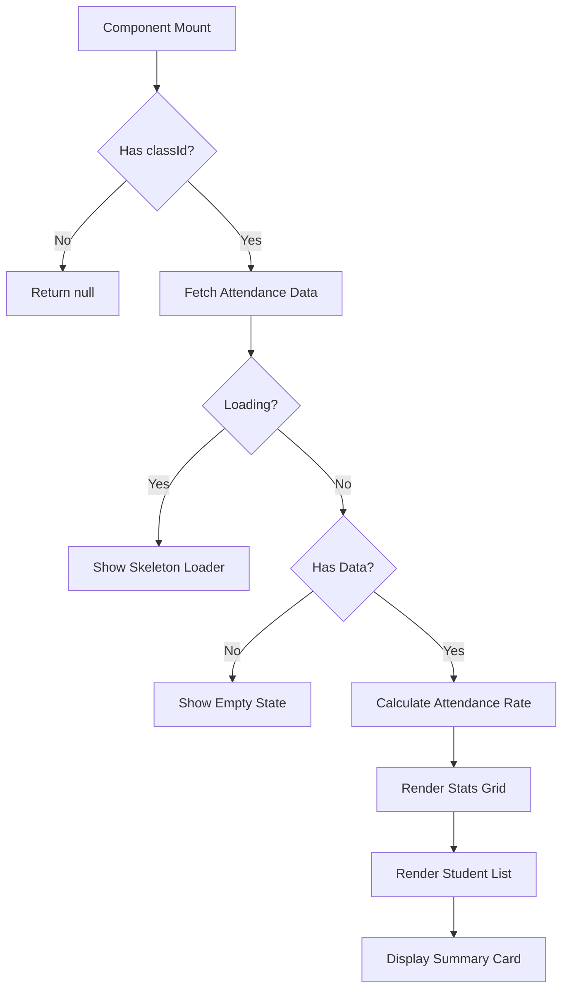
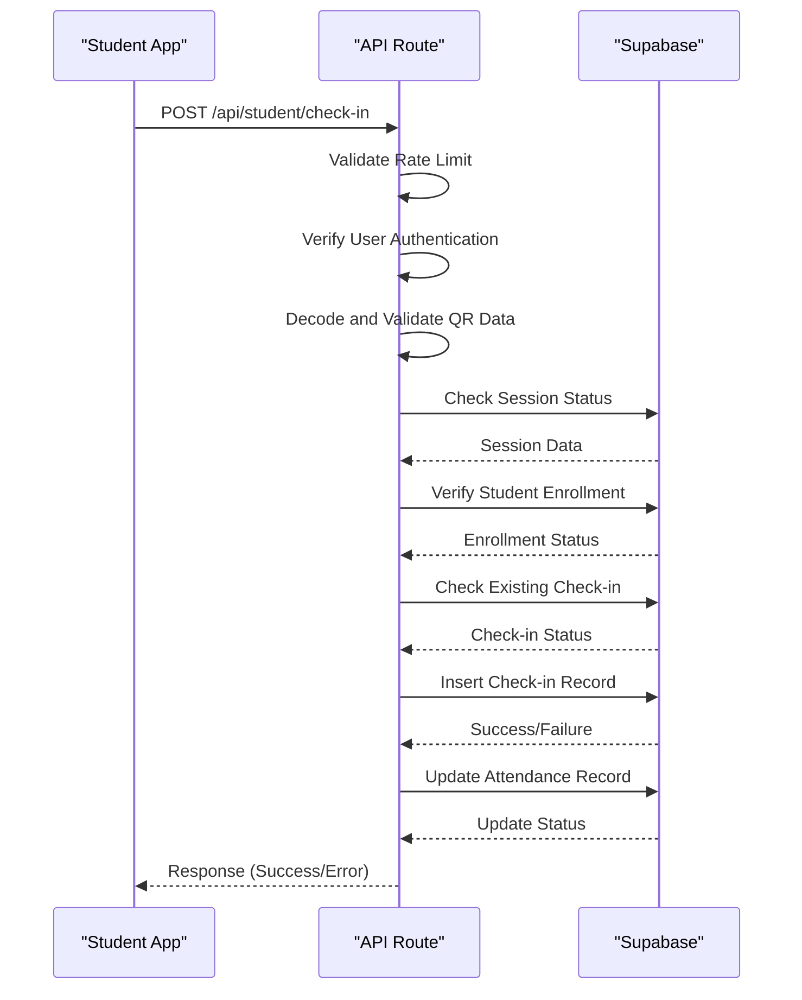
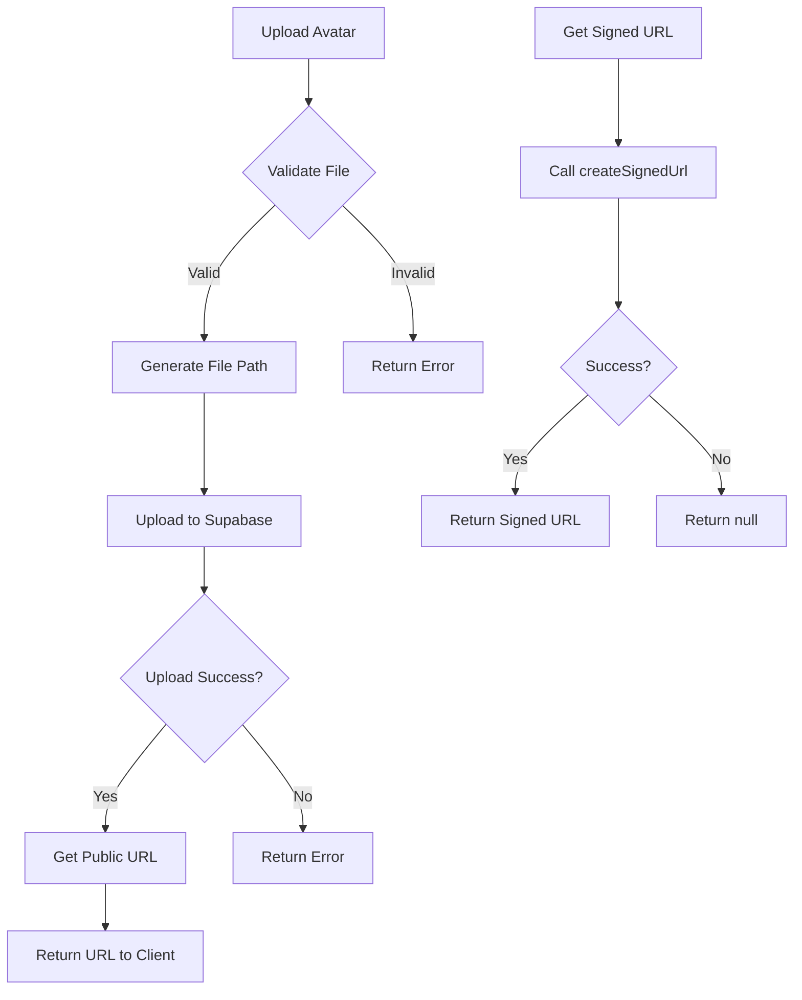
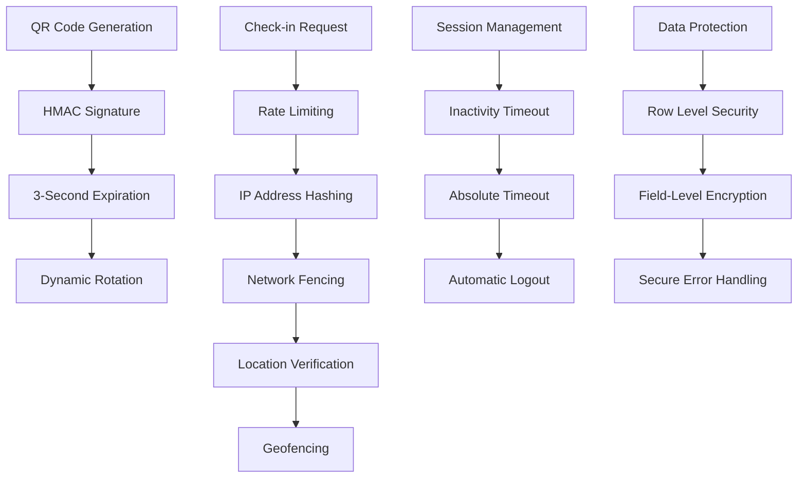
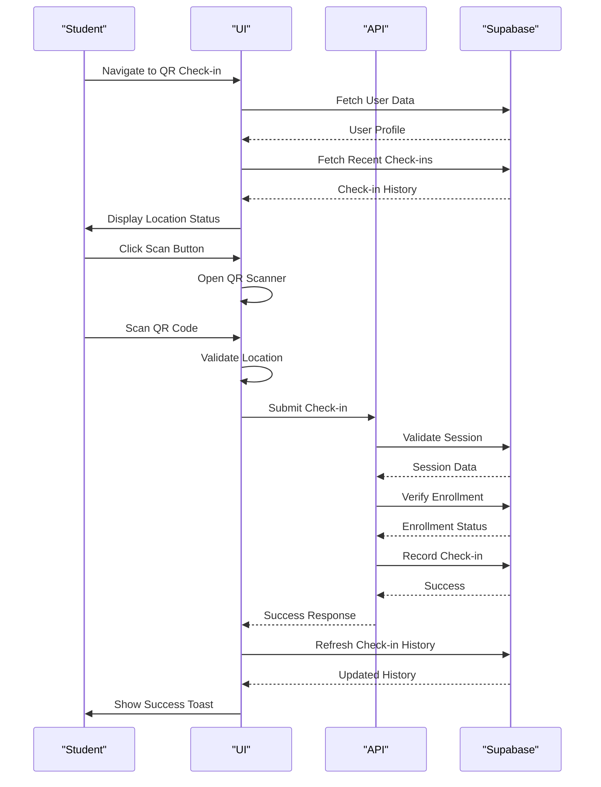
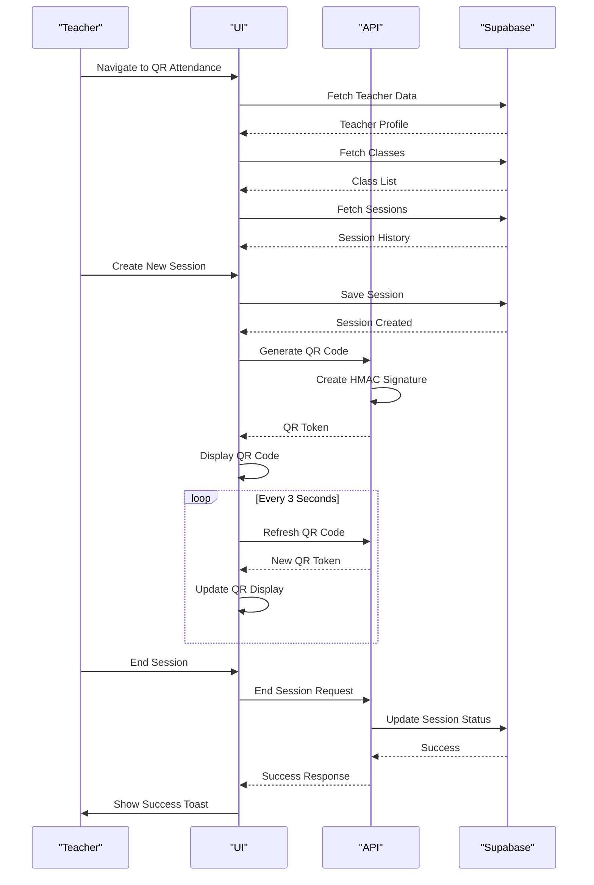

# Attendance Components

<cite>
**Referenced Files in This Document**   
- [qr-scanner.tsx](file://components/qr-scanner.tsx)
- [qr-code-generator.tsx](file://components/qr-code-generator.tsx)
- [meeting-attendance-summary.tsx](file://components/meeting-attendance-summary.tsx)
- [use-optimized-query.ts](file://lib/hooks/use-optimized-query.ts)
- [use-session-timeout.ts](file://lib/hooks/use-session-timeout.ts)
- [check-in/route.ts](file://app/api/student/check-in/route.ts)
- [generate-qr/route.ts](file://app/api/teacher/generate-qr/route.ts)
- [save/route.ts](file://app/api/teacher/attendance/save/route.ts)
- [storage.ts](file://lib/supabase/storage.ts)
- [qr-attendance-store.ts](file://lib/qr-attendance-store.ts)
- [student/qr-checkin/page.tsx](file://app/student/qr-checkin/page.tsx)
- [teacher/qr-attendance/page.tsx](file://app/teacher/qr-attendance/page.tsx)
- [attendance-utils.ts](file://lib/attendance-utils.ts)
- [rate-limit.ts](file://lib/rate-limit.ts)
- [security.ts](file://lib/security.ts)
</cite>

## Table of Contents
1. [Introduction](#introduction)
2. [QRScanner Component](#qrscanner-component)
3. [QRCodeGenerator Component](#qrcodegenerator-component)
4. [MeetingAttendanceSummary Component](#meetingattendancesummary-component)
5. [API Integration and Session Validation](#api-integration-and-session-validation)
6. [State Management with Custom Hooks](#state-management-with-custom-hooks)
7. [Supabase Storage Integration](#supabase-storage-integration)
8. [Security Considerations](#security-considerations)
9. [Implementation Examples](#implementation-examples)
10. [Conclusion](#conclusion)

## Introduction
This document provides comprehensive documentation for the attendance management components in the School Management System, focusing on QR-based check-in workflows. The system enables secure, real-time attendance tracking through dynamic QR codes, camera integration, and robust validation mechanisms. Key components include the QRScanner for student check-ins, QRCodeGenerator for creating time-sensitive attendance codes, and MeetingAttendanceSummary for visualizing participation metrics in Zoom meetings. The implementation integrates with Supabase for data persistence, employs custom hooks for state management, and incorporates multiple security layers including rate limiting, IP address logging, and QR code expiration.

## QRScanner Component

The QRScanner component provides camera-based QR code scanning functionality for student attendance check-ins. It leverages the html5-qrcode library to access the device's camera and decode QR codes in real-time. The component handles various error states including camera permission denial, absence of camera hardware, and initialization failures. It includes a fallback mechanism for manual code entry when scanning fails.

The scanner operates in full-screen modal mode with clear visual feedback during the scanning process. It displays a loading spinner while initializing the camera and provides appropriate error messages when camera access is denied or no camera is found. The component properly manages lifecycle events, ensuring the camera stream is stopped when the component unmounts or the user closes the scanner.



**Diagram sources**
- [qr-scanner.tsx](file://components/qr-scanner.tsx#L1-L161)

**Section sources**
- [qr-scanner.tsx](file://components/qr-scanner.tsx#L1-L161)
- [student/qr-checkin/page.tsx](file://app/student/qr-checkin/page.tsx#L1-L309)

## QRCodeGenerator Component

The QRCodeGenerator component creates dynamic QR codes for attendance sessions with configurable styling and size. It uses the qr-code-styling library to generate visually consistent QR codes with the school's branding colors. The component supports dynamic data updates, allowing the QR code content to change without remounting the component.

The QR code design features teal-colored dots with darker teal corner squares, providing good contrast against the white background. The component is optimized for accessibility with appropriate ARIA labels describing the QR code's purpose and security characteristics. It properly handles component lifecycle events, ensuring the QR code is only rendered once the DOM element is available.

```mermaid
classDiagram
class QRCodeGenerator {
+data : string
+size : number
-ref : RefObject~HTMLDivElement~
-qrCodeRef : RefObject~QRCodeStyling~
+useEffect~initializeQRCode~
+useEffect~updateQRCode~
}
QRCodeGenerator --> QRCodeStyling : "uses"
QRCodeGenerator --> "HTMLDivElement" : "renders to"
```

**Diagram sources**
- [qr-code-generator.tsx](file://components/qr-code-generator.tsx#L1-L66)

**Section sources**
- [qr-code-generator.tsx](file://components/qr-code-generator.tsx#L1-L66)
- [teacher/qr-attendance/page.tsx](file://app/teacher/qr-attendance/page.tsx#L1-L579)

## MeetingAttendanceSummary Component

The MeetingAttendanceSummary component displays attendance metrics for Zoom meetings, showing participation statistics and individual student status. It fetches attendance data from the API and presents it in a card-based interface with visual indicators for different attendance statuses. The component handles loading states, empty states, and error conditions gracefully.

The summary displays key metrics including total present, absent, and partial attendance counts, along with an overall attendance rate percentage. Student attendance records are listed with status badges that use color coding to indicate attendance status. The component uses appropriate icons and spacing to create a clear, scannable interface that allows teachers to quickly assess meeting participation.



**Diagram sources**
- [meeting-attendance-summary.tsx](file://components/meeting-attendance-summary.tsx#L1-L175)

**Section sources**
- [meeting-attendance-summary.tsx](file://components/meeting-attendance-summary.tsx#L1-L175)
- [app/api/zoom/meetings/[id]/attendance/route.ts](file://app/api/zoom/meetings/[id]/attendance/route.ts)

## API Integration and Session Validation

The attendance system integrates with several API routes to validate sessions, process check-ins, and manage attendance data. The student check-in workflow validates QR code signatures, checks session status, verifies student enrollment, and prevents duplicate check-ins. The teacher interface generates secure QR codes with HMAC signatures and manages attendance sessions.

Session validation occurs on both client and server sides, with the server performing comprehensive checks including rate limiting, network fencing, and location verification. The API enforces strict validation of all inputs and returns appropriate error codes for different failure scenarios. Response data is properly typed and includes success indicators and error messages.



**Diagram sources**
- [check-in/route.ts](file://app/api/student/check-in/route.ts#L1-L237)
- [generate-qr/route.ts](file://app/api/teacher/generate-qr/route.ts#L1-L79)

**Section sources**
- [check-in/route.ts](file://app/api/student/check-in/route.ts#L1-L237)
- [generate-qr/route.ts](file://app/api/teacher/generate-qr/route.ts#L1-L79)
- [save/route.ts](file://app/api/teacher/attendance/save/route.ts#L1-L58)

## State Management with Custom Hooks

The attendance system utilizes custom React hooks for state management, data fetching, and session handling. The useOptimizedQuery hook provides caching, deduplication, and retry logic for API requests, improving performance and reliability. The useSessionTimeout hook manages session expiration based on inactivity and absolute time limits, enhancing security.

The qr-attendance-store uses Zustand for global state management of attendance sessions, providing a centralized store for session data that can be accessed from multiple components. This approach enables real-time updates and synchronization across different parts of the application without prop drilling or complex context hierarchies.

```mermaid
classDiagram
class useOptimizedQuery {
+key : string
+queryFn : () => Promise~T~
+options : UseQueryOptions~T~
+data : T | null
+loading : boolean
+error : Error | null
+refetch : () => Promise~void~
+invalidate : () => void
}
class useSessionTimeout {
+config : SessionTimeoutConfig
+showWarning : boolean
+remainingTime : number
+extendSession : () => void
+logout : () => Promise~void~
}
class useQRAttendanceStore {
+sessions : QRAttendanceSession[]
+createSession : (session) => QRAttendanceSession
+checkIn : (sessionId, studentId) => { success, message }
+endSession : (sessionId) => void
+getActiveSession : (classId) => QRAttendanceSession | undefined
}
useOptimizedQuery --> "cache" : "uses"
useSessionTimeout --> "sessionStorage" : "uses"
useQRAttendanceStore --> "Zustand" : "uses"
```

**Diagram sources**
- [use-optimized-query.ts](file://lib/hooks/use-optimized-query.ts#L1-L275)
- [use-session-timeout.ts](file://lib/hooks/use-session-timeout.ts#L1-L198)
- [qr-attendance-store.ts](file://lib/qr-attendance-store.ts#L1-L100)

**Section sources**
- [use-optimized-query.ts](file://lib/hooks/use-optimized-query.ts#L1-L275)
- [use-session-timeout.ts](file://lib/hooks/use-session-timeout.ts#L1-L198)
- [qr-attendance-store.ts](file://lib/qr-attendance-store.ts#L1-L100)

## Supabase Storage Integration

The attendance system integrates with Supabase for data persistence and storage management. The storage.ts module provides utilities for managing avatar uploads, including bucket creation, file validation, and signed URL generation. The system uses Supabase's RLS (Row Level Security) policies to enforce access controls and protect sensitive data.

The storage integration includes client-side validation of file types and sizes, server-side bucket configuration, and secure URL generation for private resources. The implementation follows security best practices by using hashed IP addresses for privacy-preserving abuse detection and enforcing strict content types during file uploads to prevent MIME type sniffing attacks.



**Diagram sources**
- [storage.ts](file://lib/supabase/storage.ts#L1-L110)

**Section sources**
- [storage.ts](file://lib/supabase/storage.ts#L1-L110)
- [app/api/profile/upload-avatar/route.ts](file://app/api/profile/upload-avatar/route.ts)

## Security Considerations

The attendance system implements multiple security layers to prevent abuse and protect user data. QR code security includes HMAC signatures to prevent tampering, 3-second expiration to prevent replay attacks, and dynamic rotation to prevent code sharing. Rate limiting is enforced at the API level using Supabase's RPC functions to prevent brute force attacks.

Network security measures include IP address hashing for privacy-preserving abuse detection, school network enforcement for on-premises check-ins, and origin validation to prevent CSRF attacks. Location-based security requires GPS verification for attendance check-ins, with geofencing to ensure students are within the school premises. The system also implements session timeout mechanisms and proper error handling to prevent information leakage.



**Diagram sources**
- [security.ts](file://lib/security.ts#L1-L136)
- [rate-limit.ts](file://lib/rate-limit.ts#L1-L56)
- [check-in/route.ts](file://app/api/student/check-in/route.ts#L1-L237)

**Section sources**
- [security.ts](file://lib/security.ts#L1-L136)
- [rate-limit.ts](file://lib/rate-limit.ts#L1-L56)
- [check-in/route.ts](file://app/api/student/check-in/route.ts#L1-L237)
- [generate-qr/route.ts](file://app/api/teacher/generate-qr/route.ts#L1-L79)

## Implementation Examples

### Student Check-in Workflow
The student check-in workflow begins with the student navigating to the QR check-in page, where they can view their location status and recent check-in history. When ready, they initiate the QR scanner to scan the code displayed by their teacher. The system validates their GPS location, submits the check-in data to the API, and updates the local state upon success.



### Teacher Attendance Monitoring
The teacher attendance monitoring workflow allows teachers to create attendance sessions, generate dynamic QR codes, and view real-time participation metrics. Teachers can start a new session by selecting a class and configuring session parameters, then monitor student check-ins as they occur.



**Section sources**
- [student/qr-checkin/page.tsx](file://app/student/qr-checkin/page.tsx#L1-L309)
- [teacher/qr-attendance/page.tsx](file://app/teacher/qr-attendance/page.tsx#L1-L579)

## Conclusion
The attendance management components provide a comprehensive solution for QR-based check-in workflows in the School Management System. The implementation combines real-time scanning capabilities, dynamic QR code generation, and detailed attendance reporting to create an efficient and secure attendance tracking system. By leveraging Supabase for data persistence, implementing robust security measures, and using custom hooks for state management, the system delivers a reliable and user-friendly experience for both students and teachers. The modular component design allows for easy maintenance and future enhancements, while the comprehensive error handling and security features ensure data integrity and system reliability.