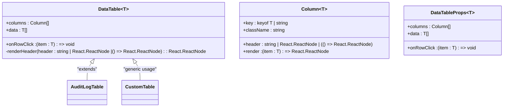
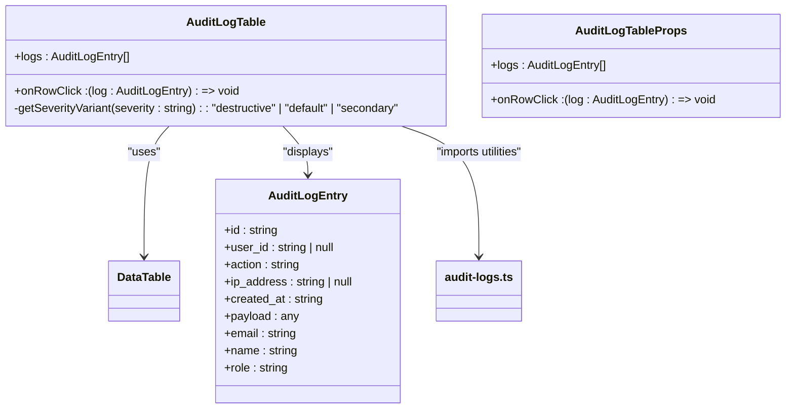
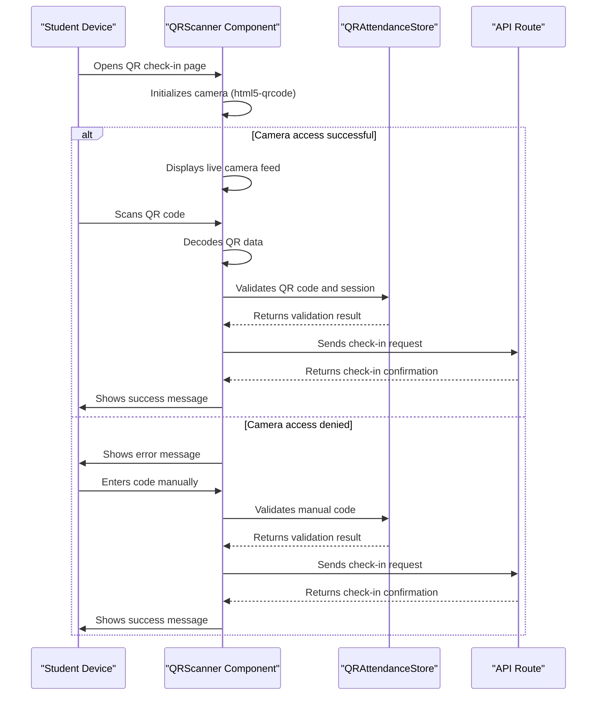
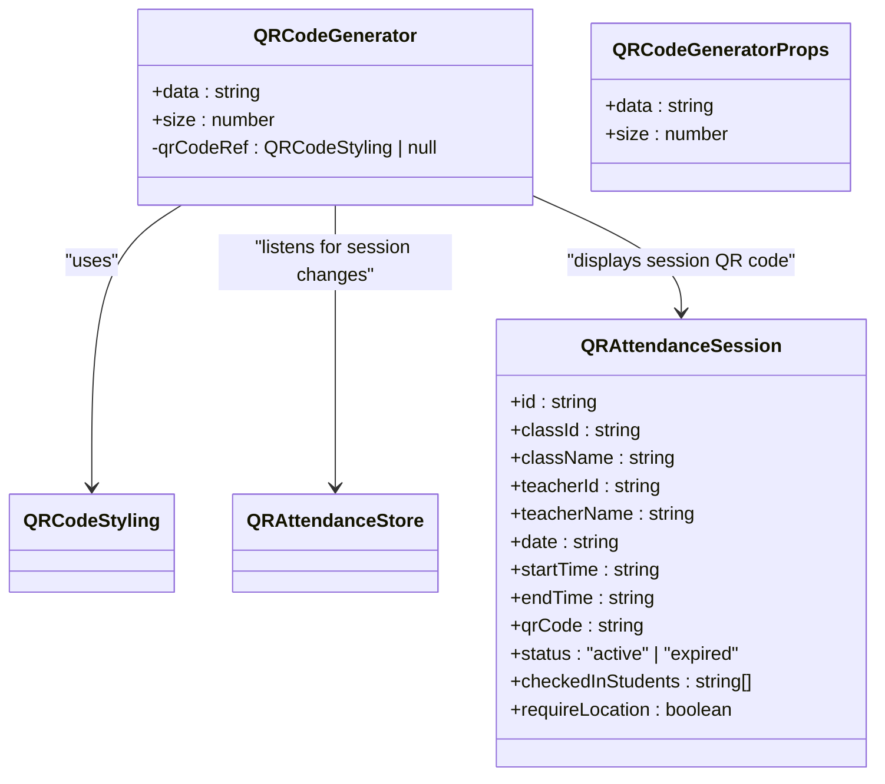
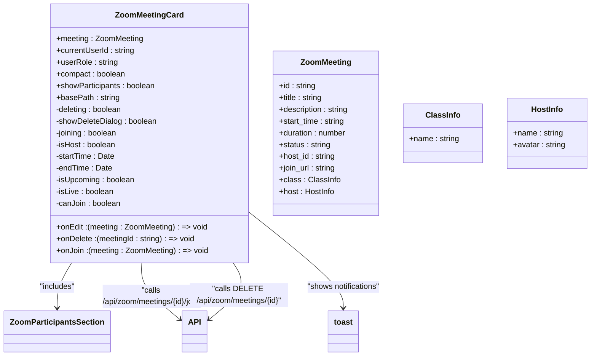
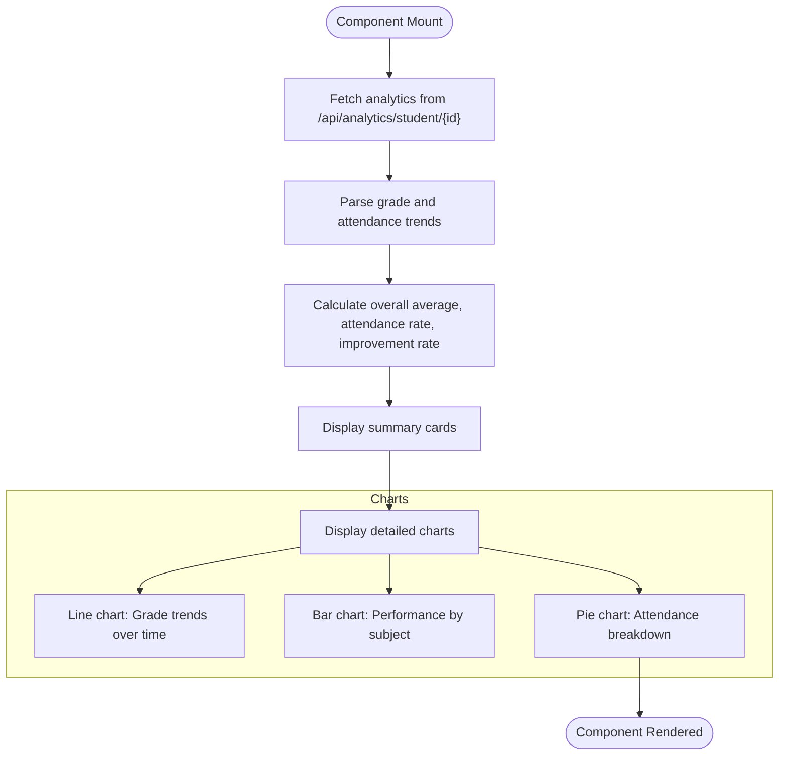
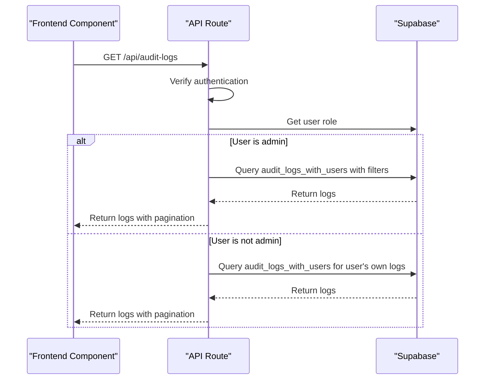
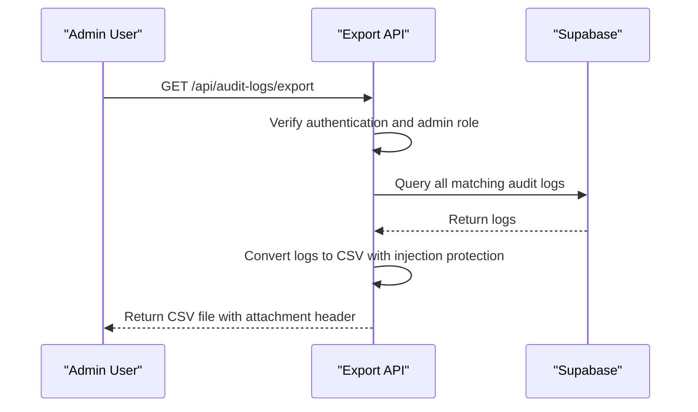
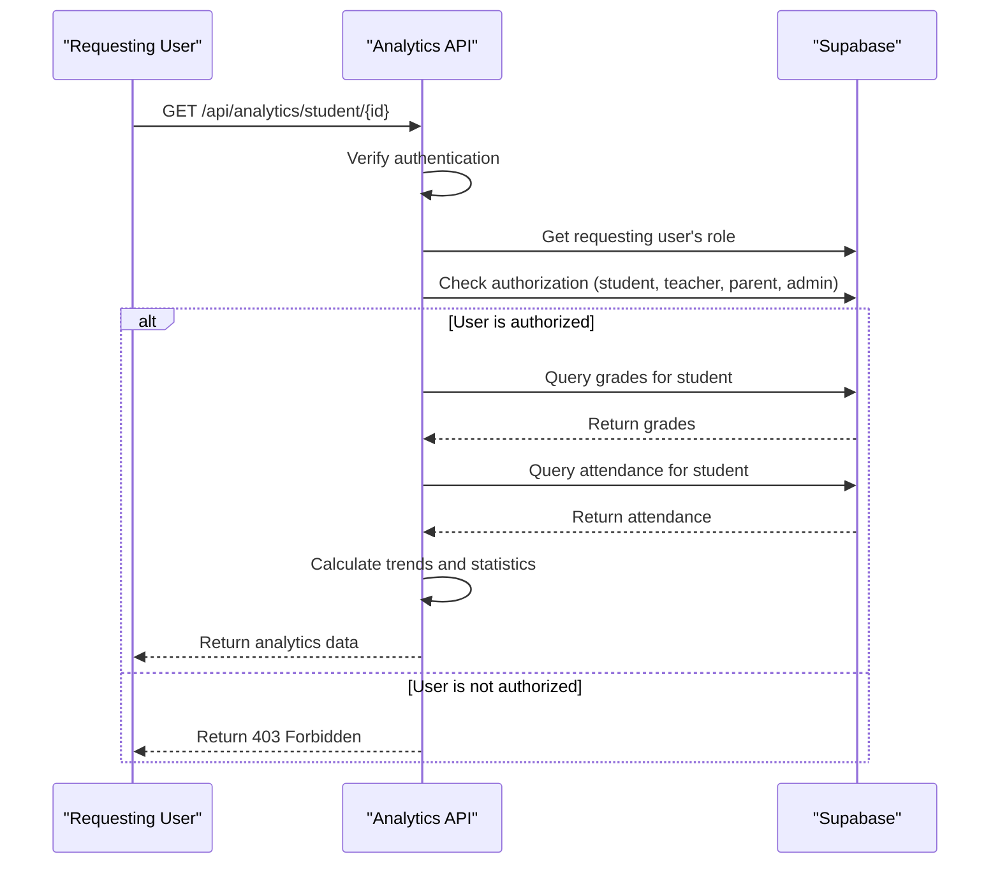

# Business Components

<cite>
**Referenced Files in This Document**   
- [data-table.tsx](file://components/data-table.tsx)
- [audit-log-table.tsx](file://components/audit-log-table.tsx)
- [qr-scanner.tsx](file://components/qr-scanner.tsx)
- [qr-code-generator.tsx](file://components/qr-code-generator.tsx)
- [zoom-meeting-card.tsx](file://components/zoom-meeting-card.tsx)
- [audit-log-analytics.tsx](file://components/audit-log-analytics.tsx)
- [progress-analytics.tsx](file://components/progress-analytics.tsx)
- [analytics-store.ts](file://lib/analytics-store.ts)
- [qr-attendance-store.ts](file://lib/qr-attendance-store.ts)
- [audit-logs.ts](file://lib/supabase/audit-logs.ts)
- [route.ts](file://app/api/audit-logs/route.ts)
- [export/route.ts](file://app/api/audit-logs/export/route.ts)
- [stats/route.ts](file://app/api/audit-logs/stats/route.ts)
- [analytics/student/[id]/route.ts](file://app/api/analytics/student/[id]/route.ts)
</cite>

## Table of Contents
1. [Introduction](#introduction)
2. [Data Table Components](#data-table-components)
3. [QR-Based Attendance Components](#qr-based-attendance-components)
4. [Zoom Meeting Components](#zoom-meeting-components)
5. [Analytics Components](#analytics-components)
6. [State Management and Data Flow](#state-management-and-data-flow)
7. [API Integration and Security](#api-integration-and-security)
8. [Real-World Usage Examples](#real-world-usage-examples)
9. [Error Handling and User Experience](#error-handling-and-user-experience)
10. [Conclusion](#conclusion)

## Introduction
This document provides comprehensive documentation for the business logic-driven components in the School Management System. The components covered encapsulate specific domain functionality related to data presentation, attendance workflows, meeting management, and analytics visualization. These components are designed to provide robust, user-friendly interfaces for administrators, teachers, students, and parents, with proper integration to backend services and state management systems.

## Data Table Components

The data table components provide a flexible and reusable solution for rendering paginated, sortable tabular data with filtering and export capabilities. The implementation consists of a base `DataTable` component and specialized implementations for specific use cases.



**Diagram sources**
- [data-table.tsx](file://components/data-table.tsx#L1-L60)

**Section sources**
- [data-table.tsx](file://components/data-table.tsx#L1-L60)

### Audit Log Table Implementation

The `AuditLogTable` component is a specialized implementation of the `DataTable` component designed specifically for displaying audit log entries. It includes custom rendering for date/time, user information, roles, actions, and IP addresses, with appropriate formatting and styling based on the data type.



**Diagram sources**
- [audit-log-table.tsx](file://components/audit-log-table.tsx#L1-L84)
- [data-table.tsx](file://components/data-table.tsx#L1-L60)
- [audit-logs.ts](file://lib/supabase/audit-logs.ts#L8-L18)

**Section sources**
- [audit-log-table.tsx](file://components/audit-log-table.tsx#L1-L84)

## QR-Based Attendance Components

The QR-based attendance components enable secure and efficient attendance tracking through QR code scanning and generation. These components support both student check-in and teacher-initiated attendance sessions, with integration to state management and backend services.

### QR Scanner Component

The `QRScanner` component provides a full-screen interface for scanning QR codes using the device's camera. It handles camera initialization, error management, and provides fallback options for manual code entry when camera access is unavailable or problematic.



**Diagram sources**
- [qr-scanner.tsx](file://components/qr-scanner.tsx#L1-L161)
- [qr-attendance-store.ts](file://lib/qr-attendance-store.ts#L1-L100)

**Section sources**
- [qr-scanner.tsx](file://components/qr-scanner.tsx#L1-L161)

### QR Code Generator Component

The `QRCodeGenerator` component creates dynamic QR codes for attendance sessions initiated by teachers. The generated QR codes contain session-specific information and are updated periodically for security purposes. The component uses the QRCodeStyling library to create visually appealing QR codes with custom styling.



**Diagram sources**
- [qr-code-generator.tsx](file://components/qr-code-generator.tsx#L1-L66)
- [qr-attendance-store.ts](file://lib/qr-attendance-store.ts#L5-L18)

**Section sources**
- [qr-code-generator.tsx](file://components/qr-code-generator.tsx#L1-L66)

## Zoom Meeting Components

The Zoom meeting components provide a comprehensive interface for managing Zoom meetings within the school system. These components handle meeting display, participant management, joining functionality, and lifecycle operations such as editing and deletion.

### Zoom Meeting Card Component

The `ZoomMeetingCard` component displays detailed information about a Zoom meeting, including title, status, timing, host information, and action buttons. It supports both compact and detailed views and provides appropriate actions based on user role and meeting status.



**Diagram sources**
- [zoom-meeting-card.tsx](file://components/zoom-meeting-card.tsx#L1-L274)

**Section sources**
- [zoom-meeting-card.tsx](file://components/zoom-meeting-card.tsx#L1-L274)

## Analytics Components

The analytics components provide data visualization for audit logs and student progress, transforming raw data from Supabase queries into meaningful insights through charts and summary statistics.

### Audit Log Analytics Component

The `AuditLogAnalytics` component displays key metrics from audit log data, including total logins, failed attempts, success rate, and active users. It also shows the top actions performed in the system, providing administrators with a quick overview of system activity.

```mermaid
classDiagram
class AuditLogAnalytics {
+stats : AuditLogStats
}
class AuditLogStats {
+totalLogins : number
+failedLogins : number
+successRate : number
+uniqueUsers : number
+recentActions : { action : string; count : number }[]
}
AuditLogAnalytics --> Card : "uses UI components"
AuditLogAnalytics --> API : "retrieves from /api/audit-logs/stats"
AuditLogAnalytics --> audit-logs.ts : "uses getAuditLogStats()"
```

**Diagram sources**
- [audit-log-analytics.tsx](file://components/audit-log-analytics.tsx#L1-L78)
- [audit-logs.ts](file://lib/supabase/audit-logs.ts#L30-L36)

**Section sources**
- [audit-log-analytics.tsx](file://components/audit-log-analytics.tsx#L1-L78)

### Progress Analytics Component

The `ProgressAnalytics` component visualizes student performance and attendance trends over time. It fetches data from the analytics API and displays it through line charts, bar charts, and pie charts, providing a comprehensive view of student progress.



**Diagram sources**
- [progress-analytics.tsx](file://components/progress-analytics.tsx#L1-L189)
- [analytics/student/[id]/route.ts](file://app/api/analytics/student/[id]/route.ts#L1-L163)

**Section sources**
- [progress-analytics.tsx](file://components/progress-analytics.tsx#L1-L189)

## State Management and Data Flow

The application uses Zustand stores to manage state for analytics and QR-based attendance, providing a centralized and efficient way to handle data across components.

### Analytics Store

The `useAnalyticsStore` provides a centralized store for student analytics data, with methods to retrieve and calculate various metrics from the raw data.

```mermaid
classDiagram
class useAnalyticsStore {
+studentAnalytics : Record<string, StudentAnalytics>
+getStudentAnalytics(studentId : string) : StudentAnalytics | undefined
+getGradeTrendsBySubject(studentId : string, subject : string) : GradeTrend[]
+getAttendanceStats(studentId : string) : AttendanceStats
+getClassAverages(classId : string, studentIds : string[]) : { average : number; highest : number; lowest : number }
}
class StudentAnalytics {
+studentId : string
+gradeTrends : GradeTrend[]
+attendanceTrends : AttendanceTrend[]
+subjectPerformance : SubjectPerformance[]
+overallAverage : number
+attendanceRate : number
+improvementRate : number
}
class GradeTrend {
+date : string
+grade : number
+subject : string
+type : string
}
class AttendanceTrend {
+date : string
+status : AttendanceStatus
}
class SubjectPerformance {
+subject : string
+average : number
+highest : number
+lowest : number
+count : number
}
useAnalyticsStore --> StudentAnalytics : "stores"
useAnalyticsStore --> progress-analytics.tsx : "used by"
useAnalyticsStore --> analytics-store.ts : "defined in"
```

**Diagram sources**
- [analytics-store.ts](file://lib/analytics-store.ts#L1-L83)
- [progress-analytics.tsx](file://components/progress-analytics.tsx#L1-L189)

**Section sources**
- [analytics-store.ts](file://lib/analytics-store.ts#L1-L83)

### QR Attendance Store

The `useQRAttendanceStore` manages the state for QR-based attendance sessions, including session creation, check-in tracking, and session lifecycle management.

```mermaid
classDiagram
class useQRAttendanceStore {
+sessions : QRAttendanceSession[]
+createSession(session : Omit<QRAttendanceSession, "id" | "qrCode" | "status" | "checkedInStudents">) : QRAttendanceSession
+checkIn(sessionId : string, studentId : string, locationVerified? : boolean) : { success : boolean; message : string }
+endSession(sessionId : string) : void
+getActiveSession(classId : string) : QRAttendanceSession | undefined
+getSessionByQRCode(qrCode : string) : QRAttendanceSession | undefined
+getTeacherSessions(teacherId : string) : QRAttendanceSession[]
}
class QRAttendanceSession {
+id : string
+classId : string
+className : string
+teacherId : string
+teacherName : string
+date : string
+startTime : string
+endTime : string
+qrCode : string
+status : "active" | "expired"
+checkedInStudents : string[]
+requireLocation : boolean
}
useQRAttendanceStore --> QRAttendanceSession : "manages"
useQRAttendanceStore --> qr-attendance-store.ts : "defined in"
useQRAttendanceStore --> qr-scanner.tsx : "used by"
useQRAttendanceStore --> qr-code-generator.tsx : "used by"
```

**Diagram sources**
- [qr-attendance-store.ts](file://lib/qr-attendance-store.ts#L1-L100)
- [qr-scanner.tsx](file://components/qr-scanner.tsx#L1-L161)
- [qr-code-generator.tsx](file://components/qr-code-generator.tsx#L1-L66)

**Section sources**
- [qr-attendance-store.ts](file://lib/qr-attendance-store.ts#L1-L100)

## API Integration and Security

The components integrate with various API routes that provide data and handle operations, with proper authentication and authorization checks.

### Audit Logs API Routes

The audit logs API routes provide secure access to audit log data with role-based authorization. Only administrators can access all logs, while regular users can only access their own logs.



**Diagram sources**
- [route.ts](file://app/api/audit-logs/route.ts#L1-L65)
- [audit-logs.ts](file://lib/supabase/audit-logs.ts#L41-L82)

**Section sources**
- [route.ts](file://app/api/audit-logs/route.ts#L1-L65)

### Audit Logs Export API

The audit logs export API allows administrators to download audit log data as CSV files, with security measures to prevent formula injection attacks.



**Diagram sources**
- [export/route.ts](file://app/api/audit-logs/export/route.ts#L1-L59)
- [audit-logs.ts](file://lib/supabase/audit-logs.ts#L244-L261)

**Section sources**
- [export/route.ts](file://app/api/audit-logs/export/route.ts#L1-L59)

### Student Analytics API

The student analytics API provides detailed performance and attendance data for students, with authorization based on user role and relationship to the student.



**Diagram sources**
- [analytics/student/[id]/route.ts](file://app/api/analytics/student/[id]/route.ts#L1-L163)

**Section sources**
- [analytics/student/[id]/route.ts](file://app/api/analytics/student/[id]/route.ts#L1-L163)

## Real-World Usage Examples

The components are used across various dashboards in the system, providing tailored experiences for different user roles.

### Admin Dashboard Usage

In the admin dashboard, the audit log components are used to monitor system activity, with the ability to filter logs, view statistics, and export data for compliance purposes.

**Section sources**
- [audit-log-table.tsx](file://components/audit-log-table.tsx#L1-L84)
- [audit-log-analytics.tsx](file://components/audit-log-analytics.tsx#L1-L78)
- [app/admin/audit-logs/page.tsx](file://app/admin/audit-logs/page.tsx)

### Teacher Dashboard Usage

Teachers use the QR attendance components to create attendance sessions for their classes and monitor student check-ins. They also use the Zoom meeting components to manage virtual classes.

**Section sources**
- [qr-code-generator.tsx](file://components/qr-code-generator.tsx#L1-L66)
- [qr-attendance-store.ts](file://lib/qr-attendance-store.ts#L1-L100)
- [zoom-meeting-card.tsx](file://components/zoom-meeting-card.tsx#L1-L274)
- [app/teacher/qr-attendance/page.tsx](file://app/teacher/qr-attendance/page.tsx)
- [app/teacher/meetings/page.tsx](file://app/teacher/meetings/page.tsx)

### Student Dashboard Usage

Students use the QR scanner to check in to classes and view their progress analytics to track their academic performance over time.

**Section sources**
- [qr-scanner.tsx](file://components/qr-scanner.tsx#L1-L161)
- [progress-analytics.tsx](file://components/progress-analytics.tsx#L1-L189)
- [app/student/qr-checkin/page.tsx](file://app/student/qr-checkin/page.tsx)
- [app/student/analytics/page.tsx](file://app/student/analytics/page.tsx)

## Error Handling and User Experience

The components implement comprehensive error handling to provide a smooth user experience, with appropriate feedback for various error conditions.

### QR Scanner Error Handling

The QR scanner component handles various camera-related errors and provides clear feedback to users, along with alternative methods for completing the task.

```mermaid
flowchart TD
A[Initialize Scanner] --> B{Success?}
B --> |Yes| C[Display Camera Feed]
B --> |No| D{Error Type}
D --> |Permission Denied| E[Show "Camera permission denied" message]
D --> |No Camera Found| F[Show "No camera found" message]
D --> |Other Error| G[Show "Unable to start camera" message]
E --> H[Offer Manual Input Option]
F --> H
G --> H
H --> I[User Enters Code Manually]
I --> J[Process Manual Input]
```

**Diagram sources**
- [qr-scanner.tsx](file://components/qr-scanner.tsx#L73-L87)

**Section sources**
- [qr-scanner.tsx](file://components/qr-scanner.tsx#L1-L161)

### API Error Handling

API routes implement proper error handling with logging and appropriate HTTP status codes, while frontend components display user-friendly error messages.

**Section sources**
- [route.ts](file://app/api/audit-logs/route.ts#L60-L64)
- [export/route.ts](file://app/api/audit-logs/export/route.ts#L54-L58)
- [analytics/student/[id]/route.ts](file://app/api/analytics/student/[id]/route.ts#L158-L161)

## Conclusion

The business components in the School Management System provide robust, secure, and user-friendly interfaces for key functionality including data presentation, attendance tracking, meeting management, and analytics visualization. These components are well-integrated with state management and backend services, following consistent patterns for data flow, error handling, and user experience. The modular design allows for reuse across different parts of the application while providing specialized functionality for specific use cases. The components support the needs of all user roles in the system, from administrators and teachers to students and parents, ensuring that each user has access to the tools and information they need to effectively participate in the educational process.