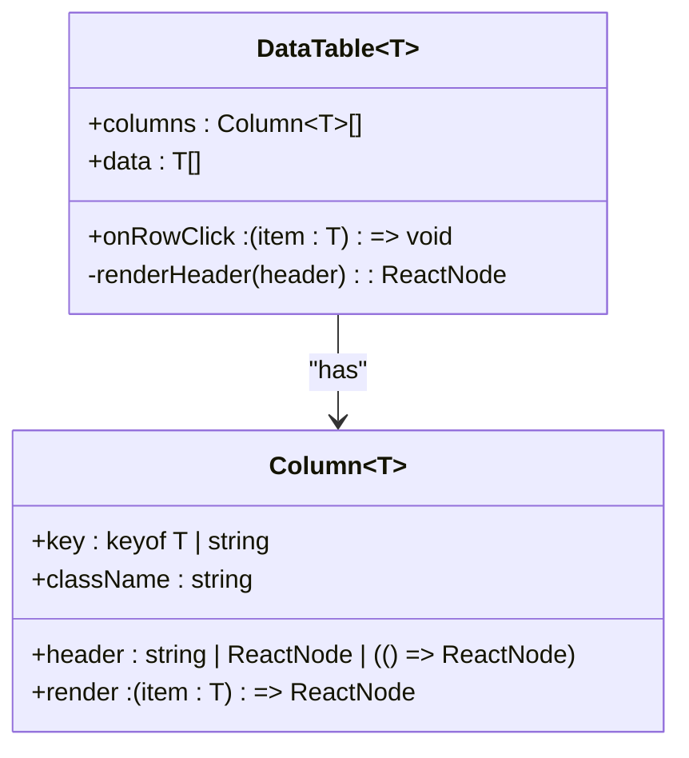
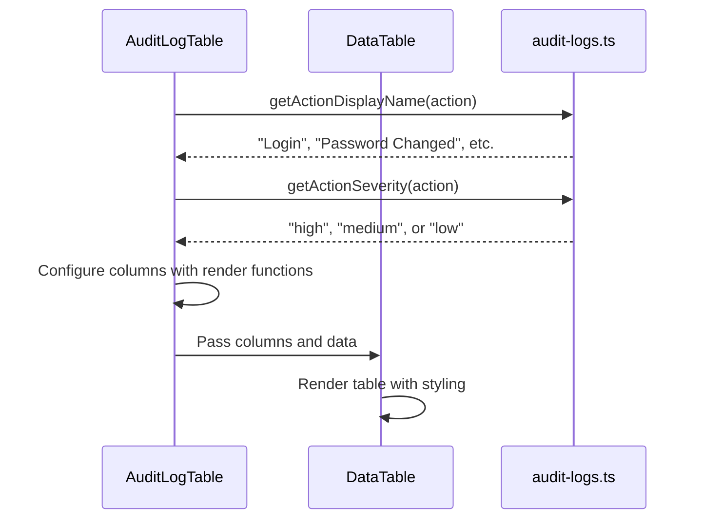
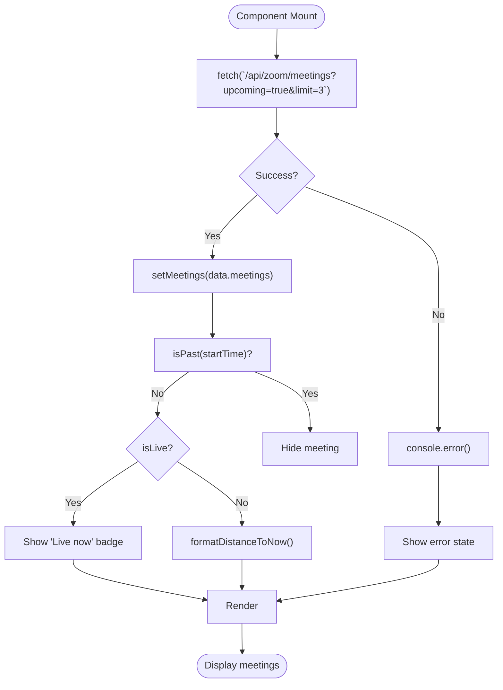
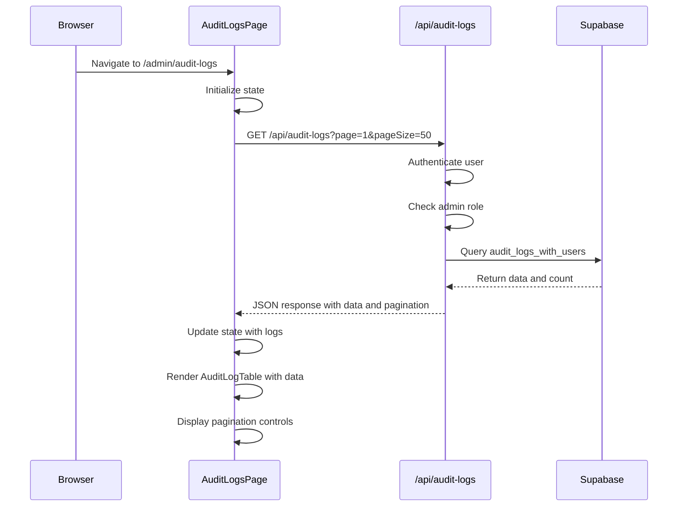

# Data Display Components

<cite>
**Referenced Files in This Document**   
- [data-table.tsx](file://components/data-table.tsx)
- [audit-log-table.tsx](file://components/audit-log-table.tsx)
- [stat-card.tsx](file://components/stat-card.tsx)
- [upcoming-meetings-widget.tsx](file://components/upcoming-meetings-widget.tsx)
- [audit-logs.ts](file://lib/supabase/audit-logs.ts)
- [page.tsx](file://app/admin/audit-logs/page.tsx)
- [route.ts](file://app/api/audit-logs/route.ts)
- [audit-log-analytics.tsx](file://components/audit-log-analytics.tsx)
- [audit-log-filters.tsx](file://components/audit-log-filters.tsx)
</cite>

## Table of Contents
1. [Introduction](#introduction)
2. [DataTable Component](#datatable-component)
3. [AuditLogTable Component](#auditlogtable-component)
4. [StatCard Component](#statcard-component)
5. [UpcomingMeetingsWidget Component](#upcomingmeetingswidget-component)
6. [Usage Patterns Across Dashboards](#usage-patterns-across-dashboards)
7. [Data Flow from API to UI](#data-flow-from-api-to-ui)
8. [Customization and Accessibility](#customization-and-accessibility)

## Introduction
This document provides comprehensive documentation for the data presentation components in the School Management System. These components are responsible for rendering structured information in tabular and summary formats across various dashboards. The system includes reusable components for displaying data tables, audit logs, key metrics, and calendar events, designed to support the needs of administrators, teachers, parents, and students.

## DataTable Component

The DataTable component is a generic, reusable table implementation that supports dynamic column configuration, custom rendering logic, and row interaction handling. It is designed to work with any data type through TypeScript generics, requiring only that the data items have an `id` property for keying rows.

The component accepts a configuration of columns where each column can specify a key, header content, and an optional render function for custom cell content. The render function allows for complex cell content including interactive elements, while the default behavior displays the string representation of the corresponding property. Column headers support static text, React nodes, or functions that return React nodes, enabling dynamic header content.

Row interaction is handled through an optional `onRowClick` callback that receives the clicked data item. The component applies appropriate styling for hover states and cursor indication when interaction is enabled. The table is wrapped in a container with horizontal overflow to ensure responsiveness on smaller screens.



**Diagram sources**
- [data-table.tsx](file://components/data-table.tsx#L8-L13)

**Section sources**
- [data-table.tsx](file://components/data-table.tsx#L1-L60)

## AuditLogTable Component

The AuditLogTable component specializes the generic DataTable to display audit log entries from Supabase. It integrates with the audit logging system to present authentication and security events with enhanced visual indicators for severity levels and properly formatted timestamps.

The component configures columns to display key audit information including date/time, user details, role, action type, and IP address. The date/time column renders timestamps in a user-friendly format with separate date and time lines. The action column uses severity-based badge coloring, with high-severity actions (like password changes or user deletions) displayed in destructive variants, medium-severity actions in default variants, and low-severity actions in secondary variants.

User information is displayed with name and email in a stacked format, while roles are presented as capitalized outline badges. The component leverages utility functions from the audit-logs module to translate action codes into human-readable display names and determine appropriate severity levels for visual presentation.



**Diagram sources**
- [audit-log-table.tsx](file://components/audit-log-table.tsx#L1-L84)
- [audit-logs.ts](file://lib/supabase/audit-logs.ts#L266-L320)

**Section sources**
- [audit-log-table.tsx](file://components/audit-log-table.tsx#L1-L84)
- [audit-logs.ts](file://lib/supabase/audit-logs.ts#L8-L320)

## StatCard Component

The StatCard component provides a standardized way to visualize key metrics with supporting context and trend indicators. It displays a title, value, icon, and optional trend information in a card layout that is consistent across dashboards.

The component accepts a title, value, icon from the Lucide icon library, and an optional trend object containing a percentage value and label. The trend indicator is color-coded with positive trends in primary color and negative trends in destructive color. The value is prominently displayed in large font, while the title appears as muted secondary text.

The visual design includes a colored icon in a subtle background circle, creating visual interest while maintaining a clean, professional appearance. The component supports custom styling through a className prop, allowing for layout adjustments when used in grid arrangements.

```mermaid
classDiagram
class StatCard {
+title : string
+value : string | number
+icon : LucideIcon
+trend : {value : number, label : string}
+className : string
}
StatCard --> LucideIcon : "uses"
```

**Diagram sources**
- [stat-card.tsx](file://components/stat-card.tsx#L1-L39)

**Section sources**
- [stat-card.tsx](file://components/stat-card.tsx#L1-L39)

## UpcomingMeetingsWidget Component

The UpcomingMeetingsWidget component displays a list of upcoming Zoom meetings with real-time status indicators and join functionality. It fetches meeting data from the API and presents it in a card format with visual cues for meeting status.

The component shows meetings with their title, time until start (or "Live now" indicator), and a join/start button. Meetings currently in progress are highlighted with green indicators, while upcoming meetings use blue. The component handles both joining as a participant and starting as a host, with appropriate button text and URL routing.

The widget includes loading states with animated spinners and empty states with calendar icons when no meetings are scheduled. It supports different dashboard paths based on user role (admin, teacher, parent, student) and provides a link to view all meetings. The component uses date-fns for relative time formatting and handles API errors gracefully with console logging.



**Diagram sources**
- [upcoming-meetings-widget.tsx](file://components/upcoming-meetings-widget.tsx#L1-L127)

**Section sources**
- [upcoming-meetings-widget.tsx](file://components/upcoming-meetings-widget.tsx#L1-L127)

## Usage Patterns Across Dashboards

The data presentation components are used consistently across admin, teacher, parent, and student dashboards, with appropriate variations based on user role and permissions. The Admin dashboard features the most comprehensive use of these components, particularly for audit logs and system analytics.

In the admin audit logs page, the AuditLogTable is combined with filtering controls, analytics cards, and export functionality to create a complete monitoring solution. The StatCard component is used in the analytics section to display login statistics, success rates, and active user counts. The AuditLogAnalytics component uses multiple StatCards in a grid layout to present key metrics at a glance.

Teacher and student dashboards use the UpcomingMeetingsWidget to display relevant Zoom meetings, with role-appropriate navigation paths. The DataTable component is used across various pages to display classes, grades, and attendance records, with column configurations tailored to the specific data being presented.

The components are designed with responsive layouts that adapt to different screen sizes, using grid systems and flexible containers to maintain usability on mobile devices. Accessibility features include proper ARIA labels, keyboard navigation support, and sufficient color contrast for readability.

**Section sources**
- [page.tsx](file://app/admin/audit-logs/page.tsx#L1-L336)
- [audit-log-analytics.tsx](file://components/audit-log-analytics.tsx#L1-L78)
- [audit-log-filters.tsx](file://components/audit-log-filters.tsx#L1-L154)

## Data Flow from API to UI

The data flow for presentation components follows a consistent pattern from API routes through server functions to client-side rendering. For audit logs, the process begins with an API route that authenticates the user, checks permissions, and queries Supabase for audit log data.

The API route `/api/audit-logs/route.ts` uses server-side Supabase client to fetch data from the `audit_logs_with_users` view, applying filters based on query parameters. Authorization logic ensures that only admins can view all logs, while regular users can only access their own audit records.

On the client side, the admin audit logs page fetches data using the browser's Fetch API, converting URL parameters into query string format. The response includes both the log data and pagination metadata, which is used to control the DataTable's display and enable navigation between pages.

The Supabase audit-logs module provides utility functions that abstract the database queries and data transformation logic. These functions return structured data that is directly compatible with the presentation components, minimizing the need for additional processing in the UI layer.



**Diagram sources**
- [route.ts](file://app/api/audit-logs/route.ts#L1-L65)
- [page.tsx](file://app/admin/audit-logs/page.tsx#L1-L336)

**Section sources**
- [route.ts](file://app/api/audit-logs/route.ts#L1-L65)
- [page.tsx](file://app/admin/audit-logs/page.tsx#L1-L336)

## Customization and Accessibility

The data presentation components support extensive customization through their API while maintaining accessibility standards. The DataTable component allows for complete column configuration, enabling teams to customize which fields are displayed, how they are labeled, and how their values are rendered.

Column customization includes the ability to specify custom render functions for complex cell content such as badges, avatars, or interactive elements. The className prop on columns allows for styling adjustments to individual columns, supporting alignment, width, and text formatting requirements.

All components follow accessibility best practices with proper semantic HTML, ARIA attributes, and keyboard navigation support. The DataTable uses proper table semantics with THEAD, TBODY, and appropriate heading cells. Interactive elements include focus states and are operable via keyboard.

The components are designed with responsive considerations, using CSS classes that adapt to different screen sizes. The DataTable's container has horizontal overflow to prevent layout breaking on small screens, while the StatCard and UpcomingMeetingsWidget use flexbox and grid layouts that reflow appropriately.

Color usage follows the application's design system with sufficient contrast ratios. Badge variants use color meaningfully to indicate severity or status, with textual labels providing redundant information for color-blind users. Icons are accompanied by text labels or have appropriate ARIA labels when used alone.

**Section sources**
- [data-table.tsx](file://components/data-table.tsx#L1-L60)
- [audit-log-table.tsx](file://components/audit-log-table.tsx#L1-L84)
- [stat-card.tsx](file://components/stat-card.tsx#L1-L39)
- [upcoming-meetings-widget.tsx](file://components/upcoming-meetings-widget.tsx#L1-L127)