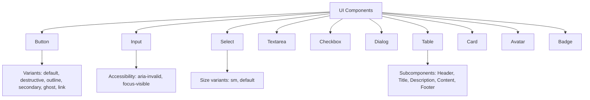
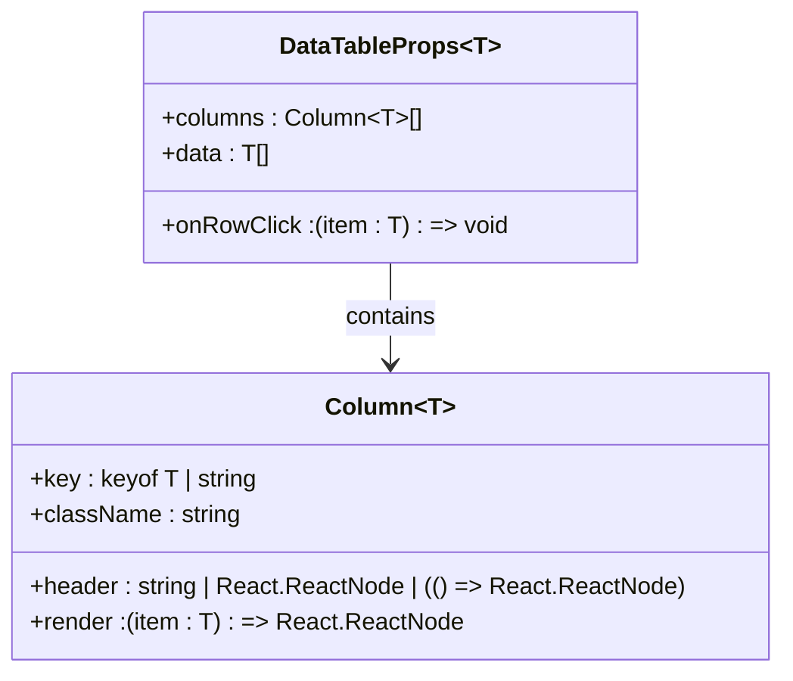
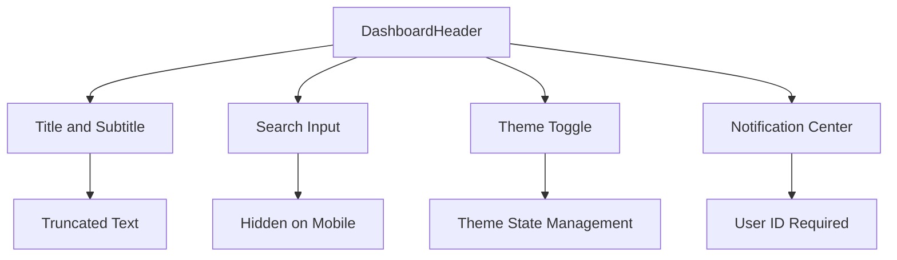
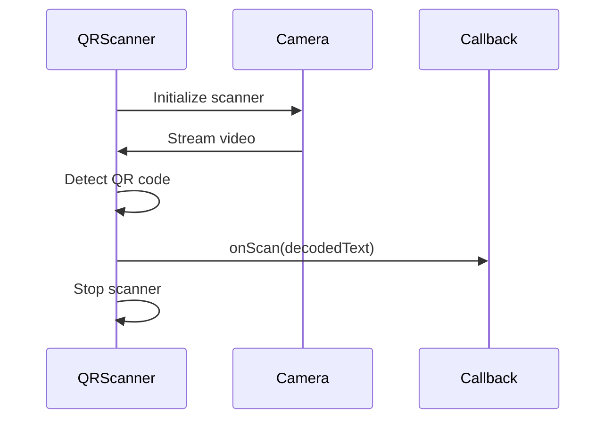
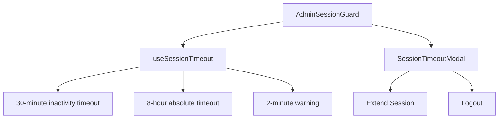
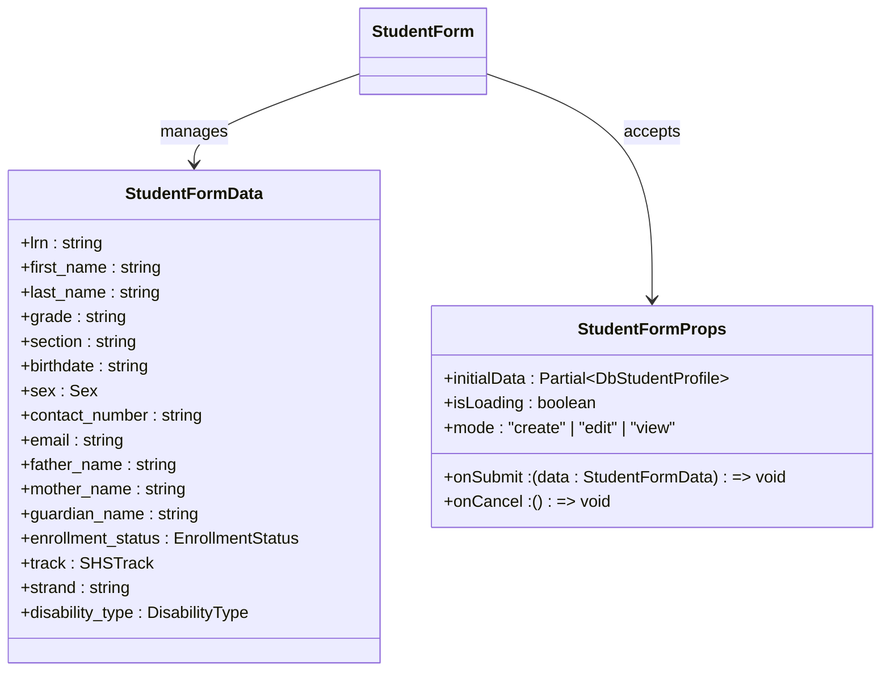
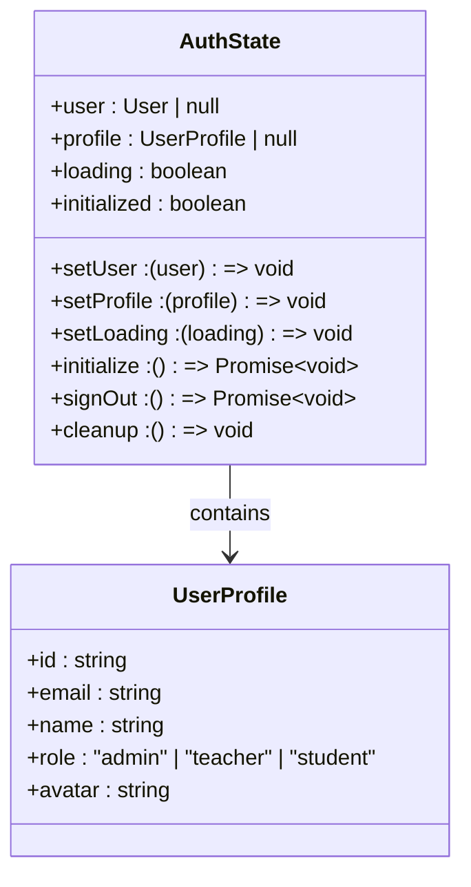
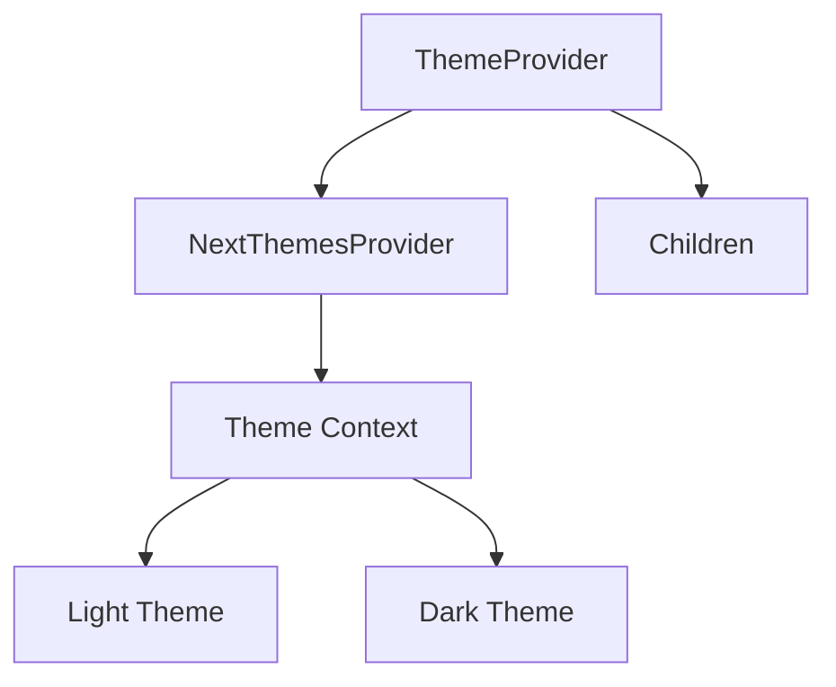

# Components Directory Structure

<cite>
**Referenced Files in This Document**   
- [components/ui/button.tsx](file://components/ui/button.tsx)
- [components/ui/dialog.tsx](file://components/ui/dialog.tsx)
- [components/ui/table.tsx](file://components/ui/table.tsx)
- [components/ui/input.tsx](file://components/ui/input.tsx)
- [components/ui/select.tsx](file://components/ui/select.tsx)
- [components/ui/textarea.tsx](file://components/ui/textarea.tsx)
- [components/ui/checkbox.tsx](file://components/ui/checkbox.tsx)
- [components/ui/avatar.tsx](file://components/ui/avatar.tsx)
- [components/ui/badge.tsx](file://components/ui/badge.tsx)
- [components/ui/card.tsx](file://components/ui/card.tsx)
- [components/data-table.tsx](file://components/data-table.tsx)
- [components/dashboard-header.tsx](file://components/dashboard-header.tsx)
- [components/qr-scanner.tsx](file://components/qr-scanner.tsx)
- [components/admin-session-guard.tsx](file://components/admin-session-guard.tsx)
- [components/student-form.tsx](file://components/student-form.tsx)
- [components/zoom-meeting-card.tsx](file://components/zoom-meeting-card.tsx)
- [components/theme-provider.tsx](file://components/theme-provider.tsx)
- [lib/auth-store.ts](file://lib/auth-store.ts)
</cite>

## Table of Contents
1. [Introduction](#introduction)
2. [UI Component Library](#ui-component-library)
3. [Business Components](#business-components)
4. [Composition Patterns](#composition-patterns)
5. [State Management Integration](#state-management-integration)
6. [Accessibility and Theming](#accessibility-and-theming)

## Introduction
The components/ directory in the School Management System contains a comprehensive collection of reusable UI and business components that form the foundation of the application's user interface. The architecture follows a modular design with a clear separation between low-level UI primitives and higher-level business components. The ui/ subdirectory implements a design system based on shadcn/ui principles, providing accessible, styled primitives that ensure consistency across the application. Business components leverage these primitives to create domain-specific functionality for student management, attendance tracking, and meeting coordination.

## UI Component Library

The ui/ subdirectory contains a collection of accessible, styled primitives that serve as the foundation of the application's design system. These components are built on top of Radix UI primitives and styled using Tailwind CSS with class-variance-authority for consistent variant management.



**Diagram sources**
- [components/ui/button.tsx](file://components/ui/button.tsx)
- [components/ui/input.tsx](file://components/ui/input.tsx)
- [components/ui/select.tsx](file://components/ui/select.tsx)
- [components/ui/textarea.tsx](file://components/ui/textarea.tsx)
- [components/ui/checkbox.tsx](file://components/ui/checkbox.tsx)
- [components/ui/dialog.tsx](file://components/ui/dialog.tsx)
- [components/ui/table.tsx](file://components/ui/table.tsx)
- [components/ui/card.tsx](file://components/ui/card.tsx)
- [components/ui/avatar.tsx](file://components/ui/avatar.tsx)
- [components/ui/badge.tsx](file://components/ui/badge.tsx)

### Button Component
The Button component provides multiple variants and sizes for different use cases. It supports an `asChild` prop to render any component as a button while maintaining consistent styling. The component includes focus and hover states with appropriate visual feedback and accessibility features.

**Section sources**
- [components/ui/button.tsx](file://components/ui/button.tsx#L7-L61)

### Input, Select, and Textarea Components
These form components follow consistent styling and accessibility patterns. They include built-in validation states through the `aria-invalid` attribute and provide appropriate focus indicators. The Select component includes size variants and proper keyboard navigation support.

**Section sources**
- [components/ui/input.tsx](file://components/ui/input.tsx#L5-L22)
- [components/ui/select.tsx](file://components/ui/select.tsx#L9-L186)
- [components/ui/textarea.tsx](file://components/ui/textarea.tsx#L5-L19)

### Dialog Component
The Dialog component provides a modal interface with proper accessibility features including focus trapping and screen reader support. It includes subcomponents for header, footer, title, and description to ensure consistent modal structure. The overlay includes a fade animation and proper z-index management.

**Section sources**
- [components/ui/dialog.tsx](file://components/ui/dialog.tsx#L9-L144)

### Table Component
The Table component provides a styled wrapper for standard HTML table elements with responsive behavior. It includes subcomponents for header, body, footer, rows, and cells with consistent styling and hover states. The container ensures horizontal scrolling on smaller screens.

**Section sources**
- [components/ui/table.tsx](file://components/ui/table.tsx#L7-L117)

## Business Components

### Data Table Component
The DataTable component provides a reusable table implementation for displaying tabular data with sorting and filtering capabilities. It accepts a generic type for type safety and supports custom rendering for specific columns.



The component renders a styled table with border separation between rows and hover effects. It supports click handling on rows through the `onRowClick` callback and provides flexible header rendering that can accept strings, React nodes, or render functions.

**Section sources**
- [components/data-table.tsx](file://components/data-table.tsx#L8-L60)

### Dashboard Header Component
The DashboardHeader component provides a consistent navigation header across different dashboard views. It includes search functionality, theme toggle, and notification center integration.



The component accepts props for title, subtitle, description, role, and userId, with responsive behavior that hides the search input on mobile devices. It includes proper truncation for long titles and subtitles.

**Section sources**
- [components/dashboard-header.tsx](file://components/dashboard-header.tsx#L8-L35)

### QR Scanner Component
The QRScanner component provides attendance functionality through QR code scanning. It uses the html5-qrcode library to access the device camera and decode QR codes.



The component handles various error states including camera permission denial and device camera unavailability. It provides a fallback manual input option through a prompt dialog. The scanner automatically stops after a successful scan.

**Section sources**
- [components/qr-scanner.tsx](file://components/qr-scanner.tsx#L7-L161)

## Composition Patterns

### Admin Session Guard Component
The admin-session-guard.tsx component wraps routes with session timeout functionality for administrative users. It uses the useSessionTimeout hook to manage session state and displays a modal warning before session expiration.



The component accepts children as a prop and renders them while managing the session timeout state. It passes the warning state, remaining time, extend session, and logout functions to the SessionTimeoutModal component.

**Section sources**
- [components/admin-session-guard.tsx](file://components/admin-session-guard.tsx#L11-L34)

## State Management Integration

### Student Form Component
The student-form.tsx component demonstrates integration with Zustand stores for form state management. It provides a comprehensive form for student information with multiple collapsible sections.



The component integrates with validation utilities from lib/student-validation and uses constants from lib/deped-constants for Philippine-specific educational data. It includes conditional rendering based on grade level (Junior High vs Senior High) and handles complex form state with proper validation.

**Section sources**
- [components/student-form.tsx](file://components/student-form.tsx#L68-L741)

### Zoom Meeting Card Component
The zoom-meeting-card.tsx component integrates with Zoom API data and demonstrates event handling patterns for meeting management.

```mermaid
flowchart TD
A[ZoomMeetingCard] --> B[Meeting Data]
B --> C[title: string]
B --> D[start_time: string]
B --> E[duration: number]
B --> F[status: string]
B --> G[host: object]
B --> H[class: object]
A --> I[Event Handlers]
I --> J[onEdit: (meeting) => void]
I --> K[onDelete: (id) => void]
I --> L[onJoin: (meeting) => void]
A --> M[API Integration]
M --> N[/api/zoom/meetings/{id}/join]
M --> O[/api/zoom/meetings/{id}]
A --> P[UI States]
P --> Q[Upcoming]
P --> R[Live]
P --> S[Ended]
P --> T[Cancelled]
```

The component handles joining meetings through API calls that return appropriate URLs based on user role (host vs participant). It includes functionality to copy join links to clipboard and delete meetings with confirmation dialogs.

**Section sources**
- [components/zoom-meeting-card.tsx](file://components/zoom-meeting-card.tsx#L30-L274)

### Auth Store Integration
Business components integrate with the auth-store.ts for user authentication state management. The store uses Zustand for state management and Supabase for authentication.



Components access authentication state through the useAuthStore hook, which provides user information and authentication status. The store initializes on component mount and subscribes to authentication state changes.

**Section sources**
- [lib/auth-store.ts](file://lib/auth-store.ts#L1-L110)

## Accessibility and Theming

### Theme Provider Component
The theme-provider.tsx component wraps the application with theme management capabilities using next-themes. It provides a simple wrapper around the NextThemesProvider.



The component enables theme switching across the application and persists user theme preferences. It integrates with the theme-toggle component to provide user-controlled theme switching.

**Section sources**
- [components/theme-provider.tsx](file://components/theme-provider.tsx#L9-L12)

### Accessibility Features
The component library implements comprehensive accessibility features including:
- Proper ARIA attributes for form elements and interactive components
- Keyboard navigation support for all interactive elements
- Focus management in modal dialogs
- Screen reader support through appropriate labels and roles
- Color contrast compliance with WCAG standards
- Responsive design for various screen sizes and devices

All UI components include appropriate focus indicators, hover states, and disabled states to ensure usability for all users. Form components provide visual feedback for validation errors and include proper labeling for screen readers.

**Section sources**
- [components/ui/button.tsx](file://components/ui/button.tsx)
- [components/ui/input.tsx](file://components/ui/input.tsx)
- [components/ui/select.tsx](file://components/ui/select.tsx)
- [components/ui/textarea.tsx](file://components/ui/textarea.tsx)
- [components/ui/checkbox.tsx](file://components/ui/checkbox.tsx)
- [components/ui/dialog.tsx](file://components/ui/dialog.tsx)