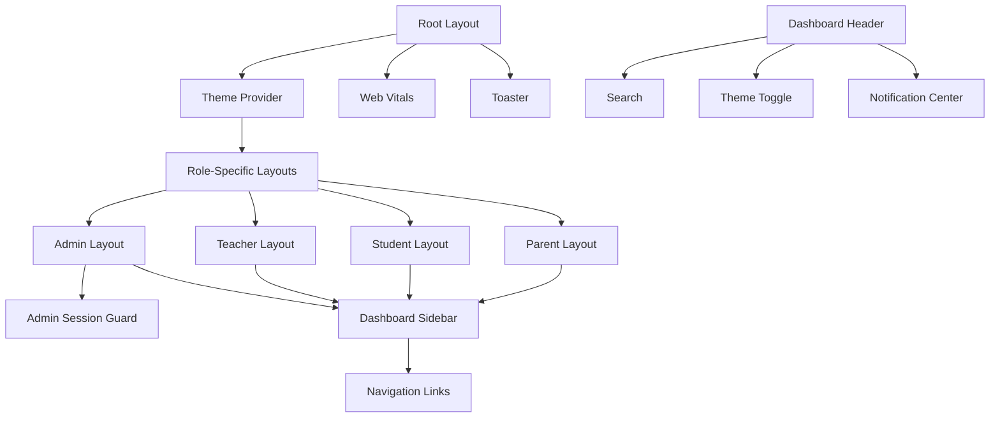
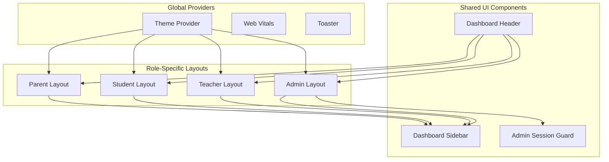
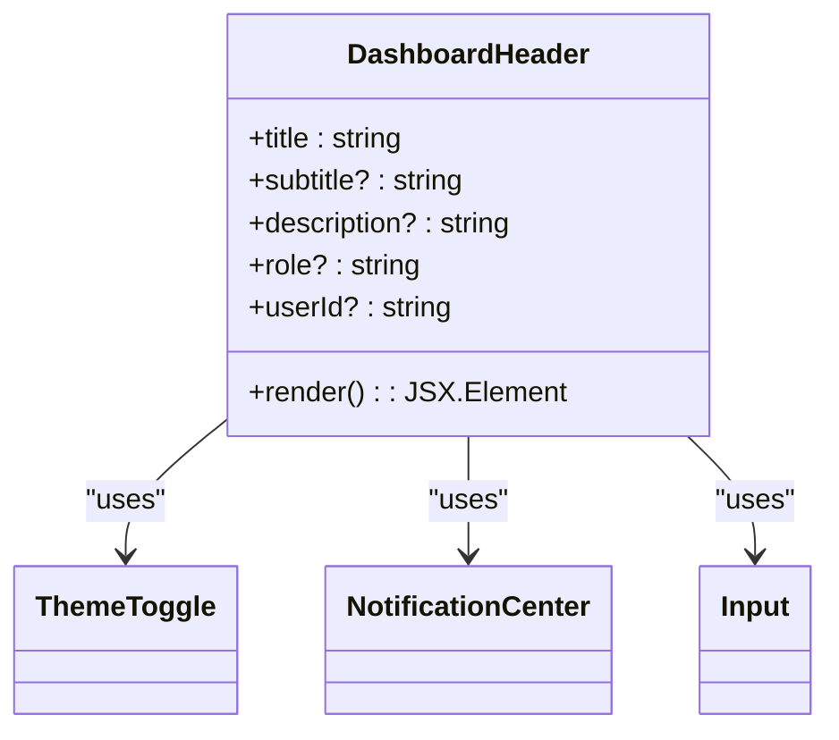
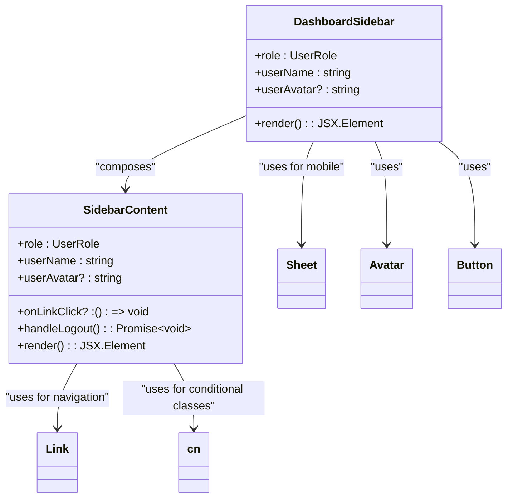
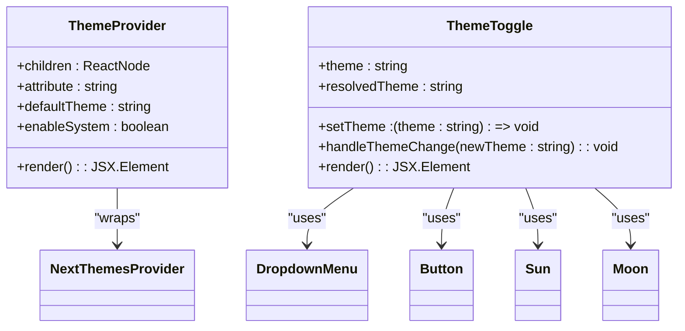
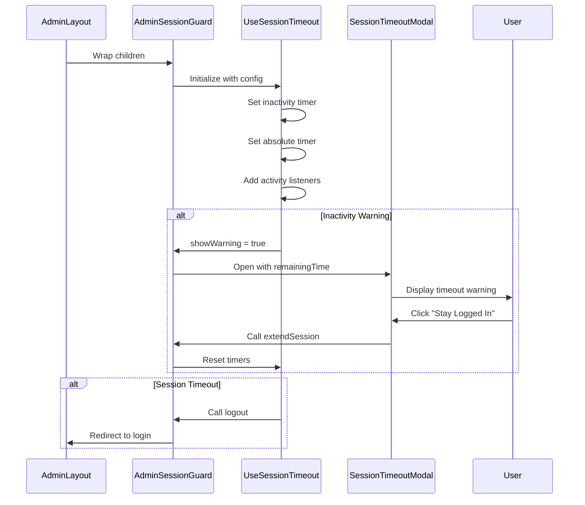
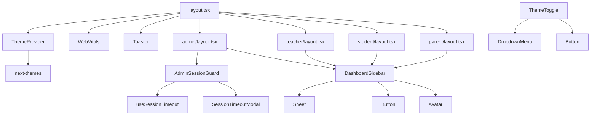

# Layout Components

<cite>
**Referenced Files in This Document**   
- [dashboard-header.tsx](file://components/dashboard-header.tsx)
- [dashboard-sidebar.tsx](file://components/dashboard-sidebar.tsx)
- [layout.tsx](file://app/layout.tsx)
- [admin-session-guard.tsx](file://components/admin-session-guard.tsx)
- [theme-provider.tsx](file://components/theme-provider.tsx)
- [theme-toggle.tsx](file://components/theme-toggle.tsx)
- [admin/layout.tsx](file://app/admin/layout.tsx)
- [student/layout.tsx](file://app/student/layout.tsx)
- [teacher/layout.tsx](file://app/teacher/layout.tsx)
- [parent/layout.tsx](file://app/parent/layout.tsx)
- [session-timeout-modal.tsx](file://components/session-timeout-modal.tsx)
- [use-session-timeout.ts](file://lib/hooks/use-session-timeout.ts)
- [globals.css](file://app/globals.css)
- [types.ts](file://lib/types.ts)
</cite>

## Table of Contents
1. [Introduction](#introduction)
2. [Project Structure](#project-structure)
3. [Core Components](#core-components)
4. [Architecture Overview](#architecture-overview)
5. [Detailed Component Analysis](#detailed-component-analysis)
6. [Dependency Analysis](#dependency-analysis)
7. [Performance Considerations](#performance-considerations)
8. [Troubleshooting Guide](#troubleshooting-guide)
9. [Conclusion](#conclusion)

## Introduction
The School Management System employs a modular layout architecture that provides consistent navigation, theme management, and role-based access control across different user roles. The system uses Next.js App Router with React Server Components and client-side interactivity where needed. The layout components work together to create a cohesive user experience with responsive design, accessibility features, and security controls.

## Project Structure
The application follows a feature-based organization with role-specific directories under the `app` folder. Each role (admin, teacher, student, parent) has its own layout file that wraps the shared UI components with role-specific configurations. The core layout components are located in the `components` directory and are imported by the role-specific layouts.

**Diagram sources**
- [layout.tsx](file://app/layout.tsx#L1-L43)
- [admin/layout.tsx](file://app/admin/layout.tsx#L1-L62)
- [dashboard-sidebar.tsx](file://components/dashboard-sidebar.tsx#L1-L225)
- [dashboard-header.tsx](file://components/dashboard-header.tsx#L1-L35)

**Section sources**
- [app/](file://app/)
- [components/](file://components/)

## Core Components
The layout system consists of several key components that work together to provide a consistent interface across the application. The `layout.tsx` serves as the root layout container, wrapping all pages with theme and session context providers. The `dashboard-header.tsx` and `dashboard-sidebar.tsx` components provide consistent navigation across role-based dashboards. The `admin-session-guard.tsx` component enforces role-based access control for protected routes, while `theme-provider.tsx` and `theme-toggle.tsx` enable dynamic theme switching with persisted preferences.

**Section sources**
- [layout.tsx](file://app/layout.tsx#L1-L43)
- [dashboard-header.tsx](file://components/dashboard-header.tsx#L1-L35)
- [dashboard-sidebar.tsx](file://components/dashboard-sidebar.tsx#L1-L225)
- [admin-session-guard.tsx](file://components/admin-session-guard.tsx#L1-L34)

## Architecture Overview
The layout architecture follows a hierarchical composition pattern where the root layout provides global context, and role-specific layouts add role-specific functionality and navigation. The system uses React's composition model to wrap content with necessary providers and UI components. The theme system leverages `next-themes` for dynamic theme switching with a custom ripple animation during theme transitions. Role-based access is enforced through higher-order components that check authentication status and user roles before rendering protected content.

**Diagram sources**
- [layout.tsx](file://app/layout.tsx#L1-L43)
- [admin/layout.tsx](file://app/admin/layout.tsx#L1-L62)
- [student/layout.tsx](file://app/student/layout.tsx#L1-L60)
- [teacher/layout.tsx](file://app/teacher/layout.tsx#L1-L60)
- [parent/layout.tsx](file://app/parent/layout.tsx#L1-L44)

## Detailed Component Analysis

### Dashboard Header and Sidebar Components
The `dashboard-header.tsx` and `dashboard-sidebar.tsx` components provide consistent navigation across role-based dashboards. The header includes a search bar, theme toggle, and notification center, while the sidebar provides role-specific navigation links.

#### Dashboard Header Implementation

**Diagram sources**
- [dashboard-header.tsx](file://components/dashboard-header.tsx#L1-L35)

**Section sources**
- [dashboard-header.tsx](file://components/dashboard-header.tsx#L1-L35)

#### Dashboard Sidebar Implementation

**Diagram sources**
- [dashboard-sidebar.tsx](file://components/dashboard-sidebar.tsx#L1-L225)
- [types.ts](file://lib/types.ts#L5)

**Section sources**
- [dashboard-sidebar.tsx](file://components/dashboard-sidebar.tsx#L1-L225)

### Root Layout and Theme Management
The `layout.tsx` component serves as the root layout container, providing theme and session context to all pages. It wraps the entire application with the `ThemeProvider` from `next-themes`, enabling dynamic theme switching.

#### Theme Provider Implementation

**Diagram sources**
- [theme-provider.tsx](file://components/theme-provider.tsx#L1-L12)
- [theme-toggle.tsx](file://components/theme-toggle.tsx#L1-L79)
- [layout.tsx](file://app/layout.tsx#L1-L43)

**Section sources**
- [theme-provider.tsx](file://components/theme-provider.tsx#L1-L12)
- [theme-toggle.tsx](file://components/theme-toggle.tsx#L1-L79)
- [globals.css](file://app/globals.css#L1-L169)

### Role-Based Access Control
The `admin-session-guard.tsx` component enforces role-based access control for protected routes, particularly for administrative functions. It integrates with the session timeout system to provide security for sensitive operations.

#### Admin Session Guard Implementation

**Diagram sources**
- [admin-session-guard.tsx](file://components/admin-session-guard.tsx#L1-L34)
- [use-session-timeout.ts](file://lib/hooks/use-session-timeout.ts#L1-L198)
- [session-timeout-modal.tsx](file://components/session-timeout-modal.tsx#L1-L74)

**Section sources**
- [admin-session-guard.tsx](file://components/admin-session-guard.tsx#L1-L34)
- [use-session-timeout.ts](file://lib/hooks/use-session-timeout.ts#L1-L198)

## Dependency Analysis
The layout components have a clear dependency hierarchy with the root layout providing global context to role-specific layouts, which in turn use shared UI components. The theme system depends on `next-themes` for theme management, while the session guard depends on the authentication system and session timeout hook.

**Diagram sources**
- [layout.tsx](file://app/layout.tsx#L1-L43)
- [admin/layout.tsx](file://app/admin/layout.tsx#L1-L62)
- [theme-provider.tsx](file://components/theme-provider.tsx#L1-L12)
- [package.json](file://package.json)

**Section sources**
- [layout.tsx](file://app/layout.tsx#L1-L43)
- [admin/layout.tsx](file://app/admin/layout.tsx#L1-L62)
- [package.json](file://package.json)

## Performance Considerations
The layout system is optimized for performance with several key considerations:
- The root layout uses server-side rendering for the initial page load, minimizing client-side JavaScript execution
- Theme switching includes a ripple animation that provides visual feedback without blocking the main thread
- The session timeout system uses passive event listeners for activity tracking to avoid performance impacts
- Role-specific layouts only load necessary components for each user role, reducing bundle size
- The use of React's composition model allows for efficient re-rendering of only changed components

The system also implements loading states with skeleton screens during authentication checks, providing immediate feedback to users while maintaining a smooth user experience.

**Section sources**
- [admin/layout.tsx](file://app/admin/layout.tsx#L44-L49)
- [student/layout.tsx](file://app/student/layout.tsx#L43-L48)
- [teacher/layout.tsx](file://app/teacher/layout.tsx#L43-L48)
- [parent/layout.tsx](file://app/parent/layout.tsx#L27-L32)

## Troubleshooting Guide
When encountering issues with the layout components, consider the following common problems and solutions:

1. **Theme not persisting between sessions**: Ensure that the `ThemeProvider` in `layout.tsx` has `enableSystem` set to true and that the theme preference is being stored correctly in localStorage by `next-themes`.

2. **Sidebar navigation not working on mobile**: Verify that the `Sheet` component from `ui/sheet` is properly imported and that the mobile menu button is visible on small screens (hidden on lg screens).

3. **Session timeout modal not appearing**: Check that the `AdminSessionGuard` is properly wrapped around the admin layout and that the `useSessionTimeout` hook is receiving the correct configuration values.

4. **Role-based access issues**: Ensure that the user role is correctly set in the database and that the authentication API returns the correct role information.

5. **Theme transition animation not working**: Verify that the CSS for `.theme-ripple` is present in `globals.css` and that the DOM elements are being created and removed correctly during theme changes.

**Section sources**
- [layout.tsx](file://app/layout.tsx#L1-L43)
- [admin/layout.tsx](file://app/admin/layout.tsx#L1-L62)
- [theme-toggle.tsx](file://components/theme-toggle.tsx#L1-L79)
- [globals.css](file://app/globals.css#L1-L169)

## Conclusion
The layout architecture of the School Management System provides a robust foundation for a multi-role application with consistent navigation, theme management, and security controls. The component-based design allows for reuse across different user roles while maintaining role-specific functionality. The integration of theme persistence, responsive design, and accessibility features creates a cohesive user experience. The role-based access control system ensures that sensitive administrative functions are properly protected with session timeout safeguards. This architecture can be extended to support additional user roles or features while maintaining consistency across the application.