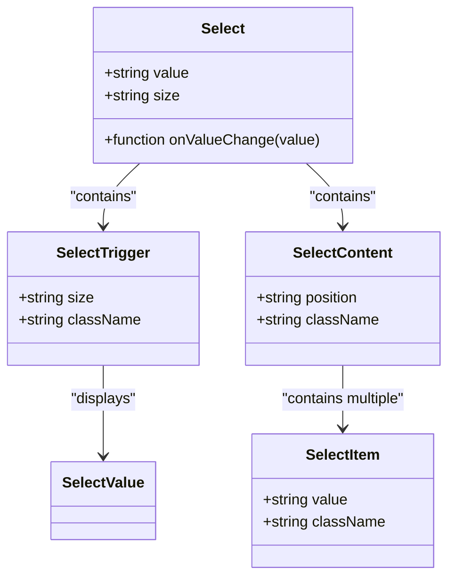
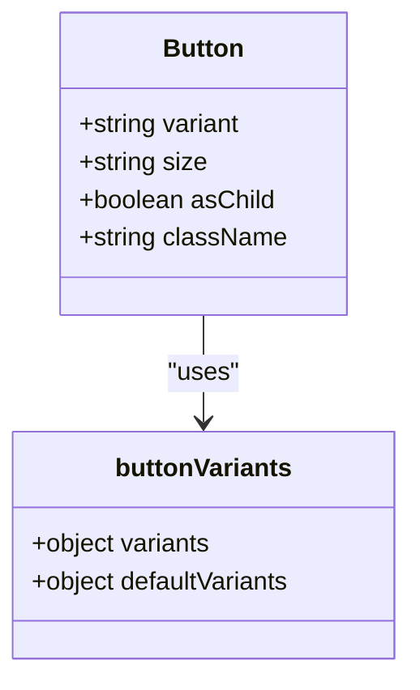
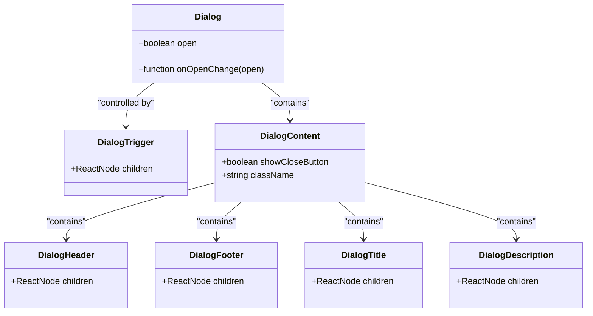
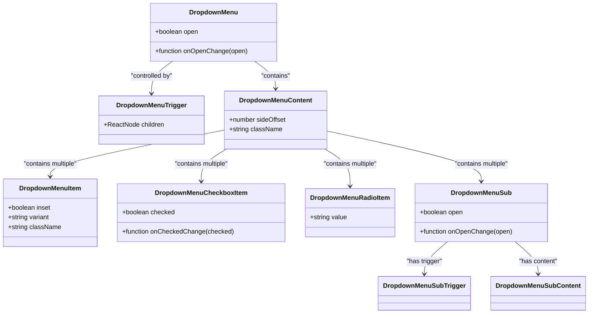
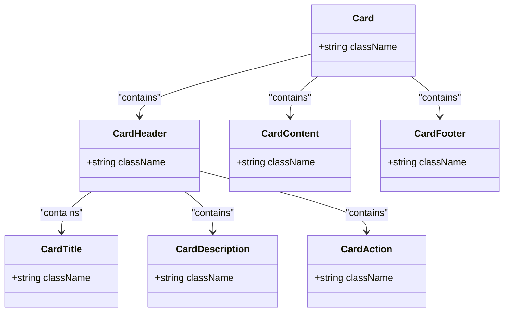
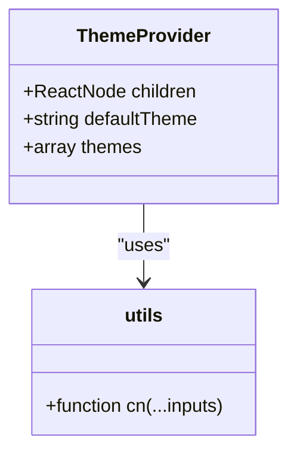
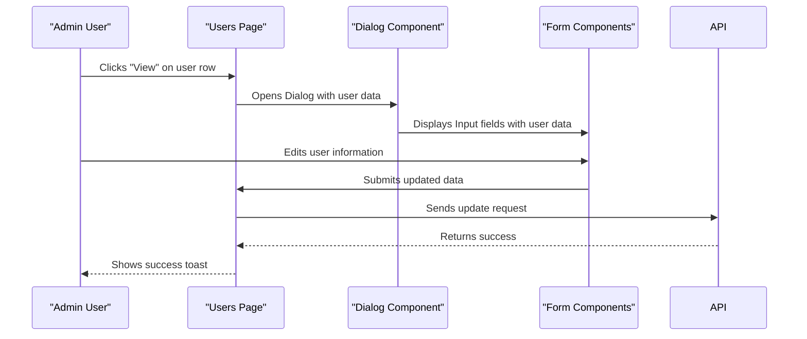

# UI Components

<cite>
**Referenced Files in This Document**   
- [button.tsx](file://components/ui/button.tsx)
- [input.tsx](file://components/ui/input.tsx)
- [textarea.tsx](file://components/ui/textarea.tsx)
- [select.tsx](file://components/ui/select.tsx)
- [dialog.tsx](file://components/ui/dialog.tsx)
- [dropdown-menu.tsx](file://components/ui/dropdown-menu.tsx)
- [card.tsx](file://components/ui/card.tsx)
- [scroll-area.tsx](file://components/ui/scroll-area.tsx)
- [theme-provider.tsx](file://components/theme-provider.tsx)
- [lib/utils.ts](file://lib/utils.ts)
- [app/admin/users/page.tsx](file://app/admin/users/page.tsx)
- [app/teacher/page.tsx](file://app/teacher/page.tsx)
- [app/teacher/classes/page.tsx](file://app/teacher/classes/page.tsx)
- [components/dashboard-sidebar.tsx](file://components/dashboard-sidebar.tsx)
</cite>

## Table of Contents
1. [Introduction](#introduction)
2. [Form Controls](#form-controls)
   - [Input](#input)
   - [Textarea](#textarea)
   - [Select](#select)
3. [Interactive Elements](#interactive-elements)
   - [Button](#button)
   - [Dialog](#dialog)
   - [Dropdown Menu](#dropdown-menu)
4. [Layout Helpers](#layout-helpers)
   - [Card](#card)
   - [Scroll Area](#scroll-area)
5. [Theming and Styling](#theming-and-styling)
6. [Accessibility and Responsive Design](#accessibility-and-responsive-design)
7. [Usage Examples](#usage-examples)
   - [Admin Interface](#admin-interface)
   - [Teacher Interface](#teacher-interface)
   - [Parent Interface](#parent-interface)
8. [Customization and Best Practices](#customization-and-best-practices)

## Introduction
The shadcn/ui-based primitive components in the School Management System provide a consistent, accessible, and responsive user interface across all user roles (admin, teacher, parent, and student). These components are built on top of Radix UI primitives and styled with Tailwind CSS, following the design system established for the application. The components are located in the `components/ui/` directory and are used throughout the application to ensure design consistency and accessibility compliance.

**Section sources**
- [components/ui/button.tsx](file://components/ui/button.tsx)
- [components/ui/input.tsx](file://components/ui/input.tsx)

## Form Controls

### Input
The Input component is a styled text input field that supports various types and states. It includes built-in styling for focus states, validation states, and disabled states. The component uses the `cn` utility function to merge Tailwind CSS classes with any provided className prop.

**Section sources**
- [components/ui/input.tsx](file://components/ui/input.tsx#L5-L22)

### Textarea
The Textarea component provides a multi-line text input with consistent styling across the application. It supports auto-resizing based on content and includes styling for focus, validation, and disabled states. The component is designed to be used for longer text inputs such as descriptions, comments, or messages.

**Section sources**
- [components/ui/textarea.tsx](file://components/ui/textarea.tsx#L5-L19)

### Select
The Select component implements a custom dropdown selection menu with accessibility features. It includes support for different sizes (default and small), keyboard navigation, and visual indicators for selected items. The component uses Radix UI's Select primitive and adds custom styling for the trigger, content, items, and scroll buttons.

**Diagram sources**
- [components/ui/select.tsx](file://components/ui/select.tsx#L9-L186)

**Section sources**
- [components/ui/select.tsx](file://components/ui/select.tsx#L9-L186)

## Interactive Elements

### Button
The Button component offers multiple variants (default, destructive, outline, secondary, ghost, link) and sizes (default, sm, lg, icon variants). It uses the class-variance-authority (cva) library to define style variants and supports the `asChild` prop to render the button as a different component (like a Link) while maintaining button styles.

**Diagram sources**
- [components/ui/button.tsx](file://components/ui/button.tsx#L7-L61)

**Section sources**
- [components/ui/button.tsx](file://components/ui/button.tsx#L7-L61)

### Dialog
The Dialog component provides a modal dialog system with accessible markup and animations. It includes several subcomponents: DialogTrigger, DialogContent, DialogHeader, DialogFooter, DialogTitle, and DialogDescription. The dialog supports close buttons, overlays, and portal rendering to ensure proper stacking context.

**Diagram sources**
- [components/ui/dialog.tsx](file://components/ui/dialog.tsx#L9-L144)

**Section sources**
- [components/ui/dialog.tsx](file://components/ui/dialog.tsx#L9-L144)

### Dropdown Menu
The DropdownMenu component implements a context menu or dropdown list with support for nested submenus, checkboxes, radio groups, and keyboard navigation. It includes accessibility features like proper ARIA attributes and focus management. The component supports various item types including regular items, checkbox items, radio items, labels, separators, and shortcuts.

**Diagram sources**
- [components/ui/dropdown-menu.tsx](file://components/ui/dropdown-menu.tsx#L9-L258)

**Section sources**
- [components/ui/dropdown-menu.tsx](file://components/ui/dropdown-menu.tsx#L9-L258)

## Layout Helpers

### Card
The Card component provides a container for grouping related content with a consistent visual style. It includes several subcomponents: CardHeader, CardTitle, CardDescription, CardContent, CardFooter, and CardAction. The card supports a grid-based header layout that can accommodate actions alongside the title and description.

**Diagram sources**
- [components/ui/card.tsx](file://components/ui/card.tsx#L5-L93)

**Section sources**
- [components/ui/card.tsx](file://components/ui/card.tsx#L5-L93)

### Scroll Area
The ScrollArea component provides a custom-styled scrollbar for overflowing content. It wraps the Radix UI ScrollArea primitive and applies consistent styling across the application. The component automatically shows scrollbars when content overflows and hides them when not needed, with smooth transitions.

**Section sources**
- [components/ui/scroll-area.tsx](file://components/ui/scroll-area.tsx#L8-L59)

## Theming and Styling
The application uses a theme provider system based on the next-themes library to manage light and dark mode. The ThemeProvider component wraps the application and provides theme context to all components. Styling is implemented using Tailwind CSS with a utility-first approach, and component styles are composed using the `cn` utility function which combines clsx and tailwind-merge to properly handle class merging and conflict resolution.

**Diagram sources**
- [components/theme-provider.tsx](file://components/theme-provider.tsx#L9-L12)
- [lib/utils.ts](file://lib/utils.ts#L4-L6)

**Section sources**
- [components/theme-provider.tsx](file://components/theme-provider.tsx#L9-L12)
- [lib/utils.ts](file://lib/utils.ts#L4-L6)

## Accessibility and Responsive Design
All components are designed with accessibility in mind, following WCAG guidelines and implementing proper ARIA attributes. The components support keyboard navigation, screen reader compatibility, and proper focus management. The design system is responsive by default, with components adapting to different screen sizes using Tailwind's responsive prefixes. All interactive elements have visible focus states, and form controls include proper labels and validation feedback.

**Section sources**
- [components/ui/button.tsx](file://components/ui/button.tsx#L8-L9)
- [components/ui/input.tsx](file://components/ui/input.tsx#L11-L13)
- [components/ui/dialog.tsx](file://components/ui/dialog.tsx#L41-L42)

## Usage Examples

### Admin Interface
In the admin interface, components are used to manage user accounts, classes, and system settings. The Users page uses the Dialog component for viewing and editing user details, with forms containing Input, Select, and Button components. The layout uses Card components to organize information and Button components with various variants for different actions.

**Diagram sources**
- [app/admin/users/page.tsx](file://app/admin/users/page.tsx#L500-L622)

**Section sources**
- [app/admin/users/page.tsx](file://app/admin/users/page.tsx#L34-L116)

### Teacher Interface
The teacher interface uses components to display dashboard information, manage classes, and record attendance. The Dashboard uses Card components to display statistics and class information, with Badge components to show subject tags. The Classes page uses Card components with Button components that link to attendance and grading pages.

**Section sources**
- [app/teacher/page.tsx](file://app/teacher/page.tsx#L6-L9)
- [app/teacher/classes/page.tsx](file://app/teacher/classes/page.tsx#L5-L8)

### Parent Interface
The parent interface uses components to display their children's grades and attendance. The layout is simplified compared to other roles, focusing on essential information. The Dashboard uses Card components to organize grade and attendance information, with minimal interactive elements beyond navigation.

**Section sources**
- [app/parent/layout.tsx](file://app/parent/layout.tsx#L1-L43)

## Customization and Best Practices
To maintain design consistency across dashboards, follow these best practices:
1. Use the predefined component variants rather than adding custom styles
2. Leverage the `asChild` prop to compose components with other elements like links
3. Use the `cn` utility for combining Tailwind classes
4. Follow the accessibility patterns implemented in the base components
5. Use the theme provider for any theme-specific styling
6. When extending components, do so through props rather than creating new variants
7. Test components in both light and dark modes
8. Ensure all interactive elements are keyboard accessible

The component system is designed to be extensible while maintaining consistency. Customization should be done through the existing prop interfaces rather than creating new components with similar functionality.

**Section sources**
- [components/ui/button.tsx](file://components/ui/button.tsx)
- [lib/utils.ts](file://lib/utils.ts)