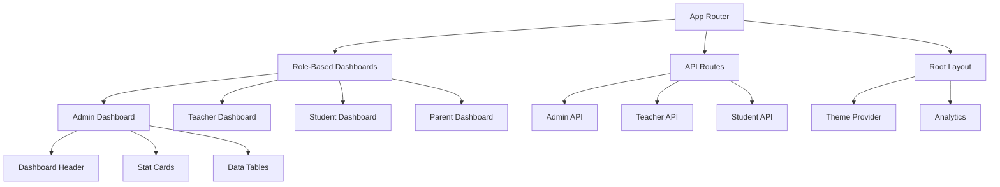
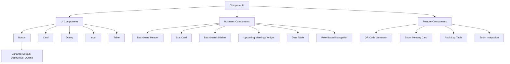
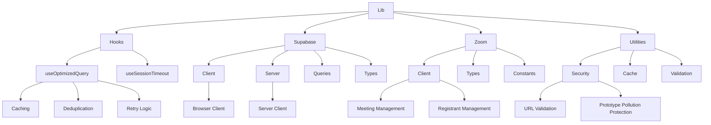

# Directory Structure Breakdown

<cite>
**Referenced Files in This Document**   
- [app/layout.tsx](file://app/layout.tsx)
- [app/admin/page.tsx](file://app/admin/page.tsx)
- [app/teacher/page.tsx](file://app/teacher/page.tsx)
- [app/student/page.tsx](file://app/student/page.tsx)
- [components/dashboard-sidebar.tsx](file://components/dashboard-sidebar.tsx)
- [components/ui/button.tsx](file://components/ui/button.tsx)
- [lib/supabase/client.ts](file://lib/supabase/client.ts)
- [lib/zoom/client.ts](file://lib/zoom/client.ts)
- [lib/hooks/use-optimized-query.ts](file://lib/hooks/use-optimized-query.ts)
- [lib/utils.ts](file://lib/utils.ts)
- [supabase/migrations/20251219043432_create_users_table.sql](file://supabase/migrations/20251219043432_create_users_table.sql)
- [supabase/migrations/20251219044036_add_rls_policies.sql](file://supabase/migrations/20251219044036_add_rls_policies.sql)
- [supabase/migrations/20251219081806_fix_user_read_policy.sql](file://supabase/migrations/20251219081806_fix_user_read_policy.sql)
- [app/api/admin/dashboard/route.ts](file://app/api/admin/dashboard/route.ts)
- [app/api/teacher/dashboard/route.ts](file://app/api/teacher/dashboard/route.ts)
- [app/api/student/dashboard/route.ts](file://app/api/student/dashboard/route.ts)
</cite>

## Table of Contents
1. [app/ Directory: Next.js App Router with Role-Based Dashboards](#app-directory-nextjs-app-router-with-role-based-dashboards)
2. [components/ Directory: Reusable UI and Business Components](#components-directory-reusable-ui-and-business-components)
3. [lib/ Directory: Utility Functions and Service Clients](#lib-directory-utility-functions-and-service-clients)
4. [supabase/migrations/ Directory: SQL Schema with Security-Focused RLS Policies](#supabasemigrations-directory-sql-schema-with-security-focused-rls-policies)
5. [Organization Principles](#organization-principles)
6. [Practical Examples and Guidance](#practical-examples-and-guidance)

## app/ Directory: Next.js App Router with Role-Based Dashboards

The `app/` directory implements the Next.js App Router architecture, serving as the primary entry point for the application's user interface. It organizes role-based dashboards for administrators, teachers, students, and parents, with each role having dedicated routes and pages. The directory structure follows a clear hierarchy where each role (admin, teacher, student, parent) has its own subdirectory containing feature-specific pages such as announcements, attendance, grades, and meetings.

The root layout in `app/layout.tsx` provides the global application structure, including theme support, analytics integration, and web vitals monitoring. Role-based navigation is implemented through the `dashboard-sidebar.tsx` component, which dynamically renders navigation links based on the user's role. Each dashboard page (e.g., `admin/page.tsx`, `teacher/page.tsx`, `student/page.tsx`) follows a consistent pattern of fetching data through secure API routes rather than direct database queries, enhancing security and maintainability.

API routes within the `app/api/` subdirectory handle server-side logic for each role, implementing authentication and authorization checks before returning data. For example, the admin dashboard API validates that the requesting user has the "admin" role before returning aggregated data about students, teachers, and classes. This separation of concerns ensures that sensitive data access logic remains on the server, while the client-side components focus on presentation.



**Diagram sources**
- [app/layout.tsx](file://app/layout.tsx#L1-L43)
- [app/admin/page.tsx](file://app/admin/page.tsx#L1-L200)
- [app/teacher/page.tsx](file://app/teacher/page.tsx#L1-L206)
- [app/student/page.tsx](file://app/student/page.tsx#L1-L202)
- [components/dashboard-sidebar.tsx](file://components/dashboard-sidebar.tsx#L1-L225)

**Section sources**
- [app/layout.tsx](file://app/layout.tsx#L1-L43)
- [app/admin/page.tsx](file://app/admin/page.tsx#L1-L200)
- [app/teacher/page.tsx](file://app/teacher/page.tsx#L1-L206)
- [app/student/page.tsx](file://app/student/page.tsx#L1-L202)

## components/ Directory: Reusable UI and Business Components

The `components/` directory contains reusable UI and business components organized by feature and functionality. It follows a modular structure with a `ui/` subdirectory for primitive UI components (buttons, cards, dialogs, etc.) that implement the application's design system. These components are built using Radix UI primitives and Tailwind CSS, ensuring consistency and accessibility across the application.

Business components such as `dashboard-header.tsx`, `stat-card.tsx`, and `upcoming-meetings-widget.tsx` encapsulate higher-level functionality and are designed to be reused across different dashboards. The `dashboard-sidebar.tsx` component implements role-based navigation, dynamically rendering different sets of links based on the user's role. This component uses the Next.js navigation hooks to highlight the active route and provides both desktop and mobile interfaces with responsive design.

The directory also contains specialized components for specific features, such as `qr-code-generator.tsx`, `zoom-meeting-card.tsx`, and `audit-log-table.tsx`. These components abstract complex functionality and provide a clean interface for consuming components. The `data-table.tsx` component implements a flexible table with sorting, filtering, and pagination capabilities, which is used across multiple dashboards for displaying lists of data.



**Diagram sources**
- [components/ui/button.tsx](file://components/ui/button.tsx#L1-L61)
- [components/dashboard-sidebar.tsx](file://components/dashboard-sidebar.tsx#L1-L225)
- [components/stat-card.tsx](file://components/stat-card.tsx)
- [components/data-table.tsx](file://components/data-table.tsx)

**Section sources**
- [components/ui/button.tsx](file://components/ui/button.tsx#L1-L61)
- [components/dashboard-sidebar.tsx](file://components/dashboard-sidebar.tsx#L1-L225)

## lib/ Directory: Utility Functions and Service Clients

The `lib/` directory houses utility functions, custom hooks, and service clients for Supabase and Zoom. It is organized into subdirectories for different types of utilities, with `hooks/` containing custom React hooks, `supabase/` containing Supabase-related utilities, and `zoom/` containing Zoom API clients. This separation of concerns makes it easy to locate and maintain specific functionality.

The `supabase/client.ts` file exports a `createClient()` function that initializes the Supabase client with environment variables, providing a consistent way to access the database throughout the application. The `zoom/client.ts` file implements a comprehensive Zoom API client with functions for creating meetings, managing registrants, and retrieving meeting reports. This client handles authentication, token caching, and error handling, abstracting the complexity of the Zoom API.

Custom hooks in the `hooks/` subdirectory provide reusable logic for common patterns. The `use-optimized-query.ts` hook implements caching, deduplication, and retry logic for data fetching, improving performance and reliability. Security utilities in `utils.ts` include functions for validating URLs, preventing prototype pollution, and ensuring data integrity. These utilities are used throughout the application to enforce security best practices.



**Diagram sources**
- [lib/supabase/client.ts](file://lib/supabase/client.ts#L1-L9)
- [lib/zoom/client.ts](file://lib/zoom/client.ts#L1-L334)
- [lib/hooks/use-optimized-query.ts](file://lib/hooks/use-optimized-query.ts#L1-L275)
- [lib/utils.ts](file://lib/utils.ts#L1-L107)

**Section sources**
- [lib/supabase/client.ts](file://lib/supabase/client.ts#L1-L9)
- [lib/zoom/client.ts](file://lib/zoom/client.ts#L1-L334)
- [lib/hooks/use-optimized-query.ts](file://lib/hooks/use-optimized-query.ts#L1-L275)
- [lib/utils.ts](file://lib/utils.ts#L1-L107)

## supabase/migrations/ Directory: SQL Schema with Security-Focused RLS Policies

The `supabase/migrations/` directory contains SQL schema definitions with security-focused Row Level Security (RLS) policies. Each migration file is timestamped and contains SQL statements that define tables, indexes, and RLS policies. The schema is designed with security as a primary concern, implementing strict access controls through RLS policies that are enforced at the database level.

The `20251219043432_create_users_table.sql` migration creates the core `users` table with fields for user information and role-based access control. Related tables such as `student_profiles` and `teacher_profiles` are linked to the `users` table through foreign key relationships. The `20251219044036_add_rls_policies.sql` migration implements the initial RLS policies, allowing users to read, insert, and update their own data while restricting access to others.

Subsequent migrations refine these policies to support administrative functionality while maintaining security. For example, `20251219081806_fix_user_read_policy.sql` modifies the user read policy to allow administrators to read all user data while maintaining the restriction that regular users can only access their own data. This layered approach to security ensures that access controls are enforced consistently across the application, with policies defined at the database level providing a strong foundation for application security.

```mermaid
erDiagram
users {
uuid id PK
text email UK
text name
text role
text avatar
text phone
text address
timestamptz created_at
timestamptz updated_at
}
student_profiles {
uuid id PK FK
text grade
text section
date enrollment_date
text parent_name
text parent_phone
}
teacher_profiles {
uuid id PK FK
text subject
text department
date join_date
}
classes {
uuid id PK
text name
text grade
text section
text subject
text schedule
text room
uuid teacher_id FK
}
users ||--o{ student_profiles : "1:1"
users ||--o{ teacher_profiles : "1:1"
users ||--o{ classes : "teacher"
users ||--o{ class_students : "student"
classes ||--o{ class_students : "class"
classes ||--o{ schedules : "class"
classes ||--o{ attendance_records : "class"
classes ||--o{ grades : "class"
classes ||--o{ zoom_meetings : "class"
class "users" as users {
+id: uuid
+email: text
+name: text
+role: text
+avatar: text
+phone: text
+address: text
+created_at: timestamptz
+updated_at: timestamptz
}
class "student_profiles" as student_profiles {
+id: uuid
+grade: text
+section: text
+enrollment_date: date
+parent_name: text
+parent_phone: text
}
class "teacher_profiles" as teacher_profiles {
+id: uuid
+subject: text
+department: text
+join_date: date
}
```

**Diagram sources**
- [supabase/migrations/20251219043432_create_users_table.sql](file://supabase/migrations/20251219043432_create_users_table.sql#L1-L32)
- [supabase/migrations/20251219044036_add_rls_policies.sql](file://supabase/migrations/20251219044036_add_rls_policies.sql#L1-L22)
- [supabase/migrations/20251219081806_fix_user_read_policy.sql](file://supabase/migrations/20251219081806_fix_user_read_policy.sql#L1-L17)

**Section sources**
- [supabase/migrations/20251219043432_create_users_table.sql](file://supabase/migrations/20251219043432_create_users_table.sql#L1-L32)
- [supabase/migrations/20251219044036_add_rls_policies.sql](file://supabase/migrations/20251219044036_add_rls_policies.sql#L1-L22)
- [supabase/migrations/20251219081806_fix_user_read_policy.sql](file://supabase/migrations/20251219081806_fix_user_read_policy.sql#L1-L17)

## Organization Principles

The School-Management-System follows several key organization principles that contribute to its maintainability, security, and scalability. The principle of separation of concerns is evident throughout the codebase, with clear boundaries between presentation (components), business logic (API routes), data access (lib/supabase), and infrastructure (migrations). This separation makes it easier to understand, test, and modify individual components without affecting others.

Component reusability is a core principle, with UI components designed to be generic and configurable through props. The `ui/` components follow the headless UI pattern, separating visual presentation from functionality, allowing them to be styled consistently across the application. Business components like `StatCard` and `DataTable` encapsulate common patterns and can be reused across different dashboards with minimal configuration.

Security-by-design is implemented through multiple layers of protection. Database-level security is enforced through RLS policies that restrict data access based on user roles and ownership. Application-level security is maintained through API routes that validate authentication and authorization before processing requests. Client-side security utilities prevent common vulnerabilities like XSS and prototype pollution. This multi-layered approach ensures that security is not an afterthought but an integral part of the system architecture.

## Practical Examples and Guidance

The codebase demonstrates practical examples of how pages in the `app/` directory consume components and utilities from other directories. For instance, the admin dashboard (`app/admin/page.tsx`) imports the `DashboardHeader` and `StatCard` components from the `components/` directory and uses the `createClient()` function from `lib/supabase/client.ts` to interact with the database. The dashboard fetches data through the secure API route `/api/admin/dashboard` rather than making direct database queries, following the principle of keeping sensitive logic on the server.

When adding new features to the system, developers should follow the existing structure and patterns. New pages should be added to the appropriate role directory within `app/` and should use existing components from the `components/` directory when possible. New API routes should be added to the `app/api/` directory with proper authentication and authorization checks. New utility functions should be placed in the appropriate subdirectory of `lib/` based on their functionality.

For database changes, new migrations should be created in the `supabase/migrations/` directory with descriptive names and timestamps. These migrations should include both schema changes and any necessary RLS policies to maintain security. When creating new components, developers should consider whether the component is a primitive UI element (which belongs in `components/ui/`) or a higher-level business component (which belongs in the root `components/` directory).

**Section sources**
- [app/admin/page.tsx](file://app/admin/page.tsx#L1-L200)
- [app/api/admin/dashboard/route.ts](file://app/api/admin/dashboard/route.ts#L1-L125)
- [app/api/teacher/dashboard/route.ts](file://app/api/teacher/dashboard/route.ts#L1-L128)
- [app/api/student/dashboard/route.ts](file://app/api/student/dashboard/route.ts#L1-L117)