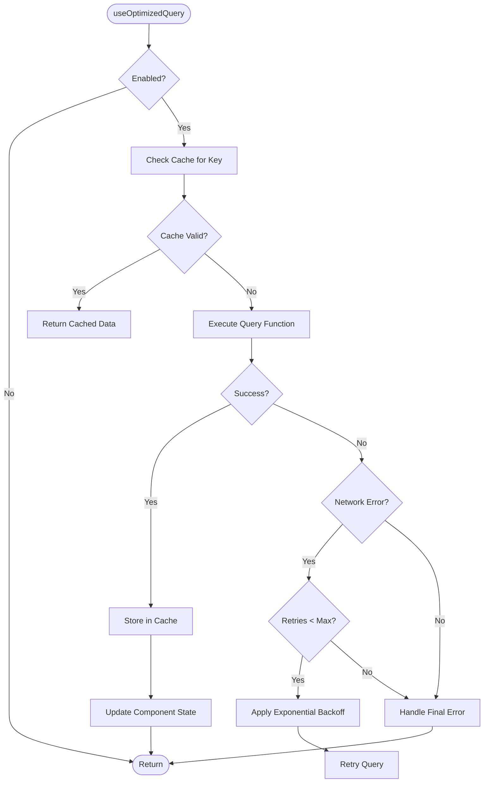
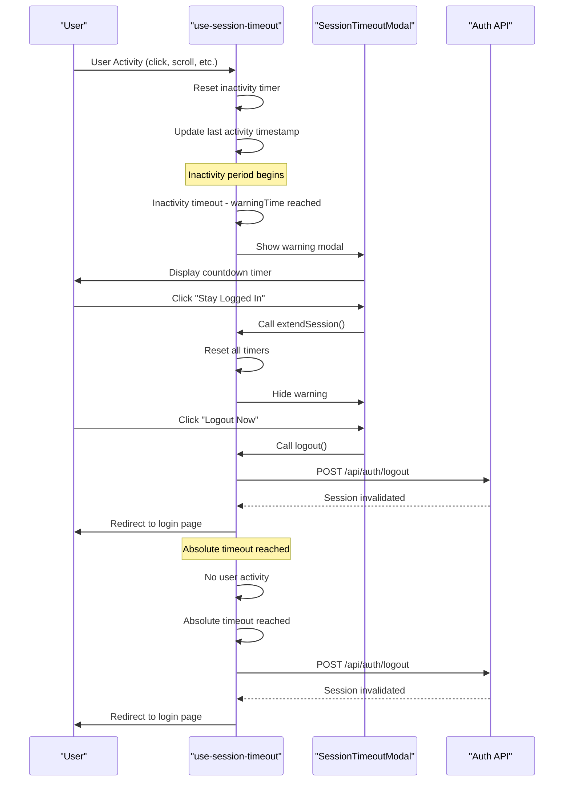
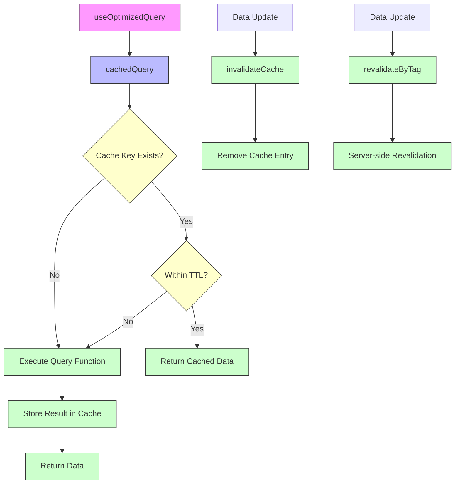
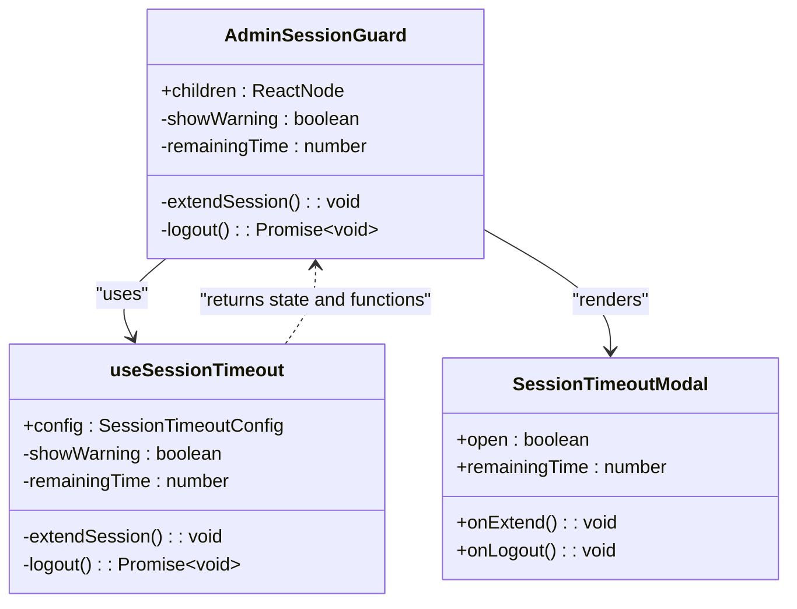

# Custom React Hooks

<cite>
**Referenced Files in This Document**   
- [use-optimized-query.ts](file://lib/hooks/use-optimized-query.ts)
- [use-session-timeout.ts](file://lib/hooks/use-session-timeout.ts)
- [cache.ts](file://lib/cache.ts)
- [dashboard-header.tsx](file://components/dashboard-header.tsx)
- [admin-session-guard.tsx](file://components/admin-session-guard.tsx)
- [SECURITY.md](file://SECURITY.md)
</cite>

## Table of Contents
1. [Introduction](#introduction)
2. [use-optimized-query Hook](#use-optimized-query-hook)
3. [use-session-timeout Hook](#use-session-timeout-hook)
4. [Integration with Caching Strategy](#integration-with-caching-strategy)
5. [Component Usage Examples](#component-usage-examples)
6. [Hook Composition Patterns](#hook-composition-patterns)
7. [Error Boundaries and Performance Implications](#error-boundaries-and-performance-implications)
8. [Conclusion](#conclusion)

## Introduction
This document provides comprehensive documentation for the custom React hooks used throughout the School Management System application. The focus is on two critical hooks: `use-optimized-query.ts` for data fetching optimization and `use-session-timeout.ts` for security enforcement. These hooks encapsulate reusable logic that enhances performance, reduces database load, and maintains secure user sessions across the application.

**Section sources**
- [use-optimized-query.ts](file://lib/hooks/use-optimized-query.ts#L1-L275)
- [use-session-timeout.ts](file://lib/hooks/use-session-timeout.ts#L1-L198)

## use-optimized-query Hook
The `use-optimized-query` hook provides a wrapper around data fetching operations with built-in caching, deduplication, and performance optimizations. It is designed specifically for dashboard and list views where frequent data retrieval can impact performance and database load.

The hook accepts a cache key, a query function, and optional configuration parameters including:
- `enabled`: Controls whether the query should execute
- `refetchInterval`: Sets automatic refetching at specified intervals
- `cacheTime`: Defines how long data remains in cache
- `onSuccess` and `onError`: Callbacks for handling success and error states

It returns an object containing the fetched data, loading state, error information, and utility functions for refetching and cache invalidation.

The implementation includes retry logic with exponential backoff for transient network failures, ensuring robustness in unstable network conditions.

**Diagram sources**
- [use-optimized-query.ts](file://lib/hooks/use-optimized-query.ts#L28-L123)

**Section sources**
- [use-optimized-query.ts](file://lib/hooks/use-optimized-query.ts#L28-L123)

## use-session-timeout Hook
The `use-session-timeout` hook monitors user activity and enforces session expiration based on security policies defined in the application's security framework. It implements both inactivity timeout and absolute session duration limits to enhance security.

The hook configuration includes:
- `inactivityTimeout`: Duration of inactivity before session warning
- `absoluteTimeout`: Maximum session duration regardless of activity
- `warningTime`: Time before timeout when warning should be displayed
- `onWarning` and `onTimeout`: Optional callback functions

The hook tracks user activity through common DOM events (mouse movements, keystrokes, scrolling) and maintains session state in sessionStorage. When the inactivity threshold is approached, it triggers a warning modal allowing users to extend their session or log out.

Upon session timeout, the hook performs a complete logout sequence including clearing client-side tokens, invalidating the server-side session, and redirecting to the login page with a timeout reason parameter.

**Diagram sources**
- [use-session-timeout.ts](file://lib/hooks/use-session-timeout.ts#L34-L197)

**Section sources**
- [use-session-timeout.ts](file://lib/hooks/use-session-timeout.ts#L34-L197)

## Integration with Caching Strategy
The `use-optimized-query` hook integrates closely with the application's caching strategy implemented in `lib/cache.ts`. This integration reduces database load by preventing duplicate API calls and leveraging both client-side and server-side caching mechanisms.

The caching system employs a two-tier approach:
1. **Client-side in-memory cache**: Uses a Map to store query results with timestamps, providing immediate access to recently fetched data
2. **Server-side Next.js cache**: Utilizes `unstable_cache` for automatic revalidation and tag-based invalidation

Key caching functions include:
- `cachedQuery`: Primary function for caching query results with configurable TTL
- `invalidateCache`: Removes specific entries from the client-side cache
- `revalidateByTag`: Triggers revalidation of server-side cached data by tag

The cache implements TTL-based expiration with a default of 30 seconds, and includes cleanup logic to prevent memory bloat by removing the oldest entries when the cache size exceeds 100 items.

**Diagram sources**
- [cache.ts](file://lib/cache.ts#L6-L59)
- [use-optimized-query.ts](file://lib/hooks/use-optimized-query.ts#L6-L7)

**Section sources**
- [cache.ts](file://lib/cache.ts#L6-L59)

## Component Usage Examples
The custom hooks are utilized by various components throughout the application to maintain responsive UIs and secure sessions. Two key examples demonstrate their practical implementation.

### dashboard-header.tsx
The `DashboardHeader` component uses the `userId` prop to render personalized content including the notification center. While it doesn't directly use the optimization hooks, it represents a typical dashboard component that benefits from the data fetching optimizations provided by `use-optimized-query` in parent components.

### admin-session-guard.tsx
The `AdminSessionGuard` component wraps administrative interfaces and implements the session timeout functionality using `use-session-timeout`. It configures the hook with specific security policies:
- 30-minute inactivity timeout
- 8-hour absolute session duration
- 2-minute warning period before timeout

The component composes the hook's return values with the `SessionTimeoutModal` to provide a seamless user experience for session management.

**Diagram sources**
- [admin-session-guard.tsx](file://components/admin-session-guard.tsx#L15-L33)
- [use-session-timeout.ts](file://lib/hooks/use-session-timeout.ts#L34-L197)
- [session-timeout-modal.tsx](file://components/session-timeout-modal.tsx#L22-L73)

**Section sources**
- [admin-session-guard.tsx](file://components/admin-session-guard.tsx#L15-L33)
- [dashboard-header.tsx](file://components/dashboard-header.tsx#L16-L34)

## Hook Composition Patterns
The application employs several effective hook composition patterns that enhance reusability and maintainability.

### Layered Hook Architecture
The hooks follow a layered architecture where higher-level hooks build upon lower-level ones:
- `useDebouncedQuery` composes `useOptimizedQuery` for search functionality
- `usePaginatedQuery` and `useInfiniteQuery` extend `useOptimizedQuery` for specialized data loading patterns

### Configuration-Driven Behavior
Both hooks use configuration objects to define behavior, allowing for flexible reuse across different contexts without code duplication.

### Separation of Concerns
The hooks maintain clear separation between:
- Data fetching logic (`use-optimized-query`)
- State management (React useState/useEffect)
- Side effects and cleanup (useRef for timer management)
- Security policies (external configuration)

### Error Boundary Integration
While not explicitly shown in the code, the hooks are designed to work with React error boundaries by providing error state that can be caught and handled at the component level.

## Error Boundaries and Performance Implications
The hooks are designed with robust error handling and performance considerations.

### Error Handling
`use-optimized-query` includes comprehensive error handling with:
- Network error detection and retry logic
- Exponential backoff strategy
- Error callbacks for custom error handling
- Graceful degradation when caching fails

### Performance Implications
The polling intervals and timeout thresholds have significant performance implications:

#### Polling Intervals
- **Short intervals** (< 10s): High freshness but increased server load
- **Medium intervals** (30-60s): Balanced approach for most dashboard data
- **Long intervals** (> 5m): Suitable for static or infrequently changing data

#### Timeout Thresholds
- **Inactivity timeout**: Shorter values (15-30m) enhance security but may impact user experience
- **Absolute timeout**: Longer values (8h) accommodate full work sessions while maintaining security
- **Warning time**: 2-minute warnings provide adequate time for users to respond

The current configuration strikes a balance between security and usability, with the 30-minute inactivity timeout and 8-hour absolute timeout aligning with industry best practices for administrative interfaces.

**Section sources**
- [use-optimized-query.ts](file://lib/hooks/use-optimized-query.ts#L49-L91)
- [use-session-timeout.ts](file://lib/hooks/use-session-timeout.ts#L34-L197)
- [SECURITY.md](file://SECURITY.md#L1-L70)

## Conclusion
The custom React hooks in the School Management System effectively encapsulate complex logic for data fetching optimization and session security. The `use-optimized-query` hook significantly reduces database load through intelligent caching and deduplication, while the `use-session-timeout` hook enforces robust security policies as defined in the application's security documentation.

These hooks demonstrate excellent design patterns including configuration-driven behavior, proper cleanup of side effects, and thoughtful error handling. Their integration with components like `AdminSessionGuard` and potential use in dashboard interfaces ensures a responsive user experience while maintaining high security standards.

The layered architecture of the hooks allows for easy extension and reuse across different parts of the application, promoting consistency and reducing code duplication. Future enhancements could include more sophisticated cache invalidation strategies and additional configuration options for specialized use cases.