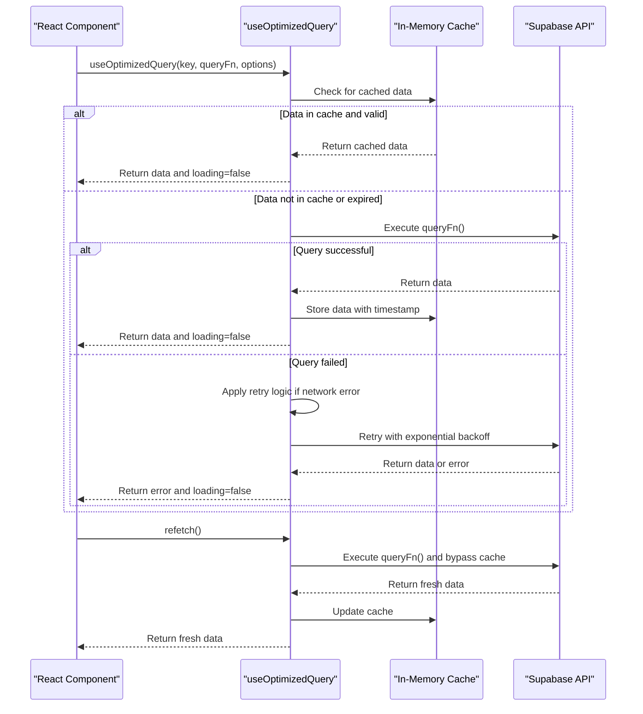

# Lib Directory Structure

<cite>
**Referenced Files in This Document**   
- [client.ts](file://lib/supabase/client.ts)
- [queries.ts](file://lib/supabase/queries.ts)
- [types.ts](file://lib/supabase/types.ts)
- [use-optimized-query.ts](file://lib/hooks/use-optimized-query.ts)
- [use-session-timeout.ts](file://lib/hooks/use-session-timeout.ts)
- [client.ts](file://lib/zoom/client.ts)
- [types.ts](file://lib/zoom/types.ts)
- [constants.ts](file://lib/zoom/constants.ts)
- [auth-store.ts](file://lib/auth-store.ts)
- [announcement-store.ts](file://lib/announcement-store.ts)
- [attendance-utils.ts](file://lib/attendance-utils.ts)
- [grade-utils.ts](file://lib/grade-utils.ts)
- [validation-schemas.ts](file://lib/validation-schemas.ts)
- [security.ts](file://lib/security.ts)
- [cache.ts](file://lib/cache.ts)
</cite>

## Table of Contents
1. [Introduction](#introduction)
2. [Supabase Integration Layer](#supabase-integration-layer)
3. [Custom React Hooks](#custom-react-hooks)
4. [Zoom Meeting Management](#zoom-meeting-management)
5. [State Management with Zustand](#state-management-with-zustand)
6. [Utility Modules](#utility-modules)
7. [Validation and Security](#validation-and-security)
8. [Caching Strategy](#caching-strategy)
9. [Integration Examples](#integration-examples)
10. [Conclusion](#conclusion)

## Introduction
The lib/ directory serves as the service and utility layer for the School Management System, providing essential functionality for database interaction, state management, API integration, and business logic processing. This comprehensive layer abstracts complex operations and provides reusable components across the application. The architecture follows a modular design with clear separation of concerns, enabling maintainability and scalability. Key components include Supabase integration for database operations, custom React hooks for optimized data fetching, Zoom API client for virtual meeting management, Zustand stores for global state management, and utility modules for business logic processing.

## Supabase Integration Layer

The Supabase integration layer provides a robust interface for database operations, featuring client initialization, type-safe queries, and optimized data access patterns. This layer serves as the primary data access point for the application, ensuring secure and efficient interaction with the PostgreSQL database.

### Client Initialization and Configuration
The Supabase client is initialized through a factory function that creates browser-compatible clients with environment-specific configuration. The client configuration uses environment variables to securely store connection credentials, following the principle of separation between code and configuration. This approach enables different configurations for development, staging, and production environments without code changes.


**Diagram sources**
- [client.ts](file://lib/supabase/client.ts)
- [queries.ts](file://lib/supabase/queries.ts)

### Type-Safe Database Queries
The queries.ts file exports a comprehensive set of functions for accessing various data entities in the system. Each query function is designed to retrieve specific data sets with appropriate filtering and sorting. The implementation uses Supabase's query builder to construct SQL queries with proper parameterization, preventing SQL injection attacks. The queries are organized by entity type, including users, students, teachers, classes, schedules, attendance records, grades, quizzes, lessons, and announcements.

The query functions follow a consistent pattern: they create a Supabase client instance, build a query with appropriate filters and joins, execute the query, and handle errors by throwing exceptions. This consistent approach ensures predictable behavior across all data access operations. The queries leverage Supabase's real-time capabilities and Row Level Security (RLS) policies to ensure data access is properly scoped and secured.

**Section sources**
- [queries.ts](file://lib/supabase/queries.ts)

### Database Type Definitions
The types.ts file defines TypeScript interfaces that mirror the database schema, providing compile-time type safety for database operations. These type definitions cover all major entities in the system, including users, student profiles, teacher profiles, classes, attendance records, grades, schedules, quizzes, lessons, announcements, and school settings. The type definitions include appropriate data types for each field, such as string, number, boolean, and specific string literal types for enumerated values.

The type system enforces data integrity by ensuring that operations on database records adhere to the expected structure and constraints. This approach reduces runtime errors and improves code maintainability by providing clear documentation of the data model through TypeScript interfaces. The type definitions are used throughout the application to ensure consistency between the database schema and application code.

**Section sources**
- [types.ts](file://lib/supabase/types.ts)

## Custom React Hooks

The hooks directory contains custom React hooks that provide optimized data fetching and user session management capabilities. These hooks abstract complex logic and provide reusable functionality across components in the application.

### Optimized Data Fetching with use-optimized-query
The use-optimized-query.ts file implements a comprehensive data fetching hook that provides caching, deduplication, retry logic, and automatic refetching capabilities. The hook accepts a cache key, a query function, and optional configuration parameters to control caching behavior, refetch intervals, and error handling. The implementation uses an in-memory cache to prevent duplicate requests within a specified time-to-live (TTL) window, reducing unnecessary network traffic and improving application performance.

The hook includes sophisticated retry logic for handling transient network failures, implementing exponential backoff to avoid overwhelming the server during periods of high load. It also supports automatic refetching at specified intervals, making it suitable for real-time data displays. The hook returns a result object containing the data, loading state, error information, and utility functions for manual refetching and cache invalidation.



**Diagram sources**
- [use-optimized-query.ts](file://lib/hooks/use-optimized-query.ts)

### Session Timeout Management with use-session-timeout
The use-session-timeout.ts file implements a hook for managing user session timeouts with both inactivity and absolute timeout policies. The hook tracks user activity through event listeners on common interaction events such as mouse movement, keyboard input, and scrolling. When user activity is detected, the inactivity timer is reset, extending the session.

The implementation includes a warning period that alerts users before their session expires, allowing them to extend the session by interacting with the application. The hook integrates with both client-side and server-side session management, ensuring that sessions are properly terminated when they expire. It also handles cleanup of event listeners and timers when the component unmounts, preventing memory leaks.

The session timeout configuration is flexible, allowing different timeout values for inactivity and absolute session duration. The hook provides callback functions that can be used to trigger custom behavior when the warning is shown or when the session times out. This approach enhances security by automatically logging out inactive users while providing a good user experience through the warning mechanism.

**Section sources**
- [use-session-timeout.ts](file://lib/hooks/use-session-timeout.ts)

## Zoom Meeting Management

The zoom directory contains the implementation for integrating with the Zoom API to manage virtual meetings and webinars. This integration enables the school to conduct online classes, parent-teacher conferences, and other virtual events.

### Zoom API Client Implementation
The client.ts file implements a comprehensive client for the Zoom API using Server-to-Server OAuth authentication. The client handles token management, including caching of access tokens and automatic token refresh when they expire. This approach reduces the number of authentication requests and improves performance by reusing valid tokens.

The client provides functions for creating, retrieving, updating, and deleting Zoom meetings, as well as managing meeting participants and registrants. It includes specialized functions for generating SDK signatures, which are required for embedding Zoom meetings directly in the application using the Zoom Web SDK. The implementation handles error responses from the Zoom API and provides meaningful error messages for debugging.


**Diagram sources**
- [client.ts](file://lib/zoom/client.ts)
- [types.ts](file://lib/zoom/types.ts)
- [constants.ts](file://lib/zoom/constants.ts)

### Zoom Type Definitions and Constants
The types.ts file in the zoom directory defines TypeScript interfaces that correspond to the Zoom API response formats. These type definitions provide compile-time safety when working with Zoom API data and ensure that the application code correctly handles the structure of API responses. The types cover meetings, participants, registrants, meeting settings, and webhook events.

The constants.ts file defines application-specific constants for the Zoom integration, including the allowed email domain for class meetings. This restriction ensures that only users with school-issued email addresses can join class meetings, enhancing security and preventing unauthorized access. The file includes utility functions for checking if an email address belongs to the allowed domain and for generating appropriate error messages.

**Section sources**
- [types.ts](file://lib/zoom/types.ts)
- [constants.ts](file://lib/zoom/constants.ts)

## State Management with Zustand

The application uses Zustand for global state management, providing a lightweight and efficient solution for managing shared state across components. Zustand stores are used for authentication state, announcements, and other application-wide data.

### Authentication State Management
The auth-store.ts file implements a Zustand store for managing user authentication state. The store maintains the current user object, user profile, loading state, and initialization status. It provides actions for setting the user and profile, initializing the store, signing out, and cleaning up resources.

The store initialization process checks the current authentication state with Supabase and loads the user profile if a user is logged in. It also sets up an authentication state change listener that updates the store when the user's authentication state changes (e.g., when they sign in or out). The implementation includes optimizations such as storing the subscription reference for cleanup to prevent memory leaks.

```mermaid
classDiagram
class AuthStore {
-user User | null
-profile UserProfile | null
-loading boolean
-initialized boolean
+setUser(user) void
+setProfile(profile) void
+setLoading(loading) void
+initialize() Promise~void~
+signOut() Promise~void~
+cleanup() void
}
class UserProfile {
+id string
+email string
+name string
+role "admin" | "teacher" | "student"
+avatar? string
}
class SupabaseAuth {
+getUser() Promise~{ user : User | null }~
+onAuthStateChange(callback) Subscription
+signOut() Promise~void~
}
AuthStore --> UserProfile : "contains"
AuthStore --> SupabaseAuth : "uses"
```

**Diagram sources**
- [auth-store.ts](file://lib/auth-store.ts)

### Announcement State Management
The announcement-store.ts file implements a Zustand store for managing announcements within the application. The store maintains a list of announcements and provides actions for adding new announcements, deleting announcements, and retrieving announcements filtered by user role and grade level.

The implementation includes a method for retrieving announcements relevant to a specific user based on their role and grade level. This filtering ensures that users only see announcements intended for their audience, such as all users, students, teachers, or specific grade levels. The store uses client-side UUID generation for new announcements and sorts announcements by creation date in descending order.

**Section sources**
- [announcement-store.ts](file://lib/announcement-store.ts)

## Utility Modules

The lib directory contains several utility modules that provide business logic and helper functions for various aspects of the application.

### Attendance Utilities
The attendance-utils.ts file provides functions for calculating attendance statistics from attendance records. The calculateAttendanceStats function takes an array of attendance records and returns an object containing counts for each attendance status (present, absent, late, excused), the total number of records, and the attendance rate as a percentage.

The attendance rate is calculated by considering both present and late statuses as attended, which aligns with common educational practices. The function handles edge cases such as empty record arrays and invalid status values, ensuring robust operation in all scenarios.

**Section sources**
- [attendance-utils.ts](file://lib/attendance-utils.ts)

### Grade Utilities
The grade-utils.ts file implements comprehensive functionality for handling grades according to the Philippine grading system. The module includes functions for converting percentages to Philippine grades, determining grade remarks and status, calculating final grades from multiple assessments with weighted averages, and determining appropriate color variants for grade display.

The Philippine grading system uses a specific scale where 75 is the minimum passing grade. The percentageToPhGrade function maps percentages to the appropriate Philippine grade value, with specific mappings for different percentage ranges. The calculateFinalGrade function supports weighted assessment types (quizzes, exams, assignments, projects) and calculates a final grade based on the configured weights.


**Diagram sources**
- [grade-utils.ts](file://lib/grade-utils.ts)

## Validation and Security

The lib directory includes modules for data validation and security, ensuring data integrity and protecting against common web vulnerabilities.

### Validation Schemas with Zod
The validation-schemas.ts file defines Zod schemas for validating data across various application domains. These schemas are used to validate input data for API endpoints, preventing injection attacks and ensuring data integrity. The schemas cover lessons, announcements, calendar events, grades, attendance records, classes, enrollment operations, parent-child relationships, QR attendance, and settings updates.

Each schema defines the expected structure, data types, and constraints for the corresponding data entity. For example, the createLessonSchema validates that lesson titles are between 1 and 200 characters, class IDs are valid UUIDs, and materials are properly formatted. The schemas use Zod's comprehensive validation features, including string length constraints, regular expression patterns, and enumerated values.

**Section sources**
- [validation-schemas.ts](file://lib/validation-schemas.ts)

### Security Utilities
The security.ts file implements various security-related functions for the application. The hashIpAddress function uses SHA-256 hashing with a salt to anonymize IP addresses while still allowing abuse detection through hash comparison. This approach protects user privacy while maintaining the ability to identify abusive behavior.

The validateOrigin function provides CSRF protection by verifying that requests originate from the same domain as the application. It checks the Origin and Referer headers against the configured site URL, falling back to Host header comparison if necessary. The getClientIp function securely extracts the client IP address, prioritizing platform-provided IP addresses (such as those from Vercel) to prevent IP spoofing.

The file also includes a Zod schema for validating user profile updates, preventing stored XSS attacks by validating avatar URLs and restricting special characters in names. These security measures work together to protect the application against common web vulnerabilities.

**Section sources**
- [security.ts](file://lib/security.ts)

## Caching Strategy

The cache.ts file implements a comprehensive caching strategy for both client-side and server-side operations. The caching system uses an in-memory Map for client-side queries and leverages Next.js's unstable_cache for server-side operations.

### Client-Side Caching
The cachedQuery function provides in-memory caching for client-side queries, preventing duplicate API calls within a specified time-to-live (TTL) window. The implementation stores query results with timestamps and checks the cache before executing a query function. If a valid cached result exists, it is returned immediately; otherwise, the query function is executed, and the result is stored in the cache.

The cache includes cleanup logic to prevent unbounded memory growth, removing old entries when the cache size exceeds a threshold. This approach ensures that the cache remains efficient and does not consume excessive memory over time.

### Server-Side Caching
The file exports several functions that use Next.js's unstable_cache to implement server-side caching with automatic revalidation. These functions cache data from API routes and specify revalidation intervals and cache tags. The cache tags enable targeted cache invalidation when data is updated, ensuring that stale data is not served to users.

The caching strategy improves application performance by reducing database load and network traffic, while the revalidation mechanism ensures that data remains fresh. The combination of client-side and server-side caching provides a robust solution for optimizing data access across the application.


**Diagram sources**
- [cache.ts](file://lib/cache.ts)

## Integration Examples

The lib directory components are integrated throughout the application to provide a cohesive user experience. API routes use the Supabase queries to access data, while components consume the custom hooks for data fetching and state management.

### API Route Integration
API routes in the application use the Supabase queries and validation schemas to handle data operations securely. For example, the admin/attendance/route.ts file uses the saveAttendanceSchema to validate incoming attendance data and the Supabase queries to store the data in the database. The validation ensures that only properly formatted data is accepted, while the Supabase integration handles the database operations with proper error handling.

### Component Integration
Components in the application consume the custom hooks to access data and manage state. For example, the attendance page uses the useOptimizedQuery hook with the getAttendanceRecords query function to fetch attendance data with caching and error handling. The hook's loading state is used to display a loading indicator, while the error state is used to display error messages to the user.

The session timeout hook is used in authenticated pages to manage user sessions and provide a warning before timeout. When the warning is shown, a modal dialog is displayed allowing the user to extend their session or log out. This integration enhances security while maintaining a good user experience.

**Section sources**
- [client.ts](file://lib/supabase/client.ts)
- [queries.ts](file://lib/supabase/queries.ts)
- [use-optimized-query.ts](file://lib/hooks/use-optimized-query.ts)
- [use-session-timeout.ts](file://lib/hooks/use-session-timeout.ts)

## Conclusion
The lib directory provides a comprehensive service and utility layer that forms the foundation of the School Management System. Its modular design, with clear separation of concerns, enables maintainability and scalability. The Supabase integration provides secure and efficient database access, while the custom hooks optimize data fetching and user session management. The Zoom integration enables virtual meetings with proper security controls, and the Zustand stores provide efficient global state management. The utility modules implement business logic according to educational standards, while the validation and security components protect against common web vulnerabilities. Together, these components create a robust and secure foundation for the application, enabling the delivery of a high-quality educational management system.