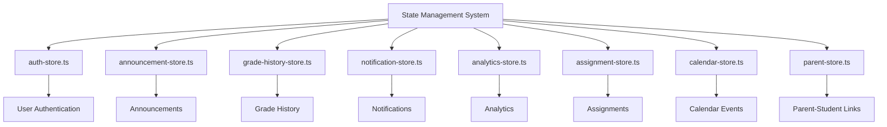
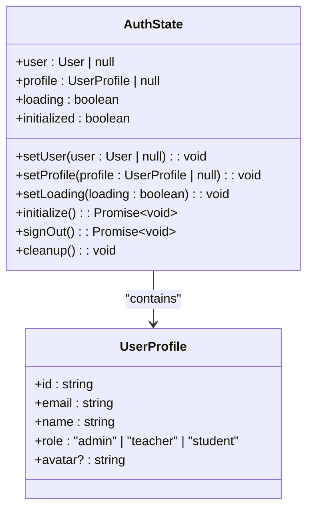
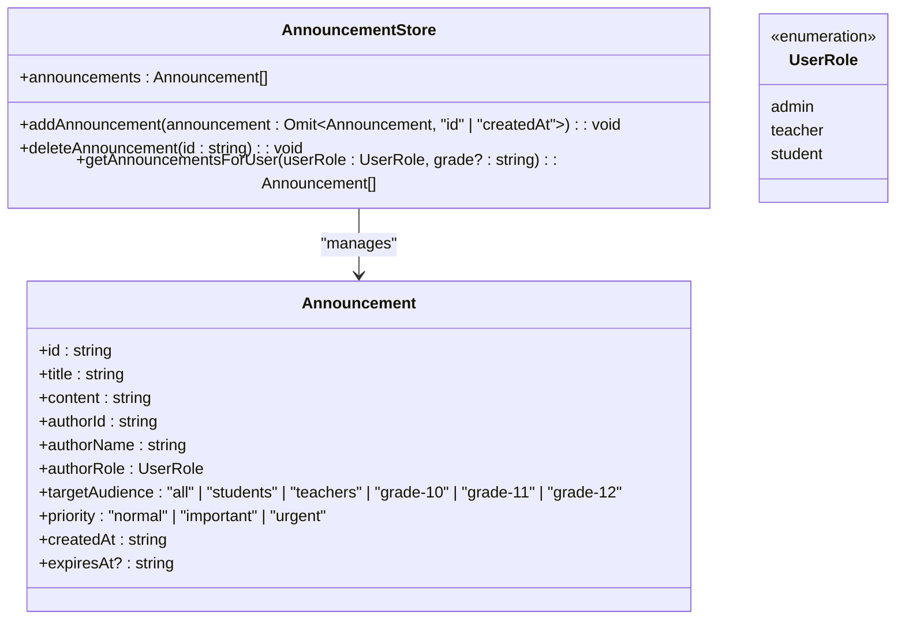
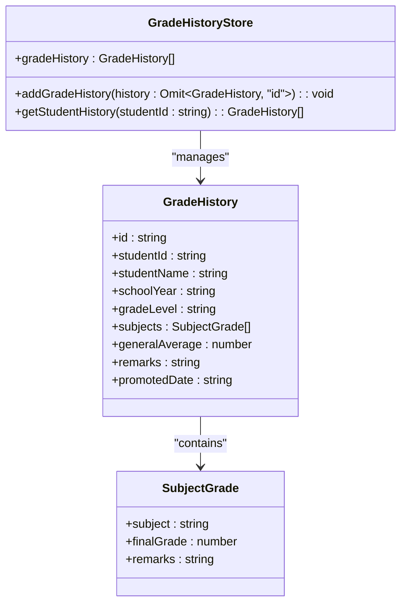
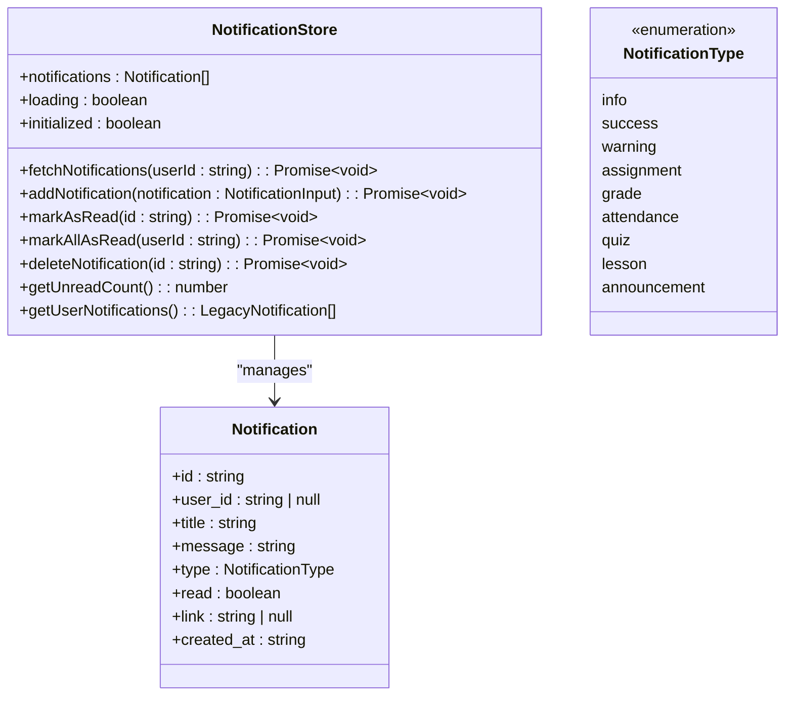
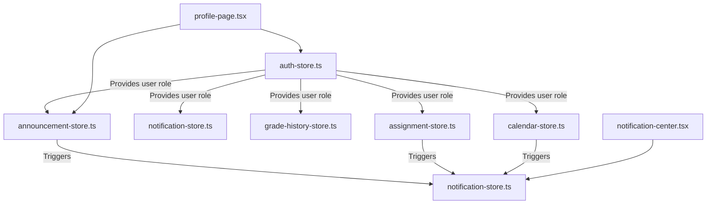
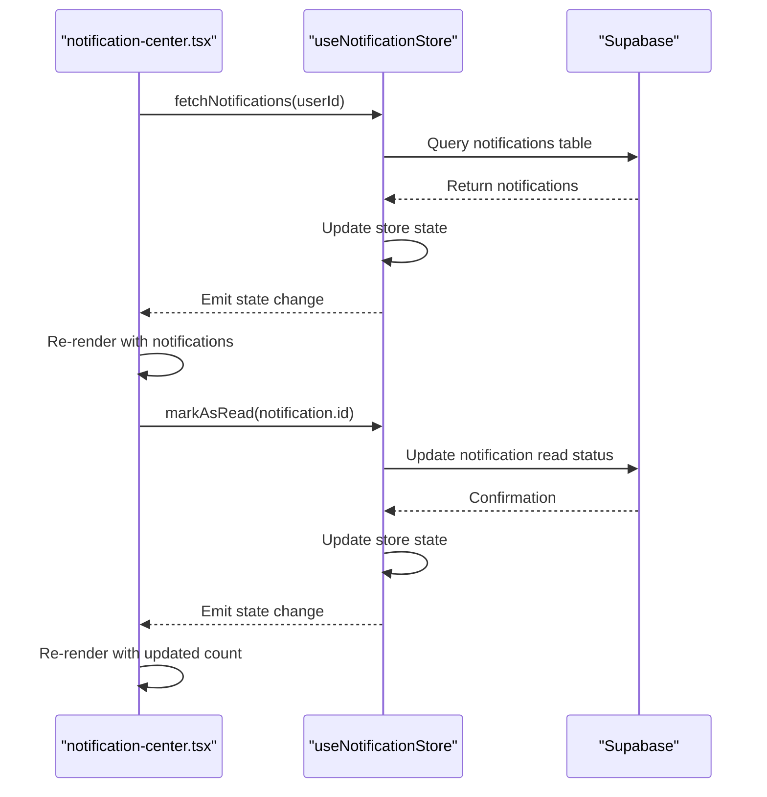

# State Management Stores

<cite>
**Referenced Files in This Document**   
- [auth-store.ts](file://lib/auth-store.ts)
- [announcement-store.ts](file://lib/announcement-store.ts)
- [grade-history-store.ts](file://lib/grade-history-store.ts)
- [notification-store.ts](file://lib/notification-store.ts)
- [analytics-store.ts](file://lib/analytics-store.ts)
- [assignment-store.ts](file://lib/assignment-store.ts)
- [calendar-store.ts](file://lib/calendar-store.ts)
- [parent-store.ts](file://lib/parent-store.ts)
- [notification-center.tsx](file://components/notification-center.tsx)
- [profile-page.tsx](file://components/profile-page.tsx)
</cite>

## Table of Contents
1. [Introduction](#introduction)
2. [Core Store Architecture](#core-store-architecture)
3. [Authentication Store](#authentication-store)
4. [Announcement Store](#announcement-store)
5. [Grade History Store](#grade-history-store)
6. [Notification Store](#notification-store)
7. [Store Relationships and Dependencies](#store-relationships-and-dependencies)
8. [Component Integration Patterns](#component-integration-patterns)
9. [Best Practices for Store Management](#best-practices-for-store-management)
10. [Creating New Stores](#creating-new-stores)

## Introduction
The school management system implements a comprehensive Zustand-based state management solution for handling global application state across various user roles including administrators, teachers, and students. This documentation details the architecture, functionality, and integration patterns of the state stores that manage authentication, announcements, grade history, notifications, and other critical application data. The system emphasizes reactivity, efficient state updates, persistence where necessary, and proper memory management to ensure optimal performance and user experience.

## Core Store Architecture
The state management system follows a modular architecture with specialized stores for different domains of application functionality. Each store encapsulates related state and provides a clean API for state manipulation and retrieval. The stores are implemented using Zustand, a lightweight state management solution for React that provides excellent performance characteristics and a simple API surface.

The core architectural principles include:
- **Separation of concerns**: Each store manages a specific domain of application state
- **Reactive updates**: Components automatically re-render when store state changes
- **Asynchronous operations**: Stores handle API calls and async updates internally
- **Persistence**: Selected stores maintain state across sessions using localStorage
- **Memory management**: Stores implement cleanup mechanisms to prevent memory leaks

**Diagram sources**
- [auth-store.ts](file://lib/auth-store.ts)
- [announcement-store.ts](file://lib/announcement-store.ts)
- [grade-history-store.ts](file://lib/grade-history-store.ts)
- [notification-store.ts](file://lib/notification-store.ts)
- [analytics-store.ts](file://lib/analytics-store.ts)
- [assignment-store.ts](file://lib/assignment-store.ts)
- [calendar-store.ts](file://lib/calendar-store.ts)
- [parent-store.ts](file://lib/parent-store.ts)

**Section sources**
- [auth-store.ts](file://lib/auth-store.ts)
- [announcement-store.ts](file://lib/announcement-store.ts)
- [grade-history-store.ts](file://lib/grade-history-store.ts)

## Authentication Store
The authentication store manages user authentication state and profile information across the application. It serves as the foundation for role-based access control and influences access to other stores based on user roles.

Key features of the auth store include:
- **User session management**: Tracks authenticated user state and profile information
- **Role-based access**: Stores user role information that determines access to other features
- **Initialization**: Properly initializes state on application startup
- **Cleanup**: Implements memory leak prevention through subscription cleanup
- **Security integration**: Integrates with fingerprint and session security mechanisms

The store maintains reactivity by exposing state properties and action methods that components can subscribe to. When authentication state changes (e.g., user logs in or out), all subscribed components automatically update to reflect the new state.

**Diagram sources**
- [auth-store.ts](file://lib/auth-store.ts#L15-L25)

**Section sources**
- [auth-store.ts](file://lib/auth-store.ts#L1-L110)

## Announcement Store
The announcement store manages real-time notifications and announcements across the school management system. It provides a centralized mechanism for creating, retrieving, and filtering announcements based on user roles and target audiences.

Key functionality includes:
- **Announcement creation**: Allows authorized users to create new announcements
- **Targeted distribution**: Supports audience-specific announcements (all, students, teachers, specific grades)
- **Priority levels**: Implements different priority levels (normal, important, urgent)
- **Temporal filtering**: Supports expiration dates for announcements
- **User-specific filtering**: Provides methods to retrieve announcements relevant to specific users

The store maintains reactivity through Zustand's subscription mechanism, ensuring that components displaying announcements update automatically when new announcements are added or existing ones are modified.

**Diagram sources**
- [announcement-store.ts](file://lib/announcement-store.ts#L20-L25)

**Section sources**
- [announcement-store.ts](file://lib/announcement-store.ts#L1-L60)

## Grade History Store
The grade history store manages academic performance tracking for students across multiple school years. It implements state persistence to maintain grade history data across application sessions.

Key features include:
- **State persistence**: Uses Zustand's persist middleware to store grade history in localStorage
- **Student-specific history**: Organizes grade history by student ID
- **Comprehensive grading data**: Stores subject grades, general averages, and promotion information
- **Historical tracking**: Maintains grade records across multiple school years and grade levels

The store handles asynchronous updates by providing synchronous methods for adding grade history, with the persistence mechanism operating transparently in the background. This ensures that grade history data is preserved even when users close and reopen the application.

**Diagram sources**
- [grade-history-store.ts](file://lib/grade-history-store.ts#L20-L24)

**Section sources**
- [grade-history-store.ts](file://lib/grade-history-store.ts#L1-L48)

## Notification Store
The notification store manages real-time notifications for users, providing a centralized system for delivering important information across the application.

Key functionality includes:
- **Notification lifecycle management**: Handles fetching, creating, reading, and deleting notifications
- **Unread count tracking**: Provides real-time unread notification counts for UI display
- **User-specific filtering**: Retrieves notifications specific to a user ID
- **Legacy compatibility**: Maintains backward compatibility with older notification formats
- **Real-time updates**: Integrates with Supabase to provide real-time notification updates

The store handles asynchronous operations through promise-based methods that interact with the Supabase database. When notifications are added, marked as read, or deleted, the store updates its internal state and triggers re-renders in subscribed components.

**Diagram sources**
- [notification-store.ts](file://lib/notification-store.ts#L32-L43)

**Section sources**
- [notification-store.ts](file://lib/notification-store.ts#L1-L148)

## Store Relationships and Dependencies
The state stores in the application are designed to work together, with specific relationships and dependencies that enable cohesive functionality across the system.

Key relationships include:
- **Authentication as foundation**: The auth store influences access to other stores based on user roles
- **Notification integration**: Multiple stores can trigger notifications through the notification store
- **Data sharing**: Stores may reference data from other stores when appropriate
- **Role-based access control**: User roles from the auth store determine access to store functionality

The stores maintain loose coupling while enabling necessary interactions. For example, when a teacher creates an announcement, the announcement store handles the announcement data while potentially triggering a notification through the notification store. The auth store's user role determines whether the user has permission to create announcements in the first place.

**Diagram sources**
- [auth-store.ts](file://lib/auth-store.ts)
- [announcement-store.ts](file://lib/announcement-store.ts)
- [grade-history-store.ts](file://lib/grade-history-store.ts)
- [notification-store.ts](file://lib/notification-store.ts)
- [profile-page.tsx](file://components/profile-page.tsx)
- [notification-center.tsx](file://components/notification-center.tsx)

**Section sources**
- [auth-store.ts](file://lib/auth-store.ts)
- [announcement-store.ts](file://lib/announcement-store.ts)
- [grade-history-store.ts](file://lib/grade-history-store.ts)
- [notification-store.ts](file://lib/notification-store.ts)

## Component Integration Patterns
Components throughout the application integrate with the state stores using consistent patterns that ensure proper reactivity and performance.

Key integration patterns include:
- **Selective subscription**: Components subscribe only to the specific state they need
- **Custom hooks**: Complex state interactions are encapsulated in custom hooks
- **Loading state management**: Components handle loading states during asynchronous operations
- **Error handling**: Components gracefully handle errors from store operations

The notification-center.tsx component demonstrates a typical integration pattern, subscribing to the notification store to display real-time notifications with unread counts and interactive controls.

**Diagram sources**
- [notification-store.ts](file://lib/notification-store.ts)
- [notification-center.tsx](file://components/notification-center.tsx)

**Section sources**
- [notification-center.tsx](file://components/notification-center.tsx#L1-L190)
- [notification-store.ts](file://lib/notification-store.ts#L1-L148)

## Best Practices for Store Management
The implementation follows several best practices for effective state management:

- **Memory management**: The auth store implements cleanup methods to prevent memory leaks from event listeners
- **Performance optimization**: Stores use memoized selectors to prevent unnecessary re-renders
- **Type safety**: All stores use TypeScript interfaces to ensure type safety
- **Error handling**: Asynchronous operations include proper error handling
- **Security considerations**: Sensitive operations are properly secured

For debugging, the application can integrate with Redux DevTools to inspect store state changes, though this is not explicitly shown in the current implementation. Developers should follow the pattern of keeping store logic simple and focused on state management rather than business logic.

**Section sources**
- [auth-store.ts](file://lib/auth-store.ts#L28-L29)
- [auth-store.ts](file://lib/auth-store.ts#L102-L108)

## Creating New Stores
When creating new stores, follow these guidelines:

- **Single responsibility**: Each store should manage a specific domain of state
- **Clear naming**: Use descriptive names ending with "store.ts"
- **Type definitions**: Define clear TypeScript interfaces for state and actions
- **Persistence consideration**: Determine if the store needs to persist state
- **Reactivity optimization**: Use appropriate selectors to minimize re-renders
- **Cleanup implementation**: Include cleanup methods for any subscriptions or listeners

New stores should be placed in the lib directory and follow the same pattern as existing stores, using Zustand's create function to define the store with an initial state and action methods.

**Section sources**
- [auth-store.ts](file://lib/auth-store.ts)
- [announcement-store.ts](file://lib/announcement-store.ts)
- [grade-history-store.ts](file://lib/grade-history-store.ts)