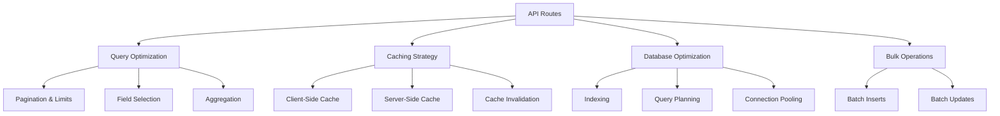

# Supabase Integration

<cite>
**Referenced Files in This Document**   
- [client.ts](file://lib/supabase/client.ts)
- [server.ts](file://lib/supabase/server.ts)
- [queries.ts](file://lib/supabase/queries.ts)
- [queries-optimized.ts](file://lib/supabase/queries-optimized.ts)
- [types.ts](file://lib/supabase/types.ts)
- [middleware.ts](file://lib/supabase/middleware.ts)
- [storage.ts](file://lib/supabase/storage.ts)
- [audit-logs.ts](file://lib/supabase/audit-logs.ts)
- [use-optimized-query.ts](file://lib/hooks/use-optimized-query.ts)
- [cache.ts](file://lib/cache.ts)
- [20251219044036_add_rls_policies.sql](file://supabase/migrations/20251219044036_add_rls_policies.sql)
- [20251219082251_fix_all_rls_policies_v2.sql](file://supabase/migrations/20251219082251_fix_all_rls_policies_v2.sql)
- [20260108_performance_indexes.sql](file://supabase/migrations/20260108_performance_indexes.sql)
- [route.ts](file://app/api/profile/upload-avatar/route.ts)
- [route.ts](file://app/api/admin/students/create/route.ts)
- [route.ts](file://app/api/student/classes/route.ts)
</cite>

## Table of Contents
1. [Introduction](#introduction)
2. [Client Initialization](#client-initialization)
3. [Server-Side Integration](#server-side-integration)
4. [Database Query Layer](#database-query-layer)
5. [Type Safety and Data Modeling](#type-safety-and-data-modeling)
6. [Row Level Security Implementation](#row-level-security-implementation)
7. [Middleware Integration](#middleware-integration)
8. [Storage Management](#storage-management)
9. [API Route Implementation](#api-route-implementation)
10. [Query Optimization Strategies](#query-optimization-strategies)
11. [Error Handling and Connection Management](#error-handling-and-connection-management)
12. [Performance Optimization](#performance-optimization)
13. [Best Practices](#best-practices)

## Introduction
The Supabase integration layer serves as the primary data access mechanism for the School Management System application. This comprehensive documentation details the architecture, implementation, and best practices for interacting with the Supabase backend service. The integration is designed to provide secure, efficient, and type-safe access to database operations across both client and server environments. The system implements a multi-layered approach with distinct components for client initialization, server-side operations, query management, type safety, security enforcement, and storage handling. This documentation will explore each component in detail, demonstrating how they work together to create a robust data access layer that supports the application's CRUD operations while maintaining security and performance standards.

## Client Initialization

The client initialization process is implemented in `client.ts` and provides browser-specific Supabase client instances for client-side operations. The `createClient()` function uses the `createBrowserClient` from the `@supabase/ssr` package to instantiate a Supabase client configured with environment variables for the public URL and anonymous key. This client is designed for use in Next.js client components and React components where browser-based authentication and data access are required. The implementation follows Supabase's recommended SSR patterns, ensuring proper hydration and state management in Next.js applications. The client handles authentication state, session management, and provides access to all Supabase services including database, authentication, and storage. This initialization approach ensures that client-side components can securely interact with the Supabase backend while respecting the application's security policies and rate limiting requirements.

**Section sources**
- [client.ts](file://lib/supabase/client.ts#L1-L9)

## Server-Side Integration

The server-side integration is implemented in `server.ts` and provides specialized Supabase client instances for server-side operations in Next.js. The file exports two primary functions: `createClient()` and `createAdminClient()`. The `createClient()` function creates a server-side Supabase client that integrates with Next.js headers and cookies, enabling proper session management in server components and API routes. It uses `createServerClient` from `@supabase/ssr` and configures cookie handling to work with Next.js' cookies API, including error handling for scenarios where `setAll` is called from Server Components. The `createAdminClient()` function creates a privileged client that bypasses Row Level Security (RLS) policies using the service role key, intended for webhook processing and background jobs that require elevated privileges. This function includes validation to ensure the service role key is configured, throwing an error if missing. The server-side integration enables secure database access from API routes and server components while maintaining proper authentication context and session management.

**Section sources**
- [server.ts](file://lib/supabase/server.ts#L1-L51)

## Database Query Layer

The database query layer consists of two complementary modules: `queries.ts` and `queries-optimized.ts`, which encapsulate database operations with varying levels of optimization. The `queries.ts` file contains basic query functions for retrieving data from various entities including users, students, teachers, classes, schedules, attendance records, grades, quizzes, lessons, and announcements. Each function creates a client instance and executes a specific query with appropriate joins to related tables, returning typed results. The `queries-optimized.ts` file provides enhanced versions of these queries with pagination, caching, and performance improvements. It introduces pagination parameters and responses, optimized queries with aggregation to prevent N+1 problems, date-range filtering for time-based data, and bulk operation support for improved efficiency. The optimized queries also include dashboard-specific aggregation functions that execute multiple queries in parallel to minimize database round trips. This dual-layer approach allows developers to choose between simple queries for basic use cases and optimized queries for performance-critical scenarios.

**Section sources**
- [queries.ts](file://lib/supabase/queries.ts#L1-L419)
- [queries-optimized.ts](file://lib/supabase/queries-optimized.ts#L1-L317)

## Type Safety and Data Modeling

Type safety is implemented through the `types.ts` file, which defines TypeScript interfaces that mirror the Supabase database schema. The file exports a comprehensive set of types for all major entities in the application, including `DbUser`, `DbStudentProfile`, `DbTeacherProfile`, `DbClass`, `DbAttendanceRecord`, `DbGrade`, `DbSchedule`, `DbQuiz`, `DbLesson`, `DbAnnouncement`, and others. These interfaces provide strict typing for database records, ensuring type safety throughout the application. The file also defines enumerated types for fields with restricted values, such as `UserRole` ("admin" | "teacher" | "student"), `EnrollmentStatus`, `SHSTrack`, `Sex`, and `DisabilityType`. These types are used consistently across the query functions and API routes, enabling compile-time validation of data operations. The type definitions include all relevant fields with appropriate nullability annotations, reflecting the database schema accurately. This comprehensive typing system prevents common errors related to data access and manipulation while providing excellent developer experience through IntelliSense and type checking.

**Section sources**
- [types.ts](file://lib/supabase/types.ts#L1-L253)

## Row Level Security Implementation

Row Level Security (RLS) is implemented through SQL policies defined in migration files, with the primary policies located in `20251219044036_add_rls_policies.sql` and subsequent refinement in `20251219082251_fix_all_rls_policies_v2.sql`. The RLS policies enforce data access controls at the database level, ensuring that users can only access data they are authorized to see. The initial implementation includes policies that allow users to read, insert, and update their own data by verifying that the authenticated user ID matches the record ID. Specific policies are defined for users, student profiles, and teacher profiles, while school settings are configured to be readable by all authenticated users. A subsequent migration adopts a more permissive approach for many tables, allowing all authenticated users to read data from tables such as classes, attendance records, grades, quizzes, lessons, and announcements. This design balances security with the application's requirements for data sharing among authorized users. The RLS policies work in conjunction with the application's authentication system to provide a robust security layer that cannot be bypassed by client-side code.

**Section sources**
- [20251219044036_add_rls_policies.sql](file://supabase/migrations/20251219044036_add_rls_policies.sql#L1-L22)
- [20251219082251_fix_all_rls_policies_v2.sql](file://supabase/migrations/20251219082251_fix_all_rls_policies_v2.sql#L1-L82)

## Middleware Integration

The middleware integration is implemented in `middleware.ts` and provides a function for updating user sessions in Next.js API routes. The `updateSession` function creates a server-side Supabase client configured to work with Next.js request objects, enabling authentication state management in middleware. It uses `createServerClient` with a custom cookie configuration that intercepts cookie operations to ensure proper response handling. The middleware extracts the authentication token from incoming requests, validates the user session, and returns both the user object and an updated response with any necessary cookie changes. This implementation ensures that authentication state is consistently maintained across requests while handling the complexities of Next.js' middleware and server component execution contexts. The function returns a user object if authenticated or null if not, allowing API routes to make authorization decisions based on the authentication state. This middleware pattern enables secure, stateless authentication handling across the application's API routes.

**Section sources**
- [middleware.ts](file://lib/supabase/middleware.ts#L1-L38)

## Storage Management

Storage management is implemented in `storage.ts` and provides functionality for handling file uploads, particularly avatar management. The module defines constants for the avatar storage bucket (`avatars`), maximum file size (5MB), allowed image types (JPEG, PNG, WebP), and avatar dimensions (256x256). It exports several key functions: `ensureAvatarBucketExists` checks for and creates the avatar bucket if missing; `validateImageFile` performs client-side validation of image files; `generateAvatarPath` creates unique file paths using UUIDs to prevent conflicts; `uploadAvatar` handles the complete avatar upload process with MIME type validation and secure storage; `deleteAvatar` removes avatars from storage; and `getSignedMaterialUrl` generates time-limited signed URLs for accessing private materials. The implementation includes multiple security measures such as MIME type validation using file signatures, content type enforcement during upload, and short-lived signed URLs (5 minutes) for private content. The avatar upload process is also integrated with user profile updates, automatically storing the public URL in the user record.

**Section sources**
- [storage.ts](file://lib/supabase/storage.ts#L1-L110)

## API Route Implementation

API routes demonstrate the practical application of the Supabase integration layer across various use cases. The avatar upload route (`app/api/profile/upload-avatar/route.ts`) implements a secure file upload process with rate limiting, file type validation using magic numbers, and integration with the storage module. It validates the authenticated user, processes the uploaded file, uploads it to the avatar bucket, and updates the user's profile with the new avatar URL. The student creation route (`app/api/admin/students/create/route.ts`) showcases administrative operations using the service role key to bypass RLS policies, enabling bulk data operations while maintaining transactional integrity through error handling that cleans up partially created records. The student classes route (`app/api/student/classes/route.ts`) demonstrates data aggregation by combining enrollment data with class information and calculating student counts per class. These API routes follow consistent patterns of authentication validation, error handling, and response formatting, serving as examples for implementing CRUD operations, security enforcement, and complex data queries within the Supabase integration framework.

**Section sources**
- [route.ts](file://app/api/profile/upload-avatar/route.ts#L1-L110)
- [route.ts](file://app/api/admin/students/create/route.ts#L1-L165)
- [route.ts](file://app/api/student/classes/route.ts#L1-L66)

## Query Optimization Strategies

The query optimization strategies are implemented through a combination of the `queries-optimized.ts` module, caching utilities in `cache.ts`, and custom React hooks in `use-optimized-query.ts`. The optimized queries introduce pagination with exact count retrieval, reducing payload sizes and improving performance for large datasets. They implement aggregation at the database level to prevent N+1 query problems, such as retrieving class enrollment counts in a single query rather than multiple round trips. The caching system provides both in-memory caching for client-side queries with a 30-second TTL and server-side caching using Next.js `unstable_cache` with configurable revalidation times. The `useOptimizedQuery` hook implements automatic caching, deduplication, retry logic with exponential backoff for transient failures, and cache invalidation. It also supports refetch intervals for real-time data updates. The system includes specialized hooks for paginated queries, infinite scroll, and debounced search queries, addressing common data loading patterns. Cache tags are used with Next.js revalidation to ensure data consistency when updates occur, allowing targeted cache invalidation based on data dependencies.

**Section sources**
- [queries-optimized.ts](file://lib/supabase/queries-optimized.ts#L1-L317)
- [cache.ts](file://lib/cache.ts#L1-L128)
- [use-optimized-query.ts](file://lib/hooks/use-optimized-query.ts#L1-L275)

## Error Handling and Connection Management

Error handling and connection management are implemented consistently across the Supabase integration layer. The query functions use try-catch patterns and explicit error checking on Supabase responses, throwing errors that can be caught and handled by calling code. The system distinguishes between different types of errors, such as validation errors, authentication errors, and database errors, allowing for appropriate client-side handling. Connection management is handled by the Supabase client instances, which manage connection pooling and reconnection logic automatically. The server-side implementation includes specific error handling for cookie operations in server components, gracefully handling cases where cookie setting is not permitted. The avatar upload process implements comprehensive error handling with specific validation messages for different failure modes. The audit logs module includes error handling for database queries and provides detailed error information for monitoring and debugging. The system also implements rate limiting to prevent abuse and protect backend resources, with specific error responses for rate limit exceeded conditions. This comprehensive error handling approach ensures robust operation under various failure conditions while providing meaningful feedback for debugging and user communication.

**Section sources**
- [queries.ts](file://lib/supabase/queries.ts#L1-L419)
- [storage.ts](file://lib/supabase/storage.ts#L1-L110)
- [audit-logs.ts](file://lib/supabase/audit-logs.ts#L1-L321)
- [route.ts](file://app/api/profile/upload-avatar/route.ts#L1-L110)

## Performance Optimization

Performance optimization is achieved through multiple strategies implemented across the Supabase integration layer. Database-level optimization is provided by SQL indexes defined in `20260108_performance_indexes.sql`, which creates targeted indexes on frequently queried columns such as user roles, email addresses, attendance dates, grade timestamps, and class relationships. These indexes significantly improve query performance for common access patterns. The application layer implements query optimization through pagination, field selection, and aggregation to minimize data transfer and processing. Client-side caching reduces redundant API calls, while server-side caching with Next.js `unstable_cache` minimizes database load for frequently accessed data. The use of parallel queries in dashboard operations reduces latency by minimizing round trips. The system also implements bulk operations for efficient data updates and uses connection pooling through the Supabase client. These optimizations work together to ensure responsive application performance even with large datasets and concurrent users, while maintaining efficient resource utilization on both client and server.

**Diagram sources **
- [queries-optimized.ts](file://lib/supabase/queries-optimized.ts#L1-L317)
- [cache.ts](file://lib/cache.ts#L1-L128)
- [20260108_performance_indexes.sql](file://supabase/migrations/20260108_performance_indexes.sql#L1-L104)

**Section sources**
- [queries-optimized.ts](file://lib/supabase/queries-optimized.ts#L1-L317)
- [cache.ts](file://lib/cache.ts#L1-L128)
- [20260108_performance_indexes.sql](file://supabase/migrations/20260108_performance_indexes.sql#L1-L104)

## Best Practices

The Supabase integration layer demonstrates several best practices for secure and efficient database access in Next.js applications. Security is prioritized through the implementation of Row Level Security policies, proper authentication context management, and secure file handling with MIME type validation and rate limiting. The separation of client and server clients ensures appropriate security contexts for different execution environments. Type safety is maintained through comprehensive TypeScript interfaces that mirror the database schema, preventing common data access errors. Performance optimization follows a multi-layered approach with database indexing, query optimization, and strategic caching. The modular architecture separates concerns between client initialization, query definitions, type definitions, and utility functions, promoting code reuse and maintainability. Error handling is consistent and comprehensive, providing meaningful feedback while protecting sensitive information. The implementation follows Supabase and Next.js best practices for SSR, middleware, and API routes, ensuring compatibility with framework updates and optimal performance. These practices collectively create a robust, secure, and maintainable data access layer that can serve as a model for similar applications.