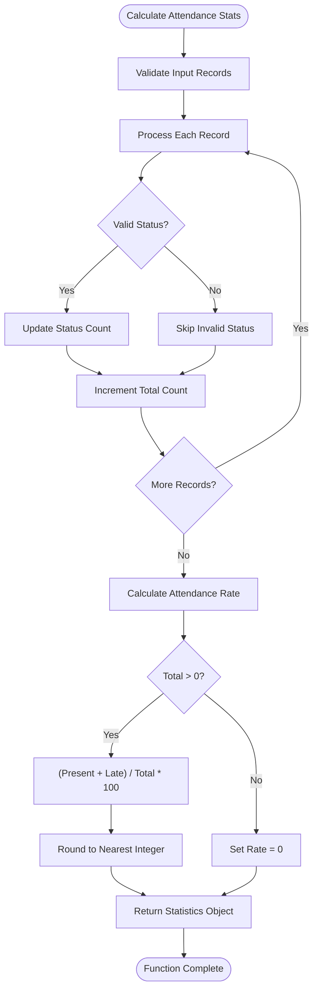
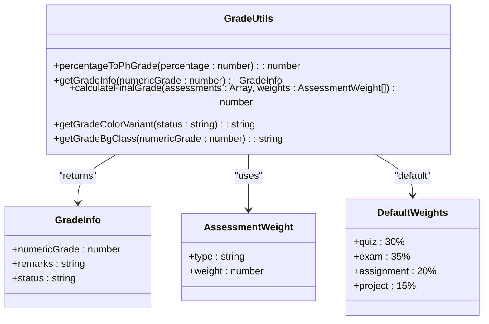
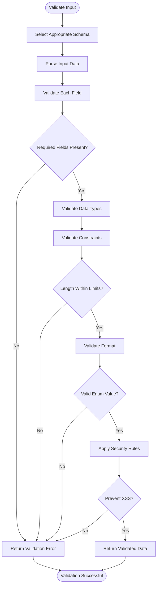
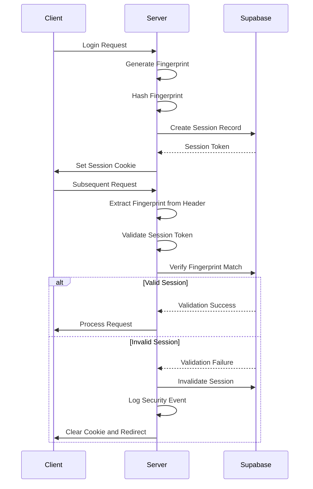
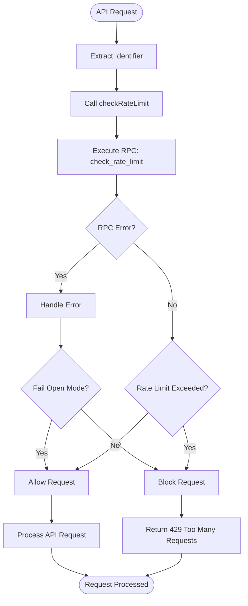
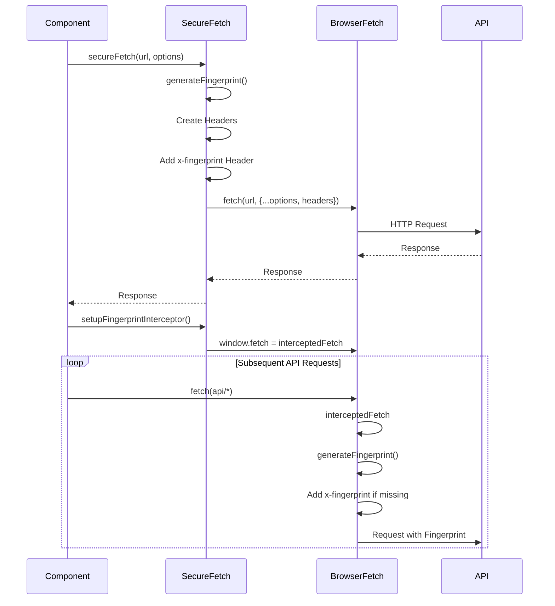
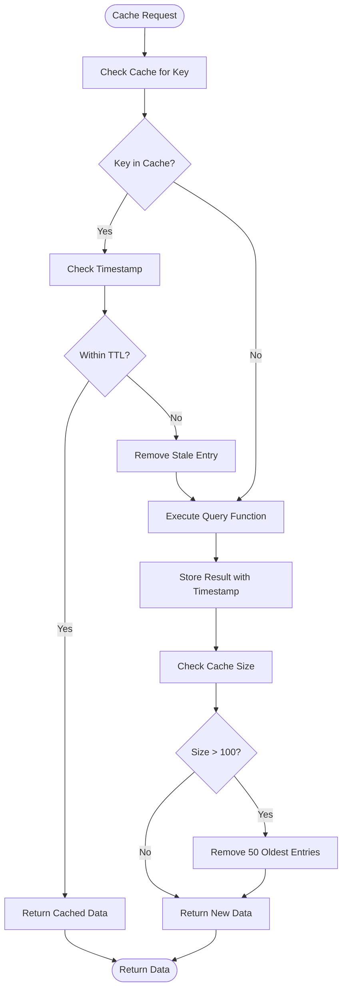
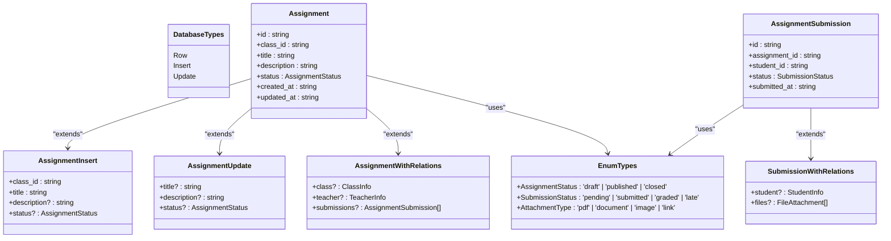
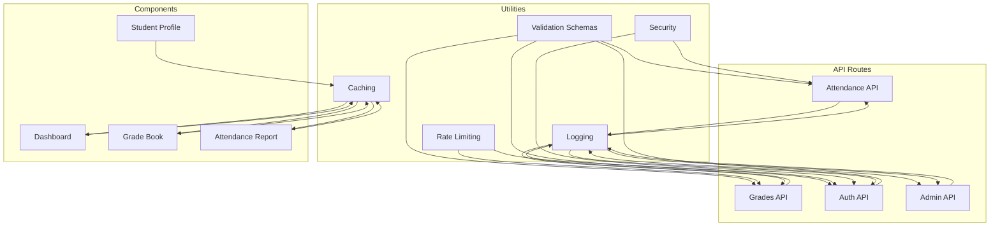

# Utility Functions and Helpers

<cite>
**Referenced Files in This Document**   
- [attendance-utils.ts](file://lib/attendance-utils.ts)
- [grade-utils.ts](file://lib/grade-utils.ts)
- [validation-schemas.ts](file://lib/validation-schemas.ts)
- [security.ts](file://lib/security.ts)
- [session-security.ts](file://lib/session-security.ts)
- [fingerprint.ts](file://lib/fingerprint.ts)
- [rate-limit.ts](file://lib/rate-limit.ts)
- [secure-fetch.ts](file://lib/secure-fetch.ts)
- [logger.ts](file://lib/logger.ts)
- [cache.ts](file://lib/cache.ts)
- [database-helpers.ts](file://lib/database-helpers.ts)
</cite>

## Table of Contents
1. [Introduction](#introduction)
2. [Attendance Utilities](#attendance-utilities)
3. [Grade Calculation Utilities](#grade-calculation-utilities)
4. [Validation Schemas](#validation-schemas)
5. [Security and Session Management](#security-and-session-management)
6. [Client-Side Fingerprinting](#client-side-fingerprinting)
7. [Rate Limiting](#rate-limiting)
8. [Secure HTTP Requests](#secure-http-requests)
9. [Logging System](#logging-system)
10. [Caching Utilities](#caching-utilities)
11. [Database Type Helpers](#database-type-helpers)
12. [Integration Examples](#integration-examples)
13. [Conclusion](#conclusion)

## Introduction
This document provides comprehensive documentation for the utility functions and helper modules in the School Management System. These utilities provide cross-cutting functionality across the application, including attendance calculations, grade computations, input validation, security enforcement, and infrastructure support. The documented utilities are designed to ensure data integrity, enhance security, improve performance, and maintain consistency across the application.

## Attendance Utilities

The attendance utilities provide functions for calculating attendance statistics and generating reports. The core function `calculateAttendanceStats` processes attendance records and computes key metrics including present, absent, late, and excused counts, along with an overall attendance rate.

The attendance rate calculation considers both "present" and "late" statuses as attended, providing a more accurate representation of student participation. The function handles edge cases such as empty record sets and validates status values before counting.



**Diagram sources**
- [attendance-utils.ts](file://lib/attendance-utils.ts#L17-L41)

**Section sources**
- [attendance-utils.ts](file://lib/attendance-utils.ts#L3-L41)

## Grade Calculation Utilities

The grade utilities implement the Philippine grading system with specialized functions for converting percentages to standardized grades, calculating weighted averages, and determining academic performance levels. The system follows the national education framework with specific grade ranges and corresponding performance descriptors.

The `calculateFinalGrade` function computes final grades using weighted assessments, supporting different assessment types (quizzes, exams, assignments, projects) with configurable weights. The function handles missing assessment types and normalizes the final percentage before converting it to the Philippine grade scale.



**Diagram sources**
- [grade-utils.ts](file://lib/grade-utils.ts#L10-L163)

**Section sources**
- [grade-utils.ts](file://lib/grade-utils.ts#L1-L163)

## Validation Schemas

The validation schemas define Zod schemas for form validation and API input sanitization. These schemas prevent injection attacks and ensure data integrity by validating all incoming requests against strict type definitions. Each schema corresponds to a specific API endpoint or form submission, with appropriate field constraints and data type requirements.

The schemas cover various domains including lesson management, announcements, calendar events, grades, attendance, class management, enrollment, parent-child relationships, QR attendance, and system settings. Each schema includes appropriate validation rules such as UUID format for IDs, string length limits, and enumerated values for status fields.



**Diagram sources**
- [validation-schemas.ts](file://lib/validation-schemas.ts#L8-L126)

**Section sources**
- [validation-schemas.ts](file://lib/validation-schemas.ts#L1-L126)

## Security and Session Management

The security utilities implement secure session handling, CSRF protection, and audit monitoring. The session security system uses device fingerprinting to detect session hijacking attempts and maintains a record of active sessions and devices for user monitoring.

The system creates a unique session binding token stored in an HttpOnly cookie, which is validated against the client's fingerprint on each request. If a mismatch is detected, the session is invalidated and the user is logged out. The system also logs security events such as new device logins and potential hijacking attempts.



**Diagram sources**
- [security.ts](file://lib/security.ts#L1-L136)
- [session-security.ts](file://lib/session-security.ts#L1-L373)

**Section sources**
- [security.ts](file://lib/security.ts#L1-L136)
- [session-security.ts](file://lib/session-security.ts#L1-L373)

## Client-Side Fingerprinting

The fingerprinting utilities collect non-PII browser characteristics to create a unique device identifier for session validation. The client-side fingerprint includes information such as user agent, language, timezone, screen resolution, color depth, platform, and cookie support.

This fingerprint is sent with each API request and validated against the stored fingerprint in the session record. The system uses this mechanism to detect potential session hijacking when a request originates from a different device than the one used to establish the session.

```mermaid
classDiagram
class ClientFingerprint {
+userAgent : string
+language : string
+timezone : string
+screenResolution : string
+colorDepth : number
+platform : string
+cookiesEnabled : boolean
+doNotTrack : string | null
}
class FingerprintUtils {
+generateFingerprint() : ClientFingerprint
+storeSessionToken(token : string) : void
+getStoredSessionToken() : string | null
+clearSessionToken() : void
}
FingerprintUtils --> ClientFingerprint : "returns"
class SecureFetch {
+secureFetch(url : string, options : RequestInit) : Promise<Response>
+setupFingerprintInterceptor() : void
}
SecureFetch --> FingerprintUtils : "uses"
Client->>SecureFetch : Make API Request
SecureFetch->>FingerprintUtils : Generate Fingerprint
SecureFetch->>Client : Add to Request Headers
```

**Diagram sources**
- [fingerprint.ts](file://lib/fingerprint.ts#L1-L68)
- [secure-fetch.ts](file://lib/secure-fetch.ts#L1-L52)

**Section sources**
- [fingerprint.ts](file://lib/fingerprint.ts#L1-L68)

## Rate Limiting

The rate limiting utility protects API endpoints from abuse by limiting the number of requests a user or IP address can make within a specified time window. The system uses Supabase's RPC functionality to implement atomic rate limiting checks that prevent race conditions.

The rate limiter can be configured with different limits for different endpoints and supports a fail-open mode for availability during database outages, except for security-critical endpoints like login which use fail-closed mode to prevent brute force attacks.



**Diagram sources**
- [rate-limit.ts](file://lib/rate-limit.ts#L1-L56)

**Section sources**
- [rate-limit.ts](file://lib/rate-limit.ts#L1-L56)

## Secure HTTP Requests

The secure fetch utilities provide a wrapper around the native fetch API that automatically includes the client fingerprint in requests to protected endpoints. This ensures that all API requests include the necessary security information for session validation.

The system also provides a global fetch interceptor that can be set up once in the application layout to automatically add fingerprints to all API requests, reducing the need for manual implementation in individual components.



**Diagram sources**
- [secure-fetch.ts](file://lib/secure-fetch.ts#L1-L52)

**Section sources**
- [secure-fetch.ts](file://lib/secure-fetch.ts#L1-L52)

## Logging System

The logging utility provides a secure structured logging system that prevents sensitive data leakage in production environments. The logger sanitizes sensitive information such as passwords, tokens, and session IDs before logging, replacing them with redacted values.

The system implements different logging levels (info, warn, error, debug) with environment-specific behavior: all levels are logged in development, but only warnings and errors are logged in production to minimize log volume and potential information disclosure.

```mermaid
classDiagram
class LogLevel {
<<enumeration>>
info
warn
error
debug
}
class LogContext {
+userId? : string
+endpoint? : string
+action? : string
+[key : string] : any
}
class Logger {
-shouldLog(level : LogLevel) : boolean
-formatMessage(level : LogLevel, message : string, context? : LogContext) : string
+info(message : string, context? : LogContext)
+warn(message : string, context? : LogContext)
+error(message : string, error? : Error | unknown, context? : LogContext)
+debug(message : string, context? : LogContext)
}
class Sanitizer {
+sanitizeContext(context : LogContext) : LogContext
}
Logger --> LogLevel : "uses"
Logger --> LogContext : "uses"
Logger --> Sanitizer : "uses"
Sanitizer --> LogContext : "input/output"
Client->>Logger : logger.info("message", context)
Logger->>Sanitizer : sanitizeContext(context)
Sanitizer-->>Logger : sanitized context
Logger->>Logger : formatMessage()
Logger->>Console : console.log()
```

**Diagram sources**
- [logger.ts](file://lib/logger.ts#L1-L99)

**Section sources**
- [logger.ts](file://lib/logger.ts#L1-L99)

## Caching Utilities

The caching utilities implement both in-memory and Next.js cache strategies to improve application performance by reducing redundant API calls and database queries. The system provides client-side caching with TTL (time-to-live) and server-side caching using Next.js unstable_cache with revalidation tags.

The cache supports manual invalidation by key or tag, allowing the application to refresh data when it changes. The system also includes utility functions for common data types like dashboard data, student lists, and class lists with appropriate revalidation intervals.



**Diagram sources**
- [cache.ts](file://lib/cache.ts#L1-L128)

**Section sources**
- [cache.ts](file://lib/cache.ts#L1-L128)

## Database Type Helpers

The database helpers provide TypeScript type definitions for database tables and common query patterns, improving type safety and developer experience. The system exports row, insert, and update types for key tables, as well as joined types that include related data from foreign tables.

The helpers also define enum types for database constraints and provide utility types for extracting enum values from check constraints, ensuring type consistency between the database schema and application code.



**Diagram sources**
- [database-helpers.ts](file://lib/database-helpers.ts#L1-L47)

**Section sources**
- [database-helpers.ts](file://lib/database-helpers.ts#L1-L47)

## Integration Examples

The utility functions are integrated throughout the application in API routes, components, and middleware to enforce business rules, improve performance, and enhance security. For example, the attendance utilities are used in attendance reporting endpoints, the grade utilities in grade calculation and display, and the security utilities in authentication flows.

The validation schemas are used in API routes to sanitize input before processing, while the rate limiting utilities protect sensitive endpoints from abuse. The caching utilities are used in data-intensive components to reduce load times, and the logging utilities provide visibility into system operations for monitoring and debugging.



**Diagram sources**
- [attendance-utils.ts](file://lib/attendance-utils.ts)
- [grade-utils.ts](file://lib/grade-utils.ts)
- [validation-schemas.ts](file://lib/validation-schemas.ts)
- [security.ts](file://lib/security.ts)
- [session-security.ts](file://lib/session-security.ts)
- [rate-limit.ts](file://lib/rate-limit.ts)
- [cache.ts](file://lib/cache.ts)
- [logger.ts](file://lib/logger.ts)

**Section sources**
- [app/api/admin/attendance/route.ts](file://app/api/admin/attendance/route.ts)
- [app/api/teacher/grades/create/route.ts](file://app/api/teacher/grades/create/route.ts)
- [app/api/auth/login/route.ts](file://app/api/auth/login/route.ts)
- [proxy.ts](file://proxy.ts)

## Conclusion
The utility functions and helper modules in the School Management System provide essential cross-cutting functionality that enhances the application's security, performance, and maintainability. These utilities are designed with security as a primary concern, implementing measures such as input validation, rate limiting, session security, and secure logging to protect against common web vulnerabilities.

The modular design of these utilities allows for consistent implementation of business rules across the application while reducing code duplication. The type-safe interfaces and comprehensive documentation make these utilities easy to use and maintain, contributing to the overall reliability and scalability of the system.

By centralizing common functionality in well-tested utility modules, the application achieves a clean separation of concerns, making it easier to implement new features, fix bugs, and perform security audits. The comprehensive suite of utilities demonstrates a mature approach to application architecture that prioritizes security, performance, and developer experience.