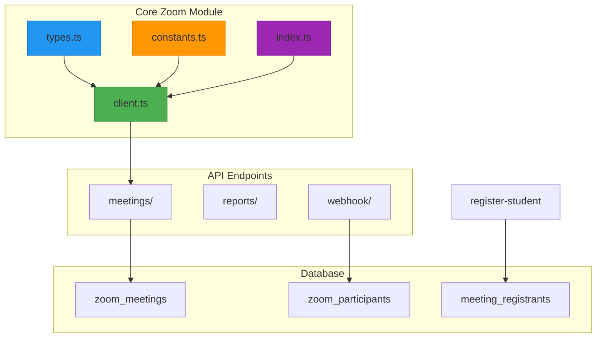
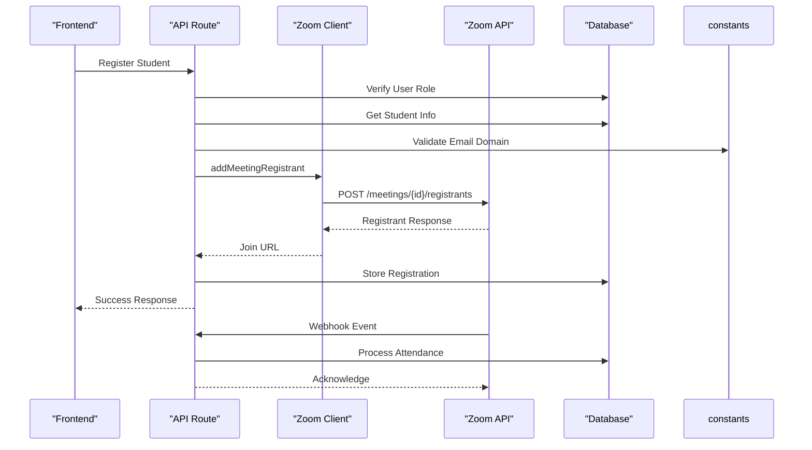
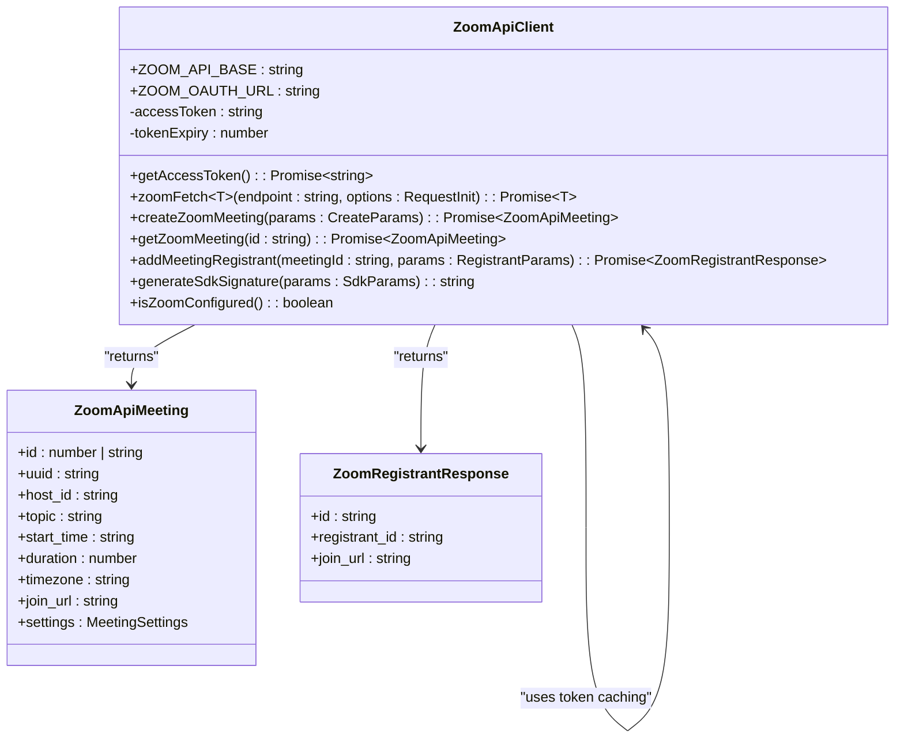
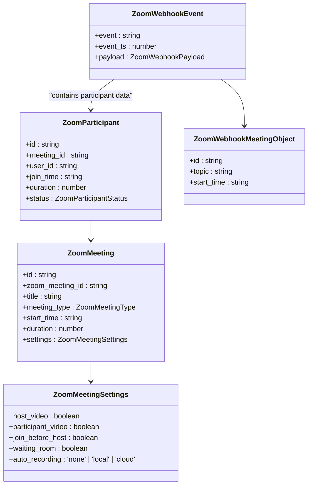
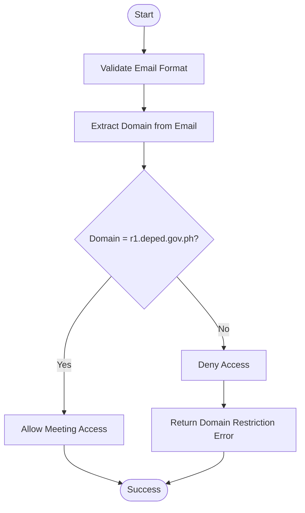
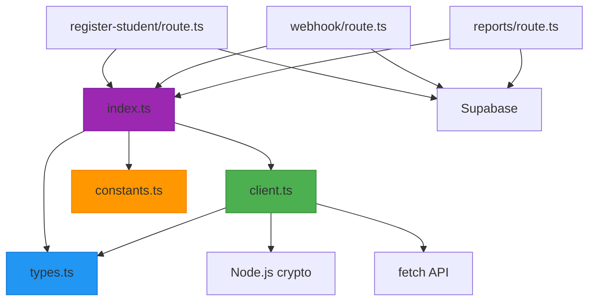

# Zoom Integration

<cite>
**Referenced Files in This Document**   
- [client.ts](file://lib/zoom/client.ts)
- [types.ts](file://lib/zoom/types.ts)
- [constants.ts](file://lib/zoom/constants.ts)
- [index.ts](file://lib/zoom/index.ts)
- [route.ts](file://app/api/zoom/meetings/register-student/route.ts)
- [route.ts](file://app/api/zoom/meetings/[id]/attendance/route.ts)
- [route.ts](file://app/api/zoom/reports/route.ts)
- [route.ts](file://app/api/zoom/webhook/route.ts)
- [create_zoom_meetings_table.sql](file://supabase/migrations/20260110000001_create_zoom_meetings_table.sql)
- [create_meeting_registrants_table.sql](file://supabase/migrations/20260110000002_create_meeting_registrants_table.sql)
- [.env.example](file://.env.example)
- [rate-limit.ts](file://lib/rate-limit.ts)
</cite>

## Table of Contents
1. [Introduction](#introduction)
2. [Project Structure](#project-structure)
3. [Core Components](#core-components)
4. [Architecture Overview](#architecture-overview)
5. [Detailed Component Analysis](#detailed-component-analysis)
6. [Dependency Analysis](#dependency-analysis)
7. [Performance Considerations](#performance-considerations)
8. [Troubleshooting Guide](#troubleshooting-guide)
9. [Conclusion](#conclusion)

## Introduction
The Zoom integration module enables virtual meeting functionality within the school management system, allowing teachers and administrators to create, manage, and track online classes and meetings. This documentation details the implementation of the Zoom API client, type definitions, constants, and unified interface that power the virtual classroom experience. The system handles authentication, meeting creation, participant registration, attendance tracking, and reporting through a secure and scalable architecture.

## Project Structure
The Zoom integration is organized in a modular structure within the `lib/zoom` directory, with API routes in `app/api/zoom` handling external interactions. The core functionality is separated into distinct files for maintainability and type safety.

**Diagram sources**
- [client.ts](file://lib/zoom/client.ts)
- [types.ts](file://lib/zoom/types.ts)
- [constants.ts](file://lib/zoom/constants.ts)
- [index.ts](file://lib/zoom/index.ts)
- [create_zoom_meetings_table.sql](file://supabase/migrations/20260110000001_create_zoom_meetings_table.sql)
- [create_meeting_registrants_table.sql](file://supabase/migrations/20260110000002_create_meeting_registrants_table.sql)

**Section sources**
- [client.ts](file://lib/zoom/client.ts)
- [types.ts](file://lib/zoom/types.ts)
- [constants.ts](file://lib/zoom/constants.ts)
- [index.ts](file://lib/zoom/index.ts)

## Core Components
The Zoom integration consists of four main components: the API client, type definitions, constants, and a unified export interface. These components work together to provide a type-safe, secure, and efficient interface for interacting with Zoom's API. The client handles authentication and request management, while the types ensure data integrity throughout the system.

**Section sources**
- [client.ts](file://lib/zoom/client.ts)
- [types.ts](file://lib/zoom/types.ts)
- [constants.ts](file://lib/zoom/constants.ts)
- [index.ts](file://lib/zoom/index.ts)

## Architecture Overview
The Zoom integration follows a layered architecture with clear separation of concerns. The client layer handles API communication, the service layer processes business logic, and the data layer manages persistence. Webhook events from Zoom are processed asynchronously to update attendance records in real-time.

**Diagram sources**
- [client.ts](file://lib/zoom/client.ts)
- [route.ts](file://app/api/zoom/meetings/register-student/route.ts)
- [route.ts](file://app/api/zoom/webhook/route.ts)

## Detailed Component Analysis

### Zoom API Client Implementation
The Zoom API client in `client.ts` implements Server-to-Server OAuth authentication using environment variables. It manages token caching with expiration handling to minimize authentication requests. The client includes robust error handling and automatically converts large Zoom meeting IDs to strings to prevent precision loss in JavaScript.

#### Authentication and Request Management

**Diagram sources**
- [client.ts](file://lib/zoom/client.ts#L8-L334)

**Section sources**
- [client.ts](file://lib/zoom/client.ts#L8-L334)

### Type Definitions for Type Safety
The `types.ts` file defines comprehensive TypeScript interfaces that ensure type-safe interactions with Zoom's API. These types cover meeting data, participants, registrants, webhook events, and SDK signatures. The type definitions include both application-specific interfaces and direct mappings to Zoom API responses.

#### Type Hierarchy and Relationships

**Diagram sources**
- [types.ts](file://lib/zoom/types.ts#L1-L168)

**Section sources**
- [types.ts](file://lib/zoom/types.ts#L1-L168)

### Constants and Domain Restrictions
The `constants.ts` file defines application-specific constants for the Zoom integration, including email domain restrictions for security. The module enforces that only users with @r1.deped.gov.ph email addresses can join class meetings, ensuring compliance with institutional policies.

#### Domain Restriction Logic

**Diagram sources**
- [constants.ts](file://lib/zoom/constants.ts#L1-L22)

**Section sources**
- [constants.ts](file://lib/zoom/constants.ts#L1-L22)

### Unified Export Interface
The `index.ts` file provides a unified export interface that re-exports all Zoom-related types and functions. This barrel file simplifies imports throughout the application and provides a single entry point for the Zoom integration module.

**Section sources**
- [index.ts](file://lib/zoom/index.ts#L1-L10)

## Dependency Analysis
The Zoom integration has well-defined dependencies between components, with clear import relationships and minimal circular dependencies. The module depends on environment variables for configuration and Supabase for data persistence.

**Diagram sources**
- [index.ts](file://lib/zoom/index.ts#L1-L10)
- [client.ts](file://lib/zoom/client.ts#L8-L334)
- [types.ts](file://lib/zoom/types.ts#L1-L168)
- [constants.ts](file://lib/zoom/constants.ts#L1-L22)
- [route.ts](file://app/api/zoom/meetings/register-student/route.ts#L1-L116)
- [route.ts](file://app/api/zoom/webhook/route.ts#L1-L342)
- [route.ts](file://app/api/zoom/reports/route.ts#L1-L133)

**Section sources**
- [index.ts](file://lib/zoom/index.ts#L1-L10)
- [client.ts](file://lib/zoom/client.ts#L8-L334)
- [types.ts](file://lib/zoom/types.ts#L1-L168)
- [constants.ts](file://lib/zoom/constants.ts#L1-L22)

## Performance Considerations
The Zoom integration includes several performance optimizations, including token caching, batch processing of registrants, and rate limiting to prevent abuse. The client caches OAuth tokens for 5 minutes before expiration to reduce authentication requests. When registering multiple students, the system processes registrants in batches of 10 with small delays between batches to respect Zoom's rate limits.

The webhook handler is optimized for high-frequency events, with minimal processing for each event type. Database operations are batched where possible, and indexes are created on frequently queried columns to ensure fast lookups.

**Section sources**
- [client.ts](file://lib/zoom/client.ts#L14-L54)
- [client.ts](file://lib/zoom/client.ts#L280-L308)
- [rate-limit.ts](file://lib/rate-limit.ts#L1-L56)
- [create_zoom_meetings_table.sql](file://supabase/migrations/20260110000001_create_zoom_meetings_table.sql#L40-L46)

## Troubleshooting Guide
Common issues with the Zoom integration typically involve configuration, authentication, or data synchronization. The system includes comprehensive error handling and logging to aid in troubleshooting.

### Configuration Issues
Ensure all required environment variables are set in `.env.local`:
- `ZOOM_ACCOUNT_ID`, `ZOOM_CLIENT_ID`, `ZOOM_CLIENT_SECRET` for API access
- `ZOOM_SDK_KEY`, `ZOOM_SDK_SECRET` for embedded meetings
- `ZOOM_WEBHOOK_SECRET` for webhook verification

### Authentication Problems
If token acquisition fails, verify that the Server-to-Server OAuth app is properly configured in the Zoom Marketplace and that the credentials match exactly. Check that the account has sufficient permissions to create meetings.

### Webhook Delivery Issues
Verify that the webhook URL is correctly configured in the Zoom app settings and that the `ZOOM_WEBHOOK_SECRET` matches. Test the endpoint URL validation by sending a challenge event.

### Attendance Tracking Problems
Ensure that the meeting ID in Zoom matches the `zoom_meeting_id` in the database. Check that the webhook is receiving events by examining server logs for incoming POST requests.

**Section sources**
- [.env.example](file://.env.example#L31-L43)
- [client.ts](file://lib/zoom/client.ts#L26-L32)
- [webhook/route.ts](file://app/api/zoom/webhook/route.ts#L18-L63)
- [create_zoom_meetings_table.sql](file://supabase/migrations/20260110000001_create_zoom_meetings_table.sql)

## Conclusion
The Zoom integration module provides a robust and secure solution for virtual meetings within the school management system. By leveraging Server-to-Server OAuth, type-safe interfaces, and real-time webhook processing, the system enables seamless online classroom experiences. The modular architecture, comprehensive error handling, and performance optimizations ensure reliability and scalability. The integration respects institutional policies through domain restrictions and provides administrators with detailed reporting and attendance tracking capabilities.