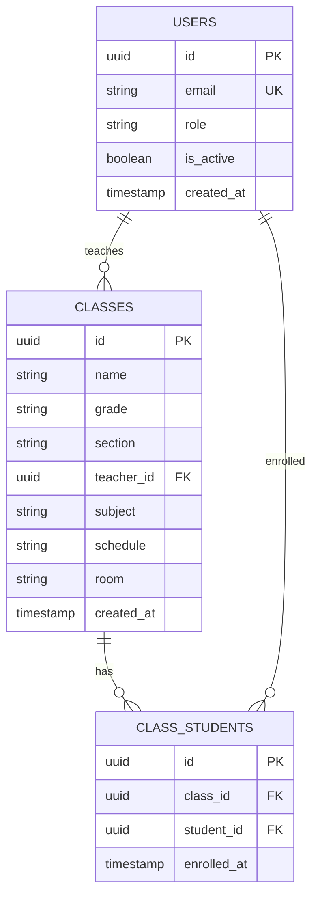
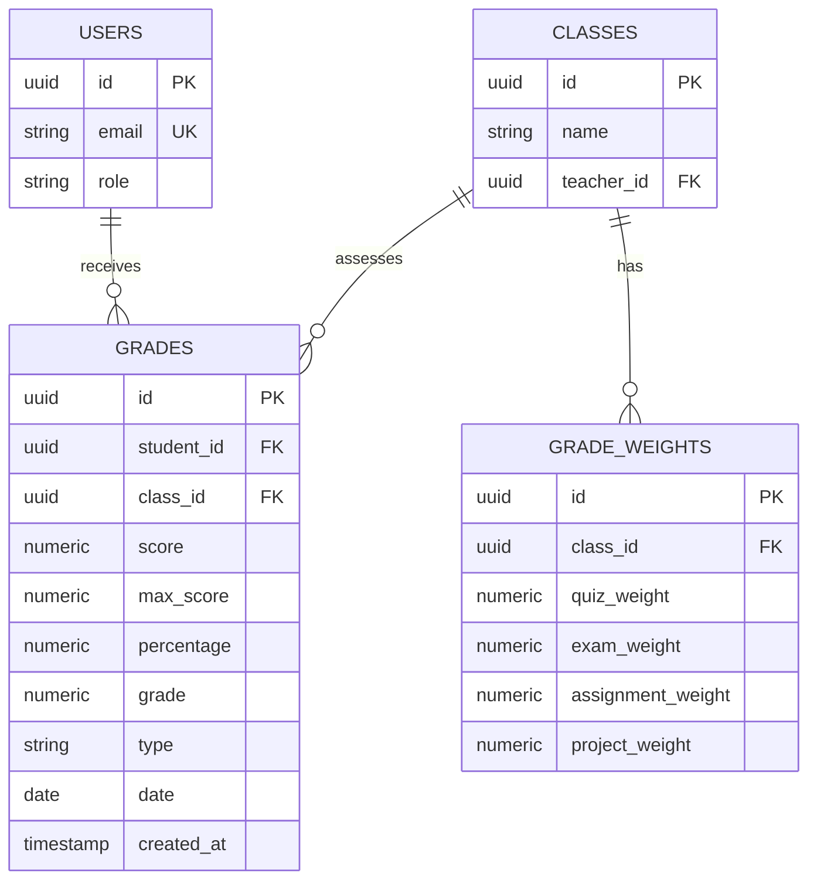
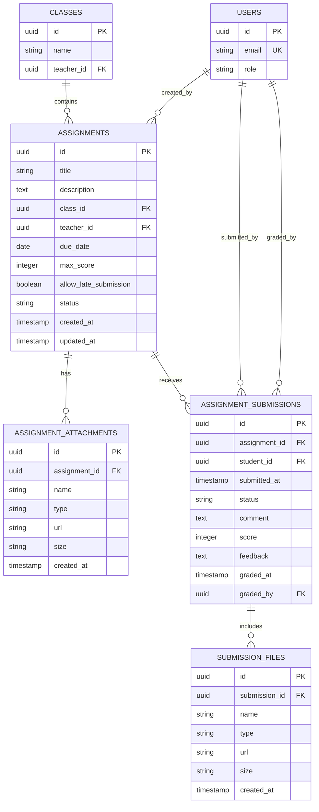
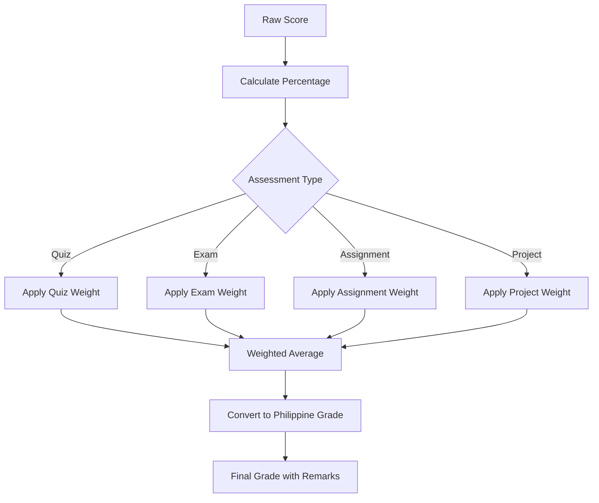
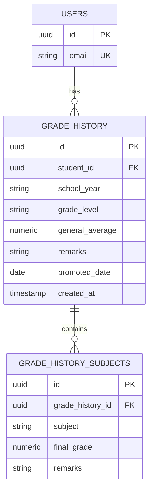
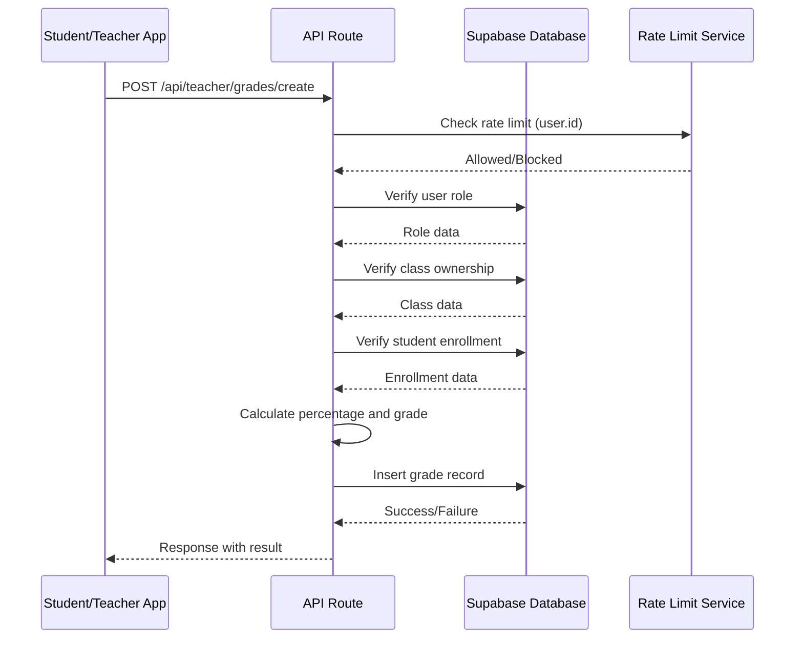
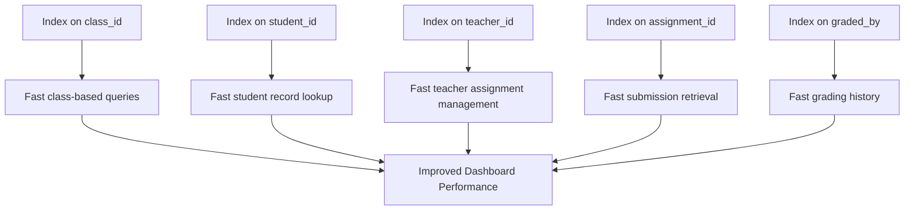

# Academic Records: Classes, Grades, and Assignments

<cite>
**Referenced Files in This Document**   
- [20251219043440_create_classes_table.sql](file://supabase/migrations/20251219043440_create_classes_table.sql)
- [20251219043509_create_grades_tables.sql](file://supabase/migrations/20251219043509_create_grades_tables.sql)
- [20260105082224_create_assignments_table.sql](file://supabase/migrations/20260105082224_create_assignments_table.sql)
- [20251219082305_add_write_policies.sql](file://supabase/migrations/20251219082305_add_write_policies.sql)
- [20251219082251_fix_all_rls_policies_v2.sql](file://supabase/migrations/20251219082251_fix_all_rls_policies_v2.sql)
- [20251219081821_simplify_user_read_policy.sql](file://supabase/migrations/20251219081821_simplify_user_read_policy.sql)
- [20251219082028_fix_teacher_profiles_rls.sql](file://supabase/migrations/20251219082028_fix_teacher_profiles_rls.sql)
- [20251219082036_fix_student_profiles_rls.sql](file://supabase/migrations/20251219082036_fix_student_profiles_rls.sql)
- [20251219082602_fix_update_policies_with_check.sql](file://supabase/migrations/20251219082602_fix_update_policies_with_check.sql)
- [20251219082810_simplify_admin_update_policies.sql](file://supabase/migrations/20251219082810_simplify_admin_update_policies.sql)
- [20260108112143_performance_indexes.sql](file://supabase/migrations/20260108112143_performance_indexes.sql)
- [app/api/teacher/grades/create/route.ts](file://app/api/teacher/grades/create/route.ts)
- [app/api/student/assignments/page.tsx](file://app/api/student/assignments/page.tsx)
- [lib/grade-utils.ts](file://lib/grade-utils.ts)
- [lib/grade-weights-store.ts](file://lib/grade-weights-store.ts)
- [lib/grade-history-store.ts](file://lib/grade-history-store.ts)
</cite>

## Table of Contents
1. [Introduction](#introduction)
2. [Classes Data Model](#classes-data-model)
3. [Grades Data Model](#grades-data-model)
4. [Assignments Data Model](#assignments-data-model)
5. [Security and RLS Policies](#security-and-rls-policies)
6. [Grade Calculation and Weighting](#grade-calculation-and-weighting)
7. [Grade History and Academic Progression](#grade-history-and-academic-progression)
8. [API Integration and Real-World Usage](#api-integration-and-real-world-usage)
9. [Performance and Indexing](#performance-and-indexing)
10. [Conclusion](#conclusion)

## Introduction
This document provides comprehensive documentation for the academic data model in the School Management System, focusing on the core entities: classes, grades, and assignments. The system is built on a PostgreSQL database with Row Level Security (RLS) policies to ensure data privacy and access control. The model supports a complete academic workflow from class enrollment to grade calculation and academic history tracking. This documentation covers the database schema, security policies, business logic, and integration points that enable secure and efficient academic record management.

## Classes Data Model

The classes table serves as the central entity for organizing academic instruction, storing essential information about each class including its name, subject, grade level, section, and assigned teacher. The model establishes relationships with users through the teacher_id foreign key and with students through the class_students junction table, enabling a many-to-many relationship between students and classes.



**Diagram sources**
- [20251219043440_create_classes_table.sql](file://supabase/migrations/20251219043440_create_classes_table.sql)

**Section sources**
- [20251219043440_create_classes_table.sql](file://supabase/migrations/20251219043440_create_classes_table.sql)

## Grades Data Model

The grades table captures individual assessment records for students, with each grade entry containing the student_id, class_id, raw score, maximum possible score, calculated percentage, converted grade, assessment type, and date. The model supports four assessment types: exam, quiz, assignment, and project, allowing for differentiated grading across various academic activities. The percentage and grade fields are calculated server-side to ensure consistency and prevent client manipulation.



**Diagram sources**
- [20251219043509_create_grades_tables.sql](file://supabase/migrations/20251219043509_create_grades_tables.sql)

**Section sources**
- [20251219043509_create_grades_tables.sql](file://supabase/migrations/20251219043509_create_grades_tables.sql)

## Assignments Data Model

The assignments system consists of multiple interconnected tables that support the complete assignment lifecycle from creation to submission and grading. The core assignments table contains metadata about each assignment including title, description, due date, and status. The model extends to support file attachments, student submissions, and submission files, enabling rich academic workflows with document sharing and file submission capabilities.



**Diagram sources**
- [20260105082224_create_assignments_table.sql](file://supabase/migrations/20260105082224_create_assignments_table.sql)

**Section sources**
- [20260105082224_create_assignments_table.sql](file://supabase/migrations/20260105082224_create_assignments_table.sql)

## Security and RLS Policies

The academic data model implements a comprehensive security framework using Row Level Security (RLS) policies to enforce strict access controls. The policy architecture follows the principle of least privilege, ensuring that users can only access data relevant to their role and responsibilities. Students can view their own grades and submitted assignments, while teachers can manage grades and assignments for classes they teach. Administrators have elevated privileges to manage all academic records.

```mermaid
graph TD
A[User Authentication] --> B{User Role}
B --> |Student| C[View Own Grades]
B --> |Student| D[View Own Submissions]
B --> |Student| E[Submit Assignments]
B --> |Teacher| F[Manage Class Grades]
B --> |Teacher| G[Create Assignments]
B --> |Teacher| H[Grade Submissions]
B --> |Admin| I[Full Access]
C --> J[RLS Policy: student_id = auth.uid()]
D --> J
E --> K[RLS Policy: student_id = auth.uid()]
F --> L[RLS Policy: teacher owns class]
G --> L
H --> L
I --> M[RLS Policy: role = 'admin']
```

**Diagram sources**
- [20251219082305_add_write_policies.sql](file://supabase/migrations/20251219082305_add_write_policies.sql)
- [20251219082251_fix_all_rls_policies_v2.sql](file://supabase/migrations/20251219082251_fix_all_rls_policies_v2.sql)
- [20251219081821_simplify_user_read_policy.sql](file://supabase/migrations/20251219081821_simplify_user_read_policy.sql)
- [20251219082028_fix_teacher_profiles_rls.sql](file://supabase/migrations/20251219082028_fix_teacher_profiles_rls.sql)
- [20251219082036_fix_student_profiles_rls.sql](file://supabase/migrations/20251219082036_fix_student_profiles_rls.sql)

**Section sources**
- [20251219082305_add_write_policies.sql](file://supabase/migrations/20251219082305_add_write_policies.sql)
- [20251219082251_fix_all_rls_policies_v2.sql](file://supabase/migrations/20251219082251_fix_all_rls_policies_v2.sql)
- [20251219081821_simplify_user_read_policy.sql](file://supabase/migrations/20251219081821_simplify_user_read_policy.sql)
- [20251219082028_fix_teacher_profiles_rls.sql](file://supabase/migrations/20251219082028_fix_teacher_profiles_rls.sql)
- [20251219082036_fix_student_profiles_rls.sql](file://supabase/migrations/20251219082036_fix_student_profiles_rls.sql)

## Grade Calculation and Weighting

The grading system implements a weighted average calculation model that allows teachers to define custom weight distributions for different assessment types within each class. The grade_weights table stores these configurations, with default weights of 30% for quizzes, 35% for exams, 20% for assignments, and 15% for projects. The system converts raw scores to percentages and then applies the Philippine grading scale to produce final numeric grades with appropriate remarks.



**Diagram sources**
- [20251219043509_create_grades_tables.sql](file://supabase/migrations/20251219043509_create_grades_tables.sql)
- [lib/grade-utils.ts](file://lib/grade-utils.ts)
- [lib/grade-weights-store.ts](file://lib/grade-weights-store.ts)

**Section sources**
- [20251219043509_create_grades_tables.sql](file://supabase/migrations/20251219043509_create_grades_tables.sql)
- [lib/grade-utils.ts](file://lib/grade-utils.ts)
- [lib/grade-weights-store.ts](file://lib/grade-weights-store.ts)

## Grade History and Academic Progression

The grade history system provides longitudinal tracking of student academic performance across school years and grade levels. The grade_history table captures annual summaries including general average and promotion status, while the grade_history_subjects table stores subject-specific final grades and remarks. This model enables comprehensive academic reporting and supports decision-making for student advancement, retention, and academic support interventions.



**Diagram sources**
- [20251219043509_create_grades_tables.sql](file://supabase/migrations/20251219043509_create_grades_tables.sql)
- [lib/grade-history-store.ts](file://lib/grade-history-store.ts)

**Section sources**
- [20251219043509_create_grades_tables.sql](file://supabase/migrations/20251219043509_create_grades_tables.sql)
- [lib/grade-history-store.ts](file://lib/grade-history-store.ts)

## API Integration and Real-World Usage

The academic data model is integrated with API routes that implement business logic and security checks for common academic operations. The teacher/grades/create route demonstrates a comprehensive implementation that includes rate limiting, role verification, class ownership validation, enrollment verification, and server-side grade calculation. These API endpoints serve as the interface between the frontend application and the database, ensuring data integrity and security.



**Diagram sources**
- [app/api/teacher/grades/create/route.ts](file://app/api/teacher/grades/create/route.ts)
- [lib/grade-utils.ts](file://lib/grade-utils.ts)

**Section sources**
- [app/api/teacher/grades/create/route.ts](file://app/api/teacher/grades/create/route.ts)
- [lib/grade-utils.ts](file://lib/grade-utils.ts)

## Performance and Indexing

The academic data model includes strategic indexing to optimize query performance for common access patterns. Indexes are created on foreign key columns (class_id, student_id, teacher_id) and frequently queried fields to ensure efficient data retrieval. The indexing strategy supports the RLS policies by enabling fast lookups for access control checks and improves the performance of academic reporting and dashboard queries.



**Diagram sources**
- [20260108112143_performance_indexes.sql](file://supabase/migrations/20260108112143_performance_indexes.sql)
- [20260105082224_create_assignments_table.sql](file://supabase/migrations/20260105082224_create_assignments_table.sql)

**Section sources**
- [20260108112143_performance_indexes.sql](file://supabase/migrations/20260108112143_performance_indexes.sql)
- [20260105082224_create_assignments_table.sql](file://supabase/migrations/20260105082224_create_assignments_table.sql)

## Conclusion

The academic data model in the School Management System provides a robust foundation for managing classes, grades, and assignments with comprehensive security, data integrity, and performance considerations. The model effectively balances flexibility with standardization, allowing for customized grading schemes while maintaining consistent academic standards. The implementation of Row Level Security ensures that sensitive academic data is protected while enabling appropriate access for students, teachers, and administrators. The integration of business logic in API routes and utility functions ensures data consistency and prevents client-side manipulation. This well-structured data model supports the complete academic workflow from instruction to assessment to academic progression tracking, providing a solid foundation for educational administration and student success monitoring.